# Advanced-potion-making

## Đề bài

### Bước 1: Xác định định dạng thông tin file

<figure markdown>
  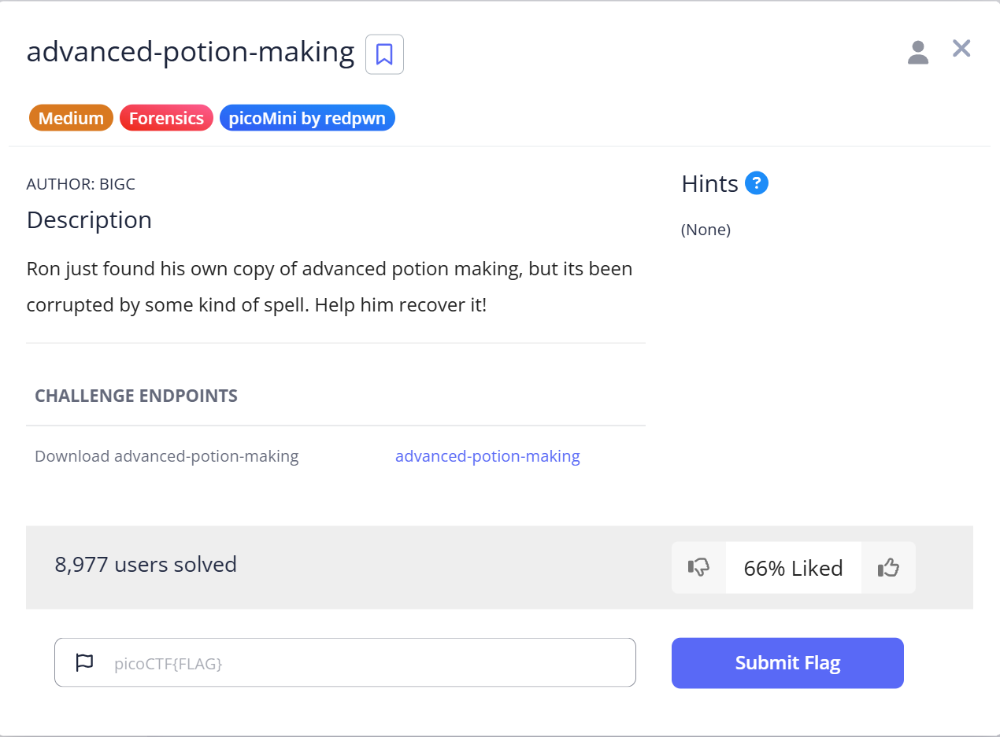
  <figcaption>Hình 1. Nội dung Challenge</figcaption>
</figure>

<figure markdown>
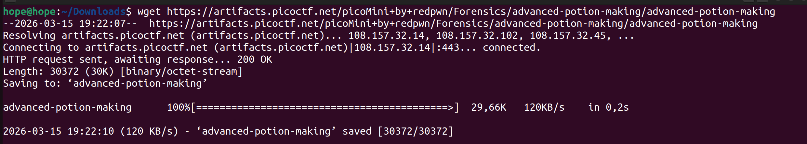 
  <figcaption> Hình 2. Tải file về</figcaption>
</figure>

<figure markdown>
  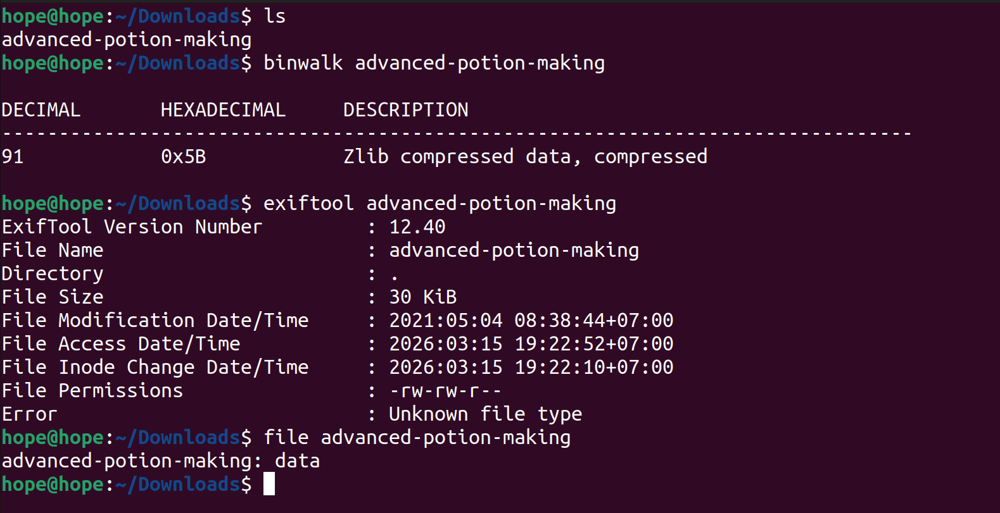
  <figcaption>Hình 3. Xem thông tin file</figcaption>
</figure>


<figure markdown>
  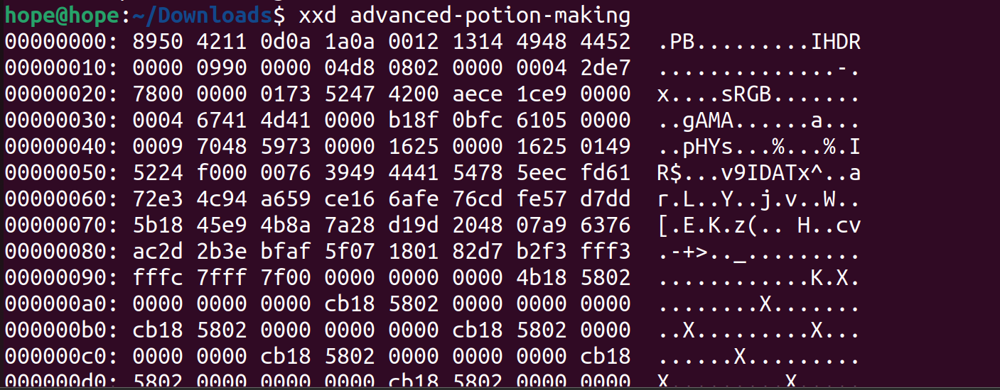    
  <figcaption>Hình 4. Xem các byte bằng xxd</figcaption>
</figure>

### Bước 2: Xác định vấn đề 

- Magic bytes bị sai (4E 47 biến thành 42 11). 
- Chiều dài khối IHDR bị sai (00 00 00 0D biến thành 00 12 13 14).

**Script** sửa tự động:

``` python title="brew_postion.py"
with open("advanced-potion-making", "rb") as f:
data = list(f.read())

# Sửa Magic Bytes: 89 50 4E 47
data[2] = 0x4E
data[3] = 0x47

# Sửa IHDR Length: 00 00 00 0D
data[8] = 0x00
data[9] = 0x00
data[10] = 0x00
data[11] = 0x0D

with open("fixed.png", "wb") as f:
f.write(bytes(data))
```

<figure markdown>
  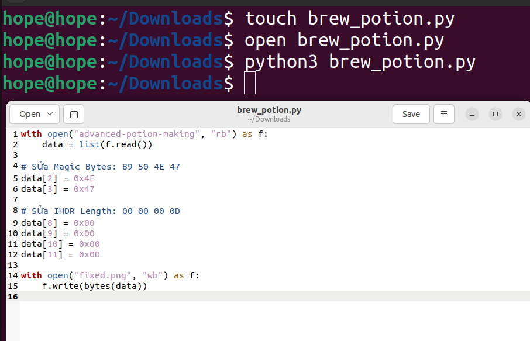
  <figcaption>Hình 5. Sửa các byte cho đúng định dạng</figcaption>
</figure>


### Bước 3: Thực hiện sau khi sửa 

<figure markdown>
  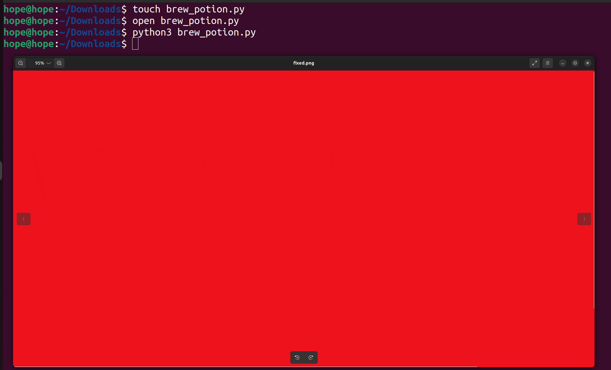
  <figcaption>Hình 6. Sau khi sửa</figcaption>
</figure>

!!! note "Khắc phục"

    Sau khi sửa xong các header, ra được ảnh nhưng không có gì hết, có thể đã được ảnh giấu để tránh lộ thông tin, vì file này có khối IDAT khá lớn (binwalk tìm thấy Zlib tại 0x5B). Ta dùng dùng zsteg để tìm dữ liệu ẩn trong các bit LSB (Least Significant Bit)

<figure markdown>
  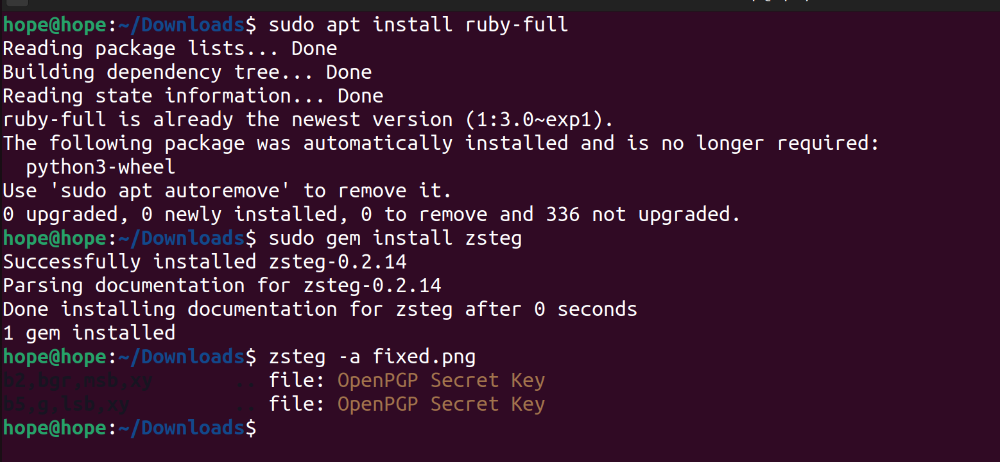
  <figcaption>Hình 7. Cài zsteg để xem các file bị ẩn</figcaption>
</figure>

Cụ thể, nó tìm thấy một `OpenPGP Secret Key` (Khóa bí mật PGP) được giấu ở hai vị trí khác nhau trong cấu trúc pixel:

1. b2,bgr,msb,xy: Bit thứ 2, kênh màu BGR, quét theo hàng ngang (xy).
2. b5,g,lsb,xy: Bit thứ 5, kênh màu Green, quét theo hàng ngang.
Em đã thử trích xuất mảnh ở b2,bgr,msb,xy trước nhưng chỉ chứa các byte rác và hầu 
như không thu được kết quả. Sau đó, có repo chứa tool [stegsolve](https://github.com/eugenekolo/sec-tools/tree/master/stego/stegsolve/stegsolve), giúp hỗ trợ giải mã


<figure markdown>
  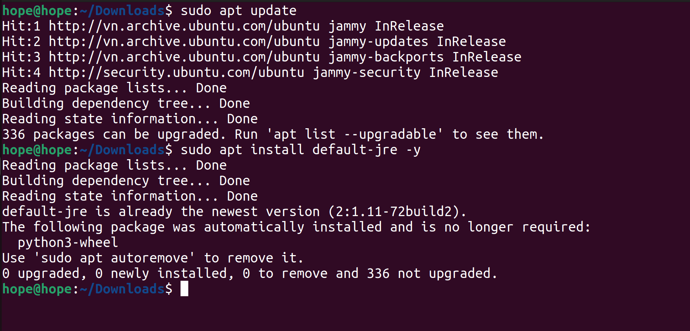
  <figcaption>Hình 8. Cài đặt môi trường java</figcaption>
</figure>

<figure markdown>
  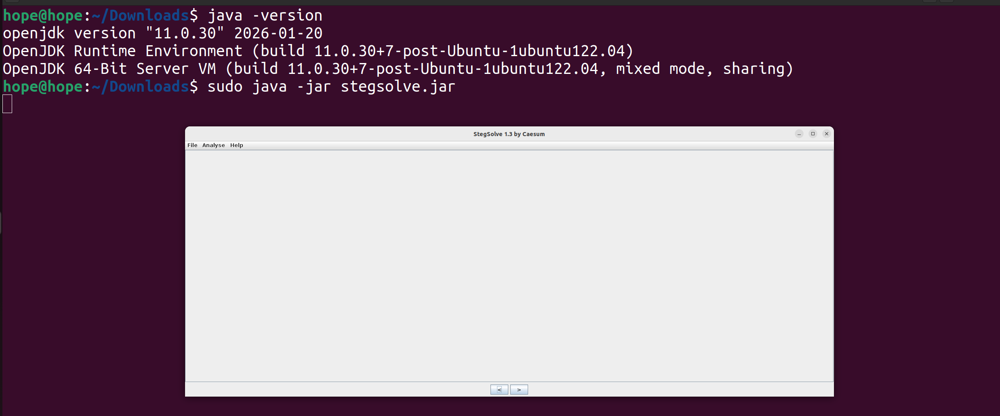
  <figcaption>Hình 9. Dùng java stegsolve để giải</figcaption>
</figure>

## Flag

<figure markdown>
  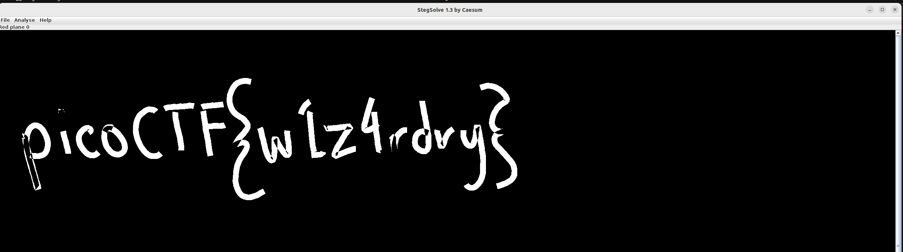
  <figcaption>Hình 10. Flag</figcaption>
</figure>

### Result

<figure markdown>
  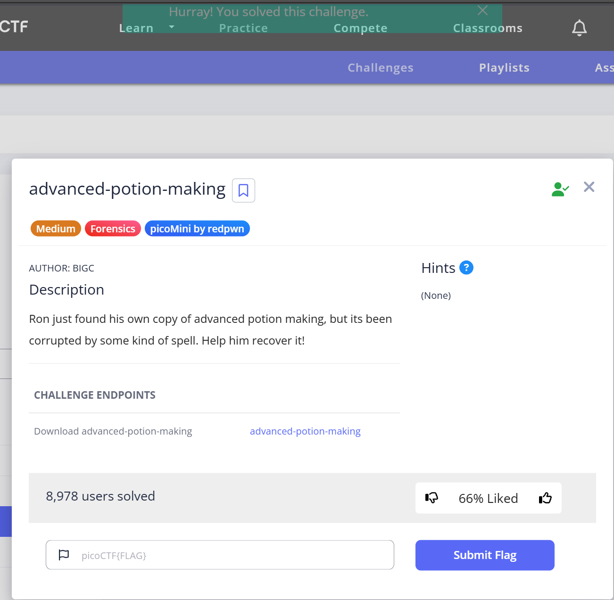
  <figcaption>Hình 11. Thành công</figcaption>
</figure>

``` title="Flag"
picoCTF{w1z4rdry}
```


