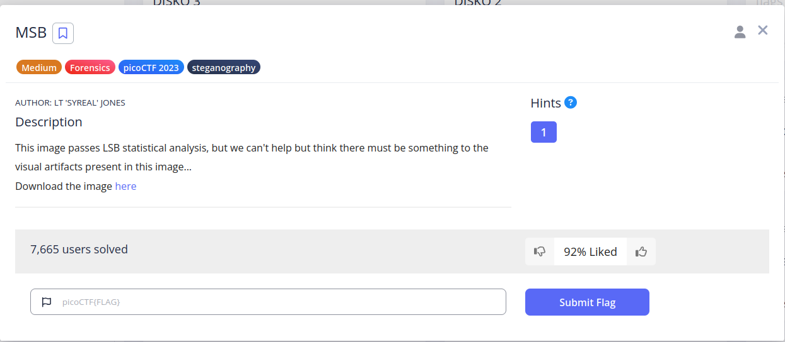
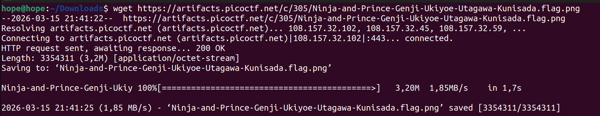
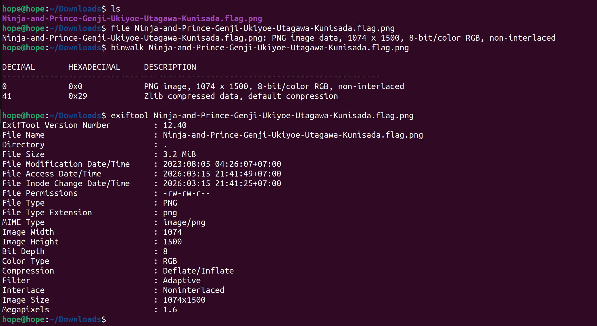
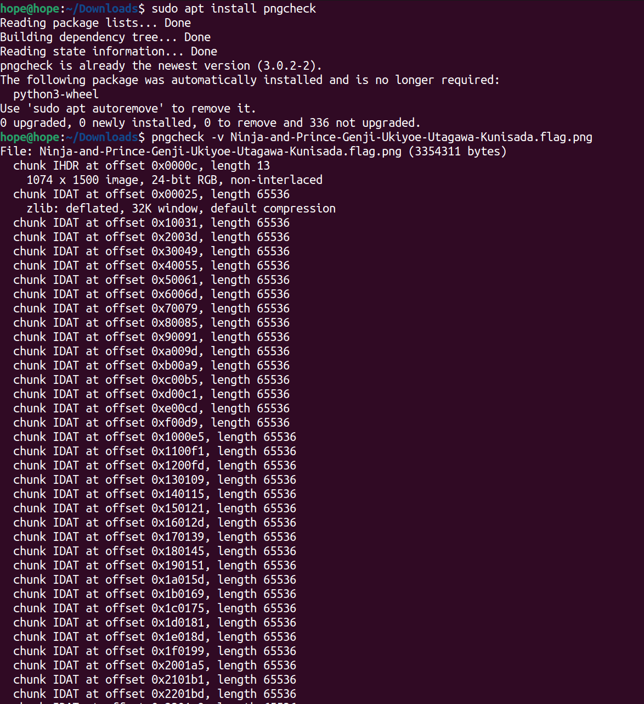
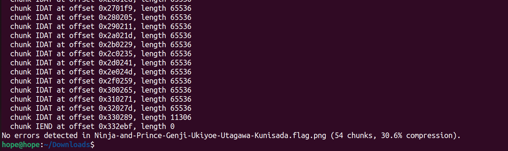
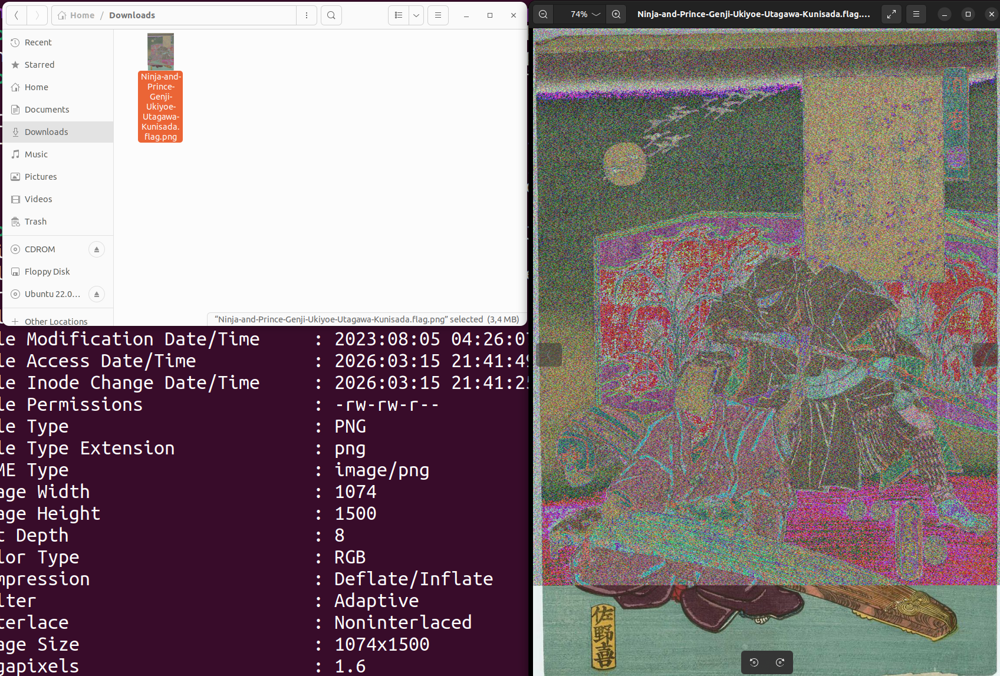
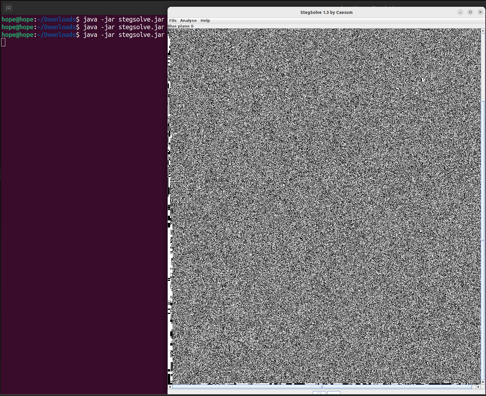
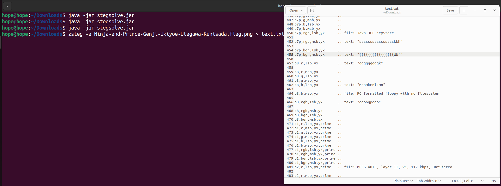
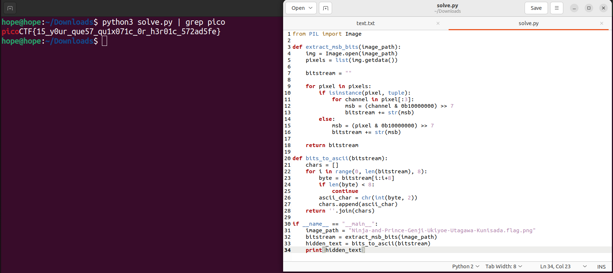

# MSB

## Đề bài

## Bước 1: Xác định định dạng thông tin file

<figure markdown>
  
  <figcaption>Hình 1. Nội dung Challenge</figcaption>
</figure>

!!! info "Mô tả"

    Ảnh vượt qua các bài kiểm tra thống kê LSB thông thường nhưng xuất hiện các "dấu vết thị giác" (visual artifacts) lạ.

<figure markdown>
  
  <figcaption>Hình 2. Tải file</figcaption>
</figure>

<figure markdown>
  
  <figcaption>Hình 3. Xem thông tin file</figcaption>
</figure>

!!! info "Phân tích ban đầu"

    Sử dụng các công cụ cơ bản để kiểm tra cấu trúc file:

    - file: Xác nhận là định dạng PNG chuẩn.
    - binwalk: Không phát hiện dữ liệu ẩn hoặc file đính kèm ở cuối (no trailing data).
    - exiftool: Metadata sạch, không có thông tin nhạy cảm.
    - pngcheck -v: Các khối IDAT hoàn toàn bình thường.


<figure markdown>
  
  <figcaption>Hình 4.1. PNG check</figcaption>
</figure>

<figure markdown>
  
  <figcaption>Hình 4.2. PNG check</figcaption>
</figure>


<figure markdown>
  
  <figcaption>Hình 5. Ảnh hiện thị ban đầu</figcaption>
</figure>

## Bước 2: Dùng các công cụ 

### Dùng stegsolve 

<figure markdown>
  
  <figcaption>Hình 6. Dùng stegsolve vẫn không ra</figcaption>
</figure>

### Dùng zsteg

<figure markdown>
  
  <figcaption>Hình 7. Dùng zsteg vẫn không ra
</figcaption>
</figure>

## Bước 3: Hướng tiếp cận khác 

!!! note "Note"

    Gợi ý về "visual artifacts" và việc LSB bị loại bỏ cho thấy kỹ thuật giấu tin nằm ở các bit có trọng số cao hơn. Cụ thể là MSB (Most Significant Bit - Bit 7). Khi thay đổi bit này, màu sắc của ảnh sẽ bị biến đổi nhẹ tạo ra các dải nhiễu mà mắt thường có thể lờ mờ nhận ra. Chúng ta xây dựng một script Python để trích xuất bit thứ 7 (MSB) từ mỗi kênh màu (R, G, B) của từng pixel, sau đó ghép lại thành chuỗi nhị phân và chuyển đổi sang định dạng ASCII.

**Script** tự động:

``` python title="solve.py"
from PIL import Image

def extract_msb_bits(image_path):
    img = Image.open(image_path)
    pixels = list(img.getdata())
    
    bitstream = ""

    for pixel in pixels:
        if isinstance(pixel, tuple):
            for channel in pixel[:3]: 
                msb = (channel & 0b10000000) >> 7
                bitstream += str(msb)
        else:
            msb = (pixel & 0b10000000) >> 7
            bitstream += str(msb)

    return bitstream

def bits_to_ascii(bitstream):
    chars = []
    for i in range(0, len(bitstream), 8):
        byte = bitstream[i:i+8]
        if len(byte) < 8:
            continue
        ascii_char = chr(int(byte, 2))
        chars.append(ascii_char)
    return ''.join(chars)

if __name__ == "__main__":
    image_path = "Ninja-and-Prince-Genji-Ukiyoe-Utagawa-Kunisada.flag.png" 
    bitstream = extract_msb_bits(image_path)
    hidden_text = bits_to_ascii(bitstream)
    print(hidden_text)
```

## Flag

<figure markdown>
  
  <figcaption>Hình 8. Kết quả Flag</figcaption>
</figure>


``` title="Flag"
picoCTF{15_y0ur_que57_qu1x071c_0r_h3r01c_3a219174}
```


