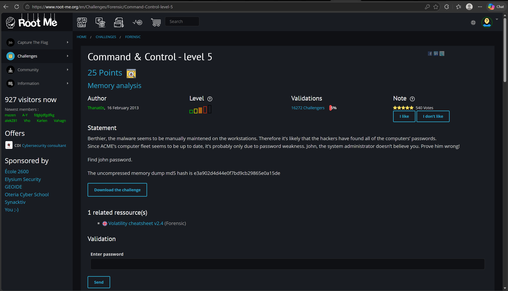
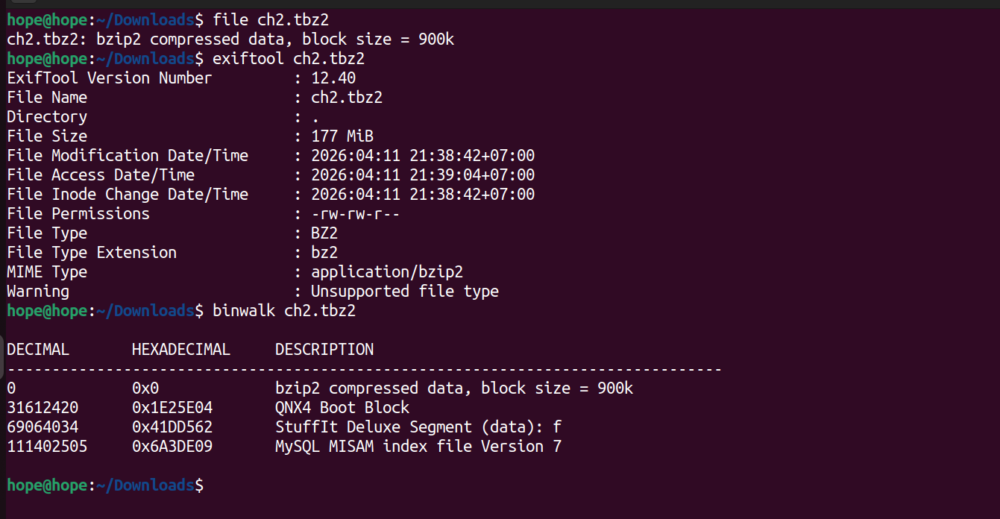
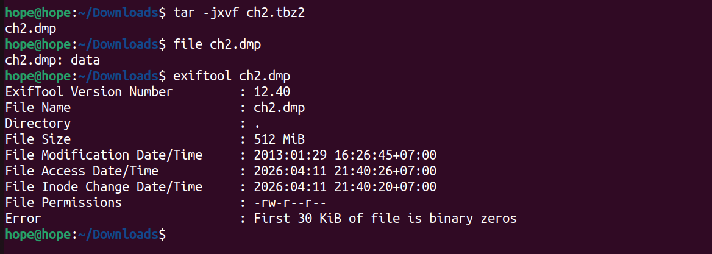
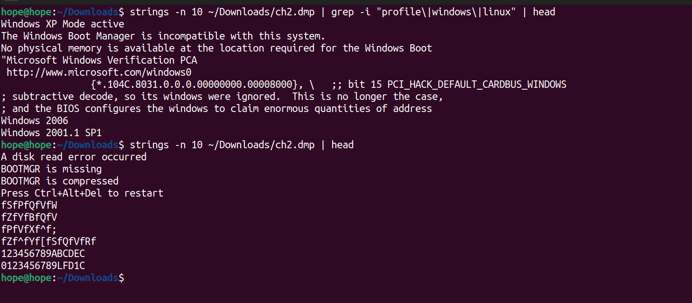
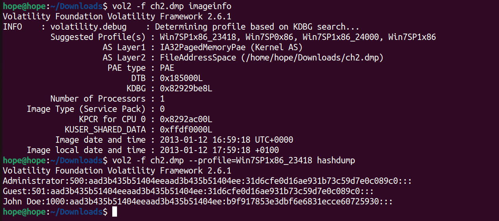
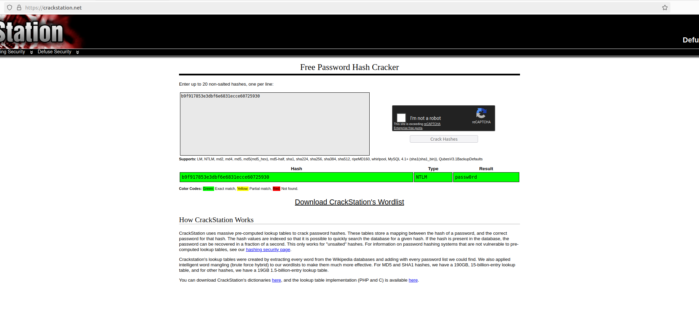
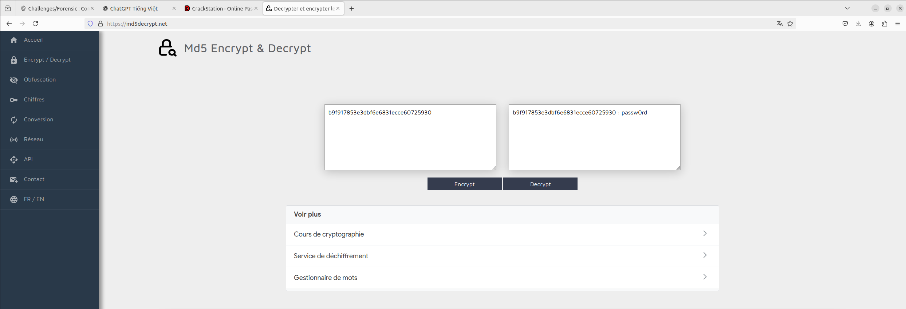
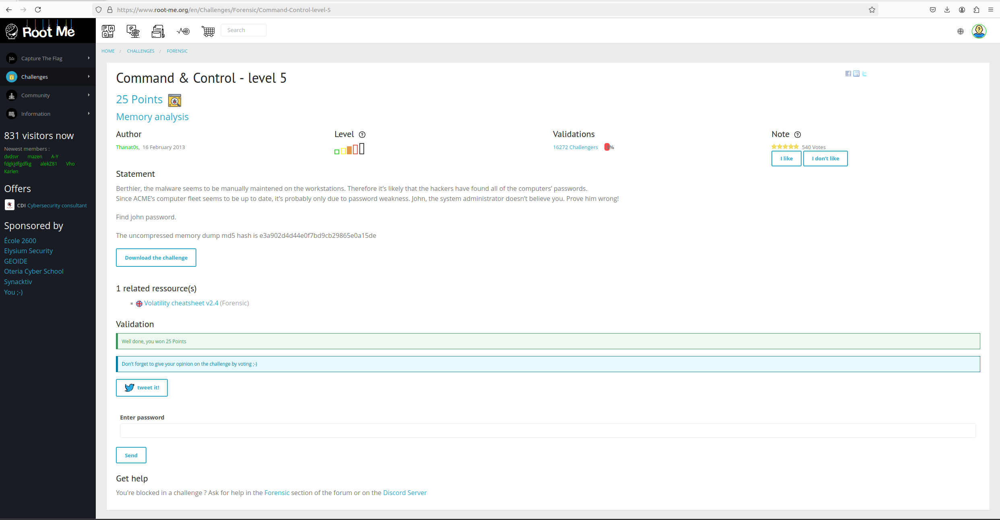

# Command & Control - level 5

## Đề bài



**Statement**
>Berthier, the malware seems to be manually maintened on the workstations. Therefore it’s likely that the hackers have found all of the computers’ passwords.
>Since ACME’s computer fleet seems to be up to date, it’s probably only due to password weakness. John, the system administrator doesn’t believe you. Prove him wrong!

**Find john password.**

### Bước 1: Xác định định dạng thông tin file

``` bash
     hope@hope:~/Downloads$ file ch2.tbz2 
     ch2.tbz2: bzip2 compressed data, block size = 900k
     hope@hope:~/Downloads$ exiftool ch2.tbz2 
     ExifTool Version Number         : 12.40
     File Name                       : ch2.tbz2
     Directory                       : .
     File Size                       : 177 MiB
     File Modification Date/Time     : 2026:04:11 21:38:42+07:00
     File Access Date/Time           : 2026:04:11 21:39:04+07:00
     File Inode Change Date/Time     : 2026:04:11 21:38:42+07:00
     File Permissions                : -rw-rw-r--
     File Type                       : BZ2
     File Type Extension             : bz2
     MIME Type                       : application/bzip2
     Warning                         : Unsupported file type
     hope@hope:~/Downloads$ binwalk ch2.tbz2

     DECIMAL       HEXADECIMAL     DESCRIPTION
     --------------------------------------------------------------------------------
     0             0x0             bzip2 compressed data, block size = 900k
     31612420      0x1E25E04       QNX4 Boot Block
     69064034      0x41DD562       StuffIt Deluxe Segment (data): f
     111402505     0x6A3DE09       MySQL MISAM index file Version 7
```


>Ta thấy rằng file được nén bằng thuật toán bzip2 và binwalk cũng phát hiện được MySQL 
>MISAM version 7, tức là có thể lưu mật khẩu trong database.

Nhưng Artifact MySQL MISAM được phát hiện nhưng không cần thiết cho việc khai thác,
do password đã có thể trích xuất trực tiếp từ memory dump.

### Bước 2: Giải nén ra và xem định dạng file đã giải nén


``` bash
     hope@hope:~/Downloads$ file ch2.dmp 
     ch2.dmp: data
     hope@hope:~/Downloads$ exiftool ch2.dmp 
     ExifTool Version Number         : 12.40
     File Name                       : ch2.dmp
     Directory                       : .
     File Size                       : 512 MiB
     File Modification Date/Time     : 2013:01:29 16:26:45+07:00
     File Access Date/Time           : 2026:04:11 21:40:26+07:00
     File Inode Change Date/Time     : 2026:04:11 21:40:20+07:00
     File Permissions                : -rw-r--r--
     Error                           : First 30 KiB of file is binary zeros
     hope@hope:~/Downloads$ binwalk ch2.dmp 

     DECIMAL       HEXADECIMAL     DESCRIPTION
     --------------------------------------------------------------------------------
     154592        0x25BE0         Microsoft executable, portable (PE)
     158980        0x26D04         Certificate in DER format (x509 v3), header length: 4, sequence length: 1697
     162035        0x278F3         Certificate in DER format (x509 v3), header length: 4, sequence length: 1697
     512203        0x7D0CB         Certificate in DER format (x509 v3), header length: 4, sequence length: 1697
     1169571       0x11D8A3        Cisco IOS microcode, for "S"
     1276741       0x137B45        Minix filesystem, V1, little endian, 97 zones
     1671168       0x198000        Microsoft executable, portable (PE)
     1802240       0x1B8000        Microsoft executable, portable (PE)
     2205955       0x21A903        Certificate in DER format (x509 v3), header length: 4, sequence length: 2732
     2347336       0x23D148        Base64 standard index table
     2359627       0x24014B        LZMA compressed data, properties: 0x8B, dictionary size: 0 bytes, uncompressed size: 72 bytes
     2396154       0x248FFA        LZMA compressed data, properties: 0xA3, dictionary size: 0 bytes, uncompressed size: 137 bytes
     2507180       0x2641AC        Intel x86 or x64 microcode, sig 0x00000001, pf_mask 0x00, 1CE0-09-12, rev 0x-001, size 2048
     2887664       0x2C0FF0        LZMA compressed data, properties: 0x66, dictionary size: 0 bytes, uncompressed size: 26368 bytes
     3248128       0x319000        Microsoft executable, portable (PE)
     3383269       0x339FE5        Copyright string: "Copyright (c) 1997 Microsof1]:0),i&&t&&(n.extend(u.attr,{width:i,height:t}),n.extend(u.initParams,{v:h,mkt:it}),v=[],n.each(u.in"
     3784704       0x39C000        Microsoft executable, portable (PE)
     4251820       0x40E0AC        Certificate in DER format (x509 v3), header length: 4, sequence length: 2244
     4251989       0x40E155        Digi International firmware, load address: 0x204D6963, entry point: 0x66742053,
     4253150       0x40E5DE        Copyright string: "Copyright (c)1996 VeriSign, Inc.  All Rights Reserved. CERTAIN"
     4634111       0x46B5FF        Copyright string: "Copyright (C) 2000 Microsoft Corporation"
     4992047       0x4C2C2F        Intel x86 or x64 microcode, sig 0x46665006, pf_mask 0xba372a99, 1A00-03-02, rev 0x7d00, size 33686272
     5054864       0x4D2190        HTML document header
     5054904       0x4D21B8        XML document, version: "1.0"
     5279744       0x509000        Microsoft executable, portable (PE)
     5439497       0x530009        Certificate in DER format (x509 v3), header length: 4, sequence length: 1555
     5441060       0x530624        Certificate in DER format (x509 v3), header length: 4, sequence length: 1298
     ...
```

Ở đây ta thấy được ta có quyền đọc và ghi file nên ta có thể duyệt một lượt sơ

### Bước 3: Dùng strings và grep để tìm kiếm nhanh profile của máy file được dump

Ta thấy được đây là window XP 2006, 2001.1SP1

``` bash
     hope@hope:~/Downloads$ strings -n 10 ~/Downloads/ch2.dmp | grep -i "profile/|windows/|linux" | head
     Windows XP Mode active
     The Windows Boot Manager is incompatible with this system.
     No physical memory is available at the location required for the Windows Boot
     "Microsoft Windows Verification PCA
     http://www.microsoft.com/windows0
                    {*.104C.8031.0.0.0.00000000.00008000}, /   ;; bit 15 PCI_HACK_DEFAULT_CARDBUS_WINDOWS
     ; subtractive decode, so its windows were ignored.  This is no longer the case,
     ; and the BIOS configures the windows to claim enormous quantities of address
     Windows 2006
     Windows 2001.1 SP1
     hope@hope:~/Downloads$ strings -n 10 ~/Downloads/ch2.dmp | head
     A disk read error occurred
     BOOTMGR is missing
     BOOTMGR is compressed
     Press Ctrl+Alt+Del to restart
     fSfPfQfVfW
     fZfYfBfQfV
     fPfVfXf^f;
     fZf^fYf[fSfQfVfRf
     123456789ABCDEC
     0123456789LFD1C
```


**Dùng volatility2 để xác định thông tin và dùng hashdump để xem mật khẩu**

Sử dụng imageinfo để xác định profile phù hợp. Chọn Win7SP1x86_23418 vì đây là profile được đề xuất và cho kết quả chính xác.

``` bash
     hope@hope:~/Downloads$ vol2 -f ch2.dmp imageinfo
     Volatility Foundation Volatility Framework 2.6.1
     INFO    : volatility.debug    : Determining profile based on KDBG search...
               Suggested Profile(s) : Win7SP1x86_23418, Win7SP0x86, Win7SP1x86_24000, Win7SP1x86
                         AS Layer1 : IA32PagedMemoryPae (Kernel AS)
                         AS Layer2 : FileAddressSpace (/home/hope/Downloads/ch2.dmp)
                         PAE type : PAE
                              DTB : 0x185000L
                              KDBG : 0x82929be8L
               Number of Processors : 1
          Image Type (Service Pack) : 0
                    KPCR for CPU 0 : 0x8292ac00L
               KUSER_SHARED_DATA : 0xffdf0000L
               Image date and time : 2013-01-12 16:59:18 UTC+0000
          Image local date and time : 2013-01-12 17:59:18 +0100
     hope@hope:~/Downloads$ vol2 -f ch2.dmp --profile=Win7SP1x86_23418 hashdump
     Volatility Foundation Volatility Framework 2.6.1
     Administrator:500:aad3b435b51404eeaad3b435b51404ee:31d6cfe0d16ae931b73c59d7e0c089c0:::
     Guest:501:aad3b435b51404eeaad3b435b51404ee:31d6cfe0d16ae931b73c59d7e0c089c0:::
     John Doe:1000:aad3b435b51404eeaad3b435b51404ee:b9f917853e3dbf6e6831ecce60725930:::
```

>Với MISAM ban đầu ta được thấy, có thể trích xuất nhanh được và xác định được mật khẩu được mã hóa md5, nên đoạn sau “:” của John ta có thể crack được và xem thông tin mật khẩu

Dùng crackstation để decode

Hash thu được là NTLM hash. Có thể crack bằng wordlist hoặc tra cứu online.

## Flag

``` title="Flag"
passw0rd
```

## Ảnh quy trình tương ứng
















