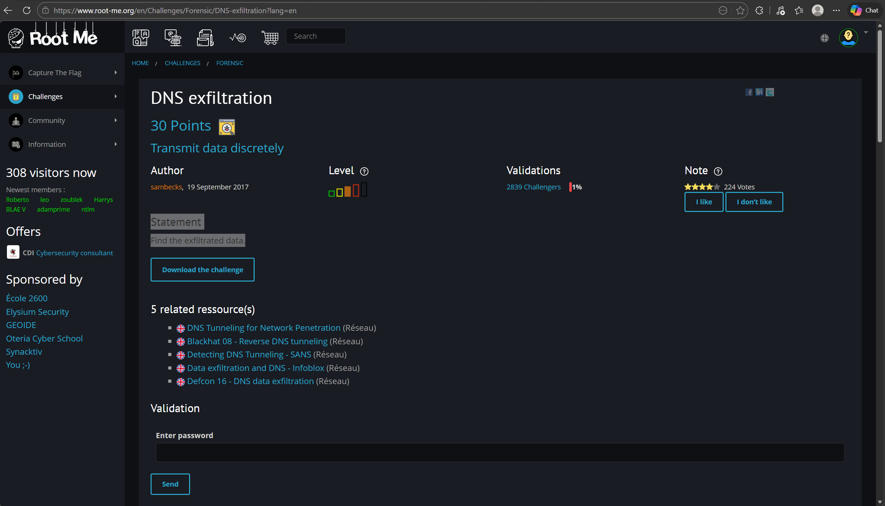
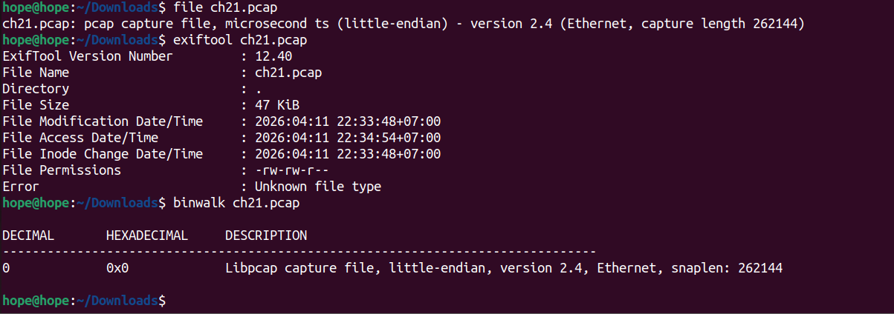
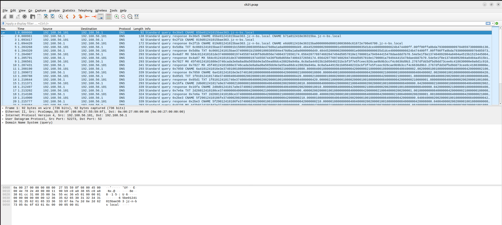
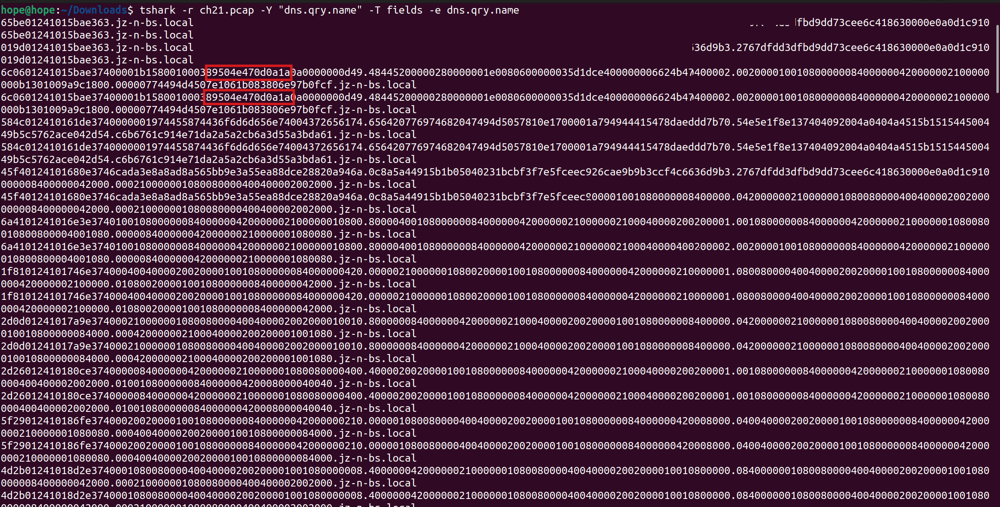
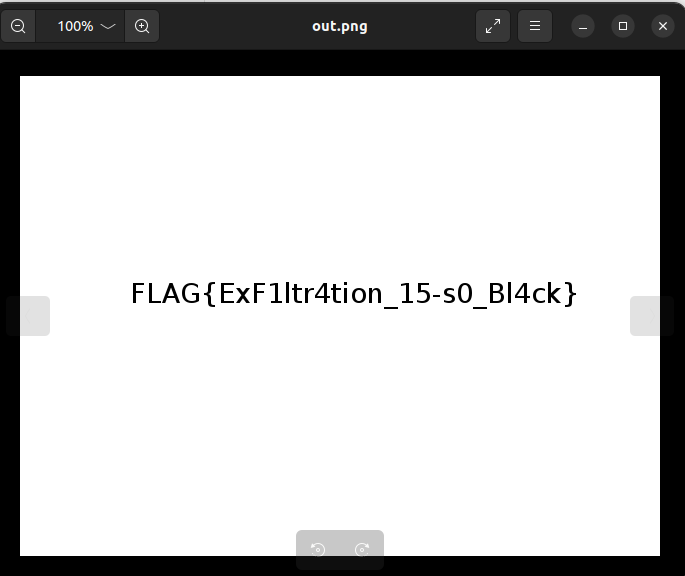
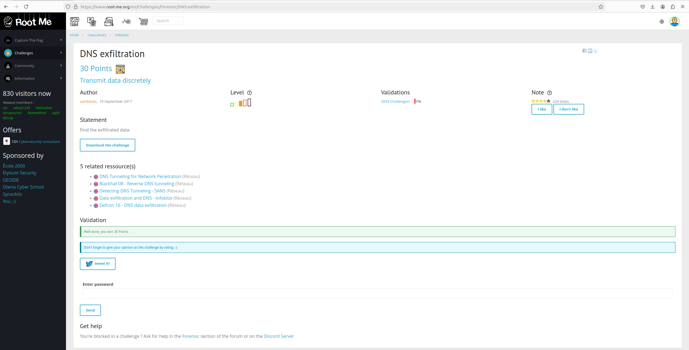

# DNS Exfiltration

## Đề bài



!!! info "Statement"
    Find the exfiltrated data.

### Bước 1: Xác định định dạng thông tin file



Ta thấy được đây là định dạng Pcap, có quyền đọc và ghi, được viết dạng **little-endian, version 2.4**

## Bước 2: Dùng wireshark để mở file



Ở đây ta thấy được toàn bộ gói tin đều dùng giao thức `DNS`, và nội dung thông tin gói tin đều chứa DNS, Cname: .local, … 

Attacker sử dụng DNS query để exfiltrate dữ liệu bằng cách encode dữ liệu
thành subdomain. Do DNS traffic thường được cho phép, đây là kỹ thuật bypass firewall phổ biến.

## Bước 3: Dùng tshark để filter query dns name

``` bash
    hope@hope:~/Downloads$ tshark -r ch21.pcap -Y "dns.qry.name" -T fields -e dns.qry.name
    65be01241015bae363.jz-n-bs.local
    65be01241015bae363.jz-n-bs.local
    019d01241015bae363.jz-n-bs.local
    019d01241015bae363.jz-n-bs.local
    6c0601241015bae37400001b158001000389504e470d0a1a0a0000000d49.48445200000280000001e0080600000035d1dce400000006624b474400ff.00ff00ffa0bda793000000097048597300000b1300000b1301009a9c1800.00000774494d4507e1061b083806e97b0fcf.jz-n-bs.local
    6c0601241015bae37400001b158001000389504e470d0a1a0a0000000d49.48445200000280000001e0080600000035d1dce400000006624b474400ff.00ff00ffa0bda793000000097048597300000b1300000b1301009a9c1800.00000774494d4507e1061b083806e97b0fcf.jz-n-bs.local
    584c012410161de3740000001974455874436f6d6d656e74004372656174.656420776974682047494d5057810e1700001a794944415478daeddd7b70.54e5e1f8e137404092004a0404a4515b151544500449b5c5762ace042d54.c6b6761c914e71da2a5a2cb6a3d55a3bda61.jz-n-bs.local
    584c012410161de3740000001974455874436f6d6d656e74004372656174.656420776974682047494d5057810e1700001a794944415478daeddd7b70.54e5e1f8e137404092004a0404a4515b151544500449b5c5762ace042d54.c6b6761c914e71da2a5a2cb6a3d55a3bda61.jz-n-bs.local
    45f40124101680e3746cada3e8a8ad8a565bb9e3a55ea88dce28820a946a.0c8a5a44915b1b05040231bcbf3f7e5fceec926cae9b9b3ccf4c6636d9b3.2767dfdd3dfbd9dd73cee6c418630000e0a0d1c910000008400000042000.000210000001080080000400400002002000.jz-n-bs.local
    45f40124101680e3746cada3e8a8ad8a565bb9e3a55ea88dce28820a946a.0c8a5a44915b1b05040231bcbf3f7e5fceec926cae9b9b3ccf4c6636d9b3.2767dfdd3dfbd9dd73cee6c418630000e0a0d1c910000008400000042000.000210000001080080000400400002002000.jz-n-bs.local
    6a4101241016e3e374010010800000084000000420000002100000010800.800004001080000008400000042000000210000001080080000400400002.002000010010800000084000000420000002100000010800800004001080.000008400000042000000210000001080080.jz-n-bs.local
    6a4101241016e3e374010010800000084000000420000002100000010800.800004001080000008400000042000000210000001080080000400400002.002000010010800000084000000420000002100000010800800004001080.000008400000042000000210000001080080.jz-n-bs.local
    1f810124101746e374000400400002002000010010800000084000000420.000002100000010800200001001080000008400000042000000210000001.080080000400400002002000010010800000084000000420000002100000.010800200001001080000008400000042000.jz-n-bs.local
    1f810124101746e374000400400002002000010010800000084000000420.000002100000010800200001001080000008400000042000000210000001.080080000400400002002000010010800000084000000420000002100000.010800200001001080000008400000042000.jz-n-bs.local
    2d0d01241017a9e374000210000001080080000400400002002000010010.800000084000000420000002100040000200200001001080000008400000.042000000210000001080080000400400002002000010010800000084000.000420000002100040000200200001001080.jz-n-bs.local
    2d0d01241017a9e374000210000001080080000400400002002000010010.800000084000000420000002100040000200200001001080000008400000.042000000210000001080080000400400002002000010010800000084000.000420000002100040000200200001001080.jz-n-bs.local
    2d26012410180ce374000008400000042000000210000001080080000400.400002002000010010800000084000000420000002100040000200200001.001080000008400000042000000210000001080080000400400002002000.010010800000084000000420008000040040.jz-n-bs.local
    2d26012410180ce374000008400000042000000210000001080080000400.400002002000010010800000084000000420000002100040000200200001.001080000008400000042000000210000001080080000400400002002000.010010800000084000000420008000040040.jz-n-bs.local
    5f29012410186fe374000200200001001080000008400000042000000210.000001080080000400400002002000010010800000084000000420008000.040040000200200001001080000008400000042000000210000001080080.000400400002002000010010800000084000.jz-n-bs.local
    5f29012410186fe374000200200001001080000008400000042000000210.000001080080000400400002002000010010800000084000000420008000.040040000200200001001080000008400000042000000210000001080080.000400400002002000010010800000084000.jz-n-bs.local
    4d2b01241018d2e374000108008000040040000200200001001080000008.400000042000000210000001080080000400400002002000010010800000.084000000108008000040040000200200001001080000008400000042000.000210000001080080000400400002002000.jz-n-bs.local
    4d2b01241018d2e374000108008000040040000200200001001080000008.400000042000000210000001080080000400400002002000010010800000.084000000108008000040040000200200001001080000008400000042000.000210000001080080000400400002002000.jz-n-bs.local
    131f0124101935e374010010800000021000000108008000040040000200.200001001080000008400000042000000210000001080080000400400002.002000010010800000021000000108008000040040000200200001001080.000008400000042000000210000001080080.jz-n-bs.local
    131f0124101935e374010010800000021000000108008000040040000200.200001001080000008400000042000000210000001080080000400400002.002000010010800000021000000108008000040040000200200001001080.000008400000042000000210000001080080.jz-n-bs.local
    52440124101998e374000400400002002000010010800000021000000108.008000040040000200200001001080000008400000042000000210000001.0800800004004000020020000100042000000210bea056ad5a152ebbecb2.307cf8f050585818ba75eb167272720c4c1d.jz-n-bs.local
    52440124101998e374000400400002002000010010800000021000000108.008000040040000200200001001080000008400000042000000210000001.0800800004004000020020000100042000000210bea056ad5a152ebbecb2.307cf8f050585818ba75eb167272720c4c1d.jz-n-bs.local
    1ba401241019fbe374727272921fd713dc1fb3b57c393939a15bb76ea1b0.b0309c72ca2961ead4a961d5aa556efcd6b8fd628cd13074fc954443d576.73a75e3e1b77876f7ffbdb61f1e2c52184104a4a4ac2134f3cd1e879ecdb.b72f3cfef8e3e1c9279f0cafbcf24ad8bc79.jz-n-bs.local
    1ba401241019fbe374727272921fd713dc1fb3b57c393939a15bb76ea1b0.b0309c72ca2961ead4a961d5aa556efcd6b8fd628cd13074fc954443d576.73a75e3e1b77876f7ffbdb61f1e2c52184104a4a4ac2134f3cd1e879ecdb.b72f3cfef8e3e1c9279f0cafbcf24ad8bc79.jz-n-bs.local
    426f0124101a5ee37473d8be7d7be8d9b367282a2a0a679c714698387162.183b766ca3aeff4b2fbd14ce3efbec505555d5a0b169ecf866731cb3791b.6fdcb831ac5cb932ed67fdfaf50d5ede6cdf479aabaaaa2a8c1a352aed89.221bcbd5deae674b68ee7d211bf7c7d6bebe.jz-n-bs.local
    426f0124101a5ee37473d8be7d7be8d9b367282a2a0a679c714698387162.183b766ca3aeff4b2fbd14ce3efbec505555d5a0b169ecf866731cb3791b.6fdcb831ac5cb932ed67fdfaf50d5ede6cdf479aabaaaa2a8c1a352aed89.221bcbd5deae674b68ee7d211bf7c7d6bebe.jz-n-bs.local
    10550124101ac1e374b7df7e7b78f2c927c3071f7c104208a1a8a8289494.94842bafbc321c71c411adba4ececfcf0f03070e0ca3478f0e53a64c0967.9d7556d6ef8f2df5f86889c74b6d63959b9b1b4a4b4b437171b127f89614.e9f042080dfea9eff2cdb565cb96989b9b9b.jz-n-bs.local
    10550124101ac1e374b7df7e7b78f2c927c3071f7c104208a1a8a8289494.94842bafbc321c71c411adba4ececfcf0f03070e0ca3478f0e53a64c0967.9d7556d6ef8f2df5f86889c74b6d63959b9b1b4a4b4b437171b127f89614.e9f042080dfea9eff2cdb565cb96989b9b9b.jz-n-bs.local
    46560124101b24e374ccaf4b972e71d3a64d8d9ac7cb2fbf1c870c19d2a0.eb73fcf1c7c7279f7cb2c1f32e2929492e3b61c284585e5e1ef7ecd993b5.f1cdd638b6e46ddc94e56dcdfb50435c77dd750dbe0ed9bc9e07c3faa235.ee8fad65c99225f1b0c30ecbb86cbd7bf78e.jz-n-bs.local
    46560124101b24e374ccaf4b972e71d3a64d8d9ac7cb2fbf1c870c19d2a0.eb73fcf1c7c7279f7cb2c1f32e2929492e3b61c284585e5e1ef7ecd993b5.f1cdd638b6e46ddc94e56dcdfb50435c77dd750dbe0ed9bc9e07c3faa235.ee8fad65c99225f1b0c30ecbb86cbd7bf78e.jz-n-bs.local
    31580124101b87e374fff8c73fdaf4f17ad96597c5eaeaeaacde1f1bf3f8.c8d6f56c8e3d7bf6c4356bd6c489132726f31b3f7ebc27f7965e1718822f.d60abd2d1fc431c678db6db7d558f1dc7aebad0dbefc9c397362b76edd92.cb4e9c38312e58b0207ef4d147b1b2b2326e.jz-n-bs.local
    31580124101b87e374fff8c73fdaf4f17ad96597c5eaeaeaacde1f1bf3f8.c8d6f56c8e3d7bf6c4356bd6c489132726f31b3f7ebc27f7965e1718822f.d60abd2d1fc431c678db6db7d558f1dc7aebad0dbefc9c397362b76edd92.cb4e9c38312e58b0207ef4d147b1b2b2326e.jz-n-bs.local
    049e0124101beae374d9b225bef4d24bf1f2cb2f8f3d7bf66cf472f7eddb.37b9ccbbefbedbeae3d356b771fffefd63494949bce1861be2e38f3f1e37.6cd8d0610370f9f2e5b173e7ce313f3f3feb01783068ee7da1a38c695959.592c282888218498979717efb9e79e585151.jz-n-bs.local
    049e0124101beae374d9b225bef4d24bf1f2cb2f8f3d7bf66cf472f7eddb.37b9ccbbefbedbeae3d356b771fffefd63494949bce1861be2e38f3f1e37.6cd8d0610370f9f2e5b173e7ce313f3f3feb01783068ee7da1a38c695959.592c282888218498979717efb9e79e585151.jz-n-bs.local
    041c0124101c4de374112b2a2ae23df7dc13f3f2f2620821161414c4b7de.7aab551eaf9f7ffe795cb76e5dbcf3ce3b63af5ebd9269eeb8e38eac8d73.631f1fed2100f75bbb766d32bf7efdfa79b00a403a52000e1b36ac46000e.1d3ab441975dbd7a753ce490439215767def.jz-n-bs.local
    041c0124101c4de374112b2a2ae23df7dc13f3f2f2620821161414c4b7de.7aab551eaf9f7ffe795cb76e5dbcf3ce3b63af5ebd9269eeb8e38eac8d73.631f1fed2100f75bbb766d32bf7efdfa79b00a403a52000e1b36ac46000e.1d3ab441975dbd7a753ce490439215767def.jz-n-bs.local
    01e90124101cb0e374ec6dd8b0214e9830a151cbdda54b9764b93efffcf3.8326005bfa9db1d61aa35dbb76c5e38f3f3e8610e29d77de2900dbe8fed5.11c6f49c73ce499671debc7935ce9f376f5e72feb871e35a7d3c67cf9e5d.ef3ab2b1e3dc94c7477b5a2f555555a57d7a.jz-n-bs.local
    01e90124101cb0e374ec6dd8b0214e9830a151cbdda54b9764b93efffcf3.8326005bfa9db1d61aa35dbb76c5e38f3f3e8610e29d77de2900dbe8fed5.11c6f49c73ce499671debc7935ce9f376f5e72feb871e35a7d3c67cf9e5d.ef3ab2b1e3dc94c7477b5a2f555555a57d7a.jz-n-bs.local
    2ddd0124101d13e3748400a48304e0aa55ab92f974efde3d79f51d4288af.bffe7abd971f3d7a7432fdecd9b31bf43ff7eddb17a74f9fdea2d75500b6.9f00bce28a2b6208219e7df6d971dfbe7d025000d6aabcbc3c59bee1c387.679c6ef8f0e1c9746fbffd76ab8ee7962d5b.jz-n-bs.local
    2ddd0124101d13e3748400a48304e0aa55ab92f974efde3d79f51d4288af.bffe7abd971f3d7a7432fdecd9b31bf43ff7eddb17a74f9fdea2d75500b6.9f00bce28a2b6208219e7df6d971dfbe7d025000d6aabcbc3c59bee1c387.679c6ef8f0e1c9746fbffd76ab8ee7962d5b.jz-n-bs.local
    297d0124101d76e37492690e39e490ac8c73531e1f1d79bd44f3d80b98ac.79f0c10793d313264c0893264d4a7e9f3d7b76bd3b672c5bb62c8410c229.a79c122ebef8e2066f407cebadb7b6db31993c7972b2975c7e7e7e282b2b.ab314d595959c8cfcf4fa69b3c797287db4b.jz-n-bs.local
    297d0124101d76e37492690e39e490ac8c73531e1f1d79bd44f3d80b98ac.79f0c10793d313264c0893264d4a7e9f3d7b76bd3b672c5bb62c8410c229.a79c122ebef8e2066f407cebadb7b6db31993c7972b2975c7e7e7e282b2b.ab314d595959c8cfcf4fa69b3c797287db4b.jz-n-bs.local
    60bf0124101dd9e37431d39e81f59d1f4208dbb76f0f37de786338e9a493.425e5e5ec60de84b4b4bc31d77dc117af4e811eebffffe7a7744c8c6b2d5.e5f5d75f0f53a64c09c71e7b6cc8cfcf0ff9f9f9e1d8638f0d3ffce10fc3.ca952b1bbce7e4fffef7bf306ddab4505454.jz-n-bs.local
    60bf0124101dd9e37431d39e81f59d1f4208dbb76f0f37de786338e9a493.425e5e5ec60de84b4b4bc31d77dc117af4e811eebffffe7a7744c8c6b2d5.e5f5d75f0f53a64c09c71e7b6cc8cfcf0ff9f9f9e1d8638f0d3ffce10fc3.ca952b1bbce7e4fffef7bf306ddab4505454.jz-n-bs.local
    2bbe0124101e3ce374140e39e4903078f0e070cb2db7d4baa3d2c168e7ce.9de177bffb5d18356a5438f4d04343972e5d42af5ebdc2f0e1c3c3e5975f.1e962f5f5ee3320b162c484e5f70c10519e79d7adefcf9f3dbec3a161616.367b1e8d7d7cd466ebd6ade1b7bffd6d38f3.jz-n-bs.local
    2bbe0124101e3ce374140e39e4903078f0e070cb2db7d4baa3d2c168e7ce.9de177bffb5d18356a5438f4d04343972e5d42af5ebdc2f0e1c3c3e5975f.1e962f5f5ee3320b162c484e5f70c10519e79d7adefcf9f3dbec3a161616.367b1e8d7d7cd466ebd6ade1b7bffd6d38f3.jz-n-bs.local
    369a0124101e9fe374cc3343dfbe7d436e6e6ee8d9b367183e7c7898366d.5a78edb5d71a3caf0f3ffc300c1e3c38edfe3e73e64c77683b81f0457b07.70efdebdb14f9f3ec97c9e7beeb9f8c20b2f24bf1f7ef8e171efdebd192f.7ff5d55727d3fefef7bf6f5763d59cf1d9b9.jz-n-bs.local
    369a0124101e9fe374cc3343dfbe7d436e6e6ee8d9b367183e7c7898366d.5a78edb5d71a3caf0f3ffc300c1e3c38edfe3e73e64c77683b81f0457b07.70efdebdb14f9f3ec97c9e7beeb9f8c20b2f24bf1f7ef8e171efdebd192f.7ff5d55727d3fefef7bf6f5763d59cf1d9b9.jz-n-bs.local
    37100124101f02e3747367da0e2d279c7042fcecb3cf92f377ecd811070f.1e9c9c3f64c890b86bd7ae0ef30e6053760448fdfba64d9b6adde1e740db.b66d8b454545318410efbdf7de065d87e62e5b26d5d5d571faf4e975ce33.2727275e73cd3571dfbe7d752ed7e6cd9bd3.jz-n-bs.local
    37100124101f02e3747367da0e2d279c7042fcecb3cf92f377ecd811070f.1e9c9c3f64c890b86bd7ae0ef30e6053760448fdfba64d9b6adde1e740db.b66d8b454545318410efbdf7de065d87e62e5b26d5d5d571faf4e975ce33.2727275e73cd3571dfbe7d752ed7e6cd9bd3.jz-n-bs.local
    20d70124101f65e3746effd49f0b2fbcf0a07f0770d3a64dc9479a8dd9d1.e4fcf3cf4fceab6b278f254b96a4ed14d69ae3f9d0430f25d34c9a34a959.e3dc94c7476dcb73e076834d7dbc949797c741830625e775eedc39de77df.7dde01f411305fc4005cb87061328f418306.jz-n-bs.local
    20d70124101f65e3746effd49f0b2fbcf0a07f0770d3a64dc9479a8dd9d1.e4fcf3cf4fceab6b278f254b96a4ed14d69ae3f9d0430f25d34c9a34a959.e3dc94c7476dcb73e076834d7dbc949797c741830625e775eedc39de77df.7dde01f411305fc4005cb87061328f418306.jz-n-bs.local
    04b10124101fc8e374c5eaeaeab86fdfbe78d45147257f9f3f7f7ec6cb9f.71c619c9742fbffc728b8cd3f6eddbebfdc8a525c6a7bcbc3cede3f0ef7f.fffbc979dffbdef792bf171414c4356bd67ce13f024e9d76c28409f1a8a3.8e8a73e7ce8d9f7cf249c6cb5c72c9253184.jz-n-bs.local
    04b10124101fc8e374c5eaeaeab86fdfbe78d45147257f9f3f7f7ec6cb9f.71c619c9742fbffc728b8cd3f6eddbebfdc8a525c6a7bcbc3cede3f0ef7f.fffbc979dffbdef792bf171414c4356bd67ce13f024e9d76c28409f1a8a3.8e8a73e7ce8d9f7cf249c6cb5c72c9253184.jz-n-bs.local
    36e0012410202be37410cf39e79c46ffdf6cef057cedb5d726d30c1c3830.ce9933276edbb62d6edbb62d3ef6d86371c08001c9f937dc70439dff63e2.c48971fcf8f1b1bcbc3c565656c6850b17263b278410e233cf3cd3ee03f0.ab5ffd6aecd5ab57ecdab56b1c3060403cff.jz-n-bs.local
    36e0012410202be37410cf39e79c46ffdf6cef057cedb5d726d30c1c3830.ce9933276edbb62d6edbb62d3ef6d86371c08001c9f937dc70439dff63e2.c48971fcf8f1b1bcbc3c565656c6850b17263b278410e233cf3cd3ee03f0.ab5ffd6aecd5ab57ecdab56b1c3060403cff.jz-n-bs.local
    16a7012410208ee374fcf3e39c397332eed9da18975e7a69f27f468c1811.fff9cf7fc68a8a8ab867cf9ef8fefbefc7d9b367c733cf3cb3c6e58e3bee.b8e472efbdf75ec6f9bffbeebb69471468e9f1fcfcf3cfe3faf5ebe3dd77.df9dec9ddca74f9f8c1f3f37f47669cee323.jz-n-bs.local
    16a7012410208ee374fcf3e39c397332eed9da18975e7a69f27f468c1811.fff9cf7fc68a8a8ab867cf9ef8fefbefc7d9b367c733cf3cb3c6e58e3bee.b8e472efbdf75ec6f9bffbeebb69471468e9f1fcfcf3cfe3faf5ebe3dd77.df9dec9ddca74f9f8c1f3f37f47669cee323.jz-n-bs.local
    351301241020f1e374c6181f78e08164badcdcdc387dfaf4b87af5eab86b.d7aeb86bd7aef8e69b6fc659b366c5d34f3fbddef9bffefaebf1f0c30f4f.fedeb56bd75ab7c1cc247527c01d3b7678821780347465d394c33164232e.525f715f7bedb5c9dfafbffefa06edd6dfbf.jz-n-bs.local
    351301241020f1e374c6181f78e08164badcdcdc387dfaf4b87af5eab86b.d7aeb86bd7aef8e69b6fc659b366c5d34f3fbddef9bffefaebf1f0c30f4f.fedeb56bd75ab7c1cc247527c01d3b7678821780347465d394c33164232e.525f715f7bedb5c9dfafbffefa06edd6dfbf.jz-n-bs.local
    24e70124102154e3747fff64ba2d5bb6b4c8383dfffcf3c9ff38f9e493b3.3ebe758de1238f3c9236cddd77df1defbaebaeb4bf3df2c8232d761bb7d7.003cecb0c3e2871f7e58e7f48b172f8e2184d8ab57aff8d1471fb56900be.fdf6dbb153a74e318410f3f3f3e3dab56b6b.jz-n-bs.local
    24e70124102154e3747fff64ba2d5bb6b4c8383dfffcf3c9ff38f9e493b3.3ebe758de1238f3c9236cddd77df1defbaebaeb4bf3df2c8232d761bb7d7.003cecb0c3e2871f7e58e7f48b172f8e2184d8ab57aff8d1471fb56900be.fdf6dbb153a74e318410f3f3f3e3dab56b6b.jz-n-bs.local
    7c4401241021b7e3749d667fc475ead4a9c634a9ffe384134ea8f1cef88d.37de989c7fd14517b5fb00ccf4f3b5af7d2d6eddbab559cb95faa942a617.47b5493df44b5d1191faa2b0b0b0b055d7c9fdfbf78f575d7555dcb06143.b36e97e63e3e366edc18bb77ef9edc5f9f78.jz-n-bs.local
    7c4401241021b7e3749d667fc475ead4a9c634a9ffe384134ea8f1cef88d.37de989c7fd14517b5fb00ccf4f3b5af7d2d6eddbab559cb95faa942a617.47b5493df44b5d1191faa2b0b0b0b055d7c9fdfbf78f575d7555dcb06143.b36e97e63e3e366edc18bb77ef9edc5f9f78.jz-n-bs.local
    6729012410221ae374e28926df6f4a4b4b638f1e3dd25ed42e59b2a45163.97fa89c0f3cf3fef095e00d29e03f0c063ffa53ee1bdf7de7b31272727d9.ab6bf3e6cdb5ce63ffdebf218458595999d5f1f9ecb3cf62696969da476d.77de7967ab06608c314e9d3a3599a65bb76e.jz-n-bs.local
    6729012410221ae374e28926df6f4a4b4b638f1e3dd25ed42e59b2a45163.97fa89c0f3cf3fef095e00d29e03f0c063ffa53ee1bdf7de7b31272727d9.ab6bf3e6cdb5ce63ffdebf218458595999d5f1f9ecb3cf62696969da476d.77de7967ab06608c314e9d3a3599a65bb76e.jz-n-bs.local
    6629012410227de37469af74a74e9ddaa2b7717b0dc0dade214bb575ebd6.d8af5fbf1842880f3ef86093fe6f36afe7cf7ef6b3e4fc6baeb926e37c52.3769b8faeaab33fe8fbbefbebbc6655377a63aeeb8e3da65009e76da69f1.f6db6f8fab57af8e3b77ee8c7bf6ec89efbc.jz-n-bs.local
    6629012410227de37469af74a74e9ddaa2b7717b0dc0dade214bb575ebd6.d8af5fbf1842880f3ef86093fe6f36afe7cf7ef6b3e4fc6baeb926e37c52.3769b8faeaab33fe8fbbefbebbc6655377a63aeeb8e3da65009e76da69f1.f6db6f8fab57af8e3b77ee8c7bf6ec89efbc.jz-n-bs.local
    763a01241022e0e374f34e9c3973663cf4d04393798d1933a6c17bdbd726.75bd52dff13a335daeaaaa2ae374a97b9d76eddab555d7c99d3a758a63c7.8ead33b8eabb5db2f1f8f8d5af7e954c3379f2e4265fcfc58b17a7adc70b.0b0be3f2e5cb1b3d767ffce31fd35e209596.jz-n-bs.local
    763a01241022e0e374f34e9c3973663cf4d04393798d1933a6c17bdbd726.75bd52dff13a335daeaaaa2ae374a97b9d76eddab555d7c99d3a758a63c7.8ead33b8eabb5db2f1f8f8d5af7e954c3379f2e4265fcfc58b17a7adc70b.0b0be3f2e5cb1b3d767ffce31fd35e209596.jz-n-bs.local
    5d410124102343e37496a66d368300248b01d7dccba71efbafb8b8b8c6f9.679e796672fe1ffef087660560730e809c939313870e1d9ab68d4c6b8ccf.7e959595697b1da6eea5b87bf7ee565986f61680afbdf65a9dd37ee73bdf.a9f3dde3d60ec011234624e72f5bb62ce37c.jz-n-bs.local
    5d410124102343e37496a66d368300248b01d7dccba71efbafb8b8b8c6f9.679e796672fe1ffef087660560730e809c939313870e1d9ab68d4c6b8ccf.7e959595697b1da6eea5b87bf7ee565986f61680afbdf65a9dd37ee73bdf.a9f3dde3d60ec011234624e72f5bb62ce37c.jz-n-bs.local
    3aa101241023a6e374962e5d9a4c77eaa9a766fc1fb51d7f2ef55da98282.820eb10e39f01dd0d48f001f78e08126cf6be8d0a169dbc9cd9f3f3feedc.b9b34305606d2f48972d5b966cfe91939313afbffefa26dd2ed9787c8c1a.352a99a6b4b4b4c9d733f5105b03070e8c65.jz-n-bs.local
    3aa101241023a6e374962e5d9a4c77eaa9a766fc1fb51d7f2ef55da98282.820eb10e39f01dd0d48f001f78e08126cf6be8d0a169dbc9cd9f3f3feedc.b9b34305606d2f48972d5b966cfe91939313afbffefa26dd2ed9787c8c1a.352a99a6b4b4b4c9d733f5105b03070e8c65.jz-n-bs.local
    671c0124102409e37465654d1ebf7beeb9270e1d3a3479f3c03681029076.1a80a9c7feab6d43df3ffde94fc9f9c3860dab751ea9db4dd5f511707303.70e4c891756e8bd8d24f8eefbefb6eda01607bf6ec59ebc788074b006edb.b62de3740f3ffc70f26d0d1f7ffc71bb08c0.jz-n-bs.local
    671c0124102409e37465654d1ebf7beeb9270e1d3a3479f3c03681029076.1a80a9c7feab6d43df3ffde94fc9f9c3860dab751ea9db4dd5f511707303.70e4c891756e8bd8d24f8eefbefb6eda01607bf6ec59ebc788074b006edb.b62de3740f3ffc70f26d0d1f7ffc71bb08c0.jz-n-bs.local
    17e9012410246ce374d477b73efdf4d38cf3f9e4934fd2be6d22d3ffd8be.7d7b8dcba61ebe232727a7c305608c31ce9a352b99dfb7bef5ad26cf67ee.dcb9351ee779797971fcf8f1f1cf7ffe73c67786dad347c075b9e8a28b92.e9162d5ad4a8f964ebf1d1bb77ef649a8a8a.jz-n-bs.local
    17e9012410246ce374d477b73efdf4d38cf3f9e4934fd2be6d22d3ffd8be.7d7b8dcba61ebe232727a7c305608c31ce9a352b99dfb7bef5ad26cf67ee.dcb9351ee779797971fcf8f1f1cf7ffe73c67786dad347c075b9e8a28b92.e9162d5ad4a8f964ebf1d1bb77ef649a8a8a.jz-n-bs.local
    460d01241024cfe3748a66bfd379ecb1c7c675ebd6356bfce6cf9f1f478e.1c29000520ed3900533faecacbcbabf5097ddbb66d691bb6af5cb9b2c634.63c68c69d24e200d59f64f3ffd342e58b020ed5b40e6cc99d3264f8e5555.5569c17cde79e7b5c913747b09c0daf6923d.jz-n-bs.local
    460d01241024cfe3748a66bfd379ecb1c7c675ebd6356bfce6cf9f1f478e.1c29000520ed3900533faecacbcbabf5097ddbb66d691bb6af5cb9b2c634.63c68c69d24e200d59f64f3ffd342e58b020ed5b40e6cc99d3264f8e5555.5569c17cde79e7b5c913747b09c0daf6923d.jz-n-bs.local
    0b060124102532e37430b61aba6d646b5ccfce9d3b37e840e2751dd0b63d.1ebb30dbffefc30f3f4ce6d7a74f9f66bd887be28927e249279d54ebf447.1c71447cfae9a76b5ca6bdee0472a0152b5624d37de31bdf68d47cb2f5f8.487de7aeae774b1b1a80c3860dab7387aefa.jz-n-bs.local
    0b060124102532e37430b61aba6d646b5ccfce9d3b37e840e2751dd0b63d.1ebb30dbffefc30f3f4ce6d7a74f9f66bd887be28927e249279d54ebf447.1c71447cfae9a76b5ca6bdee0472a0152b5624d37de31bdf68d47cb2f5f8.487de7aeae774b1b1a80c3860dab7387aefa.jz-n-bs.local
    13af0124102595e3743cf6d86369df06b268d1a23a5f28220005601b05e0.b469d31abd8ddc15575c51633ebff8c52f9a741898c62c7bea9e6eb57d54.dd1a4f8ea9dbdbecfff9dbdffe76d00660639f5c5aead02e4d7907b0ae27.a586be03f8450dc0bd7bf7a6ed55da9c00dc.jz-n-bs.local
    13af0124102595e3743cf6d86369df06b268d1a23a5f28220005601b05e0.b469d31abd8ddc15575c51633ebff8c52f9a741898c62c7bea9e6eb57d54.dd1a4f8ea9dbdbecfff9dbdffe76d00660639f5c5aead02e4d7907b0ae27.a586be03f8450dc0bd7bf7a6ed55da9c00dc.jz-n-bs.local
    177b01241025f8e374ef8d37de88b7df7e7b1c376e5cecdab56bdafc0ffc.38be231c0626c61877efde9d4cd7ab57af46cd275b8f8f6cbd0398fae268.f4e8d14dde8337f5cd80871e7ac8137c0b7220689aacaaaa2a3cfae8a38d.bedca38f3e5ae320b713264c484effe52f7f.jz-n-bs.local
    177b01241025f8e374ef8d37de88b7df7e7b1c376e5cecdab56bdafc0ffc.38be231c0626c61877efde9d4cd7ab57af46cd275b8f8f6cbd0398fae268.f4e8d14dde8337f5cd80871e7ac8137c0b7220689aacaaaa2a3cfae8a38d.bedca38f3e5ae320b713264c484effe52f7f.jz-n-bs.local
    47bb012410265be3746991e5fde637bf999c7ee38d375a7dbc962f5f1e6e.bef9e61a7f9f3a756af8e0830fdca13a80638e3926395d5e5e9e71ba356b.d624a78f3efae8836e9c366dda949ceeddbbf781c79ecdf8539721438684.2baeb8223cfdf4d3e1e38f3f0edffdee7793.jz-n-bs.local
    47bb012410265be3746991e5fde637bf999c7ee38d375a7dbc962f5f1e6e.bef9e61a7f9f3a756af8e0830fdca13a80638e3926395d5e5e9e71ba356b.d624a78f3efae8836e9c366dda949ceeddbbf781c79ecdf8539721438684.2baeb8223cfdf4d3e1e38f3f0edffdee7793.jz-n-bs.local
    724e01241026bee374f5d075d75d9736ede9a79f9ef6b8cbe4d5575f4d4e.8f1c39b24dc7acb2b2b24dfeef71c71d979c5ebd7a7593e7937af0e965cb.9685f3ce3baf49d72975dd7cf6d9675be9b4200148933df5d45361ebd6ad.218410060d1a14aaabab33aed8abababc3a0.jz-n-bs.local
    724e01241026bee374f5d075d75d9736ede9a79f9ef6b8cbe4d5575f4d4e.8f1c39b24dc7acb2b2b24dfeef71c71d979c5ebd7a7593e7937af0e965cb.9685f3ce3baf49d72975dd7cf6d9675be9b4200148933df5d45361ebd6ad.218410060d1a14aaabab33aed8abababc3a0.jz-n-bs.local
    17280124102721e3744183420821fcf7bfff0d4f3df5548d15f6d8b16343.0821ac5ab5aa4522b05fbf7ec9e91d3b76b4ea58eddab52b5c7cf1c5a1ba.ba3a8410427171711213dbb66d0b3ff8c10f92f33aa2dcdcdce474b6ae47.5da1505b3064fa7b3697edeb5fff7a727af1.jz-n-bs.local
    17280124102721e3744183420821fcf7bfff0d4f3df5548d15f6d8b16343.0821ac5ab5aa4522b05fbf7ec9e91d3b76b4ea58eddab52b5c7cf1c5a1ba.ba3a8410427171711213dbb66d0b3ff8c10f92f33aa2dcdcdce474b6ae47.5da1505b3064fa7b3697edeb5fff7a727af1.jz-n-bs.local
    2af30124102784e374e2c519a75bb87061727afffdfa60923a36a79e7a6a.d6e75f585818eeb8e38ee4f7a54b97667c41396fdebc8cf3493d6fe2c489.ad3e4ea9df0c74e49147b6c9e363dcb871c9e9871f7eb8c9d7e5e28b2f0e.b366cd4a7e2f2d2d0d175c7041a3bfd1e6b3.jz-n-bs.local
    2af30124102784e374e2c519a75bb87061727afffdfa60923a36a79e7a6a.d6e75f585818eeb8e38ee4f7a54b97667c41396fdebc8cf3493d6fe2c489.ad3e4ea9df0c74e49147b6c9e363dcb871c9e9871f7eb8c9d7e5e28b2f0e.b366cd4a7e2f2d2d0d175c7041a3bfd1e6b3.jz-n-bs.local
    059101241027e7e374cf3eab759d4d0bf026a88f809b7af94cc7fecb24f5.00bae79f7f7e8df3df7efbedd8b367cfe4186bb56ddbd3dc650f6df45dc0.3ffef18f9379f4e8d123fee73fff89afbcf24adaf63737de786387fd0838.75279efa8eeb97cdebd290796573d9528f03.jz-n-bs.local
    059101241027e7e374cf3eab759d4d0bf026a88f809b7af94cc7fecb24f5.00bae79f7f7e8df3df7efbedd8b367cfe4186bb56ddbd3dc650f6df45dc0.3ffef18f9379f4e8d123fee73fff89afbcf24adaf63737de786387fd0838.75279efa8eeb97cdebd290796573d9528f03.jz-n-bs.local
    71b4012410284ae374d8a3478ff8fefbefd79866eddab5c9372ad4771cc0.2fe247c06bd6ac89858585c9fc1e7becb11659e677de79276d5bb1039d73.ce39c9f9b51d8878debc79c9f9e3c68d6b93f14c3d10fc4f7ffad33659b7.6fdebc39edb8957ffffbdf9b35ff993367a6.jz-n-bs.local
    71b4012410284ae374d8a3478ff8fefbefd79866eddab5c9372ad4771cc0.2fe247c06bd6ac89858585c9fc1e7becb11659e677de79276d5bb1039d73.ce39c9f9b51d8878debc79c9f9e3c68d6b93f14c3d10fc4f7ffad33659b7.6fdebc39edb8957ffffbdf9b35ff993367a6.jz-n-bs.local
    774901241028ade374fd7dd2a4498d3a1450b0d3876d0069df0158d7b1ff.3259bb766dda763bb5ededfbecb3cf260712cdc9c989175c70415cb46851.dcb06143dcb3674fdcbd7b777cefbdf7e25ffffad7386edcb80e1180cf3c.f34cda3ceebffffee4bc9b6eba296d6781a5.jz-n-bs.local
    774901241028ade374fd7dd2a4498d3a1450b0d3876d0069df0158d7b1ff.3259bb766dda763bb5ededfbecb3cf260712cdc9c989175c70415cb46851.dcb06143dcb3674fdcbd7b777cefbdf7e25ffffad7386edcb80e1180cf3c.f34cda3ceebffffee4bc9b6eba296d6781a5.jz-n-bs.local
    583a0124102910e3744b9776c8009c34695272fe65975d16376dda947107.8fd60ec06c2f5bea0b99418306c579f3e6c5eddbb7c7eddbb7c7b973e7c6.238f3cb2c1df04d2110370d8b061f1a69b6e8a2fbcf042dcb87163dcb367.4facacac8c6bd6ac8937df7c73f2222e8410.jz-n-bs.local
    583a0124102910e3744b9776c8009c34695272fe65975d16376dda947107.8fd60ec06c2f5bea0b99418306c579f3e6c5eddbb7c7eddbb7c7b973e7c6.238f3cb2c1df04d2110370d8b061f1a69b6e8a2fbcf042dcb87163dcb367.4facacac8c6bd6ac8937df7c73f2222e8410.jz-n-bs.local
    1cab0124102973e3744b4a4a9ab55c279f7c72fccd6f7e135f7cf1c5b865.cb96585555152b2a2ae2b3cf3e9bb633556ddb1597959525dfc093979717.efbdf7de585151112b2a2ae2bdf7de9b444f414141b30e59d2d8f1dcb973.675cb66c59bcf0c20bd30e885edb01a15b6b.jz-n-bs.local
    1cab0124102973e3744b4a4a9ab55c279f7c72fccd6f7e135f7cf1c5b865.cb96585555152b2a2ae2b3cf3e9bb633556ddb1597959525dfc093979717.efbdf7de585151112b2a2ae2bdf7de9b444f414141b30e59d2d8f1dcb973.675cb66c59bcf0c20bd30e885edb01a15b6b.jz-n-bs.local
    544801241029d6e374ddbe7f8fe2fdebe69ffffce7f1dffffe77dcbd7b77.dcb56b572c2b2b6bf03781c458735be7c99327d7b9c397001480b483000c.0ddc80b8be63ff65525c5c9c5ceeb6db6eab759a37df7c336d43e0fa7ece.38e38cf8e28b2fb64a0086466e645d515191.jz-n-bs.local
    544801241029d6e374ddbe7f8fe2fdebe69ffffce7f1dffffe77dcbd7b77.dcb56b572c2b2b6bf03781c458735be7c99327d7b9c397001480b483000c.0ddc80b8be63ff65525c5c9c5ceeb6db6eab759a37df7c336d43e0fa7ece.38e38cf8e28b2fb64a0086466e645d515191.jz-n-bs.local
    3f8b0124102a39e374f60ed4811b9a575757c7b3ce3a2b39ffe8a38fae75.e7826cac1443330e665ddfff5fb16245dab11c439676cac8c6ed99ed65ab.aeae4e3b2074c8f05dc03366cca8f7bb80dbea49305bf785ba7e2eb9e492.5abfd73adbcb3976ecd88c3b1c3cf7dc7369.jz-n-bs.local
    3f8b0124102a39e374f60ed4811b9a575757c7b3ce3a2b39ffe8a38fae75.e7826cac1443330e665ddfff5fb16245dab11c439676cac8c6ed99ed65ab.aeae4e3b2074c8f05dc03366cca8f7bb80dbea49305bf785ba7e2eb9e492.5abfd73adbcb3976ecd88c3b1c3cf7dc7369.jz-n-bs.local
    35c80124102a9ce374878439f0e7b0c30e6bf43755647b7c8b8a8a321e0f.b3355fdc3ff4d04369476b68eee3e5aaabae4a3bfff2cb2f178002902f42.00d677ecbf4ceebbefbe7a8f09b85f6969699c366d5a1c316244ecdbb76f.cccdcd8df9f9f971d0a04171dcb871f1d7bf.jz-n-bs.local
    35c80124102a9ce374878439f0e7b0c30e6bf43755647b7c8b8a8a321e0f.b3355fdc3ff4d04369476b68eee3e5aaabae4a3bfff2cb2f178002902f42.00d677ecbf4ceebbefbe7a8f09b85f6969699c366d5a1c316244ecdbb76f.cccdcd8df9f9f971d0a04171dcb871f1d7bf.jz-n-bs.local
    61d00124102affe374fe757cf3cd371b755d53bf7da3a1df38d29c004c7d.95dfaf5fbf5abf1a6bfdfaf5694f52b57dfd577b0fc018ffff5e9a975e7a.693cfef8e3635e5e5eda31bcda32005b6ad95e7bedb578e9a597c62f7ff9.cbb17bf7eeb17bf7eef12b5ff94a9c32654a.jz-n-bs.local
    61d00124102affe374fe757cf3cd371b755d53bf7da3a1df38d29c004c7d.95dfaf5fbf5abf1a6bfdfaf5694f52b57dfd577b0fc018ffff5e9a975e7a.693cfef8e3635e5e5eda31bcda32005b6ad95e7bedb578e9a597c62f7ff9.cbb17bf7eeb17bf7eef12b5ff94a9c32654a.jz-n-bs.local
    78b80124102b62e3745cb16245b396b93d07607979799c3973661c3f7e7c.3ce6986362f7eedd63972e5d62efdebde369a79d16a74d9b56eba19e9ae2.adb7de8ab7dc724b3cf7dc73e397bef4a5d8b56bd7e43b874b4a4ae2a38f.3e5aef3b4b1f7ffc719c3163463cf1c41363.jz-n-bs.local
    78b80124102b62e3745cb16245b396b93d07607979799c3973661c3f7e7c.3ce6986362f7eedd63972e5d62efdebde369a79d16a74d9b56eba19e9ae2.adb7de8ab7dc724b3cf7dc73e397bef4a5d8b56bd7e43b874b4a4ae2a38f.3e5aef3b4b1f7ffc719c3163463cf1c41363.jz-n-bs.local
    489d0124102bc5e3744141412c282888279e78629c316346dcb87163ab8f.6fb76edde2800103e2b9e79e1befbaebae3abfe5a2b53fddd9b46953bcfe.faebe3a851a362efdebd63e7ce9d63cf9e3de3881123e295575e195f7df5.d546cdff473ffa51da34bffce52febfcff95.jz-n-bs.local
    489d0124102bc5e3744141412c282888279e78629c316346dcb87163ab8f.6fb76edde2800103e2b9e79e1befbaebae3abfe5a2b53fddd9b46953bcfe.faebe3a851a362efdebd63e7ce9d63cf9e3de3881123e295575e195f7df5.d546cdff473ffa51da34bffce52febfcff95.jz-n-bs.local
    30950124102c28e37495954dfabe769a26e7ff6e44382814151585f5ebd7.277b9b0d1932c4a000b403656565c93ab9a8a828ac5bb7cea0b4207b0173.50292e2e4e4ecf98312394959585bd7bf71a18803652555515cacbcbc335.d75c93fc6dcc983106a68579079083cabffe.jz-n-bs.local
    30950124102c28e37495954dfabe769a26e7ff6e44382814151585f5ebd7.277b9b0d1932c4a000b403656565c93ab9a8a828ac5bb7cea0b4207b0173.50292e2e4e4ecf98312394959585bd7bf71a18803652555515cacbcbc335.d75c93fc6dcc983106a68579079083cabffe.jz-n-bs.local
    11940124102c8be374f5af3066cc98b07bf7ee1ae7792800b47284fcdfb1.035375efde3d2c5dba349c72ca2906480042f6ac59b326cc9a352b2c5dba.34ac5bb72eecd8b1235455550940803608c0dcdcdcd0a3478f505454148a.8b8bc34f7ef2933078f06083230001d8ff64.jz-n-bs.local
    11940124102c8be374f5af3066cc98b07bf7ee1ae7792800b47284fcdfb1.035375efde3d2c5dba349c72ca2906480042f6ac59b326cc9a352b2c5dba.34ac5bb72eecd8b1235455550940803608c0dcdcdcd0a3478f505454148a.8b8bc34f7ef2933078f06083230001d8ff64.jz-n-bs.local
    0e5d0124102ceee374d91456f3c6180e641b40008083edc58e770001000e.2ede01040010800000084000000420000002100000010800800004004000.020020000100108000000840000004200000021000000108002000010010.800000084000000420000002100000010800.jz-n-bs.local
    0e5d0124102ceee374d91456f3c6180e641b40008083edc58e770001000e.2ede01040010800000084000000420000002100000010800800004004000.020020000100108000000840000004200000021000000108002000010010.800000084000000420000002100000010800.jz-n-bs.local
    581c0124102d51e374800004004000020020000100108000000840000004.200000021000000108002000010010800000084000000420000002100000.010800800004004000020020000100108000000840000004200000021000.400002002000010010800000084000000420.jz-n-bs.local
    581c0124102d51e374800004004000020020000100108000000840000004.200000021000000108002000010010800000084000000420000002100000.010800800004004000020020000100108000000840000004200000021000.400002002000010010800000084000000420.jz-n-bs.local
    033f0124102db4e374000002100000010800800004004000020020000100.108000000840000004200000021000400002002000010010800000084000.000420000002100000010800800004004000020020000100108000000840.000004200080000400400002002000010010.jz-n-bs.local
    033f0124102db4e374000002100000010800800004004000020020000100.108000000840000004200000021000400002002000010010800000084000.000420000002100000010800800004004000020020000100108000000840.000004200080000400400002002000010010.jz-n-bs.local
    4eae0124102e17e374800000084000000420000002100000010800800004.004000020020000100108000000840000004200080000400400002002000.010010800000084000000420000002100000010800800004004000020020.000100108000000840000004200080000400.jz-n-bs.local
    4eae0124102e17e374800000084000000420000002100000010800800004.004000020020000100108000000840000004200080000400400002002000.010010800000084000000420000002100000010800800004004000020020.000100108000000840000004200080000400.jz-n-bs.local
    11880124102e7ae374400002002000010010800000084000000420000002.100000010800800004004000020020000100108000000840000001080080.000400400002002000010010800000084000000420000002100000010800.800004004000020020000100108000000840.jz-n-bs.local
    11880124102e7ae374400002002000010010800000084000000420000002.100000010800800004004000020020000100108000000840000001080080.000400400002002000010010800000084000000420000002100000010800.800004004000020020000100108000000840.jz-n-bs.local
    14930124102edde374000001080080000400400002002000010010800000.084000000420000002100000010800800004004000020020000100108000.000210000001080080000400400002002000010010800000084000000420.000002100000010800800004004000020020.jz-n-bs.local
    14930124102edde374000001080080000400400002002000010010800000.084000000420000002100000010800800004004000020020000100108000.000210000001080080000400400002002000010010800000084000000420.000002100000010800800004004000020020.jz-n-bs.local
    4a7b0124102f40e374000100108000000210000001080080000400400002.002000010010800000084000000420000002100000010800800004004000.02002000010004a021000010800000084000000420000002100000010800.800004004000020020000100108000000840.jz-n-bs.local
    4a7b0124102f40e374000100108000000210000001080080000400400002.002000010010800000084000000420000002100000010800800004004000.02002000010004a021000010800000084000000420000002100000010800.800004004000020020000100108000000840.jz-n-bs.local
    0a9b0124102fa3e374000004200000021000000108002000010010800000.084000000420000002100000010800800004004000020020000100108000.000840000004200000021000000108002000010010800000084000000420.000002100000010800800004004000020020.jz-n-bs.local
    0a9b0124102fa3e374000004200000021000000108002000010010800000.084000000420000002100000010800800004004000020020000100108000.000840000004200000021000000108002000010010800000084000000420.000002100000010800800004004000020020.jz-n-bs.local
    130e0124103006e374000100108000000840000004200000021000400002.002000010010800000084000000420000002100000010800800004004000.020020000100108000000840000004200000021000400002002000010010.800000084000000420000002100000010800.jz-n-bs.local
    130e0124103006e374000100108000000840000004200000021000400002.002000010010800000084000000420000002100000010800800004004000.020020000100108000000840000004200000021000400002002000010010.800000084000000420000002100000010800.jz-n-bs.local
    09b50124103069e374800004004000020020000100108000000840000004.200080000400400002002000010010800000084000000420000002100000.010800800004004000020020000100108000000840000004200080000400.e060f0ff004931172f17c25a180000000049.jz-n-bs.local
    09b50124103069e374800004004000020020000100108000000840000004.200080000400400002002000010010800000084000000420000002100000.010800800004004000020020000100108000000840000004200080000400.e060f0ff004931172f17c25a180000000049.jz-n-bs.local
    62c101241030cce374454e44ae426082.jz-n-bs.local
    62c101241030cce374454e44ae426082.jz-n-bs.local
    347301241030d3e374.jz-n-bs.local
    347301241030d3e374.jz-n-bs.local
    171101241030d3e374.jz-n-bs.local
    171101241030d3e374.jz-n-bs.local
    38d801241030d3e374.jz-n-bs.local
    38d801241030d3e374.jz-n-bs.local
    7b3201241030d3e374.jz-n-bs.local
    7b3201241030d3e374.jz-n-bs.local
    4a0a01241030d3e374.jz-n-bs.local
    4a0a01241030d3e374.jz-n-bs.local
```

!!! note "Chú ý"

    Ở đây ta thấy được 4 hàng đầu là thông tin làm nhiễu, thông tin cần được xem thực sự nằm ở hàng thứ 5, với đoạn được tô đỏ, sẽ giải thích bên dưới



!!! abstract "Magic Header File"

    “89504e470d0a1a0a” đây là magic bytes của PNG
    
    Vậy ta có thể suy luận rằng: 

    • Data bị exfil = một file PNG (ảnh)

    • Encoding = hex (không phải base64)
    Mục tiêu: bỏ .jz-n-bs.local, nối toàn bộ hex lại và decode thành file ảnh

!!! tip "Pattern"

    [random][timestamp?][marker e374][HEX DATA]

*Chuỗi "e374" đóng vai trò như delimiter để phân tách metadata và dữ liệu thực. Phần trước có thể là timestamp hoặc identifier của chunk.*

Quan sát nhiều dòng cho thấy "e374" xuất hiện ổn định ngay trước phần hex,
do đó được dùng làm mốc để tách dữ liệu.

Giải thích chi tiết:

Đây là DNS exfiltration:

• Attacker encode file → hex 
• chia nhỏ → nhét vào subdomain:
<metadata> + e374 + <hex_data> .jz-n-bs.local

Tách ra:

• 6c0601241015ba → metadata (seq / timestamp) 
• e374 → marker (magic split point) 
• phía sau → data thật (hex của PNG)

**Tuần tự các bước:**

- Bước 1: Filter đúng packet
- Bước 2: Bỏ domain
- Bước 3: Remove metadata
- Bước 4: Remove dấu chấm
- Bước 5: Validate hex
- Bước 6: Deduplicate nhưng giữ thứ tự
- Bước 7: John lại
- Bước 8: Tìm PNG header
- Bước 9: Tìm IEND
- Bước 10: Convert hex sang binary

| Task | Description | Method/Tool |
| :--- | :--- | :--- |
| **Metadata Fix** | Cắt bỏ/Xử lý metadata | e374 |
| **DNS Split** | Tách chuỗi DNS và loại bỏ dấu chấm | Remove `.` |
| **Deduplication** | Loại bỏ dữ liệu trùng lặp | Seen Set |
| **Noise Filter** | Lọc nhiễu dữ liệu | Regex Filter |

## Bước 4: Viết Script giải tự động

``` python title="solve.py" 
    hope@hope:~/Downloads$ cat solve.py 
    import re

    chunks = []
    seen = set()

    with open("dns.txt") as f:
        for line in f:
            line = line.strip()

            if "e374" not in line:
                continue

            # remove domain
            line = line.split(".jz-n-bs.local")[0]

            # remove metadata trước e374
            hex_part = line.split("e374", 1)[1]

            # remove dấu chấm
            hex_part = hex_part.replace(".", "")

            # filter hex hợp lệ
            if not re.fullmatch(r"[0-9a-fA-F]+", hex_part):
                continue

            # ⚠️ tránh duplicate nhưng giữ order
            if hex_part not in seen:
                seen.add(hex_part)
                chunks.append(hex_part)

    print(f"[+] Chunks: {len(chunks)}")

    # nối lại
    hex_data = "".join(chunks)

    # tìm PNG header
    start = hex_data.find("89504e470d0a1a0a")
    if start == -1:
        print("[!] No PNG header")
        exit()

    hex_data = hex_data[start:]

    # tìm IEND
    end = hex_data.find("49454e44ae426082")
    if end != -1:
        hex_data = hex_data[:end+16]
        print("[+] Found IEND")
    else:
        print("[!] Missing IEND")

    # convert
    data = bytes.fromhex(hex_data)

    with open("out.png", "wb") as f:
        f.write(data)

    print("[+] Saved out.png")
    hope@hope:~/Downloads$ tshark -r ch21.pcap -Y "dns.qry.name" -T fields -e dns.qry.name \
    | python3 solve.py
    [+] Chunks: 71
    [+] Found IEND
    [+] Saved out.png
    hope@hope:~/Downloads$
```

## FLAG

``` title="flag"
FLAG{ExF1ltr4tion_15-s0_Bl4ck}
```





## Kết luận

Bài toán minh họa kỹ thuật DNS exfiltration, trong đó dữ liệu được encode
dưới dạng hex và gửi qua DNS query. Việc phân tích traffic và reconstruct
lại dữ liệu giúp phát hiện hành vi data exfiltration trong môi trường thực tế.

