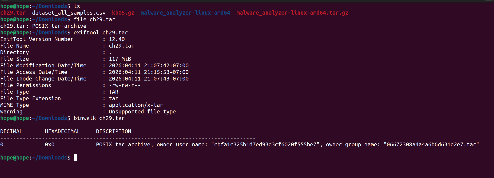
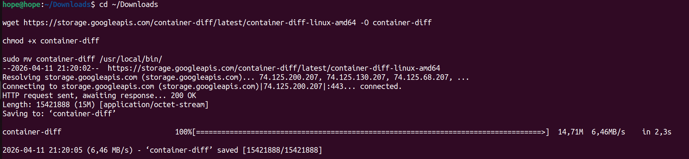
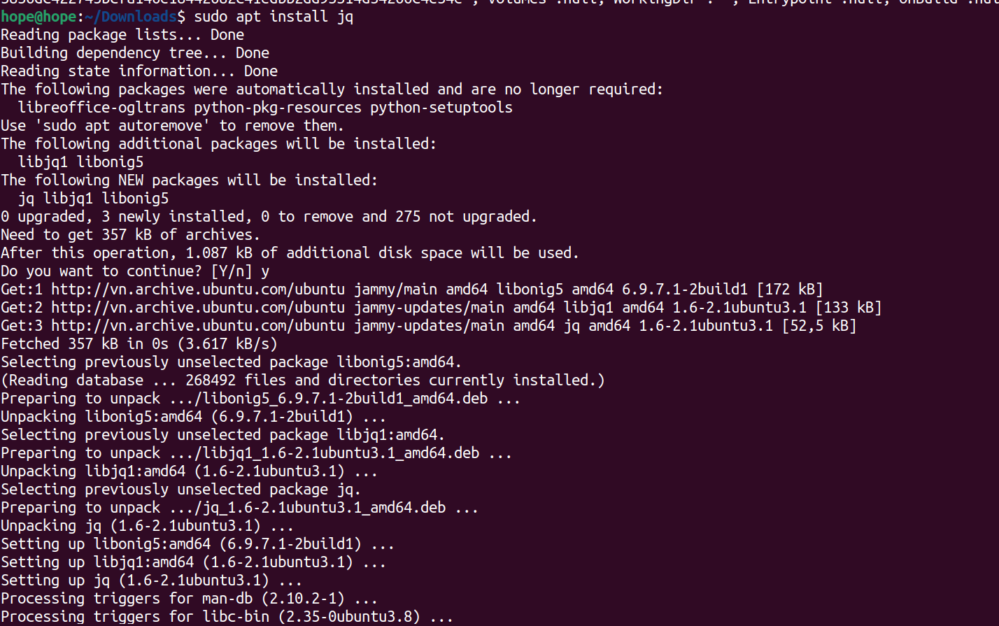
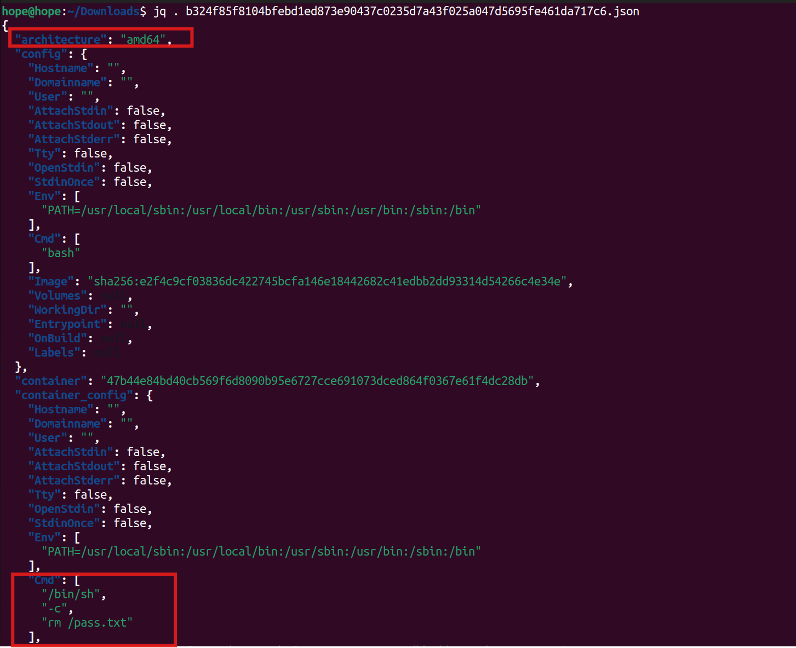
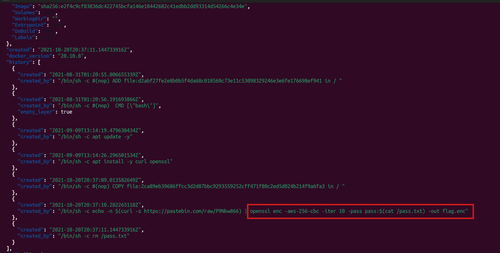
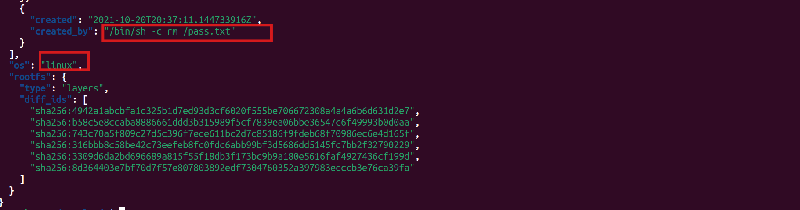
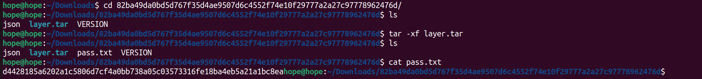
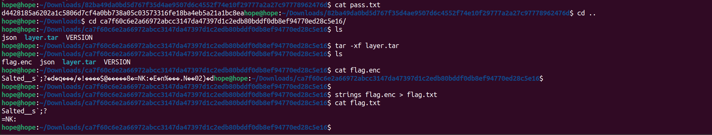
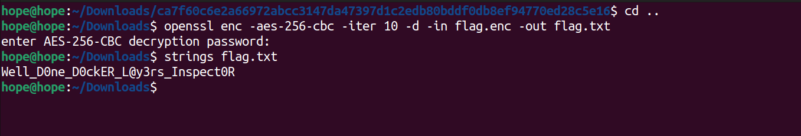
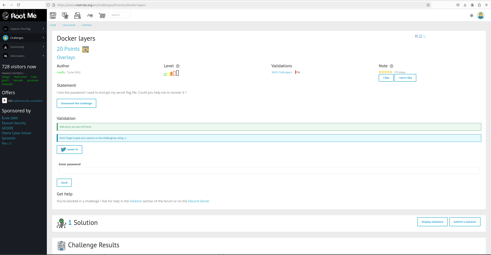

# Docker layers

## Đề bài

!!! note "Statement"
    
    I lost the password I used to encrypt my secret flag file. Could you help me to recover it ?

## Bước 1: Xác định định dạng thông tin file

``` bash
hope@hope:~/Downloads$ file ch29.tar 
ch29.tar: POSIX tar archive
hope@hope:~/Downloads$ exiftool ch29.tar 
ExifTool Version Number         : 12.40
File Name                       : ch29.tar
Directory                       : .
File Size                       : 117 MiB
File Modification Date/Time     : 2026:04:11 21:07:42+07:00
File Access Date/Time           : 2026:04:11 22:06:07+07:00
File Inode Change Date/Time     : 2026:04:11 22:06:00+07:00
File Permissions                : -rw-rw-r--
File Type                       : TAR
File Type Extension             : tar
MIME Type                       : application/x-tar
Warning                         : Unsupported file type
hope@hope:~/Downloads$ binwalk ch29.tar 

DECIMAL       HEXADECIMAL     DESCRIPTION
--------------------------------------------------------------------------------
0             0x0             POSIX tar archive, owner user name: "cbfa1c325b1d7ed93d3cf6020f555be7", owner group name: "06672308a4a4a6b6d631d2e7.tar"
```




!!! abstract "Chú ý"

    Ta thấy được ở đây ta có quyền đọc và ghi, cũng có hiện POSIX và user và group name của owner

**Dùng container-diff**

Nếu chưa có thì tải:



Công cụ để so sánh 2 Docker image, phân tích file,…

## Bước 2: Thực hiện phân tích file

``` bash
hope@hope:~/Downloads$ container-diff analyze -t history ch29.tar

-----History-----

Analysis for ch29.tar:
-/bin/sh -c #(nop) ADD file:d2abf27fe2e8b0b5f4da68c018560c73e11c53098329246e3e6fe176698ef941 in /
-/bin/sh -c #(nop)  CMD ["bash"]
-/bin/sh -c apt update -y
-/bin/sh -c apt install -y curl openssl
-/bin/sh -c #(nop) COPY file:2ca89eb39686ffcc3d2d87bbc9293559252cff471f80c2ed5d024b214f9a6fa3 in /
-/bin/sh -c echo -n $(curl -s https://pastebin.com/raw/P9Nkw866) | openssl enc -aes-256-cbc -iter 10 -pass pass:$(cat /pass.txt) -out flag.enc
-/bin/sh -c rm /pass.txt

hope@hope:~/Downloads$ ls -la
total 1266440
drwxr-xr-x  3 hope hope      4096 Thg 4  11 22:06 .
drwxr-x--- 21 hope hope      4096 Thg 4  11 21:21 ..
-rw-rw-r--  1 hope hope 122307584 Thg 4  11 21:07 ch29.tar
-rw-r--r--  1 hope hope 536870912 Thg 1  29  2013 ch2.dmp
-rw-rw-r--  1 hope hope 185769248 Thg 4  11 21:38 ch2.tbz2
-rw-rw-r--  1 hope hope 169707492 Thg 4   3 11:07 dataset_all_samples.csv
-rw-rw-r--  1 hope hope      5390 Thg 4   9 10:01 kb05.gz
drwxrwxr-x  3 hope hope      4096 Thg 4   3 11:06 malware_analyzer-linux-amd64
-rw-rw-r--  1 hope hope 282128640 Thg 4   3 11:06 malware_analyzer-linux-amd64.tar.gz
hope@hope:~/Downloads$ tar -xf ch29.tar
hope@hope:~/Downloads$ ls -la
total 1385904
drwxr-xr-x  9 hope hope      4096 Thg 4  11 22:07 .
drwxr-x--- 21 hope hope      4096 Thg 4  11 21:21 ..
drwxrwxr-x  2 hope hope      4096 Thg 4  11 22:07 1bbd61a572ad5f5e2ac0f073465d10dc1c94a71359b0adfd2c105be4c1cb2507
-r--r--r--  1 hope hope      2048 Thg 1   1  1970 316bbb8c58be42c73eefeb8fc0fdc6abb99bf3d5686dd5145fc7bb2f32790229.tar
-r--r--r--  1 hope hope      2048 Thg 1   1  1970 3309d6da2bd696689a815f55f18db3f173bc9b9a180e5616faf4927436cf199d.tar
-r--r--r--  1 hope hope  75156480 Thg 1   1  1970 4942a1abcbfa1c325b1d7ed93d3cf6020f555be706672308a4a4a6b6d631d2e7.tar
drwxrwxr-x  2 hope hope      4096 Thg 4  11 22:07 5bcc45940862d5b93517a60629b05c844df751c9187a293d982047f01615cb30
-r--r--r--  1 hope hope  16729088 Thg 1   1  1970 743c70a5f809c27d5c396f7ece611bc2d7c85186f9fdeb68f70986ec6e4d165f.tar
drwxrwxr-x  2 hope hope      4096 Thg 4  11 22:07 82ba49da0bd5d767f35d4ae9507d6c4552f74e10f29777a2a27c97778962476d
-r--r--r--  1 hope hope      1536 Thg 1   1  1970 8d364403e7bf70d7f57e807803892edf7304760352a397983ecccb3e76ca39fa.tar
drwxrwxr-x  2 hope hope      4096 Thg 4  11 22:07 8f0d75885373613641edc42db2a0007684a0e5de14c6f854e365c61f292f3b4d
-r--r--r--  1 hope hope      2439 Thg 1   1  1970 b324f85f8104bfebd1ed873e90437c0235d7a43f025a047d5695fe461da717c6.json
-r--r--r--  1 hope hope  30390272 Thg 1   1  1970 b58c5e8ccaba8886661ddd3b315989f5cf7839ea06bbe36547c6f49993b0d0aa.tar
drwxrwxr-x  2 hope hope      4096 Thg 4  11 22:07 ca7f60c6e2a66972abcc3147da47397d1c2edb80bddf0db8ef94770ed28c5e16
-rw-rw-r--  1 hope hope 122307584 Thg 4  11 21:07 ch29.tar
-rw-r--r--  1 hope hope 536870912 Thg 1  29  2013 ch2.dmp
-rw-rw-r--  1 hope hope 185769248 Thg 4  11 21:38 ch2.tbz2
-rw-rw-r--  1 hope hope 169707492 Thg 4   3 11:07 dataset_all_samples.csv
drwxrwxr-x  2 hope hope      4096 Thg 4  11 22:07 db04fe239ab708e4ab56ea0e5c1047449b7ea9e04df9db5b1b95d00c6980ff3f
-rw-rw-r--  1 hope hope      5390 Thg 4   9 10:01 kb05.gz
drwxrwxr-x  3 hope hope      4096 Thg 4   3 11:06 malware_analyzer-linux-amd64
-rw-rw-r--  1 hope hope 282128640 Thg 4   3 11:06 malware_analyzer-linux-amd64.tar.gz
-r--r--r--  1 hope hope       573 Thg 1   1  1970 manifest.json
-r--r--r--  1 hope hope       111 Thg 1   1  1970 repositories
```

Ở đây ta thấy được có sự xuất hiện của openssl, thực hiện mã hóa aes 256 bit bằng mode `CBC` với pass được giấu trong `pass.txt`

**Giải nén ra và liệt kê xem có gì**

Tải jq để xem định dạng json tốt hơn



## Bước 3: Dùng jq để đọc file json 

``` bash
hope@hope:~/Downloads$ jq . b324f85f8104bfebd1ed873e90437c0235d7a43f025a047d5695fe461da717c6.json
{
  "architecture": "amd64",
  "config": {
    "Hostname": "",
    "Domainname": "",
    "User": "",
    "AttachStdin": false,
    "AttachStdout": false,
    "AttachStderr": false,
    "Tty": false,
    "OpenStdin": false,
    "StdinOnce": false,
    "Env": [
      "PATH=/usr/local/sbin:/usr/local/bin:/usr/sbin:/usr/bin:/sbin:/bin"
    ],
    "Cmd": [
      "bash"
    ],
    "Image": "sha256:e2f4c9cf03836dc422745bcfa146e18442682c41edbb2dd93314d54266c4e34e",
    "Volumes": null,
    "WorkingDir": "",
    "Entrypoint": null,
    "OnBuild": null,
    "Labels": null
  },
  "container": "47b44e84bd40cb569f6d8090b95e6727cce691073dced864f0367e61f4dc28db",
  "container_config": {
    "Hostname": "",
    "Domainname": "",
    "User": "",
    "AttachStdin": false,
    "AttachStdout": false,
    "AttachStderr": false,
    "Tty": false,
    "OpenStdin": false,
    "StdinOnce": false,
    "Env": [
      "PATH=/usr/local/sbin:/usr/local/bin:/usr/sbin:/usr/bin:/sbin:/bin"
    ],
    "Cmd": [
      "/bin/sh",
      "-c",
      "rm /pass.txt"
    ],
    "Image": "sha256:e2f4c9cf03836dc422745bcfa146e18442682c41edbb2dd93314d54266c4e34e",
    "Volumes": null,
    "WorkingDir": "",
    "Entrypoint": null,
    "OnBuild": null,
    "Labels": null
  },
  "created": "2021-10-20T20:37:11.144733916Z",
  "docker_version": "20.10.8",
  "history": [
    {
      "created": "2021-08-31T01:20:55.806655339Z",
      "created_by": "/bin/sh -c #(nop) ADD file:d2abf27fe2e8b0b5f4da68c018560c73e11c53098329246e3e6fe176698ef941 in / "
    },
    {
      "created": "2021-08-31T01:20:56.191693866Z",
      "created_by": "/bin/sh -c #(nop)  CMD [\"bash\"]",
      "empty_layer": true
    },
    {
      "created": "2021-09-09T13:14:19.479630434Z",
      "created_by": "/bin/sh -c apt update -y"
    },
    {
      "created": "2021-09-09T13:14:26.296501534Z",
      "created_by": "/bin/sh -c apt install -y curl openssl"
    },
    {
      "created": "2021-10-20T20:37:09.013582649Z",
      "created_by": "/bin/sh -c #(nop) COPY file:2ca89eb39686ffcc3d2d87bbc9293559252cff471f80c2ed5d024b214f9a6fa3 in / "
    },
    {
      "created": "2021-10-20T20:37:10.282265118Z",
      "created_by": "/bin/sh -c echo -n $(curl -s https://pastebin.com/raw/P9Nkw866) | openssl enc -aes-256-cbc -iter 10 -pass pass:$(cat /pass.txt) -out flag.enc"
    },
    {
      "created": "2021-10-20T20:37:11.144733916Z",
      "created_by": "/bin/sh -c rm /pass.txt"
    }
  ],
  "os": "linux",
  "rootfs": {
    "type": "layers",
    "diff_ids": [
      "sha256:4942a1abcbfa1c325b1d7ed93d3cf6020f555be706672308a4a4a6b6d631d2e7",
      "sha256:b58c5e8ccaba8886661ddd3b315989f5cf7839ea06bbe36547c6f49993b0d0aa",
      "sha256:743c70a5f809c27d5c396f7ece611bc2d7c85186f9fdeb68f70986ec6e4d165f",
      "sha256:316bbb8c58be42c73eefeb8fc0fdc6abb99bf3d5686dd5145fc7bb2f32790229",
      "sha256:3309d6da2bd696689a815f55f18db3f173bc9b9a180e5616faf4927436cf199d",
      "sha256:8d364403e7bf70d7f57e807803892edf7304760352a397983ecccb3e76ca39fa"
    ]
  }
}
```

!!! note "Chú ý"

    Ở đây ta thấy được có lưu giữ câu lệnh như đã phân tích trước đó, và người đó đã xóa pass.txt

!!! warning "Cảnh báo"

    Tuy nhiên, có thể Recybin hoặc bộ nhớ tạm, Cache chưa thực sự được xóa đầy đủ, nên tìm kiếm một hồi lại ra được file pass.txt trong các folder đã được phân tích trước đó

``` bash
hope@hope:~/Downloads$ cd 82ba49da0bd5d767f35d4ae9507d6c4552f74e10f29777a2a27c97778962476d
hope@hope:~/Downloads/82ba49da0bd5d767f35d4ae9507d6c4552f74e10f29777a2a27c97778962476d$ tar -xf layer.tar
hope@hope:~/Downloads/82ba49da0bd5d767f35d4ae9507d6c4552f74e10f29777a2a27c97778962476d$ ls
json  layer.tar  pass.txt  VERSION
hope@hope:~/Downloads/82ba49da0bd5d767f35d4ae9507d6c4552f74e10f29777a2a27c97778962476d$ cat pass.txt 
d4428185a6202a1c5806d7cf4a0bb738a05c03573316fe18ba4eb5a21a1bc8eahope@hope:~/Downloads/82ba49da0bd5d767f35d4ae9507d6c4552f74e10f29777a2a27c97778962476d$ cd ..
hope@hope:~/Downloads$ cd cd ca7f60c6e2a66972abcc3147da47397d1c2edb80bddf0db8ef94770ed28c5e16
bash: cd: too many arguments
hope@hope:~/Downloads$ cd ca7f60c6e2a66972abcc3147da47397d1c2edb80bddf0db8ef94770ed28c5e16
hope@hope:~/Downloads/ca7f60c6e2a66972abcc3147da47397d1c2edb80bddf0db8ef94770ed28c5e16$ tar -xf layer.tar
hope@hope:~/Downloads/ca7f60c6e2a66972abcc3147da47397d1c2edb80bddf0db8ef94770ed28c5e16$ ls
flag.enc  json  layer.tar  VERSION
hope@hope:~/Downloads/ca7f60c6e2a66972abcc3147da47397d1c2edb80bddf0db8ef94770ed28c5e16$ openssl enc -aes-256-cbc -iter 10 -d -in flag.enc -out flag.txt
enter AES-256-CBC decryption password:
hope@hope:~/Downloads/ca7f60c6e2a66972abcc3147da47397d1c2edb80bddf0db8ef94770ed28c5e16$ cat flag.txt 
Well_D0ne_D0ckER_L@y3rs_Inspect0Rhope@hope:~/Downloads/ca7f60c6e2a66972abcc3147da47397d1c2edb80bddf0db8ef94770ed28c5e16$
```

## Flag 

``` title="flag"
Well_D0ne_D0ckER_L@y3rs_Inspect0R
```

### Tools sử dụng

- `file`, `binwalk`
- `container-diff`
- `jq`
- `tar`
- `openssl`

## Ảnh theo từng bước
















