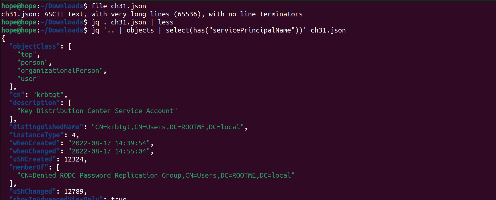
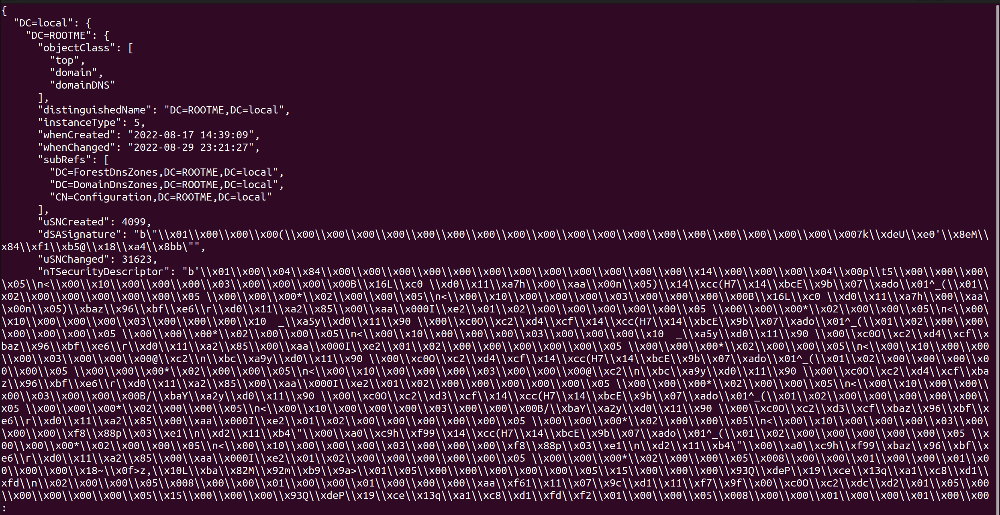
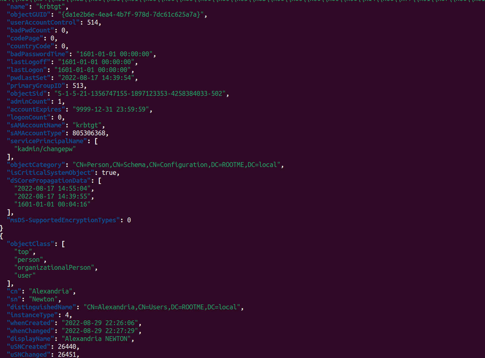
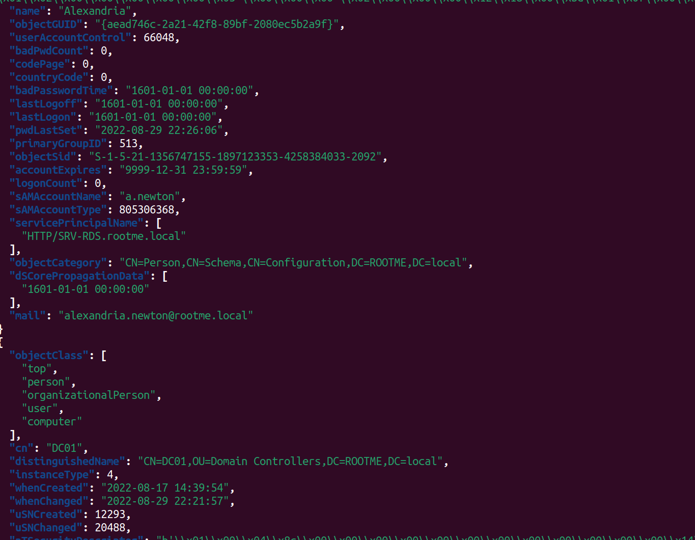
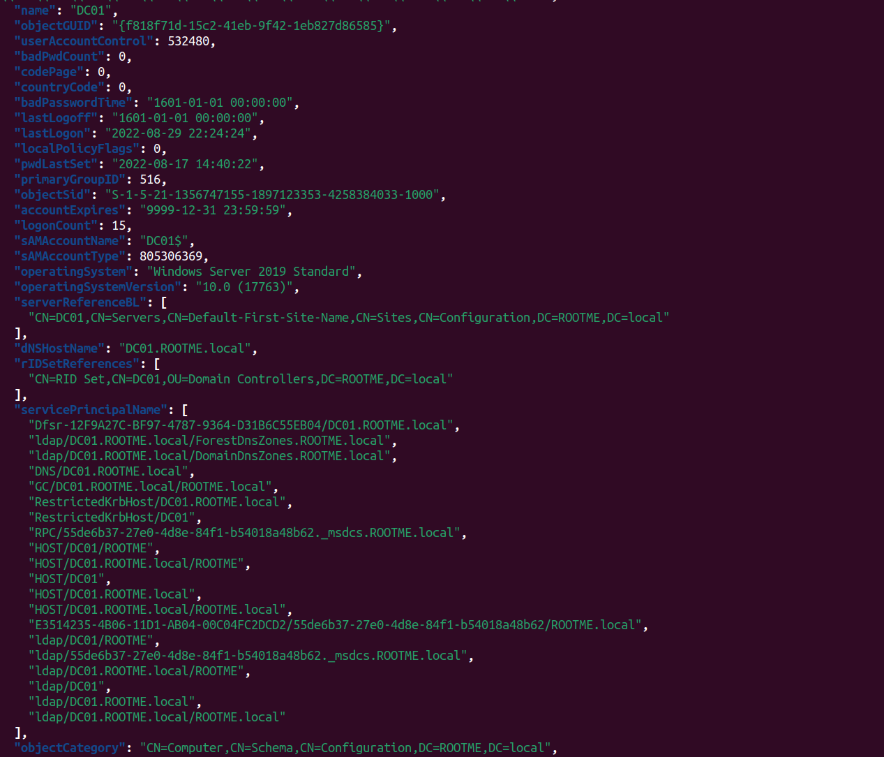
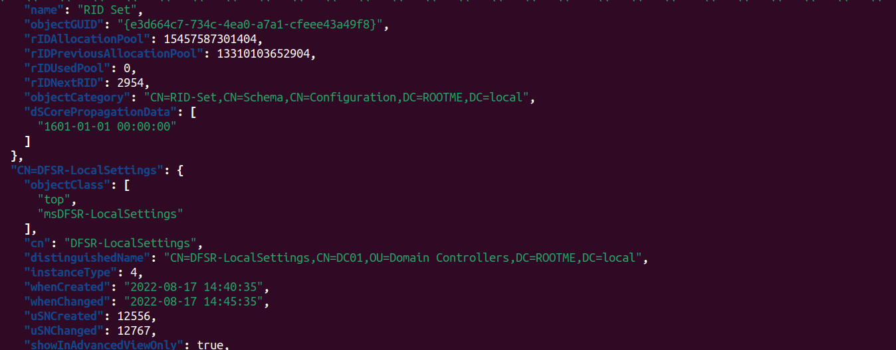
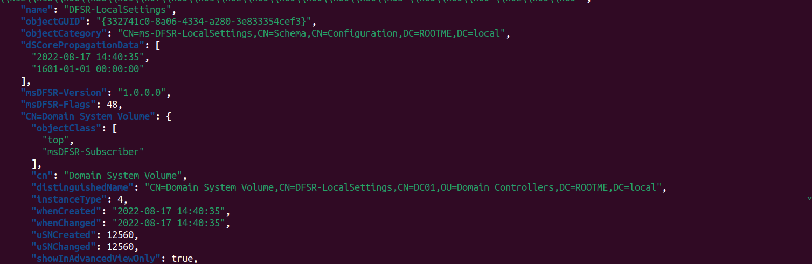

# Windows - LDAP User KerbeRoastable

## Đề bài

!!! info "Statement"

    During your investigations, you found a backup of the company’s KDAP made with ldap2json. Use the information in this dump to find the Kerberoastable user.
    The flag is the email address of the Kerberoastable user.


### Bước 1: Xác định định dạng thông tin file


``` bash
hope@hope:~/Downloads$ file ch31.json 
ch31.json: ASCII text, with very long lines (65536), with no line terminators
```

``` bash
hope@hope:~/Downloads$ jq . ch31.json | less
{
  "DC=local": {
    "DC=ROOTME": {
      "objectClass": [
        "top",
        "domain",
        "domainDNS"
      ],
      "distinguishedName": "DC=ROOTME,DC=local",
      "instanceType": 5,
      "whenCreated": "2022-08-17 14:39:09",
      "whenChanged": "2022-08-29 23:21:27",
      "subRefs": [
        "DC=ForestDnsZones,DC=ROOTME,DC=local",
        "DC=DomainDnsZones,DC=ROOTME,DC=local",
        "CN=Configuration,DC=ROOTME,DC=local"
      ],
      "uSNCreated": 4099,
      "dSASignature": "b\"\\x01\\x00\\x00\\x00(\\x00\\x00\\x00\\x00\\x00\\x00\\x00\\x00\\x00\\x00\\x00\\x00\\x00\\x00\\x00\\x00\\x00\\x00\\x007k\\xdeU\\xe0'\\x8eM\\x84\\xf1\\xb5@\\x18\\xa4\\x8bb\"",
      "uSNChanged": 31623,
      "nTSecurityDescriptor": "b'\\x01\\x00\\x04\\x84\\x00\\x00\\x00\\x00\\x00\\x00\\x00\\x00\\x00\\x00\\x00\\x00\\x14\\x00\\x00\\x00\\x04\\x00p\\t5\\x00\\x00\\x00\\x05\\n<\\x00\\x10\\x00\\x00\\x00\\x03\\x00\\x00\\x00\\x00B\\x16L\\xc0 \\xd0\\x11\\xa7h\\x00\\xaa\\x00n\\x05)\\x14\\xcc(H7\\x14\\xbcE\\x9b\\x07\\xado\\x01^_(\\x01\\x02\\x00\\x00\\x00\\x00\\x00\\x05 \\x00\\x00\\x00*\\x02\\x00\\x00\\x05\\n<\\x00\\x10\\x00\\x00\\x00\\x03\\x00\\x00\\x00\\x00B\\x16L\\xc0 \\xd0\\x11\\xa7h\\x00\\xaa\\x00n\\x05)\\xbaz\\x96\\xbf\\xe6\\r\\xd0\\x11\\xa2\\x85\\x00\\xaa\\x000I\\xe2\\x01\\x02\\x00\\x00\\x00\\x00\\x00\\x05 \\x00\\x00\\x00*\\x02\\x00\\x00\\x05\\n<\\x00\\x10\\x00\\x00\\x00\\x03\\x00\\x00\\x00\\x10  _\\xa5y\\xd0\\x11\\x90 \\x00\\xc0O\\xc2\\xd4\\xcf\\x14\\xcc(H7\\x14\\xbcE\\x9b\\x07\\xado\\x01^_(\\x01\\x02\\x00\\x00\\x00\\x00\\x00\\x05 \\x00\\x00\\x00*\\x02\\x00\\x00\\x05\\n<\\x00\\x10\\x00\\x00\\x00\\x03\\x00\\x00\\x00\\x10  _\\xa5y\\xd0\\x11\\x90 \\x00\\xc0O\\xc2\\xd4\\xcf\\xbaz\\x96\\xbf\\xe6\\r\\xd0\\x11\\xa2\\x85\\x00\\xaa\\x000I\\xe2\\x01\\x02\\x00\\x00\\x00\\x00\\x00\\x05 \\x00\\x00\\x00*\\x02\\x00\\x00\\x05\\n<\\x00\\x10\\x00\\x00\\x00\\x03\\x00\\x00\\x00@\\xc2\\n\\xbc\\xa9y\\xd0\\x11\\x90 \\x00\\xc0O\\xc2\\xd4\\xcf\\x14\\xcc(H7\\x14\\xbcE\\x9b\\x07\\xado\\x01^_(\\x01\\x02\\x00\\x00\\x00\\x00\\x00\\x05 \\x00\\x00\\x00*\\x02\\x00\\x00\\x05\\n<\\x00\\x10\\x00\\x00\\x00\\x03\\x00\\x00\\x00@\\xc2\\n\\xbc\\xa9y\\xd0\\x11\\x90 \\x00\\xc0O\\xc2\\xd4\\xcf\\xbaz\\x96\\xbf\\xe6\\r\\xd0\\x11\\xa2\\x85\\x00\\xaa\\x000I\\xe2\\x01\\x02\\x00\\x00\\x00\\x00\\x00\\x05 \\x00\\x00\\x00*\\x02\\x00\\x00\\x05\\n<\\x00\\x10\\x00\\x00\\x00\\x03\\x00\\x00\\x00B/\\xbaY\\xa2y\\xd0\\x11\\x90 \\x00\\xc0O\\xc2\\xd3\\xcf\\x14\\xcc(H7\\x14\\xbcE\\x9b\\x07\\xado\\x01^_(\\x01\\x02\\x00\\x00\\x00\\x00\\x00\\x05 \\x00\\x00\\x00*\\x02\\x00\\x00\\x05\\n<\\x00\\x10\\x00\\x00\\x00\\x03\\x00\\x00\\x00B/\\xbaY\\xa2y\\xd0\\x11\\x90 \\x00\\xc0O\\xc2\\xd3\\xcf\\xbaz\\x96\\xbf\\xe6\\r\\xd0\\x11\\xa2\\x85\\x00\\xaa\\x000I\\xe2\\x01\\x02\\x00\\x00\\x00\\x00\\x00\\x05 \\x00\\x00\\x00*\\x02\\x00\\x00\\x05\\n<\\x00\\x10\\x00\\x00\\x00\\x03\\x00\\x00\\x00\\xf8\\x88p\\x03\\xe1\\n\\xd2\\x11\\xb4\"\\x00\\xa0\\xc9h\\xf99\\x14\\xcc(H7\\x14\\xbcE\\x9b\\x07\\xado\\x01^_(\\x01\\x02\\x00\\x00\\x00\\x00\\x00\\x05 \\x00\\x00\\x00*\\x02\\x00\\x00\\x05\\n<\\x00\\x10\\x00\\x00\\x00\\x03\\x00\\x00\\x00\\xf8\\x88p\\x03\\xe1\\n\\xd2\\x11\\xb4\"\\x00\\xa0\\xc9h\\xf99\\xbaz\\x96\\xbf\\xe6\\r\\xd0\\x11\\xa2\\x85\\x00\\xaa\\x000I\\xe2\\x01\\x02\\x00\\x00\\x00\\x00\\x00\\x05 \\x00\\x00\\x00*\\x02\\x00\\x00\\x05\\x008\\x00\\x00\\x01\\x00\\x00\\x01\\x00\\x00\\x00\\x18~\\x0f>z,\\x10L\\xba\\x82M\\x92m\\xb9\\x9a>\\x01\\x05\\x00\\x00\\x00\\x00\\x00\\x05\\x15\\x00\\x00\\x00\\x93Q\\xdeP\\x19\\xce\\x13q\\xa1\\xc8\\xd1\\xfd\\n\\x02\\x00\\x00\\x05\\x008\\x00\\x00\\x01\\x00\\x00\\x01\\x00\\x00\\x00\\xaa\\xf61\\x11\\x07\\x9c\\xd1\\x11\\xf7\\x9f\\x00\\xc0O\\xc2\\xdc\\xd2\\x01\\x05\\x00\\x00\\x00\\x00\\x00\\x05\\x15\\x00\\x00\\x00\\x93Q\\xdeP\\x19\\xce\\x13q\\xa1\\xc8\\xd1\\xfd\\xf2\\x01\\x00\\x00\\x05\\x008\\x00\\x00\\x01\\x00\\x00\\x01\\x00\\x00\\x00\\xad\\xf61\\x11\\x07\\x9c\\xd1\\x11\\xf7\\x9f\\x00\\xc0O\\xc2\\xdc\\xd2\\x01\\x05\\x00\\x00\\x00\\x00\\x00\\x05\\x15\\x00\\x00\\x00\\x93Q\\xdeP\\x19\\xce\\x13q\\xa1\\xc8\\xd1\\xfd\\x04\\x02\\x00\\x00\\x05\\x028\\x000\\x00\\x00\\x00\\x01\\x00\\x00\\x00\\x0f\\xd6G[\\x90`\\xb2@\\x9f7*M\\xe8\\x8f0c\\x01\\x05\\x00\\x00\\x00\\x00\\x00\\x05\\x15\\x00\\x00\\x00\\x93Q\\xdeP\\x19\\xce\\x13q\\xa1\\xc8\\xd1\\xfd\\x0e\\x02\\x00\\x00\\x05\\x028\\x000\\x00\\x00\\x00\\x01\\x00\\x00\\x00\\x0f\\xd6G[\\x90`\\xb2@\\x9f7*M\\xe8\\x8f0c\\x01\\x05\\x00\\x00\\x00\\x00\\x00\\x05\\x15\\x00\\x00\\x00\\x93Q\\xdeP\\x19\\xce\\x13q\\xa1\\xc8\\xd1\\xfd\\x0f\\x02\\x00\\x00\\x05\\n8\\x00\\x08\\x00\\x00\\x00\\x03\\x00\\x00\\x00\\xa6m\\x02\\x9b<\\r\\\\F\\x8b\\xeeQ\\x99\\xd7\\x16\\\\\\xba\\x86z\\x96\\xbf\\xe6\\r\\xd0\\x11\\xa2\\x85\\x00\\xaa\\x000I\\xe2\\x01\\x01\\x00\\x00\\x00\\x00\\x00\\x03\\x00\\x00\\x00\\x00\\x05\\n8\\x00\\x08\\x00\\x00\\x00\\x03\\x00\\x00\\x00\\xa6m\\x02\\x9b<\\r\\\\F\\x8b\\xeeQ\\x99\\xd7\\x16\\\\\\xba\\x86z\\x96\\xbf\\xe6\\r\\xd0\\x11\\xa2\\x85\\x00\\xaa\\x000I\\xe2\\x01\\x01\\x00\\x00\\x00\\x00\\x00\\x05\\n\\x00\\x00\\x00\\x05\\n8\\x00\\x10\\x00\\x00\\x00\\x03\\x00\\x00\\x00m\\x9e\\xc6\\xb7\\xc7,\\xd2\\x11\\x85N\\x00\\xa0\\xc9\\x83\\xf6\\x08\\x86z\\x96\\xbf\\xe6\\r\\xd0\\x11\\xa2\\x85\\x00\\xaa\\x000I\\xe2\\x01\\x01\\x00\\x00\\x00\\x00\\x00\\x05\\t\\x00\\x00\\x00\\x05\\n8\\x00\\x10\\x00\\x00\\x00\\x03\\x00\\x00\\x00m\\x9e\\xc6\\xb7\\xc7,\\xd2\\x11\\x85N\\x00\\xa0\\xc9\\x83\\xf6\\x08\\x9cz\\x96\\xbf\\xe6\\r\\xd0\\x11\\xa2\\x85\\x00\\xaa\\x000I\\xe2\\x01\\x01\\x00\\x00\\x00\\x00\\x00\\x05\\t\\x00\\x00\\x00\\x05\\n8\\x00\\x10\\x00\\x00\\x00\\x03\\x00\\x00\\x00m\\x9e\\xc6\\xb7\\xc7,\\xd2\\x11\\x85N\\x00\\xa0\\xc9\\x83\\xf6\\x08\\xbaz\\x96\\xbf\\xe6\\r\\xd0\\x11\\xa2\\x85\\x00\\xaa\\x000I\\xe2\\x01\\x01\\x00\\x00\\x00\\x00\\x00\\x05\\t\\x00\\x00\\x00\\x05\\n8\\x00 \\x00\\x00\\x00\\x03\\x00\\x00\\x00\\x93{\\x1b\\xeaH^\\xd5F\\xbclM\\xf4\\xfd\\xa7\\x8a5\\x86z\\x96\\xbf\\xe6\\r\\xd0\\x11\\xa2\\x85\\x00\\xaa\\x000I\\xe2\\x01\\x01\\x00\\x00\\x00\\x00\\x00\\x05\\n\\x00\\x00\\x00\\x05\\x00,\\x00\\x00\\x01\\x00\\x00\\x01\\x00\\x00\\x00v[\\xe9\\x89MDbL\\x99\\x1a\\x0f\\xac\\xbe\\xdad\\x0c\\x01\\x02\\x00\\x00\\x00\\x00\\x00\\x05 \\x00\\x00\\x00 \\x02\\x00\\x00\\x05\\x00,\\x00\\x00\\x01\\x00\\x00\\x01\\x00\\x00\\x00\\xaa\\xf61\\x11\\x07\\x9c\\xd1\\x11\\xf7\\x9f\\x00\\xc0O\\xc2\\xdc\\xd2\\x01\\x02\\x00\\x00\\x00\\x00\\x00\\x05 \\x00\\x00\\x00 \\x02\\x00\\x00\\x05\\x00,\\x00\\x00\\x01\\x00\\x00\\x01\\x00\\x00\\x00\\xab\\xf61\\x11\\x07\\x9c\\xd1\\x11\\xf7\\x9f\\x00\\xc0O\\xc2\\xdc\\xd2\\x01\\x02\\x00\\x00\\x00\\x00\\x00\\x05 \\x00\\x00\\x00 \\x02\\x00\\x00\\x05\\x00,\\x00\\x00\\x01\\x00\\x00\\x01\\x00\\x00\\x00\\xac\\xf61\\x11\\x07\\x9c\\xd1\\x11\\xf7\\x9f\\x00\\xc0O\\xc2\\xdc\\xd2\\x01\\x02\\x00\\x00\\x00\\x00\\x00\\x05 \\x00\\x00\\x00 \\x02\\x00\\x00\\x05\\x00,\\x00\\x00\\x01\\x00\\x00\\x01\\x00\\x00\\x00\\xad\\xf61\\x11\\x07\\x9c\\xd1\\x11\\xf7\\x9f\\x00\\xc0O\\xc2\\xdc\\xd2\\x01\\x02\\x00\\x00\\x00\\x00\\x00\\x05 \\x00\\x00\\x00 \\x02\\x00\\x00\\x05\\x00,\\x00\\x00\\x01\\x00\\x00\\x01\\x00\\x00\\x00\\xae\\xf61\\x11\\x07\\x9c\\xd1\\x11\\xf7\\x9f\\x00\\xc0O\\xc2\\xdc\\xd2\\x01\\x02\\x00\\x00\\x00\\x00\\x00\\x05 \\x00\\x00\\x00 \\x02\\x00\\x00\\x05\\x00,\\x00\\x00\\x01\\x00\\x00\\x01\\x00\\x00\\x00\\xc9m\\xa3\\xe2\\x17\\xae\\xc3G\\xb5\\x8b\\xbe4\\xc5[\\xa63\\x01\\x02\\x00\\x00\\x00\\x00\\x00\\x05 \\x00\\x00\\x00-\\x02\\x00\\x00\\x05\\x00,\\x00\\x10\\x00\\x00\\x00\\x01\\x00\\x00\\x00`s@\\xc7\\xbf \\xd0\\x11\\xa7h\\x00\\xaa\\x00n\\x05)\\x01\\x02\\x00\\x00\\x00\\x00\\x00\\x05 \\x00\\x00\\x00*\\x02\\x00\\x00\\x05\\x00,\\x00\\x10\\x00\\x00\\x00\\x01\\x00\\x00\\x00\\xd0\\x9f\\x11\\xb8\\xf6\\x04bG\\xabzI\\x86\\xc7k?\\x9a\\x01\\x02\\x00\\x00\\x00\\x00\\x00\\x05 \\x00\\x00\\x00*\\x02\\x00\\x00\\x05\\n,\\x00\\x94\\x00\\x02\\x00\\x02\\x00\\x00\\x00\\x14\\xcc(H7\\x14\\xbcE\\x9b\\x07\\xado\\x01^_(\\x01\\x02\\x00\\x00\\x00\\x00\\x00\\x05 \\x00\\x00\\x00*\\x02\\x00\\x00\\x05\\n,\\x00\\x94\\x00\\x02\\x00\\x02\\x00\\x00\\x00\\x9cz\\x96\\xbf\\xe6\\r\\xd0\\x11\\xa2\\x85\\x00\\xaa\\x000I\\xe2\\x01\\x02\\x00\\x00\\x00\\x00\\x00\\x05 \\x00\\x00\\x00*\\x02\\x00\\x00\\x05\\n,\\x00\\x94\\x00\\x02\\x00\\x02\\x00\\x00\\x00\\xbaz\\x96\\xbf\\xe6\\r\\xd0\\x11\\xa2\\x85\\x00\\xaa\\x000I\\xe2\\x01\\x02\\x00\\x00\\x00\\x00\\x00\\x05 \\x00\\x00\\x00*\\x02\\x00\\x00\\x05\\x00(\\x00\\x00\\x01\\x00\\x00\\x01\\x00\\x00\\x00^L\\xc7\\x05\\xebM\\xb4C\\xbd\\x9f\\x86fL*\\x7f\\xd5\\x01\\x01\\x00\\x00\\x00\\x00\\x00\\x05\\x0b\\x00\\x00\\x00\\x05\\x00(\\x00\\x00\\x01\\x00\\x00\\x01\\x00\\x00\\x00v[\\xe9\\x89MDbL\\x99\\x1a\\x0f\\xac\\xbe\\xdad\\x0c\\x01\\x01\\x00\\x00\\x00\\x00\\x00\\x05\\t\\x00\\x00\\x00\\x05\\x00(\\x00\\x00\\x01\\x00\\x00\\x01\\x00\\x00\\x00}\\xdc\\xc2\\xcc\\xad\\xa6zJ\\x88F\\xc0N<\\xc55\\x01\\x01\\x01\\x00\\x00\\x00\\x00\\x00\\x05\\x0b\\x00\\x00\\x00\\x05\\x00(\\x00\\x00\\x01\\x00\\x00\\x01\\x00\\x00\\x00\\x9c6\\x0f(\\xc7g\\x8eC\\xae\\x98\\x1dF\\xf3\\xc6\\xf5A\\x01\\x01\\x00\\x00\\x00\\x00\\x00\\x05\\x0b\\x00\\x00\\x00\\x05\\x00(\\x00\\x00\\x01\\x00\\x00\\x01\\x00\\x00\\x00\\xaa\\xf61\\x11\\x07\\x9c\\xd1\\x11\\xf7\\x9f\\x00\\xc0O\\xc2\\xdc\\xd2\\x01\\x01\\x00\\x00\\x00\\x00\\x00\\x05\\t\\x00\\x00\\x00\\x05\\x00(\\x00\\x00\\x01\\x00\\x00\\x01\\x00\\x00\\x00\\xab\\xf61\\x11\\x07\\x9c\\xd1\\x11\\xf7\\x9f\\x00\\xc0O\\xc2\\xdc\\xd2\\x01\\x01\\x00\\x00\\x00\\x00\\x00\\x05\\t\\x00\\x00\\x00\\x05\\x00(\\x00\\x00\\x01\\x00\\x00\\x01\\x00\\x00\\x00\\xac\\xf61\\x11\\x07\\x9c\\xd1\\x11\\xf7\\x9f\\x00\\xc0O\\xc2\\xdc\\xd2\\x01\\x01\\x00\\x00\\x00\\x00\\x00\\x05\\t\\x00\\x00\\x00\\x05\\x00(\\x00\\x00\\x01\\x00\\x00\\x01\\x00\\x00\\x00\\xae\\xf61\\x11\\x07\\x9c\\xd1\\x11\\xf7\\x9f\\x00\\xc0O\\xc2\\xdc\\xd2\\x01\\x01\\x00\\x00\\x00\\x00\\x00\\x05\\t\\x00\\x00\\x00\\x05\\x00(\\x00\\x10\\x00\\x00\\x00\\x01\\x00\\x00\\x00\\xd0\\x9f\\x11\\xb8\\xf6\\x04bG\\xabzI\\x86\\xc7k?\\x9a\\x01\\x01\\x00\\x00\\x00\\x00\\x00\\x05\\x0b\\x00\\x00\\x00\\x05\\x03(\\x000\\x00\\x00\\x00\\x01\\x00\\x00\:
:q

hope@hope:~/Downloads$ jq '.. | objects | select(has("servicePrincipalName"))' ch31.json
{
  "objectClass": [
    "top",
    "person",
    "organizationalPerson",
    "user"
  ],
  "cn": "krbtgt",
  "description": [
    "Key Distribution Center Service Account"
  ],
  "distinguishedName": "CN=krbtgt,CN=Users,DC=ROOTME,DC=local",
  "instanceType": 4,
  "whenCreated": "2022-08-17 14:39:54",
  "whenChanged": "2022-08-17 14:55:04",
  "uSNCreated": 12324,
  "memberOf": [
    "CN=Denied RODC Password Replication Group,CN=Users,DC=ROOTME,DC=local"
  ],
  "uSNChanged": 12789,
  "showInAdvancedViewOnly": true,
  "nTSecurityDescriptor": "b'\\x01\\x00\\x04\\x9c\\x00\\x00\\x00\\x00\\x00\\x00\\x00\\x00\\x00\\x00\\x00\\x00\\x14\\x00\\x00\\x00\\x04\\x00t\\x04\\x18\\x00\\x00\\x00\\x05\\x00<\\x00\\x10\\x00\\x00\\x00\\x03\\x00\\x00\\x00\\x00B\\x16L\\xc0 \\xd0\\x11\\xa7h\\x00\\xaa\\x00n\\x05)\\x14\\xcc(H7\\x14\\xbcE\\x9b\\x07\\xado\\x01^_(\\x01\\x02\\x00\\x00\\x00\\x00\\x00\\x05 \\x00\\x00\\x00*\\x02\\x00\\x00\\x05\\x00<\\x00\\x10\\x00\\x00\\x00\\x03\\x00\\x00\\x00\\x00B\\x16L\\xc0 \\xd0\\x11\\xa7h\\x00\\xaa\\x00n\\x05)\\xbaz\\x96\\xbf\\xe6\\r\\xd0\\x11\\xa2\\x85\\x00\\xaa\\x000I\\xe2\\x01\\x02\\x00\\x00\\x00\\x00\\x00\\x05 \\x00\\x00\\x00*\\x02\\x00\\x00\\x05\\x00<\\x00\\x10\\x00\\x00\\x00\\x03\\x00\\x00\\x00\\x10  _\\xa5y\\xd0\\x11\\x90 \\x00\\xc0O\\xc2\\xd4\\xcf\\x14\\xcc(H7\\x14\\xbcE\\x9b\\x07\\xado\\x01^_(\\x01\\x02\\x00\\x00\\x00\\x00\\x00\\x05 \\x00\\x00\\x00*\\x02\\x00\\x00\\x05\\x00<\\x00\\x10\\x00\\x00\\x00\\x03\\x00\\x00\\x00\\x10  _\\xa5y\\xd0\\x11\\x90 \\x00\\xc0O\\xc2\\xd4\\xcf\\xbaz\\x96\\xbf\\xe6\\r\\xd0\\x11\\xa2\\x85\\x00\\xaa\\x000I\\xe2\\x01\\x02\\x00\\x00\\x00\\x00\\x00\\x05 \\x00\\x00\\x00*\\x02\\x00\\x00\\x05\\x00<\\x00\\x10\\x00\\x00\\x00\\x03\\x00\\x00\\x00@\\xc2\\n\\xbc\\xa9y\\xd0\\x11\\x90 \\x00\\xc0O\\xc2\\xd4\\xcf\\x14\\xcc(H7\\x14\\xbcE\\x9b\\x07\\xado\\x01^_(\\x01\\x02\\x00\\x00\\x00\\x00\\x00\\x05 \\x00\\x00\\x00*\\x02\\x00\\x00\\x05\\x00<\\x00\\x10\\x00\\x00\\x00\\x03\\x00\\x00\\x00@\\xc2\\n\\xbc\\xa9y\\xd0\\x11\\x90 \\x00\\xc0O\\xc2\\xd4\\xcf\\xbaz\\x96\\xbf\\xe6\\r\\xd0\\x11\\xa2\\x85\\x00\\xaa\\x000I\\xe2\\x01\\x02\\x00\\x00\\x00\\x00\\x00\\x05 \\x00\\x00\\x00*\\x02\\x00\\x00\\x05\\x00<\\x00\\x10\\x00\\x00\\x00\\x03\\x00\\x00\\x00B/\\xbaY\\xa2y\\xd0\\x11\\x90 \\x00\\xc0O\\xc2\\xd3\\xcf\\x14\\xcc(H7\\x14\\xbcE\\x9b\\x07\\xado\\x01^_(\\x01\\x02\\x00\\x00\\x00\\x00\\x00\\x05 \\x00\\x00\\x00*\\x02\\x00\\x00\\x05\\x00<\\x00\\x10\\x00\\x00\\x00\\x03\\x00\\x00\\x00B/\\xbaY\\xa2y\\xd0\\x11\\x90 \\x00\\xc0O\\xc2\\xd3\\xcf\\xbaz\\x96\\xbf\\xe6\\r\\xd0\\x11\\xa2\\x85\\x00\\xaa\\x000I\\xe2\\x01\\x02\\x00\\x00\\x00\\x00\\x00\\x05 \\x00\\x00\\x00*\\x02\\x00\\x00\\x05\\x00<\\x00\\x10\\x00\\x00\\x00\\x03\\x00\\x00\\x00\\xf8\\x88p\\x03\\xe1\\n\\xd2\\x11\\xb4\"\\x00\\xa0\\xc9h\\xf99\\x14\\xcc(H7\\x14\\xbcE\\x9b\\x07\\xado\\x01^_(\\x01\\x02\\x00\\x00\\x00\\x00\\x00\\x05 \\x00\\x00\\x00*\\x02\\x00\\x00\\x05\\x00<\\x00\\x10\\x00\\x00\\x00\\x03\\x00\\x00\\x00\\xf8\\x88p\\x03\\xe1\\n\\xd2\\x11\\xb4\"\\x00\\xa0\\xc9h\\xf99\\xbaz\\x96\\xbf\\xe6\\r\\xd0\\x11\\xa2\\x85\\x00\\xaa\\x000I\\xe2\\x01\\x02\\x00\\x00\\x00\\x00\\x00\\x05 \\x00\\x00\\x00*\\x02\\x00\\x00\\x05\\x008\\x000\\x00\\x00\\x00\\x01\\x00\\x00\\x00\\x7fz\\x96\\xbf\\xe6\\r\\xd0\\x11\\xa2\\x85\\x00\\xaa\\x000I\\xe2\\x01\\x05\\x00\\x00\\x00\\x00\\x00\\x05\\x15\\x00\\x00\\x00\\x93Q\\xdeP\\x19\\xce\\x13q\\xa1\\xc8\\xd1\\xfd\\x05\\x02\\x00\\x00\\x05\\x00,\\x00\\x10\\x00\\x00\\x00\\x01\\x00\\x00\\x00\\x1d\\xb1\\xa9F\\xae`Z@\\xb7\\xe8\\xff\\x8aX\\xd4V\\xd2\\x01\\x02\\x00\\x00\\x00\\x00\\x00\\x05 \\x00\\x00\\x000\\x02\\x00\\x00\\x05\\x00,\\x000\\x00\\x00\\x00\\x01\\x00\\x00\\x00\\x1c\\x9a\\xb6m\"\\x94\\xd1\\x11\\xae\\xbd\\x00\\x00\\xf8\\x03g\\xc1\\x01\\x02\\x00\\x00\\x00\\x00\\x00\\x05 \\x00\\x00\\x001\\x02\\x00\\x00\\x05\\x00,\\x000\\x00\\x00\\x00\\x01\\x00\\x00\\x00b\\xbc\\x05X\\xc9\\xbd(D\\xa5\\xe2\\x85j\\x0fL\\x18^\\x01\\x02\\x00\\x00\\x00\\x00\\x00\\x05 \\x00\\x00\\x001\\x02\\x00\\x00\\x05\\x00,\\x00\\x94\\x00\\x02\\x00\\x02\\x00\\x00\\x00\\x14\\xcc(H7\\x14\\xbcE\\x9b\\x07\\xado\\x01^_(\\x01\\x02\\x00\\x00\\x00\\x00\\x00\\x05 \\x00\\x00\\x00*\\x02\\x00\\x00\\x05\\x00,\\x00\\x94\\x00\\x02\\x00\\x02\\x00\\x00\\x00\\xbaz\\x96\\xbf\\xe6\\r\\xd0\\x11\\xa2\\x85\\x00\\xaa\\x000I\\xe2\\x01\\x02\\x00\\x00\\x00\\x00\\x00\\x05 \\x00\\x00\\x00*\\x02\\x00\\x00\\x05\\x00(\\x00\\x00\\x01\\x00\\x00\\x01\\x00\\x00\\x00S\\x1ar\\xab/\\x1e\\xd0\\x11\\x98\\x19\\x00\\xaa\\x00@R\\x9b\\x01\\x01\\x00\\x00\\x00\\x00\\x00\\x01\\x00\\x00\\x00\\x00\\x05\\x00(\\x00\\x00\\x01\\x00\\x00\\x01\\x00\\x00\\x00S\\x1ar\\xab/\\x1e\\xd0\\x11\\x98\\x19\\x00\\xaa\\x00@R\\x9b\\x01\\x01\\x00\\x00\\x00\\x00\\x00\\x05\\n\\x00\\x00\\x00\\x05\\x02(\\x000\\x01\\x00\\x00\\x01\\x00\\x00\\x00\\xdeG\\xe6\\x91o\\xd9pK\\x95W\\xd6?\\xf4\\xf3\\xcc\\xd8\\x01\\x01\\x00\\x00\\x00\\x00\\x00\\x05\\n\\x00\\x00\\x00\\x00\\x00$\\x00\\xbf\\x01\\x0e\\x00\\x01\\x05\\x00\\x00\\x00\\x00\\x00\\x05\\x15\\x00\\x00\\x00\\x93Q\\xdeP\\x19\\xce\\x13q\\xa1\\xc8\\xd1\\xfd\\x00\\x02\\x00\\x00\\x00\\x00$\\x00\\xbf\\x01\\x0e\\x00\\x01\\x05\\x00\\x00\\x00\\x00\\x00\\x05\\x15\\x00\\x00\\x00\\x93Q\\xdeP\\x19\\xce\\x13q\\xa1\\xc8\\xd1\\xfd\\x07\\x02\\x00\\x00\\x00\\x00\\x18\\x00\\xbf\\x01\\x0f\\x00\\x01\\x02\\x00\\x00\\x00\\x00\\x00\\x05 \\x00\\x00\\x00 \\x02\\x00\\x00\\x00\\x00\\x14\\x00\\x94\\x00\\x02\\x00\\x01\\x01\\x00\\x00\\x00\\x00\\x00\\x05\\x0b\\x00\\x00\\x00\\x00\\x00\\x14\\x00\\xff\\x01\\x0f\\x00\\x01\\x01\\x00\\x00\\x00\\x00\\x00\\x05\\x12\\x00\\x00\\x00'",
  "name": "krbtgt",
  "objectGUID": "{da1e2b6e-4ea4-4b7f-978d-7dc61c625a7a}",
  "userAccountControl": 514,
  "badPwdCount": 0,
  "codePage": 0,
  "countryCode": 0,
  "badPasswordTime": "1601-01-01 00:00:00",
  "lastLogoff": "1601-01-01 00:00:00",
  "lastLogon": "1601-01-01 00:00:00",
  "pwdLastSet": "2022-08-17 14:39:54",
  "primaryGroupID": 513,
  "objectSid": "S-1-5-21-1356747155-1897123353-4258384033-502",
  "adminCount": 1,
  "accountExpires": "9999-12-31 23:59:59",
  "logonCount": 0,
  "sAMAccountName": "krbtgt",
  "sAMAccountType": 805306368,
  "servicePrincipalName": [
    "kadmin/changepw"
  ],
  "objectCategory": "CN=Person,CN=Schema,CN=Configuration,DC=ROOTME,DC=local",
  "isCriticalSystemObject": true,
  "dSCorePropagationData": [
    "2022-08-17 14:55:04",
    "2022-08-17 14:39:55",
    "1601-01-01 00:04:16"
  ],
  "msDS-SupportedEncryptionTypes": 0
}
{
  "objectClass": [
    "top",
    "person",
    "organizationalPerson",
    "user"
  ],
  "cn": "Alexandria",
  "sn": "Newton",
  "distinguishedName": "CN=Alexandria,CN=Users,DC=ROOTME,DC=local",
  "instanceType": 4,
  "whenCreated": "2022-08-29 22:26:06",
  "whenChanged": "2022-08-29 22:27:29",
  "displayName": "Alexandria NEWTON",
  "uSNCreated": 26440,
  "uSNChanged": 26451,
  "nTSecurityDescriptor": "b'\\x01\\x00\\x04\\x8c\\x00\\x00\\x00\\x00\\x00\\x00\\x00\\x00\\x00\\x00\\x00\\x00\\x14\\x00\\x00\\x00\\x04\\x00\\x14\\t2\\x00\\x00\\x00\\x05\\x008\\x00\\x10\\x00\\x00\\x00\\x01\\x00\\x00\\x00\\x00B\\x16L\\xc0 \\xd0\\x11\\xa7h\\x00\\xaa\\x00n\\x05)\\x01\\x05\\x00\\x00\\x00\\x00\\x00\\x05\\x15\\x00\\x00\\x00\\x93Q\\xdeP\\x19\\xce\\x13q\\xa1\\xc8\\xd1\\xfd)\\x02\\x00\\x00\\x05\\x008\\x00\\x10\\x00\\x00\\x00\\x01\\x00\\x00\\x00\\x10  _\\xa5y\\xd0\\x11\\x90 \\x00\\xc0O\\xc2\\xd4\\xcf\\x01\\x05\\x00\\x00\\x00\\x00\\x00\\x05\\x15\\x00\\x00\\x00\\x93Q\\xdeP\\x19\\xce\\x13q\\xa1\\xc8\\xd1\\xfd)\\x02\\x00\\x00\\x05\\x008\\x00\\x10\\x00\\x00\\x00\\x01\\x00\\x00\\x00@\\xc2\\n\\xbc\\xa9y\\xd0\\x11\\x90 \\x00\\xc0O\\xc2\\xd4\\xcf\\x01\\x05\\x00\\x00\\x00\\x00\\x00\\x05\\x15\\x00\\x00\\x00\\x93Q\\xdeP\\x19\\xce\\x13q\\xa1\\xc8\\xd1\\xfd)\\x02\\x00\\x00\\x05\\x008\\x00\\x10\\x00\\x00\\x00\\x01\\x00\\x00\\x00\\xf8\\x88p\\x03\\xe1\\n\\xd2\\x11\\xb4\"\\x00\\xa0\\xc9h\\xf99\\x01\\x05\\x00\\x00\\x00\\x00\\x00\\x05\\x15\\x00\\x00\\x00\\x93Q\\xdeP\\x19\\xce\\x13q\\xa1\\xc8\\xd1\\xfd)\\x02\\x00\\x00\\x05\\x008\\x000\\x00\\x00\\x00\\x01\\x00\\x00\\x00\\x7fz\\x96\\xbf\\xe6\\r\\xd0\\x11\\xa2\\x85\\x00\\xaa\\x000I\\xe2\\x01\\x05\\x00\\x00\\x00\\x00\\x00\\x05\\x15\\x00\\x00\\x00\\x93Q\\xdeP\\x19\\xce\\x13q\\xa1\\xc8\\xd1\\xfd\\x05\\x02\\x00\\x00\\x05\\x00,\\x00\\x10\\x00\\x00\\x00\\x01\\x00\\x00\\x00\\x1d\\xb1\\xa9F\\xae`Z@\\xb7\\xe8\\xff\\x8aX\\xd4V\\xd2\\x01\\x02\\x00\\x00\\x00\\x00\\x00\\x05 \\x00\\x00\\x000\\x02\\x00\\x00\\x05\\x00,\\x000\\x00\\x00\\x00\\x01\\x00\\x00\\x00\\x1c\\x9a\\xb6m\"\\x94\\xd1\\x11\\xae\\xbd\\x00\\x00\\xf8\\x03g\\xc1\\x01\\x02\\x00\\x00\\x00\\x00\\x00\\x05 \\x00\\x00\\x001\\x02\\x00\\x00\\x05\\x00,\\x000\\x00\\x00\\x00\\x01\\x00\\x00\\x00b\\xbc\\x05X\\xc9\\xbd(D\\xa5\\xe2\\x85j\\x0fL\\x18^\\x01\\x02\\x00\\x00\\x00\\x00\\x00\\x05 \\x00\\x00\\x001\\x02\\x00\\x00\\x05\\x00(\\x00\\x00\\x01\\x00\\x00\\x01\\x00\\x00\\x00S\\x1ar\\xab/\\x1e\\xd0\\x11\\x98\\x19\\x00\\xaa\\x00@R\\x9b\\x01\\x01\\x00\\x00\\x00\\x00\\x00\\x01\\x00\\x00\\x00\\x00\\x05\\x00(\\x00\\x00\\x01\\x00\\x00\\x01\\x00\\x00\\x00S\\x1ar\\xab/\\x1e\\xd0\\x11\\x98\\x19\\x00\\xaa\\x00@R\\x9b\\x01\\x01\\x00\\x00\\x00\\x00\\x00\\x05\\n\\x00\\x00\\x00\\x05\\x00(\\x00\\x00\\x01\\x00\\x00\\x01\\x00\\x00\\x00T\\x1ar\\xab/\\x1e\\xd0\\x11\\x98\\x19\\x00\\xaa\\x00@R\\x9b\\x01\\x01\\x00\\x00\\x00\\x00\\x00\\x05\\n\\x00\\x00\\x00\\x05\\x00(\\x00\\x00\\x01\\x00\\x00\\x01\\x00\\x00\\x00V\\x1ar\\xab/\\x1e\\xd0\\x11\\x98\\x19\\x00\\xaa\\x00@R\\x9b\\x01\\x01\\x00\\x00\\x00\\x00\\x00\\x05\\n\\x00\\x00\\x00\\x05\\x00(\\x00\\x10\\x00\\x00\\x00\\x01\\x00\\x00\\x00B/\\xbaY\\xa2y\\xd0\\x11\\x90 \\x00\\xc0O\\xc2\\xd3\\xcf\\x01\\x01\\x00\\x00\\x00\\x00\\x00\\x05\\x0b\\x00\\x00\\x00\\x05\\x00(\\x00\\x10\\x00\\x00\\x00\\x01\\x00\\x00\\x00T\\x01\\x8d\\xe4\\xf8\\xbc\\xd1\\x11\\x87\\x02\\x00\\xc0O\\xb9`P\\x01\\x01\\x00\\x00\\x00\\x00\\x00\\x05\\x0b\\x00\\x00\\x00\\x05\\x00(\\x00\\x10\\x00\\x00\\x00\\x01\\x00\\x00\\x00\\x86\\xb8\\xb5wJ\\x94\\xd1\\x11\\xae\\xbd\\x00\\x00\\xf8\\x03g\\xc1\\x01\\x01\\x00\\x00\\x00\\x00\\x00\\x05\\x0b\\x00\\x00\\x00\\x05\\x00(\\x00\\x10\\x00\\x00\\x00\\x01\\x00\\x00\\x00\\xb3\\x95W\\xe4U\\x94\\xd1\\x11\\xae\\xbd\\x00\\x00\\xf8\\x03g\\xc1\\x01\\x01\\x00\\x00\\x00\\x00\\x00\\x05\\x0b\\x00\\x00\\x00\\x05\\x00(\\x000\\x00\\x00\\x00\\x01\\x00\\x00\\x00\\x86\\xb8\\xb5wJ\\x94\\xd1\\x11\\xae\\xbd\\x00\\x00\\xf8\\x03g\\xc1\\x01\\x01\\x00\\x00\\x00\\x00\\x00\\x05\\n\\x00\\x00\\x00\\x05\\x00(\\x000\\x00\\x00\\x00\\x01\\x00\\x00\\x00\\xb2\\x95W\\xe4U\\x94\\xd1\\x11\\xae\\xbd\\x00\\x00\\xf8\\x03g\\xc1\\x01\\x01\\x00\\x00\\x00\\x00\\x00\\x05\\n\\x00\\x00\\x00\\x05\\x00(\\x000\\x00\\x00\\x00\\x01\\x00\\x00\\x00\\xb3\\x95W\\xe4U\\x94\\xd1\\x11\\xae\\xbd\\x00\\x00\\xf8\\x03g\\xc1\\x01\\x01\\x00\\x00\\x00\\x00\\x00\\x05\\n\\x00\\x00\\x00\\x00\\x00$\\x00\\xff\\x01\\x0f\\x00\\x01\\x05\\x00\\x00\\x00\\x00\\x00\\x05\\x15\\x00\\x00\\x00\\x93Q\\xdeP\\x19\\xce\\x13q\\xa1\\xc8\\xd1\\xfd\\x00\\x02\\x00\\x00\\x00\\x00\\x18\\x00\\xff\\x01\\x0f\\x00\\x01\\x02\\x00\\x00\\x00\\x00\\x00\\x05 \\x00\\x00\\x00$\\x02\\x00\\x00\\x00\\x00\\x14\\x00\\x00\\x00\\x02\\x00\\x01\\x01\\x00\\x00\\x00\\x00\\x00\\x05\\x0b\\x00\\x00\\x00\\x00\\x00\\x14\\x00\\x94\\x00\\x02\\x00\\x01\\x01\\x00\\x00\\x00\\x00\\x00\\x05\\n\\x00\\x00\\x00\\x00\\x00\\x14\\x00\\xff\\x01\\x0f\\x00\\x01\\x01\\x00\\x00\\x00\\x00\\x00\\x05\\x12\\x00\\x00\\x00\\x05\\x1a<\\x00\\x10\\x00\\x00\\x00\\x03\\x00\\x00\\x00\\x00B\\x16L\\xc0 \\xd0\\x11\\xa7h\\x00\\xaa\\x00n\\x05)\\x14\\xcc(H7\\x14\\xbcE\\x9b\\x07\\xado\\x01^_(\\x01\\x02\\x00\\x00\\x00\\x00\\x00\\x05 \\x00\\x00\\x00*\\x02\\x00\\x00\\x05\\x12<\\x00\\x10\\x00\\x00\\x00\\x03\\x00\\x00\\x00\\x00B\\x16L\\xc0 \\xd0\\x11\\xa7h\\x00\\xaa\\x00n\\x05)\\xbaz\\x96\\xbf\\xe6\\r\\xd0\\x11\\xa2\\x85\\x00\\xaa\\x000I\\xe2\\x01\\x02\\x00\\x00\\x00\\x00\\x00\\x05 \\x00\\x00\\x00*\\x02\\x00\\x00\\x05\\x1a<\\x00\\x10\\x00\\x00\\x00\\x03\\x00\\x00\\x00\\x10  _\\xa5y\\xd0\\x11\\x90 \\x00\\xc0O\\xc2\\xd4\\xcf\\x14\\xcc(H7\\x14\\xbcE\\x9b\\x07\\xado\\x01^_(\\x01\\x02\\x00\\x00\\x00\\x00\\x00\\x05 \\x00\\x00\\x00*\\x02\\x00\\x00\\x05\\x12<\\x00\\x10\\x00\\x00\\x00\\x03\\x00\\x00\\x00\\x10  _\\xa5y\\xd0\\x11\\x90 \\x00\\xc0O\\xc2\\xd4\\xcf\\xbaz\\x96\\xbf\\xe6\\r\\xd0\\x11\\xa2\\x85\\x00\\xaa\\x000I\\xe2\\x01\\x02\\x00\\x00\\x00\\x00\\x00\\x05 \\x00\\x00\\x00*\\x02\\x00\\x00\\x05\\x1a<\\x00\\x10\\x00\\x00\\x00\\x03\\x00\\x00\\x00@\\xc2\\n\\xbc\\xa9y\\xd0\\x11\\x90 \\x00\\xc0O\\xc2\\xd4\\xcf\\x14\\xcc(H7\\x14\\xbcE\\x9b\\x07\\xado\\x01^_(\\x01\\x02\\x00\\x00\\x00\\x00\\x00\\x05 \\x00\\x00\\x00*\\x02\\x00\\x00\\x05\\x12<\\x00\\x10\\x00\\x00\\x00\\x03\\x00\\x00\\x00@\\xc2\\n\\xbc\\xa9y\\xd0\\x11\\x90 \\x00\\xc0O\\xc2\\xd4\\xcf\\xbaz\\x96\\xbf\\xe6\\r\\xd0\\x11\\xa2\\x85\\x00\\xaa\\x000I\\xe2\\x01\\x02\\x00\\x00\\x00\\x00\\x00\\x05 \\x00\\x00\\x00*\\x02\\x00\\x00\\x05\\x1a<\\x00\\x10\\x00\\x00\\x00\\x03\\x00\\x00\\x00B/\\xbaY\\xa2y\\xd0\\x11\\x90 \\x00\\xc0O\\xc2\\xd3\\xcf\\x14\\xcc(H7\\x14\\xbcE\\x9b\\x07\\xado\\x01^_(\\x01\\x02\\x00\\x00\\x00\\x00\\x00\\x05 \\x00\\x00\\x00*\\x02\\x00\\x00\\x05\\x12<\\x00\\x10\\x00\\x00\\x00\\x03\\x00\\x00\\x00B/\\xbaY\\xa2y\\xd0\\x11\\x90 \\x00\\xc0O\\xc2\\xd3\\xcf\\xbaz\\x96\\xbf\\xe6\\r\\xd0\\x11\\xa2\\x85\\x00\\xaa\\x000I\\xe2\\x01\\x02\\x00\\x00\\x00\\x00\\x00\\x05 \\x00\\x00\\x00*\\x02\\x00\\x00\\x05\\x1a<\\x00\\x10\\x00\\x00\\x00\\x03\\x00\\x00\\x00\\xf8\\x88p\\x03\\xe1\\n\\xd2\\x11\\xb4\"\\x00\\xa0\\xc9h\\xf99\\x14\\xcc(H7\\x14\\xbcE\\x9b\\x07\\xado\\x01^_(\\x01\\x02\\x00\\x00\\x00\\x00\\x00\\x05 \\x00\\x00\\x00*\\x02\\x00\\x00\\x05\\x12<\\x00\\x10\\x00\\x00\\x00\\x03\\x00\\x00\\x00\\xf8\\x88p\\x03\\xe1\\n\\xd2\\x11\\xb4\"\\x00\\xa0\\xc9h\\xf99\\xbaz\\x96\\xbf\\xe6\\r\\xd0\\x11\\xa2\\x85\\x00\\xaa\\x000I\\xe2\\x01\\x02\\x00\\x00\\x00\\x00\\x00\\x05 \\x00\\x00\\x00*\\x02\\x00\\x00\\x05\\x128\\x000\\x00\\x00\\x00\\x01\\x00\\x00\\x00\\x0f\\xd6G[\\x90`\\xb2@\\x9f7*M\\xe8\\x8f0c\\x01\\x05\\x00\\x00\\x00\\x00\\x00\\x05\\x15\\x00\\x00\\x00\\x93Q\\xdeP\\x19\\xce\\x13q\\xa1\\xc8\\xd1\\xfd\\x0e\\x02\\x00\\x00\\x05\\x128\\x000\\x00\\x00\\x00\\x01\\x00\\x00\\x00\\x0f\\xd6G[\\x90`\\xb2@\\x9f7*M\\xe8\\x8f0c\\x01\\x05\\x00\\x00\\x00\\x00\\x00\\x05\\x15\\x00\\x00\\x00\\x93Q\\xdeP\\x19\\xce\\x13q\\xa1\\xc8\\xd1\\xfd\\x0f\\x02\\x00\\x00\\x05\\x1a8\\x00\\x08\\x00\\x00\\x00\\x03\\x00\\x00\\x00\\xa6m\\x02\\x9b<\\r\\\\F\\x8b\\xeeQ\\x99\\xd7\\x16\\\\\\xba\\x86z\\x96\\xbf\\xe6\\r\\xd0\\x11\\xa2\\x85\\x00\\xaa\\x000I\\xe2\\x01\\x01\\x00\\x00\\x00\\x00\\x00\\x03\\x00\\x00\\x00\\x00\\x05\\x1a8\\x00\\x08\\x00\\x00\\x00\\x03\\x00\\x00\\x00\\xa6m\\x02\\x9b<\\r\\\\F\\x8b\\xeeQ\\x99\\xd7\\x16\\\\\\xba\\x86z\\x96\\xbf\\xe6\\r\\xd0\\x11\\xa2\\x85\\x00\\xaa\\x000I\\xe2\\x01\\x01\\x00\\x00\\x00\\x00\\x00\\x05\\n\\x00\\x00\\x00\\x05\\x1a8\\x00\\x10\\x00\\x00\\x00\\x03\\x00\\x00\\x00m\\x9e\\xc6\\xb7\\xc7,\\xd2\\x11\\x85N\\x00\\xa0\\xc9\\x83\\xf6\\x08\\x86z\\x96\\xbf\\xe6\\r\\xd0\\x11\\xa2\\x85\\x00\\xaa\\x000I\\xe2\\x01\\x01\\x00\\x00\\x00\\x00\\x00\\x05\\t\\x00\\x00\\x00\\x05\\x1a8\\x00\\x10\\x00\\x00\\x00\\x03\\x00\\x00\\x00m\\x9e\\xc6\\xb7\\xc7,\\xd2\\x11\\x85N\\x00\\xa0\\xc9\\x83\\xf6\\x08\\x9cz\\x96\\xbf\\xe6\\r\\xd0\\x11\\xa2\\x85\\x00\\xaa\\x000I\\xe2\\x01\\x01\\x00\\x00\\x00\\x00\\x00\\x05\\t\\x00\\x00\\x00\\x05\\x128\\x00\\x10\\x00\\x00\\x00\\x03\\x00\\x00\\x00m\\x9e\\xc6\\xb7\\xc7,\\xd2\\x11\\x85N\\x00\\xa0\\xc9\\x83\\xf6\\x08\\xbaz\\x96\\xbf\\xe6\\r\\xd0\\x11\\xa2\\x85\\x00\\xaa\\x000I\\xe2\\x01\\x01\\x00\\x00\\x00\\x00\\x00\\x05\\t\\x00\\x00\\x00\\x05\\x1a8\\x00 \\x00\\x00\\x00\\x03\\x00\\x00\\x00\\x93{\\x1b\\xeaH^\\xd5F\\xbclM\\xf4\\xfd\\xa7\\x8a5\\x86z\\x96\\xbf\\xe6\\r\\xd0\\x11\\xa2\\x85\\x00\\xaa\\x000I\\xe2\\x01\\x01\\x00\\x00\\x00\\x00\\x00\\x05\\n\\x00\\x00\\x00\\x05\\x1a,\\x00\\x94\\x00\\x02\\x00\\x02\\x00\\x00\\x00\\x14\\xcc(H7\\x14\\xbcE\\x9b\\x07\\xado\\x01^_(\\x01\\x02\\x00\\x00\\x00\\x00\\x00\\x05 \\x00\\x00\\x00*\\x02\\x00\\x00\\x05\\x1a,\\x00\\x94\\x00\\x02\\x00\\x02\\x00\\x00\\x00\\x9cz\\x96\\xbf\\xe6\\r\\xd0\\x11\\xa2\\x85\\x00\\xaa\\x000I\\xe2\\x01\\x02\\x00\\x00\\x00\\x00\\x00\\x05 \\x00\\x00\\x00*\\x02\\x00\\x00\\x05\\x12,\\x00\\x94\\x00\\x02\\x00\\x02\\x00\\x00\\x00\\xbaz\\x96\\xbf\\xe6\\r\\xd0\\x11\\xa2\\x85\\x00\\xaa\\x000I\\xe2\\x01\\x02\\x00\\x00\\x00\\x00\\x00\\x05 \\x00\\x00\\x00*\\x02\\x00\\x00\\x05\\x13(\\x000\\x00\\x00\\x00\\x01\\x00\\x00\\x00\\xe5\\xc3x?\\x9a\\xf7\\xbdF\\xa0\\xb8\\x9d\\x18\\x11m\\xdcy\\x01\\x01\\x00\\x00\\x00\\x00\\x00\\x05\\n\\x00\\x00\\x00\\x05\\x12(\\x000\\x01\\x00\\x00\\x01\\x00\\x00\\x00\\xdeG\\xe6\\x91o\\xd9pK\\x95W\\xd6?\\xf4\\xf3\\xcc\\xd8\\x01\\x01\\x00\\x00\\x00\\x00\\x00\\x05\\n\\x00\\x00\\x00\\x00\\x12$\\x00\\xff\\x01\\x0f\\x00\\x01\\x05\\x00\\x00\\x00\\x00\\x00\\x05\\x15\\x00\\x00\\x00\\x93Q\\xdeP\\x19\\xce\\x13q\\xa1\\xc8\\xd1\\xfd\\x07\\x02\\x00\\x00\\x00\\x12\\x18\\x00\\x04\\x00\\x00\\x00\\x01\\x02\\x00\\x00\\x00\\x00\\x00\\x05 \\x00\\x00\\x00*\\x02\\x00\\x00\\x00\\x12\\x18\\x00\\xbd\\x01\\x0f\\x00\\x01\\x02\\x00\\x00\\x00\\x00\\x00\\x05 \\x00\\x00\\x00 \\x02\\x00\\x00'",
  "name": "Alexandria",
  "objectGUID": "{aead746c-2a21-42f8-89bf-2080ec5b2a9f}",
  "userAccountControl": 66048,
  "badPwdCount": 0,
  "codePage": 0,
  "countryCode": 0,
  "badPasswordTime": "1601-01-01 00:00:00",
  "lastLogoff": "1601-01-01 00:00:00",
  "lastLogon": "1601-01-01 00:00:00",
  "pwdLastSet": "2022-08-29 22:26:06",
  "primaryGroupID": 513,
  "objectSid": "S-1-5-21-1356747155-1897123353-4258384033-2092",
  "accountExpires": "9999-12-31 23:59:59",
  "logonCount": 0,
  "sAMAccountName": "a.newton",
  "sAMAccountType": 805306368,
  "servicePrincipalName": [
    "HTTP/SRV-RDS.rootme.local"
  ],
  "objectCategory": "CN=Person,CN=Schema,CN=Configuration,DC=ROOTME,DC=local",
  "dSCorePropagationData": [
    "1601-01-01 00:00:00"
  ],
  "mail": "alexandria.newton@rootme.local"
}
{
  "objectClass": [
    "top",
    "person",
    "organizationalPerson",
    "user",
    "computer"
  ],
  "cn": "DC01",
  "distinguishedName": "CN=DC01,OU=Domain Controllers,DC=ROOTME,DC=local",
  "instanceType": 4,
  "whenCreated": "2022-08-17 14:39:54",
  "whenChanged": "2022-08-29 22:21:57",
  "uSNCreated": 12293,
  "uSNChanged": 20488,
  "nTSecurityDescriptor": "b'\\x01\\x00\\x04\\x8c\\x00\\x00\\x00\\x00\\x00\\x00\\x00\\x00\\x00\\x00\\x00\\x00\\x14\\x00\\x00\\x00\\x04\\x00\\xfc\\x08.\\x00\\x00\\x00\\x05\\x00H\\x00 \\x00\\x00\\x00\\x03\\x00\\x00\\x00\\x10  _\\xa5y\\xd0\\x11\\x90 \\x00\\xc0O\\xc2\\xd4\\xcf\\x86z\\x96\\xbf\\xe6\\r\\xd0\\x11\\xa2\\x85\\x00\\xaa\\x000I\\xe2\\x01\\x05\\x00\\x00\\x00\\x00\\x00\\x05\\x15\\x00\\x00\\x00\\x93Q\\xdeP\\x19\\xce\\x13q\\xa1\\xc8\\xd1\\xfd\\x00\\x02\\x00\\x00\\x05\\x00H\\x00 \\x00\\x00\\x00\\x03\\x00\\x00\\x00Py\\x96\\xbf\\xe6\\r\\xd0\\x11\\xa2\\x85\\x00\\xaa\\x000I\\xe2\\x86z\\x96\\xbf\\xe6\\r\\xd0\\x11\\xa2\\x85\\x00\\xaa\\x000I\\xe2\\x01\\x05\\x00\\x00\\x00\\x00\\x00\\x05\\x15\\x00\\x00\\x00\\x93Q\\xdeP\\x19\\xce\\x13q\\xa1\\xc8\\xd1\\xfd\\x00\\x02\\x00\\x00\\x05\\x00H\\x00 \\x00\\x00\\x00\\x03\\x00\\x00\\x00Sy\\x96\\xbf\\xe6\\r\\xd0\\x11\\xa2\\x85\\x00\\xaa\\x000I\\xe2\\x86z\\x96\\xbf\\xe6\\r\\xd0\\x11\\xa2\\x85\\x00\\xaa\\x000I\\xe2\\x01\\x05\\x00\\x00\\x00\\x00\\x00\\x05\\x15\\x00\\x00\\x00\\x93Q\\xdeP\\x19\\xce\\x13q\\xa1\\xc8\\xd1\\xfd\\x00\\x02\\x00\\x00\\x05\\x00H\\x00 \\x00\\x00\\x00\\x03\\x00\\x00\\x00\\xd0\\xbf\\n>j\\x12\\xd0\\x11\\xa0`\\x00\\xaa\\x00l3\\xed\\x86z\\x96\\xbf\\xe6\\r\\xd0\\x11\\xa2\\x85\\x00\\xaa\\x000I\\xe2\\x01\\x05\\x00\\x00\\x00\\x00\\x00\\x05\\x15\\x00\\x00\\x00\\x93Q\\xdeP\\x19\\xce\\x13q\\xa1\\xc8\\xd1\\xfd\\x00\\x02\\x00\\x00\\x05\\x008\\x00\\x08\\x00\\x00\\x00\\x01\\x00\\x00\\x00G\\x95\\xe3r\\x18{\\xd1\\x11\\xad\\xef\\x00\\xc0O\\xd8\\xd5\\xcd\\x01\\x05\\x00\\x00\\x00\\x00\\x00\\x05\\x15\\x00\\x00\\x00\\x93Q\\xdeP\\x19\\xce\\x13q\\xa1\\xc8\\xd1\\xfd\\x00\\x02\\x00\\x00\\x05\\x008\\x00\\x08\\x00\\x00\\x00\\x01\\x00\\x00\\x00\\x88G\\xa6\\xf3\\x06S\\xd1\\x11\\xa9\\xc5\\x00\\x00\\xf8\\x03g\\xc1\\x01\\x05\\x00\\x00\\x00\\x00\\x00\\x05\\x15\\x00\\x00\\x00\\x93Q\\xdeP\\x19\\xce\\x13q\\xa1\\xc8\\xd1\\xfd\\x00\\x02\\x00\\x00\\x05\\x008\\x00 \\x00\\x00\\x00\\x01\\x00\\x00\\x00\\x00B\\x16L\\xc0 \\xd0\\x11\\xa7h\\x00\\xaa\\x00n\\x05)\\x01\\x05\\x00\\x00\\x00\\x00\\x00\\x05\\x15\\x00\\x00\\x00\\x93Q\\xdeP\\x19\\xce\\x13q\\xa1\\xc8\\xd1\\xfd\\x00\\x02\\x00\\x00\\x05\\x008\\x000\\x00\\x00\\x00\\x01\\x00\\x00\\x00\\x7fz\\x96\\xbf\\xe6\\r\\xd0\\x11\\xa2\\x85\\x00\\xaa\\x000I\\xe2\\x01\\x05\\x00\\x00\\x00\\x00\\x00\\x05\\x15\\x00\\x00\\x00\\x93Q\\xdeP\\x19\\xce\\x13q\\xa1\\xc8\\xd1\\xfd\\x05\\x02\\x00\\x00\\x05\\x00,\\x00\\x03\\x00\\x00\\x00\\x01\\x00\\x00\\x00\\xa8z\\x96\\xbf\\xe6\\r\\xd0\\x11\\xa2\\x85\\x00\\xaa\\x000I\\xe2\\x01\\x02\\x00\\x00\\x00\\x00\\x00\\x05 \\x00\\x00\\x00&\\x02\\x00\\x00\\x05\\x00,\\x00\\x10\\x00\\x00\\x00\\x01\\x00\\x00\\x00\\x1d\\xb1\\xa9F\\xae`Z@\\xb7\\xe8\\xff\\x8aX\\xd4V\\xd2\\x01\\x02\\x00\\x00\\x00\\x00\\x00\\x05 \\x00\\x00\\x000\\x02\\x00\\x00\\x05\\x00(\\x00\\x00\\x01\\x00\\x00\\x01\\x00\\x00\\x00S\\x1ar\\xab/\\x1e\\xd0\\x11\\x98\\x19\\x00\\xaa\\x00@R\\x9b\\x01\\x01\\x00\\x00\\x00\\x00\\x00\\x01\\x00\\x00\\x00\\x00\\x05\\x00(\\x00\\x08\\x00\\x00\\x00\\x01\\x00\\x00\\x00G\\x95\\xe3r\\x18{\\xd1\\x11\\xad\\xef\\x00\\xc0O\\xd8\\xd5\\xcd\\x01\\x01\\x00\\x00\\x00\\x00\\x00\\x05\\n\\x00\\x00\\x00\\x05\\x00(\\x00\\x08\\x00\\x00\\x00\\x01\\x00\\x00\\x00\\x88G\\xa6\\xf3\\x06S\\xd1\\x11\\xa9\\xc5\\x00\\x00\\xf8\\x03g\\xc1\\x01\\x01\\x00\\x00\\x00\\x00\\x00\\x05\\n\\x00\\x00\\x00\\x05\\x00(\\x000\\x00\\x00\\x00\\x01\\x00\\x00\\x00\\x86\\xb8\\xb5wJ\\x94\\xd1\\x11\\xae\\xbd\\x00\\x00\\xf8\\x03g\\xc1\\x01\\x01\\x00\\x00\\x00\\x00\\x00\\x05\\n\\x00\\x00\\x00\\x00\\x00$\\x00\\xd4\\x01\\x03\\x00\\x01\\x05\\x00\\x00\\x00\\x00\\x00\\x05\\x15\\x00\\x00\\x00\\x93Q\\xdeP\\x19\\xce\\x13q\\xa1\\xc8\\xd1\\xfd\\x00\\x02\\x00\\x00\\x00\\x00$\\x00\\xff\\x01\\x0f\\x00\\x01\\x05\\x00\\x00\\x00\\x00\\x00\\x05\\x15\\x00\\x00\\x00\\x93Q\\xdeP\\x19\\xce\\x13q\\xa1\\xc8\\xd1\\xfd\\x00\\x02\\x00\\x00\\x00\\x00\\x14\\x00\\x03\\x00\\x00\\x00\\x01\\x01\\x00\\x00\\x00\\x00\\x00\\x05\\n\\x00\\x00\\x00\\x00\\x00\\x14\\x00\\x94\\x00\\x02\\x00\\x01\\x01\\x00\\x00\\x00\\x00\\x00\\x05\\x0b\\x00\\x00\\x00\\x00\\x00\\x14\\x00\\xff\\x01\\x0f\\x00\\x01\\x01\\x00\\x00\\x00\\x00\\x00\\x05\\x12\\x00\\x00\\x00\\x05\\x1a<\\x00\\x10\\x00\\x00\\x00\\x03\\x00\\x00\\x00\\x00B\\x16L\\xc0 \\xd0\\x11\\xa7h\\x00\\xaa\\x00n\\x05)\\x14\\xcc(H7\\x14\\xbcE\\x9b\\x07\\xado\\x01^_(\\x01\\x02\\x00\\x00\\x00\\x00\\x00\\x05 \\x00\\x00\\x00*\\x02\\x00\\x00\\x05\\x1a<\\x00\\x10\\x00\\x00\\x00\\x03\\x00\\x00\\x00\\x00B\\x16L\\xc0 \\xd0\\x11\\xa7h\\x00\\xaa\\x00n\\x05)\\xbaz\\x96\\xbf\\xe6\\r\\xd0\\x11\\xa2\\x85\\x00\\xaa\\x000I\\xe2\\x01\\x02\\x00\\x00\\x00\\x00\\x00\\x05 \\x00\\x00\\x00*\\x02\\x00\\x00\\x05\\x1a<\\x00\\x10\\x00\\x00\\x00\\x03\\x00\\x00\\x00\\x10  _\\xa5y\\xd0\\x11\\x90 \\x00\\xc0O\\xc2\\xd4\\xcf\\x14\\xcc(H7\\x14\\xbcE\\x9b\\x07\\xado\\x01^_(\\x01\\x02\\x00\\x00\\x00\\x00\\x00\\x05 \\x00\\x00\\x00*\\x02\\x00\\x00\\x05\\x1a<\\x00\\x10\\x00\\x00\\x00\\x03\\x00\\x00\\x00\\x10  _\\xa5y\\xd0\\x11\\x90 \\x00\\xc0O\\xc2\\xd4\\xcf\\xbaz\\x96\\xbf\\xe6\\r\\xd0\\x11\\xa2\\x85\\x00\\xaa\\x000I\\xe2\\x01\\x02\\x00\\x00\\x00\\x00\\x00\\x05 \\x00\\x00\\x00*\\x02\\x00\\x00\\x05\\x1a<\\x00\\x10\\x00\\x00\\x00\\x03\\x00\\x00\\x00@\\xc2\\n\\xbc\\xa9y\\xd0\\x11\\x90 \\x00\\xc0O\\xc2\\xd4\\xcf\\x14\\xcc(H7\\x14\\xbcE\\x9b\\x07\\xado\\x01^_(\\x01\\x02\\x00\\x00\\x00\\x00\\x00\\x05 \\x00\\x00\\x00*\\x02\\x00\\x00\\x05\\x1a<\\x00\\x10\\x00\\x00\\x00\\x03\\x00\\x00\\x00@\\xc2\\n\\xbc\\xa9y\\xd0\\x11\\x90 \\x00\\xc0O\\xc2\\xd4\\xcf\\xbaz\\x96\\xbf\\xe6\\r\\xd0\\x11\\xa2\\x85\\x00\\xaa\\x000I\\xe2\\x01\\x02\\x00\\x00\\x00\\x00\\x00\\x05 \\x00\\x00\\x00*\\x02\\x00\\x00\\x05\\x1a<\\x00\\x10\\x00\\x00\\x00\\x03\\x00\\x00\\x00B/\\xbaY\\xa2y\\xd0\\x11\\x90 \\x00\\xc0O\\xc2\\xd3\\xcf\\x14\\xcc(H7\\x14\\xbcE\\x9b\\x07\\xado\\x01^_(\\x01\\x02\\x00\\x00\\x00\\x00\\x00\\x05 \\x00\\x00\\x00*\\x02\\x00\\x00\\x05\\x1a<\\x00\\x10\\x00\\x00\\x00\\x03\\x00\\x00\\x00B/\\xbaY\\xa2y\\xd0\\x11\\x90 \\x00\\xc0O\\xc2\\xd3\\xcf\\xbaz\\x96\\xbf\\xe6\\r\\xd0\\x11\\xa2\\x85\\x00\\xaa\\x000I\\xe2\\x01\\x02\\x00\\x00\\x00\\x00\\x00\\x05 \\x00\\x00\\x00*\\x02\\x00\\x00\\x05\\x1a<\\x00\\x10\\x00\\x00\\x00\\x03\\x00\\x00\\x00\\xf8\\x88p\\x03\\xe1\\n\\xd2\\x11\\xb4\"\\x00\\xa0\\xc9h\\xf99\\x14\\xcc(H7\\x14\\xbcE\\x9b\\x07\\xado\\x01^_(\\x01\\x02\\x00\\x00\\x00\\x00\\x00\\x05 \\x00\\x00\\x00*\\x02\\x00\\x00\\x05\\x1a<\\x00\\x10\\x00\\x00\\x00\\x03\\x00\\x00\\x00\\xf8\\x88p\\x03\\xe1\\n\\xd2\\x11\\xb4\"\\x00\\xa0\\xc9h\\xf99\\xbaz\\x96\\xbf\\xe6\\r\\xd0\\x11\\xa2\\x85\\x00\\xaa\\x000I\\xe2\\x01\\x02\\x00\\x00\\x00\\x00\\x00\\x05 \\x00\\x00\\x00*\\x02\\x00\\x00\\x05\\x128\\x000\\x00\\x00\\x00\\x01\\x00\\x00\\x00\\x0f\\xd6G[\\x90`\\xb2@\\x9f7*M\\xe8\\x8f0c\\x01\\x05\\x00\\x00\\x00\\x00\\x00\\x05\\x15\\x00\\x00\\x00\\x93Q\\xdeP\\x19\\xce\\x13q\\xa1\\xc8\\xd1\\xfd\\x0e\\x02\\x00\\x00\\x05\\x128\\x000\\x00\\x00\\x00\\x01\\x00\\x00\\x00\\x0f\\xd6G[\\x90`\\xb2@\\x9f7*M\\xe8\\x8f0c\\x01\\x05\\x00\\x00\\x00\\x00\\x00\\x05\\x15\\x00\\x00\\x00\\x93Q\\xdeP\\x19\\xce\\x13q\\xa1\\xc8\\xd1\\xfd\\x0f\\x02\\x00\\x00\\x05\\x108\\x00\\x08\\x00\\x00\\x00\\x01\\x00\\x00\\x00\\xa6m\\x02\\x9b<\\r\\\\F\\x8b\\xeeQ\\x99\\xd7\\x16\\\\\\xba\\x01\\x05\\x00\\x00\\x00\\x00\\x00\\x05\\x15\\x00\\x00\\x00\\x93Q\\xdeP\\x19\\xce\\x13q\\xa1\\xc8\\xd1\\xfd\\x00\\x02\\x00\\x00\\x05\\x1a8\\x00\\x08\\x00\\x00\\x00\\x03\\x00\\x00\\x00\\xa6m\\x02\\x9b<\\r\\\\F\\x8b\\xeeQ\\x99\\xd7\\x16\\\\\\xba\\x86z\\x96\\xbf\\xe6\\r\\xd0\\x11\\xa2\\x85\\x00\\xaa\\x000I\\xe2\\x01\\x01\\x00\\x00\\x00\\x00\\x00\\x03\\x00\\x00\\x00\\x00\\x05\\x128\\x00\\x08\\x00\\x00\\x00\\x03\\x00\\x00\\x00\\xa6m\\x02\\x9b<\\r\\\\F\\x8b\\xeeQ\\x99\\xd7\\x16\\\\\\xba\\x86z\\x96\\xbf\\xe6\\r\\xd0\\x11\\xa2\\x85\\x00\\xaa\\x000I\\xe2\\x01\\x01\\x00\\x00\\x00\\x00\\x00\\x05\\n\\x00\\x00\\x00\\x05\\x128\\x00\\x10\\x00\\x00\\x00\\x03\\x00\\x00\\x00m\\x9e\\xc6\\xb7\\xc7,\\xd2\\x11\\x85N\\x00\\xa0\\xc9\\x83\\xf6\\x08\\x86z\\x96\\xbf\\xe6\\r\\xd0\\x11\\xa2\\x85\\x00\\xaa\\x000I\\xe2\\x01\\x01\\x00\\x00\\x00\\x00\\x00\\x05\\t\\x00\\x00\\x00\\x05\\x1a8\\x00\\x10\\x00\\x00\\x00\\x03\\x00\\x00\\x00m\\x9e\\xc6\\xb7\\xc7,\\xd2\\x11\\x85N\\x00\\xa0\\xc9\\x83\\xf6\\x08\\x9cz\\x96\\xbf\\xe6\\r\\xd0\\x11\\xa2\\x85\\x00\\xaa\\x000I\\xe2\\x01\\x01\\x00\\x00\\x00\\x00\\x00\\x05\\t\\x00\\x00\\x00\\x05\\x1a8\\x00\\x10\\x00\\x00\\x00\\x03\\x00\\x00\\x00m\\x9e\\xc6\\xb7\\xc7,\\xd2\\x11\\x85N\\x00\\xa0\\xc9\\x83\\xf6\\x08\\xbaz\\x96\\xbf\\xe6\\r\\xd0\\x11\\xa2\\x85\\x00\\xaa\\x000I\\xe2\\x01\\x01\\x00\\x00\\x00\\x00\\x00\\x05\\t\\x00\\x00\\x00\\x05\\x128\\x00 \\x00\\x00\\x00\\x03\\x00\\x00\\x00\\x93{\\x1b\\xeaH^\\xd5F\\xbclM\\xf4\\xfd\\xa7\\x8a5\\x86z\\x96\\xbf\\xe6\\r\\xd0\\x11\\xa2\\x85\\x00\\xaa\\x000I\\xe2\\x01\\x01\\x00\\x00\\x00\\x00\\x00\\x05\\n\\x00\\x00\\x00\\x05\\x1a,\\x00\\x94\\x00\\x02\\x00\\x02\\x00\\x00\\x00\\x14\\xcc(H7\\x14\\xbcE\\x9b\\x07\\xado\\x01^_(\\x01\\x02\\x00\\x00\\x00\\x00\\x00\\x05 \\x00\\x00\\x00*\\x02\\x00\\x00\\x05\\x1a,\\x00\\x94\\x00\\x02\\x00\\x02\\x00\\x00\\x00\\x9cz\\x96\\xbf\\xe6\\r\\xd0\\x11\\xa2\\x85\\x00\\xaa\\x000I\\xe2\\x01\\x02\\x00\\x00\\x00\\x00\\x00\\x05 \\x00\\x00\\x00*\\x02\\x00\\x00\\x05\\x1a,\\x00\\x94\\x00\\x02\\x00\\x02\\x00\\x00\\x00\\xbaz\\x96\\xbf\\xe6\\r\\xd0\\x11\\xa2\\x85\\x00\\xaa\\x000I\\xe2\\x01\\x02\\x00\\x00\\x00\\x00\\x00\\x05 \\x00\\x00\\x00*\\x02\\x00\\x00\\x05\\x13(\\x000\\x00\\x00\\x00\\x01\\x00\\x00\\x00\\xe5\\xc3x?\\x9a\\xf7\\xbdF\\xa0\\xb8\\x9d\\x18\\x11m\\xdcy\\x01\\x01\\x00\\x00\\x00\\x00\\x00\\x05\\n\\x00\\x00\\x00\\x05\\x12(\\x000\\x01\\x00\\x00\\x01\\x00\\x00\\x00\\xdeG\\xe6\\x91o\\xd9pK\\x95W\\xd6?\\xf4\\xf3\\xcc\\xd8\\x01\\x01\\x00\\x00\\x00\\x00\\x00\\x05\\n\\x00\\x00\\x00\\x00\\x12$\\x00\\xff\\x01\\x0f\\x00\\x01\\x05\\x00\\x00\\x00\\x00\\x00\\x05\\x15\\x00\\x00\\x00\\x93Q\\xdeP\\x19\\xce\\x13q\\xa1\\xc8\\xd1\\xfd\\x07\\x02\\x00\\x00\\x00\\x12\\x18\\x00\\x04\\x00\\x00\\x00\\x01\\x02\\x00\\x00\\x00\\x00\\x00\\x05 \\x00\\x00\\x00*\\x02\\x00\\x00\\x00\\x12\\x18\\x00\\xbd\\x01\\x0f\\x00\\x01\\x02\\x00\\x00\\x00\\x00\\x00\\x05 \\x00\\x00\\x00 \\x02\\x00\\x00'",
  "name": "DC01",
  "objectGUID": "{f818f71d-15c2-41eb-9f42-1eb827d86585}",
  "userAccountControl": 532480,
  "badPwdCount": 0,
  "codePage": 0,
  "countryCode": 0,
  "badPasswordTime": "1601-01-01 00:00:00",
  "lastLogoff": "1601-01-01 00:00:00",
  "lastLogon": "2022-08-29 22:24:24",
  "localPolicyFlags": 0,
  "pwdLastSet": "2022-08-17 14:40:22",
  "primaryGroupID": 516,
  "objectSid": "S-1-5-21-1356747155-1897123353-4258384033-1000",
  "accountExpires": "9999-12-31 23:59:59",
  "logonCount": 15,
  "sAMAccountName": "DC01$",
  "sAMAccountType": 805306369,
  "operatingSystem": "Windows Server 2019 Standard",
  "operatingSystemVersion": "10.0 (17763)",
  "serverReferenceBL": [
    "CN=DC01,CN=Servers,CN=Default-First-Site-Name,CN=Sites,CN=Configuration,DC=ROOTME,DC=local"
  ],
  "dNSHostName": "DC01.ROOTME.local",
  "rIDSetReferences": [
    "CN=RID Set,CN=DC01,OU=Domain Controllers,DC=ROOTME,DC=local"
  ],
  "servicePrincipalName": [
    "Dfsr-12F9A27C-BF97-4787-9364-D31B6C55EB04/DC01.ROOTME.local",
    "ldap/DC01.ROOTME.local/ForestDnsZones.ROOTME.local",
    "ldap/DC01.ROOTME.local/DomainDnsZones.ROOTME.local",
    "DNS/DC01.ROOTME.local",
    "GC/DC01.ROOTME.local/ROOTME.local",
    "RestrictedKrbHost/DC01.ROOTME.local",
    "RestrictedKrbHost/DC01",
    "RPC/55de6b37-27e0-4d8e-84f1-b54018a48b62._msdcs.ROOTME.local",
    "HOST/DC01/ROOTME",
    "HOST/DC01.ROOTME.local/ROOTME",
    "HOST/DC01",
    "HOST/DC01.ROOTME.local",
    "HOST/DC01.ROOTME.local/ROOTME.local",
    "E3514235-4B06-11D1-AB04-00C04FC2DCD2/55de6b37-27e0-4d8e-84f1-b54018a48b62/ROOTME.local",
    "ldap/DC01/ROOTME",
    "ldap/55de6b37-27e0-4d8e-84f1-b54018a48b62._msdcs.ROOTME.local",
    "ldap/DC01.ROOTME.local/ROOTME",
    "ldap/DC01",
    "ldap/DC01.ROOTME.local",
    "ldap/DC01.ROOTME.local/ROOTME.local"
  ],
  "objectCategory": "CN=Computer,CN=Schema,CN=Configuration,DC=ROOTME,DC=local",
  "isCriticalSystemObject": true,
  "dSCorePropagationData": [
    "2022-08-17 14:39:55",
    "1601-01-01 00:00:01"
  ],
  "lastLogonTimestamp": "2022-08-29 22:21:57",
  "msDS-SupportedEncryptionTypes": 28,
  "msDFSR-ComputerReferenceBL": [
    "CN=DC01,CN=Topology,CN=Domain System Volume,CN=DFSR-GlobalSettings,CN=System,DC=ROOTME,DC=local"
  ],
  "CN=RID Set": {
    "objectClass": [
      "top",
      "rIDSet"
    ],
    "cn": "RID Set",
    "distinguishedName": "CN=RID Set,CN=DC01,OU=Domain Controllers,DC=ROOTME,DC=local",
    "instanceType": 4,
    "whenCreated": "2022-08-17 14:40:04",
    "whenChanged": "2022-08-29 22:28:01",
    "uSNCreated": 12473,
    "uSNChanged": 30984,
    "showInAdvancedViewOnly": true,
    "nTSecurityDescriptor": "b'\\x01\\x00\\x04\\x8c\\x00\\x00\\x00\\x00\\x00\\x00\\x00\\x00\\x00\\x00\\x00\\x00\\x14\\x00\\x00\\x00\\x04\\x00\\x94\\x05\\x1d\\x00\\x00\\x00\\x00\\x00$\\x00\\xff\\x01\\x0f\\x00\\x01\\x05\\x00\\x00\\x00\\x00\\x00\\x05\\x15\\x00\\x00\\x00\\x93Q\\xdeP\\x19\\xce\\x13q\\xa1\\xc8\\xd1\\xfd\\x00\\x02\\x00\\x00\\x00\\x00\\x14\\x00\\x94\\x00\\x02\\x00\\x01\\x01\\x00\\x00\\x00\\x00\\x00\\x05\\x0b\\x00\\x00\\x00\\x00\\x00\\x14\\x00\\xff\\x01\\x0f\\x00\\x01\\x01\\x00\\x00\\x00\\x00\\x00\\x05\\x12\\x00\\x00\\x00\\x05\\x1a<\\x00\\x10\\x00\\x00\\x00\\x03\\x00\\x00\\x00\\x00B\\x16L\\xc0 \\xd0\\x11\\xa7h\\x00\\xaa\\x00n\\x05)\\x14\\xcc(H7\\x14\\xbcE\\x9b\\x07\\xado\\x01^_(\\x01\\x02\\x00\\x00\\x00\\x00\\x00\\x05 \\x00\\x00\\x00*\\x02\\x00\\x00\\x05\\x1a<\\x00\\x10\\x00\\x00\\x00\\x03\\x00\\x00\\x00\\x00B\\x16L\\xc0 \\xd0\\x11\\xa7h\\x00\\xaa\\x00n\\x05)\\xbaz\\x96\\xbf\\xe6\\r\\xd0\\x11\\xa2\\x85\\x00\\xaa\\x000I\\xe2\\x01\\x02\\x00\\x00\\x00\\x00\\x00\\x05 \\x00\\x00\\x00*\\x02\\x00\\x00\\x05\\x1a<\\x00\\x10\\x00\\x00\\x00\\x03\\x00\\x00\\x00\\x10  _\\xa5y\\xd0\\x11\\x90 \\x00\\xc0O\\xc2\\xd4\\xcf\\x14\\xcc(H7\\x14\\xbcE\\x9b\\x07\\xado\\x01^_(\\x01\\x02\\x00\\x00\\x00\\x00\\x00\\x05 \\x00\\x00\\x00*\\x02\\x00\\x00\\x05\\x1a<\\x00\\x10\\x00\\x00\\x00\\x03\\x00\\x00\\x00\\x10  _\\xa5y\\xd0\\x11\\x90 \\x00\\xc0O\\xc2\\xd4\\xcf\\xbaz\\x96\\xbf\\xe6\\r\\xd0\\x11\\xa2\\x85\\x00\\xaa\\x000I\\xe2\\x01\\x02\\x00\\x00\\x00\\x00\\x00\\x05 \\x00\\x00\\x00*\\x02\\x00\\x00\\x05\\x1a<\\x00\\x10\\x00\\x00\\x00\\x03\\x00\\x00\\x00@\\xc2\\n\\xbc\\xa9y\\xd0\\x11\\x90 \\x00\\xc0O\\xc2\\xd4\\xcf\\x14\\xcc(H7\\x14\\xbcE\\x9b\\x07\\xado\\x01^_(\\x01\\x02\\x00\\x00\\x00\\x00\\x00\\x05 \\x00\\x00\\x00*\\x02\\x00\\x00\\x05\\x1a<\\x00\\x10\\x00\\x00\\x00\\x03\\x00\\x00\\x00@\\xc2\\n\\xbc\\xa9y\\xd0\\x11\\x90 \\x00\\xc0O\\xc2\\xd4\\xcf\\xbaz\\x96\\xbf\\xe6\\r\\xd0\\x11\\xa2\\x85\\x00\\xaa\\x000I\\xe2\\x01\\x02\\x00\\x00\\x00\\x00\\x00\\x05 \\x00\\x00\\x00*\\x02\\x00\\x00\\x05\\x1a<\\x00\\x10\\x00\\x00\\x00\\x03\\x00\\x00\\x00B/\\xbaY\\xa2y\\xd0\\x11\\x90 \\x00\\xc0O\\xc2\\xd3\\xcf\\x14\\xcc(H7\\x14\\xbcE\\x9b\\x07\\xado\\x01^_(\\x01\\x02\\x00\\x00\\x00\\x00\\x00\\x05 \\x00\\x00\\x00*\\x02\\x00\\x00\\x05\\x1a<\\x00\\x10\\x00\\x00\\x00\\x03\\x00\\x00\\x00B/\\xbaY\\xa2y\\xd0\\x11\\x90 \\x00\\xc0O\\xc2\\xd3\\xcf\\xbaz\\x96\\xbf\\xe6\\r\\xd0\\x11\\xa2\\x85\\x00\\xaa\\x000I\\xe2\\x01\\x02\\x00\\x00\\x00\\x00\\x00\\x05 \\x00\\x00\\x00*\\x02\\x00\\x00\\x05\\x1a<\\x00\\x10\\x00\\x00\\x00\\x03\\x00\\x00\\x00\\xf8\\x88p\\x03\\xe1\\n\\xd2\\x11\\xb4\"\\x00\\xa0\\xc9h\\xf99\\x14\\xcc(H7\\x14\\xbcE\\x9b\\x07\\xado\\x01^_(\\x01\\x02\\x00\\x00\\x00\\x00\\x00\\x05 \\x00\\x00\\x00*\\x02\\x00\\x00\\x05\\x1a<\\x00\\x10\\x00\\x00\\x00\\x03\\x00\\x00\\x00\\xf8\\x88p\\x03\\xe1\\n\\xd2\\x11\\xb4\"\\x00\\xa0\\xc9h\\xf99\\xbaz\\x96\\xbf\\xe6\\r\\xd0\\x11\\xa2\\x85\\x00\\xaa\\x000I\\xe2\\x01\\x02\\x00\\x00\\x00\\x00\\x00\\x05 \\x00\\x00\\x00*\\x02\\x00\\x00\\x05\\x128\\x000\\x00\\x00\\x00\\x01\\x00\\x00\\x00\\x0f\\xd6G[\\x90`\\xb2@\\x9f7*M\\xe8\\x8f0c\\x01\\x05\\x00\\x00\\x00\\x00\\x00\\x05\\x15\\x00\\x00\\x00\\x93Q\\xdeP\\x19\\xce\\x13q\\xa1\\xc8\\xd1\\xfd\\x0e\\x02\\x00\\x00\\x05\\x128\\x000\\x00\\x00\\x00\\x01\\x00\\x00\\x00\\x0f\\xd6G[\\x90`\\xb2@\\x9f7*M\\xe8\\x8f0c\\x01\\x05\\x00\\x00\\x00\\x00\\x00\\x05\\x15\\x00\\x00\\x00\\x93Q\\xdeP\\x19\\xce\\x13q\\xa1\\xc8\\xd1\\xfd\\x0f\\x02\\x00\\x00\\x05\\x1a8\\x00\\x08\\x00\\x00\\x00\\x03\\x00\\x00\\x00\\xa6m\\x02\\x9b<\\r\\\\F\\x8b\\xeeQ\\x99\\xd7\\x16\\\\\\xba\\x86z\\x96\\xbf\\xe6\\r\\xd0\\x11\\xa2\\x85\\x00\\xaa\\x000I\\xe2\\x01\\x01\\x00\\x00\\x00\\x00\\x00\\x03\\x00\\x00\\x00\\x00\\x05\\x1a8\\x00\\x08\\x00\\x00\\x00\\x03\\x00\\x00\\x00\\xa6m\\x02\\x9b<\\r\\\\F\\x8b\\xeeQ\\x99\\xd7\\x16\\\\\\xba\\x86z\\x96\\xbf\\xe6\\r\\xd0\\x11\\xa2\\x85\\x00\\xaa\\x000I\\xe2\\x01\\x01\\x00\\x00\\x00\\x00\\x00\\x05\\n\\x00\\x00\\x00\\x05\\x1a8\\x00\\x10\\x00\\x00\\x00\\x03\\x00\\x00\\x00m\\x9e\\xc6\\xb7\\xc7,\\xd2\\x11\\x85N\\x00\\xa0\\xc9\\x83\\xf6\\x08\\x86z\\x96\\xbf\\xe6\\r\\xd0\\x11\\xa2\\x85\\x00\\xaa\\x000I\\xe2\\x01\\x01\\x00\\x00\\x00\\x00\\x00\\x05\\t\\x00\\x00\\x00\\x05\\x1a8\\x00\\x10\\x00\\x00\\x00\\x03\\x00\\x00\\x00m\\x9e\\xc6\\xb7\\xc7,\\xd2\\x11\\x85N\\x00\\xa0\\xc9\\x83\\xf6\\x08\\x9cz\\x96\\xbf\\xe6\\r\\xd0\\x11\\xa2\\x85\\x00\\xaa\\x000I\\xe2\\x01\\x01\\x00\\x00\\x00\\x00\\x00\\x05\\t\\x00\\x00\\x00\\x05\\x1a8\\x00\\x10\\x00\\x00\\x00\\x03\\x00\\x00\\x00m\\x9e\\xc6\\xb7\\xc7,\\xd2\\x11\\x85N\\x00\\xa0\\xc9\\x83\\xf6\\x08\\xbaz\\x96\\xbf\\xe6\\r\\xd0\\x11\\xa2\\x85\\x00\\xaa\\x000I\\xe2\\x01\\x01\\x00\\x00\\x00\\x00\\x00\\x05\\t\\x00\\x00\\x00\\x05\\x1a8\\x00 \\x00\\x00\\x00\\x03\\x00\\x00\\x00\\x93{\\x1b\\xeaH^\\xd5F\\xbclM\\xf4\\xfd\\xa7\\x8a5\\x86z\\x96\\xbf\\xe6\\r\\xd0\\x11\\xa2\\x85\\x00\\xaa\\x000I\\xe2\\x01\\x01\\x00\\x00\\x00\\x00\\x00\\x05\\n\\x00\\x00\\x00\\x05\\x1a,\\x00\\x94\\x00\\x02\\x00\\x02\\x00\\x00\\x00\\x14\\xcc(H7\\x14\\xbcE\\x9b\\x07\\xado\\x01^_(\\x01\\x02\\x00\\x00\\x00\\x00\\x00\\x05 \\x00\\x00\\x00*\\x02\\x00\\x00\\x05\\x1a,\\x00\\x94\\x00\\x02\\x00\\x02\\x00\\x00\\x00\\x9cz\\x96\\xbf\\xe6\\r\\xd0\\x11\\xa2\\x85\\x00\\xaa\\x000I\\xe2\\x01\\x02\\x00\\x00\\x00\\x00\\x00\\x05 \\x00\\x00\\x00*\\x02\\x00\\x00\\x05\\x1a,\\x00\\x94\\x00\\x02\\x00\\x02\\x00\\x00\\x00\\xbaz\\x96\\xbf\\xe6\\r\\xd0\\x11\\xa2\\x85\\x00\\xaa\\x000I\\xe2\\x01\\x02\\x00\\x00\\x00\\x00\\x00\\x05 \\x00\\x00\\x00*\\x02\\x00\\x00\\x05\\x13(\\x000\\x00\\x00\\x00\\x01\\x00\\x00\\x00\\xe5\\xc3x?\\x9a\\xf7\\xbdF\\xa0\\xb8\\x9d\\x18\\x11m\\xdcy\\x01\\x01\\x00\\x00\\x00\\x00\\x00\\x05\\n\\x00\\x00\\x00\\x05\\x12(\\x000\\x01\\x00\\x00\\x01\\x00\\x00\\x00\\xdeG\\xe6\\x91o\\xd9pK\\x95W\\xd6?\\xf4\\xf3\\xcc\\xd8\\x01\\x01\\x00\\x00\\x00\\x00\\x00\\x05\\n\\x00\\x00\\x00\\x00\\x12$\\x00\\xff\\x01\\x0f\\x00\\x01\\x05\\x00\\x00\\x00\\x00\\x00\\x05\\x15\\x00\\x00\\x00\\x93Q\\xdeP\\x19\\xce\\x13q\\xa1\\xc8\\xd1\\xfd\\x07\\x02\\x00\\x00\\x00\\x12\\x18\\x00\\x04\\x00\\x00\\x00\\x01\\x02\\x00\\x00\\x00\\x00\\x00\\x05 \\x00\\x00\\x00*\\x02\\x00\\x00\\x00\\x12\\x18\\x00\\xbd\\x01\\x0f\\x00\\x01\\x02\\x00\\x00\\x00\\x00\\x00\\x05 \\x00\\x00\\x00 \\x02\\x00\\x00'",
    "name": "RID Set",
    "objectGUID": "{e3d664c7-734c-4ea0-a7a1-cfeee43a49f8}",
    "rIDAllocationPool": 15457587301404,
    "rIDPreviousAllocationPool": 13310103652904,
    "rIDUsedPool": 0,
    "rIDNextRID": 2954,
    "objectCategory": "CN=RID-Set,CN=Schema,CN=Configuration,DC=ROOTME,DC=local",
    "dSCorePropagationData": [
      "1601-01-01 00:00:00"
    ]
  },
  "CN=DFSR-LocalSettings": {
    "objectClass": [
      "top",
      "msDFSR-LocalSettings"
    ],
    "cn": "DFSR-LocalSettings",
    "distinguishedName": "CN=DFSR-LocalSettings,CN=DC01,OU=Domain Controllers,DC=ROOTME,DC=local",
    "instanceType": 4,
    "whenCreated": "2022-08-17 14:40:35",
    "whenChanged": "2022-08-17 14:45:35",
    "uSNCreated": 12556,
    "uSNChanged": 12767,
    "showInAdvancedViewOnly": true,
    "nTSecurityDescriptor": "b'\\x01\\x00\\x04\\x8c\\x00\\x00\\x00\\x00\\x00\\x00\\x00\\x00\\x00\\x00\\x00\\x00\\x14\\x00\\x00\\x00\\x04\\x00\\xe4\\x05\\x1f\\x00\\x00\\x00\\x05\\x00(\\x00\\xff\\x01\\x0f\\x00\\x00\\x00\\x00\\x00\\x01\\x05\\x00\\x00\\x00\\x00\\x00\\x05\\x15\\x00\\x00\\x00\\x93Q\\xdeP\\x19\\xce\\x13q\\xa1\\xc8\\xd1\\xfd\\xe8\\x03\\x00\\x00\\x05\\x0b(\\x00\\xff\\xff\\xff\\xff\\x00\\x00\\x00\\x00\\x01\\x05\\x00\\x00\\x00\\x00\\x00\\x05\\x15\\x00\\x00\\x00\\x93Q\\xdeP\\x19\\xce\\x13q\\xa1\\xc8\\xd1\\xfd\\xe8\\x03\\x00\\x00\\x00\\x00$\\x00\\xff\\x01\\x0f\\x00\\x01\\x05\\x00\\x00\\x00\\x00\\x00\\x05\\x15\\x00\\x00\\x00\\x93Q\\xdeP\\x19\\xce\\x13q\\xa1\\xc8\\xd1\\xfd\\x00\\x02\\x00\\x00\\x00\\x00\\x14\\x00\\x94\\x00\\x02\\x00\\x01\\x01\\x00\\x00\\x00\\x00\\x00\\x05\\x0b\\x00\\x00\\x00\\x00\\x00\\x14\\x00\\xff\\x01\\x0f\\x00\\x01\\x01\\x00\\x00\\x00\\x00\\x00\\x05\\x12\\x00\\x00\\x00\\x05\\x1a<\\x00\\x10\\x00\\x00\\x00\\x03\\x00\\x00\\x00\\x00B\\x16L\\xc0 \\xd0\\x11\\xa7h\\x00\\xaa\\x00n\\x05)\\x14\\xcc(H7\\x14\\xbcE\\x9b\\x07\\xado\\x01^_(\\x01\\x02\\x00\\x00\\x00\\x00\\x00\\x05 \\x00\\x00\\x00*\\x02\\x00\\x00\\x05\\x1a<\\x00\\x10\\x00\\x00\\x00\\x03\\x00\\x00\\x00\\x00B\\x16L\\xc0 \\xd0\\x11\\xa7h\\x00\\xaa\\x00n\\x05)\\xbaz\\x96\\xbf\\xe6\\r\\xd0\\x11\\xa2\\x85\\x00\\xaa\\x000I\\xe2\\x01\\x02\\x00\\x00\\x00\\x00\\x00\\x05 \\x00\\x00\\x00*\\x02\\x00\\x00\\x05\\x1a<\\x00\\x10\\x00\\x00\\x00\\x03\\x00\\x00\\x00\\x10  _\\xa5y\\xd0\\x11\\x90 \\x00\\xc0O\\xc2\\xd4\\xcf\\x14\\xcc(H7\\x14\\xbcE\\x9b\\x07\\xado\\x01^_(\\x01\\x02\\x00\\x00\\x00\\x00\\x00\\x05 \\x00\\x00\\x00*\\x02\\x00\\x00\\x05\\x1a<\\x00\\x10\\x00\\x00\\x00\\x03\\x00\\x00\\x00\\x10  _\\xa5y\\xd0\\x11\\x90 \\x00\\xc0O\\xc2\\xd4\\xcf\\xbaz\\x96\\xbf\\xe6\\r\\xd0\\x11\\xa2\\x85\\x00\\xaa\\x000I\\xe2\\x01\\x02\\x00\\x00\\x00\\x00\\x00\\x05 \\x00\\x00\\x00*\\x02\\x00\\x00\\x05\\x1a<\\x00\\x10\\x00\\x00\\x00\\x03\\x00\\x00\\x00@\\xc2\\n\\xbc\\xa9y\\xd0\\x11\\x90 \\x00\\xc0O\\xc2\\xd4\\xcf\\x14\\xcc(H7\\x14\\xbcE\\x9b\\x07\\xado\\x01^_(\\x01\\x02\\x00\\x00\\x00\\x00\\x00\\x05 \\x00\\x00\\x00*\\x02\\x00\\x00\\x05\\x1a<\\x00\\x10\\x00\\x00\\x00\\x03\\x00\\x00\\x00@\\xc2\\n\\xbc\\xa9y\\xd0\\x11\\x90 \\x00\\xc0O\\xc2\\xd4\\xcf\\xbaz\\x96\\xbf\\xe6\\r\\xd0\\x11\\xa2\\x85\\x00\\xaa\\x000I\\xe2\\x01\\x02\\x00\\x00\\x00\\x00\\x00\\x05 \\x00\\x00\\x00*\\x02\\x00\\x00\\x05\\x1a<\\x00\\x10\\x00\\x00\\x00\\x03\\x00\\x00\\x00B/\\xbaY\\xa2y\\xd0\\x11\\x90 \\x00\\xc0O\\xc2\\xd3\\xcf\\x14\\xcc(H7\\x14\\xbcE\\x9b\\x07\\xado\\x01^_(\\x01\\x02\\x00\\x00\\x00\\x00\\x00\\x05 \\x00\\x00\\x00*\\x02\\x00\\x00\\x05\\x1a<\\x00\\x10\\x00\\x00\\x00\\x03\\x00\\x00\\x00B/\\xbaY\\xa2y\\xd0\\x11\\x90 \\x00\\xc0O\\xc2\\xd3\\xcf\\xbaz\\x96\\xbf\\xe6\\r\\xd0\\x11\\xa2\\x85\\x00\\xaa\\x000I\\xe2\\x01\\x02\\x00\\x00\\x00\\x00\\x00\\x05 \\x00\\x00\\x00*\\x02\\x00\\x00\\x05\\x1a<\\x00\\x10\\x00\\x00\\x00\\x03\\x00\\x00\\x00\\xf8\\x88p\\x03\\xe1\\n\\xd2\\x11\\xb4\"\\x00\\xa0\\xc9h\\xf99\\x14\\xcc(H7\\x14\\xbcE\\x9b\\x07\\xado\\x01^_(\\x01\\x02\\x00\\x00\\x00\\x00\\x00\\x05 \\x00\\x00\\x00*\\x02\\x00\\x00\\x05\\x1a<\\x00\\x10\\x00\\x00\\x00\\x03\\x00\\x00\\x00\\xf8\\x88p\\x03\\xe1\\n\\xd2\\x11\\xb4\"\\x00\\xa0\\xc9h\\xf99\\xbaz\\x96\\xbf\\xe6\\r\\xd0\\x11\\xa2\\x85\\x00\\xaa\\x000I\\xe2\\x01\\x02\\x00\\x00\\x00\\x00\\x00\\x05 \\x00\\x00\\x00*\\x02\\x00\\x00\\x05\\x128\\x000\\x00\\x00\\x00\\x01\\x00\\x00\\x00\\x0f\\xd6G[\\x90`\\xb2@\\x9f7*M\\xe8\\x8f0c\\x01\\x05\\x00\\x00\\x00\\x00\\x00\\x05\\x15\\x00\\x00\\x00\\x93Q\\xdeP\\x19\\xce\\x13q\\xa1\\xc8\\xd1\\xfd\\x0e\\x02\\x00\\x00\\x05\\x128\\x000\\x00\\x00\\x00\\x01\\x00\\x00\\x00\\x0f\\xd6G[\\x90`\\xb2@\\x9f7*M\\xe8\\x8f0c\\x01\\x05\\x00\\x00\\x00\\x00\\x00\\x05\\x15\\x00\\x00\\x00\\x93Q\\xdeP\\x19\\xce\\x13q\\xa1\\xc8\\xd1\\xfd\\x0f\\x02\\x00\\x00\\x05\\x1a8\\x00\\x08\\x00\\x00\\x00\\x03\\x00\\x00\\x00\\xa6m\\x02\\x9b<\\r\\\\F\\x8b\\xeeQ\\x99\\xd7\\x16\\\\\\xba\\x86z\\x96\\xbf\\xe6\\r\\xd0\\x11\\xa2\\x85\\x00\\xaa\\x000I\\xe2\\x01\\x01\\x00\\x00\\x00\\x00\\x00\\x03\\x00\\x00\\x00\\x00\\x05\\x1a8\\x00\\x08\\x00\\x00\\x00\\x03\\x00\\x00\\x00\\xa6m\\x02\\x9b<\\r\\\\F\\x8b\\xeeQ\\x99\\xd7\\x16\\\\\\xba\\x86z\\x96\\xbf\\xe6\\r\\xd0\\x11\\xa2\\x85\\x00\\xaa\\x000I\\xe2\\x01\\x01\\x00\\x00\\x00\\x00\\x00\\x05\\n\\x00\\x00\\x00\\x05\\x1a8\\x00\\x10\\x00\\x00\\x00\\x03\\x00\\x00\\x00m\\x9e\\xc6\\xb7\\xc7,\\xd2\\x11\\x85N\\x00\\xa0\\xc9\\x83\\xf6\\x08\\x86z\\x96\\xbf\\xe6\\r\\xd0\\x11\\xa2\\x85\\x00\\xaa\\x000I\\xe2\\x01\\x01\\x00\\x00\\x00\\x00\\x00\\x05\\t\\x00\\x00\\x00\\x05\\x1a8\\x00\\x10\\x00\\x00\\x00\\x03\\x00\\x00\\x00m\\x9e\\xc6\\xb7\\xc7,\\xd2\\x11\\x85N\\x00\\xa0\\xc9\\x83\\xf6\\x08\\x9cz\\x96\\xbf\\xe6\\r\\xd0\\x11\\xa2\\x85\\x00\\xaa\\x000I\\xe2\\x01\\x01\\x00\\x00\\x00\\x00\\x00\\x05\\t\\x00\\x00\\x00\\x05\\x1a8\\x00\\x10\\x00\\x00\\x00\\x03\\x00\\x00\\x00m\\x9e\\xc6\\xb7\\xc7,\\xd2\\x11\\x85N\\x00\\xa0\\xc9\\x83\\xf6\\x08\\xbaz\\x96\\xbf\\xe6\\r\\xd0\\x11\\xa2\\x85\\x00\\xaa\\x000I\\xe2\\x01\\x01\\x00\\x00\\x00\\x00\\x00\\x05\\t\\x00\\x00\\x00\\x05\\x1a8\\x00 \\x00\\x00\\x00\\x03\\x00\\x00\\x00\\x93{\\x1b\\xeaH^\\xd5F\\xbclM\\xf4\\xfd\\xa7\\x8a5\\x86z\\x96\\xbf\\xe6\\r\\xd0\\x11\\xa2\\x85\\x00\\xaa\\x000I\\xe2\\x01\\x01\\x00\\x00\\x00\\x00\\x00\\x05\\n\\x00\\x00\\x00\\x05\\x1a,\\x00\\x94\\x00\\x02\\x00\\x02\\x00\\x00\\x00\\x14\\xcc(H7\\x14\\xbcE\\x9b\\x07\\xado\\x01^_(\\x01\\x02\\x00\\x00\\x00\\x00\\x00\\x05 \\x00\\x00\\x00*\\x02\\x00\\x00\\x05\\x1a,\\x00\\x94\\x00\\x02\\x00\\x02\\x00\\x00\\x00\\x9cz\\x96\\xbf\\xe6\\r\\xd0\\x11\\xa2\\x85\\x00\\xaa\\x000I\\xe2\\x01\\x02\\x00\\x00\\x00\\x00\\x00\\x05 \\x00\\x00\\x00*\\x02\\x00\\x00\\x05\\x1a,\\x00\\x94\\x00\\x02\\x00\\x02\\x00\\x00\\x00\\xbaz\\x96\\xbf\\xe6\\r\\xd0\\x11\\xa2\\x85\\x00\\xaa\\x000I\\xe2\\x01\\x02\\x00\\x00\\x00\\x00\\x00\\x05 \\x00\\x00\\x00*\\x02\\x00\\x00\\x05\\x13(\\x000\\x00\\x00\\x00\\x01\\x00\\x00\\x00\\xe5\\xc3x?\\x9a\\xf7\\xbdF\\xa0\\xb8\\x9d\\x18\\x11m\\xdcy\\x01\\x01\\x00\\x00\\x00\\x00\\x00\\x05\\n\\x00\\x00\\x00\\x05\\x12(\\x000\\x01\\x00\\x00\\x01\\x00\\x00\\x00\\xdeG\\xe6\\x91o\\xd9pK\\x95W\\xd6?\\xf4\\xf3\\xcc\\xd8\\x01\\x01\\x00\\x00\\x00\\x00\\x00\\x05\\n\\x00\\x00\\x00\\x00\\x12$\\x00\\xff\\x01\\x0f\\x00\\x01\\x05\\x00\\x00\\x00\\x00\\x00\\x05\\x15\\x00\\x00\\x00\\x93Q\\xdeP\\x19\\xce\\x13q\\xa1\\xc8\\xd1\\xfd\\x07\\x02\\x00\\x00\\x00\\x12\\x18\\x00\\x04\\x00\\x00\\x00\\x01\\x02\\x00\\x00\\x00\\x00\\x00\\x05 \\x00\\x00\\x00*\\x02\\x00\\x00\\x00\\x12\\x18\\x00\\xbd\\x01\\x0f\\x00\\x01\\x02\\x00\\x00\\x00\\x00\\x00\\x05 \\x00\\x00\\x00 \\x02\\x00\\x00'",
    "name": "DFSR-LocalSettings",
    "objectGUID": "{332741c0-8a06-4334-a280-3e833354cef3}",
    "objectCategory": "CN=ms-DFSR-LocalSettings,CN=Schema,CN=Configuration,DC=ROOTME,DC=local",
    "dSCorePropagationData": [
      "2022-08-17 14:40:35",
      "1601-01-01 00:00:00"
    ],
    "msDFSR-Version": "1.0.0.0",
    "msDFSR-Flags": 48,
    "CN=Domain System Volume": {
      "objectClass": [
        "top",
        "msDFSR-Subscriber"
      ],
      "cn": "Domain System Volume",
      "distinguishedName": "CN=Domain System Volume,CN=DFSR-LocalSettings,CN=DC01,OU=Domain Controllers,DC=ROOTME,DC=local",
      "instanceType": 4,
      "whenCreated": "2022-08-17 14:40:35",
      "whenChanged": "2022-08-17 14:40:35",
      "uSNCreated": 12560,
      "uSNChanged": 12560,
      "showInAdvancedViewOnly": true,
      "nTSecurityDescriptor": "b'\\x01\\x00\\x04\\x8c\\x00\\x00\\x00\\x00\\x00\\x00\\x00\\x00\\x00\\x00\\x00\\x00\\x14\\x00\\x00\\x00\\x04\\x00\\xe4\\x05\\x1f\\x00\\x00\\x00\\x00\\x00$\\x00\\xff\\x01\\x0f\\x00\\x01\\x05\\x00\\x00\\x00\\x00\\x00\\x05\\x15\\x00\\x00\\x00\\x93Q\\xdeP\\x19\\xce\\x13q\\xa1\\xc8\\xd1\\xfd\\x00\\x02\\x00\\x00\\x00\\x00\\x14\\x00\\x94\\x00\\x02\\x00\\x01\\x01\\x00\\x00\\x00\\x00\\x00\\x05\\x0b\\x00\\x00\\x00\\x00\\x00\\x14\\x00\\xff\\x01\\x0f\\x00\\x01\\x01\\x00\\x00\\x00\\x00\\x00\\x05\\x12\\x00\\x00\\x00\\x05\\x10(\\x00\\xff\\x01\\x0f\\x00\\x00\\x00\\x00\\x00\\x01\\x05\\x00\\x00\\x00\\x00\\x00\\x05\\x15\\x00\\x00\\x00\\x93Q\\xdeP\\x19\\xce\\x13q\\xa1\\xc8\\xd1\\xfd\\xe8\\x03\\x00\\x00\\x05\\x1b(\\x00\\xff\\xff\\xff\\xff\\x00\\x00\\x00\\x00\\x01\\x05\\x00\\x00\\x00\\x00\\x00\\x05\\x15\\x00\\x00\\x00\\x93Q\\xdeP\\x19\\xce\\x13q\\xa1\\xc8\\xd1\\xfd\\xe8\\x03\\x00\\x00\\x05\\x1a<\\x00\\x10\\x00\\x00\\x00\\x03\\x00\\x00\\x00\\x00B\\x16L\\xc0 \\xd0\\x11\\xa7h\\x00\\xaa\\x00n\\x05)\\x14\\xcc(H7\\x14\\xbcE\\x9b\\x07\\xado\\x01^_(\\x01\\x02\\x00\\x00\\x00\\x00\\x00\\x05 \\x00\\x00\\x00*\\x02\\x00\\x00\\x05\\x1a<\\x00\\x10\\x00\\x00\\x00\\x03\\x00\\x00\\x00\\x00B\\x16L\\xc0 \\xd0\\x11\\xa7h\\x00\\xaa\\x00n\\x05)\\xbaz\\x96\\xbf\\xe6\\r\\xd0\\x11\\xa2\\x85\\x00\\xaa\\x000I\\xe2\\x01\\x02\\x00\\x00\\x00\\x00\\x00\\x05 \\x00\\x00\\x00*\\x02\\x00\\x00\\x05\\x1a<\\x00\\x10\\x00\\x00\\x00\\x03\\x00\\x00\\x00\\x10  _\\xa5y\\xd0\\x11\\x90 \\x00\\xc0O\\xc2\\xd4\\xcf\\x14\\xcc(H7\\x14\\xbcE\\x9b\\x07\\xado\\x01^_(\\x01\\x02\\x00\\x00\\x00\\x00\\x00\\x05 \\x00\\x00\\x00*\\x02\\x00\\x00\\x05\\x1a<\\x00\\x10\\x00\\x00\\x00\\x03\\x00\\x00\\x00\\x10  _\\xa5y\\xd0\\x11\\x90 \\x00\\xc0O\\xc2\\xd4\\xcf\\xbaz\\x96\\xbf\\xe6\\r\\xd0\\x11\\xa2\\x85\\x00\\xaa\\x000I\\xe2\\x01\\x02\\x00\\x00\\x00\\x00\\x00\\x05 \\x00\\x00\\x00*\\x02\\x00\\x00\\x05\\x1a<\\x00\\x10\\x00\\x00\\x00\\x03\\x00\\x00\\x00@\\xc2\\n\\xbc\\xa9y\\xd0\\x11\\x90 \\x00\\xc0O\\xc2\\xd4\\xcf\\x14\\xcc(H7\\x14\\xbcE\\x9b\\x07\\xado\\x01^_(\\x01\\x02\\x00\\x00\\x00\\x00\\x00\\x05 \\x00\\x00\\x00*\\x02\\x00\\x00\\x05\\x1a<\\x00\\x10\\x00\\x00\\x00\\x03\\x00\\x00\\x00@\\xc2\\n\\xbc\\xa9y\\xd0\\x11\\x90 \\x00\\xc0O\\xc2\\xd4\\xcf\\xbaz\\x96\\xbf\\xe6\\r\\xd0\\x11\\xa2\\x85\\x00\\xaa\\x000I\\xe2\\x01\\x02\\x00\\x00\\x00\\x00\\x00\\x05 \\x00\\x00\\x00*\\x02\\x00\\x00\\x05\\x1a<\\x00\\x10\\x00\\x00\\x00\\x03\\x00\\x00\\x00B/\\xbaY\\xa2y\\xd0\\x11\\x90 \\x00\\xc0O\\xc2\\xd3\\xcf\\x14\\xcc(H7\\x14\\xbcE\\x9b\\x07\\xado\\x01^_(\\x01\\x02\\x00\\x00\\x00\\x00\\x00\\x05 \\x00\\x00\\x00*\\x02\\x00\\x00\\x05\\x1a<\\x00\\x10\\x00\\x00\\x00\\x03\\x00\\x00\\x00B/\\xbaY\\xa2y\\xd0\\x11\\x90 \\x00\\xc0O\\xc2\\xd3\\xcf\\xbaz\\x96\\xbf\\xe6\\r\\xd0\\x11\\xa2\\x85\\x00\\xaa\\x000I\\xe2\\x01\\x02\\x00\\x00\\x00\\x00\\x00\\x05 \\x00\\x00\\x00*\\x02\\x00\\x00\\x05\\x1a<\\x00\\x10\\x00\\x00\\x00\\x03\\x00\\x00\\x00\\xf8\\x88p\\x03\\xe1\\n\\xd2\\x11\\xb4\"\\x00\\xa0\\xc9h\\xf99\\x14\\xcc(H7\\x14\\xbcE\\x9b\\x07\\xado\\x01^_(\\x01\\x02\\x00\\x00\\x00\\x00\\x00\\x05 \\x00\\x00\\x00*\\x02\\x00\\x00\\x05\\x1a<\\x00\\x10\\x00\\x00\\x00\\x03\\x00\\x00\\x00\\xf8\\x88p\\x03\\xe1\\n\\xd2\\x11\\xb4\"\\x00\\xa0\\xc9h\\xf99\\xbaz\\x96\\xbf\\xe6\\r\\xd0\\x11\\xa2\\x85\\x00\\xaa\\x000I\\xe2\\x01\\x02\\x00\\x00\\x00\\x00\\x00\\x05 \\x00\\x00\\x00*\\x02\\x00\\x00\\x05\\x128\\x000\\x00\\x00\\x00\\x01\\x00\\x00\\x00\\x0f\\xd6G[\\x90`\\xb2@\\x9f7*M\\xe8\\x8f0c\\x01\\x05\\x00\\x00\\x00\\x00\\x00\\x05\\x15\\x00\\x00\\x00\\x93Q\\xdeP\\x19\\xce\\x13q\\xa1\\xc8\\xd1\\xfd\\x0e\\x02\\x00\\x00\\x05\\x128\\x000\\x00\\x00\\x00\\x01\\x00\\x00\\x00\\x0f\\xd6G[\\x90`\\xb2@\\x9f7*M\\xe8\\x8f0c\\x01\\x05\\x00\\x00\\x00\\x00\\x00\\x05\\x15\\x00\\x00\\x00\\x93Q\\xdeP\\x19\\xce\\x13q\\xa1\\xc8\\xd1\\xfd\\x0f\\x02\\x00\\x00\\x05\\x1a8\\x00\\x08\\x00\\x00\\x00\\x03\\x00\\x00\\x00\\xa6m\\x02\\x9b<\\r\\\\F\\x8b\\xeeQ\\x99\\xd7\\x16\\\\\\xba\\x86z\\x96\\xbf\\xe6\\r\\xd0\\x11\\xa2\\x85\\x00\\xaa\\x000I\\xe2\\x01\\x01\\x00\\x00\\x00\\x00\\x00\\x03\\x00\\x00\\x00\\x00\\x05\\x1a8\\x00\\x08\\x00\\x00\\x00\\x03\\x00\\x00\\x00\\xa6m\\x02\\x9b<\\r\\\\F\\x8b\\xeeQ\\x99\\xd7\\x16\\\\\\xba\\x86z\\x96\\xbf\\xe6\\r\\xd0\\x11\\xa2\\x85\\x00\\xaa\\x000I\\xe2\\x01\\x01\\x00\\x00\\x00\\x00\\x00\\x05\\n\\x00\\x00\\x00\\x05\\x1a8\\x00\\x10\\x00\\x00\\x00\\x03\\x00\\x00\\x00m\\x9e\\xc6\\xb7\\xc7,\\xd2\\x11\\x85N\\x00\\xa0\\xc9\\x83\\xf6\\x08\\x86z\\x96\\xbf\\xe6\\r\\xd0\\x11\\xa2\\x85\\x00\\xaa\\x000I\\xe2\\x01\\x01\\x00\\x00\\x00\\x00\\x00\\x05\\t\\x00\\x00\\x00\\x05\\x1a8\\x00\\x10\\x00\\x00\\x00\\x03\\x00\\x00\\x00m\\x9e\\xc6\\xb7\\xc7,\\xd2\\x11\\x85N\\x00\\xa0\\xc9\\x83\\xf6\\x08\\x9cz\\x96\\xbf\\xe6\\r\\xd0\\x11\\xa2\\x85\\x00\\xaa\\x000I\\xe2\\x01\\x01\\x00\\x00\\x00\\x00\\x00\\x05\\t\\x00\\x00\\x00\\x05\\x1a8\\x00\\x10\\x00\\x00\\x00\\x03\\x00\\x00\\x00m\\x9e\\xc6\\xb7\\xc7,\\xd2\\x11\\x85N\\x00\\xa0\\xc9\\x83\\xf6\\x08\\xbaz\\x96\\xbf\\xe6\\r\\xd0\\x11\\xa2\\x85\\x00\\xaa\\x000I\\xe2\\x01\\x01\\x00\\x00\\x00\\x00\\x00\\x05\\t\\x00\\x00\\x00\\x05\\x1a8\\x00 \\x00\\x00\\x00\\x03\\x00\\x00\\x00\\x93{\\x1b\\xeaH^\\xd5F\\xbclM\\xf4\\xfd\\xa7\\x8a5\\x86z\\x96\\xbf\\xe6\\r\\xd0\\x11\\xa2\\x85\\x00\\xaa\\x000I\\xe2\\x01\\x01\\x00\\x00\\x00\\x00\\x00\\x05\\n\\x00\\x00\\x00\\x05\\x1a,\\x00\\x94\\x00\\x02\\x00\\x02\\x00\\x00\\x00\\x14\\xcc(H7\\x14\\xbcE\\x9b\\x07\\xado\\x01^_(\\x01\\x02\\x00\\x00\\x00\\x00\\x00\\x05 \\x00\\x00\\x00*\\x02\\x00\\x00\\x05\\x1a,\\x00\\x94\\x00\\x02\\x00\\x02\\x00\\x00\\x00\\x9cz\\x96\\xbf\\xe6\\r\\xd0\\x11\\xa2\\x85\\x00\\xaa\\x000I\\xe2\\x01\\x02\\x00\\x00\\x00\\x00\\x00\\x05 \\x00\\x00\\x00*\\x02\\x00\\x00\\x05\\x1a,\\x00\\x94\\x00\\x02\\x00\\x02\\x00\\x00\\x00\\xbaz\\x96\\xbf\\xe6\\r\\xd0\\x11\\xa2\\x85\\x00\\xaa\\x000I\\xe2\\x01\\x02\\x00\\x00\\x00\\x00\\x00\\x05 \\x00\\x00\\x00*\\x02\\x00\\x00\\x05\\x13(\\x000\\x00\\x00\\x00\\x01\\x00\\x00\\x00\\xe5\\xc3x?\\x9a\\xf7\\xbdF\\xa0\\xb8\\x9d\\x18\\x11m\\xdcy\\x01\\x01\\x00\\x00\\x00\\x00\\x00\\x05\\n\\x00\\x00\\x00\\x05\\x12(\\x000\\x01\\x00\\x00\\x01\\x00\\x00\\x00\\xdeG\\xe6\\x91o\\xd9pK\\x95W\\xd6?\\xf4\\xf3\\xcc\\xd8\\x01\\x01\\x00\\x00\\x00\\x00\\x00\\x05\\n\\x00\\x00\\x00\\x00\\x12$\\x00\\xff\\x01\\x0f\\x00\\x01\\x05\\x00\\x00\\x00\\x00\\x00\\x05\\x15\\x00\\x00\\x00\\x93Q\\xdeP\\x19\\xce\\x13q\\xa1\\xc8\\xd1\\xfd\\x07\\x02\\x00\\x00\\x00\\x12\\x18\\x00\\x04\\x00\\x00\\x00\\x01\\x02\\x00\\x00\\x00\\x00\\x00\\x05 \\x00\\x00\\x00*\\x02\\x00\\x00\\x00\\x12\\x18\\x00\\xbd\\x01\\x0f\\x00\\x01\\x02\\x00\\x00\\x00\\x00\\x00\\x05 \\x00\\x00\\x00 \\x02\\x00\\x00'",
      "name": "Domain System Volume",
      "objectGUID": "{9c69e207-c134-4e83-8c99-8587d816f843}",
      "objectCategory": "CN=ms-DFSR-Subscriber,CN=Schema,CN=Configuration,DC=ROOTME,DC=local",
      "dSCorePropagationData": [
        "2022-08-17 14:40:35",
        "1601-01-01 00:00:00"
      ],
      "msDFSR-ReplicationGroupGuid": "b'\\xa7P\\x93\\xa4LGEC\\xab\\xf9\\xe6\\x8d\\xa2\\xc2\\xcf\\xad'",
      "msDFSR-MemberReference": "CN=DC01,CN=Topology,CN=Domain System Volume,CN=DFSR-GlobalSettings,CN=System,DC=ROOTME,DC=local",
      "CN=SYSVOL Subscription": {
        "objectClass": [
          "top",
          "msDFSR-Subscription"
        ],
        "cn": "SYSVOL Subscription",
        "distinguishedName": "CN=SYSVOL Subscription,CN=Domain System Volume,CN=DFSR-LocalSettings,CN=DC01,OU=Domain Controllers,DC=ROOTME,DC=local",
        "instanceType": 4,
        "whenCreated": "2022-08-17 14:40:35",
        "whenChanged": "2022-08-17 14:45:35",
        "uSNCreated": 12561,
        "uSNChanged": 12768,
        "showInAdvancedViewOnly": true,
        "nTSecurityDescriptor": "b'\\x01\\x00\\x04\\x8c\\x00\\x00\\x00\\x00\\x00\\x00\\x00\\x00\\x00\\x00\\x00\\x00\\x14\\x00\\x00\\x00\\x04\\x00\\xe4\\x05\\x1f\\x00\\x00\\x00\\x00\\x00$\\x00\\xff\\x01\\x0f\\x00\\x01\\x05\\x00\\x00\\x00\\x00\\x00\\x05\\x15\\x00\\x00\\x00\\x93Q\\xdeP\\x19\\xce\\x13q\\xa1\\xc8\\xd1\\xfd\\x00\\x02\\x00\\x00\\x00\\x00\\x14\\x00\\x94\\x00\\x02\\x00\\x01\\x01\\x00\\x00\\x00\\x00\\x00\\x05\\x0b\\x00\\x00\\x00\\x00\\x00\\x14\\x00\\xff\\x01\\x0f\\x00\\x01\\x01\\x00\\x00\\x00\\x00\\x00\\x05\\x12\\x00\\x00\\x00\\x05\\x10(\\x00\\xff\\x01\\x0f\\x00\\x00\\x00\\x00\\x00\\x01\\x05\\x00\\x00\\x00\\x00\\x00\\x05\\x15\\x00\\x00\\x00\\x93Q\\xdeP\\x19\\xce\\x13q\\xa1\\xc8\\xd1\\xfd\\xe8\\x03\\x00\\x00\\x05\\x1b(\\x00\\xff\\xff\\xff\\xff\\x00\\x00\\x00\\x00\\x01\\x05\\x00\\x00\\x00\\x00\\x00\\x05\\x15\\x00\\x00\\x00\\x93Q\\xdeP\\x19\\xce\\x13q\\xa1\\xc8\\xd1\\xfd\\xe8\\x03\\x00\\x00\\x05\\x1a<\\x00\\x10\\x00\\x00\\x00\\x03\\x00\\x00\\x00\\x00B\\x16L\\xc0 \\xd0\\x11\\xa7h\\x00\\xaa\\x00n\\x05)\\x14\\xcc(H7\\x14\\xbcE\\x9b\\x07\\xado\\x01^_(\\x01\\x02\\x00\\x00\\x00\\x00\\x00\\x05 \\x00\\x00\\x00*\\x02\\x00\\x00\\x05\\x1a<\\x00\\x10\\x00\\x00\\x00\\x03\\x00\\x00\\x00\\x00B\\x16L\\xc0 \\xd0\\x11\\xa7h\\x00\\xaa\\x00n\\x05)\\xbaz\\x96\\xbf\\xe6\\r\\xd0\\x11\\xa2\\x85\\x00\\xaa\\x000I\\xe2\\x01\\x02\\x00\\x00\\x00\\x00\\x00\\x05 \\x00\\x00\\x00*\\x02\\x00\\x00\\x05\\x1a<\\x00\\x10\\x00\\x00\\x00\\x03\\x00\\x00\\x00\\x10  _\\xa5y\\xd0\\x11\\x90 \\x00\\xc0O\\xc2\\xd4\\xcf\\x14\\xcc(H7\\x14\\xbcE\\x9b\\x07\\xado\\x01^_(\\x01\\x02\\x00\\x00\\x00\\x00\\x00\\x05 \\x00\\x00\\x00*\\x02\\x00\\x00\\x05\\x1a<\\x00\\x10\\x00\\x00\\x00\\x03\\x00\\x00\\x00\\x10  _\\xa5y\\xd0\\x11\\x90 \\x00\\xc0O\\xc2\\xd4\\xcf\\xbaz\\x96\\xbf\\xe6\\r\\xd0\\x11\\xa2\\x85\\x00\\xaa\\x000I\\xe2\\x01\\x02\\x00\\x00\\x00\\x00\\x00\\x05 \\x00\\x00\\x00*\\x02\\x00\\x00\\x05\\x1a<\\x00\\x10\\x00\\x00\\x00\\x03\\x00\\x00\\x00@\\xc2\\n\\xbc\\xa9y\\xd0\\x11\\x90 \\x00\\xc0O\\xc2\\xd4\\xcf\\x14\\xcc(H7\\x14\\xbcE\\x9b\\x07\\xado\\x01^_(\\x01\\x02\\x00\\x00\\x00\\x00\\x00\\x05 \\x00\\x00\\x00*\\x02\\x00\\x00\\x05\\x1a<\\x00\\x10\\x00\\x00\\x00\\x03\\x00\\x00\\x00@\\xc2\\n\\xbc\\xa9y\\xd0\\x11\\x90 \\x00\\xc0O\\xc2\\xd4\\xcf\\xbaz\\x96\\xbf\\xe6\\r\\xd0\\x11\\xa2\\x85\\x00\\xaa\\x000I\\xe2\\x01\\x02\\x00\\x00\\x00\\x00\\x00\\x05 \\x00\\x00\\x00*\\x02\\x00\\x00\\x05\\x1a<\\x00\\x10\\x00\\x00\\x00\\x03\\x00\\x00\\x00B/\\xbaY\\xa2y\\xd0\\x11\\x90 \\x00\\xc0O\\xc2\\xd3\\xcf\\x14\\xcc(H7\\x14\\xbcE\\x9b\\x07\\xado\\x01^_(\\x01\\x02\\x00\\x00\\x00\\x00\\x00\\x05 \\x00\\x00\\x00*\\x02\\x00\\x00\\x05\\x1a<\\x00\\x10\\x00\\x00\\x00\\x03\\x00\\x00\\x00B/\\xbaY\\xa2y\\xd0\\x11\\x90 \\x00\\xc0O\\xc2\\xd3\\xcf\\xbaz\\x96\\xbf\\xe6\\r\\xd0\\x11\\xa2\\x85\\x00\\xaa\\x000I\\xe2\\x01\\x02\\x00\\x00\\x00\\x00\\x00\\x05 \\x00\\x00\\x00*\\x02\\x00\\x00\\x05\\x1a<\\x00\\x10\\x00\\x00\\x00\\x03\\x00\\x00\\x00\\xf8\\x88p\\x03\\xe1\\n\\xd2\\x11\\xb4\"\\x00\\xa0\\xc9h\\xf99\\x14\\xcc(H7\\x14\\xbcE\\x9b\\x07\\xado\\x01^_(\\x01\\x02\\x00\\x00\\x00\\x00\\x00\\x05 \\x00\\x00\\x00*\\x02\\x00\\x00\\x05\\x1a<\\x00\\x10\\x00\\x00\\x00\\x03\\x00\\x00\\x00\\xf8\\x88p\\x03\\xe1\\n\\xd2\\x11\\xb4\"\\x00\\xa0\\xc9h\\xf99\\xbaz\\x96\\xbf\\xe6\\r\\xd0\\x11\\xa2\\x85\\x00\\xaa\\x000I\\xe2\\x01\\x02\\x00\\x00\\x00\\x00\\x00\\x05 \\x00\\x00\\x00*\\x02\\x00\\x00\\x05\\x128\\x000\\x00\\x00\\x00\\x01\\x00\\x00\\x00\\x0f\\xd6G[\\x90`\\xb2@\\x9f7*M\\xe8\\x8f0c\\x01\\x05\\x00\\x00\\x00\\x00\\x00\\x05\\x15\\x00\\x00\\x00\\x93Q\\xdeP\\x19\\xce\\x13q\\xa1\\xc8\\xd1\\xfd\\x0e\\x02\\x00\\x00\\x05\\x128\\x000\\x00\\x00\\x00\\x01\\x00\\x00\\x00\\x0f\\xd6G[\\x90`\\xb2@\\x9f7*M\\xe8\\x8f0c\\x01\\x05\\x00\\x00\\x00\\x00\\x00\\x05\\x15\\x00\\x00\\x00\\x93Q\\xdeP\\x19\\xce\\x13q\\xa1\\xc8\\xd1\\xfd\\x0f\\x02\\x00\\x00\\x05\\x1a8\\x00\\x08\\x00\\x00\\x00\\x03\\x00\\x00\\x00\\xa6m\\x02\\x9b<\\r\\\\F\\x8b\\xeeQ\\x99\\xd7\\x16\\\\\\xba\\x86z\\x96\\xbf\\xe6\\r\\xd0\\x11\\xa2\\x85\\x00\\xaa\\x000I\\xe2\\x01\\x01\\x00\\x00\\x00\\x00\\x00\\x03\\x00\\x00\\x00\\x00\\x05\\x1a8\\x00\\x08\\x00\\x00\\x00\\x03\\x00\\x00\\x00\\xa6m\\x02\\x9b<\\r\\\\F\\x8b\\xeeQ\\x99\\xd7\\x16\\\\\\xba\\x86z\\x96\\xbf\\xe6\\r\\xd0\\x11\\xa2\\x85\\x00\\xaa\\x000I\\xe2\\x01\\x01\\x00\\x00\\x00\\x00\\x00\\x05\\n\\x00\\x00\\x00\\x05\\x1a8\\x00\\x10\\x00\\x00\\x00\\x03\\x00\\x00\\x00m\\x9e\\xc6\\xb7\\xc7,\\xd2\\x11\\x85N\\x00\\xa0\\xc9\\x83\\xf6\\x08\\x86z\\x96\\xbf\\xe6\\r\\xd0\\x11\\xa2\\x85\\x00\\xaa\\x000I\\xe2\\x01\\x01\\x00\\x00\\x00\\x00\\x00\\x05\\t\\x00\\x00\\x00\\x05\\x1a8\\x00\\x10\\x00\\x00\\x00\\x03\\x00\\x00\\x00m\\x9e\\xc6\\xb7\\xc7,\\xd2\\x11\\x85N\\x00\\xa0\\xc9\\x83\\xf6\\x08\\x9cz\\x96\\xbf\\xe6\\r\\xd0\\x11\\xa2\\x85\\x00\\xaa\\x000I\\xe2\\x01\\x01\\x00\\x00\\x00\\x00\\x00\\x05\\t\\x00\\x00\\x00\\x05\\x1a8\\x00\\x10\\x00\\x00\\x00\\x03\\x00\\x00\\x00m\\x9e\\xc6\\xb7\\xc7,\\xd2\\x11\\x85N\\x00\\xa0\\xc9\\x83\\xf6\\x08\\xbaz\\x96\\xbf\\xe6\\r\\xd0\\x11\\xa2\\x85\\x00\\xaa\\x000I\\xe2\\x01\\x01\\x00\\x00\\x00\\x00\\x00\\x05\\t\\x00\\x00\\x00\\x05\\x1a8\\x00 \\x00\\x00\\x00\\x03\\x00\\x00\\x00\\x93{\\x1b\\xeaH^\\xd5F\\xbclM\\xf4\\xfd\\xa7\\x8a5\\x86z\\x96\\xbf\\xe6\\r\\xd0\\x11\\xa2\\x85\\x00\\xaa\\x000I\\xe2\\x01\\x01\\x00\\x00\\x00\\x00\\x00\\x05\\n\\x00\\x00\\x00\\x05\\x1a,\\x00\\x94\\x00\\x02\\x00\\x02\\x00\\x00\\x00\\x14\\xcc(H7\\x14\\xbcE\\x9b\\x07\\xado\\x01^_(\\x01\\x02\\x00\\x00\\x00\\x00\\x00\\x05 \\x00\\x00\\x00*\\x02\\x00\\x00\\x05\\x1a,\\x00\\x94\\x00\\x02\\x00\\x02\\x00\\x00\\x00\\x9cz\\x96\\xbf\\xe6\\r\\xd0\\x11\\xa2\\x85\\x00\\xaa\\x000I\\xe2\\x01\\x02\\x00\\x00\\x00\\x00\\x00\\x05 \\x00\\x00\\x00*\\x02\\x00\\x00\\x05\\x1a,\\x00\\x94\\x00\\x02\\x00\\x02\\x00\\x00\\x00\\xbaz\\x96\\xbf\\xe6\\r\\xd0\\x11\\xa2\\x85\\x00\\xaa\\x000I\\xe2\\x01\\x02\\x00\\x00\\x00\\x00\\x00\\x05 \\x00\\x00\\x00*\\x02\\x00\\x00\\x05\\x13(\\x000\\x00\\x00\\x00\\x01\\x00\\x00\\x00\\xe5\\xc3x?\\x9a\\xf7\\xbdF\\xa0\\xb8\\x9d\\x18\\x11m\\xdcy\\x01\\x01\\x00\\x00\\x00\\x00\\x00\\x05\\n\\x00\\x00\\x00\\x05\\x12(\\x000\\x01\\x00\\x00\\x01\\x00\\x00\\x00\\xdeG\\xe6\\x91o\\xd9pK\\x95W\\xd6?\\xf4\\xf3\\xcc\\xd8\\x01\\x01\\x00\\x00\\x00\\x00\\x00\\x05\\n\\x00\\x00\\x00\\x00\\x12$\\x00\\xff\\x01\\x0f\\x00\\x01\\x05\\x00\\x00\\x00\\x00\\x00\\x05\\x15\\x00\\x00\\x00\\x93Q\\xdeP\\x19\\xce\\x13q\\xa1\\xc8\\xd1\\xfd\\x07\\x02\\x00\\x00\\x00\\x12\\x18\\x00\\x04\\x00\\x00\\x00\\x01\\x02\\x00\\x00\\x00\\x00\\x00\\x05 \\x00\\x00\\x00*\\x02\\x00\\x00\\x00\\x12\\x18\\x00\\xbd\\x01\\x0f\\x00\\x01\\x02\\x00\\x00\\x00\\x00\\x00\\x05 \\x00\\x00\\x00 \\x02\\x00\\x00'",
        "name": "SYSVOL Subscription",
        "objectGUID": "{264b7fcf-e81c-4a53-8ed5-f88c87d30f9e}",
        "objectCategory": "CN=ms-DFSR-Subscription,CN=Schema,CN=Configuration,DC=ROOTME,DC=local",
        "dSCorePropagationData": [
          "1601-01-01 00:00:00"
        ],
        "msDFSR-RootPath": "C:\\Windows\\SYSVOL\\domain",
        "msDFSR-StagingPath": "C:\\Windows\\SYSVOL\\staging areas\\ROOTME.local",
        "msDFSR-Enabled": true,
        "msDFSR-Options": 0,
        "msDFSR-ContentSetGuid": "b'\\\\\\t\\xf24\\xbf?\\xfcA\\x83xs!\\xb0x\\xa7_'",
        "msDFSR-ReplicationGroupGuid": "b'\\xa7P\\x93\\xa4LGEC\\xab\\xf9\\xe6\\x8d\\xa2\\xc2\\xcf\\xad'",
        "msDFSR-ReadOnly": false
      }
    }
  }
}
```

!!! warning "Chú ý"

    Sau khi xem một lượt thì thấy chỉ có email alexandria.ewton@rootme.local là khả nghi nhất

### Bước 2: Tiến hành filter toàn bộ nội dung .mail 

*Lọc xong thì có 4 chỗ có tương tự vậy, nên ta thẳng định được đây là flag cần tìm*

``` bash
hope@hope:~/Downloads$ jq -r '.. | objects | select(.servicePrincipalName?) | "\(.mail)  ->  \(.servicePrincipalName)"' ch31.json
null  ->  ["kadmin/changepw"]
alexandria.newton@rootme.local  ->  ["HTTP/SRV-RDS.rootme.local"]
null  ->  ["Dfsr-12F9A27C-BF97-4787-9364-D31B6C55EB04/DC01.ROOTME.local","ldap/DC01.ROOTME.local/ForestDnsZones.ROOTME.local","ldap/DC01.ROOTME.local/DomainDnsZones.ROOTME.local","DNS/DC01.ROOTME.local","GC/DC01.ROOTME.local/ROOTME.local","RestrictedKrbHost/DC01.ROOTME.local","RestrictedKrbHost/DC01","RPC/55de6b37-27e0-4d8e-84f1-b54018a48b62._msdcs.ROOTME.local","HOST/DC01/ROOTME","HOST/DC01.ROOTME.local/ROOTME","HOST/DC01","HOST/DC01.ROOTME.local","HOST/DC01.ROOTME.local/ROOTME.local","E3514235-4B06-11D1-AB04-00C04FC2DCD2/55de6b37-27e0-4d8e-84f1-b54018a48b62/ROOTME.local","ldap/DC01/ROOTME","ldap/55de6b37-27e0-4d8e-84f1-b54018a48b62._msdcs.ROOTME.local","ldap/DC01.ROOTME.local/ROOTME","ldap/DC01","ldap/DC01.ROOTME.local","ldap/DC01.ROOTME.local/ROOTME.local"]
hope@hope:~/Downloads$ jq -r '.. | objects 
| select(.servicePrincipalName? and (.objectClass[]? != "computer")) 
| .mail' ch31.json
null
null
null
null
alexandria.newton@rootme.local
alexandria.newton@rootme.local
alexandria.newton@rootme.local
alexandria.newton@rootme.local
null
null
null
null
hope@hope:~/Downloads$
```

## FLAG

``` title="flag"
alexandria.newton@rootme.local
```

### Ảnh các bước làm 















