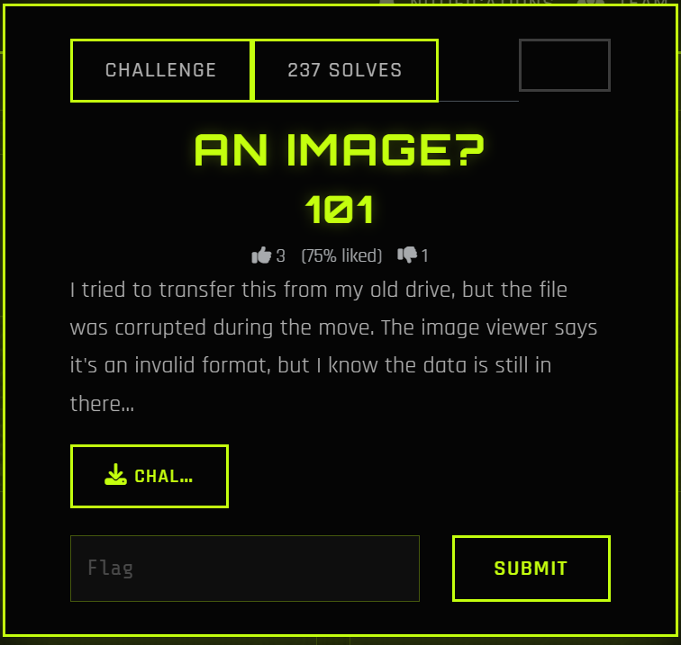
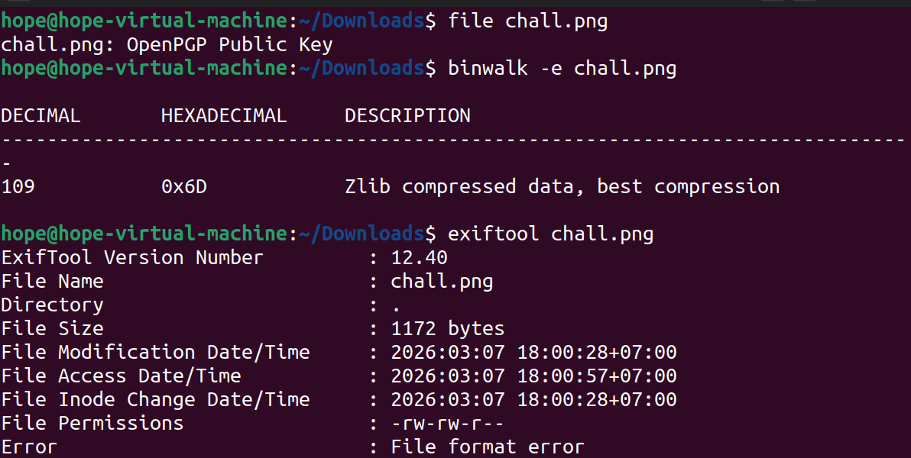
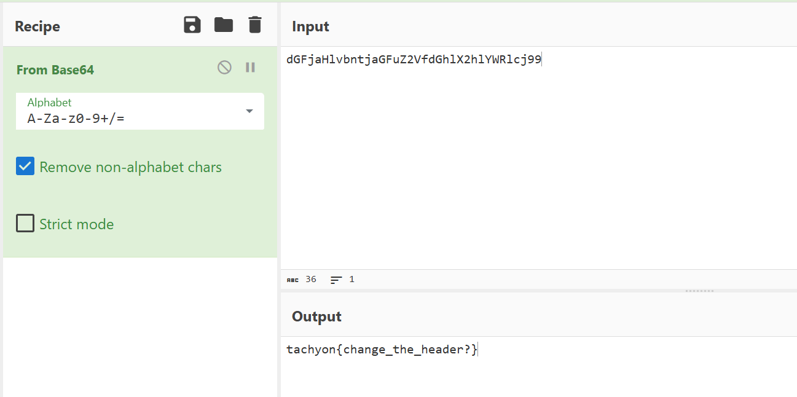
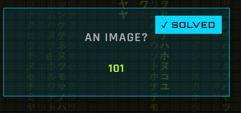

An Image?



<!--  -->

I tried to transfer this from my old drive, but the file was corrupted during the move. The image viewer says it's an invalid format, but I know the data is still in there...

    sudo apt install libimage-exiftool-perl binwalk 

    $ file chall.png 
    chall.png: OpenPGP Public Key

    binwalk -e chall.png 

    DECIMAL       HEXADECIMAL     DESCRIPTION
    --------------------------------------------------------------------------------
    109           0x6D            Zlib compressed data, best compression

    exiftool chall.png 
    ExifTool Version Number         : 12.40
    File Name                       : chall.png
    Directory                       : .
    File Size                       : 1172 bytes
    File Modification Date/Time     : 2026:03:07 18:00:28+07:00
    File Access Date/Time           : 2026:03:07 18:00:57+07:00
    File Inode Change Date/Time     : 2026:03:07 18:00:28+07:00
    File Permissions                : -rw-rw-r--
    Error                           : File format error





file chall.png detail is OpenPGP Public Key: This mean that 8 bytes inital of file are overwrited by signature of PGP insted of  PNG `89  50 4E 47`

binwalk find Zlib compressed data at 0x6D (109): In PNG, data of image in blocks IDAT, and these zip by Zlib. Therefore, binwalk found Zlib is a proof data still in image, this only change header some hex bytes errors.

    head -c 32 chall.png | xxd
    00000000: 9a61 5f58 0d0a 1a0a 0000 000d 4948 4452  .a_X........IHDR
    00000010: 0000 027b 0000 027b 0103 0000 00a1 fac5  ...{...{........

    sudo apt update
    sudo apt install hexedit -y
    hexedit chall.png 


Edit 8 bytes header: 89 50 4E 47 0D 0A 1A 0A

After change, find IHDR. If it don't appear in that, you need to edit next bytes from 12th to 49 48 44 52 - hex of IHDR 

Script:

    with open("chall.png", "rb") as f:
        data = f.read()
    png_header = b"\x89\x50\x4E\x47\x0D\x0A\x1A\x0A"
    fixed_data = png_header + data[8:]
    with open("fixed_chall.png", "wb") as f:
        f.write(fixed_data)
    


When I use my phone to scan QR of image, it transfer me to web browser and provide a base64 string `dGFjaHlvbntjaGFuZ2VfdGhlX2hlYWRlcj99`



Flag is: `tachyon{change_the_header?}`




---
# Writeup: An Image? (Forensics)

## 1. Challenge Description

A corrupted image file was provided. The goal is to repair the file structure to reveal the hidden information (Flag).

## 2. Tools Used

* `file`, `binwalk`, `exiftool`: File analysis.
* `xxd`: Hexdump tool.
* `Python 3`: Scripting for file repair.
* `Base64`: Final decoding.

## 3. Analysis

### Initial Triage

Using the `file` command reveals a mismatch:

```bash
$ file chall.png
chall.png: OpenPGP Public Key

```

The file signature is recognized as an OpenPGP Key. However, `binwalk` shows internal image components:

```bash
$ binwalk chall.png
109           0x6D            Zlib compressed data, best compression

```

In PNG files, image data is stored in **IDAT** chunks and compressed using **Zlib**. This confirms that the image payload is intact, but the header is corrupted.

### Hex Investigation

Inspecting the first 32 bytes with `xxd`:

```bash
$ head -c 32 chall.png | xxd
00000000: 9a61 5f58 0d0a 1a0a 0000 000d 4948 4452  .a_X........IHDR

```

* **Observed Bytes:** `9a 61 5f 58`
* **Expected PNG Magic Bytes:** `89 50 4e 47 0d 0a 1a 0a`
* The presence of the `IHDR` string at offset 12 confirms this is indeed a PNG file with a tampered header.

## 4. Solution

### Method: Python Header Repair

We can patch the file by overwriting the first 8 bytes with the correct PNG signature:

```python
with open("chall.png", "rb") as f:
    original_data = f.read()

# Standard PNG Header
png_header = b"\x89\x50\x4E\x47\x0D\x0A\x1A\x0A"

# Construct the fixed file
fixed_data = png_header + original_data[8:]

with open("fixed_chall.png", "wb") as f:
    f.write(fixed_data)

```

## 5. Result & Flag

Opening the repaired file reveals a **QR Code**. Scanning it yields the following Base64 string:
`dGFjaHlvbntjaGFuZ2VfdGhlX2hlYWRlcj99`

Decoding the string:

```bash
$ echo "dGFjaHlvbntjaGFuZ2VfdGhlX2hlYWRlcj99" | base64 -d
tachyon{change_the_header?}

```

**Flag:** `tachyon{change_the_header?}`
