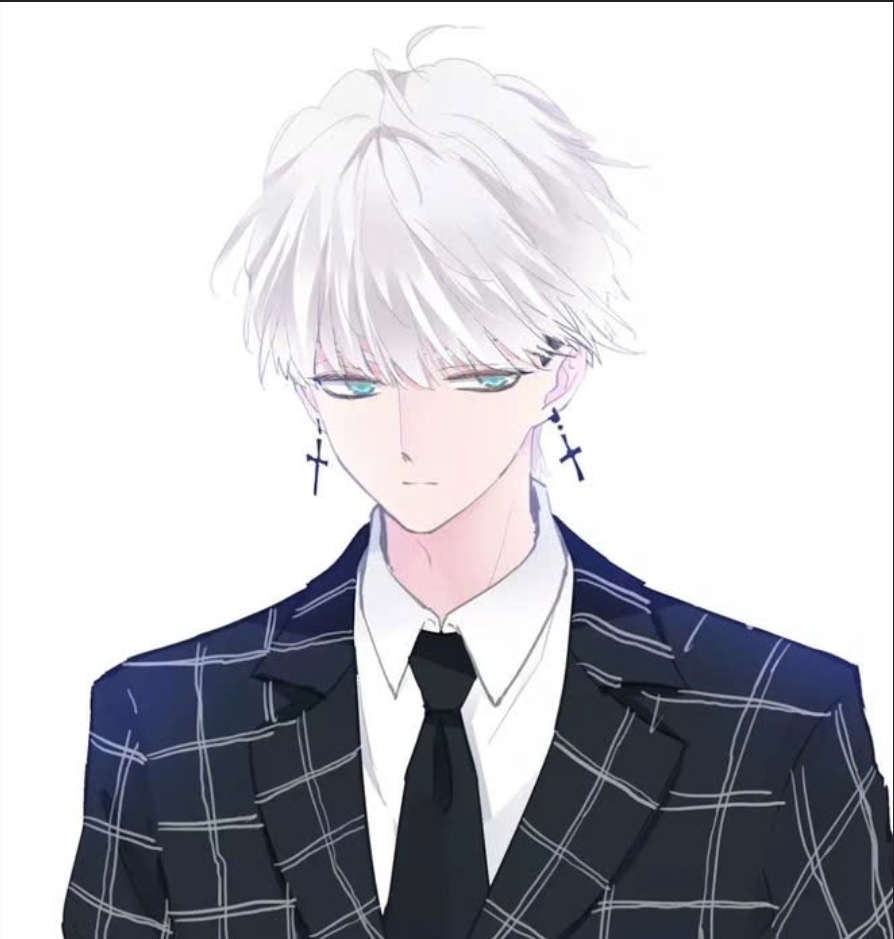
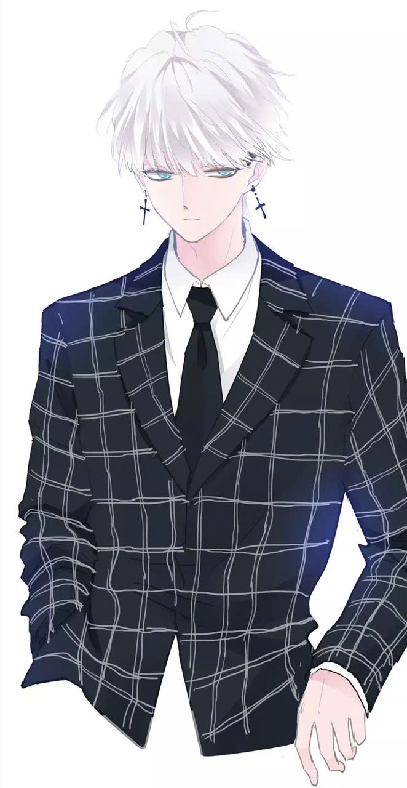

<link rel="preload" href="assets/images/avatar1.png" as="image" fetchpriority="high">
<link rel="preload" href="assets/images/avatar2.png" as="image">

  

    
Vuong Dat

    

      
        Sinh viên đại học
        <svg width="280" height="18" class="wcowin-header-underline" xmlns="http://www.w3.org/2000/svg">
          <path d="M8,12 Q38,18 68,12 Q98,6 128,12 Q158,18 188,12 Q218,6 248,12 Q278,18 308,12"
            stroke="#6ecbff" stroke-width="5" fill="none"
            stroke-linecap="round" stroke-linejoin="round"
            style="filter: blur(0.2px); opacity: 0.85;" />
        </svg>
      
    

    

      <a href="https://github.com/vuongdat67" target="_blank" class="wcowin-header-btn">Github</a>
      <a href="mailto:" class="wcowin-header-btn">Liên hệ</a>
    

  

  

    

      

      

        
        
      

    

  

  <h1>Theo đuổi hành trình khó khăn để đến với những vì sao ✨</h1>

---

  Đang tải...

---

-   :material-notebook-edit-outline:{ .lg .middle } __Điều hướng__

    ---
    { class="responsive-image" loading="lazy" align=right width="340" height="226" style="border-radius: 2.5em 1.5em 3em 2em / 2em 2.5em 1.5em 3em;" }

    - [x] Sử dụng {==Mục lục==} để mở bài viết

    - [x] Tìm kiếm {~~~bằng từ khóa~~}

    - [x] 𝐇𝐚𝐯𝐞 𝐚 𝐠𝐨𝐨𝐝 𝐭𝐢𝐦𝐞 !

    === "Chưa có"
        Chưa có

    === "Chưa có"
        Chưa có

-   :octicons-bookmark-16:{ .lg .middle } __Bài viết đề xuất__

    ---

    - [Tham khảo](./posts/guide/setup/references.md)

    - [Chưa có]()

    - [Chưa có]()

    - [Chưa có]()

-   :simple-materialformkdocs:{ .lg .middle } __Hướng dẫn Mkdocs__

    ---

    - [Hướng dẫn](./posts/guide/demo_mkdocs.md)

    - [Cấu hình](./posts/guide/setup/mkdocs_syntax/configmarkdown.md)

    - [Chưa có]()

    - [Chưa có]()

-   :material-format-font:{ .lg .middle } __Hữu ích / Thú vị__

    ---

    - [CTF](./ctf/index.md)

    - [Chưa có]()

    - [Chưa có]()

    - [Chưa có]()

-   :simple-aboutdotme:{ .lg .middle } __Về tác giả__

    ---

    - [Blog](./posts/index.md)

<meta name="algolia-site-verification" content="3CAAB2C27102AD08" />

<!--  -->