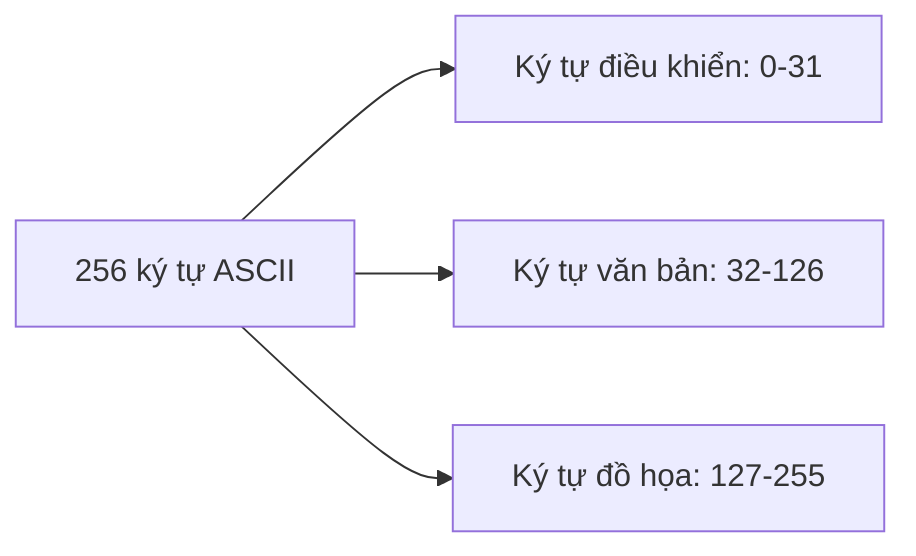
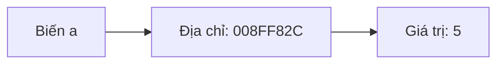

# L1. Các Kiểu Dữ Liệu Cơ Bản trong C++

## 1. Cấu Trúc Chương Trình C++

Một chương trình C++ cơ bản có cấu trúc như sau:

```cpp
#include <iostream>

int main() 
{  
    std::cout << "Xin chao";
    return 0;
}
```

!!! note "Giải thích cấu trúc"
    - `#include <iostream>`: Khai báo thư viện đầu vào/đầu ra
    - `int main()`: Hàm chính - điểm bắt đầu của chương trình
    - `std::cout`: Lệnh xuất dữ liệu ra màn hình
    - `return 0`: Kết thúc chương trình thành công

## 2. Bộ Từ Vựng trong C++

### 2.1. Ký Tự

C++ sử dụng các loại ký tự sau:

| Loại ký tự | Mô tả | Ví dụ |
|------------|-------|-------|
| Chữ cái Latin | 26 ký tự Latinh | A-Z, a-z |
| Chữ số thập phân | Các chữ số | 0-9 |
| Ký hiệu toán học | Các phép toán | + - * / = < > ( ) |
| Ký tự đặc biệt | Ký tự điều khiển | . , : ; [ ] % \ # $ ' |
| Ký tự khác | Gạch nối và khoảng trắng | _ và ' ' |

!!! warning "Lưu ý quan trọng"
    Khi viết chương trình C++, chỉ được phép sử dụng các ký tự trong bảng trên.

### 2.2. Từ Khóa (Keywords)

Từ khóa là các từ dành riêng trong ngôn ngữ C++, không thể sử dụng để đặt tên biến, hàm hay chương trình con.

```cpp
// Các từ khóa thông dụng
const, enum, signed, struct, typedef, unsigned
char, double, float, int, long, short, void
case, default, else, if, switch
do, for, while
break, continue, goto, return
```

!!! warning "Quy tắc từ khóa"
    - Từ khóa luôn viết bằng chữ thường
    - Không được sử dụng làm tên biến, hàm

### 2.3. Tên/Định Danh (Identifier)

Định danh là dãy ký tự dùng để đặt tên cho hằng, biến, kiểu dữ liệu, hàm.

**Quy tắc đặt tên:**

- Không trùng với từ khóa
- Ký tự đầu tiên phải là chữ cái hoặc dấu gạch dưới `_`
- Độ dài tối đa: 255 ký tự
- Không chứa khoảng trắng
- Phân biệt chữ hoa/thường

```cpp
// Tên hợp lệ
GiaiPhuongTrinh
Bai_Tap1
so_nguyen
_temp

// Tên KHÔNG hợp lệ
1A              // Bắt đầu bằng số
Giai Phuong Trinh  // Có khoảng trắng
@mail           // Ký tự đặc biệt không hợp lệ
default         // Trùng từ khóa
```

!!! tip "Phân biệt hoa/thường"
    Các tên sau đây hoàn toàn khác nhau:
    ```cpp
    A, a
    BaiTap, baitap, BAITAP, bAItaP
    ```

### 2.4. Hằng Ký Tự và Hằng Chuỗi

```cpp
// Hằng ký tự - sử dụng dấu nháy đơn
char ch = 'A';
char c = 'a';

// Hằng chuỗi - sử dụng dấu nháy kép
std::string str = "Hello World!";
std::string name = "Nguyen Van A";
```

!!! warning "Chú ý"
    `'A'` (ký tự) khác hoàn toàn với `"A"` (chuỗi)

### 2.5. Dấu Chấm Phẩy

Dấu chấm phẩy `;` dùng để phân cách các câu lệnh:

```cpp
// Các câu lệnh trên cùng một dòng
std::cout << "Xin chao"; return 0;

// Hoặc tách riêng (khuyến nghị)
std::cout << "Xin chao";
return 0;
```

### 2.6. Câu Chú Thích (Comments)

Chú thích giúp mô tả và ghi chú trong source code, làm code dễ đọc hơn.

**Cách 1: Chú thích nhiều dòng**
```cpp
/* Đây là câu chú thích 1
   Đây là câu chú thích 2
   Có thể viết nhiều dòng */
```

**Cách 2: Chú thích một dòng (Khuyến nghị)**
```cpp
// Đây là câu chú thích 1
// Đây là câu chú thích 2
```

!!! note "Lưu ý"
    - Khi biên dịch, các phần chú thích sẽ bị bỏ qua
    - Nên sử dụng nhất quán một cách
    - Cách 2 được sử dụng phổ biến hơn

## 3. Các Kiểu Dữ Liệu Cơ Sở

### 3.1. Kiểu Số Nguyên

| Kiểu dữ liệu | Kích thước | Phạm vi |
|--------------|------------|---------|
| `short` | 2 bytes | -32,768 đến 32,767 |
| `unsigned short` | 2 bytes | 0 đến 65,535 |
| `int` | 4 bytes | -2,147,483,648 đến 2,147,483,647 |
| `unsigned int` | 4 bytes | 0 đến 4,294,967,295 |
| `long` | 4 bytes | -2,147,483,648 đến 2,147,483,647 |
| `unsigned long` | 4 bytes | 0 đến 4,294,967,295 |
| `long long` | 8 bytes | -9,223,372,036,854,775,807 đến 9,223,372,036,854,775,807 |
| `unsigned long long` | 8 bytes | 0 đến 18,446,744,073,709,551,615 |

!!! info "Kiểm tra kích thước kiểu dữ liệu"
    ```cpp
    #include <iostream>
    
    int main() {
        std::cout << "char: " << sizeof(char) << " bytes\n";
        std::cout << "int: " << sizeof(int) << " bytes\n";
        std::cout << "short: " << sizeof(short) << " bytes\n";
        std::cout << "long: " << sizeof(long) << " bytes\n";
        return 0;
    }
    ```

!!! warning "Sự khác biệt int vs long"
    Kích thước của `int` và `long` có thể khác nhau tùy hệ điều hành và kiến trúc:
    
    | OS | Kiến trúc | Kích thước int | Kích thước long |
    |----|-----------|----------------|-----------------|
    | Windows | IA-32/Intel64/IA-64 | 4 bytes | 4 bytes |
    | Linux | IA-32 | 4 bytes | 4 bytes |
    | Linux | Intel64/IA-64 | 4 bytes | 8 bytes |
    | MacOS X | IA-32 | 4 bytes | 4 bytes |
    | MacOS X | Intel64 | 4 bytes | 8 bytes |

### 3.2. Kiểu Số Thực

**Các cách biểu diễn số thực:**

```cpp
// Dạng thập phân
float a = 45.0;
double b = -256.45;
float c = +122.8;

// Dạng khoa học
float d = 1.257E+01;   // 1.257 × 10¹ = 12.57
double e = 1257.0E-02; // 1257 × 10⁻² = 12.57
```

| Kiểu dữ liệu | Kích thước | Phạm vi | Độ chính xác |
|--------------|------------|---------|--------------|
| `float` | 4 bytes | 3.4E-38 đến 3.4E+38 | ~7 chữ số |
| `double` | 8 bytes | 1.7E-308 đến 1.7E+308 | ~15 chữ số |
| `long double` | 8-16 bytes | 1.7E-308 đến 1.7E+308 | ~15-19 chữ số |

!!! tip "Lựa chọn kiểu số thực"
    - Sử dụng `float` cho các phép tính đơn giản, tiết kiệm bộ nhớ
    - Sử dụng `double` cho các phép tính cần độ chính xác cao
    - Sử dụng `long double` cho các ứng dụng khoa học đòi hỏi độ chính xác rất cao

### 3.3. Kiểu Luận Lý/Logic (Boolean)

| Kiểu dữ liệu | Kích thước | Giá trị |
|--------------|------------|---------|
| `bool` | 1 byte | `false` (0) hoặc `true` (khác 0) |

```cpp
// Các cách khởi tạo giá trị boolean
bool isTrue1 = 1;          // true
bool isFalse1 = 0;         // false
bool isTrue2 = true;       // true
bool isFalse2 = false;     // false
bool isTrue3 = 100;        // true (khác 0)
```

### 3.4. Kiểu Void

Kiểu `void` là kiểu dữ liệu rỗng, không chứa giá trị.

**Cách sử dụng:**

**1. Hàm không trả về giá trị:**
```cpp
void swap(int &a, int &b) {
    int c = b;
    b = a;
    a = c;
}
```

**2. Con trỏ void (con trỏ chung):**
```cpp
int a = 10;
float b = 5.0;
void *c;        // Con trỏ void

c = &a;         // Trỏ đến int
c = &b;         // Trỏ đến float
```

### 3.5. Kiểu Ký Tự

Kiểu ký tự được biểu diễn thông qua bảng mã ASCII.

| Kiểu dữ liệu | Kích thước | Giá trị |
|--------------|------------|---------|
| `char` | 1 byte | -128 đến 127 hoặc 0 đến 255 |
| `unsigned char` | 1 byte | 0 đến 255 |

**Bảng mã ASCII thông dụng:**

| Ký tự | Mã ASCII |
|-------|----------|
| 0-9 | 48-57 |
| A-Z | 65-90 |
| a-z | 97-122 |
| Enter | 13 |
| ESC | 27 |
| Space | 32 |
| " | 34 |
| + | 43 |
| - | 45 |
| * | 42 |
| / | 47 |

**Phân loại 256 ký tự ASCII:**



**So sánh ký tự:**
```cpp
#include <iostream>

int main() {
    char a = 'a';
    char b = 'b';
    std::cout << (a < b);  // Kết quả: 1 (true)
    // Vì mã ASCII của 'a' (97) < mã ASCII của 'b' (98)
    return 0;
}
```

!!! example "Chương trình xuất mã ASCII"
    ```cpp
    #include <iostream>
    
    int main() {
        char ascii;
        while(1) {
            std::cout << "Nhap ki tu: ";
            std::cin >> ascii;
            std::cout << "Ma ASCII la: " << (int)ascii << std::endl;
        }
        return 0;
    }
    ```

### 3.6. Typedef

`typedef` dùng để đặt tên mới cho kiểu dữ liệu có sẵn.

**Cú pháp:**
```cpp
typedef kiểu_có_sẵn tên_mới;
```

**Ví dụ:**
```cpp
typedef int songuyen;
typedef float sothuc;

int a;           // Cách thông thường
songuyen b;      // Sử dụng typedef

float x;
sothuc y;
```

!!! tip "Lợi ích của typedef"
    - Làm code dễ đọc hơn
    - Dễ dàng thay đổi kiểu dữ liệu trong tương lai
    - Tạo tên có ý nghĩa cho kiểu dữ liệu phức tạp

### 3.7. Enum (Enumeration)

`enum` là kiểu dữ liệu liệt kê, giúp định nghĩa tập hợp các hằng số có tên.

**Cú pháp:**
```cpp
enum tên_danh_sách {
    danh_sách_các_tên
};
```

**Ví dụ:**
```cpp
#include <iostream>

enum gioi_tinh {
    nam = 1,
    nu = 2,
    khac = 3
};

int main() {
    gioi_tinh sv_gt = nam;
    std::cout << sv_gt;  // Kết quả: 1
    return 0;
}
```

!!! success "Tại sao nên sử dụng enum?"
    1. **Nhất quán**: Đảm bảo sử dụng đúng các giá trị được định nghĩa
    2. **Code rõ ràng**: Dễ đọc, dễ hiểu hơn so với dùng số trực tiếp
    3. **Dễ nâng cấp**: Thay đổi giá trị tập trung tại một chỗ
    4. **Dễ bảo trì**: Giảm thiểu lỗi khi sửa đổi code

## 4. Biến (Variables)

### 4.1. Giới Thiệu Chung

**Biến** là một ô nhớ hoặc vùng nhớ dùng để chứa dữ liệu trong quá trình thực hiện chương trình.

**Đặc điểm:**

- Mỗi biến có một kiểu dữ liệu cụ thể
- Kích thước phụ thuộc vào kiểu dữ liệu
- Giá trị có thể thay đổi trong quá trình chạy chương trình

**Quy tắc đặt tên biến:**

- Không trùng với từ khóa hoặc tên hàm
- Ký tự đầu tiên là chữ cái hoặc `_`
- Không chứa khoảng trắng
- Nên sử dụng chữ thường với `_` giữa các từ

```cpp
// Đặt tên biến theo chuẩn Google C++ Style Guide
int so_nguyen;
float so_thuc;
double gia_tri_trung_binh;
```

### 4.2. Cú Pháp Khai Báo Biến

**Cách 1: Khai báo nhiều biến cùng kiểu trên một dòng**
```cpp
kiểu_dữ_liệu tên_biến_1, tên_biến_2, tên_biến_3;

// Ví dụ
int i, j, k;
char c, ch;
float f, salary;
double d;
```

**Cách 2: Khai báo từng biến riêng biệt**
```cpp
kiểu_dữ_liệu tên_biến_1;
kiểu_dữ_liệu tên_biến_2;

// Ví dụ
int i;
int j;
int k;
```

**Khai báo và khởi tạo giá trị:**
```cpp
kiểu_dữ_liệu tên_biến = giá_trị;

// Ví dụ
int d = 3;
char x = 'x';
float f = 2.1;
```

!!! example "Ví dụ thực tế"
    Viết chương trình nhập vào 3 số a, b, c. Kiểm tra xem chúng có tạo thành 3 cạnh của tam giác không?
    
    ```cpp
    // Cách 1
    int a;
    int b;
    int c;
    
    // Cách 2 (Khuyến nghị)
    int a, b, c;
    ```

### 4.3. Địa Chỉ Của Biến

RAM được tạo từ nhiều ô nhớ, mỗi ô nhớ:

- Có kích thước 1 byte
- Có địa chỉ duy nhất, đánh số từ 0

Mỗi biến khi được khai báo sẽ được cấp phát một vùng nhớ với địa chỉ duy nhất.

**Truy cập địa chỉ biến:** Sử dụng toán tử `&`

```cpp
#include <iostream>

int main() {
    int a = 5;
    std::cout << "Gia tri cua a: " << a << '\n';
    std::cout << "Dia chi cua a: " << &a << '\n';
    return 0;
}
```

**Kết quả:**
```
Gia tri cua a: 5
Dia chi cua a: 008FF82C
```



### 4.4. Biến Cục Bộ (Local Variable)

**Định nghĩa:** Biến được khai báo bên trong một hàm hoặc block.

**Đặc điểm:**

- Chỉ sử dụng được trong hàm/block khai báo
- Các hàm khác không thể truy cập
- Được tạo khi vào hàm/block, hủy khi ra khỏi hàm/block

```cpp
#include <iostream>

int main() {
    int a = 2, b = 3;  // Biến cục bộ
    int c;             // Biến cục bộ
    
    c = a + b;
    std::cout << c;
    
    return 0;
}
// Biến a, b, c chỉ tồn tại trong hàm main
```

### 4.5. Biến Toàn Cục (Global Variable)

**Định nghĩa:** Biến được khai báo bên ngoài tất cả các hàm.

**Đặc điểm:**

- Thường được định nghĩa ở đầu file source code
- Giữ giá trị xuyên suốt chương trình
- Tất cả các hàm đều có thể truy cập

```cpp
#include <iostream>

int g;  // Biến toàn cục

int main() {
    int a = 2, b = 3;  // Biến cục bộ
    g = a + b;         // Truy cập biến toàn cục
    std::cout << g;
    return 0;
}
```

!!! warning "So sánh hai ví dụ"
    **Ví dụ 1:** Biến toàn cục không khởi tạo
    ```cpp
    int g;  // g = 0 (tự động khởi tạo)
    
    int main() {
        int a = 2, b = 3;
        g = a + b;
        std::cout << g;  // Kết quả: 5
        return 0;
    }
    ```
    
    **Ví dụ 2:** Biến toàn cục có khởi tạo
    ```cpp
    int g = 20;  // g = 20
    
    int main() {
        int a = 2, b = 3;
        g = a + b;
        std::cout << g;  // Kết quả: 5 (ghi đè giá trị 20)
        return 0;
    }
    ```

### 4.6. Khởi Tạo Biến Cục Bộ và Toàn Cục

**Biến cục bộ:**

- Không được tự động khởi tạo giá trị
- Phải gán giá trị trước khi sử dụng
- Giá trị ngẫu nhiên nếu không khởi tạo

**Biến toàn cục:**

- Được tự động khởi tạo giá trị mặc định

| Kiểu dữ liệu | Giá trị khởi tạo mặc định |
|--------------|---------------------------|
| `int` | 0 |
| `char` | '\0' |
| `float` | 0.0 |
| `double` | 0.0 |
| `pointer` | NULL |

```cpp
#include <iostream>

int g;  // Tự động = 0

int main() {
    int a;  // Giá trị ngẫu nhiên (rác)
    int b = 10;  // Khởi tạo = 10
    
    std::cout << g;  // OK: 0
    std::cout << b;  // OK: 10
    std::cout << a;  // Nguy hiểm: giá trị rác
    
    return 0;
}
```

!!! danger "Cảnh báo"
    Luôn khởi tạo giá trị cho biến cục bộ trước khi sử dụng để tránh lỗi không mong muốn!

## 5. Hằng (Constants)

### 5.1. Khái Niệm

**Hằng** là giá trị không đổi trong suốt quá trình thực thi chương trình.

**Đặc điểm:**

- Không thể gán lại giá trị
- Giúp code an toàn và dễ bảo trì hơn

### 5.2. Các Loại Hằng

**1. Hằng số nguyên:**
```cpp
int dec = 212;      // Hệ thập phân (cơ số 10)
int oct = 0213;     // Hệ bát phân (cơ số 8) - bắt đầu bằng 0
int hex = 0x4b;     // Hệ thập lục phân (cơ số 16) - bắt đầu bằng 0x
```

**2. Hằng số thực:**
```cpp
float a = 102.0;
double b = -223.1;
float c = 1234.56e-3;  // 1234.56 × 10⁻³ = 1.23456
```

**3. Hằng luận lý:**
```cpp
bool isValid = true;
bool isError = false;
```

**4. Hằng ký tự/chuỗi:**
```cpp
char ch = 'A';
std::string path = "C:\\user\\username\\local";
std::string name = "Nguyen Van A";
```

### 5.3. Định Nghĩa Hằng

**Cách 1: Sử dụng `#define`**

```cpp
#define tên_hằng giá_trị
```

!!! warning "Lưu ý"
    Không có dấu `;` ở cuối

```cpp
#include <iostream>
#define PI 3.14

int main() {
    int r = 2;
    std::cout << 2 * r * PI;  // Kết quả: 6.28
    return 0;
}
```

**Cách 2: Sử dụng `const` (Khuyến nghị)**

```cpp
const kiểu_giá_trị tên_hằng = giá_trị_hằng;
```

```cpp
#include <iostream>

int main() {
    const float PI = 3.14;
    int r = 2;
    std::cout << r * PI;  // Kết quả: 6.28
    return 0;
}
```

!!! question "Bài tập về nhà"
    Tìm hiểu sự khác biệt giữa `#define` và `const`:
    
    - Thời điểm xử lý
    - Kiểu dữ liệu
    - Phạm vi (scope)
    - Khả năng debug
    - An toàn kiểu (type safety)

### 5.4. So Sánh #define và const

| Tiêu chí | #define | const |
|----------|---------|-------|
| Xử lý | Preprocessor (trước biên dịch) | Compiler (khi biên dịch) |
| Kiểm tra kiểu | Không | Có |
| Phạm vi | Toàn file | Theo scope |
| Debug | Khó | Dễ |
| Bộ nhớ | Không chiếm | Chiếm |

## 6. Bài Tập Minh Họa

### Bài 1: Tính Tuổi

Cho biết năm sinh của một người và tính tuổi của người đó.

```cpp
#include <iostream>

int main() {
    int nam_sinh = 1998;
    int nam_hien_tai = 2024;
    int tuoi = 0;
    
    tuoi = nam_hien_tai - nam_sinh;
    
    std::cout << "Tuoi: " << tuoi;
    
    return 0;
}
```

### Bài 2: Các Phép Toán Cơ Bản

Cho 2 số a, b. Tính tổng, hiệu, tích và thương của hai số đó.

```cpp
#include <iostream>

int main() {
    int a = 10;
    int b = 3;
    
    int tong = a + b;
    int hieu = a - b;
    int tich = a * b;
    float thuong = (float)a / b;
    
    std::cout << "Tong: " << tong << '\n';
    std::cout << "Hieu: " << hieu << '\n';
    std::cout << "Tich: " << tich << '\n';
    std::cout << "Thuong: " << thuong << '\n';
    
    return 0;
}
```

!!! tip "Ép kiểu"
    Sử dụng `(float)a` để ép kiểu từ `int` sang `float`, tránh phép chia số nguyên.

### Bài 3: Tính Tiền và Thuế VAT

Cho biết tên sản phẩm, số lượng và đơn giá. Tính tiền và thuế VAT phải trả.

```cpp
#include <iostream>

int main() {
    int so_luong = 10;
    int don_gia = 500;
    int tien = 0;
    float vat = 0;
    
    tien = so_luong * don_gia;
    vat = tien * 0.1;  // VAT 10%
    
    std::cout << "Tien: " << tien << '\n';
    std::cout << "VAT: " << vat << '\n';
    std::cout << "Tong cong: " << tien + vat << '\n';
    
    return 0;
}
```

### Bài 4: Tính Điểm Trung Bình

Cho điểm thi và hệ số 3 môn Toán, Lý, Hóa. Tính điểm trung bình.

```cpp
#include <iostream>

int main() {
    float toan = 6.5;
    float hs_toan = 2.0;
    
    float ly = 7.0;
    float hs_ly = 1.0;
    
    float hoa = 7.5;
    float hs_hoa = 1.0;
    
    float dtb = (toan * hs_toan + ly * hs_ly + hoa * hs_hoa) 
                / (hs_toan + hs_ly + hs_hoa);
    
    std::cout << "Diem trung binh: " << dtb;
    
    return 0;
}
```

### Bài 5: Tính Chu Vi và Diện Tích Hình Tròn

Cho bán kính đường tròn, tính chu vi và diện tích.

```cpp
#include <iostream>
#define PI 3.14

int main() {
    float r = 6.5;
    float chu_vi = 0;
    float dien_tich = 0;
    
    chu_vi = 2 * PI * r;
    dien_tich = PI * r * r;
    
    std::cout << "Chu vi: " << chu_vi << '\n';
    std::cout << "Dien tich: " << dien_tich << '\n';
    
    return 0;
}
```

## 7. Bài Tập Về Nhà

!!! question "Bài 1: Tách chữ số biển xe"
    Cho số xe gồm 5 chữ số. Tính tổng các chữ số (số nút).
    
    **Gợi ý:** Sử dụng phép chia và phép chia lấy dư.

!!! question "Bài 2: Chuyển đổi chữ thường - chữ hoa"
    Cho 1 ký tự chữ thường. In ra ký tự chữ hoa tương ứng.
    
    **Gợi ý:** Sử dụng bảng mã ASCII và phép trừ.

!!! question "Bài 3: Tìm số lớn nhất và nhỏ nhất"
    Cho 3 số nguyên. Tìm số lớn nhất và nhỏ nhất.
    
    **Gợi ý:** Sử dụng câu lệnh điều kiện (sẽ học ở bài sau).

!!! question "Bài 4: Tính biểu thức toán học"
    Cho số thực x. Tính giá trị các biểu thức:
    
    a) $y = \sqrt{x^2 + x + 1} + 4(x + 10 - 3x - 1)$
    
    b) $y = \frac{\sin^2(x) + 1}{e^x + \cos(4x^2)}$
    
    **Gợi ý:** Sử dụng thư viện `<cmath>` cho các hàm toán học.

!!! question "Bài 5: Cộng trừ giờ"
    Viết chương trình cho 2 giờ (giờ, phút, giây) và thực hiện cộng, trừ 2 giờ này.
    
    **Gợi ý:** 
    - Chuyển đổi sang tổng số giây
    - Thực hiện phép tính
    - Chuyển ngược lại sang (giờ, phút, giây)

---

!!! success "Tổng kết"
    Trong bài này, chúng ta đã học:
    
    - Cấu trúc chương trình C++ cơ bản
    - Bộ từ vựng: ký tự, từ khóa, định danh, hằng, chú thích
    - Các kiểu dữ liệu cơ sở: số nguyên, số thực, ký tự, boolean, void
    - Khai báo và sử dụng biến (cục bộ, toàn cục)
    - Định nghĩa và sử dụng hằng
    - Các bài tập thực hành cơ bản
    
    **Bài tiếp theo:** Các toán tử và biểu thức trong C++