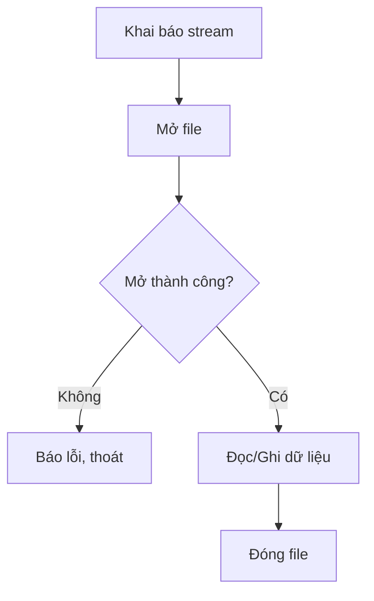

# L11. Tập Tin (File I/O)

## 1. Giới Thiệu Về Tập Tin

### 1.1. Tại Sao Phải Sử Dụng Tập Tin?

**Thông thường:**

```
Nhập từ bàn phím → Lưu trên RAM → Xử lý → Xuất ra màn hình
```

**Ưu điểm:**
- Tốc độ truy xuất cao
- Đơn giản, dễ sử dụng

**Nhược điểm:**
- RAM đắt tiền, dung lượng hạn chế
- Mất điện → Mất dữ liệu
- Không xử lý được Big Data
- Không lưu trữ dài hạn

**Giải pháp: Sử dụng Tập Tin**

```
Nhập từ file → Xử lý trên RAM → Ghi vào file
       ↑                              ↓
       └──────────────────────────────┘
           Lưu trữ lâu dài trên ổ cứng
```

### 1.2. Khái Niệm Tập Tin

**Tập tin (File):**

- Tập hợp thông tin được tổ chức theo dạng xác định
- Có tên được định danh
- Là dãy byte liên tục (góc độ lưu trữ)
- Lưu trữ trên thiết bị ngoài: HDD, SSD, USB...
- Cho phép đọc và ghi dữ liệu

### 1.3. Phân Loại Tập Tin

**Theo mục đích sử dụng:**
- `.EXE`, `.DOCX`, `.TXT`, `.PPT`, `.PDF`...

**Theo cách sử dụng trong lập trình:**

1. **Tập tin văn bản (Text file)**
   - Chỉ chứa các ký tự
   - Tổ chức thành từng dòng
   - Kết thúc dòng: `\0` hoặc `\n`
   - Có thể đọc được bằng notepad

2. **Tập tin nhị phân (Binary file)**
   - Chứa các byte
   - Đọc/ghi chính xác từng byte
   - Không đọc được bằng text editor

!!! note "Trong khóa học này"
    Chúng ta tập trung vào **tập tin văn bản**

## 2. Quy Tắc Đặt Tên Tập Tin

### 2.1. Cú Pháp

```
<Tên_tập_tin>.<Mở_rộng>
```

**Tên tập tin:**
- **Bắt buộc** phải có
- Tối đa 128 ký tự
- Gồm: A-Z, a-z, 0-9, khoảng trắng, @#$%^()!
- Không dùng: `/ \ : * ? " < > |`

**Mở rộng:**
- Không bắt buộc
- Thường 3-4 ký tự
- Ví dụ: `.txt`, `.dat`, `.cpp`, `.exe`

**Ví dụ:**
- `data.txt` ✓
- `my file 2024.dat` ✓
- `report#1.txt` ✓
- `file/name.txt` ✗ (có dấu /)

### 2.2. Đường Dẫn (Path)

**Đường dẫn:**

Địa chỉ chỉ đến tập tin trên ổ cứng.

**Ví dụ Windows:**
```
C:\data\list.txt
```

**Trong C++:**
```cpp
"C:\\data\\list.txt"  // Phải dùng \\
```

!!! warning "Lưu ý"
    - Dấu `\` là ký tự đặc biệt
    - Phải viết `\\` để biểu diễn `\`
    - Nếu nhập từ bàn phím thì không cần `\\`

**Đường dẫn tương đối:**
```cpp
"data.txt"           // Cùng thư mục với file .exe
"input\\data.txt"    // Trong thư mục con input
"..\\data.txt"       // Thư mục cha
```

## 3. Thao Tác Với Tập Tin

### 3.1. Quy Trình Cơ Bản


**So sánh với nhập/xuất chuẩn:**

```cpp
// Nhập/xuất chuẩn
#include <iostream>
cin >> variable;
cout << value;

// Nhập/xuất tập tin
#include <fstream>
ifstream >> variable;  // Đọc từ file
ofstream << value;     // Ghi vào file
```

### 3.2. Thư Viện fstream

```cpp
#include <fstream>
```

**Ba loại stream:**

| Stream | Mục đích | Ý nghĩa |
|--------|----------|---------|
| `ifstream` | Đọc từ file | **i**nput **f**ile stream |
| `ofstream` | Ghi vào file | **o**utput **f**ile stream |
| `fstream` | Đọc và ghi | **f**ile stream |

## 4. Mở và Đóng Tập Tin

### 4.1. Mở Tập Tin Để Đọc

**Cú pháp:**

```cpp
ifstream <tên_biến>(<đường_dẫn_tập_tin>);
```

**Ví dụ:**

```cpp
ifstream input("test.txt");

if (!input) {
    cout << "Khong mo duoc file!" << endl;
    return 1;
}

// Đọc dữ liệu

input.close();
```

### 4.2. Mở Tập Tin Để Ghi

**Cú pháp:**

```cpp
ofstream <tên_biến>(<đường_dẫn_tập_tin>);
```

**Ví dụ:**

```cpp
ofstream output("test.txt");

if (!output) {
    cout << "Khong mo duoc file!" << endl;
    return 1;
}

// Ghi dữ liệu

output.close();
```

!!! danger "Lưu ý"
    Mở file để ghi sẽ **xóa toàn bộ** nội dung cũ!

### 4.3. Ghi Tích Hợp Vào Cuối File

**Sử dụng `ios::app` (append):**

```cpp
ofstream output("test.txt", ios::app);

if (!output) {
    cout << "Khong mo duoc file!" << endl;
    return 1;
}

// Ghi thêm vào cuối file

output.close();
```

### 4.4. Kiểm Tra và Đóng File

**Kiểm tra mở file thành công:**

```cpp
ifstream in("test.txt");

if (!in) {
    cout << "Khong mo duoc file!" << endl;
    return 1;
}

// Hoặc
if (in.fail()) {
    cout << "Khong mo duoc file!" << endl;
    return 1;
}
```

**Đóng file:**

```cpp
in.close();   // Đóng file input
out.close();  // Đóng file output
```

## 5. Ghi Dữ Liệu Vào Tập Tin

### 5.1. Ghi Cơ Bản

**Cú pháp:**

```cpp
ofstream out(<tên_file>);
out << <dữ_liệu>;
```

**Ví dụ 1: Ghi số và chuỗi**

```cpp
#include <iostream>
#include <fstream>
using namespace std;

int main() {
    ofstream out("test.txt");
    
    if (!out) {
        cout << "Khong mo duoc file!" << endl;
        return 1;
    }
    
    out << 10 << "\t" << 123.23 << endl;
    out << "HelloCplusplus.";
    
    out.close();
    return 0;
}
```

**Nội dung file `test.txt`:**
```
10      123.23
HelloCplusplus.
```

### 5.2. Ghi Tích Hợp (Append)

```cpp
#include <iostream>
#include <fstream>
using namespace std;

int main() {
    // Ghi lần 1
    ofstream out("test.txt");
    out << "Line 1" << endl;
    out.close();
    
    // Ghi tích hợp
    ofstream out2("test.txt", ios::app);
    out2 << "Line 2" << endl;
    out2.close();
    
    return 0;
}
```

**Nội dung file `test.txt`:**
```
Line 1
Line 2
```

### 5.3. Ghi Mảng Vào File

```cpp
void ghiMang(int a[], int n, const char* filename) {
    ofstream out(filename);
    
    if (!out) {
        cout << "Khong mo duoc file!" << endl;
        return;
    }
    
    out << n << endl;  // Ghi số phần tử
    for (int i = 0; i < n; i++) {
        out << a[i] << " ";
    }
    
    out.close();
}
```

## 6. Đọc Dữ Liệu Từ Tập Tin

### 6.1. Đọc Cơ Bản

**Cú pháp:**

```cpp
ifstream in(<tên_file>);
in >> <biến>;
```

**Ví dụ: Đọc số và chuỗi**

```cpp
#include <iostream>
#include <fstream>
using namespace std;

int main() {
    char ch;
    int i;
    float f;
    char str[80];
    
    ifstream in("test.txt");
    
    if (!in) {
        cout << "Khong mo duoc file!" << endl;
        return 1;
    }
    
    in >> i;      // Đọc số nguyên
    in >> f;      // Đọc số thực
    in >> ch;     // Đọc ký tự
    in >> str;    // Đọc chuỗi
    
    cout << i << " " << f << " " << ch << endl;
    cout << str << endl;
    
    in.close();
    return 0;
}
```

### 6.2. Đọc Từng Ký Tự

**Sử dụng `get()`:**

```cpp
#include <iostream>
#include <fstream>
using namespace std;

int main() {
    char ch;
    ifstream in("test.txt");
    
    if (!in) {
        cout << "Khong mo duoc file!" << endl;
        return 1;
    }
    
    while (!in.eof()) {
        in.get(ch);
        if (!in.eof())  // Tránh in ký tự cuối lặp lại
            cout << ch;
    }
    
    in.close();
    return 0;
}
```

### 6.3. Đọc Từng Dòng

**Sử dụng `getline()`:**

```cpp
#include <iostream>
#include <fstream>
#include <string>
using namespace std;

int main() {
    ifstream in("test.txt");
    
    if (!in) {
        cout << "Khong mo duoc file!" << endl;
        return 1;
    }
    
    // Đọc từng dòng
    for (string str; getline(in, str);) {
        cout << str << endl;
    }
    
    in.close();
    return 0;
}
```

### 6.4. Hàm Kiểm Tra Cuối File

**Hàm `eof()` (End Of File):**

```cpp
while (!in.eof()) {
    // Đọc dữ liệu
}
```

**Ví dụ đọc mảng:**

```cpp
void docMang(int a[], int &n, const char* filename) {
    ifstream in(filename);
    
    if (!in) {
        cout << "Khong mo duoc file!" << endl;
        return;
    }
    
    in >> n;  // Đọc số phần tử
    for (int i = 0; i < n; i++) {
        in >> a[i];
    }
    
    in.close();
}
```

## 7. Bài Tập Minh Họa

### Bài Tập 1: Tính Trung Bình

**Yêu cầu:**

Tạo file `trung binh.txt` có nội dung:
```
46  56  12
12  34  56
45  78  90
```

Tính trung bình mỗi cột, ghi tích hợp vào file:
```
46  56  12
12  34  56
45  78  90
34.33  56  52.66
```

**Giải:**

```cpp
#include <iostream>
#include <fstream>
#include <sstream>
#include <string>
using namespace std;

int main() {
    // Tạo file ban đầu
    ofstream out("trung binh.txt");
    out << 46 << "\t" << 56 << "\t" << 12 << endl;
    out << 12 << "\t" << 34 << "\t" << 56 << endl;
    out << 45 << "\t" << 78 << "\t" << 90 << endl;
    out.close();
    
    // Đọc và tính trung bình
    ifstream in("trung binh.txt");
    float s1 = 0, s2 = 0, s3 = 0;
    int step = 0, t;
    
    for (string str; getline(in, str);) {
        istringstream iss(str);
        step = 0;
        
        do {
            string sub;
            iss >> sub;
            if (sub != "") {
                t = atoi(sub.c_str());
                if (step == 0) s1 += t;
                else if (step == 1) s2 += t;
                else if (step == 2) s3 += t;
                ++step;
            }
        } while (iss);
    }
    
    s1 /= 3; s2 /= 3; s3 /= 3;
    in.close();
    
    // Làm tròn 2 chữ số
    s1 = (int)(s1 * 100) / 100.0;
    s2 = (int)(s2 * 100) / 100.0;
    s3 = (int)(s3 * 100) / 100.0;
    
    // Ghi tích hợp
    ofstream out2("trung binh.txt", ios::app);
    out2 << endl;
    out2 << s1 << "\t" << s2 << "\t" << s3 << endl;
    out2.close();
    
    return 0;
}
```

### Bài Tập 2: Quản Lý Mảng Số Nguyên

**Yêu cầu:**

Nhập mảng số nguyên, ghi vào file `Integer.txt`:
- Dòng 1: "Begin Day"
- Dòng 2: Số phần tử
- Các dòng tiếp: Mỗi dòng 20 phần tử
- Dòng cuối: "End Day"

Đọc file và tìm phần tử lớn nhất.

**Giải:**

```cpp
#include <iostream>
#include <fstream>
using namespace std;

void ghiMang(int a[], int n) {
    ofstream out("Integer.txt");
    
    out << "Begin Day" << endl;
    out << n << endl;
    
    for (int i = 0; i < n; i++) {
        out << a[i] << " ";
        if ((i + 1) % 20 == 0)
            out << endl;
    }
    
    out << endl << "End Day" << endl;
    out.close();
}

int timMax() {
    ifstream in("Integer.txt");
    
    string temp;
    getline(in, temp);  // Bỏ "Begin Day"
    
    int n;
    in >> n;
    
    int max, x;
    in >> max;  // Phần tử đầu tiên
    
    for (int i = 1; i < n; i++) {
        in >> x;
        if (x > max)
            max = x;
    }
    
    in.close();
    return max;
}

int main() {
    int a[100], n;
    
    cout << "Nhap n: ";
    cin >> n;
    
    cout << "Nhap mang:\n";
    for (int i = 0; i < n; i++) {
        cin >> a[i];
    }
    
    ghiMang(a, n);
    
    int max = timMax();
    cout << "Phan tu lon nhat: " << max << endl;
    
    return 0;
}
```

### Bài Tập 3: Ma Trận

**Yêu cầu:**

Nhập ma trận vuông, ghi vào `matran.txt`:
- Dòng 1: Cấp ma trận
- Các dòng tiếp: Mỗi dòng của ma trận

Đọc file, tìm min, max, dòng có tổng lớn nhất.

**Giải:**

```cpp
#include <iostream>
#include <fstream>
using namespace std;

void ghiMaTran(int a[][100], int n) {
    ofstream out("matran.txt");
    
    out << n << endl;
    for (int i = 0; i < n; i++) {
        for (int j = 0; j < n; j++) {
            out << a[i][j] << " ";
        }
        out << endl;
    }
    
    out.close();
}

void timMinMax(int &min, int &max) {
    ifstream in("matran.txt");
    
    int n;
    in >> n;
    
    int x;
    in >> x;
    min = max = x;
    
    for (int i = 0; i < n * n - 1; i++) {
        in >> x;
        if (x < min) min = x;
        if (x > max) max = x;
    }
    
    in.close();
}

int main() {
    int a[100][100], n;
    
    cout << "Nhap cap ma tran: ";
    cin >> n;
    
    cout << "Nhap ma tran:\n";
    for (int i = 0; i < n; i++) {
        for (int j = 0; j < n; j++) {
            cin >> a[i][j];
        }
    }
    
    ghiMaTran(a, n);
    
    int min, max;
    timMinMax(min, max);
    
    cout << "Min: " << min << endl;
    cout << "Max: " << max << endl;
    
    return 0;
}
```

## 8. Bài Tập Bắt Buộc

!!! question "Bài 1: Dãy số nguyên"
    Nhập dãy số nguyên, ghi vào `Integer.txt`:
    - Dòng 1: "Begin Day"
    - Dòng 2: Số phần tử
    - Các dòng tiếp: Mỗi dòng 20 phần tử
    - Dòng cuối: "End Day"
    
    Đọc file và tìm phần tử lớn nhất.

!!! question "Bài 2: Ma trận"
    Nhập ma trận vuông, ghi vào `matran.txt`:
    - Dòng 1: Cấp ma trận
    - Các dòng tiếp: Mỗi dòng của ma trận
    
    Đọc file, tìm min, max, dòng có tổng lớn nhất.

!!! question "Bài 3: Quản lý sinh viên"
    Nhập danh sách sinh viên (mã, họ tên, năm sinh, điểm TB), ghi vào file.
    
    Đọc file và:
    - Xuất danh sách
    - Thêm sinh viên vào cuối
    - Tìm sinh viên theo mã

!!! question "Bài 4: Thống kê văn bản"
    Đọc file văn bản, thống kê:
    - Số dòng
    - Số từ
    - Số ký tự
    - Tần suất xuất hiện của mỗi ký tự

!!! question "Bài 5: Sao chép file"
    Viết chương trình sao chép nội dung từ file này sang file khác.

---

## 9. Tổng Kết và Lưu Ý

### 9.1. Quy Trình Làm Việc Với File



### 9.2. Bảng Tổng Hợp

| Thao tác | ifstream (Đọc) | ofstream (Ghi) |
|----------|----------------|----------------|
| Mở file | `ifstream in("file.txt");` | `ofstream out("file.txt");` |
| Ghi thêm cuối | - | `ofstream out("file.txt", ios::app);` |
| Đọc/Ghi | `in >> variable;` | `out << value;` |
| Đọc dòng | `getline(in, str);` | - |
| Đọc ký tự | `in.get(ch);` | - |
| Kiểm tra cuối file | `in.eof()` | - |
| Đóng file | `in.close();` | `out.close();` |

### 9.3. Các Lưu Ý Quan Trọng

!!! warning "Lưu ý"
    1. **Luôn kiểm tra** file mở thành công trước khi sử dụng
    2. **Luôn đóng file** sau khi hoàn thành
    3. Mở file ghi sẽ **xóa nội dung cũ**, dùng `ios::app` để ghi thêm
    4. Đường dẫn Windows dùng `\\` thay vì `\`
    5. Kiểm tra `eof()` khi đọc tuần tự
    6. Dùng `getline()` để đọc cả dòng (kể cả khoảng trắng)
    7. Dùng `>>` để đọc từng từ (bỏ qua khoảng trắng)

### 9.4. So Sánh iostream vs fstream

| iostream | fstream | Chức năng |
|----------|---------|-----------|
| `cin` | `ifstream` | Đọc dữ liệu |
| `cout` | `ofstream` | Ghi dữ liệu |
| `>>` | `>>` | Toán tử nhập |
| `<<` | `<<` | Toán tử xuất |
| `getline(cin, str)` | `getline(in, str)` | Đọc dòng |

---

!!! success "Hoàn Thành Khóa Học"
    **Chúc mừng! Bạn đã hoàn thành toàn bộ nội dung khóa học Nhập Môn Lập Trình C++**
    
    **Tổng hợp kiến thức:**
    
    ✓ Cơ bản: Biến, kiểu dữ liệu, toán tử  
    ✓ Cấu trúc điều khiển: if-else, switch, for, while  
    ✓ Hàm: Khai báo, tham số, đệ quy  
    ✓ Mảng: 1 chiều, 2 chiều, chuỗi ký tự  
    ✓ Struct: Kiểu cấu trúc do người dùng định nghĩa  
    ✓ Con trỏ: Cơ bản, mảng, cấp phát động  
    ✓ File I/O: Đọc/ghi tập tin
    
    **Bước tiếp theo:**
    
    - Lập trình hướng đối tượng (OOP)
    - Cấu trúc dữ liệu (Data Structures)
    - Thuật toán (Algorithms)
    - STL (Standard Template Library)