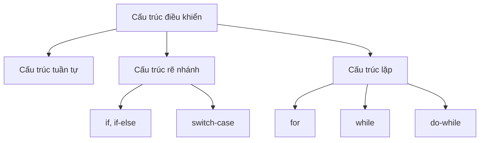
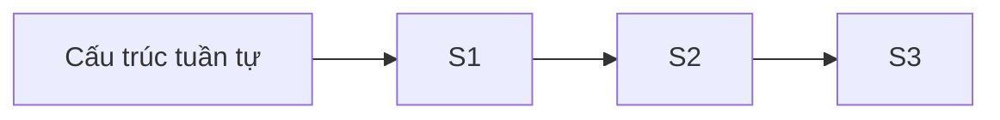
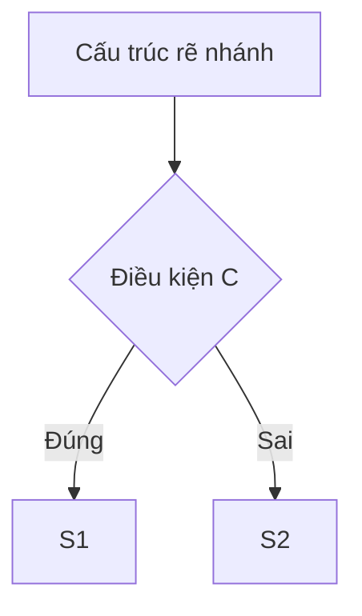
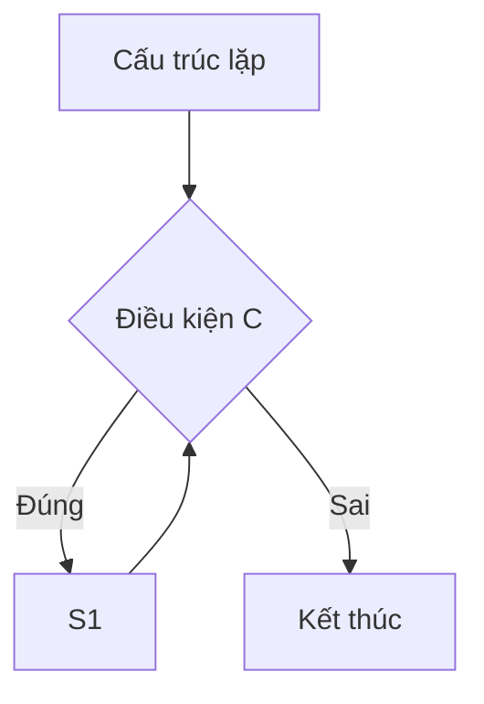
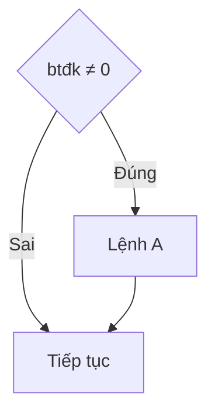
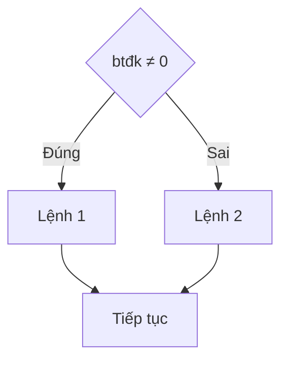
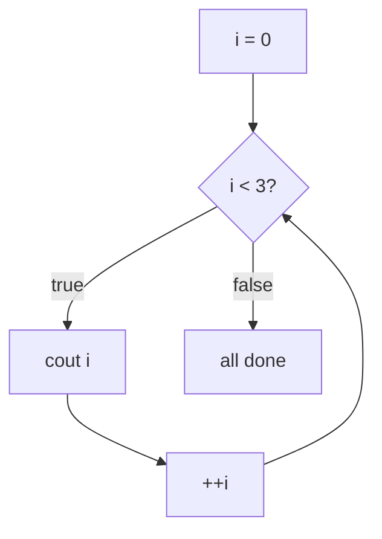
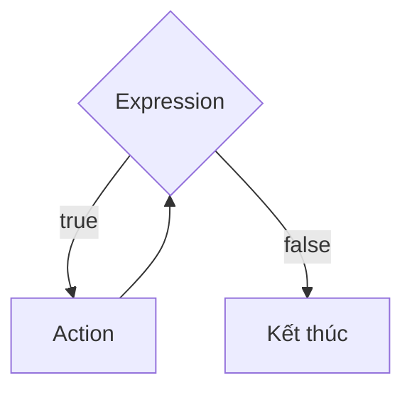
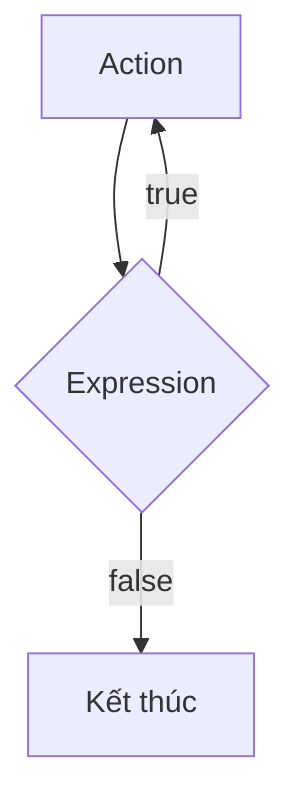

# L3. Cấu Trúc Điều Khiển trong C++

## Phần 1: Cấu Trúc Rẽ Nhánh

### 1. Khái Niệm Câu Lệnh và Khối Lệnh

**Câu lệnh (Statement):**
- Xác định một công việc mà chương trình phải thực hiện
- Các câu lệnh được ngăn cách bằng dấu `;`

```cpp
int n;
cout << "Nhap vao so nguyen n = ";
cin >> n;
cout << "So n = " << n;
```

**Khối lệnh (Block):**
- Dãy các câu lệnh được bao bởi cặp dấu `{ }`

```cpp
{
    int n;
    cout << "Nhap vao so nguyen n = ";
    cin >> n;
    cout << "So n = " << n;
}
```

### 2. Phạm Vi Hoạt Động Của Biến

Tất cả các biến phải được khai báo trước khi sử dụng.

**Biến cục bộ (Local variable):**
- Được khai báo trong một khối `{ }`
- Chỉ có tác dụng trong khối đó
- Bị xóa khi ra khỏi khối

**Biến toàn cục (Global variable):**
- Được khai báo bên ngoài các khối
- Có phạm vi toàn chương trình
- Chỉ bị xóa khi chương trình kết thúc

```cpp
#include <iostream>
using namespace std;

int x = 3;  // Biến toàn cục

void main() {
    cout << x;      // 3
    int x = 5;      // Biến cục bộ che biến toàn cục
    {   
        cout << x;  // 5
        int x = 7;  // Biến cục bộ trong khối con
        cout << x;  // 7
        cout << ::x; // 3 (truy cập biến toàn cục)
    }
    cout << x;      // 5
    cout << ::x;    // 3
}
```

!!! warning "Lưu ý"
    - Biến cục bộ có thể trùng tên với biến toàn cục
    - Trong phạm vi biến cục bộ, nó sẽ che biến toàn cục
    - Sử dụng `::` để truy cập biến toàn cục khi bị che

### 3. Giới Thiệu Cấu Trúc Điều Khiển



**Biểu diễn sơ đồ:**







### 4. Cấu Trúc Rẽ Nhánh if

**Cú pháp:**
```cpp
if (biểu_thức_điều_kiện) 
    Lệnh_A;
```

**Lưu đồ:**



**Ví dụ:**

```cpp
int a = 10, b = 15, c = 8;
int m;

// Cách 1: Sử dụng if đơn
m = a;
if (b < m) m = b;
if (c < m) m = c;
cout << "Gia tri be nhat m = " << m;
```

### 5. Cấu Trúc Rẽ Nhánh if-else

**Cú pháp:**
```cpp
if (biểu_thức_điều_kiện) 
    Lệnh_1;
else 
    Lệnh_2;
```

**Lưu đồ:**



**Ví dụ:**

```cpp
// Cách 2: Sử dụng if-else lồng nhau
int a = 10, b = 15, c = 8;
int m;

if (a < b)
    if (a < c) 
        m = a;
    else 
        m = c;
else
    if (b < c) 
        m = b;
    else 
        m = c;
        
cout << "Gia tri be nhat m = " << m;
```

```cpp
// Cách 3: Sử dụng toán tử điều kiện
int a = 10, b = 15, c = 8;
int m = (a < b) ? ((a < c) ? a : c) : ((b < c) ? b : c);
cout << "Gia tri be nhat m = " << m;
```

### 6. Cấu Trúc Rẽ Nhánh switch-case

**Cú pháp:**
```cpp
switch (biểu_thức_điều_kiện) {
    case hằng_số_1: 
        câu_lệnh_1;
        break;
    case hằng_số_2: 
        câu_lệnh_2;
        break;
    ...
    default: 
        câu_lệnh_default;
}
```

!!! note "Đặc điểm"
    - `biểu_thức_điều_kiện`: Biểu thức số học nhận giá trị nguyên
    - `hằng_số`: Các hằng số nguyên khác nhau
    - `default`: Nhánh mặc định (không bắt buộc)
    - `break`: Thoát khỏi switch (nếu không có sẽ thực hiện tiếp case sau)

**Ví dụ 1:**

```cpp
#include <iostream>
using namespace std;

void main() {
    char ch;
    cout << "Nhap gia tri ch = ";
    cin >> ch;
    
    switch (ch) {
        case 'a': 
            cout << "Ki tu a da duoc nhap"; 
            break;
        case 'b': 
            cout << "Ki tu b da duoc nhap"; 
            break;
        default: 
            cout << "Ki tu khac a va b da duoc nhap";
    }
}
```

**Ví dụ 2:**

```cpp
#include <iostream>
using namespace std;

void main() {
    int a;
    printf("Nhap a: ");
    scanf("%d", &a);
    
    switch (a) {
        case 1: 
            printf("Mot"); 
            break;
        case 2: 
            printf("Hai"); 
            break;
        case 3: 
            printf("Ba"); 
            break;
        default: 
            printf("Ko biet doc");
    }
}
```

## Bài Tập Bắt Buộc - Rẽ Nhánh

!!! question "Bài 1: Sắp xếp 3 số"
    Viết chương trình nhập vào 3 số thực a, b, c. In ra theo thứ tự tăng dần.

!!! question "Bài 2: Giải phương trình bậc hai"
    Viết chương trình giải phương trình bậc hai ax² + bx + c = 0

!!! question "Bài 3: Kiểm tra tam giác"
    Nhập ba số a, b, c. Kiểm tra xem chúng có thể là độ dài các cạnh của tam giác hay không. Nếu có thì cho biết đó là tam giác gì: NHON, VUONG, TU?

!!! question "Bài 4: Tính tiền taxi"
    Tính tiền đi taxi từ số km nhập vào. Biết:
    
    - 1 km đầu giá 15,000đ
    - Từ km thứ 2 đến km thứ 5 giá 13,500đ
    - Từ km thứ 6 trở đi giá 11,000đ
    - Nếu trên 120km được giảm 10% trên tổng số tiền

!!! question "Bài 5: Số ngày trong tháng"
    Nhập vào tháng và năm (năm > 1975), kiểm tra tính hợp lệ và cho biết tháng đó có bao nhiêu ngày.

---

## Phần 2: Cấu Trúc Lặp

### 1. Đặt Vấn Đề

**Vấn đề:**
- Xuất các số từ 1 đến 10 → 10 câu lệnh `cout`
- Xuất các số từ 1 đến 1000 → 1000 câu lệnh `cout`?

**Giải pháp:**
Sử dụng cấu trúc lặp - lặp lại một hành động trong khi còn thỏa điều kiện.

**3 loại vòng lặp:**
- `for`
- `while`
- `do...while`

### 2. Cấu Trúc Lặp for

**Cú pháp:**
```cpp
for ([ForInit]; [ForExpression]; [PostExpression])
    [Action];
```

**Các thành phần:**
- `ForInit`: Khởi tạo biến đếm
- `ForExpression`: Điều kiện lặp
- `PostExpression`: Cập nhật biến đếm
- `Action`: Câu lệnh hoặc khối lệnh thực hiện

**Ví dụ:**

```cpp
// In ra các số từ 0 đến 2
for (int i = 0; i < 3; ++i) {
    cout << "i = " << i << endl;
}
cout << "all done" << endl;
```

**Output:**
```
i = 0
i = 1
i = 2
all done
```

**Truy vết thực thi:**



| Bước | i | Điều kiện | Hành động | Output |
|------|---|-----------|-----------|--------|
| 1 | 0 | 0 < 3 = true | cout | i = 0 |
| 2 | 1 | 1 < 3 = true | cout | i = 1 |
| 3 | 2 | 2 < 3 = true | cout | i = 2 |
| 4 | 3 | 3 < 3 = false | - | all done |

### 3. Cấu Trúc Lặp while

**Cú pháp:**
```cpp
while (Expression) {
    Action;
}
```

**Thực thi:**
1. Kiểm tra `Expression`
2. Nếu `true`: thực thi `Action`, quay lại bước 1
3. Nếu `false`: kết thúc vòng lặp

**Lưu đồ:**



**Ví dụ: Tính trung bình**

```cpp
int n = 4;
int count = 0;
double sum = 0;

while (count < n) {
    double value;
    cin >> value;
    sum += value;
    count++; 
}

double average = sum / count;
cout << "Average: " << average << endl;
```

**Nhập:** `1 5 3 1`

**Truy vết:**

| Bước | count | sum | value | Điều kiện | Hành động |
|------|-------|-----|-------|-----------|-----------|
| 1 | 0 | 0 | - | 0 < 4 | Nhập value |
| 2 | 0 | 0 | 1 | - | sum += 1 |
| 3 | 1 | 1 | 1 | 1 < 4 | Nhập value |
| 4 | 1 | 1 | 5 | - | sum += 5 |
| 5 | 2 | 6 | 5 | 2 < 4 | Nhập value |
| 6 | 2 | 6 | 3 | - | sum += 3 |
| 7 | 3 | 9 | 3 | 3 < 4 | Nhập value |
| 8 | 3 | 9 | 1 | - | sum += 1 |
| 9 | 4 | 10 | 1 | 4 < 4 = false | Kết thúc |

**Average:** `10 / 4 = 2.5`

### 4. So Sánh for và while

Cấu trúc `for` có thể viết lại bằng `while`:

```cpp
// Vòng for
for (ForInit; ForExpression; PostExpression) {
    Action;
}

// Tương đương với while
{
    ForInit;
    while (ForExpression) {
        Action;
        PostExpression;
    }
}
```

### 5. Cấu Trúc Lặp do-while

**Cú pháp:**
```cpp
do {
    Action;
} while (Expression);
```

**Đặc điểm:**
- Thực thi `Action` **ít nhất một lần**
- Kiểm tra điều kiện **sau khi** thực thi

**Lưu đồ:**



**Ví dụ:**

```cpp
char Reply;
do {
    cout << "Selection (y, n): ";
    if (cin >> Reply)
        Reply = tolower(Reply);
    else
        Reply = 'n';
} while ((Reply != 'y') && (Reply != 'n'));
```

### 6. Câu Lệnh break và continue

**break:**
- Kết thúc vòng lặp ngay lập tức
- Thoát ra khỏi vòng lặp

**continue:**
- Bỏ qua lần lặp hiện tại
- Tiếp tục với lần lặp tiếp theo

```cpp
// Ví dụ break
for (int i = 0; i < 10; i++) {
    if (i % 2 == 0)
        break;  // Dừng ngay khi gặp số chẵn
    printf("%d\n", i);
}
// Output: (không in gì vì i=0 là số chẵn)

// Ví dụ continue
for (int i = 0; i < 10; i++) {
    if (i % 2 == 0)
        continue;  // Bỏ qua số chẵn
    printf("%d\n", i);
}
// Output: 1 3 5 7 9
```

!!! warning "Lưu ý về vòng lặp"
    - Vòng lặp phải có điểm dừng
    - Mục đích sử dụng vòng lặp phải rõ ràng
    - Nên chú thích lại mục đích và cách thực thi

## Bài Tập Bắt Buộc - Vòng Lặp

!!! question "Bài 1: Tính tổng phân số"
    Nhập số nguyên dương n. Tính tổng:
    $$S = \frac{1}{2} + \frac{1}{4} + ... + \frac{1}{2^n}$$

!!! question "Bài 2: Tính giai thừa tích lũy"
    Nhập số nguyên dương n. Tính tổng: 
    $$S = 1 + 1 \times 2 + 1 \times 2 \times 3 + ... + 1 \times 2 \times 3 \times ... \times n$$

!!! question "Bài 3: Liệt kê số nguyên tố"
    Liệt kê tất cả các số nguyên tố nhỏ hơn giá trị N nhập từ bàn phím (N < 100).

!!! question "Bài 4: Tổng các chữ số"
    Tính tổng các chữ số trong 1 số. Ví dụ: số 1234 có tổng S = 1 + 2 + 3 + 4 = 10

!!! question "Bài 5: Ước số chung lớn nhất"
    Tìm ước số chung lớn nhất của 2 số nguyên dương a và b.

---

!!! success "Tổng kết Cấu Trúc Điều Khiển"
    **Cấu trúc rẽ nhánh:**
    
    - `if`: Rẽ nhánh đơn
    - `if-else`: Rẽ nhánh hai chiều
    - `if-else if-else`: Rẽ nhánh nhiều chiều
    - `switch-case`: Rẽ nhánh nhiều trường hợp rời rạc
    
    **Cấu trúc lặp:**
    
    - `for`: Biết trước số lần lặp
    - `while`: Lặp khi điều kiện đúng (kiểm tra trước)
    - `do-while`: Lặp khi điều kiện đúng (kiểm tra sau)
    - `break`: Thoát vòng lặp
    - `continue`: Bỏ qua lần lặp hiện tại
    
    **Chương tiếp theo:** Hàm (Function)