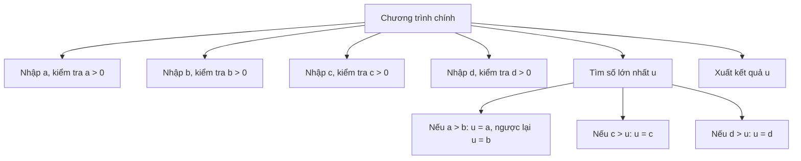
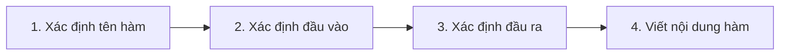

# L4. Hàm (Function) trong C++

## 1. Đặt Vấn Đề

**Bài toán:** Nhập 4 số nguyên dương a, b, c, d. Tìm số lớn nhất trong 4 số này.



**Vấn đề:**
- Đoạn lệnh nhập và kiểm tra lặp lại 4 lần
- Đoạn lệnh so sánh tương tự nhau lặp lại 3 lần
- Cần giải pháp: **Viết 1 lần, sử dụng nhiều lần**

**Giải pháp:** Sử dụng **HÀM**

## 2. Khái Niệm Hàm

**Định nghĩa:**

Hàm là một đoạn chương trình có tên, có đầu vào và đầu ra, có chức năng giải quyết một vấn đề chuyên biệt cho chương trình chính.

**Đặc điểm:**
- Có thể được gọi nhiều lần với các đối số khác nhau
- Tái sử dụng code
- Dễ sửa lỗi và cải tiến

**Thuật ngữ:**
- **Subroutine** (chương trình con) - thuật ngữ đề xuất sớm nhất (1951, 1952)
- **Subprogram, procedure, method, routine** - các thuật ngữ khác
- **Function** - thuật ngữ trong C/C++

## 3. Cú Pháp Khai Báo Hàm

```cpp
kiểu_trả_về tên_hàm([danh_sách_tham_số]) {
    <các câu lệnh>
    return <giá_trị_trả_về>;
}
```

**Các thành phần:**

| Thành phần | Mô tả |
|------------|-------|
| **kiểu_trả_về** | Kiểu dữ liệu của giá trị trả về (int, float, void...) |
| **tên_hàm** | Tên hàm (theo quy tắc đặt tên biến) |
| **danh_sách_tham_số** | Các tham số đầu vào (có thể không có) |
| **giá_trị_trả_về** | Kết quả trả về (nếu không phải void) |

## 4. Các Bước Viết Hàm



**1. Tên hàm:** Thể hiện chức năng của hàm

**2. Đầu vào (Input):**
- Số lượng tham số
- Kiểu dữ liệu của từng tham số
- Có thể không có đầu vào

**3. Đầu ra (Output):**
- Kiểu dữ liệu đầu ra
- Có thể không có đầu ra (void)

**4. Nội dung hàm:** Các lệnh cần thiết để hàm thực hiện công việc

## 5. Các Loại Hàm

### 5.1. Hàm Có Đầu Ra, Không Có Đầu Vào

```cpp
int nhap_so_duong() {
    int n;
    do {
        cout << "Nhap mot so nguyen duong: ";
        cin >> n;
    } while (n <= 0);
    return n;
}
```

### 5.2. Hàm Có Đầu Vào, Không Có Đầu Ra

```cpp
void xuat_so_lon(int a, int b) {
    int m;
    if (a > b) 
        m = a;
    else 
        m = b;
    cout << "So lon nhat giua " << a << " va " << b << " la " << m;
}
```

### 5.3. Hàm Không Có Đầu Vào và Đầu Ra

```cpp
void nhap_xuat_so_lon() {
    int m, n;
    cout << "Nhap so nguyen duong: "; 
    cin >> m;
    cout << "Nhap so nguyen duong: "; 
    cin >> n;
    cout << "So lon hon trong " << m << " va " << n << " la ";
    if (n > m) 
        m = n;
    cout << m;
}
```

### 5.4. Hàm Có Cả Đầu Vào và Đầu Ra

```cpp
int so_lon(int m, int n) {
    if (n > m) 
        m = n;
    return m;
}
```

## 6. Trả Về Giá Trị

### 6.1. Lệnh return

**Với hàm có giá trị trả về:**

```cpp
int so_lon(int m, int n) {
    if (n > m) 
        return n;  // Trả về ngay, kết thúc hàm
    return m;
}
```

**Với hàm void:**

```cpp
void xuat_so_lon(int a, int b) {
    cout << "So lon nhat giua " << a << " va " << b << " la ";
    if (a > b) {
        cout << a;
        return;  // Kết thúc hàm sớm (không bắt buộc)
    }
    cout << b;
}
```

!!! note "Đặc điểm của return"
    - Lệnh `return` kết thúc ngay việc thực thi hàm
    - Hàm chỉ trả về được **duy nhất 1 giá trị**
    - Với hàm void, `return` không kèm giá trị

## 7. Lời Gọi Hàm

**Cú pháp:**
```cpp
tên_hàm([danh_sách_đối_số]);
```

**Ví dụ:**

```cpp
int nhap_so_duong() {
    int n;
    do {
        cout << "Nhap mot so nguyen duong: ";
        cin >> n;
    } while (n <= 0);
    return n;
}

int main() {
    int a = nhap_so_duong();
    cout << "So vua nhap la " << a << endl;
    
    cout << "Tong hai so la " << a + nhap_so_duong() << endl;
    
    return 0;
}
```

**Output:**
```
Nhap mot so nguyen duong: 5
So vua nhap la 5
Nhap mot so nguyen duong: 8
Tong hai so la 13
```

## 8. Tham Số và Đối Số

**Parameter (Tham số/Tham số hình thức):**
- Các thông số mà hàm nhận vào
- Xác định khi **khai báo hàm**

**Argument (Đối số/Tham số thực sự):**
- Các thông số được đưa vào hàm khi **gọi hàm**
- Phải tương ứng với tham số đã khai báo

```cpp
int so_lon(int m, int n) {  // m, n là tham số
    if (n > m) 
        m = n;
    return m;
}

int main() {
    int a = 8, b = 36;
    int c = so_lon(a, b);   // a, b là đối số
    return 0;
}
```

## 9. Truyền Đối Số

### 9.1. Truyền Giá Trị (Pass by Value)

**Đặc điểm:**
- Là cách mặc định của C/C++
- Tham số chứa **bản sao** giá trị của đối số
- Thay đổi tham số **không ảnh hưởng** đến đối số

```cpp
int so_lon(int m, int n) {
    if (n > m) 
        m = n;  // Chỉ thay đổi bản sao
    return m;
}

int main() {
    int m = 8, n = 36;
    int o = so_lon(m, n);
    cout << "UCLN cua " << m << " va " << n << " la " << o;
    // m vẫn = 8, n vẫn = 36
}
```

**Sơ đồ bộ nhớ:**

```
int main()          int so_lon(m, n)
┌────────┐         ┌────────┐
│ m: 8   │ ───────>│ m: 8   │ (bản sao)
│ n: 36  │ ───────>│ n: 36  │ (bản sao)
└────────┘         └────────┘
```

**Có thể truyền:**
- Hằng số: `so_lon(9*4, 36)`
- Biến: `so_lon(m, n)`
- Biểu thức: `so_lon(a+b, c*2)`
- Lời gọi hàm: `so_lon(nhap_so_duong(), nhap_so_duong())`

### 9.2. Truyền Tham Chiếu (Pass by Reference)

**Đặc điểm:**
- Tham số có dấu `&` sau kiểu dữ liệu
- Chỉ có thể truyền **biến** (hoặc hằng nếu tham số là const)
- Tham số **không được cấp phát vùng nhớ**
- Tham số trỏ đến **cùng địa chỉ** với đối số
- Thay đổi tham số sẽ **thay đổi đối số**

```cpp
void hoan_vi(int& a, int& b) {
    int c = a;
    a = b;
    b = c;
}

int main() {
    int a, b;
    cin >> a >> b;
    hoan_vi(a, b);
    cout << a << " " << b;
    return 0;
}
```

**Input:** `5 3`  
**Output:** `3 5`

**Sơ đồ bộ nhớ:**

```
int main()          void hoan_vi(a, b)
┌────────┐         
│ m: 8   │ <───────── a (cùng địa chỉ)
│ n: 36  │ <───────── b (cùng địa chỉ)
└────────┘         
```

**Ứng dụng:** Trả về nhiều giá trị

```cpp
bool phep_chia(int x, int y, double& thuong) {
    if (y != 0) {
        thuong = double(x)/y;
        return true;
    } else {
        return false;
    }
}

int main() {
    double thuong;
    if (phep_chia(5, 3, thuong)) {
        cout << "Thuong so la " << thuong;
    } else {
        cout << "Khong the chia duoc ";
    }
}
```

## 10. Phạm Vi (Scope)

**Biến cục bộ (Local variable):**
- Khai báo trong một khối `{ }`
- Chỉ tồn tại trong khối đó
- Bị xóa khi ra khỏi khối

**Biến toàn cục (Global variable):**
- Khai báo bên ngoài tất cả các khối
- Phạm vi toàn chương trình
- Chỉ bị xóa khi chương trình kết thúc

```cpp
int a;  // Biến toàn cục

int ham1() {
    int a1;  // Biến cục bộ của ham1
    // Các biến có tác dụng: a, a1
}

int ham2() {
    int a2;  // Biến cục bộ của ham2
    // Các biến có tác dụng: a, a2
    {
        int a21;  // Biến cục bộ trong khối con
        // Các biến có tác dụng: a, a2, a21
    }
    // Các biến có tác dụng: a, a2
    
    int a;  // Che biến toàn cục a
    // Biến a này thay thế biến a toàn cục
}

int main() {
    int a3;  // Biến cục bộ của main
    // Các biến có tác dụng: a, a3
}
```

!!! warning "Lưu ý"
    Khi sử dụng hàm nên hạn chế dùng biến toàn cục vì:
    
    - Tốn bộ nhớ (tồn tại suốt chương trình)
    - Dễ gây lỗi logic (bất kỳ hàm nào cũng có thể thay đổi)

## 11. Nguyên Mẫu Hàm (Prototype)

**Định nghĩa hàm (Function Definition):**
```cpp
int ham(int tham_so1, double tham_so2) {
    // Thân hàm
    Cau_lenh;
    return 0;
}
```

**Khai báo hàm (Function Declaration):**
```cpp
int ham(int tham_so1, double tham_so2);
```

**Nguyên mẫu hàm (Function Prototype):**
```cpp
int ham(int, double);  // Chỉ ghi kiểu, không cần tên tham số
```

**Ví dụ:**

```cpp
void le(int x);      // Nguyên mẫu
void chan(int);      // Nguyên mẫu

int main() {
    int i;
    do {
        cout << "Nhap 1 so (Nhap 0 de thoat): ";
        cin >> i;
        le(i);
    } while (i != 0);
    return 0;
}

void le(int x) {
    if ((x % 2) != 0) 
        cout << "So le.\n";
    else 
        chan(x);
}

void chan(int x) {
    if ((x % 2) == 0) 
        cout << "So chan.\n";
    else 
        le(x);
}
```

!!! note "Lợi ích của Prototype"
    - Hàm cần được **khai báo trước khi gọi**
    - Prototype cho phép **khai báo trước, định nghĩa sau**
    - Giúp các hàm có thể **gọi lẫn nhau**

## 12. Hàm Trả Về Tham Chiếu

```cpp
int n;

int& test() {
    return n;  // Trả về tham chiếu đến biến toàn cục
}

int main() {
    test() = 5;  // Gán giá trị 5 cho n
    cout << n;   // Output: 5
    return 0;
}
```

!!! danger "Lỗi nghiêm trọng"
    ```cpp
    int& test() {
        int n = 5;  // Biến cục bộ
        return n;   // SAI: Trả về tham chiếu đến biến cục bộ
    }
    // n bị hủy sau khi hàm kết thúc!
    ```

**Ứng dụng:**

```cpp
int& so_lon(int &a, int &b) {
    if (a > b) 
        return a;
    return b;
}

int& so_be(int &a, int &b) {
    if (a < b) 
        return a;
    return b;
}

int main() {
    int a, b;
    cin >> a >> b;
    
    // Tìm UCLN bằng thuật toán trừ dần
    while (a != b) 
        so_lon(a, b) -= so_be(a, b);
    
    cout << a;
}
```

## 13. Bài Tập Minh Họa

### Bài 1: Các hàm cơ bản

```cpp
// a) Đổi ký tự hoa sang thường
char doiHoaSangThuong(char c) {
    if (c >= 'A' && c <= 'Z')
        return c + 32;
    return c;
}

// b) Giải phương trình bậc nhất ax + b = 0
void giaiPTBacNhat(float a, float b) {
    if (a == 0) {
        if (b == 0)
            cout << "Phuong trinh vo so nghiem";
        else
            cout << "Phuong trinh vo nghiem";
    } else {
        cout << "Nghiem x = " << -b/a;
    }
}

// c) Giải phương trình bậc hai
void giaiPTBacHai(float a, float b, float c) {
    if (a == 0) {
        giaiPTBacNhat(b, c);
        return;
    }
    
    float delta = b*b - 4*a*c;
    
    if (delta < 0)
        cout << "Phuong trinh vo nghiem";
    else if (delta == 0)
        cout << "Nghiem kep x = " << -b/(2*a);
    else {
        cout << "x1 = " << (-b - sqrt(delta))/(2*a) << endl;
        cout << "x2 = " << (-b + sqrt(delta))/(2*a);
    }
}

// d) Trả về giá trị nhỏ nhất của 4 số
int min4(int a, int b, int c, int d) {
    int min = a;
    if (b < min) min = b;
    if (c < min) min = c;
    if (d < min) min = d;
    return min;
}

// e) Hoán vị hai số
void hoanVi(int &a, int &b) {
    int temp = a;
    a = b;
    b = temp;
}

// f) Sắp xếp 4 số tăng dần
void sapXep4So(int &a, int &b, int &c, int &d) {
    if (a > b) hoanVi(a, b);
    if (a > c) hoanVi(a, c);
    if (a > d) hoanVi(a, d);
    if (b > c) hoanVi(b, c);
    if (b > d) hoanVi(b, d);
    if (c > d) hoanVi(c, d);
}
```

### Bài 2: Thao tác với số nguyên

```cpp
// a) Đếm số lượng chữ số
int demChuSo(int n) {
    if (n == 0) return 1;
    int dem = 0;
    while (n != 0) {
        dem++;
        n /= 10;
    }
    return dem;
}

// b) Tính tổng các chữ số
int tongChuSo(int n) {
    int tong = 0;
    while (n != 0) {
        tong += n % 10;
        n /= 10;
    }
    return tong;
}

// c) Tính tổng các chữ số lẻ
int tongChuSoLe(int n) {
    int tong = 0;
    while (n != 0) {
        int chu_so = n % 10;
        if (chu_so % 2 != 0)
            tong += chu_so;
        n /= 10;
    }
    return tong;
}

// d) Tính tổng các chữ số chẵn
int tongChuSoChan(int n) {
    int tong = 0;
    while (n != 0) {
        int chu_so = n % 10;
        if (chu_so % 2 == 0)
            tong += chu_so;
        n /= 10;
    }
    return tong;
}

// e) Tìm số đảo
int soDao(int n) {
    int dao = 0;
    while (n != 0) {
        dao = dao * 10 + n % 10;
        n /= 10;
    }
    return dao;
}
```

---

!!! success "Tổng kết Chương Hàm"
    **Khái niệm cơ bản:**
    
    - Hàm là đoạn code có tên, có thể tái sử dụng
    - Gồm: kiểu trả về, tên hàm, tham số, thân hàm
    
    **Truyền tham số:**
    
    - **Pass by value**: Truyền bản sao, không thay đổi đối số
    - **Pass by reference**: Truyền địa chỉ, có thể thay đổi đối số
    
    **Phạm vi biến:**
    
    - Biến cục bộ: Trong hàm/khối
    - Biến toàn cục: Toàn chương trình
    
    **Nguyên mẫu hàm:**
    
    - Cho phép khai báo trước, định nghĩa sau
    - Hỗ trợ các hàm gọi lẫn nhau
    
    **Chương tiếp theo:** Mảng một chiều và hai chiều