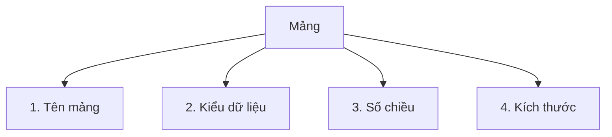

# L5. Mảng (Array) trong C++

## Phần 1: Mảng Một Chiều

### 1. Giới Thiệu Về Mảng

**Đặt vấn đề:**

```cpp
// Cần lưu trữ 3 số thực
float a, b, c;  // OK

// Cần lưu trữ 10 số thực
float a1, a2, a3, ..., a10;  // Khó quản lý

// Cần lưu trữ 100 hoặc 1000 số thực
// → Không thể khai báo 100 hoặc 1000 biến!
```

**Giải pháp:** Sử dụng **MẢNG**

```
┌────┬────┬────┬────┬────┬────┬────┬────┬────┬────┐
│1.3 │9.4 │2.7 │6.2 │4.9 │7.7 │3.5 │8.6 │0.1 │5.4 │
└────┴────┴────┴────┴────┴────┴────┴────┴────┴────┘
  0    1    2    3    4    5    6    7    8    9
```

### 2. Khái Niệm Mảng

**Định nghĩa:**

Mảng là một dãy các phần tử có cùng kiểu dữ liệu, mỗi phần tử biểu diễn một giá trị.

**Đặc điểm:**

- Kích thước mảng được xác định ngay khi khai báo và **không thay đổi**
- Là kiểu dữ liệu có cấu trúc do người lập trình định nghĩa
- C++ luôn chỉ định một **khối nhớ liên tục** cho mảng

**Ví dụ minh họa:**

```
Mảng 1 chiều:
┌───┬───┬───┬───┬───┬───┬───┬───┬───┐
│ 5 │ T │ 8 │ B │ 2 │ R │ 7 │ K │ 1 │
└───┴───┴───┴───┴───┴───┴───┴───┴───┘

Mảng 2 chiều (Ma trận):
┌───┬───┐      ┌───┬───┬───┐      ┌───┬───┐
│ 3 │ 7 │      │ 3 │ 7 │ 8 │      │ 6 │ 7 │
├───┼───┤      ├───┼───┼───┤      ├───┼───┤
│ 6 │ 1 │      │ 6 │ 1 │ 4 │      │ 1 │ 1 │
└───┴───┘      └───┴───┴───┘      ├───┼───┤
 2×2 (vuông)    2×3 (dòng<cột)    │ 6 │ 3 │
                                   └───┴───┘
                                   3×2 (dòng>cột)
```

### 3. Các Yếu Tố Xác Định Mảng

Một mảng được xác định bởi 4 yếu tố:



**Ví dụ 1:**
```cpp
char MangKyTu[4];
```
- Tên mảng: `MangKyTu`
- Kiểu mảng: `char`
- Số chiều: 1 chiều
- Kích thước: 4 phần tử

**Ví dụ 2:**
```cpp
int MangSoNguyen[3][2];
```
- Tên mảng: `MangSoNguyen`
- Kiểu mảng: `int`
- Số chiều: 2 chiều
- Kích thước: 3 dòng × 2 cột

### 4. Mảng Một Chiều

#### 4.1. Khai Báo Mảng 1 Chiều

**Cú pháp:**
```cpp
<Kiểu_dữ_liệu> <Tên_biến_mảng>[<Số_phần_tử>];
```

**Ví dụ:**

```cpp
char A[10];
// Kiểu dữ liệu: char
// Tên biến mảng: A
// Số phần tử: 10

int Mang1Chieu[30];
// Kiểu dữ liệu: int
// Tên biến mảng: Mang1Chieu
// Số phần tử: 30
```

!!! warning "Quy tắc khai báo"
    - Phải xác định cụ thể số phần tử ngay lúc khai báo
    - **KHÔNG** được sử dụng biến:
      ```cpp
      int n1 = 10; 
      int a[n1];  // SAI!
      ```
    - **KHÔNG** được sử dụng hằng const:
      ```cpp
      const int n2 = 20; 
      int b[n2];  // SAI!
      ```
    - **NÊN** sử dụng `#define`:
      ```cpp
      #define n1 10
      #define n2 20
      int a[n1];      // ĐÚNG
      int b[n1][n2];  // ĐÚNG
      ```

#### 4.2. Khởi Tạo Mảng 1 Chiều

**Cách 1: Khởi tạo đầy đủ**
```cpp
int A[4] = {29, 137, 50, 4};
```
```
┌────┬─────┬────┬───┐
│ 29 │ 137 │ 50 │ 4 │
└────┴─────┴────┴───┘
  0     1     2    3
```

**Cách 2: Khởi tạo một phần**
```cpp
int B[4] = {91, 106};
```
```
┌────┬─────┬───┬───┐
│ 91 │ 106 │ 0 │ 0 │  ← Phần còn lại = 0
└────┴─────┴───┴───┘
  0     1     2   3
```

**Cách 3: Khởi tạo tất cả = 0**
```cpp
int a[4] = {0};
```
```
┌───┬───┬───┬───┐
│ 0 │ 0 │ 0 │ 0 │
└───┴───┴───┴───┘
  0   1   2   3
```

**Cách 4: Tự động xác định kích thước**
```cpp
int a[] = {22, 16, 56, 19};
// Tự động tạo mảng 4 phần tử
```
```
┌────┬────┬────┬────┐
│ 22 │ 16 │ 56 │ 19 │
└────┴────┴────┴────┘
  0    1    2    3
```

#### 4.3. Chỉ Số Mảng

**Đặc điểm:**
- Chỉ số mảng là giá trị số nguyên `int`
- Chỉ số bắt đầu từ **0**
- Chỉ số tối đa = Số phần tử - 1

```cpp
int A[5];
```

**Các chỉ số hợp lệ:** 0, 1, 2, 3, 4

```
┌────┬────┬────┬────┬────┐
│ 99 │ 17 │ 50 │ 43 │ 72 │
└────┴────┴────┴────┴────┘
  0    1    2    3    4
  ↑                    ↑
Chỉ số đầu       Chỉ số cuối
```

**Số lượng chỉ số = Số phần tử = 5**

#### 4.4. Truy Xuất Phần Tử Mảng

**Cú pháp:**
```cpp
<Tên_biến_mảng>[<chỉ_số>]
```

**Ví dụ:**

```cpp
int A[4] = {29, 137, 50, 4};

// Truy xuất hợp lệ
A[0]  // = 29
A[1]  // = 137
A[2]  // = 50
A[3]  // = 4

// Truy xuất KHÔNG hợp lệ
A[-1] // SAI: chỉ số âm
A[4]  // SAI: vượt quá giới hạn
A[5]  // SAI: vượt quá giới hạn
```

```
┌────┬─────┬────┬───┐
│ 29 │ 137 │ 50 │ 4 │
└────┴─────┴────┴───┘
  0     1     2    3
  ↑
A[0] = 29
```

#### 4.5. Địa Chỉ Các Phần Tử Mảng

**Cú pháp:**
```cpp
&<Tên_biến_mảng>[<chỉ_số>];
```

**Ví dụ:**

```cpp
int A[4] = {29, 137, 50, 4};

// Địa chỉ các phần tử
&A[0]  // Địa chỉ phần tử thứ 0
&A[1]  // Địa chỉ phần tử thứ 1
&A[2]  // Địa chỉ phần tử thứ 2
&A[3]  // Địa chỉ phần tử thứ 3
```

```
         ┌────┬─────┬────┬───┐
Giá trị: │ 29 │ 137 │ 50 │ 4 │
         └────┴─────┴────┴───┘
Địa chỉ:  0x10  0x14  0x18 0x1C
Chỉ số:    0     1     2    3
```

#### 4.6. Truyền Mảng Cho Hàm

**Khai báo tham số:**

```cpp
void SapXep(int A[100], int n);
// Tên hàm: SapXep
// Tham số: mảng số nguyên A và số lượng phần tử n
// Giá trị trả về: void

int TinhTong(int A[100], int n);
// Tên hàm: TinhTong
// Tham số: mảng số nguyên A và số lượng phần tử n
// Giá trị trả về: int
```

!!! note "Đặc điểm quan trọng"
    - Mảng có thể thay đổi nội dung sau khi thực hiện hàm
    - Có thể bỏ số lượng phần tử hoặc sử dụng con trỏ:
      ```cpp
      void NhapMang(int A[], int n);
      void NhapMang(int *A, int n);
      ```

**Ví dụ đầy đủ:**

```cpp
#include <stdio.h>
#include <conio.h>

void Nhap(int A[], int &N);   // Nhập mảng
void Xuat(int A[], int N);    // Xuất mảng
int TinhTong(int A[], int N); // Tính tổng

void main() { 
    int a[100], n, S; 
    Nhap(a, n); 
    Xuat(a, n);  
    S = TinhTong(a, n); 
    cout << "Tong cac phan tu trong mang: " << S;
}
```

### 5. Các Tác Vụ Trên Mảng 1 Chiều

#### 5.1. Nhập Mảng

```cpp
void nhapmang(int A[], int N) {
    for (int i = 0; i < N; i++) {
        cout << "Nhap phan tu thu " << i << ": ";
        cin >> A[i];
    }
}
```

#### 5.2. Xuất Mảng

```cpp
void xuatmang(int A[], int N) {
    for (int i = 0; i < N; i++) {
        cout << A[i] << " ";
    }
}
```

#### 5.3. Tìm Kiếm Phần Tử

```cpp
int TimKiem(int a[], int n, int x) {
    for (int vt = 0; vt < n; vt++) {
        if (a[vt] == x)
            return vt;  // Trả về vị trí tìm thấy
    }
    return -1;  // Không tìm thấy
}
```

#### 5.4. Tìm Giá Trị Lớn Nhất

```cpp
int Max(int a[], int n) { 
    int Max = a[0];  // Giả sử phần tử đầu là lớn nhất
    for (int i = 1; i < n; i++) {
        if (Max < a[i])  // Áp dụng kỹ thuật lính canh
            Max = a[i]; 
    }
    return Max; 
}
```

#### 5.5. Kiểm Tra Tính Chất Mảng

**Yêu cầu:** Kiểm tra mảng có toàn số nguyên tố không?

**Ý tưởng 1:** Đếm số lượng số nguyên tố, nếu = n thì toàn nguyên tố

```cpp
// Hàm kiểm tra số nguyên tố
int LaSNT(int n) { 
    if (n < 2) return 0;
    for (int i = 2; i < n; i++) {
        if (n % i == 0) 
            return 0;  // Không phải SNT
    }
    return 1;  // Là SNT
}

// Ý tưởng 1
int KiemTra_YT1(int a[], int n) { 
    int dem = 0; 
    for (int i = 0; i < n; i++) {
        if (LaSNT(a[i]) == 1)
            dem++; 
    }
    if (dem == n) 
        return 1;  // Toàn SNT
    return 0; 
}
```

**Ý tưởng 2:** Đếm số không phải nguyên tố, nếu = 0 thì toàn nguyên tố

```cpp
int KiemTra_YT2(int a[], int n) { 
    int dem = 0; 
    for (int i = 0; i < n; i++) {
        if (LaSNT(a[i]) == 0)  
            dem++; 
    }
    if (dem == 0) 
        return 1;  // Toàn SNT
    return 0; 
}
```

**Ý tưởng 3:** Tìm phần tử không phải nguyên tố (Tối ưu nhất)

```cpp
int KiemTra_YT3(int a[], int n) { 
    for (int i = 0; i < n; i++) {
        if (LaSNT(a[i]) == 0) 
            return 0;  // Tìm thấy số không phải SNT
    }
    return 1;  // Không tìm thấy số nào không phải SNT
}
```

#### 5.6. Đếm Số Lượng Phần Tử Chẵn

```cpp
int DemChan(int A[], int N) {  
    int DC = 0;
    for (int i = 0; i < n; i++) {
        if (A[i] % 2 == 0)
            DC++;
    }
    return DC;
}
```

**Sử dụng:**

```cpp
int main() { 
    int a[100], n, DC; 
    nhap(a, n); 
    xuat(a, n); 
    DC = DemChan(a, n);  
    printf("So ptu chan la %d", DC); 
}
```

#### 5.7. Tính Tổng Các Phần Tử Chẵn

```cpp
int TongChan(int A[], int N) { 
    int TC = 0;
    for (int i = 0; i < n; i++) {
        if (A[i] % 2 == 0)
            TC = TC + A[i];
    }
    return TC;
}
```

**Sử dụng:**

```cpp
int main() { 
    int a[100], n, TC; 
    nhap(a, n); 
    xuat(a, n); 
    TC = TongChan(a, n);  
    printf("Tong ptu chan la %d", TC); 
}
```

### 6. Bài Tập Bắt Buộc - Mảng 1 Chiều

!!! question "Bài 1: Nhập dãy tăng dần"
    Viết chương trình nhập vào một dãy tăng dần (không cần sắp xếp). Nếu nhập sai yêu cầu nhập lại. Sau đó xuất các số nguyên tố có trong mảng.
    
    **Gợi ý:** Trong vòng lặp nhập, kiểm tra `A[i] > A[i-1]`

!!! question "Bài 2: Kiểm tra đối xứng"
    Kiểm tra mảng có đối xứng hay không?
    
    **Gợi ý:** So sánh `A[i]` với `A[n-1-i]`

!!! question "Bài 3: Giá trị xuất hiện đúng 1 lần"
    Liệt kê các giá trị xuất hiện trong mảng đúng 1 lần.
    
    **Gợi ý:** Với mỗi phần tử, đếm số lần xuất hiện

!!! question "Bài 4: Phần tử âm lớn nhất"
    Tìm vị trí của phần tử có giá trị âm lớn nhất trong mảng số nguyên.
    
    **Gợi ý:** Tìm max trong các số âm

!!! question "Bài 5: Xóa phần tử"
    Viết hàm xóa phần tử có chỉ số k trong mảng số nguyên a có n phần tử. 
    
    - Nếu k < 0 hoặc k >= n: không xóa, trả về 0
    - Ngược lại: xóa a[k], trả về 1
    
    **Gợi ý:** Dịch các phần tử từ vị trí k+1 về trái

---

!!! success "Tổng kết Mảng 1 Chiều"
    **Khái niệm:**
    
    - Mảng là dãy phần tử cùng kiểu, lưu liên tục
    - Chỉ số từ 0 đến n-1
    
    **Khai báo và khởi tạo:**
    
    - `int a[100];` - Khai báo
    - `int a[] = {1,2,3};` - Khởi tạo tự động
    - `int a[5] = {0};` - Khởi tạo tất cả = 0
    
    **Truy xuất:**
    
    - `a[i]` - Truy xuất giá trị
    - `&a[i]` - Lấy địa chỉ
    
    **Truyền cho hàm:**
    
    - `void ham(int a[], int n)` - Mảng có thể thay đổi
    - Luôn truyền kèm kích thước
    
    **Các thao tác cơ bản:**
    
    - Nhập/xuất, tìm kiếm, tìm min/max
    - Đếm, tính tổng, kiểm tra tính chất
    
    **Chương tiếp theo:** Mảng hai chiều và chuỗi ký tự