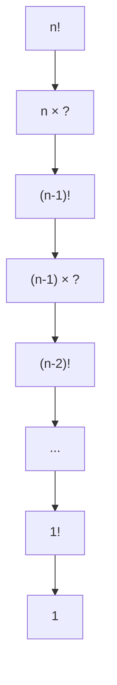
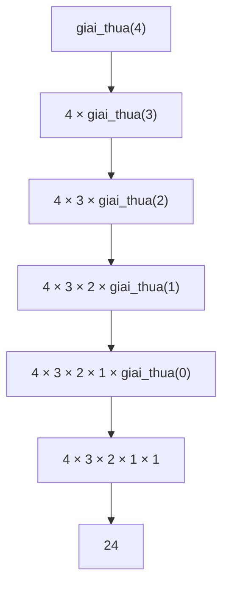
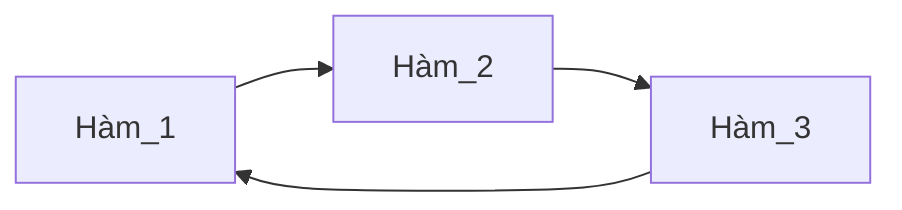

# L7. Đệ Quy (Recursion)

## 1. Khái Niệm Đệ Quy

### 1.1. Định Nghĩa

**Đệ quy (Recursion):**

Một vấn đề mang tính đệ quy nếu như nó có thể được giải quyết thông qua kết quả của chính vấn đề đó nhưng với đầu vào đơn giản hơn.

**Ví dụ: Giai thừa**

```
n! = n × (n-1)!
```



**Công thức đệ quy:**

$$
n! = \begin{cases}
1 & \text{nếu } n = 0 \\
n \times (n-1)! & \text{nếu } n > 0
\end{cases}
$$

### 1.2. Các Thuật Ngữ

| Thuật ngữ | Ý nghĩa |
|-----------|---------|
| **Recursion** | Đệ quy |
| **Recursive** | Tính đệ quy |
| **Recursive problem** | Vấn đề đệ quy |
| **Recursive function** | Hàm đệ quy |
| **Base case** | Trường hợp cơ bản |
| **Recursive case** | Trường hợp đệ quy |

### 1.3. Ví Dụ: Tổng S(n)

**Bài toán:** Tính tổng các số tự nhiên từ 1 đến n

```
S(n) = 1 + 2 + 3 + ... + n
```

**Phân tích đệ quy:**

```
S(n) = 1 + 2 + ... + (n-1) + n
     = S(n-1) + n
```

**Công thức:**

$$
S(n) = \begin{cases}
0 & \text{nếu } n = 0 \\
S(n-1) + n & \text{nếu } n > 0
\end{cases}
$$

## 2. Trường Hợp Cơ Bản (Base Case)

**Định nghĩa:**

Trường hợp cơ bản là một input đủ nhỏ để ta có thể giải quyết vấn đề mà không cần lời gọi đệ quy.

**Đặc điểm:**
- Là điều kiện dừng của đệ quy
- **Bắt buộc phải có**, nếu không sẽ dẫn đến vòng lặp vô hạn
- Thường là trường hợp đơn giản nhất

**Ví dụ:**

```cpp
// Giai thừa
n! = 1  (khi n = 0)  ← Base case

// Tổng S(n)
S(n) = 0  (khi n = 0)  ← Base case

// Fibonacci
F(0) = 0  ← Base case
F(1) = 1  ← Base case
```

## 3. Đệ Quy Trong C++

### 3.1. Cấu Trúc Hàm Đệ Quy

**Hàm đệ quy:**

Hàm có lời gọi lại chính nó trong thân hàm.

**Cấu trúc:**

```cpp
kiểu_trả_về tên_hàm(tham_số) {
    if (điều_kiện_dừng) {
        return giá_trị_cơ_bản;  // Base case
    }
    else {
        return tính_toán_với(tên_hàm(tham_số_nhỏ_hơn));  // Recursive case
    }
}
```

### 3.2. Ví Dụ: Giai Thừa

```cpp
int giai_thua(int n) {
    if (n == 0) 
        return 1;  // Base case
    else {
        int kq = n * giai_thua(n - 1);  // Recursive case
        return kq;
    }
}
```

**Cách viết ngắn gọn:**

```cpp
int giai_thua(int n) {
    if (n == 0) return 1;
    return n * giai_thua(n - 1);
}
```

**Truy vết thực thi:** `giai_thua(4)`

```
giai_thua(4)
  = 4 × giai_thua(3)
  = 4 × (3 × giai_thua(2))
  = 4 × (3 × (2 × giai_thua(1)))
  = 4 × (3 × (2 × (1 × giai_thua(0))))
  = 4 × (3 × (2 × (1 × 1)))
  = 4 × (3 × (2 × 1))
  = 4 × (3 × 2)
  = 4 × 6
  = 24
```



## 4. Phân Loại Đệ Quy

### 4.1. Đệ Quy Tuyến Tính (Single Recursion)

**Định nghĩa:**

Hàm đệ quy chỉ có **duy nhất một lần** gọi lại chính nó.

**Ví dụ 1: Giai thừa**

```cpp
int giai_thua(int n) {
    if (n == 0) return 1;
    return n * giai_thua(n - 1);  // Chỉ 1 lần gọi đệ quy
}
```

**Ví dụ 2: ƯCLN (Thuật toán Euclid)**

```cpp
int uscln(int a, int b) {
    if (a == b) return a;
    else if (a > b) 
        return uscln(a - b, b);  // Chỉ 1 nhánh chạy
    else 
        return uscln(a, b - a);  // Chỉ 1 nhánh chạy
}
```

!!! note "Đặc điểm"
    - Ngay cả khi có nhiều lần xuất hiện lời gọi đệ quy, chỉ **1 lần được thực thi**
    - Dễ chuyển sang vòng lặp

### 4.2. Chuyển Đệ Quy Tuyến Tính Sang Vòng Lặp

**Đệ quy:**

```cpp
int giai_thua(int n) {
    if (n == 0) return 1;
    return n * giai_thua(n - 1);
}
```

**Vòng lặp:**

```cpp
int giai_thua(int n) {
    int kq = 1;
    for (int i = 1; i <= n; i++) {
        kq = kq * i;
    }
    return kq;
}
```

**So sánh hiệu năng:**

```cpp
int tong(int n) {
    if (n > 0) return n + tong(n - 1);
    return 0;
}

int tong_2(int n) {
    int kq = 0;
    for (int i = 1; i <= n; i++) {
        kq = kq + i;
    }
    return kq;
}

int main() {
    for (int i = 0; i < 1000; i++) {
        cout << tong(100000) << endl;      // ~0.5s
        cout << tong_2(100000) << endl;    // ~0.25s
    }
}
```

!!! tip "Ưu điểm vòng lặp"
    - Chạy nhanh hơn
    - Dùng ít bộ nhớ hơn
    - Chạy được input lớn hơn

### 4.3. Đệ Quy Phi Tuyến (Multiple Recursion)

**Định nghĩa:**

Hàm gọi lại chính nó **nhiều lần**.

**Ví dụ: Fibonacci**

```
F(0) = 0
F(1) = 1
F(n) = F(n-1) + F(n-2)  với n ≥ 2
```

```
Dãy Fibonacci: 0, 1, 1, 2, 3, 5, 8, 13, 21...
```

**Code:**

```cpp
int fibonacci(int n) {
    if (n < 2) return n;
    return fibonacci(n - 1) + fibonacci(n - 2);  // 2 lần gọi đệ quy
}
```

**Cây đệ quy:** `fibonacci(5)`

```
                    F(5)
                   /    \
              F(4)        F(3)
             /    \      /    \
        F(3)    F(2)  F(2)   F(1)
       /   \    /  \   /  \
    F(2) F(1) F(1) F(0) F(1) F(0)
    /  \
  F(1) F(0)
```

!!! warning "Vấn đề hiệu năng"
    - Tính toán lặp lại nhiều lần
    - Độ phức tạp: O(2^n)
    - `F(5)` gọi `F(3)` 2 lần, `F(2)` 3 lần, `F(1)` 5 lần!

**Đặc điểm đệ quy nhị phân:**
- Trường hợp đặc biệt của đệ quy phi tuyến
- Gọi chính nó đúng 2 lần
- Khó chuyển sang vòng lặp

### 4.4. Đệ Quy Hỗ Tương (Mutual Recursion)

**Định nghĩa:**

Hàm không trực tiếp gọi lại chính nó mà gọi thông qua một (hoặc nhiều) hàm khác.

**Còn gọi:** Đệ quy gián tiếp (Indirect Recursion)



**Ví dụ:**

```cpp
void Ham_1() {
    //...
    Ham_2();
    //...
}

void Ham_2() {
    //...
    Ham_3();
    //...
}

void Ham_3() {
    //...
    Ham_1();
    //...
}
```

## 5. Call Stack (Ngăn Xếp Gọi Hàm)

### 5.1. Cấu Trúc Call Stack

**Call Stack:**

Vùng nhớ dùng để lưu trữ thông tin về các hàm đang được thực thi.

```cpp
int main() {
    //...
    A();
    //...
    D();
    //...
}

void A() {
    //...
    B();
    //...
    C();
    //...
}

void B() {
    //...
    D();
    //...
}

void C() {
    //...
}

void D() {
    //...
}
```

**Sơ đồ Call Stack:**

```
Thời gian →

main     A      B      D      B      C      A      D      main
────    ───    ───    ───    ───    ───    ───    ───    ────
 M       M      M      M      M      M      M      M       M
         A      A      A      A      A      A
                B      B      B
                       D
                              C
                                            D
```

**Đặc điểm:**
- Mỗi lời gọi hàm tạo một phần tử mới trong stack
- C++ luôn chạy phần tử ở **đỉnh stack** trước
- Khi hàm kết thúc, phần tử bị **pop** ra khỏi stack

### 5.2. Call Stack Với Đệ Quy

**Ví dụ:** `fibonacci(4)`

```cpp
int fibonacci(int n) {
    if (n < 2) return n;
    return fibonacci(n - 1) + fibonacci(n - 2);
}

int main() {
    cout << fibonacci(4);
}
```

**Trạng thái Stack theo thời gian:**

```
main    f(4)    f(3)    f(2)    f(1)    f(2)    f(1)    f(0)    ...
────    ────    ────    ────    ────    ────    ────    ────    ───
main    main    main    main    main    main    main    main
        f(4)    f(4)    f(4)    f(4)    f(4)    f(4)    f(4)
                f(3)    f(3)    f(3)    f(3)    f(3)    f(3)
                        f(2)    f(2)    f(2)    f(2)    f(2)
                                f(1)            f(1)    f(1)
                                                        f(0)
```

!!! danger "Stack Overflow"
    Khi chiều cao của stack quá lớn, chương trình có thể gặp lỗi **Stack Overflow** (tràn ngăn xếp).
    
    **Nguyên nhân:**
    - Đệ quy quá sâu
    - Không có điều kiện dừng
    - Điều kiện dừng sai

## 6. Bài Tập Minh Họa

### 6.1. Các Bài Tập Vòng Lặp Chuyển Sang Đệ Quy

**Yêu cầu:** Làm lại các bài tập chỉ có 01 vòng lặp mà **không dùng** các từ khóa: `for`, `while`, `do`, `goto`

#### Bài 1: Tổng các chữ số

```cpp
// Vòng lặp
int tongChuSo(int n) {
    int tong = 0;
    while (n > 0) {
        tong += n % 10;
        n /= 10;
    }
    return tong;
}

// Đệ quy
int tongChuSo(int n) {
    if (n == 0) return 0;
    return (n % 10) + tongChuSo(n / 10);
}
```

#### Bài 2: Đếm số lượng chữ số

```cpp
// Vòng lặp
int demChuSo(int n) {
    if (n == 0) return 1;
    int dem = 0;
    while (n > 0) {
        dem++;
        n /= 10;
    }
    return dem;
}

// Đệ quy
int demChuSo(int n) {
    if (n == 0) return 0;
    return 1 + demChuSo(n / 10);
}
```

#### Bài 3: Lũy thừa x^y

```cpp
// Vòng lặp
int luythua(int x, int y) {
    int kq = 1;
    for (int i = 0; i < y; i++) {
        kq *= x;
    }
    return kq;
}

// Đệ quy
int luythua(int x, int y) {
    if (y == 0) return 1;
    return x * luythua(x, y - 1);
}
```

**Tối ưu hóa (Lũy thừa nhanh):**

```cpp
int luythua_nhanh(int x, int y) {
    if (y == 0) return 1;
    if (y % 2 == 0) {
        int temp = luythua_nhanh(x, y / 2);
        return temp * temp;
    }
    return x * luythua_nhanh(x, y - 1);
}
```

#### Bài 4: Giai thừa n!

```cpp
// Vòng lặp
int giaithua(int n) {
    int kq = 1;
    for (int i = 1; i <= n; i++) {
        kq *= i;
    }
    return kq;
}

// Đệ quy
int giaithua(int n) {
    if (n == 0) return 1;
    return n * giaithua(n - 1);
}
```

### 6.2. Fibonacci

```cpp
int fibonacci(int n) {
    if (n <= 1) return n;
    return fibonacci(n - 1) + fibonacci(n - 2);
}
```

**Fibonacci với mảng lưu kết quả (Dynamic Programming):**

```cpp
int F[100];

int fibonacci(int n) {
    if (n <= 1) return n;
    if (F[n] != 0) return F[n];  // Đã tính rồi
    F[n] = fibonacci(n - 1) + fibonacci(n - 2);
    return F[n];
}
```

### 6.3. Dãy Padovan

**Công thức:**

```
P(0) = 0
P(1) = 1
P(2) = 1
P(n) = P(n-2) + P(n-3)  với n ≥ 3
```

**Dãy:** `0, 1, 1, 1, 2, 2, 3, 4, 5, 7, 9, 12, 16, 21, 28...`

```cpp
int padovan(int n) {
    if (n <= 2) return (n > 0) ? 1 : 0;
    return padovan(n - 2) + padovan(n - 3);
}
```

### 6.4. Tháp Hà Nội (Tower of Hanoi)

**Bài toán:**

Chuyển n đĩa từ cọc A sang cọc C, sử dụng cọc B làm trung gian, với quy tắc:
- Mỗi lần chỉ chuyển 1 đĩa
- Đĩa lớn không được đè lên đĩa nhỏ

```
    |         |         |
   ===        |         |
  =====       |         |
 =======      |         |
─────────  ─────────  ─────────
    A         B         C
```

**Giải pháp đệ quy:**

```cpp
void thapHaNoi(int n, char A, char C, char B) {
    if (n == 1) {
        cout << "Chuyen dia " << n << " tu " << A << " sang " << C << endl;
        return;
    }
    
    // Chuyển n-1 đĩa từ A sang B (dùng C làm trung gian)
    thapHaNoi(n - 1, A, B, C);
    
    // Chuyển đĩa lớn nhất từ A sang C
    cout << "Chuyen dia " << n << " tu " << A << " sang " << C << endl;
    
    // Chuyển n-1 đĩa từ B sang C (dùng A làm trung gian)
    thapHaNoi(n - 1, B, C, A);
}

int main() {
    int n = 3;
    thapHaNoi(n, 'A', 'C', 'B');
}
```

**Output với n=3:**
```
Chuyen dia 1 tu A sang C
Chuyen dia 2 tu A sang B
Chuyen dia 1 tu C sang B
Chuyen dia 3 tu A sang C
Chuyen dia 1 tu B sang A
Chuyen dia 2 tu B sang C
Chuyen dia 1 tu A sang C
```

## 7. So Sánh Đệ Quy và Vòng Lặp

| Tiêu chí | Đệ quy | Vòng lặp |
|----------|--------|----------|
| **Code** | Ngắn gọn, dễ hiểu | Dài hơn |
| **Tốc độ** | Chậm hơn | Nhanh hơn |
| **Bộ nhớ** | Tốn nhiều (Stack) | Ít hơn |
| **Input lớn** | Có thể Stack Overflow | An toàn hơn |
| **Phù hợp** | Bài toán có cấu trúc đệ quy | Bài toán tính toán đơn giản |

**Khi nào dùng đệ quy?**
- Bài toán có cấu trúc đệ quy tự nhiên (Cây, đồ thị, Fibonacci...)
- Code ngắn gọn, dễ hiểu quan trọng hơn hiệu năng
- Input không quá lớn

**Khi nào dùng vòng lặp?**
- Cần tối ưu hiệu năng
- Input rất lớn
- Đệ quy có thể dễ dàng chuyển sang vòng lặp

## 8. Bài Tập Bắt Buộc

!!! question "Bài 1: Tổng dãy số"
    Tính tổng: S = 1 + 2 + 3 + ... + n

!!! question "Bài 2: Tích dãy số"
    Tính tích: P = 1 × 2 × 3 × ... × n

!!! question "Bài 3: Số đảo"
    Tìm số đảo của n. Ví dụ: n = 1234 → kết quả = 4321

!!! question "Bài 4: Kiểm tra số nguyên tố"
    Viết hàm đệ quy kiểm tra n có phải số nguyên tố không.

!!! question "Bài 5: ƯCLN"
    Tìm ước chung lớn nhất của 2 số a, b bằng thuật toán Euclid.

!!! question "Bài 6: Tổ hợp C(n, k)"
    Tính tổ hợp chập k của n:
    
    $$C(n,k) = \begin{cases}
    1 & \text{nếu } k = 0 \text{ hoặc } k = n \\
    C(n-1, k-1) + C(n-1, k) & \text{nếu } 0 < k < n
    \end{cases}$$

!!! question "Bài 7: Số nhị phân"
    In ra biểu diễn nhị phân của số nguyên n.

!!! question "Bài 8: Tổng mảng"
    Tính tổng các phần tử của mảng bằng đệ quy.

---

!!! success "Tổng kết Đệ Quy"
    **Khái niệm:**
    
    - Hàm gọi lại chính nó
    - Phải có điều kiện dừng (Base case)
    
    **Phân loại:**
    
    - Đệ quy tuyến tính: 1 lần gọi
    - Đệ quy phi tuyến: Nhiều lần gọi
    - Đệ quy hỗ tương: Gọi qua hàm khác
    
    **Ưu điểm:**
    
    - Code ngắn gọn, dễ hiểu
    - Phù hợp bài toán có cấu trúc đệ quy
    
    **Nhược điểm:**
    
    - Chậm hơn vòng lặp
    - Tốn bộ nhớ
    - Có thể Stack Overflow
    
    **Chương tiếp theo:** Kiểu cấu trúc (Struct)