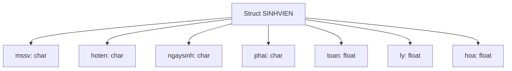

# L8. Kiểu Cấu Trúc (Struct)

## 1. Đặt Vấn Đề

### 1.1. Vấn Đề Quản Lý Thông Tin

**Bài toán:** Quản lý thông tin sinh viên

**Thông tin 1 sinh viên:**
- MSSV: kiểu chuỗi
- Tên SV: kiểu chuỗi
- Ngày sinh: kiểu chuỗi
- Giới tính: ký tự
- Điểm Toán, Lý, Hóa: số thực

**Yêu cầu:**
- Lưu thông tin cho N sinh viên?
- Truyền thông tin N sinh viên vào một hàm?

### 1.2. Cách Tiếp Cận Truyền Thống

**Khai báo biến cho 1 sinh viên:**

```cpp
char mssv[7];          // "0012078"
char hoten[30];        // "Nguyen Van A"
char ntns[8];          // "29/12/82"
char phai;             // 'N' ⟷ Nam, 'F' ⟷ Nữ
float toan, ly, hoa;   // 8.5, 9.0, 10.0
```

**Truyền cho hàm:**

```cpp
void xuat(char mssv[], char hoten[], char ntns[], 
          char phai, float toan, float ly, float hoa);
```

**Nhận xét:**
- ❌ Đặt tên biến khó khăn và khó quản lý
- ❌ Truyền tham số cho hàm quá nhiều
- ❌ Tìm kiếm, sắp xếp, sao chép khó khăn
- ❌ Tốn nhiều bộ nhớ

**Giải pháp:** 

Gom những thông tin của cùng 1 sinh viên thành một kiểu dữ liệu mới → **Kiểu Struct**

## 2. Khái Niệm Kiểu Cấu Trúc

### 2.1. Định Nghĩa

**Struct (Structure):**

Kiểu dữ liệu do người dùng định nghĩa, cho phép gom nhóm các biến có kiểu dữ liệu khác nhau thành một đơn vị.



### 2.2. Khai Báo Kiểu Cấu Trúc

**Cú pháp:**

```cpp
struct <tên_kiểu_cấu_trúc> {
    <kiểu_dữ_liệu> <tên_thành_phần_1>;
    <kiểu_dữ_liệu> <tên_thành_phần_2>;
    ...
    <kiểu_dữ_liệu> <tên_thành_phần_n>;
};
```

**Ví dụ 1: Điểm trong mặt phẳng**

```cpp
struct DIEM {
    int x;
    int y;
};
```

**Ví dụ 2: Phân số**

```cpp
struct PHANSO {
    int tu;
    int mau;
};
```

**Ví dụ 3: Sinh viên**

```cpp
struct SINHVIEN {
    char mssv[10];
    char hoten[30];
    char ngaysinh[11];
    char phai;
    float toan, ly, hoa;
};
```

## 3. Khai Báo Biến Cấu Trúc

### 3.1. Khai Báo Không Tường Minh

**Cú pháp:**

```cpp
struct <tên_kiểu_cấu_trúc> {
    <kiểu_dữ_liệu> <tên_thành_phần_1>;
    ...
    <kiểu_dữ_liệu> <tên_thành_phần_n>;
};

struct <tên_kiểu_cấu_trúc> <tên_biến>;
```

**Ví dụ:**

```cpp
struct DIEM {
    int x;
    int y;
};

// Khai báo biến
struct DIEM diem1, diem2;  // C++ có thể bỏ từ khóa struct
```

### 3.2. Sử Dụng typedef

**Cú pháp:**

```cpp
typedef struct {
    <kiểu_dữ_liệu> <tên_thành_phần_1>;
    ...
    <kiểu_dữ_liệu> <tên_thành_phần_n>;
} <tên_kiểu_cấu_trúc>;

<tên_kiểu_cấu_trúc> <tên_biến>;
```

**Ví dụ:**

```cpp
typedef struct {
    int x;
    int y;
} DIEM;

// Khai báo biến
DIEM diem1, diem2;  // Không cần từ khóa struct
```

!!! tip "Ưu điểm của typedef"
    - Không cần từ khóa `struct` khi khai báo biến
    - Code ngắn gọn, dễ đọc hơn
    - Phổ biến trong C++

### 3.3. Khai Báo Tường Minh

**Cú pháp:**

```cpp
struct <tên_kiểu_cấu_trúc> {
    <kiểu_dữ_liệu> <tên_thành_phần_1>;
    ...
    <kiểu_dữ_liệu> <tên_thành_phần_n>;
} <tên_biến>;
```

**Ví dụ:**

```cpp
struct DIEM {
    int x;
    int y;
} diem1, diem2;
```

### 3.4. Khởi Tạo Biến Cấu Trúc

**Cách 1: Khởi tạo khi khai báo**

```cpp
struct DIEM {
    int x;
    int y;
} diem1 = {2912, 1706}, diem2;
```

**Cách 2: Khởi tạo với typedef**

```cpp
typedef struct {
    int x;
    int y;
} DIEM;

DIEM diem1 = {10, 20};
DIEM diem2 = {30, 40};
```

**Cách 3: Khởi tạo từng thành phần**

```cpp
DIEM diem1;
diem1.x = 10;
diem1.y = 20;
```

## 4. Truy Xuất Dữ Liệu Kiểu Cấu Trúc

### 4.1. Toán Tử Chấm (Dot Operator)

**Đặc điểm:**
- Không thể truy xuất trực tiếp biến cấu trúc
- Phải thông qua **toán tử thành phần cấu trúc** (dot operator): `.`

**Cú pháp:**

```cpp
<tên_biến_cấu_trúc>.<tên_thành_phần>
```

**Ví dụ:**

```cpp
struct DIEM {
    int x;
    int y;
} diem1;

// Truy xuất
cout << diem1.x << " " << diem1.y;

// Gán giá trị
diem1.x = 100;
diem1.y = 200;

// Nhập từ bàn phím
cin >> diem1.x >> diem1.y;
```

### 4.2. Gán Dữ Liệu Kiểu Cấu Trúc

**Cách 1: Gán cả cấu trúc**

```cpp
<biến_cấu_trúc_đích> = <biến_cấu_trúc_nguồn>;
```

```cpp
struct DIEM {
    int x, y;
} diem1 = {2912, 1706}, diem2;

diem2 = diem1;  // Sao chép toàn bộ
// diem2.x = 2912, diem2.y = 1706
```

**Cách 2: Gán từng thành phần**

```cpp
<biến_cấu_trúc_đích>.<tên_thành_phần> = <giá_trị>;
```

```cpp
diem2.x = diem1.x;
diem2.y = diem1.y * 2;
```

## 5. Cấu Trúc Phức Tạp

### 5.1. Cấu Trúc Lồng Nhau

**Thành phần của cấu trúc là cấu trúc khác:**

```cpp
struct DIEM {
    int x;
    int y;
};

struct HINHCHUNHAT {
    DIEM traitren;   // Góc trái trên
    DIEM phaiduoi;   // Góc phải dưới
} hcn1;
```

**Truy xuất:**

```cpp
hcn1.traitren.x = 2912;
hcn1.traitren.y = 1706;
hcn1.phaiduoi.x = 3000;
hcn1.phaiduoi.y = 2000;
```

**Minh họa:**

```
Hình chữ nhật:
┌──────────────────┐ ← (traitren.x, traitren.y)
│                  │
│                  │
│                  │
└──────────────────┘ ← (phaiduoi.x, phaiduoi.y)
```

### 5.2. Cấu Trúc Đệ Quy (Tự Trỏ)

**Cấu trúc có con trỏ trỏ đến chính kiểu cấu trúc đó:**

```cpp
struct PERSON {
    char hoten[30];
    PERSON *father;   // Con trỏ đến cha
    PERSON *mother;   // Con trỏ đến mẹ
};
```

**Ứng dụng: Danh sách liên kết**

```cpp
struct NODE {
    int value;
    NODE *pNext;  // Con trỏ đến node tiếp theo
};
```

```
┌───┬────┐   ┌───┬────┐   ┌───┬────┐
│ 5 │ ●──┼──→│ 8 │ ●──┼──→│ 3 │NULL│
└───┴────┘   └───┴────┘   └───┴────┘
```

## 6. Các Lưu Ý Về Cấu Trúc

### 6.1. Kích Thước Cấu Trúc

**Kích thước cấu trúc ≠ Tổng kích thước các thành phần**

Do vấn đề **căn chỉnh bộ nhớ** (memory alignment).

**Ví dụ:**

```cpp
struct B1 {
    int a;      // 4 bytes
    double c;   // 8 bytes
    int b;      // 4 bytes
};

sizeof(B1) = 24  // Không phải 16!
```

**Cấu trúc bộ nhớ:**

```
┌────┬────┬────────────┬────┬────┐
│ a  │pad │     c      │ b  │pad │
└────┴────┴────────────┴────┴────┘
  4    4        8         4    4  = 24 bytes
```

**Tối ưu hóa:**

```cpp
struct B2 {
    int a;      // 4 bytes
    int b;      // 4 bytes
    double c;   // 8 bytes
};

sizeof(B2) = 16  // Tối ưu hơn!
```

```
┌────┬────┬────────────┐
│ a  │ b  │     c      │
└────┴────┴────────────┘
  4    4        8       = 16 bytes
```

!!! tip "Nguyên tắc tối ưu"
    - Sắp xếp các thành phần theo kích thước giảm dần
    - Hoặc nhóm các thành phần cùng kích thước

### 6.2. Các Lưu Ý Khác

**1. Kiểu và biến:**
- Kiểu cấu trúc: Khuôn mẫu (template)
- Biến cấu trúc: Thực thể (instance)

**2. Trong C++:**
- Có thể bỏ từ khóa `struct` khi khai báo biến

**3. Nhập số thực:**
- Phải nhập thông qua biến trung gian

```cpp
struct DIEM {
    float x, y;
} d1;

float temp;
cin >> temp;
d1.x = temp;
```

## 7. Mảng Cấu Trúc

### 7.1. Khai Báo Mảng Cấu Trúc

**Tương tự như mảng thông thường:**

```cpp
struct DIEM {
    int x;
    int y;
};

DIEM mang1[20];  // Mảng 20 điểm

DIEM mang2[10] = {
    {3, 2}, 
    {4, 4}, 
    {2, 7}
};  // Khởi tạo 3 điểm đầu
```

### 7.2. Truy Xuất Mảng Cấu Trúc

```cpp
DIEM arr[10];

// Truy xuất phần tử thứ i
arr[i].x = 10;
arr[i].y = 20;

// Nhập mảng
for (int i = 0; i < 10; i++) {
    cout << "Nhap diem thu " << i << ":\n";
    cout << "x = "; cin >> arr[i].x;
    cout << "y = "; cin >> arr[i].y;
}

// Xuất mảng
for (int i = 0; i < 10; i++) {
    cout << "(" << arr[i].x << ", " << arr[i].y << ")\n";
}
```

## 8. Truyền Cấu Trúc Cho Hàm

### 8.1. Truyền Tham Trị

**Không thay đổi sau khi kết thúc hàm:**

```cpp
void xuat1(int x, int y) { 
    cout << "(" << x << ", " << y << ")";
}

void xuat2(DIEM diem) {
    cout << "(" << diem.x << ", " << diem.y << ")";
}
```

### 8.2. Truyền Tham Chiếu

**Có thể thay đổi giá trị:**

```cpp
void xuat3(DIEM &diem) {
    cout << "(" << diem.x << ", " << diem.y << ")";
}

void nhap(DIEM &diem) {
    cout << "Nhap x: "; cin >> diem.x;
    cout << "Nhap y: "; cin >> diem.y;
}
```

### 8.3. Truyền Con Trỏ

```cpp
void xuat4(DIEM *diem) {
    cout << "(" << diem->x << ", " << diem->y << ")";
}

void nhap2(DIEM *diem) {
    cout << "Nhap x: "; cin >> diem->x;
    cout << "Nhap y: "; cin >> diem->y;
}
```

!!! note "Toán tử mũi tên"
    - `diem->x` tương đương `(*diem).x`
    - Dùng cho con trỏ cấu trúc

## 9. Bài Tập Minh Họa

### 9.1. Cấu Trúc Sinh Viên

```cpp
typedef struct {
    char ten[50];
    char mssv[10];
    char lop[5];
} SINHVIEN;
```

### 9.2. Nhập Danh Sách Sinh Viên

```cpp
void NhapSinhVien(SINHVIEN dssv[], int thutu) {
    fflush(stdin);
    
    printf("Nhap ten sinh vien: ");
    gets(dssv[thutu].ten);
    
    fflush(stdin);
    printf("Nhap ma so sinh vien: ");
    gets(dssv[thutu].mssv);
    
    fflush(stdin);
    printf("Nhap lop cua sinh vien: ");
    gets(dssv[thutu].lop);
}
```

### 9.3. Xuất Danh Sách Sinh Viên

```cpp
void XuatSinhVien(SINHVIEN dssv[], int thutu) {
    printf("Ten sinh vien: ");
    puts(dssv[thutu].ten);
    
    printf("Ma so sinh vien: ");
    puts(dssv[thutu].mssv);
    
    printf("Lop cua sinh vien: ");
    puts(dssv[thutu].lop);
}
```

### 9.4. Tìm Sinh Viên Theo Tên

```cpp
int TimSVTheoTen(SINHVIEN dssv[], int soluongsv, char ten[]) {
    int vitritimthay = -1;
    
    for (int i = 0; i < soluongsv; i++) {
        if (strcmp(dssv[i].ten, ten) == 0) {
            vitritimthay = i;
            break;
        }
    }
    
    return vitritimthay;
}
```

### 9.5. Chương Trình Hoàn Chỉnh

```cpp
#include <iostream>
#include <cstring>
using namespace std;

typedef struct {
    char ten[50];
    char mssv[10];
    char lop[5];
} SINHVIEN;

void NhapSinhVien(SINHVIEN &sv) {
    fflush(stdin);
    cout << "Nhap ten: "; gets(sv.ten);
    cout << "Nhap MSSV: "; gets(sv.mssv);
    cout << "Nhap lop: "; gets(sv.lop);
}

void XuatSinhVien(SINHVIEN sv) {
    cout << "Ten: " << sv.ten << endl;
    cout << "MSSV: " << sv.mssv << endl;
    cout << "Lop: " << sv.lop << endl;
}

int main() {
    SINHVIEN dssv[100];
    int n;
    
    cout << "Nhap so luong sinh vien: ";
    cin >> n;
    
    for (int i = 0; i < n; i++) {
        cout << "\nNhap thong tin sinh vien " << i + 1 << ":\n";
        NhapSinhVien(dssv[i]);
    }
    
    cout << "\n=== DANH SACH SINH VIEN ===\n";
    for (int i = 0; i < n; i++) {
        cout << "\nSinh vien " << i + 1 << ":\n";
        XuatSinhVien(dssv[i]);
    }
    
    return 0;
}
```

## 10. Bài Tập Bắt Buộc

!!! question "Bài 1: Đơn thức"
    Khai báo kiểu dữ liệu Đơn thức, thực hiện:
    
    - Nhập/xuất đơn thức
    - Tính tổng/hiệu/tích/thương hai đơn thức
    - Tính giá trị đơn thức tại x
    - Tính đạo hàm cấp 1

!!! question "Bài 2: Điểm trong mặt phẳng Oxy"
    Khai báo kiểu dữ liệu điểm, thực hiện:
    
    - Nhập/xuất tọa độ điểm/mảng điểm
    - Tính khoảng cách giữa hai điểm
    - Tìm điểm gần/xa gốc tọa độ nhất

!!! question "Bài 3: Tỉnh"
    Khai báo struct lưu thông tin tỉnh (mã, tên, dân số, diện tích):
    
    - Nhập/xuất thông tin 1 tỉnh và danh sách tỉnh
    - Xuất tỉnh có dân số > 1 triệu
    - Tìm tỉnh có diện tích lớn nhất

!!! question "Bài 4: Phân số"
    Khai báo kiểu dữ liệu phân số:
    
    - Nhập/xuất phân số
    - Rút gọn phân số
    - Tính tổng, hiệu, tích, thương
    - Kiểm tra phân số tối giản
    - Quy đồng hai phân số
    - Kiểm tra phân số âm/dương
    - So sánh hai phân số

!!! question "Bài 5: Số phức"
    Sử dụng struct để biểu diễn số phức:
    
    - Tính tổng, hiệu, tích, thương 2 số phức

!!! question "Bài 6: Giờ/Phút/Giây"
    Viết chương trình:
    
    - Biểu diễn và hiển thị giờ, phút, giây
    - Tính khoảng thời gian giữa 2 mốc thời gian

!!! question "Bài 7: Tam giác"
    Khai báo kiểu dữ liệu tam giác:
    
    - Nhập/xuất tam giác
    - Tính chu vi, diện tích

!!! question "Bài 8: Mảng phân số"
    Thao tác với mảng phân số:
    
    - Nhập/xuất N phân số
    - Rút gọn mọi phân số
    - Đếm số lượng phân số âm/dương
    - Tìm phân số dương đầu tiên
    - Tìm phân số nhỏ nhất/lớn nhất
    - Sắp xếp mảng tăng/giảm dần

!!! question "Bài 9: Quản lý sinh viên"
    Chương trình quản lý sinh viên (MSSV, họ tên, năm sinh, điểm TB):
    
    - Tìm điểm TB lớn nhất
    - Xuất sinh viên có điểm TB < 5.0
    - Tìm kiếm sinh viên theo mã
    - Chỉnh sửa thông tin sinh viên

---

!!! success "Tổng kết Kiểu Cấu Trúc"
    **Khái niệm:**
    
    - Kiểu dữ liệu do người dùng định nghĩa
    - Gom nhóm các biến khác kiểu
    
    **Khai báo:**
    
    - `struct TEN { ... };`
    - `typedef struct { ... } TEN;`
    
    **Truy xuất:**
    
    - Toán tử chấm: `bien.thanh_phan`
    - Toán tử mũi tên: `con_tro->thanh_phan`
    
    **Ứng dụng:**
    
    - Quản lý thông tin phức tạp
    - Cấu trúc dữ liệu (danh sách, cây, đồ thị)
    
    **Chương tiếp theo:** Con trỏ cơ bản