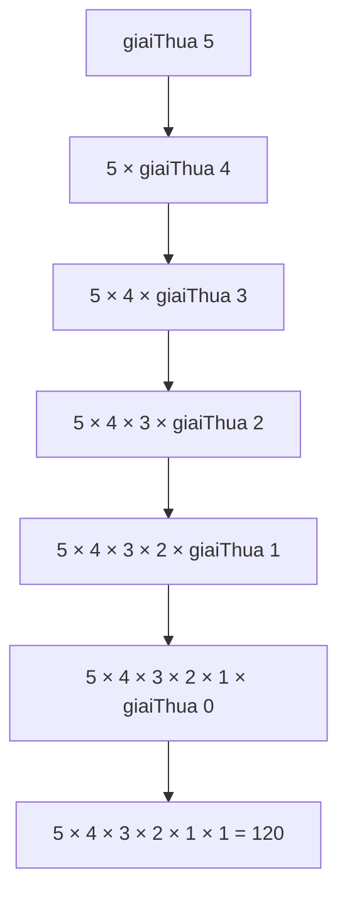
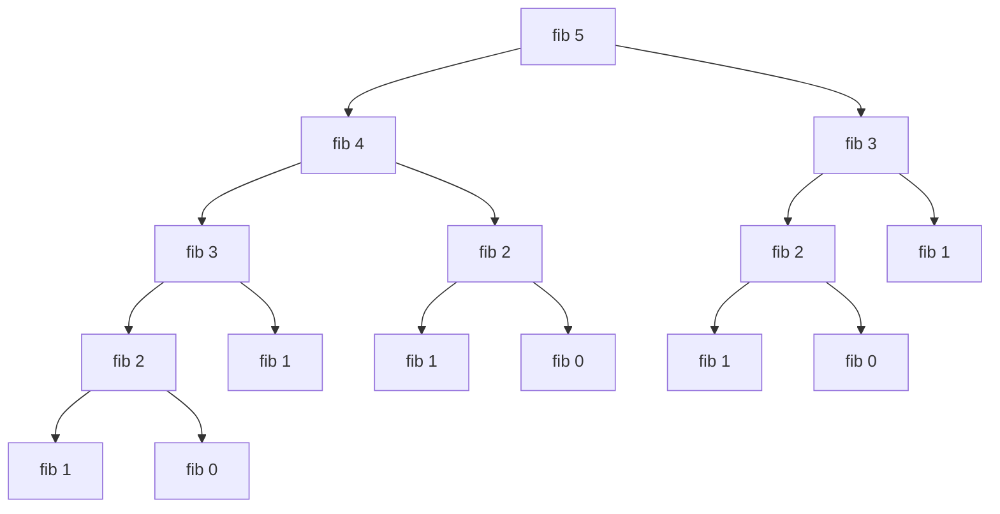

# O2. Other 2

## Đệ Quy (Recursion)

### Khái Niệm Đệ Quy

!!! note "Định nghĩa"
    **Đệ quy** là kỹ thuật lập trình trong đó một hàm gọi lại chính nó để giải quyết bài toán.

**Đặc điểm:**
- Hàm tự gọi chính nó với tham số đơn giản hơn
- Phải có điều kiện dừng (base case)
- Giải quyết bài toán bằng cách chia nhỏ thành các bài toán con tương tự

**Ví dụ cơ bản:**
```cpp
// Giai thừa: n! = n × (n-1) × (n-2) × ... × 1
int giaiThua(int n) {
    if (n == 0)           // Base case (điều kiện dừng)
        return 1;
    else                  // Recursive case
        return n * giaiThua(n - 1);
}
```

**Cách hoạt động:**


### Trường Hợp Cơ Bản (Base Case)

!!! important "Quy tắc vàng"
    Mọi hàm đệ quy **BẮT BUỘC** phải có ít nhất một trường hợp cơ bản để dừng đệ quy.

**Trường hợp cơ bản** là input đủ đơn giản để giải quyết trực tiếp mà không cần gọi đệ quy.

```cpp
// Ví dụ: Tổng các số từ 1 đến n
int tong(int n) {
    if (n <= 0)          // Base case
        return 0;
    else
        return n + tong(n - 1);
}
```

### Phân Loại Đệ Quy

#### 1. Đệ Quy Tuyến Tính (Single Recursion)

Hàm chỉ gọi lại chính nó **một lần**.

```cpp
// Ví dụ 1: Tính lũy thừa
int luythua(int x, int n) {
    if (n == 0) 
        return 1;
    return x * luythua(x, n - 1);
}

// Ví dụ 2: USCLN (Euclidean)
int uscln(int a, int b) {
    if (a == b) 
        return a;
    if (a > b) 
        return uscln(a - b, b);
    else 
        return uscln(a, b - a);
}

// Ví dụ 3: Đảo ngược số
void daoNguoc(int n) {
    if (n < 10) {
        cout << n;
        return;
    }
    cout << n % 10;
    daoNguoc(n / 10);
}
```

#### 2. Đệ Quy Phi Tuyến (Multiple Recursion)

Hàm gọi lại chính nó **nhiều lần**.

```cpp
// Ví dụ: Dãy Fibonacci
int fibonacci(int n) {
    if (n < 2) 
        return 1;
    return fibonacci(n - 1) + fibonacci(n - 2);  // Gọi 2 lần
}
```

**Sơ đồ tính Fibonacci(5):**


#### 3. Đệ Quy Hỗ Tương (Mutual Recursion)

Các hàm gọi lẫn nhau.

```cpp
// Ví dụ: Kiểm tra số chẵn/lẻ (cách đặc biệt)
bool laChan(int n);
bool laLe(int n);

bool laChan(int n) {
    if (n == 0) return true;
    return laLe(n - 1);
}

bool laLe(int n) {
    if (n == 0) return false;
    return laChan(n - 1);
}
```

### Đệ Quy vs Vòng Lặp

| Đệ Quy | Vòng Lặp |
|--------|----------|
| Dễ hiểu với bài toán có tính chất đệ quy | Code có thể phức tạp hơn |
| Code ngắn gọn, rõ ràng | Code dài hơn |
| Tốn bộ nhớ (call stack) | Tiết kiệm bộ nhớ |
| Chậm hơn (overhead gọi hàm) | Nhanh hơn |
| Có thể bị stack overflow | Không bị stack overflow |

**Chuyển đổi từ đệ quy sang vòng lặp:**

```cpp
// Đệ quy
int giaiThua(int n) {
    if (n == 0) return 1;
    return n * giaiThua(n - 1);
}

// Vòng lặp (tương đương)
int giaiThua_vonglap(int n) {
    int kq = 1;
    for (int i = 1; i <= n; i++) {
        kq *= i;
    }
    return kq;
}
```

### Call Stack và Đệ Quy

!!! warning "Stack Overflow"
    Mỗi lời gọi hàm chiếm một vùng nhớ trên stack. Đệ quy quá sâu có thể gây tràn stack.

**Minh họa stack khi gọi fibonacci(4):**

```
Stack tại các thời điểm:

T1: [main]
T2: [main] [fib(4)]
T3: [main] [fib(4)] [fib(3)]
T4: [main] [fib(4)] [fib(3)] [fib(2)]
T5: [main] [fib(4)] [fib(3)] [fib(2)] [fib(1)] → return 1
T6: [main] [fib(4)] [fib(3)] [fib(2)] [fib(0)] → return 1
T7: [main] [fib(4)] [fib(3)] → fib(2) trả về 2
...
```

### Ví Dụ Đệ Quy Thực Tế

#### 1. Tính Tổng Các Chữ Số

```cpp
int tongChuSo(int n) {
    if (n < 10) 
        return n;
    return (n % 10) + tongChuSo(n / 10);
}

// Ví dụ: tongChuSo(1234) = 4 + tongChuSo(123)
//                        = 4 + 3 + tongChuSo(12)
//                        = 4 + 3 + 2 + tongChuSo(1)
//                        = 4 + 3 + 2 + 1 = 10
```

#### 2. Đếm Số Lượng Chữ Số

```cpp
int demChuSo(int n) {
    if (n < 10) 
        return 1;
    return 1 + demChuSo(n / 10);
}
```

#### 3. Tìm Ước Số Chung Lớn Nhất (USCLN)

```cpp
int uscln(int a, int b) {
    if (b == 0) 
        return a;
    return uscln(b, a % b);
}
```

#### 4. Tháp Hà Nội

```cpp
void thapHaNoi(int n, char nguon, char dich, char trungGian) {
    if (n == 1) {
        cout << "Chuyen dia 1 tu " << nguon << " sang " << dich << endl;
        return;
    }
    thapHaNoi(n - 1, nguon, trungGian, dich);
    cout << "Chuyen dia " << n << " tu " << nguon << " sang " << dich << endl;
    thapHaNoi(n - 1, trungGian, dich, nguon);
}
```

#### 5. Dãy Pandovan

```cpp
int pandovan(int n) {
    if (n <= 2) 
        return 1;
    return pandovan(n - 2) + pandovan(n - 3);
}
```

### Kỹ Thuật Tối Ưu Đệ Quy

#### Memoization (Ghi Nhớ)

```cpp
#include <map>
map<int, int> memo;

int fibonacci_memo(int n) {
    if (n < 2) return 1;
    
    // Kiểm tra đã tính chưa
    if (memo.find(n) != memo.end()) {
        return memo[n];
    }
    
    // Tính và lưu kết quả
    memo[n] = fibonacci_memo(n - 1) + fibonacci_memo(n - 2);
    return memo[n];
}
```

#### Tail Recursion (Đệ Quy Đuôi)

```cpp
// Không phải tail recursion
int giaiThua(int n) {
    if (n == 0) return 1;
    return n * giaiThua(n - 1);  // Phép nhân sau khi đệ quy
}

// Tail recursion
int giaiThua_tail(int n, int acc = 1) {
    if (n == 0) return acc;
    return giaiThua_tail(n - 1, n * acc);  // Đệ quy là thao tác cuối
}
```

### Lưu Ý Khi Sử Dụng Đệ Quy

!!! tip "Khi nào nên dùng đệ quy"
    - Bài toán có cấu trúc đệ quy tự nhiên (cây, đồ thị, tháp Hà Nội)
    - Code ngắn gọn, dễ hiểu hơn vòng lặp nhiều
    - Dữ liệu đầu vào nhỏ

!!! warning "Khi nào KHÔNG nên dùng đệ quy"
    - Dữ liệu đầu vào lớn (nguy cơ stack overflow)
    - Yêu cầu hiệu năng cao
    - Có thể dùng vòng lặp đơn giản

!!! danger "Lỗi thường gặp"
    1. **Quên base case** → vòng lặp vô hạn
    2. **Base case sai** → kết quả sai hoặc không dừng
    3. **Đệ quy quá sâu** → stack overflow
    4. **Tính toán lặp lại** → chậm (Fibonacci)

---

## Kiểu Cấu Trúc (Struct)

### Đặt Vấn Đề

!!! question "Vấn đề"
    Quản lý thông tin của 1 sinh viên:
    - MSSV: chuỗi
    - Họ tên: chuỗi  
    - Ngày sinh: chuỗi
    - Giới tính: ký tự
    - Điểm Toán, Lý, Hóa: số thực
    
    Làm sao lưu trữ và truyền vào hàm một cách hiệu quả?

**Cách truyền thống (không hiệu quả):**
```cpp
void xuat(char mssv[], char hoten[], char ntns[], 
          char phai, float toan, float ly, float hoa) {
    // Quá nhiều tham số!
}
```

**Giải pháp:** Sử dụng **struct** để gom nhóm các thông tin liên quan.

### Khái Niệm Struct

!!! note "Định nghĩa"
    **Struct** (cấu trúc) là kiểu dữ liệu do người dùng định nghĩa, cho phép gom nhóm các biến có kiểu dữ liệu khác nhau thành một đơn vị.

**Đặc điểm:**
- Các thành phần (members) có thể có kiểu dữ liệu khác nhau
- Truy xuất thành phần qua toán tử `.` (dot operator)
- Có thể khai báo mảng struct, con trỏ struct

### Khai Báo Struct

**Cú pháp:**
```cpp
struct <tên_struct> {
    <kiểu_dữ_liệu> <thành_phần_1>;
    <kiểu_dữ_liệu> <thành_phần_2>;
    ...
    <kiểu_dữ_liệu> <thành_phần_n>;
};
```

**Ví dụ:**
```cpp
// Ví dụ 1: Điểm trong mặt phẳng
struct DIEM {
    int x;
    int y;
};

// Ví dụ 2: Phân số
struct PHANSO {
    int tu;
    int mau;
};

// Ví dụ 3: Sinh viên
struct SINHVIEN {
    char mssv[10];
    char hoten[50];
    char ngaysinh[11];
    char gioitinh;
    float toan, ly, hoa;
};

// Ví dụ 4: Ngày tháng
struct DATE {
    int ngay;
    int thang;
    int nam;
};
```

### Khai Báo Biến Struct

**Cách 1: Khai báo trực tiếp**
```cpp
struct DIEM {
    int x;
    int y;
};

DIEM d1, d2;  // C++ có thể bỏ từ khóa struct
```

**Cách 2: Khai báo kèm định nghĩa**
```cpp
struct DIEM {
    int x;
    int y;
} diem1, diem2;
```

**Cách 3: Sử dụng typedef (khuyến khích)**
```cpp
typedef struct {
    int x;
    int y;
} DIEM;

DIEM d1, d2;  // Gọn hơn
```

### Khởi Tạo Struct

**Cách 1: Khởi tạo khi khai báo**
```cpp
DIEM d1 = {10, 20};
PHANSO p1 = {3, 4};
```

**Cách 2: Gán từng thành phần**
```cpp
DIEM d2;
d2.x = 15;
d2.y = 25;
```

**Cách 3: Sao chép từ struct khác**
```cpp
DIEM d3 = d1;  // Sao chép toàn bộ
```

### Truy Xuất Thành Phần

**Toán tử chấm (.):**
```cpp
<tên_biến_struct>.<tên_thành_phần>
```

**Ví dụ:**
```cpp
SINHVIEN sv;

// Gán giá trị
strcpy(sv.mssv, "2151063");
strcpy(sv.hoten, "Nguyen Van A");
sv.gioitinh = 'M';
sv.toan = 8.5;
sv.ly = 9.0;
sv.hoa = 7.5;

// Đọc giá trị
cout << "MSSV: " << sv.mssv << endl;
cout << "Ho ten: " << sv.hoten << endl;
cout << "Diem trung binh: " << (sv.toan + sv.ly + sv.hoa) / 3;
```

### Struct Lồng Nhau

Thành phần của struct có thể là struct khác.

```cpp
struct DIEM {
    int x;
    int y;
};

struct HINHCHUNHAT {
    DIEM traiTren;
    DIEM phaiDuoi;
};

// Sử dụng
HINHCHUNHAT hcn;
hcn.traiTren.x = 0;
hcn.traiTren.y = 10;
hcn.phaiDuoi.x = 20;
hcn.phaiDuoi.y = 0;
```

### Struct Đệ Quy (Tự Trỏ)

Struct có thể chứa con trỏ trỏ đến chính kiểu struct đó.

```cpp
// Ví dụ 1: Cây gia phả
struct PERSON {
    char hoten[30];
    PERSON *father;   // Con trỏ đến bố
    PERSON *mother;   // Con trỏ đến mẹ
};

// Ví dụ 2: Danh sách liên kết
struct NODE {
    int value;
    NODE *pNext;      // Con trỏ đến node tiếp theo
};
```

### Mảng Struct

```cpp
SINHVIEN danhsach[100];  // Mảng 100 sinh viên

// Khởi tạo
DIEM mangDiem[3] = {
    {0, 0},
    {10, 20},
    {30, 40}
};

// Truy xuất
danhsach[0].hoten = "Nguyen Van A";
danhsach[1].toan = 8.5;

// Duyệt mảng
for (int i = 0; i < n; i++) {
    cout << danhsach[i].hoten << endl;
}
```

### Truyền Struct Cho Hàm

#### 1. Truyền Tham Trị (Không thay đổi)

```cpp
void xuat(SINHVIEN sv) {
    cout << "MSSV: " << sv.mssv << endl;
    cout << "Ho ten: " << sv.hoten << endl;
}
```

#### 2. Truyền Tham Chiếu (Có thể thay đổi)

```cpp
void nhap(SINHVIEN &sv) {
    cout << "Nhap MSSV: ";
    cin >> sv.mssv;
    cout << "Nhap ho ten: ";
    cin.ignore();
    cin.getline(sv.hoten, 50);
}
```

#### 3. Truyền Con Trỏ

```cpp
void xuat(SINHVIEN *sv) {
    cout << "MSSV: " << sv->mssv << endl;
    cout << "Ho ten: " << sv->hoten << endl;
}

// Gọi hàm
SINHVIEN sv1;
xuat(&sv1);
```

!!! note "Toán tử ->"
    - `sv.mssv` : truy xuất qua biến
    - `sv->mssv` : truy xuất qua con trỏ (tương đương `(*sv).mssv`)

### Ví Dụ Hoàn Chỉnh

```cpp
#include <iostream>
#include <cstring>
using namespace std;

// Định nghĩa struct
typedef struct {
    char mssv[10];
    char hoten[50];
    float toan, ly, hoa;
} SINHVIEN;

// Hàm nhập 1 sinh viên
void nhapSV(SINHVIEN &sv) {
    cout << "Nhap MSSV: ";
    cin >> sv.mssv;
    cin.ignore();
    cout << "Nhap ho ten: ";
    cin.getline(sv.hoten, 50);
    cout << "Nhap diem Toan, Ly, Hoa: ";
    cin >> sv.toan >> sv.ly >> sv.hoa;
}

// Hàm xuất 1 sinh viên
void xuatSV(SINHVIEN sv) {
    cout << sv.mssv << "\t" << sv.hoten << "\t";
    cout << sv.toan << "\t" << sv.ly << "\t" << sv.hoa << endl;
}

// Hàm tính điểm trung bình
float diemTB(SINHVIEN sv) {
    return (sv.toan + sv.ly + sv.hoa) / 3.0;
}

// Hàm nhập danh sách
void nhapDS(SINHVIEN ds[], int &n) {
    cout << "Nhap so sinh vien: ";
    cin >> n;
    for (int i = 0; i < n; i++) {
        cout << "\nSinh vien thu " << i + 1 << ":\n";
        nhapSV(ds[i]);
    }
}

// Hàm xuất danh sách
void xuatDS(SINHVIEN ds[], int n) {
    cout << "\nDANH SACH SINH VIEN:\n";
    cout << "MSSV\tHo Ten\t\tToan\tLy\tHoa\tTB\n";
    for (int i = 0; i < n; i++) {
        xuatSV(ds[i]);
        cout << "\t" << diemTB(ds[i]) << endl;
    }
}

// Hàm tìm sinh viên theo MSSV
int timTheoMSSV(SINHVIEN ds[], int n, char mssv[]) {
    for (int i = 0; i < n; i++) {
        if (strcmp(ds[i].mssv, mssv) == 0) {
            return i;
        }
    }
    return -1;
}

// Hàm sắp xếp theo điểm TB giảm dần
void sapXepTheoDiemTB(SINHVIEN ds[], int n) {
    for (int i = 0; i < n - 1; i++) {
        for (int j = i + 1; j < n; j++) {
            if (diemTB(ds[i]) < diemTB(ds[j])) {
                SINHVIEN temp = ds[i];
                ds[i] = ds[j];
                ds[j] = temp;
            }
        }
    }
}

int main() {
    SINHVIEN danhsach[100];
    int n;
    
    nhapDS(danhsach, n);
    xuatDS(danhsach, n);
    
    // Tìm kiếm
    char ma[10];
    cout << "\nNhap MSSV can tim: ";
    cin >> ma;
    int vt = timTheoMSSV(danhsach, n, ma);
    if (vt != -1) {
        cout << "Tim thay:\n";
        xuatSV(danhsach[vt]);
    } else {
        cout << "Khong tim thay!\n";
    }
    
    // Sắp xếp
    sapXepTheoDiemTB(danhsach, n);
    cout << "\nSau khi sap xep:\n";
    xuatDS(danhsach, n);
    
    return 0;
}
```

### Kích Thước Struct

!!! warning "Memory Alignment"
    Kích thước struct không đơn giản bằng tổng kích thước các thành phần!

```cpp
struct A {
    char c;    // 1 byte
    int i;     // 4 bytes
    short s;   // 2 bytes
};
// sizeof(A) = ? → Có thể là 12 bytes (không phải 7!)
```

**Lý do:** Compiler thêm **padding** để căn chỉnh bộ nhớ (memory alignment).

```cpp
struct A {
    char c;     // 1 byte
    // 3 bytes padding
    int i;      // 4 bytes
    short s;    // 2 bytes
    // 2 bytes padding
};
// Tổng: 1 + 3 + 4 + 2 + 2 = 12 bytes
```

**Tối ưu:** Sắp xếp thành phần từ lớn đến nhỏ

```cpp
struct B {
    int i;      // 4 bytes
    short s;    // 2 bytes
    char c;     // 1 byte
    // 1 byte padding
};
// Tổng: 4 + 2 + 1 + 1 = 8 bytes (thay vì 12!)
```

### Ứng Dụng Struct

#### 1. Quản Lý Thông Tin

```cpp
// Quản lý sách
typedef struct {
    char maSach[10];
    char tenSach[100];
    char tacGia[50];
    int namXB;
    float giaBan;
} SACH;

// Quản lý nhân viên
typedef struct {
    char maNV[10];
    char hoTen[50];
    DATE ngaySinh;
    float luong;
} NHANVIEN;
```

#### 2. Hình Học

```cpp
typedef struct {
    float x, y;
} DIEM;

typedef struct {
    DIEM A, B, C;
} TAMGIAC;

float chuViTamGiac(TAMGIAC t) {
    float AB = sqrt(pow(t.B.x - t.A.x, 2) + pow(t.B.y - t.A.y, 2));
    float BC = sqrt(pow(t.C.x - t.B.x, 2) + pow(t.C.y - t.B.y, 2));
    float CA = sqrt(pow(t.A.x - t.C.x, 2) + pow(t.A.y - t.C.y, 2));
    return AB + BC + CA;
}
```

#### 3. Số Phức

```cpp
typedef struct {
    float thuc;
    float ao;
} SOPHUC;

SOPHUC cong(SOPHUC a, SOPHUC b) {
    SOPHUC kq;
    kq.thuc = a.thuc + b.thuc;
    kq.ao = a.ao + b.ao;
    return kq;
}

SOPHUC nhan(SOPHUC a, SOPHUC b) {
    SOPHUC kq;
    kq.thuc = a.thuc * b.thuc - a.ao * b.ao;
    kq.ao = a.thuc * b.ao + a.ao * b.thuc;
    return kq;
}
```

---

## Bài Tập Thực Hành

### Bài Tập Đệ Quy

!!! example "Bài 1"
    Viết hàm đệ quy tính tổng các chữ số của số nguyên dương n.

!!! example "Bài 2"
    Viết hàm đệ quy đếm số lượng chữ số của số nguyên dương n.

!!! example "Bài 3"
    Viết hàm đệ quy tính x^n (x là số thực, n là số nguyên không âm).

!!! example "Bài 4"
    Viết hàm đệ quy tìm số Fibonacci thứ n.

!!! example "Bài 5"
    Viết hàm đệ quy kiểm tra số nguyên n có phải số nguyên tố không.

!!! example "Bài 6"
    Viết hàm đệ quy tìm USCLN của hai số nguyên dương a và b.

!!! example "Bài 7"
    Viết hàm đệ quy chuyển số thập phân sang nhị phân.

### Bài Tập Struct

!!! example "Bài 1"
    Định nghĩa struct PHANSO. Viết các hàm:
    - Nhập/xuất phân số
    - Rút gọn phân số
    - Tính tổng, hiệu, tích, thương hai phân số
    - So sánh hai phân số

!!! example "Bài 2"
    Định nghĩa struct DIEM. Viết các hàm:
    - Nhập/xuất điểm
    - Tính khoảng cách giữa hai điểm
    - Tìm điểm gần/xa gốc tọa độ nhất trong mảng điểm

!!! example "Bài 3"
    Định nghĩa struct TAMGIAC (gồm 3 DIEM). Viết các hàm:
    - Kiểm tra 3 điểm có tạo thành tam giác không
    - Tính chu vi, diện tích tam giác
    - Xác định loại tam giác (vuông, cân, đều, thường)

!!! example "Bài 4"
    Định nghĩa struct THOIGIAN (giờ, phút, giây). Viết các hàm:
    - Nhập/xuất thời gian
    - Chuẩn hóa thời gian (giây >= 60, phút >= 60)
    - Tính khoảng cách giữa hai thời điểm
    - Cộng/trừ hai thời gian

!!! example "Bài 5"
    Quản lý danh sách sinh viên (MSSV, họ tên, ngày sinh, điểm TB):
    - Nhập/xuất danh sách
    - Tìm kiếm theo MSSV
    - Sắp xếp theo điểm TB
    - Thống kê số sinh viên giỏi/khá/trung bình/yếu
    - Thêm/xóa/sửa thông tin sinh viên

---

## Tổng Kết Chương

!!! summary "Điểm Chính - Đệ Quy"
    - Hàm gọi lại chính nó
    - Bắt buộc có base case
    - Phân loại: tuyến tính, phi tuyến, hỗ tương
    - Ưu: code ngắn, rõ ràng
    - Nhược: tốn bộ nhớ, có thể chậm
    - Có thể chuyển sang vòng lặp

!!! summary "Điểm Chính - Struct"
    - Gom nhóm dữ liệu liên quan
    - Thành phần có thể khác kiểu
    - Truy xuất qua toán tử `.` hoặc `->`
    - Có thể lồng nhau, đệ quy
    - Truyền hàm: tham trị, tham chiếu, con trỏ
    - Chú ý memory alignment