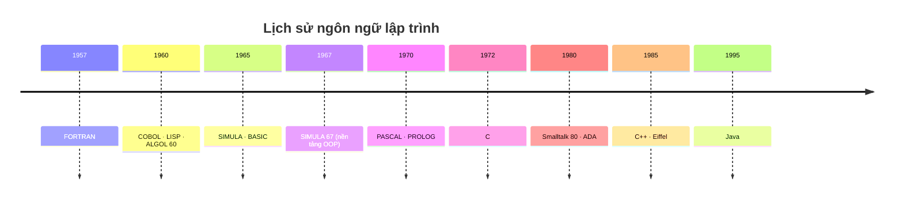
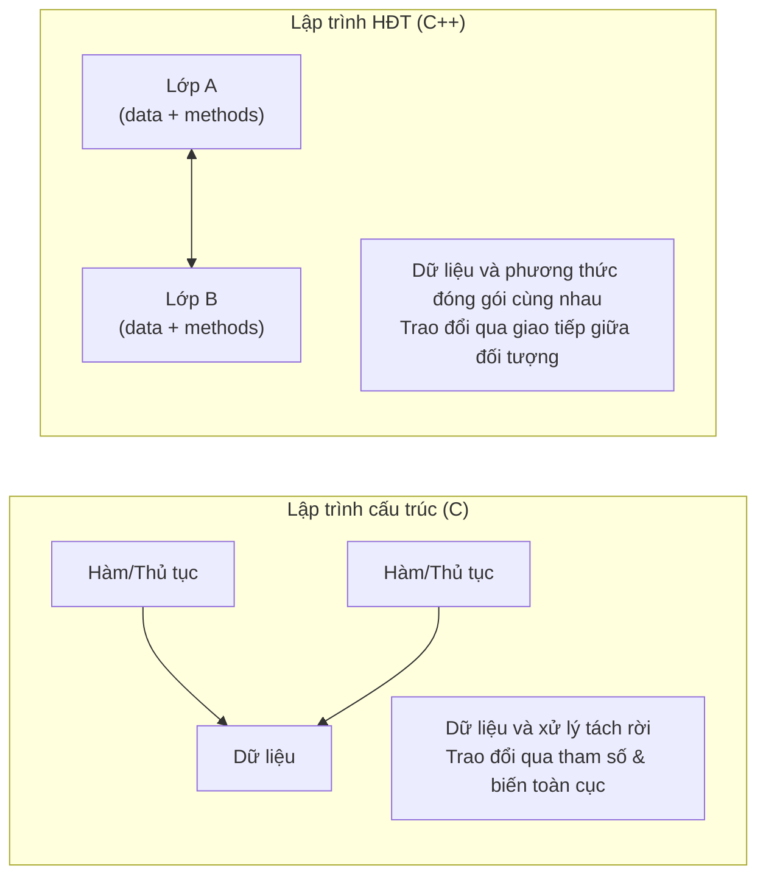
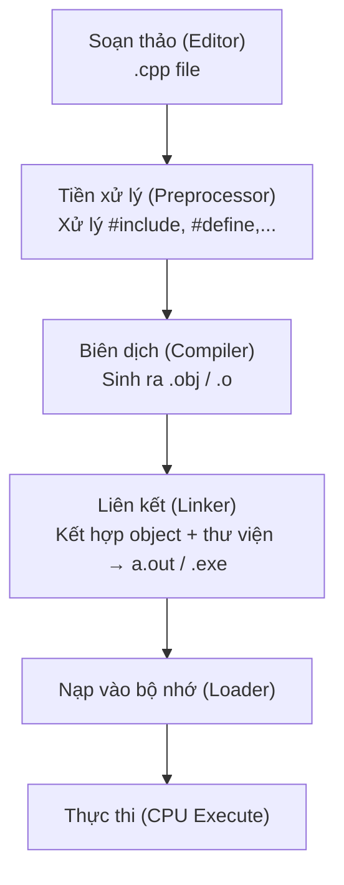
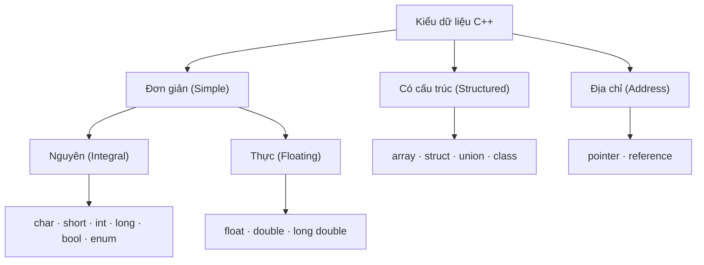
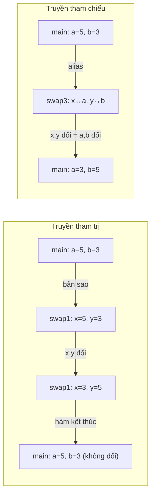

# Chương 0: Giới thiệu môn học

### Mục tiêu

Trang bị kiến thức và kỹ năng về lập trình hướng đối tượng, các nguyên lý cơ bản của thiết kế hướng đối tượng, bao gồm: cây thừa kế, đa hình, tính chất đối tượng, phân lớp và cách thức trao đổi giữa các đối tượng.

### Nội dung môn học

- Chương 1: Các đặc điểm của C++
- Chương 2: Tổng quan về lập trình HĐT
- Chương 3: Lớp và đối tượng
- Chương 4: Khởi tạo đối tượng, hàm bạn, lớp bạn
- Chương 5: Tái định nghĩa toán tử
- Chương 6: Tính kế thừa
- Chương 7: Tính đa hình
- Chương 8: Một số vấn đề khác

---

## Chương 1: Tổng quan về C++

---

### 1. Phong cách lập trình

Phong cách lập trình tốt giúp code dễ đọc, dễ bảo trì. Một số quy tắc cần tuân thủ:

- **Đặt tên biến/hàm**: dùng camelCase hoặc snake_case nhất quán, tên phải có nghĩa.
- **Xuống hàng**: mỗi câu lệnh một dòng, không viết dồn.
- **Dùng Tab và `{}`**: thụt lề đúng chuẩn, mở/đóng ngoặc rõ ràng.
- **Khai báo prototype (nguyên mẫu hàm)**: nếu hàm được định nghĩa *sau* lời gọi hàm thì **bắt buộc** khai báo prototype trước.

```cpp
// Khai báo prototype trước
int tinhTong(int a, int b);

int main() {
    cout << tinhTong(3, 4); // Gọi trước khi định nghĩa — OK vì có prototype
    return 0;
}

// Định nghĩa hàm sau
int tinhTong(int a, int b) {
    return a + b;
}
```

---

### 2. Lịch sử ngôn ngữ lập trình



> **Ghi chú:** SIMULA 67 là ngôn ngữ đầu tiên giới thiệu khái niệm *class* và *object*, đặt nền móng cho OOP hiện đại. C++ được Bjarne Stroustrup phát triển từ C, bổ sung các tính năng hướng đối tượng.

---

### 3. C và C++

#### So sánh lập trình cấu trúc vs hướng đối tượng



| Tiêu chí | Lập trình cấu trúc (C) | Lập trình HĐT (C++) |
|---|---|---|
| Tổ chức | Hàm/thủ tục | Lớp (class) |
| Dữ liệu | Tách rời khỏi hàm | Đóng gói trong lớp |
| Trao đổi | Tham số, biến toàn cục | Thông điệp giữa đối tượng |
| Tái sử dụng | Hạn chế | Cao (kế thừa, đa hình) |

> **C++ là ngôn ngữ lai (hybrid):** vừa hỗ trợ lập trình cấu trúc (như C), vừa hỗ trợ lập trình hướng đối tượng. Khác với Smalltalk là ngôn ngữ thuần OOP.

#### Các mở rộng của C++ so với C

| Tính năng | C | C++ |
|---|---|---|
| Comment một dòng | Không có | `// comment` |
| Ép kiểu | `(float)i` | Thêm `float(i+1)` |
| Khai báo biến | Phải đặt đầu block | Đặt bất kỳ đâu trước khi dùng |
| Hằng số | `#define MAX 100` | `const int MAX = 100;` |

```cpp
// Hằng số với const
const int MAXSIZE = 1000;
int a[MAXSIZE]; // hợp lệ

// Có thể dùng hàm để khởi gán hằng
const int CENTERX = getmaxx() / 2;
```

---

### 4. Ngôn ngữ C++

#### Môi trường biên dịch



---

### 4.1 Nhập xuất trong C++

C++ sử dụng **stream** (luồng dữ liệu) thay vì `printf/scanf` của C.

```cpp
#include <iostream>
using namespace std;
```

| Câu lệnh | Chức năng |
|---|---|
| `cin >> bien` | Nhập từ bàn phím |
| `cout << bieuthuc` | Xuất ra màn hình |
| `cout << endl` | Xuống dòng + flush buffer |

```cpp
// Ví dụ 1: Hello World
#include <iostream>
using namespace std;

int main() {
    cout << "Welcome to C++!" << endl;
    return 0;
}
```

```cpp
// Ví dụ 2: Nhập và tính tổng hai số nguyên
#include <iostream>
using namespace std;

int main() {
    int a, b;
    cout << "Nhap so thu nhat: ";
    cin >> a;
    cout << "Nhap so thu hai: ";
    cin >> b;
    cout << "Tong = " << a + b << endl;
    return 0;
}
```

#### Nhập chuỗi có khoảng trắng

```cpp
// Cách 1: dùng mảng char
char hoTen[50];
cin.getline(hoTen, 50);     // đọc đến '\n', bỏ '\n'
// hoặc: cin.get(hoTen, 50, '\n');

// Cách 2: dùng string (khuyến dùng)
#include <string>
string s;
getline(cin, s);
```

!!! warning "Lưu ý"
    `cin >> s` chỉ đọc đến khoảng trắng đầu tiên. Muốn đọc cả dòng (có dấu cách) phải dùng `getline`.

#### Định dạng xuất với `<iomanip>`

```cpp
#include <iomanip>

// setprecision: số chữ số thập phân, có hiệu lực cho tất cả cout sau đó
cout << setiosflags(ios::showpoint) << setprecision(4);
cout << 3.14159; // xuất: 3.1416

// setw: độ rộng tối thiểu, CHỈ có hiệu lực cho 1 giá trị gần nhất
cout << setw(10) << 42;    // "        42" (căn phải, 10 ký tự)
cout << setw(10) << 100;   // vẫn áp dụng setw vì đây là lần xuất tiếp
```

!!! info "Phân biệt"
    - `setprecision(p)` — có hiệu lực **lâu dài** cho mọi `cout` sau.
    - `setw(w)` — chỉ có hiệu lực cho **đúng 1 giá trị** xuất kế tiếp.

---

### 4.2 Toán tử phạm vi `::`

Toán tử `::` (scope resolution operator) có 3 công dụng chính:

**1. Truy cập biến toàn cục khi bị biến cục bộ che khuất:**

```cpp
int x = 100; // biến toàn cục

int main() {
    int x = 5;       // biến cục bộ
    cout << x;       // in 5 (cục bộ)
    cout << ::x;     // in 100 (toàn cục)
    return 0;
}
```

**2. Chỉ định phương thức thuộc lớp nào (khi viết bên ngoài lớp):**

```cpp
class HinhTron {
public:
    void tinhDienTich(); // khai báo trong lớp
};

// Định nghĩa bên ngoài — dùng :: để chỉ rõ thuộc lớp HinhTron
void HinhTron::tinhDienTich() {
    // ...
}
```

**3. Chỉ định namespace:**

```cpp
using std::cout;
using std::cin;
```

**Ví dụ minh họa sự khác nhau giữa `float` và `double`:**

```cpp
const double PI = 3.14159265358979; // toàn cục

int main() {
    const float PI = static_cast<float>(::PI); // cục bộ, ép kiểu từ toàn cục

    cout << setprecision(20);
    cout << "Local float PI  = " << PI   << endl;
    // → 3.141592741012573242   (float kém chính xác hơn)
    cout << "Global double PI = " << ::PI << endl;
    // → 3.141592653589790007
}
```

---

### 4.3 Các kiểu dữ liệu trong C++



#### Struct và cách sử dụng

```cpp
// Định nghĩa kiểu struct
struct TS {
    char hoTen[25];
    long soBaoDanh;
};

TS a;           // biến cấu trúc
TS ts[1000];    // mảng cấu trúc

// Truy xuất trường
cin >> a.hoTen >> a.soBaoDanh;

// Qua con trỏ
TS *p = &a;
cout << p->hoTen;
```

#### Enum (kiểu liệt kê)

```cpp
enum MAU { xanh, do, tim, vang };
// xanh=0, do=1, tim=2, vang=3 (mặc định)

MAU mauHoa = do;
```

#### typedef — đặt tên mới cho kiểu

```cpp
typedef struct {
    int tu, mau;
} PS; // PS là tên kiểu phân số

PS p; // khai báo biến phân số

typedef int MT[20][20];
MT m; // mảng 2 chiều 20x20
```

#### Struct mô tả Phân số, Ma trận, Vector

```cpp
// Phân số
struct PS {
    int tu, mau;
};

// Ma trận
struct MT {
    double a[20][20]; // các phần tử
    int m;            // số dòng
    int n;            // số cột
};

// Vector
struct VT {
    double b[20]; // các phần tử
    int n;        // số phần tử
};
```

---

### 4.4 Cấp phát bộ nhớ động

C++ dùng `new` và `delete` thay cho `malloc/free` của C.

```cpp
// Cấp phát 1 phần tử
float *p = new float;
*p = 3.14;

// Cấp phát mảng n phần tử
int *pn = new int[100];
pn[0] = 10;

// Giải phóng bộ nhớ
delete p;       // cho 1 phần tử
delete[] pn;    // cho mảng
```

!!! danger "Kiểm tra cấp phát thất bại"
    Nếu `new` thất bại (không đủ bộ nhớ), con trỏ trả về `NULL`.
    ```cpp
    int *p = new int[1000000];
    if (p == NULL) {
        cout << "Cap phat that bai!" << endl;
    }
    ```

!!! warning "Nguyên tắc vàng"
    Mọi `new` phải có `delete` tương ứng. Không `delete` → **memory leak**.

---

### 4.5 Hàm trong C++

---

#### 4.5.1 Đối số có giá trị mặc định

Cho phép gán sẵn giá trị cho tham số hàm. Khi gọi hàm, nếu không truyền giá trị cho tham số đó thì giá trị mặc định sẽ được dùng.

**Quy tắc:** Các tham số có giá trị mặc định phải đặt **ở cuối** danh sách tham số (từ phải sang trái).

```cpp
// Khai báo prototype — gán mặc định ở đây
void delay(int n = 1000);

// Định nghĩa — KHÔNG gán lại
void delay(int n) {
    // ...
}
```

```cpp
void f(int d1, float d2,
       char *d3 = "Ha Noi",
       int d4 = 100,
       double d5 = 3.14);

// Lời gọi hợp lệ:
f(3, 3.4);                    // d3="Ha Noi", d4=100, d5=3.14
f(3, 3.4, "ABC");             // d4=100, d5=3.14
f(3, 3.4, "ABC", 10);        // d5=3.14
f(3, 3.4, "ABC", 10, 1.0);   // đầy đủ

// Lời gọi SAI:
f(3);  // thiếu d2 (không có mặc định)
```

!!! tip "Dùng hàm/biến toàn cục làm giá trị mặc định"
    ```cpp
    void f(int n, int m = MAX, int xmax = getmaxx());
    ```

---

#### 4.5.2 Biến tham chiếu (Reference)

C++ có 3 loại biến:

| Loại | Mô tả | Ví dụ |
|---|---|---|
| Biến giá trị | Chứa dữ liệu trực tiếp | `int x = 10;` |
| Biến con trỏ | Chứa địa chỉ của biến khác | `int *px = &x;` |
| Biến tham chiếu | Bí danh (alias) cho biến giá trị | `int &y = x;` |

```cpp
int x = 10;
int *px = &x;   // con trỏ
int &y = x;     // tham chiếu: y là bí danh của x

y = 30;
cout << x; // in 30 — x thay đổi theo y vì cùng vùng nhớ
```

**Đặc điểm quan trọng của biến tham chiếu:**

- Không được cấp phát vùng nhớ riêng — dùng chung vùng nhớ với biến gốc.
- **Phải được khởi tạo ngay khi khai báo** (không thể khai báo rồi gán sau).
- Có thể tham chiếu đến phần tử mảng: `int &r = a[0];`
- Không được khai báo mảng tham chiếu.

```cpp
int x = 3;
int &y = x;  // OK

int &z;      // LỖI BIÊN DỊCH: phải khởi tạo ngay
```

---

#### 4.5.3 Truyền tham số: Giá trị vs Tham chiếu

```cpp
// Swap SAI — truyền giá trị, không ảnh hưởng bên ngoài
void swap1(int x, int y) {
    int t = x; x = y; y = t;
    // x, y chỉ là bản sao — biến gốc không đổi
}

// Swap ĐÚNG một phần — đổi chỗ con trỏ, không đổi giá trị
void swap2(int *x, int *y) {
    int *t = x; x = y; y = t;
    // con trỏ cục bộ thay đổi — biến gốc vẫn không đổi
}

// Swap ĐÚNG — truyền tham chiếu
void swap3(int &x, int &y) {
    int t = x; x = y; y = t;
    // x, y là alias của biến gốc — giá trị gốc thay đổi
}
```



| | Truyền tham trị | Truyền tham chiếu |
|---|---|---|
| Thay đổi biến gốc | Không | Có |
| Bộ nhớ | Tạo bản sao | Dùng trực tiếp |
| Dùng khi | Không muốn thay đổi gốc | Muốn thay đổi hoặc tránh copy lớn |

---

#### 4.5.4 Con trỏ hàm

Con trỏ hàm lưu trữ địa chỉ của một hàm, cho phép gọi hàm một cách linh hoạt (hữu ích cho callback, bảng dispatch).

```cpp
// Khai báo con trỏ hàm: kiểu trả về (*tên)(danh sách tham số)
double (*f)(double*, int);

// Ví dụ
double tinh_max(double *a, int n) { /* ... */ }
f = tinh_max;   // gán địa chỉ hàm
f(arr, 5);      // gọi qua con trỏ
```

```cpp
// Ứng dụng: truyền hàm như tham số
double nhandoi(double x) { return x * 2; }
double nhanba(double x)  { return x * 3; }

void tinh(double (*f)(double), double x) {
    cout << f(x) << endl;
}

int main() {
    tinh(nhandoi, 2); // in 4
    tinh(nhanba, 3);  // in 9
    return 0;
}
```

---

#### 4.5.5 Inline Function

Khi gọi một hàm thông thường, CPU phải: cấp phát bộ nhớ cho tham số, truyền dữ liệu, nhảy đến địa chỉ hàm, thực thi, rồi quay về. Đây là **overhead** (chi phí gọi hàm).

`inline` yêu cầu compiler **chèn thẳng** code của hàm vào nơi gọi, loại bỏ overhead này.

```cpp
inline float sqr(float x) {
    return x * x;
}

inline int Max(int a, int b) {
    return (a > b) ? a : b;
}

int main() {
    float r = sqr(5.0); // compiler chèn: float r = 5.0 * 5.0;
}
```

!!! warning "Hạn chế của inline"
    - Chỉ nên dùng cho **hàm nhỏ** (vài dòng) — nếu hàm lớn, code sẽ phình ra.
    - Compiler **bỏ qua** `inline` nếu hàm chứa: biến `static`, đệ quy, vòng lặp, `goto`, `switch`.

---

#### 4.5.6 Định nghĩa chồng hàm (Function Overloading)

Cho phép nhiều hàm **cùng tên** nhưng khác nhau về **danh sách tham số** (số lượng, kiểu, thứ tự).

```cpp
int abs(int i);
long abs(long l);
double abs(double d);

// Compiler chọn hàm phù hợp dựa trên kiểu tham số
abs(123);    // → abs(int i)
abs(123L);   // → abs(long l)
abs(3.14);   // → abs(double d)
abs('A');    // → abs(int i)  — char ép kiểu sang int
```

!!! danger "Không được phân biệt chỉ bằng kiểu trả về"
    ```cpp
    int  func(int x);
    float func(int x); // LỖI! Chỉ khác kiểu trả về — không hợp lệ
    ```

**Ví dụ thực tế — hàm Max cho nhiều kiểu:**

```cpp
int Max(int a, int b) {
    return (a > b) ? a : b;
}

float Max(float a, float b) {
    return (a > b) ? a : b;
}

int main() {
    cout << Max(1, 2)       << endl; // gọi Max(int, int)
    cout << Max(3.0f, 4.0f) << endl; // gọi Max(float, float)
}
```

---

#### 4.5.7 Định nghĩa chồng toán tử (Operator Overloading)

C++ cho phép định nghĩa lại ý nghĩa của các toán tử (`+`, `-`, `*`, ...) cho kiểu dữ liệu tự định nghĩa.

**Cú pháp:**
```
KieuTraVe operator<ten_toan_tu>(danh_sach_tham_so) { ... }
```

**Ví dụ — phép toán trên phân số:**

```cpp
struct PS {
    int tu, mau;
};

PS operator+(PS p1, PS p2) {
    PS kq;
    kq.tu  = p1.tu * p2.mau + p2.tu * p1.mau;
    kq.mau = p1.mau * p2.mau;
    return kq;
}

PS operator*(PS p1, PS p2) {
    PS kq;
    kq.tu  = p1.tu * p2.tu;
    kq.mau = p1.mau * p2.mau;
    return kq;
}

int main() {
    PS a = {1, 2};  // 1/2
    PS b = {1, 3};  // 1/3
    PS c = a + b;   // gọi operator+(a, b) → 5/6
    PS d = a * b;   // gọi operator*(a, b) → 1/6
}
```

!!! note "Quy tắc"
    Số tham số của hàm toán tử = số toán hạng của phép toán đó. Phép toán nhị phân (`+`, `-`, ...) cần 2 đối số. Phép toán đơn (`-` đảo dấu, `++`, ...) cần 1 đối số.

---

## Bài tập & Lời giải

---

### Bài tập 1: Tìm lỗi sai trong các prototype

```cpp
int func1 (int);
float func1 (int);        // (1)
int func1 (float);        // (2)
void func1 (int = 0, int); // (3)
void func2 (int, int = 0); // (4)
void func2 (int);          // (5)
void func2 (float);        // (6)
```

??? success "Lời giải"
    - **(1) `float func1(int)` — SAI**: Trùng bộ tham số `(int)` với `int func1(int)` ở trên, chỉ khác kiểu trả về. C++ không cho phép overload chỉ dựa trên kiểu trả về.
    - **(2) `int func1(float)` — ĐÚNG**: Bộ tham số `(float)` khác `(int)` → hợp lệ.
    - **(3) `void func1(int = 0, int)` — SAI**: Tham số mặc định phải nằm ở **cuối** (bên phải). Không thể có tham số không mặc định sau tham số mặc định.
    - **(4) `void func2(int, int = 0)` — ĐÚNG**: Tham số mặc định đặt đúng ở cuối.
    - **(5) `void func2(int)` — CÓ VẤN ĐỀ**: Khi gọi `func2(5)`, compiler không biết chọn `func2(int, int=0)` hay `func2(int)` → **ambiguous call**.
    - **(6) `void func2(float)` — ĐÚNG**: Bộ tham số `(float)` phân biệt được với các overload khác.

---

### Bài tập 2: Cho biết kết xuất

```cpp
void func(int i, int j = 0) {
    cout << "So nguyen: " << i << " " << j << endl;
}

void func(float i = 0, float j = 0) {
    cout << "So thuc: " << i << " " << j << endl;
}

int main() {
    int i = 1, j = 2;
    float f = 1.5, g = 2.5;
    func();
    func(i);
    func(f);
    func(i, j);
    func(f, g);
}
```

??? success "Lời giải"

    | Lời gọi | Hàm được chọn | Kết xuất |
    |---|---|---|
    | `func()` | `func(float, float)` — chỉ hàm này có thể gọi không tham số | `So thuc: 0 0` |
    | `func(i)` | **Ambiguous** — `func(int,int=0)` và `func(float=0,float=0)` đều match `int` | **Lỗi biên dịch** |
    | `func(f)` | `func(float, float)` — `f` là float khớp chính xác | `So thuc: 1.5 0` |
    | `func(i, j)` | `func(int, int)` — khớp chính xác | `So nguyen: 1 2` |
    | `func(f, g)` | `func(float, float)` — khớp chính xác | `So thuc: 1.5 2.5` |

    !!! warning
        `func(i)` gây **ambiguous call** — compiler báo lỗi vì cả hai overload đều có thể được chọn.

---

### Bài tập 3: Bài toán phân số và ngày tháng

??? success "a. Nhập phân số, rút gọn và xuất"
    ```cpp
    #include <iostream>
    using namespace std;

    struct PS { int tu, mau; };

    int UCLN(int a, int b) {
        a = (a < 0) ? -a : a;
        b = (b < 0) ? -b : b;
        while (b != 0) { int t = b; b = a % b; a = t; }
        return a;
    }

    PS rutGon(PS p) {
        int u = UCLN(p.tu, p.mau);
        p.tu /= u; p.mau /= u;
        if (p.mau < 0) { p.tu = -p.tu; p.mau = -p.mau; }
        return p;
    }

    int main() {
        PS p;
        cout << "Nhap tu va mau: "; cin >> p.tu >> p.mau;
        p = rutGon(p);
        cout << "Sau rut gon: " << p.tu << "/" << p.mau << endl;
        return 0;
    }
    ```

??? success "b. Tìm phân số lớn nhất trong hai phân số"
    ```cpp
    PS maxPS(PS a, PS b) {
        // So sánh a/b > c/d ↔ a*d > c*b
        return (a.tu * b.mau > b.tu * a.mau) ? a : b;
    }
    ```

??? success "c. Tính tổng, hiệu, tích, thương hai phân số"
    ```cpp
    PS operator+(PS a, PS b) {
        return {a.tu*b.mau + b.tu*a.mau, a.mau*b.mau};
    }
    PS operator-(PS a, PS b) {
        return {a.tu*b.mau - b.tu*a.mau, a.mau*b.mau};
    }
    PS operator*(PS a, PS b) {
        return {a.tu*b.tu, a.mau*b.mau};
    }
    PS operator/(PS a, PS b) {
        return {a.tu*b.mau, a.mau*b.tu};
    }
    ```

??? success "d. Tìm ngày kế tiếp"
    ```cpp
    struct Ngay { int ngay, thang, nam; };

    int soNgayTrongThang(int thang, int nam) {
        int days[] = {0,31,28,31,30,31,30,31,31,30,31,30,31};
        bool nhuan = (nam%4==0 && nam%100!=0) || (nam%400==0);
        if (thang == 2 && nhuan) return 29;
        return days[thang];
    }

    Ngay ngayKeTiep(Ngay d) {
        d.ngay++;
        if (d.ngay > soNgayTrongThang(d.thang, d.nam)) {
            d.ngay = 1; d.thang++;
            if (d.thang > 12) { d.thang = 1; d.nam++; }
        }
        return d;
    }
    ```

---

### Bài tập 4: Quản lý nhân viên

??? success "Lời giải gợi ý"
    ```cpp
    #include <iostream>
    #include <algorithm>
    #include <string>
    using namespace std;

    struct NhanVien {
        string maNV, hoTen, phongBan;
        int luongCB, thuong;
        int thucLanh() const { return luongCB + thuong; }
    };

    int main() {
        int n; cin >> n;
        NhanVien ds[100];
        for (int i = 0; i < n; i++) {
            cin >> ds[i].maNV >> ds[i].hoTen >> ds[i].phongBan
                >> ds[i].luongCB >> ds[i].thuong;
        }

        // a. Tổng thực lãnh
        long long tong = 0;
        for (int i = 0; i < n; i++) tong += ds[i].thucLanh();
        cout << "Tong thuc lanh: " << tong << endl;

        // b. Lương thấp nhất
        int minLuong = ds[0].luongCB;
        for (int i = 1; i < n; i++)
            if (ds[i].luongCB < minLuong) minLuong = ds[i].luongCB;
        for (int i = 0; i < n; i++)
            if (ds[i].luongCB == minLuong)
                cout << ds[i].hoTen << endl;

        // c. Số nhân viên thưởng >= 1.200.000
        int dem = 0;
        for (int i = 0; i < n; i++)
            if (ds[i].thuong >= 1200000) dem++;
        cout << "So NV thuong >= 1200000: " << dem << endl;

        // d. Sắp xếp tăng theo phòng ban, giảm theo mã NV
        sort(ds, ds + n, [](const NhanVien &a, const NhanVien &b) {
            if (a.phongBan != b.phongBan) return a.phongBan < b.phongBan;
            return a.maNV > b.maNV; // giảm dần theo mã
        });
        for (int i = 0; i < n; i++)
            cout << ds[i].phongBan << " | " << ds[i].maNV << " | " << ds[i].hoTen << endl;

        return 0;
    }
    ```
