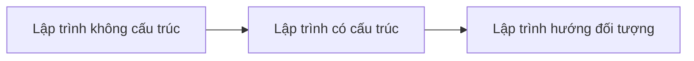
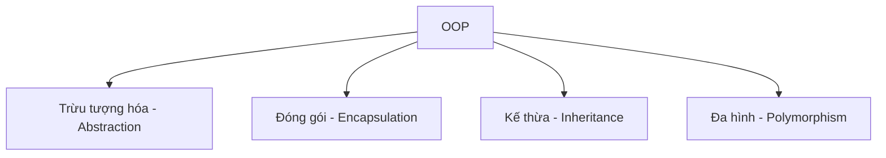
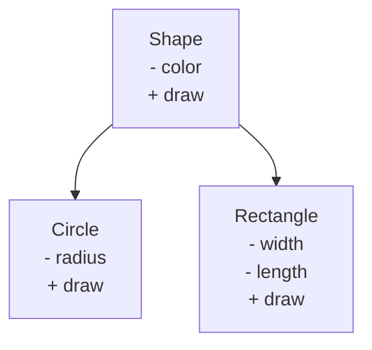
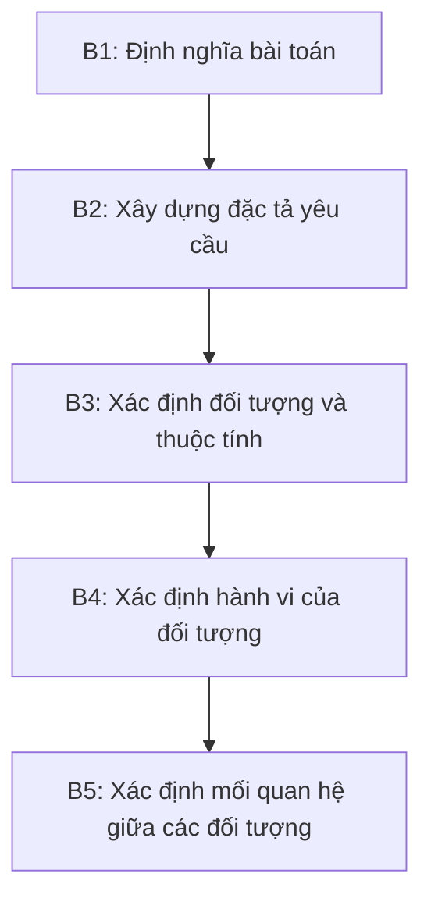

# Chương 2: Tổng Quan về Lập Trình Hướng Đối Tượng (OOP)

---

## 1. Các Phương Pháp Lập Trình

### 1.1 Lập Trình Không Có Cấu Trúc

Đây là phương pháp lập trình xuất hiện sớm nhất trong lịch sử phát triển phần mềm, tiêu biểu với các ngôn ngữ như **Assembly** và **Basic**. Chương trình được viết theo kiểu tuần tự, sử dụng biến toàn cục và lệnh `GOTO` để điều khiển luồng thực thi.

**Ví dụ minh họa (Basic):**

```basic
10  k = 1
20  gosub 100
30  if y > 120 goto 60
40  k = k + 1
50  goto 20
60  print k, y
70  stop
100 y = 3*k*k + 7*k - 3
110 return
```

> **Câu hỏi: Nhược điểm của lập trình không có cấu trúc là gì?**

??? question "Trả lời"
    - **Khó đọc, khó bảo trì:** Lệnh `GOTO` nhảy tùy tiện khắp nơi trong code, tạo ra cái gọi là *"spaghetti code"* — luồng thực thi rối như mớ bòng bong, cực kỳ khó theo dõi.
    - **Không tái sử dụng được:** Không có cơ chế đóng gói logic thành đơn vị độc lập, nên mỗi đoạn xử lý lại phải viết lại từ đầu.
    - **Biến toàn cục gây xung đột:** Mọi phần của chương trình đều có thể truy cập và thay đổi biến toàn cục, dẫn đến lỗi khó dự đoán khi chương trình phức tạp hơn.
    - **Không module hóa được:** Chương trình lớn trở thành một khối duy nhất, không thể chia nhỏ để nhiều người cùng phát triển.

---

### 1.2 Lập Trình Có Cấu Trúc

Còn gọi là **lập trình thủ tục**, phương pháp này tổ chức chương trình thành các **chương trình con** (hàm/thủ tục). Mỗi chương trình con chịu trách nhiệm xử lý một công việc cụ thể. Dữ liệu được trao đổi giữa các chương trình con thông qua **đối số (tham số)** và **biến toàn cục** (nhưng hạn chế hơn so với lập trình không có cấu trúc).

Ngôn ngữ tiêu biểu: **Pascal**, **C**.

Sử dụng các cấu trúc điều khiển rõ ràng: `for`, `while`, `do...while`, `if...else`, thay vì `GOTO`.

**Ví dụ minh họa (C):**

```c
struct Date {
    int year, mon, day;
};

void print_date(Date d) {
    printf("%d / %d / %d\n", d.day, d.mon, d.year);
}
```

**Ưu điểm:**

- Dễ đọc, dễ hiểu, dễ bảo trì hơn vì chương trình được **module hóa**.
- Dễ dàng tạo ra các **thư viện phần mềm** dùng chung.
- Có thể phân chia công việc cho nhiều lập trình viên cùng làm.

**Nhược điểm:**

!!! warning "Hạn chế của lập trình có cấu trúc"
    - **Tách rời dữ liệu và xử lý:** Chương trình dùng để xử lý dữ liệu nhưng dữ liệu và hàm xử lý lại nằm tách biệt nhau. Công thức thể hiện rõ điều này:

        > **Chương trình = Cấu trúc dữ liệu + Giải thuật**

        Struct `Date` và hàm `print_date` ở trên là hai thứ hoàn toàn tách rời — không có gì đảm bảo `print_date` chỉ được gọi với `Date`, hay không có hàm nào khác vô tình sửa dữ liệu của `Date`.

    - **Không tự động quản lý bộ nhớ:** Không có cơ chế tự động khởi tạo hay giải phóng dữ liệu động; lập trình viên phải quản lý thủ công bằng `malloc`/`free`.

    - **Mô tả thực tế kém tự nhiên:** Thế giới thực gồm các *thực thể có trạng thái và hành vi*. Lập trình có cấu trúc không có cơ chế trực tiếp để mô hình hóa điều này — ví dụ, một "tài khoản ngân hàng" vừa có dữ liệu (số dư) vừa có hành vi (rút tiền, gửi tiền), nhưng trong C, đó là hai thứ hoàn toàn tách biệt.

---

### 1.3 Lập Trình Hướng Đối Tượng

OOP được xây dựng trên nền tảng của lập trình có cấu trúc, kết hợp với **trừu tượng hóa dữ liệu**. Thay vì thiết kế chương trình theo luồng chức năng (làm gì trước, làm gì sau), OOP thiết kế xoay quanh **dữ liệu** — cụ thể là các *đối tượng* trong bài toán.

Tư tưởng cốt lõi: **lấy đối tượng làm nền tảng** để xây dựng chương trình. Một chương trình OOP là một tập hợp các đối tượng có quan hệ và tương tác với nhau.



---

## 2. Một Số Khái Niệm Cơ Bản Trong OOP

### 2.1 Đối Tượng (Object)

Trong thế giới thực, đối tượng là một **thực thể** cụ thể: một người, một chiếc xe, một tài khoản ngân hàng, v.v. Mỗi đối tượng tồn tại trong một hệ thống và có ý nghĩa nhất định trong hệ thống đó.

Mỗi đối tượng bao gồm hai thành phần:

| Thành phần | Ý nghĩa | Ví dụ (đối tượng "Người") |
|---|---|---|
| **Thuộc tính** | Dữ liệu mô tả trạng thái của đối tượng | Tên, tuổi, địa chỉ, màu mắt |
| **Hành động (thao tác)** | Những việc đối tượng có thể thực hiện | Đi, nói, thở, ăn |

!!! info "Định nghĩa"
    Một đối tượng là một thực thể bao gồm **thuộc tính** (mô tả nó là gì) và **hành động** (mô tả nó có thể làm gì).

---

### 2.2 Lớp (Class)

Khi nhiều đối tượng có chung đặc tính (cùng loại thuộc tính, cùng loại hành động), ta gom chúng lại thành một **lớp**. Lớp là bản thiết kế (blueprint), còn đối tượng là sản phẩm cụ thể được tạo ra từ bản thiết kế đó.

Một đối tượng cụ thể thuộc một lớp được gọi là một **thể hiện (instance)** của lớp đó.

**Ví dụ:**

```
Lớp: SinhVien
├── Thuộc tính: họTên, nămSinh, mãSố, điểmTB
└── Hành động: điHọc(), điThi(), phânLoại()

Thể hiện: (SinhVien)
├── họTên = "Nguyễn Văn A"
├── nămSinh = 1984
└── mãSố = "0610234T"
```

**Phân biệt các thành phần của lớp:**

- **Thuộc tính (Attribute):** Một thành phần dữ liệu của đối tượng, có giá trị cụ thể tại mỗi thời điểm. Ví dụ: `điểmTB = 9.2`.
- **Thao tác (Operation):** Thể hiện hành vi mà đối tượng có thể thực hiện, hoặc tương tác với đối tượng khác. Ví dụ: `phânLoại()`.
- **Phương thức (Method):** Cài đặt cụ thể của một thao tác trong một lớp cụ thể. Cùng một thao tác (ví dụ: `vẽ()`) có thể có cài đặt khác nhau ở lớp `Hình tròn` và lớp `Hình chữ nhật` — đó là **đa hình (polymorphism)**.

---

### 2.3 Sơ Đồ Lớp và Sơ Đồ Thể Hiện

Trong UML, một lớp được biểu diễn bằng hình chữ nhật chia làm 3 phần:

```
+--------------------+
|    Tên lớp         |  <- Phần 1: Tên
+--------------------+
| - thuộc tính 1     |  <- Phần 2: Các thuộc tính
| - thuộc tính 2     |
+--------------------+
| + hànhĐộng1()      |  <- Phần 3: Các thao tác
| + hànhĐộng2()      |
+--------------------+
```

---

## 3. Các Đặc Điểm Quan Trọng Của OOP



---

### 3.1 Trừu Tượng Hóa (Abstraction)

**Trừu tượng hóa** là quá trình nhìn nhận một tập đối tượng ở mức khái quát — chỉ quan tâm đến những đặc điểm *cần thiết* cho bài toán, bỏ qua những chi tiết không liên quan.

Ví dụ: Khi mô hình hóa "Tam giác" trong phần mềm vẽ hình:

- Ta cần: `cạnh1`, `cạnh2`, `cạnh3`, `màuNền`, `màuBiên`, `độĐậmBiên`, và các thao tác `vẽ()`, `tínhDiệnTích()`, `tínhChuVi()`.
- Ta **không** cần: chất liệu tam giác làm bằng gì, ai đã vẽ nó, nó được in từ máy in nào.

!!! note "Tóm lại"
    Trừu tượng hóa ánh xạ từ thế giới thực sang phần mềm:

    | Thế giới thực | Phần mềm |
    |---|---|
    | Thực thể | Đối tượng/Lớp |
    | Thuộc tính | Dữ liệu (fields) |
    | Hành động | Hàm (methods) |

---

### 3.2 Đóng Gói (Encapsulation)

**Đóng gói** có hai ý nghĩa liên quan mật thiết với nhau:

**Ý nghĩa 1 — Gom nhóm:** Gom dữ liệu và các hàm xử lý dữ liệu đó lại thành một đơn vị duy nhất (class), thay vì để chúng nằm rải rác tách biệt như trong lập trình có cấu trúc.

**Ý nghĩa 2 — Che giấu thông tin (Information Hiding):** Kiểm soát quyền truy cập vào dữ liệu nội bộ của đối tượng. Bên ngoài chỉ được tương tác qua các **interface công khai** (public methods), không được truy cập trực tiếp vào dữ liệu bên trong.

```
+----------------------------------+
|           Đối tượng              |
|  +----------------------------+  |
|  |  Private data (ẩn bên trong)|  |
|  |  - số dư tài khoản         |  |
|  |  - mã PIN                  |  |
|  +----------------------------+  |
|  Public methods (cổng ra vào)  |  |
|  + rútTiền(số_tiền)            |  |
|  + kiểmTraSốDư()               |  |
+----------------------------------+
```

**Tại sao cần che giấu thông tin?**

- Bảo vệ tính toàn vẹn dữ liệu: không cho phép code bên ngoài vô tình hoặc cố ý sửa dữ liệu nội bộ theo cách sai.
- Giảm phụ thuộc: khi thay đổi cách cài đặt bên trong, các phần khác của hệ thống không bị ảnh hưởng miễn là interface công khai giữ nguyên.
- Ẩn chi tiết cài đặt: người dùng lớp chỉ cần biết *làm được gì*, không cần biết *làm như thế nào*.

---

### 3.3 Kế Thừa (Inheritance)

**Kế thừa** là cơ chế cho phép một lớp **D** (lớp con/lớp dẫn xuất) tự động có được tất cả thuộc tính và thao tác của lớp **C** (lớp cha/lớp cơ sở), như thể chúng đã được định nghĩa trực tiếp trong D.



Kế thừa cho phép biểu diễn hai loại quan hệ:

- **Đặc biệt hóa ("là một"):** `Circle` *là một* `Shape`. `SinhVienGiỏi` *là một* `SinhVien`.
- **Khái quát hóa:** Ngược lại — `Shape` là khái quát hóa của `Circle` và `Rectangle`.

!!! success "Lợi ích của kế thừa"
    - **Tái sử dụng code:** Lớp con không cần viết lại những gì lớp cha đã có.
    - **Mở rộng dễ dàng:** Thêm lớp con mới mà không cần sửa lớp cha hay các lớp con khác.
    - **Tổ chức hệ thống phân cấp:** Phản ánh tự nhiên các quan hệ phân cấp trong thế giới thực.

---

### 3.4 Đa Hình (Polymorphism)

**Đa hình** là cơ chế cho phép **cùng một tên thao tác** có thể được định nghĩa ở nhiều lớp khác nhau, với những cài đặt khác nhau phù hợp với từng lớp.

**Ví dụ:** Tất cả các lớp `Dog`, `Duck`, `Cat` đều có phương thức `speak()`, nhưng:

```
dog.speak()  -> "Woof!"
duck.speak() -> "Quack!"
cat.speak()  -> "Meow!"
```

Khi ta gọi `animal.speak()` mà không biết `animal` thuộc lớp cụ thể nào, chương trình sẽ tự động gọi đúng phiên bản `speak()` tương ứng với kiểu thực tế của đối tượng — đây là **đa hình runtime**.

!!! note "Kết hợp với kế thừa"
    Đa hình thường được sử dụng cùng kế thừa: lớp cha `Animal` khai báo thao tác `speak()`, các lớp con `Dog`, `Duck`, `Cat` **ghi đè (override)** thao tác đó với cài đặt riêng của mình.

---

## 4. Phân Tích, Thiết Kế và Lập Trình Hướng Đối Tượng

### Mục Tiêu Thiết Kế Phần Mềm

Trước khi đi vào quy trình, cần hiểu rõ phần mềm tốt cần đạt được những mục tiêu sau:

| Mục tiêu | Ý nghĩa |
|---|---|
| **Tính tái sử dụng (Reusability)** | Các thành phần được thiết kế đủ tổng quát để dùng lại trong nhiều dự án khác nhau |
| **Tính mở rộng (Extensibility)** | Có thể thêm tính năng mới (plug-in, add-on) mà không cần viết lại từ đầu |
| **Tính mềm dẻo (Flexibility)** | Thay đổi một phần không kéo theo thay đổi dây chuyền toàn bộ hệ thống |

---

### 4.1 Phân Tích Hướng Đối Tượng (OOA)

OOA là bước đầu tiên — hiểu bài toán và xác định *những gì* cần xây dựng, chưa quan tâm đến *xây dựng như thế nào*.



**Chi tiết từng bước:**

??? info "B1 — Định nghĩa bài toán"
    - Tìm hiểu hệ thống cũ (nếu có) để hiểu các quy trình nghiệp vụ hiện tại.
    - Lấy yêu cầu từ nhà đầu tư và người dùng cuối.
    - Làm rõ và định nghĩa lại yêu cầu theo quan điểm kỹ thuật của người phát triển.

??? info "B2 — Xây dựng đặc tả yêu cầu"
    Từ yêu cầu đã xác định, đưa ra các đặc tả chi tiết phục vụ cho việc xây dựng và kiểm thử hệ thống. Đây là "hợp đồng" giữa đội phát triển và khách hàng.

??? info "B3 — Xác định đối tượng và thuộc tính"
    Hai kỹ thuật thường dùng:
    - **Sơ đồ dòng dữ liệu (DFD):** Dữ liệu và kho dữ liệu trong DFD thường tương ứng với các đối tượng.
    - **Phân tích văn bản:** Đọc bản mô tả yêu cầu — **danh từ** thường là các đối tượng hoặc thuộc tính.

??? info "B4 — Xác định hành vi của đối tượng"
    - **Từ DFD:** Các xử lý (process) trong sơ đồ tương ứng với hành vi của đối tượng.
    - **Phân tích văn bản:** **Động từ** chỉ hành động thường là các thao tác (operation).

??? info "B5 — Xác định mối quan hệ"
    Dựa trên sự trao đổi thông tin giữa các đối tượng. Trong một hệ thống hợp lệ, mỗi đối tượng phải có quan hệ với ít nhất một đối tượng khác.

---

### 4.2 Thiết Kế Hướng Đối Tượng (OOD)

OOD xác định *cách thức* xây dựng hệ thống, sử dụng cách tiếp cận **Bottom-Up**.

**B1:** Xác định các đối tượng trong không gian lời giải (solution space) từ các đối tượng trong không gian bài toán (problem space).

**B2:** Xây dựng đặc tả cho các lớp và mối quan hệ giữa chúng:

| Loại quan hệ | Mô tả |
|---|---|
| **Kế thừa** | Lớp con sử dụng lại thuộc tính/hàm của lớp cha |
| **Thành phần (Composition)** | Đối tượng của lớp này là phần tử của lớp khác (ví dụ: `Xe` chứa `Động cơ`) |
| **Sử dụng (Dependency)** | Lớp này đọc/xử lý đối tượng của lớp kia |

**B3:** Xây dựng cấu trúc phân cấp các lớp theo nguyên lý tổng quát hóa, tối đa hóa tái sử dụng.

**B4:** Thiết kế từng lớp — bổ sung các hàm cần thiết:

- **Hàm quản lý lớp:** Constructor/Destructor — tạo và hủy đối tượng.
- **Hàm cài đặt:** Các phép toán nghiệp vụ trên dữ liệu của lớp.
- **Hàm truy cập:** Getter/Setter — đọc và thay đổi dữ liệu nội bộ theo cách có kiểm soát.
- **Hàm xử lý lỗi:** Xử lý các tình huống ngoại lệ khi thao tác với đối tượng.

**B5:** Thiết kế chi tiết từng hàm — sử dụng kỹ thuật phân rã Top-Down và thiết kế có cấu trúc. Mỗi hàm được tổ hợp từ ba cấu trúc cơ bản: **tuần tự**, **tuyển chọn (if/switch)**, và **vòng lặp**.

**B6:** Thiết kế chương trình chính với các nhiệm vụ:

- Nhập dữ liệu từ người dùng.
- Tạo các đối tượng theo định nghĩa các lớp.
- Tổ chức trao đổi thông tin giữa các đối tượng.
- Lưu trữ hoặc hiển thị kết quả.

---

### Nguyên Tắc Thiết Kế SOLID

!!! abstract "5 nguyên tắc SOLID"

    **S — Single Responsibility Principle**
    Mỗi lớp chỉ nên có một lý do để thay đổi — tức là chỉ đảm nhận một trách nhiệm duy nhất. Ví dụ: lớp `Invoice` không nên vừa tính tiền vừa in hóa đơn ra máy in — đó là hai trách nhiệm riêng.

    **O — Open/Closed Principle**
    *"Open for extension, but Closed for modification"* — Có thể mở rộng hành vi của lớp (bằng kế thừa hoặc composition) mà không cần sửa code của lớp đó. Điều này giúp tránh gây ra lỗi ở những phần đang hoạt động tốt.

    **L — Liskov Substitution Principle**
    *"Subclasses should be substitutable for their base classes"* — Bất kỳ nơi nào dùng được lớp cha, đều phải dùng được lớp con mà không phá vỡ tính đúng đắn của chương trình. Nếu lớp con cần thêm điều kiện đặc biệt để hoạt động đúng, thiết kế kế thừa đó có vấn đề.

    **I — Interface Segregation Principle**
    *"Many client-specific interfaces are better than one general-purpose interface"* — Không nên ép một lớp phải cài đặt những thao tác mà nó không cần. Thay vì một interface lớn gộp tất cả, hãy tách thành nhiều interface nhỏ chuyên biệt.

    **D — Dependency Inversion Principle**
    *"Depend upon Abstractions. Do not depend upon concretions"* — Các module cấp cao không nên phụ thuộc trực tiếp vào module cấp thấp; cả hai nên phụ thuộc vào abstraction (interface/abstract class). Điều này giúp dễ dàng thay thế cài đặt cụ thể mà không ảnh hưởng đến logic cấp cao.

---

### 4.3 Lập Trình Hướng Đối Tượng (OOP)

Đây là bước hiện thực hóa thiết kế thành code. Các đặc điểm của lập trình OOP:

- Chương trình được tổ chức thành các **lớp** — mỗi lớp bao gồm dữ liệu và phương thức xử lý dữ liệu đó.
- Dữ liệu được **bao bọc và che giấu**, không cho phép truy cập tự do từ bên ngoài.
- Các đối tượng tương tác với nhau thông qua **việc gọi phương thức**.
- Dễ dàng bổ sung dữ liệu và phương thức mới khi cần.
- Thiết kế theo cách tiếp cận **Bottom-Up**: xây dựng các lớp cơ bản trước, sau đó kết hợp lại để tạo hệ thống hoàn chỉnh.

---

## 5. Ưu Điểm Tổng Hợp của OOP

| Đặc điểm OOP | Lợi ích thực tiễn |
|---|---|
| **Kế thừa** | Loại bỏ code lặp lại; mở rộng khả năng tái sử dụng các lớp đã xây dựng |
| **Đóng gói + Che giấu thông tin** | Bảo vệ dữ liệu; thay đổi nội bộ không ảnh hưởng đến phần còn lại |
| **Trừu tượng hóa** | Mô phỏng thế giới thực tốt hơn; ánh xạ tự nhiên từ bài toán sang code |
| **Đa hình** | Viết code tổng quát hơn; dễ mở rộng mà không cần sửa code cũ |
| **Tổng thể** | Hệ thống dễ mở rộng, nâng cấp thành hệ thống lớn hơn |

---

## 6. Bài Tập

???+ example "Bài 1 — Phân số cơ bản"
    Viết chương trình nhập vào 2 phân số, tính tổng, hiệu, tích, thương và xuất kết quả ra màn hình.

    **Gợi ý thiết kế lớp:**
    ```
    Class PhanSo
    ├── Thuộc tính: tuSo (int), mauSo (int)
    ├── Constructor: PhanSo(tu, mau) — kiểm tra mauSo != 0
    ├── rútGọn(): rút gọn phân số về dạng tối giản dùng GCD
    ├── cộng(PhanSo other): trả về PhanSo mới = tổng
    ├── trừ(PhanSo other): trả về PhanSo mới = hiệu
    ├── nhân(PhanSo other): trả về PhanSo mới = tích
    ├── chia(PhanSo other): trả về PhanSo mới = thương
    └── inRa(): in dạng "tu/mau"
    ```

???+ example "Bài 2 — Dãy phân số"
    Viết chương trình cho phép nhập một dãy phân số, tính tổng các phân số và tìm phân số lớn nhất.

    **Gợi ý:** Tái sử dụng lớp `PhanSo` từ bài 1. Thêm phương thức `soSánh(PhanSo other)` để so sánh hai phân số bằng cách quy đồng mẫu.

???+ example "Bài 3 — Ma trận"
    Viết chương trình nhập vào 2 ma trận, tính tổng, hiệu, tích hai ma trận và in kết quả ra màn hình.

    **Gợi ý thiết kế lớp:**
    ```
    Class MaTran
    ├── Thuộc tính: data (mảng 2 chiều), soHang (int), soCot (int)
    ├── nhậpDữLiệu()
    ├── cộng(MaTran other): kiểm tra cùng kích thước
    ├── trừ(MaTran other): kiểm tra cùng kích thước
    ├── nhân(MaTran other): kiểm tra số cột A = số hàng B
    └── inRa()
    ```

???+ example "Bài 4 — Quản lý học sinh"
    Viết chương trình cho phép người dùng nhập thông tin của n học sinh (mã học sinh, họ tên, giới tính, điểm Toán, điểm Lý, điểm Hóa), tính điểm trung bình và xuất thông tin chi tiết ra màn hình.

    **Gợi ý thiết kế lớp:**
    ```
    Class HocSinh
    ├── Thuộc tính: maHS, hoTen, gioiTinh, diemToan, diemLy, diemHoa
    ├── tínhĐiểmTB(): (Toán + Lý + Hóa) / 3.0
    ├── xếpLoại(): dựa trên điểm TB
    └── inThôngTin(): in đầy đủ thông tin + điểm TB + xếp loại
    ```
