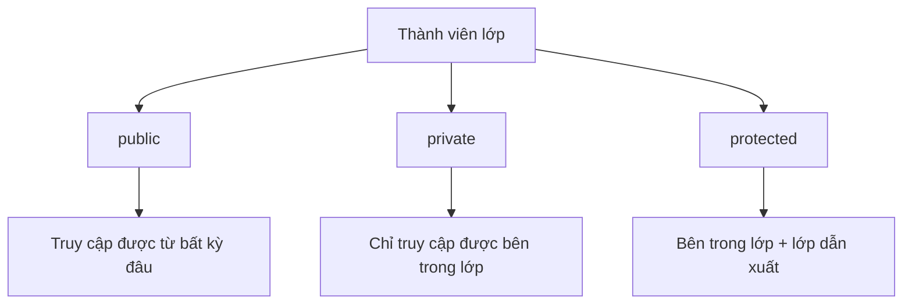
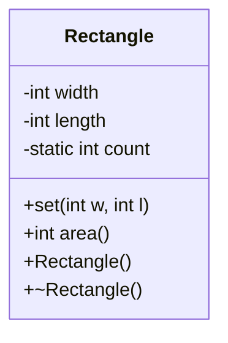

# Chương 3: Lớp và Đối Tượng 

---

## 1. Lớp trong C++ là gì?

Lớp (class) là một kiểu dữ liệu do người dùng tự định nghĩa, đóng gói cả **dữ liệu** (thuộc tính) lẫn **hành vi** (phương thức) của một thực thể vào một đơn vị thống nhất.

Lớp là mô tả **trừu tượng** của một nhóm đối tượng cùng bản chất. Mỗi **đối tượng** là một thể hiện cụ thể (instance) của lớp đó.

> Ví dụ: `Car` là lớp, còn `Mercedes`, `Audi` là các đối tượng cụ thể của lớp đó.

---

## 2. Cú pháp khai báo lớp

```cpp
class TenLop {
private:
    // Thành phần riêng tư (chỉ truy cập được bên trong lớp)

protected:
    // Thành phần riêng tư nhưng có thể truy cập từ lớp dẫn xuất (kế thừa)

public:
    // Thành phần công khai (truy cập được từ bên ngoài lớp)
};
```

**Ví dụ thực tế:**

```cpp
class Rectangle {
private:
    int width;
    int length;

public:
    void set(int w, int l);
    int area();
};
```

!!! note "Lưu ý"
    - Nếu không ghi nhãn gì, C++ mặc định coi là `private`.
    - Một lớp có thể có nhiều nhãn `private` và `public` xen kẽ nhau. Mỗi nhãn có hiệu lực từ vị trí nó xuất hiện đến khi gặp nhãn tiếp theo hoặc kết thúc lớp.

---

## 3. Định nghĩa hàm thành phần

Có hai cách định nghĩa phương thức của lớp:

### 3.1 Định nghĩa bên trong lớp (inline)

```cpp
class Rectangle {
public:
    int area() { return width * length; } // định nghĩa ngay trong khai báo
private:
    int width, length;
};
```

Hàm định nghĩa bên trong lớp được trình biên dịch ngầm coi là `inline`, tức là nội dung hàm sẽ được chèn trực tiếp vào nơi gọi để tăng hiệu năng.

### 3.2 Định nghĩa bên ngoài lớp

```cpp
// Cú pháp:
KieuTraVe TenLop::TenHam(DanhSachThamSo) {
    // nội dung
}

// Ví dụ:
void Rectangle::set(int w, int l) {
    width = w;
    length = l;
}
```

Toán tử `::` gọi là **toán tử định phạm vi** (scope resolution operator), dùng để chỉ rõ hàm này thuộc về lớp nào.

---

## 4. Khai báo và tạo lập đối tượng

### 4.1 Đối tượng tĩnh (cấp phát trên stack)

```cpp
Rectangle r1;       // khai báo đối tượng
r1.set(5, 8);       // gọi phương thức qua toán tử dấu chấm (.)
```

### 4.2 Đối tượng qua con trỏ (trỏ tới đối tượng có sẵn)

```cpp
Rectangle *r2;
r2 = &r1;           // r2 trỏ tới r1
r2->set(8, 10);     // gọi phương thức qua toán tử mũi tên (->)
```

### 4.3 Đối tượng động (cấp phát trên heap)

```cpp
Rectangle *r3;
r3 = new Rectangle();   // cấp phát bộ nhớ động
r3->set(80, 100);
delete r3;              // phải giải phóng bộ nhớ thủ công
r3 = NULL;
```

!!! warning "Cảnh báo"
    Nếu dùng `new` mà không `delete`, chương trình sẽ bị **rò rỉ bộ nhớ** (memory leak).

---

## 5. Phạm vi truy xuất



### Câu hỏi: Tại sao phải dùng private thay vì để tất cả là public?

Vì **nguyên tắc đóng gói (encapsulation)**: che giấu chi tiết cài đặt, chỉ lộ ra những gì cần thiết. Điều này giúp:

- Ngăn code bên ngoài vô tình làm hỏng dữ liệu nội bộ.
- Cho phép thay đổi cài đặt bên trong mà không ảnh hưởng code bên ngoài.
- Kiểm tra tính hợp lệ trước khi gán giá trị (thông qua getter/setter).

---

## 6. Tham số hàm thành phần và con trỏ `this`

Hàm thành phần có quyền truy cập đến tất cả thành phần `private` của **bất kỳ đối tượng nào cùng lớp**, kể cả khi đối tượng đó được truyền vào làm tham số.

```cpp
int point::Trung(point pt) {
    return (x == pt.x && y == pt.y); // pt.x là private nhưng vẫn truy cập được
}

// Tương tự với con trỏ và tham chiếu:
int point::Trung(point *pt) {
    return (x == pt->x && y == pt->y);
}

int point::Trung(point &pt) {
    return (x == pt.x && y == pt.y);
}
```

### Con trỏ `this`

Trong mỗi hàm thành phần, C++ ngầm truyền vào một con trỏ đặc biệt tên là `this`, trỏ đến **đối tượng đang gọi** hàm đó.

```cpp
int point::Trung(point pt) {
    return (this->x == pt.x && this->y == pt.y);
}
```

`this` thường được dùng tường minh khi có xung đột tên giữa tham số và thuộc tính, hoặc khi cần trả về chính đối tượng hiện tại.

---

## 7. Phép gán đối tượng

```cpp
point a, b;
a.init(5, 2);
b = a; // Sao chép toàn bộ giá trị các thuộc tính từ a sang b
```

Phép gán mặc định sao chép từng thuộc tính tương ứng. Tuy nhiên nếu lớp có con trỏ, cần cẩn thận vì đây chỉ là **shallow copy** (sao chép địa chỉ, không sao chép nội dung vùng nhớ).

---

## 8. Constructor (Phương thức thiết lập)

Constructor là phương thức đặc biệt được **tự động gọi khi đối tượng được tạo**. Dùng để khởi tạo giá trị ban đầu cho các thuộc tính.

**Đặc điểm:**
- Tên trùng với tên lớp.
- Không có kiểu trả về (kể cả `void`).
- Thường là `public`.
- Có thể **nạp chồng** (overload) nhiều constructor.
- Có thể dùng **tham số mặc định**.

### 8.1 Default Constructor

```cpp
class point {
    int x, y;
public:
    point() { x = 0; y = 0; } // default constructor
};

point b; // gọi default constructor, x=0, y=0
```

!!! note
    Nếu bạn không khai báo constructor nào, C++ tự sinh một default constructor rỗng. Nhưng nếu bạn khai báo một constructor có tham số mà **không khai báo default constructor**, thì `point b;` sẽ **báo lỗi** biên dịch.

### 8.2 Constructor có tham số

```cpp
point(int ox, int oy) { x = ox; y = oy; }

point a(5, 2); // x=5, y=2
```

### 8.3 Constructor với tham số mặc định

```cpp
point(int ox, int oy = 1) { x = ox; y = oy; }

point a(5, 2); // x=5, y=2
point c(3);    // x=3, y=1 (oy dùng giá trị mặc định)
```

### Câu hỏi: Constructor có thể nạp chồng không?

Có. Ví dụ:

```cpp
class point {
    int x, y;
public:
    point() { x = 0; y = 0; }
    point(int ox, int oy) { x = ox; y = oy; }
};

point a(5, 2); // gọi constructor thứ 2
point b;       // gọi default constructor
```

### Câu hỏi: `point c(3)` với constructor `point(int ox, int oy)` (không có mặc định) có hợp lệ không?

**Không.** Sẽ báo lỗi vì thiếu tham số `oy`. Phải thêm giá trị mặc định cho `oy` thì mới hợp lệ.

### 8.4 Copy Constructor (Constructor sao chép)

Dùng để tạo một đối tượng mới từ một đối tượng đã có, với tham số là **hằng tham chiếu** đến đối tượng cùng lớp:

```cpp
point(const point &pt) {
    x = pt.x;
    y = pt.y;
}

point a(5, 2);
point b(a); // gọi copy constructor
```

Copy constructor cho phép tùy chỉnh "giống nhau" theo nghĩa người lập trình định nghĩa, thay vì sao chép máy móc từng byte.

---

## 9. Destructor (Phương thức hủy bỏ)

Destructor được **tự động gọi khi đối tượng hết phạm vi sử dụng** hoặc khi `delete` được gọi trên con trỏ đối tượng. Dùng để giải phóng tài nguyên (bộ nhớ động, file, kết nối,...).

**Đặc điểm:**
- Tên là `~TenLop`.
- Không có kiểu trả về, không có tham số.
- Một lớp chỉ có **duy nhất một** destructor.
- Thường là `public`.

```cpp
class vector {
    int n;
    float *v;
public:
    vector(int size) {
        n = size;
        v = new float[n]; // cấp phát động
    }
    ~vector() {
        delete[] v; // giải phóng bộ nhớ khi đối tượng bị hủy
    }
};
```

---

## 10. Phương thức Truy vấn và Cập nhật (Getter / Setter)

Vì thuộc tính thường là `private`, cần cung cấp phương thức để đọc/ghi từ bên ngoài.

### Getter (truy vấn)

```cpp
int getX() { return x; }
bool isValid() { return x >= 0 && y >= 0; }
int getSum() { return x + y; } // truy vấn dẫn xuất
```

Getter **không được thay đổi** trạng thái đối tượng. Nên đánh dấu `const`:

```cpp
int getX() const { return x; }
```

### Setter (cập nhật)

```cpp
int Student::setGPA(double newGPA) {
    if (newGPA >= 0.0 && newGPA <= 4.0) {
        this->gpa = newGPA;
        return 0;  // thành công
    } else {
        return -1; // thất bại
    }
}
```

### Câu hỏi: Nếu getter/setter chỉ đọc/ghi thẳng, dùng private có ích gì?

Lợi ích thực sự nằm ở setter: có thể **kiểm tra tính hợp lệ** trước khi gán, như ví dụ `setGPA` ở trên. Ngoài ra còn giúp giới hạn quyền truy cập — có thể có getter mà không có setter (thuộc tính chỉ đọc từ ngoài).

---

## 11. Thành viên tĩnh (static member)

### 11.1 Thuộc tính static

Thuộc tính `static` là thuộc tính **dùng chung cho tất cả các thể hiện** của lớp. Chỉ tồn tại **một bản duy nhất** trong suốt vòng đời chương trình, bất kể tạo bao nhiêu đối tượng.

```cpp
class Rectangle {
private:
    int width, length;
    static int count; // dùng chung cho mọi đối tượng Rectangle
public:
    void set(int w, int l);
};

// Phải khởi tạo bên ngoài lớp:
int Rectangle::count = 0;
```

**Ví dụ đếm số đối tượng:**

```cpp
class MyClass {
    static int count;
public:
    MyClass()  { count++; }
    ~MyClass() { count--; }
    void printCount() {
        cout << "Hiện có " << count << " thể hiện.\n";
    }
};

int MyClass::count = 0;

void main() {
    MyClass *x = new MyClass;
    x->printCount(); // Hiện có 1 thể hiện.

    MyClass *y = new MyClass;
    x->printCount(); // Hiện có 2 thể hiện.
    y->printCount(); // Hiện có 2 thể hiện.

    delete x;
    y->printCount(); // Hiện có 1 thể hiện.
}
```

### 11.2 Phương thức static

Phương thức `static` có thể được gọi **mà không cần tạo đối tượng**, thông qua tên lớp:

```cpp
MyClass::printCount(); // gọi qua tên lớp, không cần đối tượng
```

!!! warning
    Phương thức `static` **không có con trỏ `this`**, do đó chỉ có thể truy cập các thành viên `static` khác của lớp, không truy cập được thuộc tính thường.

### Quy tắc truy cập thành viên static:

| Phạm vi | Cách truy cập |
|---|---|
| `public` static | Qua tên lớp (`TenLop::thanVien`) hoặc qua đối tượng |
| `private`/`protected` static | Chỉ qua hàm thành viên `public` hoặc `friend` |

---

## 12. Đối tượng toàn cục và thứ tự gọi Constructor/Destructor

Đối tượng khai báo ở phạm vi toàn cục sẽ có constructor gọi **trước `main()`** và destructor gọi **sau khi `main()` kết thúc**.

**Ví dụ:**

```cpp
#include <iostream>
using namespace std;

class Dummy {
public:
    Dummy()  { cout << "Entering a C++ program saying...\n"; }
    ~Dummy() { cout << "And then exitting..."; }
};

Dummy A; // đối tượng toàn cục

void main() {
    cout << "Hello, world.\n";
}
```

**Kết quả:**
```
Entering a C++ program saying...
Hello, world.
And then exitting...
```

Cách này cho phép thêm hành vi trước/sau `main()` mà không cần sửa hàm `main()`.

---

## 13. Ví dụ tổng hợp — Lớp Point

```cpp
#include <iostream>
using namespace std;

class point {
private:
    int x, y;
public:
    point() { x = 0; y = 0; }
    point(int ox, int oy) { x = ox; y = oy; }

    void init(int ox, int oy) { x = ox; y = oy; }
    void move(int dx, int dy) { x += dx; y += dy; }
    void display() {
        cout << "Toa do: " << x << " " << y << "\n";
    }
    int getX() const { return x; }
    int getY() const { return y; }

    int Trung(point pt) {
        return (x == pt.x && y == pt.y);
    }
};

void main() {
    point p(2, 4);
    p.display();   // Toa do: 2 4
    p.move(1, 2);
    p.display();   // Toa do: 3 6
}
```

---

## 14. Sơ đồ tổng quan cấu trúc lớp




