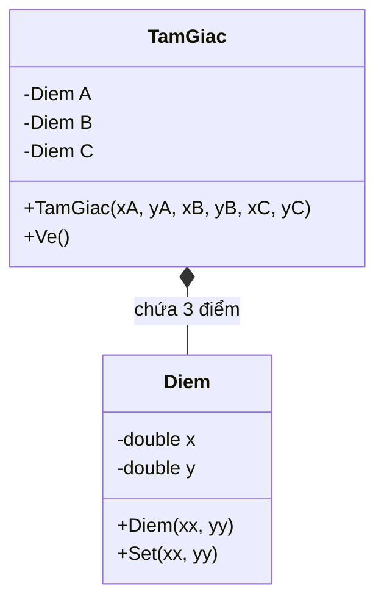
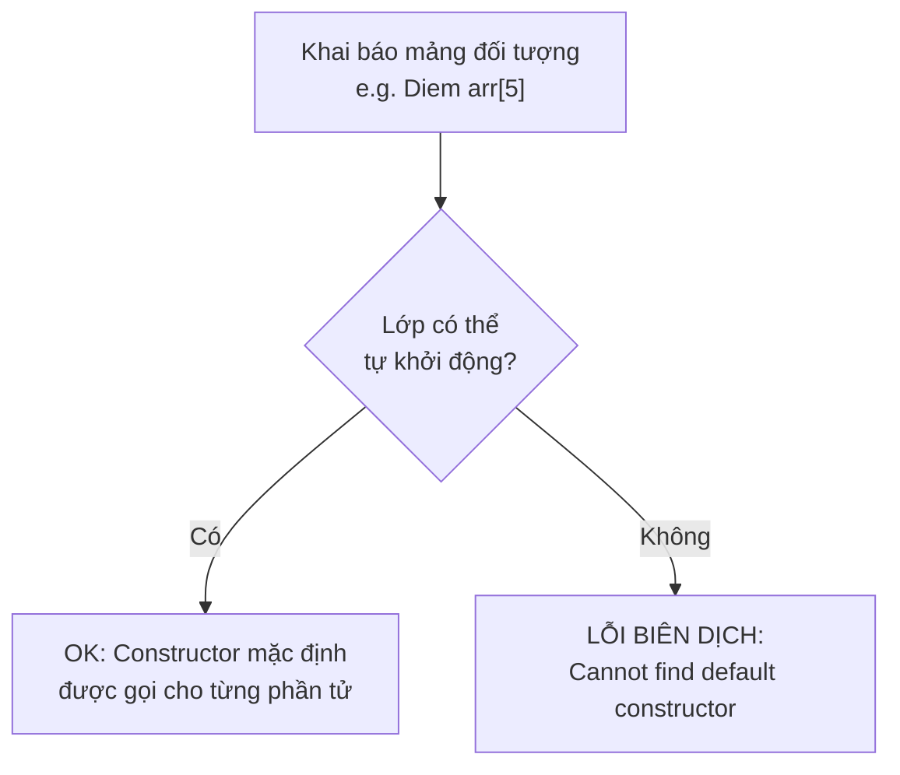
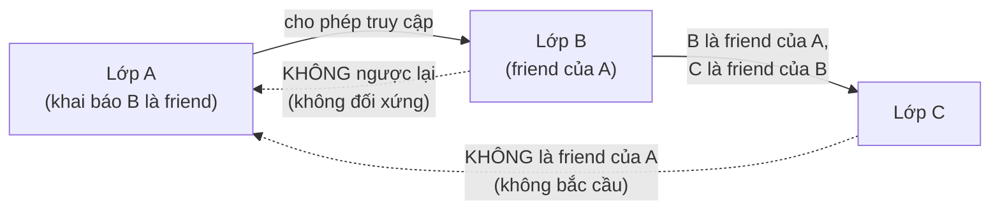
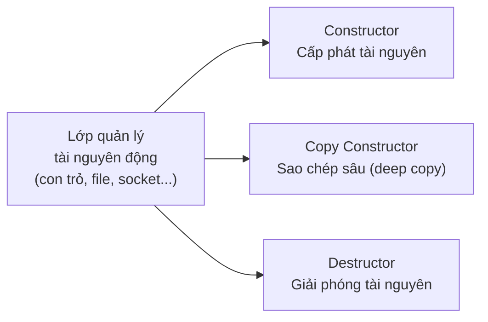
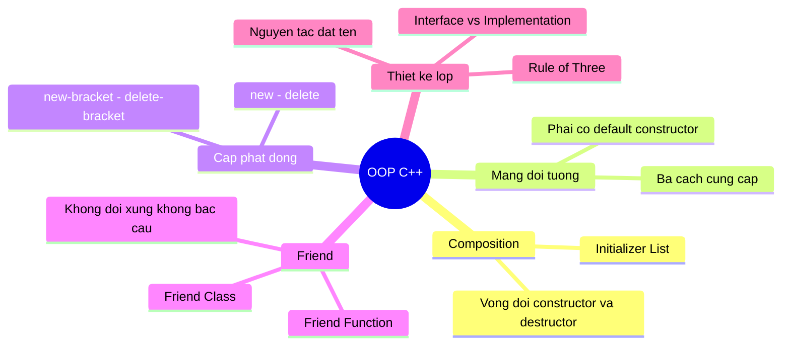

# Chương 4: Khởi Tạo Đối Tượng, Hàm Bạn và Lớp Bạn

---

## 1. Đối Tượng Là Thành Phần Của Lớp (Composition)

Trong C++, một đối tượng có thể chứa các đối tượng khác làm thành phần dữ liệu — đây gọi là **quan hệ kết hợp (composition)**. Khi đối tượng "lớn" được tạo ra, tất cả các đối tượng thành phần bên trong nó cũng được tạo ra theo.



### Vòng đời của đối tượng thành phần

- **Khi tạo**: Constructor của đối tượng thành phần được gọi **trước** constructor của đối tượng kết hợp.
- **Khi hủy**: Destructor của đối tượng kết hợp được gọi **trước**, sau đó mới đến destructor của các đối tượng thành phần (ngược với thứ tự khởi tạo).

### Cú pháp khởi tạo thành phần — Initializer List

Khi đối tượng thành phần yêu cầu tham số khi khởi tạo, đối tượng kết hợp **phải** dùng cú pháp dấu hai chấm (`:`) trong constructor để truyền tham số đó. Đây gọi là **member initializer list**.

```cpp
class TamGiac {
    Diem A, B, C;
public:
    // Dùng initializer list để truyền tham số cho từng Diem
    TamGiac(double xA, double yA,
            double xB, double yB,
            double xC, double yC)
        : A(xA, yA), B(xB, yB), C(xC, yC)
    {
        // Phần thân constructor có thể để trống
    }

    void Ve();
};

// Sử dụng:
TamGiac t(100, 100, 200, 400, 300, 300);
```

Cú pháp initializer list cũng dùng được cho **thành phần kiểu cơ sở** (int, double,...):

```cpp
class TamGiac {
    Diem A, B, C;
    int loai;
public:
    TamGiac(double xA, double yA,
            double xB, double yB,
            double xC, double yC, int l)
        : A(xA, yA), B(xB, yB), C(xC, yC), loai(l)
    {}
};

TamGiac t(100, 100, 200, 400, 300, 300, 1);
```

> **Tại sao phải dùng initializer list?**
> Nếu không dùng, C++ sẽ cố gọi constructor **không tham số** của đối tượng thành phần trước, sau đó mới gán lại trong thân constructor — vừa kém hiệu quả, vừa lỗi nếu lớp không có constructor không tham số.

---

## 2. Đối Tượng Là Thành Phần Của Mảng

Khi khai báo một mảng đối tượng, C++ phải khởi tạo **từng phần tử** trong mảng. Tuy nhiên, không thể truyền tham số riêng biệt cho từng phần tử khi khai báo mảng — do đó **mỗi phần tử phải có khả năng tự khởi động (default-constructible)**.



### Ba cách để đối tượng có khả năng tự khởi động

**Cách 1 — Lớp không có constructor nào** (C++ tự sinh constructor mặc định)

Tuy nhiên cách này chỉ khả thi với lớp đơn giản không quản lý tài nguyên động.

---

**Cách 2 — Dùng constructor có tham số mặc nhiên**

```cpp
class Diem {
    double x, y;
public:
    // Mọi tham số đều có giá trị mặc định -> có thể gọi không cần tham số
    Diem(double xx = 0, double yy = 0) : x(xx), y(yy) {}

    void Set(double xx, double yy) { x = xx; y = yy; }
};

class String {
    char *p;
public:
    String(char *s = "") { p = strdup(s); }          // Mặc định là chuỗi rỗng
    String(const String &s) { p = strdup(s.p); }     // Copy constructor
    ~String() { delete[] p; }
};

class SinhVien {
    String MaSo, HoTen;
    int NamSinh;
public:
    SinhVien(char *ht = "Nguyen Van A",
             char *ms = "19920014",
             int   ns = 1982)
        : HoTen(ht), MaSo(ms), NamSinh(ns) {}
};

// Bây giờ khai báo mảng hoàn toàn hợp lệ:
String    as[3];   // 3 chuỗi rỗng
Diem      ad[5];   // 5 điểm (0,0)
SinhVien  asv[7];  // 7 sinh viên với giá trị mặc định
```

---

**Cách 3 — Cung cấp thêm constructor không tham số riêng biệt (overloading)**

```cpp
class Diem {
    double x, y;
public:
    Diem(double xx, double yy) : x(xx), y(yy) {}  // Constructor có tham số
    Diem() : x(0), y(0) {}                         // Constructor không tham số
};

class String {
    char *p;
public:
    String(char *s) { p = strdup(s); }
    String()        { p = strdup(""); }   // Constructor không tham số
    ~String() { delete[] p; }
};

class SinhVien {
    String MaSo, HoTen;
    int NamSinh;
public:
    SinhVien(char *ht, char *ms, int ns)
        : HoTen(ht), MaSo(ms), NamSinh(ns) {}
    SinhVien()
        : HoTen("Nguyen Van A"), MaSo("19920014"), NamSinh(1982) {}
};
```

---

## 3. Đối Tượng Được Cấp Phát Động

Thay vì khai báo biến tĩnh, ta có thể cấp phát đối tượng trên **heap** bằng `new` và giải phóng bằng `delete`. Constructor được gọi tự động khi `new`, destructor được gọi tự động khi `delete`.

### Cấp phát và hủy **một** đối tượng

```cpp
// Cấp phát
int    *pi = new int;
int    *pj = new int[15];
Diem   *pd = new Diem(20, 40);          // Gọi Diem(20,40)
String *pa = new String("Nguyen Van A"); // Gọi String(...)

// Hủy (theo thứ tự ngược lại cho an toàn)
delete pa;   // Gọi ~String()
delete pd;   // Gọi ~Diem()
delete[] pj; // Hủy mảng int
delete pi;
```

### Cấp phát và hủy **nhiều** đối tượng

Khi cấp phát mảng bằng `new[]`, **không thể truyền tham số** cho từng phần tử — tương tự mảng tĩnh, mỗi phần tử phải tự khởi động được.

```cpp
// Giả sử Diem và String đã có constructor mặc định

int    *pai = new int[10];
Diem   *pad = new Diem[5];     // 5 điểm đều có tọa độ (0,0)
String *pas = new String[5];   // 5 chuỗi đều được khởi động là "Alibaba"
```

Ví dụ lớp `Diem` và `String` hỗ trợ cấp phát mảng động:

```cpp
class String {
    char *p;
public:
    String(char *s = "Alibaba") { p = strdup(s); }
    String(const String &s)     { p = strdup(s.p); }
    ~String() { delete[] p; }
};

class Diem {
    double x, y;
public:
    Diem(double xx, double yy) : x(xx), y(yy) {}
    Diem() : x(0), y(0) {}
};
```

Hủy mảng động — phải dùng `delete[]`:

```cpp
delete[] pas;  // Gọi ~String() cho cả 5 phần tử
delete[] pad;  // Gọi ~Diem()   cho cả 5 phần tử
delete[] pai;
```

> **Câu hỏi:** Có thể thay ba lệnh `delete[]` trên bằng một lệnh duy nhất `delete pas, pad, pai;` không?
>
> **Trả lời:** Không. Trong C++, `delete pas, pad, pai;` thực chất chỉ là biểu thức dùng toán tử **comma** — nó chỉ gọi `delete pas` (phần tử đầu tiên của toán tử comma được bỏ qua về mặt side effect trong ngữ cảnh này, thực ra chỉ `delete pai` được thực thi vì comma operator trả về toán hạng bên phải). Điều này dẫn đến **memory leak** hoặc **undefined behavior**. Phải dùng ba lệnh `delete[]` riêng biệt.

---

## 4. Hàm Bạn (Friend Function)

### Vấn đề đặt ra

Giả sử có lớp `Vector` và lớp `Matrix`. Cần viết hàm thực hiện phép nhân `Vector * Matrix`. Hàm này:

- Không thể thuộc `Vector` (vì nó cần truy cập nội bộ `Matrix`)
- Không thể thuộc `Matrix` (vì nó cần truy cập nội bộ `Vector`)
- Nếu là hàm tự do thì không truy cập được `private` của cả hai lớp

**Giải pháp:** Khai báo hàm đó là **hàm bạn** (`friend`) của cả hai lớp.

### Định nghĩa

Hàm bạn là hàm **không thuộc lớp** nhưng được lớp đó **cấp quyền truy cập** vào các thành phần `private` và `protected`. Khai báo `friend` phải nằm **bên trong định nghĩa lớp**.

```cpp
class COUNTERCLASS {
    int Counter;             // private
public:
    char CounterChar;        // public
    void Init(char);
    void AddOne() { Counter++; }

    friend int Total(int);   // Khai báo hàm bạn
};

COUNTERCLASS MyCounter[26];

// Định nghĩa hàm bạn — KHÔNG có từ khóa friend ở đây
int Total(int NumberObjects) {
    int sum = 0;
    for (int i = 0; i < NumberObjects; i++)
        sum += MyCounter[i].Counter;  // Truy cập được vì là friend
    return sum;
}
```

### Các tính chất của quan hệ `friend`



| Tính chất | Mô tả |
|---|---|
| **Phải được cho, không được nhận** | Lớp A phải chủ động khai báo B là `friend`. B không thể tự phong mình làm bạn của A. |
| **Không đối xứng** | B là `friend` của A không có nghĩa A là `friend` của B. |
| **Không bắc cầu** | C là `friend` của B, B là `friend` của A → C **không** phải `friend` của A. |

---

## 5. Lớp Bạn (Friend Class)

Thay vì khai báo từng hàm bạn, có thể khai báo **cả một lớp** là bạn — khi đó mọi hàm thành phần của lớp bạn đều có quyền truy cập `private` của lớp kia.

```cpp
class TOM {
public:
    friend class JERRY;   // Toàn bộ lớp JERRY là bạn của TOM
private:
    int SecretTom;        // Bí mật của TOM
};

class JERRY {
public:
    void Change(TOM T) {
        T.SecretTom++;    // Hợp lệ vì JERRY là friend của TOM
    }
};
```

> **Lưu ý:** Quan hệ friend class cũng có đầy đủ ba tính chất như friend function: phải được cho, không đối xứng, không bắc cầu.

---

## 6. Giao Diện và Chi Tiết Cài Đặt (Interface vs. Implementation)

Một lớp tốt thiết kế theo nguyên tắc **tách biệt giao diện và cài đặt**:

- **Giao diện (Interface)**: phần `public` — những gì người dùng nhìn thấy và sử dụng (tên hàm, tham số, kiểu trả về).
- **Chi tiết cài đặt (Implementation)**: dữ liệu `private` và nội dung bên trong các hàm — người dùng không cần biết và không được phép can thiệp.

Lợi ích: có thể thay đổi hoàn toàn cách cài đặt bên trong (tổ chức dữ liệu, thuật toán) **mà không làm vỡ code của người dùng**, miễn là giao diện giữ nguyên.

### Ví dụ: Lớp `ThoiDiem` — hai cách cài đặt khác nhau, cùng một giao diện

**Cách 1 — Lưu giờ, phút, giây riêng biệt:**

```cpp
class ThoiDiem {
    int gio, phut, giay;           // Lưu 3 trường riêng
    static bool HopLe(int g, int p, int gy);
public:
    ThoiDiem(int g = 0, int p = 0, int gy = 0) { Set(g, p, gy); }
    void Set(int g, int p, int gy);
    int LayGio()  const { return gio; }
    int LayPhut() const { return phut; }
    int LayGiay() const { return giay; }
    void Nhap();
    void Xuat() const;
    void Tang();
    void Giam();
};
```

**Cách 2 — Lưu tổng số giây (tiết kiệm bộ nhớ, thuận tiện cho phép tính):**

```cpp
class ThoiDiem {
    long tsgiay;                   // Chỉ lưu 1 trường: tổng số giây
    static bool HopLe(int g, int p, int gy);
public:
    ThoiDiem(int g = 0, int p = 0, int gy = 0) { Set(g, p, gy); }
    void Set(int g, int p, int gy);
    int LayGio()  const { return tsgiay / 3600; }
    int LayPhut() const { return (tsgiay % 3600) / 60; }
    int LayGiay() const { return tsgiay % 60; }
    void Nhap();
    void Xuat() const;
    void Tang();
    void Giam();
};
```

Người dùng gọi `LayGio()`, `LayPhut()`, `LayGiay()` hoàn toàn như nhau ở cả hai cách — hoàn toàn **không hay biết** cách lưu trữ bên trong đã thay đổi.

---

## 7. Các Nguyên Tắc Xây Dựng Lớp

### Nguyên tắc 1 — Đặt tên đúng từ loại

| Thành phần | Từ loại | Ví dụ |
|---|---|---|
| Tên lớp | Danh từ | `SinhVien`, `TamGiac`, `ThoiDiem` |
| Thuộc tính (data member) | Danh từ | `MaSo`, `HoTen`, `BanKinh` |
| Hàm thành phần (method) | Động từ | `Nhap()`, `Xuat()`, `TinhChuVi()` |

### Nguyên tắc 2 — Thuộc tính suy diễn được thì dùng hàm

Nếu một thuộc tính có thể **tính ra từ thuộc tính khác** → không nên lưu riêng, hãy tính khi cần:

```cpp
// Không nên — ChuVi và DienTich dư thừa, phải cập nhật thủ công
class TamGiac {
    Diem A, B, C;
    double ChuVi;     // Thừa
    double DienTich;  // Thừa
};

// Nên — tính toán khi cần
class TamGiac {
    Diem A, B, C;
public:
    double TinhChuVi()   const;
    double TinhDienTich() const;
};
```

> **Ngoại lệ:** Nếu phép tính tốn nhiều tài nguyên hoặc thời gian (ví dụ: tính tuổi trung bình dân số từ hàng triệu bản ghi) thì nên **cache** kết quả vào data member và cập nhật khi dữ liệu thay đổi.

### Nguyên tắc 3 — Nhóm dữ liệu liên quan thành lớp riêng

```cpp
// Không nên — rời rạc, khó bảo trì
class TamGiac {
    double xA, yA, xB, yB, xC, yC;
};

// Nên — dùng lớp Diem để nhóm x,y lại
class TamGiac {
    Diem A, B, C;
};
```

### Nguyên tắc 4 — Luôn có constructor; ưu tiên có constructor mặc định

```cpp
// Tốt: có constructor mặc định -> có thể dùng trong mảng, STL container...
class MyClass {
public:
    MyClass() { /* khởi động mặc định */ }
    MyClass(int x, int y) { /* khởi động có tham số */ }
};
```

### Nguyên tắc 5 — Bộ ba: Constructor + Copy Constructor + Destructor

Nếu lớp quản lý tài nguyên động (cấp phát `new` bên trong), **bắt buộc** phải định nghĩa đủ cả ba (Rule of Three trong C++03, Rule of Five trong C++11):



Nếu lớp **đơn giản**, không dùng tài nguyên động → C++ tự sinh copy constructor và destructor mặc định là đủ.

---

## Tổng Kết


