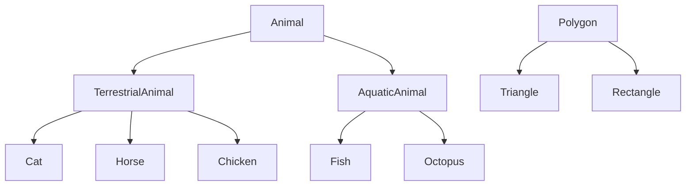
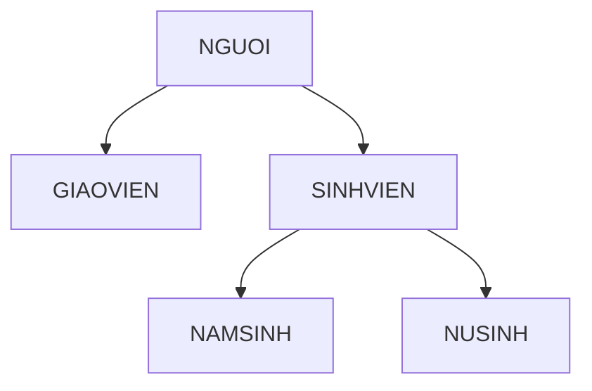
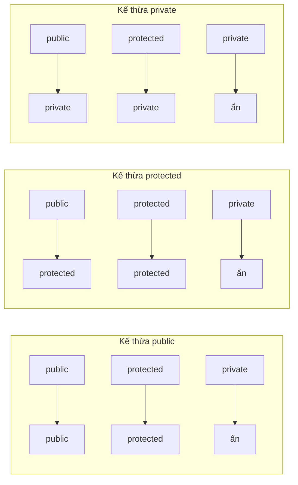
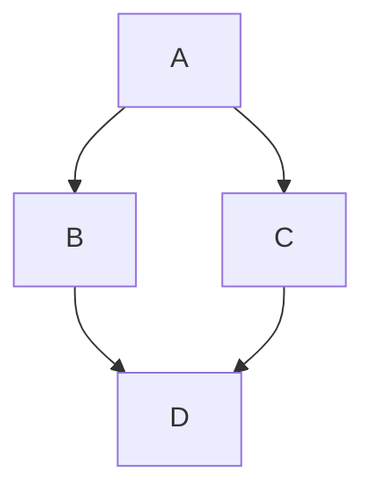
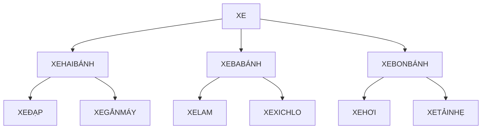
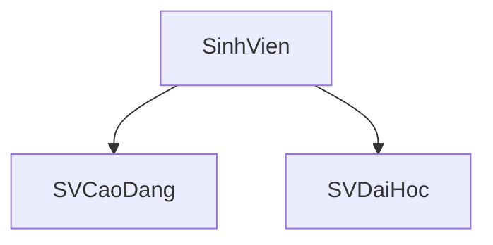
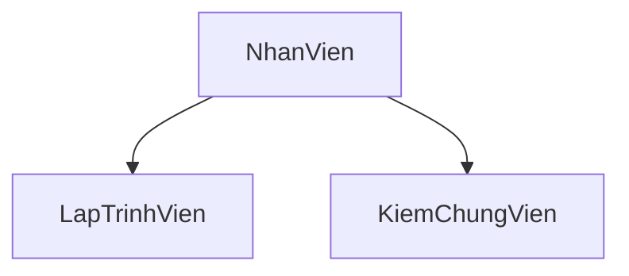
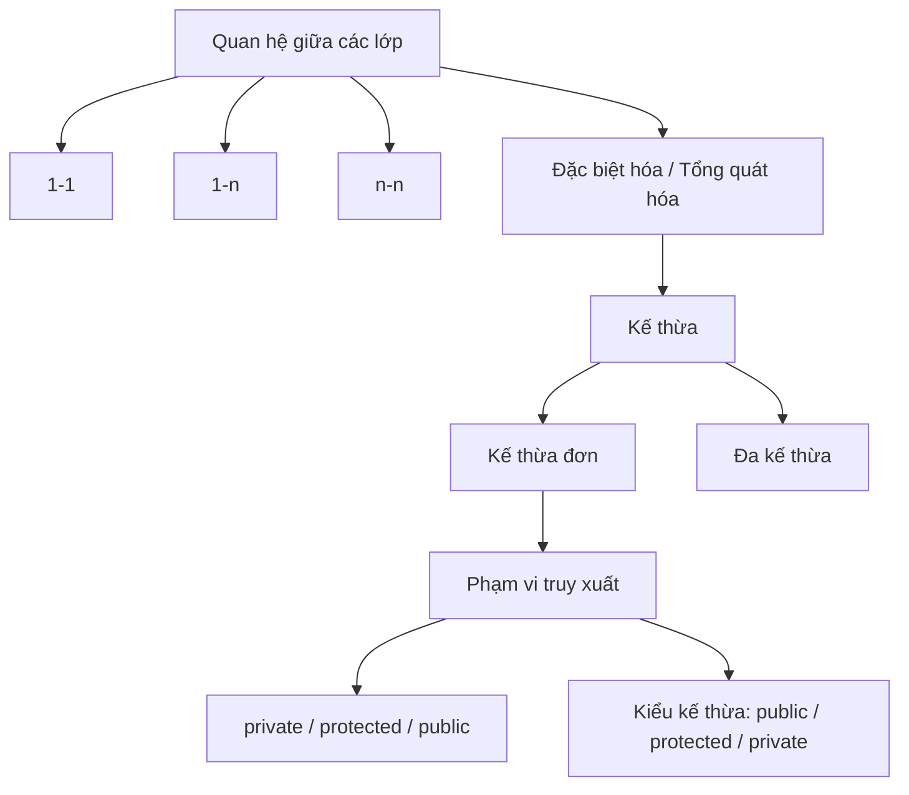

# Chương 6: Kế Thừa (Inheritance) 

---

## 1. Quan hệ giữa các lớp đối tượng

Trong lập trình hướng đối tượng, các lớp không tồn tại độc lập mà có mối quan hệ với nhau. Có 4 loại quan hệ chính:

---

### 1.1 Quan hệ Một - Một (1-1)

**Khái niệm:** Một đối tượng thuộc lớp A quan hệ với **đúng một** đối tượng thuộc lớp B, và ngược lại.

**Ví dụ thực tế:**

- `LOPHOC` — `GIAOVIEN` (quan hệ *Chủ nhiệm*): Mỗi lớp học có đúng một giáo viên chủ nhiệm, mỗi giáo viên chủ nhiệm phụ trách đúng một lớp.
- `VO` — `CHONG` (quan hệ *Hôn nhân*)
- `COUNTRY` — `CAPITAL` (quan hệ *Có thủ đô*)

```
ClassA ———————— ClassB
```

---

### 1.2 Quan hệ Một - Nhiều (1-n)

**Khái niệm:** Một đối tượng thuộc lớp A có quan hệ với **nhiều** đối tượng thuộc lớp B, nhưng mỗi đối tượng lớp B chỉ quan hệ với **đúng một** đối tượng lớp A.

**Ví dụ thực tế:**

- `LOPHOC` — `HOCSINH`: Một lớp học có nhiều học sinh, nhưng mỗi học sinh chỉ thuộc một lớp.
- `CONGTY` — `NHANVIEN`: Một công ty có nhiều nhân viên.
- `HOASI` — `TACPHAM`: Một họa sĩ có nhiều tác phẩm.

```
ClassA ———————<< ClassB
```

---

### 1.3 Quan hệ Nhiều - Nhiều (n-n)

**Khái niệm:** Một đối tượng lớp A có quan hệ với **nhiều** đối tượng lớp B, và ngược lại một đối tượng lớp B cũng có quan hệ với **nhiều** đối tượng lớp A.

**Ví dụ thực tế:**

- `NAM` — `NU` (quan hệ *Yêu*): Một người nam có thể yêu nhiều người nữ và ngược lại.
- `BACSI` — `BENHNHAN` (quan hệ *Khám bệnh*): Một bác sĩ khám nhiều bệnh nhân, một bệnh nhân khám nhiều bác sĩ.

```
ClassA >>———————<< ClassB
```

---

### 1.4 Quan hệ Đặc biệt hóa – Tổng quát hóa

**Khái niệm:** Lớp A là **trường hợp đặc biệt** của lớp B, và lớp B là **trường hợp tổng quát** của lớp A. Đây là nền tảng của **kế thừa**.

**Ví dụ:**

- `TAMGIACCAN` là trường hợp đặc biệt của `TAMGIAC`
- `SINHVIEN` là trường hợp đặc biệt của `NGUOI`



---

## 2. Kế thừa (Inheritance)

### 2.1 Định nghĩa

**Kế thừa** là một cơ chế của ngôn ngữ lập trình dùng để biểu diễn mối quan hệ **đặc biệt hóa – tổng quát hóa** giữa các lớp. Nhờ kế thừa, ta có thể:

- Xây dựng lớp mới dựa trên lớp đã có, **tái sử dụng code**.
- Tổ chức các lớp thành **sơ đồ phân cấp** (cây kế thừa).
- Dễ dàng **sửa chữa, nâng cấp** hệ thống — chỉ cần sửa ở lớp cha là tất cả lớp con được hưởng.
- Trong C++, kế thừa còn cho phép **chuyển kiểu tự động** giữa lớp cha và lớp con.

### 2.2 Thuật ngữ

| Thuật ngữ | Ý nghĩa |
|---|---|
| **Lớp cha / Lớp cơ sở** (Base class / Superclass) | Lớp được kế thừa |
| **Lớp con / Lớp dẫn xuất** (Derived class / Subclass) | Lớp kế thừa từ lớp cha |

### 2.3 Quan hệ "là một" (is-a)

Kế thừa thường được dùng để biểu diễn mối quan hệ "là một":

- Một **Sinh viên** *là một* **Người**
- Một **Hình tròn** *là một* **Hình ellipse**
- Một **Tam giác** *là một* **Đa giác**

> **Lưu ý quan trọng:** Không phải mọi quan hệ đều nên dùng kế thừa. Chỉ dùng kế thừa khi thỏa mãn đúng quan hệ "là một".

---

## 3. Kế thừa đơn (Single Inheritance)

### 3.1 Cú pháp

```cpp
class LopCha {
    // Thành phần của lớp cơ sở
};

class LopCon : public/protected/private LopCha {
    // Thành phần bổ sung của lớp dẫn xuất
};
```

Có 3 kiểu kế thừa: `public`, `protected`, `private` — sẽ giải thích chi tiết ở phần phạm vi truy xuất.

---

### 3.2 Ví dụ: Người và Sinh Viên

Xét bài toán: **Sinh viên là một Người**, nhưng có thêm thông tin mã số.

```cpp
// Lớp cha
class Nguoi {
    char *HoTen;
    int NamSinh;
public:
    Nguoi() {}
    Nguoi(char *ht, int ns) : NamSinh(ns) {
        HoTen = strdup(ht);
    }
    ~Nguoi() { delete[] HoTen; }

    void An() const { cout << HoTen << " an 3 chen com\n"; }
    void Ngu() const { cout << HoTen << " ngu ngay 8 tieng\n"; }
    void Xuat() const;

    friend ostream& operator<<(ostream &os, Nguoi &p);
};
```

```cpp
// Lớp con kế thừa từ Nguoi
class SinhVien : public Nguoi {
    char *MaSo;
public:
    SinhVien() {}
    SinhVien(char *ht, char *ms, int ns) : Nguoi(ht, ns) {
        MaSo = strdup(ms);
    }
    ~SinhVien() { delete[] MaSo; }

    void Xuat() const; // Định nghĩa lại (override) phương thức Xuat
};
```

```cpp
// Triển khai
void Nguoi::Xuat() const {
    cout << "Nguoi, ho ten: " << HoTen;
    cout << " sinh " << NamSinh << endl;
}

void SinhVien::Xuat() const {
    cout << "Sinh vien, ma so: " << MaSo << endl;
    // Không thể in HoTen trực tiếp vì HoTen là private của Nguoi
}
```

```cpp
// Sử dụng
int main() {
    Nguoi p1("Le Van Nhan", 1980);
    SinhVien s1("Vo Vien Sinh", "200002541", 1984);

    // SinhVien kế thừa phương thức An() từ Nguoi
    p1.An();   // Le Van Nhan an 3 chen com
    s1.An();   // Vo Vien Sinh an 3 chen com  <-- kế thừa!

    // Xuat() được định nghĩa lại ở SinhVien
    p1.Xuat(); // Gọi Nguoi::Xuat()
    s1.Xuat(); // Gọi SinhVien::Xuat()

    // Gọi tường minh phương thức của lớp cha
    s1.Nguoi::Xuat(); // Gọi trực tiếp Nguoi::Xuat() qua đối tượng SinhVien
}
```

---

### 3.3 Những gì lớp con kế thừa

Khi `SinhVien` kế thừa `Nguoi`:

**Về dữ liệu:** Mỗi đối tượng `SinhVien` tự động có `HoTen` và `NamSinh` (dù không khai báo lại).

**Về thao tác:** Lớp con kế thừa tất cả các phương thức của lớp cha — đây là **tái sử dụng code**. Khả năng này có thể truyền qua **vô hạn mức** (lớp cháu, lớp chắt,... đều được hưởng).

**Ngoại lệ:** **Phương thức thiết lập (constructor) không được kế thừa.** Lớp con phải tự định nghĩa constructor của mình.

---

### 3.4 Cây kế thừa nhiều mức



Ở đây, `SinhVien` vừa là **lớp con** của `Nguoi`, vừa là **lớp cha** của `NamSinh` và `NuSinh`.

---

### 3.5 Ràng buộc ngữ nghĩa ở lớp con

Đôi khi lớp con kế thừa từ lớp cha nhưng cần **ràng buộc thêm điều kiện** cho dữ liệu.

**Ví dụ:** `Số ảo` là `Số phức` nhưng **phần thực luôn bằng 0**.

```cpp
class Complex {
    friend ostream& operator<<(ostream&, Complex);
    friend class Imag;
    double re, im;
public:
    Complex(double r = 0, double i = 0) : re(r), im(i) {}
    Complex operator+(Complex b);
    Complex operator-(Complex b);
    double Norm() const { return sqrt(re*re + im*im); }
};
```

```cpp
class Imag : public Complex {
public:
    // Constructor đảm bảo phần thực luôn = 0
    Imag(double i = 0) : Complex(0, i) {}

    // Khi gán từ Complex, chỉ lấy phần ảo, bỏ phần thực
    Imag(const Complex &c) : Complex(0, c.im) {}

    Imag& operator=(const Complex &c) {
        re = 0;   // Ràng buộc: phần thực luôn = 0
        im = c.im;
        return *this;
    }

    // Override Norm() vì số ảo có Norm riêng
    double Norm() const { return fabs(im); }
};
```

```cpp
int main() {
    Imag i = 1;            // i = (0 + 1i)
    Complex z1(1, 1);      // z1 = (1 + 1i)
    Complex z3 = z1 - i;   // z3 = (1 + 0i)

    i = Complex(5, 2);     // i = (0 + 2i)  <-- phần thực bị bỏ!
    Imag j = z1;           // j = (0 + 1i)  <-- chỉ lấy phần ảo

    cout << "z1 = " << z1 << "\n";
    cout << "i = " << i << "\n";
    cout << "j = " << j << "\n";
}
```

> **Điểm mấu chốt:** Bất cứ thao tác nào có thể vi phạm ràng buộc (như phép gán) đều phải được **định nghĩa lại** ở lớp con.

---

## 4. Phạm vi truy xuất trong kế thừa

### 4.1 Hai chiều truy xuất

Có hai câu hỏi cần trả lời:

**Chiều dọc:** Hàm thành phần của **lớp con** có quyền truy xuất các thành phần của **lớp cha** không? → Do **thuộc tính khai báo ở lớp cha** quyết định (`private`, `protected`, `public`).

**Chiều ngang:** Sau khi kế thừa, **thế giới bên ngoài** có quyền truy xuất thành phần của lớp cha thông qua đối tượng lớp con không? → Do **kiểu kế thừa** (`public`, `protected`, `private`) quyết định.

---

### 4.2 Ba thuộc tính truy cập

#### `private`
- Chỉ có hàm thành phần của **chính lớp đó** và **hàm bạn (friend)** được truy xuất.
- **Lớp con không được phép truy xuất.**

#### `protected`
- Thế giới bên ngoài **không được** truy xuất (giống `private`).
- Nhưng **tất cả lớp con, cháu...** đều được phép truy xuất (khác `private`).

#### `public`
- Bất kỳ ai cũng được truy xuất.

**Câu hỏi kiểm tra:** Cho đoạn code sau, cho biết câu lệnh nào đúng, câu lệnh nào sai?

```cpp
class A {
private:
    int a;
    void f();
protected:
    int b;
    void g();
public:
    int c;
    void h();
};

int main() {
    A x;
    x.a = 10;  // SAI: a là private, không truy xuất từ ngoài
    x.f();     // SAI: f() là private
    x.b = 20;  // SAI: b là protected, không truy xuất từ ngoài
    x.g();     // SAI: g() là protected
    x.c = 30;  // ĐÚNG: c là public
    x.h();     // ĐÚNG: h() là public
}
```

---

### 4.3 Vấn đề với `private` và lớp con

```cpp
class Nguoi {
    char *HoTen;   // private -> lớp con KHÔNG được truy xuất
    int NamSinh;
public:
    // ...
};

class SinhVien : public Nguoi {
    char *MaSo;
public:
    void Xuat() const;
};

void SinhVien::Xuat() const {
    // LỖI! HoTen là private của Nguoi, SinhVien không được truy xuất
    cout << "Sinh vien, ma so: " << MaSo << ", ho ten: " << HoTen;
}
```

**Cách khắc phục tạm thời — dùng `friend`:**

```cpp
class Nguoi {
    friend class SinhVien; // Cho phép SinhVien truy xuất private
    char *HoTen;
    int NamSinh;
public:
    // ...
};
```

> **Nhược điểm:** Mỗi khi thêm lớp con mới (NuSinh, NamSinh,...) lại phải sửa lớp cha để khai báo thêm `friend`. Điều này **vi phạm tính đóng gói** và gây khó bảo trì.

**Cách khắc phục đúng đắn — dùng `protected`:**

```cpp
class Nguoi {
protected:          // Lớp con được truy xuất, thế giới ngoài thì không
    char *HoTen;
    int NamSinh;
public:
    // ...
};

class SinhVien : public Nguoi {
protected:
    char *MaSo;
public:
    void Xuat() const;
};

void SinhVien::Xuat() const {
    // OK! HoTen là protected, SinhVien được phép truy xuất
    cout << "Sinh vien, ma so: " << MaSo << ", ho ten: " << HoTen;
}
```

Nhờ `protected`, khi thêm `NuSinh` kế thừa `SinhVien`, lớp `NuSinh` cũng truy xuất được `HoTen`, `NamSinh`, `MaSo` mà **không cần sửa lớp cha**:

```cpp
class NuSinh : public SinhVien {
public:
    NuSinh(char *ht, char *ms, int ns) : SinhVien(ht, ms, ns) {}

    void An() const {
        // Truy xuất HoTen (Nguoi::protected) và MaSo (SinhVien::protected)
        cout << HoTen << " ma so " << MaSo << " an 2 to pho";
    }
};
```

> **Nguyên tắc thực hành:** Thông thường dùng `protected` cho **thành phần dữ liệu** và `public` cho **phương thức**. Tránh dùng `friend` để cho phép lớp con truy xuất — hãy dùng `protected` thay thế.

---

### 4.4 Ba kiểu kế thừa và ảnh hưởng đến phạm vi

Bảng tổng hợp đầy đủ:

| Thuộc tính trong lớp cha | Kế thừa `public` | Kế thừa `protected` | Kế thừa `private` |
|---|---|---|---|
| `public` | `public` trong lớp con | `protected` trong lớp con | `private` trong lớp con |
| `protected` | `protected` trong lớp con | `protected` trong lớp con | `private` trong lớp con |
| `private` | Ẩn (không truy xuất trực tiếp) | Ẩn (không truy xuất trực tiếp) | Ẩn (không truy xuất trực tiếp) |



**Giải thích thực tế:**
- **`public` inheritance** (thường dùng nhất): Giữ nguyên phạm vi truy xuất. Dùng khi muốn thể hiện quan hệ "là một".
- **`protected` inheritance**: Hạ tất cả `public` xuống `protected`. Lớp cháu vẫn truy xuất được, nhưng bên ngoài thì không.
- **`private` inheritance**: Mọi thứ đều trở thành `private`. Lớp cháu không kế thừa được gì từ lớp ông nội trở lên.

---

### 4.5 Ví dụ minh họa kiểu kế thừa

**Ví dụ 1 — Kế thừa `public`:**

```cpp
class mother {
protected:
    int x, y;
public:
    void set(int a, int b);
private:
    int z;
};

class daughter : public mother {
private:
    double a;
public:
    void foo();
};

void daughter::foo() {
    x = y = 20;   // OK: x, y là protected trong mother -> được truy xuất ở lớp con
    set(5, 10);   // OK: set() là public -> được truy xuất
    cout << a;    // OK: a là thành phần riêng của daughter
    z = 100;      // LỖI! z là private của mother -> lớp con không truy xuất được
}
```

**Ví dụ 2 — Kế thừa `private`:**

```cpp
class son : private mother {
private:
    double b;
public:
    void foo();
};

void son::foo() {
    x = y = 20;   // OK: x, y là protected trong mother -> trong hàm thành phần của son vẫn truy xuất được
    set(5, 10);   // OK: tương tự
    cout << b;    // OK: b là thành phần riêng của son
    z = 100;      // LỖI! z là private của mother
}

int main() {
    son s;
    s.set(1, 2);  // LỖI! Kế thừa private -> set() trở thành private trong son
                  // Bên ngoài không truy xuất được
}
```

---

### 4.6 Truy cập phương thức khi có override

```cpp
class Point {
protected:
    int x, y;
public:
    void set(int a, int b) { x = a; y = b; }
    void foo();
    void print();
};

class Circle : public Point {
private:
    double r;
public:
    // Override set() với thêm tham số r
    void set(int a, int b, double c) {
        Point::set(a, b); // Gọi tường minh phương thức lớp cha
        r = c;
    }
    void print() { /* ... */ }
};

int main() {
    Circle C;
    C.set(10, 10, 100); // Gọi Circle::set() - 3 tham số
    C.foo();            // Gọi Point::foo() - kế thừa từ Point
    C.print();          // Gọi Circle::print() - đã override

    Point A;
    A.set(30, 50);      // Gọi Point::set() - 2 tham số
    A.print();          // Gọi Point::print()
}
```

---

## 5. Phương thức thiết lập và hủy bỏ trong kế thừa

### 5.1 Phương thức thiết lập (Constructor)

Constructor **không được kế thừa**. Khi tạo một đối tượng lớp con, **constructor của lớp cha luôn được gọi trước**.

**Ví dụ 1 — Không truyền tham số cho lớp cha:**

```cpp
class A {
public:
    A() { cout << "A:default" << endl; }
    A(int a) { cout << "A:parameter" << endl; }
};

class B : public A {
public:
    B(int a) {
        cout << "B" << endl;
        // Không chỉ định rõ -> tự động gọi A() (constructor mặc định)
    }
};

B test(1);
// Output:
// A:default   <- gọi A() trước
// B           <- sau đó mới khởi tạo B
```

**Ví dụ 2 — Truyền tham số cho constructor lớp cha:**

```cpp
class C : public A {
public:
    C(int a) : A(a) { // Chỉ định rõ: gọi A(int a)
        cout << "C" << endl;
    }
};

C test(1);
// Output:
// A:parameter  <- gọi A(int) trước
// C            <- sau đó mới khởi tạo C
```

> **Lưu ý quan trọng:** Nếu lớp cha **chỉ có constructor có tham số** (không có constructor mặc định), thì lớp con **bắt buộc** phải có constructor và truyền tham số lên lớp cha qua danh sách khởi tạo (`: LopCha(tham_so)`).

---

### 5.2 Phương thức hủy bỏ (Destructor)

Khi một đối tượng bị hủy:
1. Destructor của **lớp con** được gọi **trước**.
2. Sau đó destructor của **lớp cha** được gọi **tự động**.

Vì vậy, lớp con **chỉ cần dọn dẹp phần dữ liệu riêng của mình**, không được và không cần dọn dẹp dữ liệu của lớp cha.

```cpp
class SinhVien : public Nguoi {
    char *MaSo;
public:
    SinhVien(char *ht, char *ms, int ns) : Nguoi(ht, ns) {
        MaSo = strdup(ms);
    }

    // Copy constructor - phải gọi copy constructor của lớp cha
    SinhVien(const SinhVien &s) : Nguoi(s) {
        MaSo = strdup(s.MaSo);
    }

    ~SinhVien() {
        delete[] MaSo;  // Chỉ xóa MaSo - phần riêng của SinhVien
        // HoTen sẽ được ~Nguoi() xóa tự động
    }
};
```

---

### 5.3 Con trỏ và kế thừa

```cpp
Nguoi *p;
SinhVien s("Nguyen Van A", "SV001", 2000);

p = &s;      // OK: Con trỏ lớp cha có thể trỏ đến đối tượng lớp con

SinhVien *sv;
Nguoi ng("Tran B", 1980);
sv = &ng;    // LỖI: Con trỏ lớp con KHÔNG thể trỏ đến đối tượng lớp cha

// Ép kiểu (nguy hiểm, cần cẩn thận):
sv = (SinhVien*) &ng;  // Có thể biên dịch nhưng nguy hiểm về mặt ngữ nghĩa
```

---

## 6. Đa kế thừa (Multiple Inheritance)

### 6.1 Khái niệm

**Đa kế thừa** cho phép một lớp kế thừa từ **nhiều lớp cơ sở** cùng lúc.

```cpp
class A : public B, private C {
    // ...
};
```

Tất cả đặc điểm của kế thừa đơn vẫn áp dụng.

---

### 6.2 Vấn đề xung đột tên

Khi hai lớp cơ sở có **thành phần trùng tên**, lớp con sẽ gặp lỗi mơ hồ (ambiguity):

```cpp
class BASE_A {
public:
    int a;
    int f() { return 0; }
    int g() { return 0; }
    int h() { return 0; }
};

class BASE_B {
public:
    int a;       // Trùng tên với BASE_A::a
    int f() { return 0; } // Trùng tên với BASE_A::f
    int g() { return 0; } // Trùng tên với BASE_A::g
};

class ClassC : public BASE_A, public BASE_B {
    // ...
};

int main() {
    ClassC C;
    C.f();   // LỖI: Mơ hồ - BASE_A::f() hay BASE_B::f()?
    C.a = 1; // LỖI: Mơ hồ - BASE_A::a hay BASE_B::a?
    C.g();   // LỖI: Mơ hồ
    C.h();   // OK: Chỉ có BASE_A có h()
}
```

**Cách khắc phục — dùng toán tử phạm vi `::`:**

```cpp
C.BASE_A::f();  // Gọi rõ ràng f() của BASE_A
C.BASE_B::f();  // Gọi rõ ràng f() của BASE_B
C.BASE_A::a = 1;
```

---

### 6.3 Vấn đề kế thừa hình thoi (Diamond Problem)

Khi lớp `D` kế thừa từ cả `B` và `C`, mà cả `B` và `C` cùng kế thừa từ `A`:



Lúc này `D` sẽ có **hai bản sao** của các thành phần từ `A`. Giải pháp trong C++ là dùng **virtual inheritance** (kế thừa ảo) — nội dung nâng cao.

---

## 7. Bài tập và lời giải

### Bài tập 1: Cây kế thừa các loại xe

**Đề:** Vẽ cây kế thừa cho các lớp: XE, XEHAIBÁNH, XEBABÁNH, XEBONBÁNH, XEĐẠP, XEGẮNMÁY, XEHƠI, XETẢI NHẸ, XELAM, XEXICHLO.

**Lời giải:**



---

### Bài tập 2: Quản lý sinh viên cao đẳng và đại học

**Đề:** Xây dựng chương trình C++ quản lý sinh viên 2 hệ với điều kiện tốt nghiệp khác nhau.

**Phân tích thiết kế:**



`SinhVien` (lớp cha) chứa thông tin chung: mã số, họ tên, địa chỉ, tổng tín chỉ, điểm TB.

`SVCaoDang` thêm: điểm thi tốt nghiệp. Tốt nghiệp khi: tín chỉ ≥ 120, điểm TB ≥ 5, điểm thi TN ≥ 5.

`SVDaiHoc` thêm: tên luận văn, điểm luận văn. Tốt nghiệp khi: tín chỉ ≥ 170, điểm TB ≥ 5, điểm LV ≥ 5.

```cpp
#include <iostream>
#include <cstring>
using namespace std;

class SinhVien {
protected:
    char *MaSo;
    char *HoTen;
    char *DiaChi;
    int TongTinChi;
    double DiemTB;

public:
    SinhVien(const char *ms, const char *ht, const char *dc,
             int tc, double dtb) {
        MaSo    = strdup(ms);
        HoTen   = strdup(ht);
        DiaChi  = strdup(dc);
        TongTinChi = tc;
        DiemTB  = dtb;
    }

    virtual ~SinhVien() {
        delete[] MaSo;
        delete[] HoTen;
        delete[] DiaChi;
    }

    virtual bool DuDieuKienTotNghiep() const = 0; // Hàm thuần ảo
    virtual void Xuat() const {
        cout << "Ma so: " << MaSo << ", Ho ten: " << HoTen << endl;
        cout << "Dia chi: " << DiaChi << endl;
        cout << "Tong tin chi: " << TongTinChi
             << ", Diem TB: " << DiemTB << endl;
    }
};

class SVCaoDang : public SinhVien {
    double DiemThiTN;
public:
    SVCaoDang(const char *ms, const char *ht, const char *dc,
              int tc, double dtb, double dttn)
        : SinhVien(ms, ht, dc, tc, dtb), DiemThiTN(dttn) {}

    bool DuDieuKienTotNghiep() const override {
        return (TongTinChi >= 120 && DiemTB >= 5.0 && DiemThiTN >= 5.0);
    }

    void Xuat() const override {
        cout << "=== SINH VIEN CAO DANG ===" << endl;
        SinhVien::Xuat();
        cout << "Diem thi tot nghiep: " << DiemThiTN << endl;
        cout << "Ket qua: "
             << (DuDieuKienTotNghiep() ? "Du dieu kien tot nghiep"
                                       : "Chua du dieu kien") << endl;
    }
};

class SVDaiHoc : public SinhVien {
    char *TenLuanVan;
    double DiemLuanVan;
public:
    SVDaiHoc(const char *ms, const char *ht, const char *dc,
             int tc, double dtb, const char *tlv, double dlv)
        : SinhVien(ms, ht, dc, tc, dtb), DiemLuanVan(dlv) {
        TenLuanVan = strdup(tlv);
    }

    ~SVDaiHoc() { delete[] TenLuanVan; }

    bool DuDieuKienTotNghiep() const override {
        return (TongTinChi >= 170 && DiemTB >= 5.0 && DiemLuanVan >= 5.0);
    }

    void Xuat() const override {
        cout << "=== SINH VIEN DAI HOC ===" << endl;
        SinhVien::Xuat();
        cout << "Ten luan van: " << TenLuanVan << endl;
        cout << "Diem luan van: " << DiemLuanVan << endl;
        cout << "Ket qua: "
             << (DuDieuKienTotNghiep() ? "Du dieu kien tot nghiep"
                                       : "Chua du dieu kien") << endl;
    }
};

int main() {
    SVCaoDang svcd("CD001", "Nguyen Van A", "TP.HCM", 125, 6.5, 7.0);
    SVDaiHoc  svdh("DH001", "Tran Thi B",  "Ha Noi", 175, 7.2,
                   "He thong quan ly sinh vien", 8.0);

    svcd.Xuat();
    cout << endl;
    svdh.Xuat();

    return 0;
}
```

---

### Bài tập 3: Quản lý nhân viên công ty phần mềm

**Đề:** Lập trình viên và Kiểm chứng viên có lương tính khác nhau.

**Thiết kế lớp:**



```cpp
#include <iostream>
#include <vector>
#include <cstring>
using namespace std;

class NhanVien {
protected:
    char *MaNV, *HoTen, *Email, *SoDienThoai;
    int Tuoi;
    double LuongCoBan;

public:
    NhanVien(const char *ma, const char *ht, int tuoi,
             const char *sdt, const char *email, double lcb) {
        MaNV       = strdup(ma);
        HoTen      = strdup(ht);
        SoDienThoai= strdup(sdt);
        Email      = strdup(email);
        Tuoi       = tuoi;
        LuongCoBan = lcb;
    }

    virtual ~NhanVien() {
        delete[] MaNV; delete[] HoTen;
        delete[] Email; delete[] SoDienThoai;
    }

    virtual double TinhLuong() const = 0;

    virtual void Xuat() const {
        cout << "Ma NV: " << MaNV << " | Ho ten: " << HoTen
             << " | Tuoi: " << Tuoi << endl;
        cout << "SDT: " << SoDienThoai << " | Email: " << Email << endl;
        cout << "Luong co ban: " << LuongCoBan
             << " | Luong thang nay: " << TinhLuong() << endl;
    }
};

class LapTrinhVien : public NhanVien {
    int SoGioOvertime;
public:
    LapTrinhVien(const char *ma, const char *ht, int tuoi,
                 const char *sdt, const char *email,
                 double lcb, int overtime)
        : NhanVien(ma, ht, tuoi, sdt, email, lcb),
          SoGioOvertime(overtime) {}

    double TinhLuong() const override {
        return LuongCoBan + SoGioOvertime * 200000.0;
    }

    void Xuat() const override {
        cout << "--- LAP TRINH VIEN ---" << endl;
        NhanVien::Xuat();
        cout << "So gio overtime: " << SoGioOvertime << endl;
    }
};

class KiemChungVien : public NhanVien {
    int SoLoiPhatHien;
public:
    KiemChungVien(const char *ma, const char *ht, int tuoi,
                  const char *sdt, const char *email,
                  double lcb, int soLoi)
        : NhanVien(ma, ht, tuoi, sdt, email, lcb),
          SoLoiPhatHien(soLoi) {}

    double TinhLuong() const override {
        return LuongCoBan + SoLoiPhatHien * 50000.0;
    }

    void Xuat() const override {
        cout << "--- KIEM CHUNG VIEN ---" << endl;
        NhanVien::Xuat();
        cout << "So loi phat hien: " << SoLoiPhatHien << endl;
    }
};

int main() {
    vector<NhanVien*> danhSach;
    danhSach.push_back(
        new LapTrinhVien("NV001","Nguyen Van A",25,"0901","a@co.vn",10000000,20));
    danhSach.push_back(
        new KiemChungVien("NV002","Tran Thi B",30,"0902","b@co.vn",8000000,50));
    danhSach.push_back(
        new LapTrinhVien("NV003","Le Van C",28,"0903","c@co.vn",12000000,5));

    // Tính lương trung bình
    double tongLuong = 0;
    for (auto nv : danhSach) tongLuong += nv->TinhLuong();
    double luongTB = tongLuong / danhSach.size();

    cout << "=== DANH SACH NHAN VIEN ===" << endl;
    for (auto nv : danhSach) { nv->Xuat(); cout << endl; }

    cout << "=== NHAN VIEN CO LUONG THAP HON TRUNG BINH ("
         << luongTB << ") ===" << endl;
    for (auto nv : danhSach)
        if (nv->TinhLuong() < luongTB) nv->Xuat();

    for (auto nv : danhSach) delete nv;
    return 0;
}
```

---

### Bài tập 4 (Bài tập đầu chương): Quản lý sinh viên đại học CNTT

**Điều kiện tốt nghiệp:** Tín chỉ ≥ 140, Điểm TB ≥ 5, Điểm luận văn ≥ 5.

```cpp
class SinhVienDHCNTT {
protected:
    char *MaSo, *HoTen, *DiaChi;
    int TongTinChi;
    double DiemTB;
    char *TenLuanVan;
    double DiemLuanVan;

public:
    SinhVienDHCNTT(const char *ms, const char *ht, const char *dc,
                   int tc, double dtb, const char *tlv, double dlv) {
        MaSo       = strdup(ms);
        HoTen      = strdup(ht);
        DiaChi     = strdup(dc);
        TongTinChi = tc;
        DiemTB     = dtb;
        TenLuanVan = strdup(tlv);
        DiemLuanVan= dlv;
    }

    ~SinhVienDHCNTT() {
        delete[] MaSo; delete[] HoTen;
        delete[] DiaChi; delete[] TenLuanVan;
    }

    bool DuDieuKienTotNghiep() const {
        return (TongTinChi >= 140 && DiemTB >= 5.0 && DiemLuanVan >= 5.0);
    }

    void Xuat() const {
        cout << "Ma so: " << MaSo << " | Ho ten: " << HoTen << endl;
        cout << "Dia chi: " << DiaChi << endl;
        cout << "Tong TC: " << TongTinChi << " | Diem TB: " << DiemTB << endl;
        cout << "Luan van: " << TenLuanVan
             << " | Diem LV: " << DiemLuanVan << endl;
        cout << "Tot nghiep: "
             << (DuDieuKienTotNghiep() ? "Co" : "Chua") << endl;
    }
};
```

---

## Tổng kết



| Chủ đề | Điểm cốt lõi |
|---|---|
| Quan hệ "là một" | Nền tảng để áp dụng kế thừa đúng cách |
| `protected` | Cho phép lớp con truy xuất, che giấu với bên ngoài |
| Constructor | Không kế thừa; lớp con phải tự định nghĩa và gọi constructor cha |
| Destructor | Tự động gọi destructor cha sau destructor con |
| Override | Lớp con định nghĩa lại phương thức của lớp cha |
| Đa kế thừa | Cẩn thận với xung đột tên và diamond problem |
