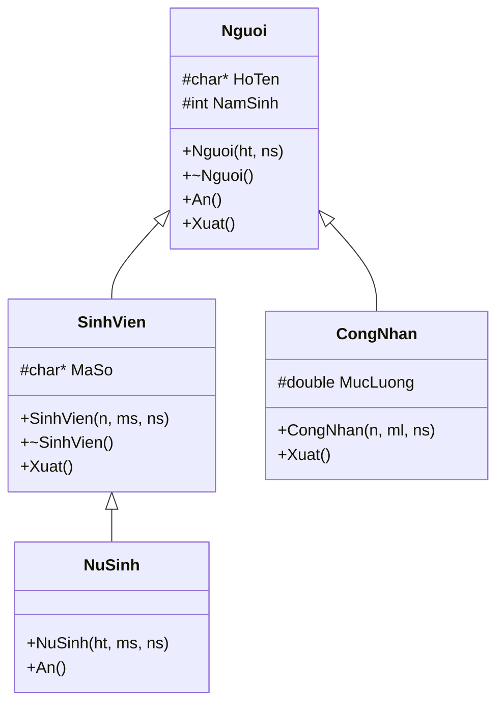
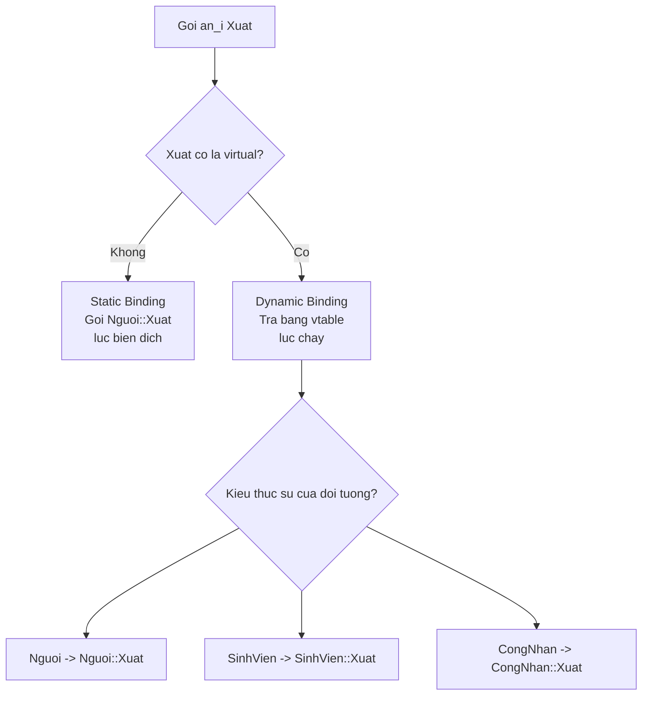
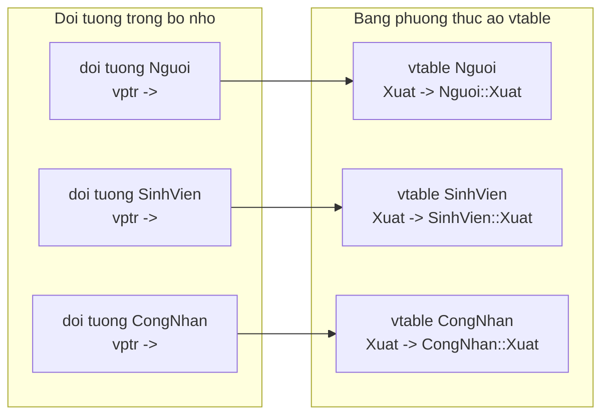
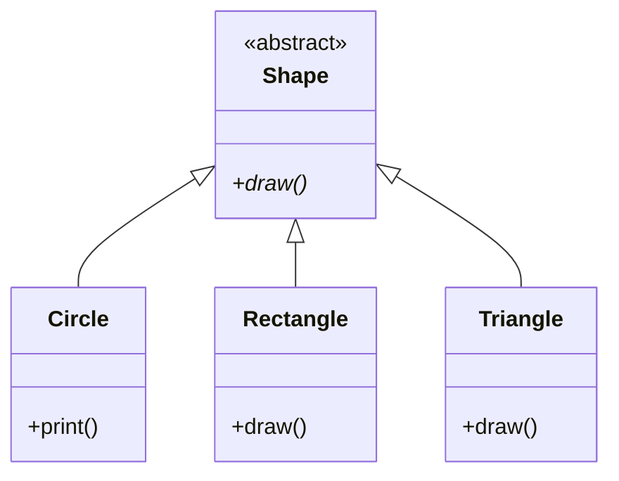
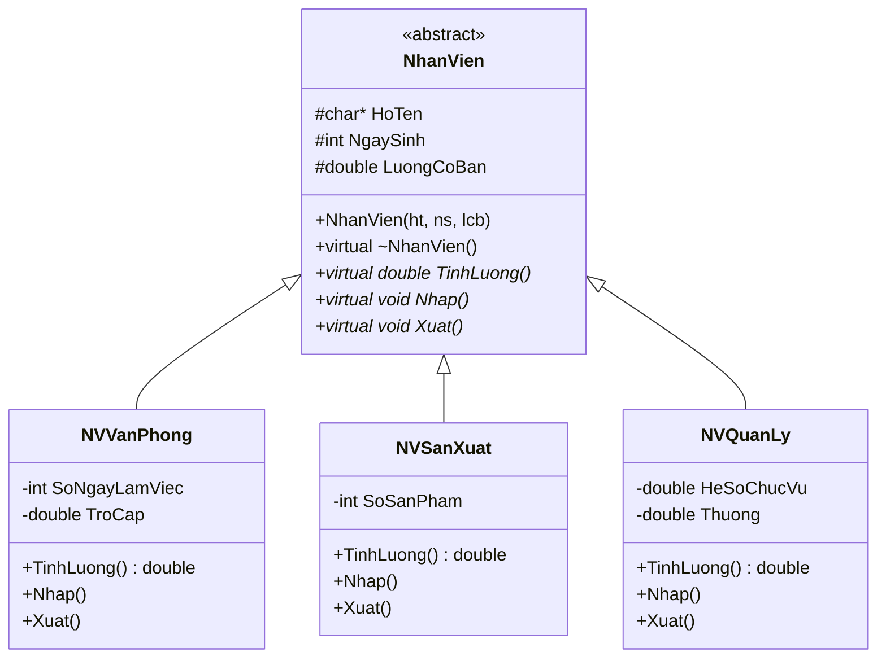
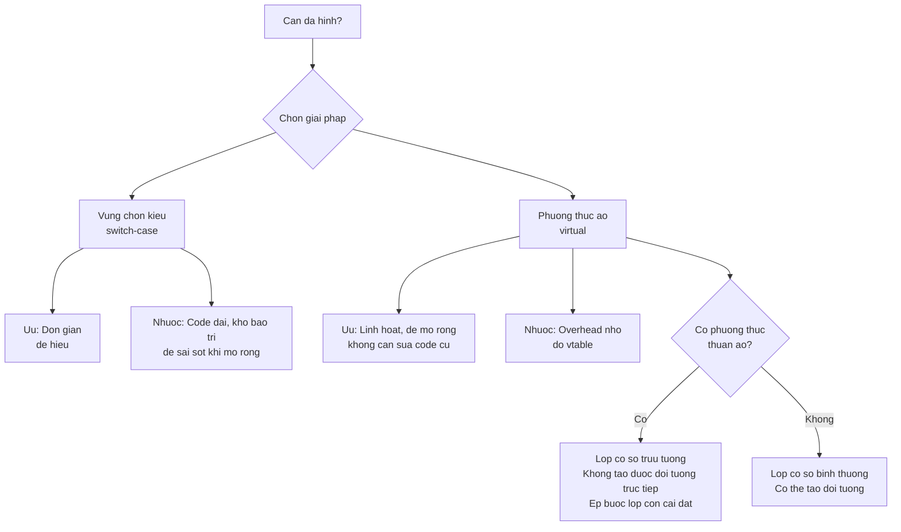

# Chương 7: Tính Đa Hình (Polymorphism) 

---

## 1. Giới thiệu về Tính Đa Hình

**Tính đa hình** (Polymorphism) là một trong bốn tính chất cốt lõi của lập trình hướng đối tượng (OOP), bên cạnh tính đóng gói, kế thừa và trừu tượng.

> **Định nghĩa:** Đa hình là hiện tượng các đối tượng thuộc các lớp khác nhau có khả năng hiểu cùng một thông điệp theo các cách khác nhau.

Tính đa hình **xuất hiện khi có sự kế thừa** giữa các lớp. Có những phương thức mang tính tổng quát cho mọi lớp dẫn xuất nên phải có mặt ở lớp cơ sở, nhưng nội dung cụ thể của nó chỉ được xác định ở các lớp dẫn xuất.

**Ví dụ thực tế:** Khi nhận cùng một thông điệp "nhảy", một con kangaroo và một con cóc nhảy theo hai kiểu hoàn toàn khác nhau — chúng cùng có hành vi "nhảy" nhưng cách thực hiện khác nhau. Tương tự, phương thức `tinhDienTich()` ở lớp hình tam giác và lớp hình tứ giác có cùng tên nhưng thuật toán tính hoàn toàn khác nhau.

---

## 2. Bài Toán Đặt Ra

Giả sử cần quản lý một danh sách các đối tượng có kiểu **khác nhau** (Người, Sinh viên, Công nhân). Có hai vấn đề cần giải quyết:

- **Lưu trữ:** Dùng mảng con trỏ kiểu lớp cơ sở, danh sách liên kết, v.v.
- **Thao tác xử lý:** Phải thỏa mãn yêu cầu đa hình — thao tác hoạt động khác nhau ứng với từng loại đối tượng.

Có **hai cách** để giải quyết:

1. Vùng chọn kiểu (Type selector field)
2. Phương thức ảo (Virtual method)

---

## 3. Ví Dụ Cơ Sở — Hệ Thống Phân Cấp Lớp

Trước khi đi vào hai cách giải quyết, hãy xem cấu trúc phân cấp lớp được dùng xuyên suốt chương:



Khai báo các lớp:

```cpp
class Nguoi {
protected:
    char *HoTen;
    int NamSinh;
public:
    Nguoi(char *ht, int ns) : NamSinh(ns) { HoTen = strdup(ht); }
    ~Nguoi() { delete[] HoTen; }
    void An() const { cout << HoTen << " an 3 chen com"; }
    void Xuat() const {
        cout << "Nguoi, ho ten: " << HoTen << " sinh " << NamSinh;
    }
};

class SinhVien : public Nguoi {
protected:
    char *MaSo;
public:
    SinhVien(char *n, char *ms, int ns) : Nguoi(n, ns) {
        MaSo = strdup(ms);
    }
    ~SinhVien() { delete[] MaSo; }
    void Xuat() const {
        cout << "Sinh vien " << HoTen << ", ma so " << MaSo;
    }
};

class NuSinh : public SinhVien {
public:
    NuSinh(char *ht, char *ms, int ns) : SinhVien(ht, ms, ns) {}
    void An() const {
        cout << HoTen << " ma so " << MaSo << " an 2 to pho";
    }
};

class CongNhan : public Nguoi {
protected:
    double MucLuong;
public:
    CongNhan(char *n, double ml, int ns) : Nguoi(n, ns), MucLuong(ml) {}
    void Xuat() const {
        cout << "Cong nhan, ten " << HoTen << " muc luong: " << MucLuong;
    }
};
```

**Vấn đề xảy ra** khi gọi hàm in danh sách qua con trỏ lớp cơ sở:

```cpp
void XuatDs(int n, Nguoi *an[]) {
    for (int i = 0; i < n; i++) {
        an[i]->Xuat();  // Luon goi Xuat() cua lop Nguoi!
        cout << "\n";
    }
}

void main() {
    Nguoi *a[4];
    a[0] = new SinhVien("Vien Van Sinh", "200001234", 1982);
    a[1] = new NuSinh("Le Thi Ha Dong", "200001235", 1984);
    a[2] = new CongNhan("Tran Nhan Cong", 1000000, 1984);
    a[3] = new Nguoi("Nguyen Thanh Nhan", 1960);
    XuatDs(4, a);
}
```

Kết quả (sai — tất cả đều gọi `Xuat()` của `Nguoi`):

```
Nguoi, ho ten: Vien Van Sinh sinh 1982
Nguoi, ho ten: Le Thi Ha Dong sinh 1984
Nguoi, ho ten: Tran Nhan Cong sinh 1984
Nguoi, ho ten: Nguyen Thanh Nhan sinh 1960
```

> **Nguyên nhân:** Không có đa hình — khi truy xuất qua con trỏ lớp cơ sở `Nguoi*`, trình biên dịch chỉ gọi phiên bản `Xuat()` của `Nguoi`, bất kể đối tượng thực sự thuộc lớp nào. Đây là **kết nối tĩnh** (static binding).

---

## 4. Cách 1 — Vùng Chọn Kiểu (Type Selector)

### 4.1 Ý tưởng

Thêm một trường dữ liệu đặc biệt vào lớp cơ sở để **nhận diện kiểu thực sự** của đối tượng. Dùng `enum` để biểu diễn các kiểu có thể có.

```cpp
class Nguoi {
public:
    enum LOAI { NGUOI, SV, CN };
protected:
    char *HoTen;
    int NamSinh;
public:
    LOAI pl;   // <-- Vung chon kieu

    Nguoi(char *ht, int ns) : NamSinh(ns), pl(NGUOI) {
        HoTen = strdup(ht);
    }
    ~Nguoi() { delete[] HoTen; }
    void An() const { cout << HoTen << " an 3 chen com"; }
    void Xuat() const {
        cout << "Nguoi, ho ten: " << HoTen << " sinh " << NamSinh;
    }
};

class SinhVien : public Nguoi {
protected:
    char *MaSo;
public:
    SinhVien(char *n, char *ms, int ns) : Nguoi(n, ns) {
        MaSo = strdup(ms);
        pl = SV;   // <-- Dat gia tri vung chon kieu
    }
    ~SinhVien() { delete[] MaSo; }
    void Xuat() const {
        cout << "Sinh vien " << HoTen << ", ma so " << MaSo;
    }
};

class CongNhan : public Nguoi {
protected:
    double MucLuong;
public:
    CongNhan(char *n, double ml, int ns) : Nguoi(n, ns), MucLuong(ml) {
        pl = CN;   // <-- Dat gia tri vung chon kieu
    }
    void Xuat() const {
        cout << "Cong nhan, ten " << HoTen << " muc luong: " << MucLuong;
    }
};
```

### 4.2 Hàm xử lý dùng switch-case

```cpp
void XuatDs(int n, Nguoi *an[]) {
    for (int i = 0; i < n; i++) {
        switch (an[i]->pl) {
            case Nguoi::SV:
                ((SinhVien*)an[i])->Xuat();  // Ep kieu ve SinhVien*
                break;
            case Nguoi::CN:
                ((CongNhan*)an[i])->Xuat();  // Ep kieu ve CongNhan*
                break;
            default:
                an[i]->Xuat();
                break;
        }
        cout << "\n";
    }
}
```

Kết quả (đúng):

```
Sinh vien Vien Van Sinh, ma so 200001234
Sinh vien Le Thi Ha Dong, ma so 200001235
Cong nhan, ten Tran Nhan Cong muc luong: 1000000
Nguoi, ho ten: Nguyen Thanh Nhan sinh 1960
```

### 4.3 Nhược điểm của vùng chọn kiểu

!!! warning "Hạn chế của cách tiếp cận này"
    - **Mã lệnh dài dòng:** Mỗi thao tác cần một `switch-case` lớn, số lượng `case` tăng theo số lớp dẫn xuất.
    - **Dễ sai sót:** Nếu quên cập nhật `switch` khi thêm lớp mới, chương trình chạy sai mà không báo lỗi.
    - **Khó bảo trì, nâng cấp:** Thêm một lớp mới đòi hỏi sửa tất cả các hàm có `switch-case` liên quan — vi phạm nguyên tắc Open/Closed.

---

## 5. Cách 2 — Phương Thức Ảo (Virtual Method)

### 5.1 Khái niệm

**Phương thức ảo** là cơ chế C++ dùng để hiện thực hóa tính đa hình. Khai báo một hàm thành phần là phương thức ảo bằng từ khóa `virtual`.

Khi đó, trình biên dịch sẽ **tự động gọi đúng phiên bản** phương thức tương ứng với kiểu thực sự của đối tượng lúc chạy — dù đang truy xuất qua con trỏ lớp cơ sở. Đây là **kết nối động** (dynamic/late binding).

```cpp
class Nguoi {
protected:
    char *HoTen;
    int NamSinh;
public:
    Nguoi(char *ht, int ns) : NamSinh(ns) { HoTen = strdup(ht); }
    ~Nguoi() { delete[] HoTen; }
    void An() const { cout << HoTen << " an 3 chen com"; }

    virtual void Xuat() const {   // <-- Tu khoa virtual
        cout << "Nguoi, ho ten: " << HoTen << " sinh " << NamSinh;
    }
};
```

Các lớp `SinhVien`, `CongNhan` giữ nguyên — chỉ cần thêm `virtual` ở lớp cơ sở là đủ (các lớp con tự động kế thừa tính ảo).

```cpp
void XuatDs(int n, Nguoi *an[]) {
    for (int i = 0; i < n; i++) {
        an[i]->Xuat();   // Tu dong goi dung phien ban cua tung lop!
        cout << "\n";
    }
}
```

Kết quả đúng, không cần `switch-case`:

```
Sinh vien Vien Van Sinh, ma so 200001234
Sinh vien Le Thi Ha Dong, ma so 200001235
Cong nhan, ten Tran Nhan Cong muc luong: 1000000
Nguoi, ho ten: Nguyen Thanh Nhan sinh 1960
```

### 5.2 So sánh: Kết nối tĩnh vs Kết nối động



### 5.3 Cơ chế hoạt động — Bảng Phương Thức Ảo (vtable)

Khi một lớp có phương thức ảo, trình biên dịch tự động tạo ra một **bảng phương thức ảo** (virtual method table — vtable) cho mỗi lớp. Mỗi đối tượng lưu một con trỏ ẩn (`vptr`) trỏ đến vtable của lớp tương ứng.



Khi gọi `an[i]->Xuat()`:
1. Truy cập `vptr` trong đối tượng `an[i]`
2. Lấy địa chỉ hàm `Xuat` từ vtable tương ứng
3. Gọi đúng phiên bản hàm

### 5.4 Dễ dàng mở rộng — Thêm lớp mới

Ưu điểm nổi bật của phương thức ảo: **không cần sửa code cũ** khi thêm lớp mới.

```cpp
class CaSi : public Nguoi {
protected:
    double CatXe;
public:
    CaSi(char *ht, double cx, int ns) : Nguoi(ht, ns), CatXe(cx) {}
    void Xuat() const {
        cout << "Ca si, " << HoTen << " co cat xe " << CatXe;
    }
};
```

Hàm `XuatDs` **không thay đổi một dòng nào**, nhưng vẫn xử lý đúng đối tượng `CaSi` mới tạo ra. Đây chính là biểu hiện của nguyên tắc **Open/Closed**.

---

## 6. Các Lưu Ý Quan Trọng Khi Dùng Phương Thức Ảo

!!! info "Điều kiện để phương thức ảo hoạt động"
    1. **Phải truy xuất qua con trỏ (hoặc tham chiếu).** Gọi trực tiếp qua đối tượng sẽ không có kết nối động.
    2. **Chữ ký (signature) phải giống hệt nhau** giữa lớp cơ sở và lớp dẫn xuất (tên hàm, kiểu tham số, `const`). Nếu khác thì trình biên dịch coi đó là hàm mới, không phải ghi đè.
    3. **Không bắt buộc viết lại `virtual`** ở lớp dẫn xuất — tính ảo được kế thừa tự động. Tuy nhiên, nên viết để code rõ ràng hơn (hoặc dùng từ khóa `override` trong C++11).
    4. **Phương thức ảo không thể là hàm thành viên tĩnh** (`static`), vì hàm tĩnh không gắn với đối tượng cụ thể.
    5. Một phương thức ảo có thể được khai báo là `friend` trong lớp khác, nhưng hàm `friend` không thể là phương thức ảo.

---

## 7. Phương Thức Hủy Bỏ Ảo (Virtual Destructor)

Khi dọn dẹp mảng con trỏ lớp cơ sở, nếu destructor **không phải ảo**, chỉ destructor của lớp cơ sở được gọi — gây rò rỉ bộ nhớ.

```cpp
for (int i = 0; i < 4; i++)
    delete a[i];  // Neu ~Nguoi() khong la virtual -> chi goi ~Nguoi()
                  // -> Bo nho cua MaSo (SinhVien) bi ro ri!
```

**Giải pháp:** Khai báo destructor là ảo ở lớp cơ sở:

```cpp
class Nguoi {
protected:
    char *HoTen;
    int NamSinh;
public:
    Nguoi(char *ht, int ns) : NamSinh(ns) { HoTen = strdup(ht); }

    virtual ~Nguoi() {       // <-- Destructor ao
        delete[] HoTen;
    }

    virtual void Xuat(ostream &os) const { /* ... */ }
};
```

!!! tip "Quy tắc vàng"
    **Bất cứ khi nào lớp có phương thức ảo, hãy luôn khai báo destructor là `virtual`.** Đây là best practice bắt buộc để tránh undefined behavior khi xóa đối tượng qua con trỏ lớp cơ sở.

---

## 8. Phương Thức Thuần Ảo và Lớp Cơ Sở Trừu Tượng

### 8.1 Vấn đề

Đôi khi lớp cơ sở **không có nội dung có nghĩa** cho một phương thức — ví dụ `Shape` (Hình) không biết cách vẽ cụ thể, chỉ các lớp `Circle`, `Rectangle` mới biết. Nhưng ta vẫn muốn *ép buộc* các lớp con phải cài đặt phương thức đó.

### 8.2 Phương Thức Thuần Ảo (Pure Virtual Function)

Phương thức thuần ảo là phương thức ảo **không có thân hàm**, được khai báo bằng cú pháp `= 0`:

```cpp
class Shape {   // Lop co so truu tuong
public:
    virtual void draw() = 0;   // <-- Phuong thuc thuan ao
};
```

Khi lớp có ít nhất một phương thức thuần ảo, lớp đó trở thành **lớp cơ sở trừu tượng** (Abstract Base Class — ABC). **Không thể tạo đối tượng trực tiếp** từ lớp trừu tượng.

```cpp
Shape s;      // LOI bien dich! Khong the tao doi tuong lop truu tuong
Shape *ps;    // OK - con tro den lop truu tuong la hop le
```

### 8.3 Ví dụ đầy đủ

```cpp
class Shape {    // Abstract Base Class
public:
    virtual void draw() = 0;    // Thuan ao - ep buo cac lop con phai cai dat
};

class Circle : public Shape {
public:
    void print() {
        cout << "I am a circle" << endl;
    }
    // CHUA override draw() -> Circle van la abstract class!
};

class Rectangle : public Shape {
public:
    void draw() {    // Override phuong thuc thuan ao
        cout << "Drawing Rectangle" << endl;
    }
};
```



??? question "Câu hỏi: `Circle` có là lớp trừu tượng không dù nó kế thừa `Shape`?"
    **Có.** `Circle` kế thừa phương thức thuần ảo `draw()` từ `Shape` nhưng **không override** nó. Do đó `Circle` vẫn là lớp trừu tượng và không thể tạo đối tượng `Circle`. Chỉ khi một lớp dẫn xuất **override tất cả** các phương thức thuần ảo thì mới thoát khỏi trạng thái trừu tượng.

    ```cpp
    Circle c;        // LOI bien dich!
    Rectangle r;     // OK
    r.draw();        // In ra: Drawing Rectangle
    ```

### 8.4 Vai trò của lớp cơ sở trừu tượng

!!! note "Ý nghĩa thiết kế"
    Lớp cơ sở trừu tượng đóng vai trò như một **giao diện/hợp đồng**: nó định nghĩa *những gì* các lớp con phải có, nhưng không quyết định *cách thực hiện*. Đây là nền tảng của nguyên tắc **"lập trình theo giao diện, không lập trình theo cài đặt"**.

    Bản thân lớp con của lớp cơ sở trừu tượng cũng có thể là lớp cơ sở trừu tượng (nếu chưa override hết các phương thức thuần ảo).

---

## 9. Bài Tập — Hệ Thống Tính Lương Công Ty ABC

### Đề bài

Công ty ABC sản xuất kinh doanh thú nhồi bông, có nhân viên ở ba bộ phận:

- **Nhân viên văn phòng:** `Lương = Lương Cơ Bản + Số ngày làm việc × 200.000 + Trợ Cấp`
- **Nhân viên sản xuất:** `Lương = Lương Cơ Bản + Số Sản Phẩm × 2.000`
- **Nhân viên quản lý:** `Lương = Lương Cơ Bản × Hệ số chức vụ + Thưởng`

Yêu cầu:
1. Nhập thông tin nhân viên
2. Tính lương từng nhân viên
3. Xuất thông tin nhân viên
4. Tính tổng lương công ty
5. Tìm kiếm nhân viên theo họ tên

### Thiết kế hệ thống lớp



### Lời giải

```cpp
#include <iostream>
#include <cstring>
#include <string>
using namespace std;

// ===================== LOP CO SO TRUU TUONG =====================
class NhanVien {
protected:
    char *HoTen;
    int NgaySinh;
    double LuongCoBan;
public:
    NhanVien(const char *ht, int ns, double lcb)
        : NgaySinh(ns), LuongCoBan(lcb) {
        HoTen = strdup(ht);
    }
    virtual ~NhanVien() { delete[] HoTen; }

    virtual double TinhLuong() const = 0;   // Thuan ao
    virtual void Nhap() = 0;                // Thuan ao
    virtual void Xuat() const = 0;          // Thuan ao

    const char* GetHoTen() const { return HoTen; }
};

// ===================== NHAN VIEN VAN PHONG =====================
class NVVanPhong : public NhanVien {
private:
    int SoNgayLamViec;
    double TroCap;
public:
    NVVanPhong() : NhanVien("", 0, 0), SoNgayLamViec(0), TroCap(0) {}

    void Nhap() override {
        char ht[100];
        cout << "Ho ten: "; cin.getline(ht, 100);
        HoTen = strdup(ht);
        cout << "Nam sinh: "; cin >> NgaySinh;
        cout << "Luong co ban: "; cin >> LuongCoBan;
        cout << "So ngay lam viec: "; cin >> SoNgayLamViec;
        cout << "Tro cap: "; cin >> TroCap;
        cin.ignore();
    }

    double TinhLuong() const override {
        return LuongCoBan + SoNgayLamViec * 200000.0 + TroCap;
    }

    void Xuat() const override {
        cout << "[Van Phong] " << HoTen
             << " | Nam sinh: " << NgaySinh
             << " | Luong: " << TinhLuong() << " VND\n";
    }
};

// ===================== NHAN VIEN SAN XUAT =====================
class NVSanXuat : public NhanVien {
private:
    int SoSanPham;
public:
    NVSanXuat() : NhanVien("", 0, 0), SoSanPham(0) {}

    void Nhap() override {
        char ht[100];
        cout << "Ho ten: "; cin.getline(ht, 100);
        HoTen = strdup(ht);
        cout << "Nam sinh: "; cin >> NgaySinh;
        cout << "Luong co ban: "; cin >> LuongCoBan;
        cout << "So san pham: "; cin >> SoSanPham;
        cin.ignore();
    }

    double TinhLuong() const override {
        return LuongCoBan + SoSanPham * 2000.0;
    }

    void Xuat() const override {
        cout << "[San Xuat] " << HoTen
             << " | Nam sinh: " << NgaySinh
             << " | Luong: " << TinhLuong() << " VND\n";
    }
};

// ===================== NHAN VIEN QUAN LY =====================
class NVQuanLy : public NhanVien {
private:
    double HeSoChucVu;
    double Thuong;
public:
    NVQuanLy() : NhanVien("", 0, 0), HeSoChucVu(1.0), Thuong(0) {}

    void Nhap() override {
        char ht[100];
        cout << "Ho ten: "; cin.getline(ht, 100);
        HoTen = strdup(ht);
        cout << "Nam sinh: "; cin >> NgaySinh;
        cout << "Luong co ban: "; cin >> LuongCoBan;
        cout << "He so chuc vu: "; cin >> HeSoChucVu;
        cout << "Thuong: "; cin >> Thuong;
        cin.ignore();
    }

    double TinhLuong() const override {
        return LuongCoBan * HeSoChucVu + Thuong;
    }

    void Xuat() const override {
        cout << "[Quan Ly] " << HoTen
             << " | Nam sinh: " << NgaySinh
             << " | Luong: " << TinhLuong() << " VND\n";
    }
};

// ===================== HAM TIEN ICH =====================
void XuatDanhSach(int n, NhanVien *ds[]) {
    cout << "\n===== DANH SACH NHAN VIEN =====\n";
    for (int i = 0; i < n; i++)
        ds[i]->Xuat();
}

double TongLuong(int n, NhanVien *ds[]) {
    double tong = 0;
    for (int i = 0; i < n; i++)
        tong += ds[i]->TinhLuong();
    return tong;
}

NhanVien* TimKiem(int n, NhanVien *ds[], const char *ten) {
    for (int i = 0; i < n; i++)
        if (strcmp(ds[i]->GetHoTen(), ten) == 0)
            return ds[i];
    return nullptr;
}
```

??? question "Câu hỏi: Tại sao `TinhLuong()`, `Nhap()`, `Xuat()` nên là phương thức thuần ảo thay vì ảo thông thường?"
    Vì lớp `NhanVien` **không có đủ thông tin** để tính lương hay hiển thị đúng — mỗi bộ phận có công thức và trường dữ liệu riêng. Nếu đặt là phương thức ảo thông thường, ta phải viết một phần thân hàm vô nghĩa ở `NhanVien`. Đặt là **thuần ảo** thì:
    - Không thể tạo `NhanVien` trực tiếp (đúng về mặt nghiệp vụ — không có "nhân viên chung chung")
    - **Ép buộc** mọi lớp dẫn xuất phải cài đặt, tránh quên sót
    - Thiết kế rõ ràng, thể hiện đúng ý đồ

---

## 10. Tổng Kết



| Đặc điểm | Vùng chọn kiểu | Phương thức ảo |
|---|---|---|
| Thêm lớp mới | Phải sửa `switch` ở mọi nơi | Chỉ cần tạo lớp mới |
| Độ an toàn | Dễ quên cập nhật | Trình biên dịch tự xử lý |
| Hiệu năng | Tốt hơn đôi chút | Overhead nhỏ do tra vtable |
| Đọc hiểu code | Rõ luồng đi | Trừu tượng hơn |
| Ứng dụng thực tế | Hiếm dùng | Chuẩn OOP hiện đại |
