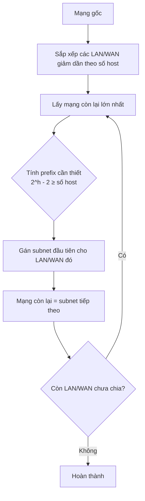

# IPv4 Subnetting 

---

## 1. Khái niệm nền tảng

### 1.1 Cấu trúc địa chỉ IPv4

IPv4 là địa chỉ **32 bit**, chia thành 4 octet (mỗi octet 8 bit), viết dạng thập phân ngăn cách bởi dấu chấm.

```
IP:   192   .  168   .  10    .  1
Bin: 11000000.10101000.00001010.00000001
     |-----octet 1-----|-----octet 2-----|...
```

Mỗi địa chỉ gồm 2 phần:

| Phần | Ý nghĩa |
|------|---------|
| **Network bits** | Xác định mạng (subnet) — bit `1` trong subnet mask |
| **Host bits** | Xác định thiết bị trong mạng — bit `0` trong subnet mask |

---

### 1.2 Subnet mask và ký hiệu CIDR

Subnet mask là chuỗi **các bit 1 liên tiếp** rồi đến **các bit 0 liên tiếp**.

```
/24  → 11111111.11111111.11111111.00000000 → 255.255.255.0
/25  → 11111111.11111111.11111111.10000000 → 255.255.255.128
/26  → 11111111.11111111.11111111.11000000 → 255.255.255.192
/30  → 11111111.11111111.11111111.11111100 → 255.255.255.252
```

CIDR `/x` nghĩa là có **x bit mạng**, còn lại `32 - x` là **bit host**.

---

### 1.3 Ba loại địa chỉ trong một subnet

| Loại | Quy tắc | Ví dụ (`/26`) |
|------|---------|---------------|
| **Network address** | Toàn bộ host bit = `0` | `192.168.10.0` |
| **Broadcast address** | Toàn bộ host bit = `1` | `192.168.10.63` |
| **Host usable** | Từ network+1 đến broadcast-1 | `192.168.10.1 – .62` |

!!! formula "Công thức số host usable"
    ```
    Host usable = 2^(32 - prefix) - 2
    ```
    Trừ 2 vì loại bỏ địa chỉ mạng và broadcast.

---

## 2. Tính Network, Broadcast, Host — 3 cách

---

### Cách 1: Dùng phép AND (bitwise) — Cách "đúng chuẩn kỹ thuật"

> **Nguyên lý:** `Network = IP AND Subnet_Mask`

Phép AND nhị phân:

```
1 AND 1 = 1
1 AND 0 = 0
0 AND 0 = 0
```

**Ví dụ:** Tìm network của `192.168.10.130 /26`

```
IP:          11000000.10101000.00001010.10000010
Subnet /26:  11111111.11111111.11111111.11000000
             ─────────────────────────────────────
AND:         11000000.10101000.00001010.10000000
           = 192.168.10.128   ← Địa chỉ mạng
```

Từ network address, suy ra broadcast bằng cách **đặt toàn bộ host bit = 1**:

```
Network:    11000000.10101000.00001010.10000000
Host bits:                              ^^^^^^  (6 bit cuối)
Broadcast:  11000000.10101000.00001010.10111111
           = 192.168.10.191   ← Broadcast
```

Suy ra:
- First host: `192.168.10.129`
- Last host: `192.168.10.190`

!!! tip "Khi nào dùng cách này?"
    Dùng khi cần hiểu bản chất, debug ACL wildcard mask, hoặc kiểm tra "hai IP có cùng mạng không?" bằng cách AND cả hai với cùng mask rồi so sánh.

---

### Cách 2: Dùng Block Size — Cách "nhanh nhất trên giấy"

> **Nguyên lý:** Block size = `256 - giá_trị_octet_bị_chia_trong_subnet_mask`

Block size chính là "bước nhảy" giữa các subnet liên tiếp. Chỉ cần xác định octet nào đang bị chia (octet có giá trị không phải 0 hoặc 255 trong subnet mask).

**Bảng block size thường gặp:**

| Prefix | Mask octet bị chia | Block size |
|--------|--------------------|------------|
| /25    | 128                | 128        |
| /26    | 192                | 64         |
| /27    | 224                | 32         |
| /28    | 240                | 16         |
| /29    | 248                | 8          |
| /30    | 252                | 4          |

**Ví dụ:** `192.168.10.130 /26`

```
Subnet mask: 255.255.255.192
Octet bị chia: octet 4 = 192
Block size = 256 - 192 = 64
```

Liệt kê các subnet nhảy theo block 64:

```
Subnet 0: 192.168.10.0   → 192.168.10.63
Subnet 1: 192.168.10.64  → 192.168.10.127
Subnet 2: 192.168.10.128 → 192.168.10.191  ← 130 nằm ở đây!
Subnet 3: 192.168.10.192 → 192.168.10.255
```

Kết luận cho `192.168.10.130`:
- Network: `192.168.10.128`
- Broadcast: `192.168.10.191`
- Host range: `.129 – .190`

!!! tip "Quy tắc nhanh"
    IP thuộc subnet nào? Lấy giá trị octet bị chia của IP, chia cho block size, lấy phần nguyên rồi nhân ngược lại.

    ```
    130 ÷ 64 = 2 (phần nguyên)
    2 × 64 = 128  → Network = 192.168.10.128
    128 + 64 - 1 = 191 → Broadcast = 192.168.10.191
    ```

---

### Cách 3: Dùng công thức trực tiếp từ CIDR — Cách "tính số học thuần"

Không cần nhị phân, không cần bảng, chỉ dùng lũy thừa 2.

**Các công thức:**

```
h = 32 - prefix                    (số bit host)
Số địa chỉ trong subnet = 2^h
Host usable = 2^h - 2
Block size = 2^h
```

Với `192.168.10.130 /26`:

```
h = 32 - 26 = 6
Số địa chỉ = 2^6 = 64
Block size = 64

Network = 192.168.10.(floor(130/64) × 64) = 192.168.10.128
Broadcast = 192.168.10.(128 + 64 - 1) = 192.168.10.191
Host usable = 64 - 2 = 62 hosts
```

!!! note "Nhận xét"
    Cách 3 thực chất là Cách 2 nhưng tính block size từ công thức $2^h$ thay vì tra bảng. Hai cách cho cùng kết quả, tuỳ sở thích áp dụng.

---

## 3. Quy trình chia subnet (VLSM)

VLSM (Variable Length Subnet Masking) là kỹ thuật chia mạng với các prefix khác nhau để tối ưu địa chỉ IP. Thứ tự bắt buộc: **chia subnet lớn nhất trước**.



### Công thức tìm prefix

```
Cần ≥ H host usable:
  Tìm h nhỏ nhất sao cho 2^h - 2 ≥ H
  prefix = 32 - h
```

!!! example "Ví dụ nhanh"
    Cần 500 host:

    ```
    2^8 - 2 = 254  → không đủ
    2^9 - 2 = 510  → đủ ✓
    prefix = 32 - 9 = /23
    ```

---

## 4. Kiểm tra "hai IP có cùng subnet không?"

??? details "Cách AND (chính xác tuyệt đối)"
    AND cả hai IP với cùng subnet mask. Nếu kết quả giống nhau → cùng mạng.

    ```
    IP1: 192.168.10.50  AND /26 = 192.168.10.0
    IP2: 192.168.10.70  AND /26 = 192.168.10.64
    → Khác mạng!

    IP1: 192.168.10.50  AND /26 = 192.168.10.0
    IP2: 192.168.10.20  AND /26 = 192.168.10.0
    → Cùng mạng ✓
    ```

??? details "Cách Block Size (nhanh hơn)"
    Tìm network của từng IP bằng block size, so sánh.

    ```
    Block size /26 = 64
    IP1 = .50  → floor(50/64) × 64 = 0   → subnet 192.168.10.0
    IP2 = .70  → floor(70/64) × 64 = 64  → subnet 192.168.10.64
    → Khác mạng!
    ```

---

## 5. Bảng tra nhanh

| Prefix | Subnet Mask | Block Size | Host Usable | Số subnet từ /24 |
|--------|-------------|------------|-------------|------------------|
| /24    | 255.255.255.0   | 256 | 254 | 1  |
| /25    | 255.255.255.128 | 128 | 126 | 2  |
| /26    | 255.255.255.192 | 64  | 62  | 4  |
| /27    | 255.255.255.224 | 32  | 30  | 8  |
| /28    | 255.255.255.240 | 16  | 14  | 16 |
| /29    | 255.255.255.248 | 8   | 6   | 32 |
| /30    | 255.255.255.252 | 4   | 2   | 64 |

!!! warning "Đừng nhầm lẫn"
    - **Subnet mask** và **wildcard mask** (dùng trong ACL) là **nghịch đảo** nhau.
    - `/30` có 4 địa chỉ nhưng chỉ **2 host usable** — thường dùng cho liên kết point-to-point giữa 2 router.
    - WAN link luôn dùng `/30`, không dùng `/29` hay `/28` vì lãng phí.

---

## 6. Ký hiệu trong bảng định tuyến (`show ip route`)

| Ký hiệu | Tên | Ý nghĩa |
|---------|-----|---------|
| `C` | Connected | Mạng kết nối trực tiếp qua interface đang UP |
| `L` | Local | Địa chỉ IP cụ thể của interface đó (`/32`) |
| `S` | Static | Tuyến tĩnh cấu hình tay |
| `R` | RIP | Học từ giao thức RIP |
| `O` | OSPF | Học từ giao thức OSPF |
| `D` | EIGRP | Học từ EIGRP |

Số `[120/1]` sau route RIP:
- `120` = Administrative Distance (độ ưu tiên của giao thức)
- `1` = Metric (số hop)
