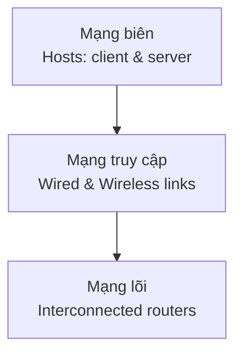
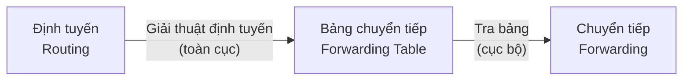
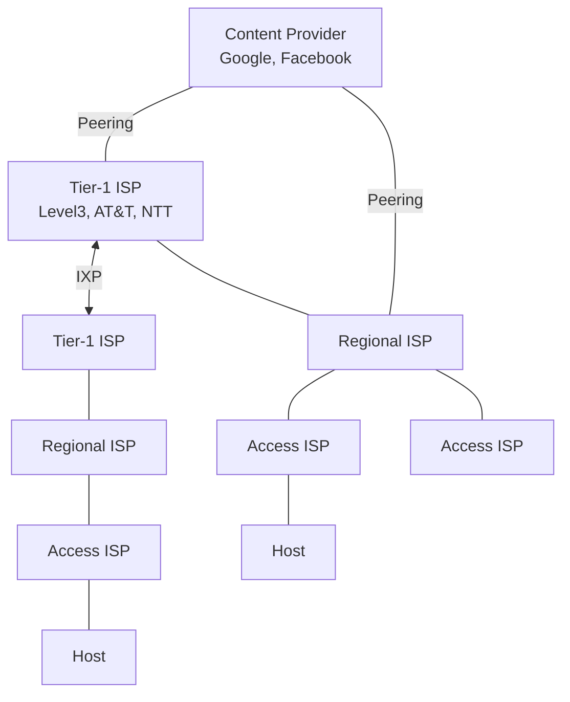
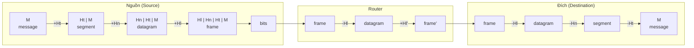

# Chương 1: Nhập Môn Mạng Máy Tính

---

## 1.1 Internet là gì? Giao thức là gì?

### Internet — Góc nhìn thực tế

Internet là **"mạng của các mạng"** (network of networks), bao gồm hàng tỷ thiết bị tính toán được kết nối với nhau:

- **Hosts (hệ thống đầu cuối):** máy tính, smartphone, server, IoT device,... chạy các ứng dụng mạng ở "rìa" của Internet.
- **Bộ định tuyến (routers) và bộ chuyển mạch (switches):** chuyển tiếp các gói dữ liệu (packet) qua mạng.
- **Liên kết truyền thông (communication links):** cáp quang, cáp đồng, vô tuyến, vệ tinh — mỗi loại có băng thông khác nhau.
- **Mạng (network):** tập hợp các thiết bị, bộ định tuyến, liên kết được quản lý bởi một tổ chức.

Các thành phần tạo nên Internet:

```
mobile network ──┐
home network ────┤
enterprise net ──┼──► local/regional ISP ──► national/global ISP
datacenter net ──┤
content provider─┘
```

Internet hoạt động dựa trên **giao thức (protocol)** được chuẩn hóa bởi:

- **RFC** (Request for Comments) — tài liệu chuẩn hóa kỹ thuật.
- **IETF** (Internet Engineering Task Force) — tổ chức ban hành RFC.

Ví dụ giao thức: HTTP, TCP, IP, WiFi, 4G/5G, Ethernet, Skype, Streaming video.

---

### Internet — Góc nhìn dịch vụ

Internet là **cơ sở hạ tầng cung cấp dịch vụ** cho các ứng dụng phân tán:

- Web, video streaming, hội nghị từ xa, email, game online, thương mại điện tử, mạng xã hội, IoT,...
- Cung cấp **API lập trình** (socket API) cho ứng dụng — tương tự như dịch vụ bưu chính cung cấp "hooks" để gửi/nhận gói hàng.

---

### Giao thức là gì?

!!! info "Định nghĩa"
    **Giao thức (Protocol)** định nghĩa **cấu trúc**, **thứ tự** của các thông điệp khi gửi và nhận giữa các thành phần trong mạng, đồng thời quy định **các hành động** được thực hiện khi truyền hoặc nhận thông điệp/sự kiện.

**Analogy với con người:**

```
Con người:         Mạng máy tính:
─────────────────────────────────────────
"Chào"        ←→  TCP connection request
"Chào"        ←→  TCP connection response
"Mấy giờ?"   ←→  GET http://...
"2:00"        ←→  <file> (response)
```

Giao thức mạng quy định **mọi** hoạt động truyền thông trên Internet — từ lúc thiết lập kết nối đến lúc truyền dữ liệu và đóng kết nối.

---

## 1.2 Mạng biên: Hosts, Mạng truy cập, Đường truyền vật lý

### Cấu trúc Internet — 3 lớp chính



---

### Mạng truy cập

Câu hỏi cốt lõi: **Làm sao kết nối hệ thống đầu cuối vào bộ định tuyến biên (edge router)?**

#### 1. Mạng truy cập bằng cáp (Cable Access Network)

- Sử dụng **HFC (Hybrid Fiber Coax)** — kết hợp cáp đồng trục và cáp quang.
- Dữ liệu và truyền hình được truyền ở **các tần số khác nhau** trên cùng một cáp (FDM).
- **Bất đối xứng:** tải xuống 40 Mb/s–1.2 Gb/s, tải lên 30–100 Mb/s.
- Nhiều hộ gia đình **chia sẻ** cùng một mạng truy cập đến cable headend (CMTS).

#### 2. DSL (Digital Subscriber Line)

- Sử dụng **đường dây điện thoại có sẵn** để kết nối đến DSLAM tại văn phòng trung tâm.
- Tín hiệu thoại và dữ liệu được tách biệt bằng **splitter** (dùng tần số khác nhau).
- **Tốc độ:** tải xuống 24–52 Mb/s, tải lên 3.5–16 Mb/s.
- **Đường dây riêng** (khác cable — không dùng chung).

#### 3. Mạng gia đình (Home Network)

```
Internet ←── Cable/DSL modem ←── Router/Firewall/NAT
                                      ├── Wired Ethernet (1 Gbps)
                                      └── WiFi AP (54–450 Mbps)
```

Thường được tích hợp trong một thiết bị duy nhất (modem + router + WiFi).

#### 4. Mạng truy cập không dây

| Loại | Chuẩn | Tốc độ | Phạm vi |
|---|---|---|---|
| WLAN (WiFi) | 802.11b/g/n | 11 / 54 / 450 Mb/s | ~30m |
| Cellular 4G/5G | LTE/NR | 10+ Mb/s | ~10 km |
| Bluetooth | BT | Thấp | ~10m |
| Vệ tinh (Starlink) | — | ≤100 Mb/s UL | Toàn cầu |

Tất cả đều kết nối host đến **base station / access point**, rồi tiếp đến bộ định tuyến.

#### 5. Mạng doanh nghiệp (Enterprise Network)

- Kết hợp **Ethernet** (có dây: 100 Mb/s, 1 Gb/s, 10 Gb/s) và **WiFi**.
- **Ethernet switch** kết nối các máy tính nội bộ.
- **Router** kết nối mạng nội bộ ra Internet qua ISP.

#### 6. Mạng trung tâm dữ liệu (Datacenter Network)

- Liên kết băng thông cực cao: **10–100 Gb/s**.
- Kết nối hàng trăm đến hàng nghìn server với nhau và với Internet.

---

### Host gửi gói dữ liệu như thế nào?

1. Nhận thông điệp từ tầng ứng dụng.
2. Chia nhỏ thành các **gói tin (packet)** có độ dài **L bits**.
3. Truyền vào mạng với tốc độ **R bps** (băng thông đường truyền).

$$d_{trans} = \frac{L}{R} \text{ (giây)}$$

**Ví dụ:** L = 10 Kbits, R = 100 Mbps → d_trans = 0.1 ms

---

### Đường truyền vật lý

#### Có hướng (Guided media)

| Loại | Đặc điểm |
|---|---|
| **Cáp xoắn cặp (Twisted Pair)** | Cat5: 100 Mbps–1 Gbps; Cat6: 10 Gbps |
| **Cáp đồng trục (Coaxial)** | Hai chiều, băng thông rộng, hàng trăm Mb/s/kênh |
| **Cáp quang (Fiber)** | Hàng chục–hàng trăm Gb/s, tỉ lệ lỗi thấp, không bị nhiễu điện từ |

#### Vô hướng (Unguided media) — Vô tuyến

- Truyền broadcast, **half-duplex**.
- Bị ảnh hưởng bởi: phản xạ, vật cản, nhiễu.
- Các loại: WiFi, 4G/5G, Bluetooth, microwave, vệ tinh.

---

## 1.3 Mạng lõi: Chuyển mạch gói, Chuyển mạch kênh, Cấu trúc Internet

### Mạng lõi — Tổng quan

Mạng lõi là **mạng lưới các bộ định tuyến** kết nối với nhau. Có hai chức năng chính:



- **Định tuyến (Routing):** Hành động **toàn cục** — tính toán đường đi từ nguồn đến đích bằng giải thuật định tuyến (ví dụ: Dijkstra, Bellman-Ford). Kết quả là bảng chuyển tiếp.
- **Chuyển tiếp (Forwarding):** Hành động **cục bộ** — tra bảng chuyển tiếp để chuyển gói tin từ cổng đầu vào sang cổng đầu ra phù hợp trên từng router.

**Ví dụ bảng chuyển tiếp:**

| Địa chỉ đích (header) | Liên kết đầu ra |
|---|---|
| 0100 | 3 |
| 0101 | 2 |
| 0111 | 2 |
| 1001 | 1 |

**Analogy:** Định tuyến = lập kế hoạch toàn bộ hành trình trên bản đồ. Chuyển tiếp = tại mỗi ngã tư, rẽ theo biển chỉ đường.

---

### Chuyển mạch gói (Packet Switching)

#### Lưu và chuyển (Store-and-Forward)

!!! warning "Nguyên tắc quan trọng"
    Toàn bộ gói tin **phải được nhận đầy đủ** tại bộ định tuyến **trước khi** bắt đầu truyền sang liên kết tiếp theo.

```
Source ──[R bps]──► Router ──[R bps]──► Destination
         Gói L bit          Gói L bit
```

**Độ trễ truyền 1 chặng (one-hop):**

$$d_{trans} = \frac{L}{R}$$

Ví dụ: L = 10 Kbits, R = 100 Mbps → 0.1 ms/chặng.

#### Hàng đợi và mất gói (Queueing & Packet Loss)

Khi **tốc độ gói đến > tốc độ truyền** của liên kết đầu ra:

- Gói tin xếp hàng đợi trong **bộ đệm (buffer)** của router.
- Nếu bộ đệm **đầy** → gói tin bị **hủy (drop/lost)**.

```
A ──100 Mb/s──┐
B ──100 Mb/s──┼──► [Buffer] ──1.5 Mb/s──► D
C ──100 Mb/s──┘                            E
```

Khi A, B, C cùng gửi → bottleneck tại liên kết 1.5 Mb/s → hàng đợi tích tụ.

---

### Chuyển mạch kênh (Circuit Switching)

!!! info "So sánh với Packet Switching"
    Circuit switching **dành riêng** tài nguyên cho toàn bộ thời gian kết nối. Packet switching **chia sẻ** tài nguyên theo nhu cầu.

- Tài nguyên (băng thông) được **phân bổ và dành riêng** cho "cuộc gọi" từ đầu đến cuối.
- **Hiệu suất được đảm bảo** (guaranteed QoS), nhưng lãng phí khi kênh rảnh.
- Phổ biến trong **mạng điện thoại truyền thống**.

#### Hai cơ chế ghép kênh trong Circuit Switching:

**FDM (Frequency Division Multiplexing):**
- Phổ tần được chia thành các **dải tần số** riêng biệt.
- Mỗi cuộc gọi chiếm một dải tần — truyền liên tục nhưng với băng thông giới hạn.

**TDM (Time Division Multiplexing):**
- Thời gian được chia thành các **khe thời gian (slot)** định kỳ.
- Mỗi cuộc gọi được cấp các khe định kỳ — truyền ở tốc độ tối đa trong khe của mình.

---

### So sánh: Packet Switching vs Circuit Switching

**Ví dụ tính toán:**

- Liên kết: 1 Gb/s
- Mỗi user dùng 100 Mb/s khi active, active 10% thời gian.

| Cơ chế | Số user tối đa |
|---|---|
| Circuit Switching | **10** (1 Gbps / 100 Mbps = 10 kênh cố định) |
| Packet Switching | **35** (xác suất >10 user active cùng lúc < 0.0004) |

??? info "Packet switching hỗ trợ được 35 user như thế nào?"
    Vì mỗi user chỉ active 10% thời gian, nên trung bình chỉ có 3.5 user active tại một thời điểm. Dùng phân phối nhị thức, xác suất để hơn 10 user active đồng thời khi có 35 user ≈ 0.0004 — rất nhỏ. Đây chính là lợi thế của **statistical multiplexing**.

**Ưu/nhược điểm Packet Switching:**

| | Ưu điểm | Nhược điểm |
|---|---|---|
| Packet Switching | Hiệu quả tài nguyên cao, không cần setup, tốt cho bursty data | Có thể tắc nghẽn, không đảm bảo QoS |
| Circuit Switching | Đảm bảo hiệu suất, độ trễ ổn định | Lãng phí khi kênh rảnh, cần setup trước |

---

### Cấu trúc Internet: "Mạng của các mạng"

??? question "Vấn đề: Kết nối hàng triệu ISP với nhau như thế nào?"
    **Phương án 1 — Kết nối trực tiếp mọi cặp ISP:** O(N²) kết nối → không thể mở rộng.

    **Phương án 2 — Một ISP toàn cầu trung tâm:** Không thực tế vì độc quyền, có đối thủ cạnh tranh.

    **Giải pháp thực tế — Phân cấp:**



- **Tier-1 ISP:** Phủ sóng quốc gia/quốc tế (Level 3, Sprint, AT&T, NTT). Kết nối với nhau qua **IXP** và **peering link**.
- **IXP (Internet Exchange Point):** Điểm kết nối giữa các ISP — trao đổi lưu lượng trực tiếp mà không qua Tier-1.
- **Regional ISP:** Kết nối các access ISP với Tier-1.
- **Content Provider Network (Google, Facebook, Akamai):** Xây dựng mạng riêng để đưa nội dung đến gần user, bypass Tier-1 và regional ISP khi có thể.

---

## 1.4 Hiệu suất: Mất mát, Chậm trễ, Thông lượng

### Bốn nguồn gây trễ gói tin

$$d_{nodal} = d_{proc} + d_{queue} + d_{trans} + d_{prop}$$

| Thành phần | Ký hiệu | Nguyên nhân | Công thức |
|---|---|---|---|
| Xử lý tại nút | $d_{proc}$ | Kiểm tra lỗi bit, tra bảng chuyển tiếp | Thường < vài ms |
| Hàng đợi | $d_{queue}$ | Chờ trong buffer trước khi truyền | Phụ thuộc tải mạng |
| Truyền | $d_{trans}$ | Đẩy toàn bộ gói lên liên kết | $L/R$ |
| Lan truyền | $d_{prop}$ | Tín hiệu di chuyển trên vật lý | $d/s$ (s ≈ 2×10⁸ m/s) |

!!! tip "Phân biệt d_trans và d_prop"
    - **d_trans** phụ thuộc vào **kích thước gói** và **băng thông liên kết** — thời gian để đẩy hết các bit lên đường truyền.
    - **d_prop** phụ thuộc vào **khoảng cách vật lý** — thời gian bit đầu tiên đi từ A đến B.
    
    **Analogy trạm thu phí:** Đoàn 10 xe (= 10 bit). Trạm thu phí phục vụ 1 xe/phút (d_trans = 10 phút cho cả đoàn). Xe chạy 1000 km/h (d_prop giữa hai trạm = 6 phút). Xe đầu tiên đến trạm 2 sau 6 phút, trong khi trạm 1 vẫn đang phục vụ 3 xe cuối → d_trans và d_prop hoàn toàn độc lập.

---

### Trễ hàng đợi & Traffic Intensity

$$\text{Traffic Intensity} = \frac{La}{R}$$

- **a** = tốc độ gói đến (gói/giây)
- **L** = kích thước gói (bit)
- **R** = băng thông (bps)

| La/R | Tình trạng |
|---|---|
| ≈ 0 | Trễ hàng đợi nhỏ |
| → 1 | Trễ hàng đợi tăng nhanh |
| > 1 | Yêu cầu vượt khả năng → trễ **vô hạn** (mất gói) |

!!! danger "Traffic Intensity > 1"
    Khi La/R > 1, hàng đợi sẽ tăng vô hạn — đây là trạng thái tắc nghẽn (congestion). Thiết kế mạng phải đảm bảo La/R < 1.

---

### Mất gói (Packet Loss)

- Buffer của router có **kích thước hữu hạn**.
- Khi buffer đầy, gói đến sẽ bị **drop**.
- Gói bị mất có thể được **truyền lại** bởi nút trước hoặc nút nguồn (nếu giao thức hỗ trợ — như TCP), hoặc **không truyền lại** (UDP).

---

### Đo trễ thực tế: Traceroute

**Traceroute** gửi 3 probe đến mỗi router trên đường đi, đo **RTT (Round-Trip Time)**:

```
traceroute: gaia.cs.umass.edu → www.eurecom.fr

1  cs-gw (128.119.240.254)          1ms  1ms  2ms
2  border1-rt-...umass.edu          1ms  1ms  2ms
...
8  62.40.103.253                    104ms 109ms 106ms  ← trans-oceanic link
...
19 fantasia.eurecom.fr              132ms 128ms 136ms
```

Bước nhảy lớn ở hop 8 = liên kết xuyên đại dương (propagation delay lớn).

`* * *` = router không phản hồi (firewall chặn hoặc mất gói).

---

### Thông lượng (Throughput)

**Thông lượng** = số bit truyền thành công từ nguồn đến đích **trong một đơn vị thời gian**.

- **Tức thời (instantaneous):** tại một thời điểm cụ thể.
- **Trung bình (average):** trên toàn bộ thời gian truyền file F bits.

**Bottleneck link** = liên kết có băng thông nhỏ nhất trên đường đi — quyết định thông lượng tổng thể.

$$\text{Throughput} = \min(R_s, R_c)$$

**Trong mạng thực tế với 10 luồng chia sẻ:**

$$\text{Throughput mỗi luồng} = \min(R_c, R_s, R/10)$$

Trong thực tế, bottleneck thường là $R_c$ hoặc $R_s$ (liên kết đầu cuối), không phải backbone.

---

## 1.5 Các lớp giao thức và mô hình dịch vụ

### Tại sao cần phân tầng?

Mạng máy tính cực kỳ phức tạp (hosts, routers, links, apps, protocols, hardware, software). Phân tầng giải quyết điều này bằng cách:

- **Cấu trúc rõ ràng** → dễ xác định và liên kết các thành phần.
- **Module hóa** → thay đổi một tầng không ảnh hưởng tầng khác (miễn là interface giữ nguyên).

**Analogy hàng không:** Mỗi dịch vụ (bán vé, hành lý, an ninh, đường băng, bay) hoạt động độc lập theo tầng — thay đổi quy trình an ninh không ảnh hưởng đến dịch vụ bán vé.

---

### Chồng giao thức Internet (Internet Protocol Stack)

```
┌─────────────────────────────────────┐
│         Tầng Ứng dụng               │  HTTP, SMTP, DNS, FTP
├─────────────────────────────────────┤
│         Tầng Vận chuyển             │  TCP, UDP
├─────────────────────────────────────┤
│         Tầng Mạng                   │  IP, OSPF, BGP
├─────────────────────────────────────┤
│         Tầng Liên kết               │  Ethernet, WiFi, PPP
├─────────────────────────────────────┤
│         Tầng Vật lý                 │  Bits trên đường truyền
└─────────────────────────────────────┘
```

| Tầng | Đơn vị dữ liệu (PDU) | Chức năng |
|---|---|---|
| Ứng dụng | Message (M) | Hỗ trợ ứng dụng mạng |
| Vận chuyển | Segment | Truyền dữ liệu giữa các tiến trình |
| Mạng | Datagram | Định tuyến từ nguồn đến đích |
| Liên kết | Frame | Truyền giữa các node kề nhau |
| Vật lý | Bit | Truyền bit trên đường vật lý |

---

### Quá trình đóng gói (Encapsulation)



- **Tầng ứng dụng** thêm header ứng dụng → **message**
- **Tầng vận chuyển** thêm Ht → **segment** (chứa port số, sequence number,...)
- **Tầng mạng** thêm Hn → **datagram** (chứa địa chỉ IP nguồn/đích)
- **Tầng liên kết** thêm Hl → **frame** (chứa địa chỉ MAC)
- Tại router: bóc frame → đọc datagram → tra bảng định tuyến → đóng gói lại frame mới.

---

## Câu hỏi & Đáp án trong bài

??? question "Có bao nhiêu user được phục vụ khi dùng circuit switching vs packet switching với liên kết 1Gbps, mỗi user cần 100Mbps, active 10% thời gian?"
    - **Circuit switching:** 1000/100 = **10 users** (cứng nhắc, mỗi user chiếm 1 kênh cố định).
    - **Packet switching:** **35 users** — vì xác suất >10 user cùng active < 0.0004 (dùng phân phối nhị thức với p=0.1, n=35, P(X>10) < 0.0004).

??? question "Làm thế nào tính xác suất 0.0004?"
    Dùng phân phối nhị thức: X ~ B(35, 0.1). Tính P(X > 10) = 1 − P(X ≤ 10). Tra bảng hoặc tính trực tiếp: ≈ 0.0004.

??? question "Tại sao độ trễ traceroute có thể giảm ở các hop sau?"
    Do traceroute đo RTT, không phải one-way delay. Router gần đích địa lý hơn có thể có đường phản hồi ngắn hơn, hoặc router trung gian có processing delay cao hơn. Đây là hiện tượng bình thường trong mạng thực tế.

??? question "Packet switching giống cơ chế nào của con người hơn — circuit hay packet?"
    **Packet switching** giống con người hơn: chúng ta không "giữ kênh" khi im lặng trong cuộc trò chuyện. Tài nguyên (sự chú ý, thời gian) được phân bổ theo nhu cầu thực tế.

??? question "Làm sao cung cấp hành vi circuit switching trên packet switching?"
    Rất phức tạp — cần các cơ chế **QoS (Quality of Service)**: traffic shaping, priority queuing, RSVP (Resource Reservation Protocol), MPLS,... để đảm bảo băng thông và độ trễ cho từng luồng.

---

## 50+ Câu Trắc Nghiệm

**Câu 1.** Internet được định nghĩa chính xác nhất là gì?

- A. Một mạng LAN toàn cầu
- B. Một mạng duy nhất do một tổ chức quản lý
- C. "Mạng của các mạng" — tập hợp các ISP kết nối với nhau
- D. Hệ thống cáp quang liên lục địa

??? info "Đáp án & Giải thích"
    **Đáp án: C**
    Internet = "network of networks" — không có một tổ chức nào kiểm soát toàn bộ, mà là sự kết nối của hàng triệu mạng nhỏ hơn (ISP, doanh nghiệp, gia đình,...).

---

**Câu 2.** RFC là viết tắt của gì và do tổ chức nào ban hành?

- A. Request for Computing, do IEEE
- B. Request for Comments, do IETF
- C. Rules for Communication, do ISO
- D. Resource for Configuration, do W3C

??? info "Đáp án & Giải thích"
    **Đáp án: B**
    RFC (Request for Comments) là tài liệu chuẩn hóa giao thức Internet, do **IETF** (Internet Engineering Task Force) ban hành.

---

**Câu 3.** Giao thức mạng định nghĩa những gì?

- A. Chỉ định dạng thông điệp
- B. Cấu trúc, thứ tự thông điệp và hành động khi nhận/gửi thông điệp
- C. Chỉ tốc độ truyền dữ liệu
- D. Địa chỉ vật lý của thiết bị

??? info "Đáp án & Giải thích"
    **Đáp án: B**
    Giao thức định nghĩa đầy đủ 3 yếu tố: (1) **cấu trúc** thông điệp, (2) **thứ tự** gửi/nhận, (3) **hành động** khi có thông điệp/sự kiện.

---

**Câu 4.** HFC trong mạng truy cập cáp là viết tắt của gì?

- A. High Frequency Cable
- B. Hybrid Fiber Coax
- C. Home Fiber Connection
- D. High-speed Fiber Cable

??? info "Đáp án & Giải thích"
    **Đáp án: B**
    HFC = Hybrid Fiber Coax — kết hợp cáp quang từ headend đến khu vực, và cáp đồng trục từ khu vực đến từng nhà.

---

**Câu 5.** DSL sử dụng hạ tầng nào có sẵn để truyền dữ liệu?

- A. Cáp đồng trục truyền hình
- B. Đường dây điện thoại
- C. Cáp điện lực
- D. Mạng không dây

??? info "Đáp án & Giải thích"
    **Đáp án: B**
    DSL (Digital Subscriber Line) tận dụng **đường dây điện thoại** (twisted pair) sẵn có, dùng DSLAM tại văn phòng trung tâm để tách tín hiệu thoại và dữ liệu.

---

**Câu 6.** Tốc độ tải xuống của DSL thông thường là bao nhiêu?

- A. 1–5 Mb/s
- B. 24–52 Mb/s
- C. 100–500 Mb/s
- D. 1–10 Gb/s

??? info "Đáp án & Giải thích"
    **Đáp án: B**
    DSL có tốc độ tải xuống 24–52 Mb/s, tải lên 3.5–16 Mb/s — bất đối xứng.

---

**Câu 7.** Điểm khác biệt chính giữa DSL và mạng cáp HFC về chia sẻ tài nguyên là gì?

- A. DSL nhanh hơn HFC
- B. DSL dùng đường dây riêng đến DSLAM; HFC chia sẻ cáp giữa các hộ gia đình
- C. HFC dùng cáp quang còn DSL không dùng
- D. Không có sự khác biệt

??? info "Đáp án & Giải thích"
    **Đáp án: B**
    DSL mỗi hộ có **đường dây riêng** đến DSLAM → không chia sẻ. HFC nhiều hộ **chia sẻ** cùng một đoạn cáp đến cable headend → băng thông thực tế giảm khi nhiều người dùng.

---

**Câu 8.** Chuẩn WiFi 802.11n có tốc độ lý thuyết tối đa là bao nhiêu?

- A. 11 Mb/s
- B. 54 Mb/s
- C. 450 Mb/s
- D. 1 Gb/s

??? info "Đáp án & Giải thích"
    **Đáp án: C**
    802.11b: 11 Mb/s, 802.11g: 54 Mb/s, **802.11n: 450 Mb/s**.

---

**Câu 9.** Cáp xoắn cặp Category 6 (Cat6) hỗ trợ tốc độ Ethernet tối đa là bao nhiêu?

- A. 100 Mbps
- B. 1 Gbps
- C. 10 Gbps
- D. 100 Gbps

??? info "Đáp án & Giải thích"
    **Đáp án: C**
    Cat5: 100 Mbps–1 Gbps. **Cat6: 10 Gbps Ethernet**.

---

**Câu 10.** Ưu điểm của cáp quang so với cáp đồng là gì? (Chọn đúng nhất)

- A. Rẻ hơn và dễ lắp đặt hơn
- B. Tốc độ cao, tỉ lệ lỗi thấp, không bị nhiễu điện từ, repeater đặt xa nhau
- C. Có thể uốn cong tùy ý
- D. Không cần nguồn điện

??? info "Đáp án & Giải thích"
    **Đáp án: B**
    Cáp quang truyền **xung ánh sáng** — tốc độ hàng chục–hàng trăm Gb/s, tỉ lệ lỗi cực thấp, miễn nhiễm điện từ, khoảng cách giữa repeater rất xa.

---

**Câu 11.** Tín hiệu vô tuyến (wireless) có đặc điểm nào sau đây?

- A. Truyền một chiều (simplex) và không bị nhiễu
- B. Truyền broadcast, half-duplex, bị ảnh hưởng bởi phản xạ và nhiễu
- C. Tốc độ luôn cao hơn cáp quang
- D. Không bị ảnh hưởng bởi vật cản

??? info "Đáp án & Giải thích"
    **Đáp án: B**
    Wireless: broadcast (tất cả đều nghe), half-duplex (không gửi và nhận đồng thời trên cùng tần số), bị ảnh hưởng bởi phản xạ, vật cản, nhiễu.

---

**Câu 12.** Trong chuyển mạch gói, "lưu và chuyển" (store-and-forward) có nghĩa là gì?

- A. Gói tin được truyền ngay khi bit đầu tiên đến
- B. Toàn bộ gói tin phải đến router trước khi truyền sang liên kết tiếp theo
- C. Gói tin được lưu vào đĩa cứng trước khi chuyển
- D. Gói tin chỉ được chuyển khi mạng rảnh

??? info "Đáp án & Giải thích"
    **Đáp án: B**
    Store-and-forward: router phải nhận **toàn bộ** gói tin vào buffer, kiểm tra lỗi, tra bảng định tuyến, rồi mới bắt đầu truyền sang liên kết tiếp theo.

---

**Câu 13.** Gói tin có L = 10 Kbits được truyền trên liên kết R = 100 Mbps. Thời gian truyền là bao nhiêu?

- A. 1 ms
- B. 0.1 ms
- C. 10 ms
- D. 0.01 ms

??? info "Đáp án & Giải thích"
    **Đáp án: B**
    $d_{trans} = L/R = 10000 / (100 \times 10^6) = 0.0001s = 0.1ms$

---

**Câu 14.** Khi nào xảy ra hiện tượng mất gói (packet loss) trong router?

- A. Khi gói tin quá lớn
- B. Khi bộ đệm (buffer) của router bị đầy
- C. Khi tốc độ liên kết quá cao
- D. Khi số lượng router trên đường đi quá nhiều

??? info "Đáp án & Giải thích"
    **Đáp án: B**
    Mất gói xảy ra khi bộ đệm đầy — gói mới đến không có chỗ → bị drop. Đây là hệ quả của tắc nghẽn (La/R > 1).

---

**Câu 15.** Sự khác biệt cơ bản giữa "định tuyến" (routing) và "chuyển tiếp" (forwarding) là gì?

- A. Không có sự khác biệt
- B. Routing là hành động toàn cục (tính đường đi), Forwarding là hành động cục bộ (tra bảng chuyển gói)
- C. Forwarding là hành động toàn cục, Routing là cục bộ
- D. Routing chỉ xảy ra ở edge router, Forwarding ở core router

??? info "Đáp án & Giải thích"
    **Đáp án: B**
    **Routing:** chạy giải thuật để xây dựng bảng chuyển tiếp — nhìn toàn mạng. **Forwarding:** tra bảng chuyển tiếp để chuyển gói từ cổng vào đến cổng ra — hành động tại chỗ, nhanh.

---

**Câu 16.** Trong circuit switching, FDM và TDM khác nhau như thế nào?

- A. FDM phân chia theo tần số, TDM phân chia theo thời gian
- B. FDM phân chia theo thời gian, TDM phân chia theo tần số
- C. FDM dùng cho cáp, TDM dùng cho wireless
- D. Không có sự khác biệt về nguyên lý

??? info "Đáp án & Giải thích"
    **Đáp án: A**
    **FDM:** mỗi kênh chiếm một dải tần số riêng, truyền liên tục. **TDM:** toàn bộ băng thông được chia theo khe thời gian, mỗi kênh được cấp các khe định kỳ.

---

**Câu 17.** Với liên kết 1 Gbps và mỗi user cần 100 Mbps, circuit switching hỗ trợ tối đa bao nhiêu user?

- A. 100 user
- B. 35 user
- C. 10 user
- D. 1000 user

??? info "Đáp án & Giải thích"
    **Đáp án: C**
    Circuit switching cấp **cố định** 100 Mbps/user → 1000/100 = **10 user** tối đa.

---

**Câu 18.** Packet switching hiệu quả hơn circuit switching khi nào?

- A. Khi traffic đều đặn và liên tục
- B. Khi dữ liệu bursty (lúc có lúc không, không đều)
- C. Khi cần đảm bảo QoS nghiêm ngặt
- D. Khi số lượng user ít

??? info "Đáp án & Giải thích"
    **Đáp án: B**
    Với **bursty data** (user chỉ active 10% thời gian như ví dụ trên), packet switching tận dụng được tài nguyên nhàn rỗi thay vì giữ kênh cố định không dùng đến.

---

**Câu 19.** IXP trong cấu trúc Internet là gì?

- A. Internet Experience Protocol
- B. Internet Exchange Point — nơi các ISP kết nối và trao đổi lưu lượng trực tiếp
- C. Internal Exchange Provider
- D. ISP Extension Point

??? info "Đáp án & Giải thích"
    **Đáp án: B**
    **IXP (Internet Exchange Point):** điểm kết nối vật lý cho phép các ISP trao đổi lưu lượng trực tiếp — giảm chi phí, giảm độ trễ so với phải đi qua Tier-1.

---

**Câu 20.** Tại sao không thể kết nối tất cả ISP truy cập trực tiếp với nhau?

- A. Vì băng thông không đủ
- B. Vì cần O(N²) kết nối — không thể mở rộng khi N lớn
- C. Vì giao thức không tương thích
- D. Vì luật pháp không cho phép

??? info "Đáp án & Giải thích"
    **Đáp án: B**
    Với N ISP, cần N(N-1)/2 ≈ O(N²) kết nối. Với hàng triệu ISP → không thể triển khai về mặt kinh tế và kỹ thuật.

---

**Câu 21.** Công thức tổng trễ tại một nút (nodal delay) là gì?

- A. $d = d_{trans} + d_{prop}$
- B. $d = d_{proc} + d_{queue} + d_{trans} + d_{prop}$
- C. $d = d_{proc} + d_{trans}$
- D. $d = d_{queue} + d_{prop}$

??? info "Đáp án & Giải thích"
    **Đáp án: B**
    $d_{nodal} = d_{proc} + d_{queue} + d_{trans} + d_{prop}$ — bốn thành phần: xử lý, hàng đợi, truyền, lan truyền.

---

**Câu 22.** Trễ lan truyền (propagation delay) phụ thuộc vào yếu tố nào?

- A. Kích thước gói tin và băng thông
- B. Độ dài liên kết vật lý và tốc độ lan truyền tín hiệu
- C. Số lượng gói trong hàng đợi
- D. Thời gian xử lý của router

??? info "Đáp án & Giải thích"
    **Đáp án: B**
    $d_{prop} = d/s$ — d là khoảng cách vật lý, s ≈ 2×10⁸ m/s. Không liên quan đến kích thước gói.

---

**Câu 23.** Traffic Intensity (La/R) = 0.9 cho thấy điều gì?

- A. Mạng hoàn toàn rảnh
- B. Độ trễ hàng đợi tăng đáng kể, có nguy cơ tắc nghẽn
- C. Mạng đã tắc nghẽn hoàn toàn
- D. Không có hiện tượng hàng đợi

??? info "Đáp án & Giải thích"
    **Đáp án: B**
    La/R → 1 thì trễ hàng đợi **tăng rất nhanh** (phi tuyến). La/R = 0.9 đã ở ngưỡng nguy hiểm — hàng đợi có thể rất dài.

---

**Câu 24.** Công cụ traceroute hoạt động như thế nào?

- A. Gửi một gói lớn và đo thời gian nhận được phản hồi
- B. Gửi 3 probe đến mỗi router trên đường đi, đo RTT từ nguồn đến từng router
- C. Ping đến đích và đếm số hop
- D. Chụp toàn bộ traffic trên mạng

??? info "Đáp án & Giải thích"
    **Đáp án: B**
    Traceroute dùng trường **TTL (Time-to-Live)**: gửi gói với TTL=1 (router 1 drop và báo lại), TTL=2 (router 2 báo), v.v. Gửi **3 probe** mỗi hop để có 3 giá trị RTT.

---

**Câu 25.** Thông lượng (throughput) trung bình khi Rs < Rc là bao nhiêu?

- A. Rc
- B. Rs
- C. (Rs + Rc) / 2
- D. Rs × Rc

??? info "Đáp án & Giải thích"
    **Đáp án: B**
    Khi Rs < Rc, liên kết phía server (Rs) là **bottleneck** → throughput = **Rs** (tốc độ nhỏ hơn). Min(Rs, Rc) = Rs.

---

**Câu 26.** Với 10 luồng TCP chia sẻ đường trục tốc độ R, thông lượng mỗi luồng là bao nhiêu (giả sử Rc, Rs >> R/10)?

- A. R
- B. R/5
- C. R/10
- D. min(Rc, Rs)

??? info "Đáp án & Giải thích"
    **Đáp án: C**
    Khi backbone R là bottleneck: throughput mỗi luồng = **R/10** (chia đều công bằng).

---

**Câu 27.** Tại sao mạng được thiết kế theo mô hình phân tầng?

- A. Để tăng tốc độ truyền
- B. Để cấu trúc rõ ràng, dễ thiết kế, dễ bảo trì, module hóa
- C. Để giảm chi phí phần cứng
- D. Vì yêu cầu của chính phủ

??? info "Đáp án & Giải thích"
    **Đáp án: B**
    Phân tầng giúp: xác định rõ trách nhiệm mỗi lớp, thay đổi một lớp không ảnh hưởng lớp khác (miễn interface giữ nguyên), dễ debug, dễ cập nhật.

---

**Câu 28.** Tầng nào trong mô hình Internet chịu trách nhiệm định tuyến datagram từ nguồn đến đích?

- A. Tầng ứng dụng
- B. Tầng vận chuyển
- C. Tầng mạng
- D. Tầng liên kết

??? info "Đáp án & Giải thích"
    **Đáp án: C**
    **Tầng mạng (Network layer):** IP, OSPF, BGP — chịu trách nhiệm **định tuyến** (routing) datagram từ host nguồn đến host đích qua nhiều router.

---

**Câu 29.** TCP và UDP thuộc tầng nào?

- A. Tầng ứng dụng
- B. Tầng vận chuyển
- C. Tầng mạng
- D. Tầng liên kết

??? info "Đáp án & Giải thích"
    **Đáp án: B**
    TCP và UDP là hai giao thức chính của **tầng vận chuyển (Transport layer)** — truyền dữ liệu giữa các tiến trình (process-to-process).

---

**Câu 30.** Đơn vị dữ liệu (PDU) của tầng liên kết được gọi là gì?

- A. Segment
- B. Datagram
- C. Frame
- D. Packet

??? info "Đáp án & Giải thích"
    **Đáp án: C**
    Mỗi tầng có PDU riêng: Application→**message**, Transport→**segment**, Network→**datagram**, Link→**frame**, Physical→**bit**.

---

**Câu 31.** Quá trình "đóng gói" (encapsulation) xảy ra như thế nào khi dữ liệu đi từ tầng ứng dụng xuống tầng vật lý?

- A. Mỗi tầng bỏ header của tầng trên
- B. Mỗi tầng thêm header (và đôi khi trailer) vào đơn vị dữ liệu nhận từ tầng trên
- C. Dữ liệu không thay đổi qua các tầng
- D. Mỗi tầng mã hóa toàn bộ dữ liệu

??? info "Đáp án & Giải thích"
    **Đáp án: B**
    Encapsulation: tầng N nhận PDU từ tầng N+1, **thêm header** của tầng N vào phía trước → tạo PDU mới. Tầng nhận sẽ làm ngược lại (de-encapsulation).

---

**Câu 32.** Router trong Internet hoạt động ở những tầng nào của mô hình phân tầng?

- A. Chỉ tầng vật lý
- B. Tầng vật lý, liên kết, và mạng
- C. Tất cả 5 tầng
- D. Tầng vận chuyển và mạng

??? info "Đáp án & Giải thích"
    **Đáp án: B**
    Router cần xử lý đến **tầng mạng** (đọc địa chỉ IP để định tuyến). Switch layer 2 chỉ cần đến tầng liên kết. Host (end system) cần cả 5 tầng.

---

**Câu 33.** Khi gói tin đi qua một bộ chuyển mạch (link-layer switch), switch xử lý đến tầng nào?

- A. Tầng vật lý
- B. Tầng liên kết (Link layer)
- C. Tầng mạng
- D. Tầng vận chuyển

??? info "Đáp án & Giải thích"
    **Đáp án: B**
    **Link-layer switch** đọc địa chỉ MAC (tầng liên kết) để chuyển tiếp frame — không cần đọc địa chỉ IP.

---

**Câu 34.** Tốc độ lan truyền tín hiệu trong cáp vật lý xấp xỉ bao nhiêu?

- A. Tốc độ ánh sáng trong chân không (3×10⁸ m/s)
- B. 2×10⁸ m/s
- C. 1×10⁸ m/s
- D. 3×10⁶ m/s

??? info "Đáp án & Giải thích"
    **Đáp án: B**
    Tốc độ lan truyền trong cáp ≈ **2×10⁸ m/s** (khoảng 2/3 tốc độ ánh sáng trong chân không).

---

**Câu 35.** Content provider network (như Google) xây dựng mạng riêng để làm gì?

- A. Tiết kiệm điện năng
- B. Đưa nội dung đến gần user hơn và giảm phụ thuộc vào Tier-1 ISP
- C. Tăng bảo mật
- D. Để tuân theo quy định pháp luật

??? info "Đáp án & Giải thích"
    **Đáp án: B**
    Google, Facebook, Akamai có mạng riêng kết nối trực tiếp đến regional ISP và IXP — giảm độ trễ, giảm chi phí truyền qua Tier-1, kiểm soát chất lượng dịch vụ.

---

**Câu 36.** Trong chuyển mạch kênh, điều gì xảy ra với tài nguyên kênh khi không có dữ liệu được truyền?

- A. Tài nguyên được chia sẻ cho kết nối khác
- B. Tài nguyên vẫn bị giữ và lãng phí (không được dùng)
- C. Kênh tự động đóng
- D. Tốc độ truyền tự động tăng

??? info "Đáp án & Giải thích"
    **Đáp án: B**
    Đây là nhược điểm của circuit switching — **dành riêng** tài nguyên cho toàn bộ thời gian cuộc gọi, kể cả khi kênh rảnh (không có dữ liệu). Dẫn đến lãng phí.

---

**Câu 37.** FDM (Frequency Division Multiplexing) trong mạng cáp được dùng để làm gì?

- A. Nén dữ liệu
- B. Truyền nhiều kênh (video, data, control) trên cùng một cáp với các dải tần khác nhau
- C. Mã hóa tín hiệu
- D. Tăng khoảng cách truyền

??? info "Đáp án & Giải thích"
    **Đáp án: B**
    FDM cho phép **chia phổ tần** — kênh video chiếm một dải tần, dữ liệu chiếm dải khác, tín hiệu điều khiển ở dải khác nữa — tất cả cùng truyền trên 1 cáp vật lý.

---

**Câu 38.** Tầng vận chuyển cung cấp dịch vụ gì?

- A. Định tuyến gói tin giữa các mạng
- B. Truyền dữ liệu giữa các tiến trình (process-to-process) trên hai host
- C. Truyền bit trên đường vật lý
- D. Kết nối host vào mạng truy cập

??? info "Đáp án & Giải thích"
    **Đáp án: B**
    Tầng vận chuyển: **process-to-process delivery** — dùng **port number** để định danh tiến trình, không phải host (đó là việc của tầng mạng).

---

**Câu 39.** Traceroute hiển thị `* * *` cho một hop. Điều này có nghĩa là gì?

- A. Router đó rất nhanh
- B. Router không phản hồi (firewall chặn hoặc mất gói)
- C. Không có router tại hop đó
- D. Kết nối đã đến đích

??? info "Đáp án & Giải thích"
    **Đáp án: B**
    `* * *` = 3 probe đều không nhận được phản hồi — router đó cấu hình không gửi ICMP TTL exceeded (firewall), hoặc mất gói, hoặc probe bị chặn.

---

**Câu 40.** Độ trễ "bottleneck link" ảnh hưởng đến thông lượng end-to-end như thế nào?

- A. Không ảnh hưởng
- B. Thông lượng end-to-end bị giới hạn bởi tốc độ của liên kết chậm nhất
- C. Thông lượng là trung bình cộng của tất cả liên kết
- D. Thông lượng là tổng tốc độ tất cả liên kết

??? info "Đáp án & Giải thích"
    **Đáp án: B**
    Bottleneck = nút cổ chai. $\text{Throughput} = \min(R_1, R_2, ..., R_n)$ — liên kết chậm nhất quyết định tất cả.

---

**Câu 41.** Mạng trung tâm dữ liệu (datacenter network) thường có băng thông liên kết là bao nhiêu?

- A. 100 Kb/s – 1 Mb/s
- B. 1 – 10 Mb/s
- C. 10 – 100 Gb/s
- D. 1 – 10 Tb/s

??? info "Đáp án & Giải thích"
    **Đáp án: C**
    Datacenter cần **10–100 Gb/s** để kết nối hàng nghìn server với nhau và với Internet — đáp ứng lưu lượng khổng lồ từ hàng triệu user.

---

**Câu 42.** Trong chuyển mạch gói, khi nào gói tin bị xếp vào hàng đợi?

- A. Khi gói tin quá nhỏ
- B. Khi tốc độ gói đến vượt quá tốc độ truyền của liên kết đầu ra
- C. Khi router có quá nhiều cổng
- D. Khi gói tin có địa chỉ đích không hợp lệ

??? info "Đáp án & Giải thích"
    **Đáp án: B**
    Hàng đợi hình thành khi **arrival rate > service rate** tại liên kết đầu ra. Gói phải chờ trong buffer đến khi liên kết rảnh.

---

**Câu 43.** Giao thức Ethernet hoạt động ở tầng nào?

- A. Tầng ứng dụng
- B. Tầng vận chuyển
- C. Tầng mạng
- D. Tầng liên kết

??? info "Đáp án & Giải thích"
    **Đáp án: D**
    Ethernet (và WiFi 802.11) là giao thức tầng liên kết — đóng gói datagram thành **frame**, dùng địa chỉ MAC để chuyển tiếp giữa các node lân cận.

---

**Câu 44.** Tầng vật lý (Physical layer) có chức năng gì?

- A. Định tuyến gói tin
- B. Đảm bảo truyền tin cậy
- C. Truyền các bit thực sự trên đường truyền vật lý
- D. Cung cấp dịch vụ cho ứng dụng

??? info "Đáp án & Giải thích"
    **Đáp án: C**
    Tầng vật lý: truyền **bit** (0 và 1) dưới dạng tín hiệu điện, quang, hoặc vô tuyến trên môi trường vật lý. Không quan tâm đến ý nghĩa của bit.

---

**Câu 45.** Vệ tinh địa tĩnh (geostationary satellite) có độ trễ end-to-end là bao nhiêu?

- A. 1–5 ms
- B. 10–50 ms
- C. ~270 ms
- D. ~1000 ms

??? info "Đáp án & Giải thích"
    **Đáp án: C**
    Vệ tinh địa tĩnh ở độ cao ~36,000 km → tín hiệu phải đi ~36,000 km lên và ~36,000 km xuống → $d_{prop} \approx 270ms$. Đây là lý do vệ tinh địa tĩnh không tốt cho game real-time.

---

**Câu 46.** Tier-1 ISP khác gì so với ISP khu vực (Regional ISP)?

- A. Tier-1 nhỏ hơn và rẻ hơn
- B. Tier-1 phủ sóng quốc gia/quốc tế và kết nối với nhau ở trung tâm Internet
- C. Tier-1 chỉ phục vụ doanh nghiệp
- D. Không có sự khác biệt về kỹ thuật

??? info "Đáp án & Giải thích"
    **Đáp án: B**
    **Tier-1 ISP** (Level 3, AT&T, NTT, Sprint): phủ sóng quốc tế, kết nối peer với nhau, không phải trả tiền transit cho ai. **Regional ISP**: phủ sóng vùng, trả tiền cho Tier-1 để kết nối ra Internet toàn cầu.

---

**Câu 47.** Gói tin từ tầng mạng được gọi là gì khi tầng liên kết thêm header vào?

- A. Segment
- B. Message
- C. Frame
- D. Packet

??? info "Đáp án & Giải thích"
    **Đáp án: C**
    Tầng liên kết nhận **datagram** từ tầng mạng, đóng gói (thêm Hl) → tạo thành **frame**.

---

**Câu 48.** Cáp đồng trục (coaxial cable) có đặc điểm gì nổi bật so với cáp xoắn cặp?

- A. Rẻ hơn và nhẹ hơn
- B. Hai dây dẫn đồng tâm, băng thông rộng hơn, hỗ trợ nhiều kênh tần số
- C. Tốc độ thấp hơn
- D. Chỉ dùng được ngoài trời

??? info "Đáp án & Giải thích"
    **Đáp án: B**
    Coaxial: cấu trúc đồng tâm (dây dẫn trong + lớp cách điện + lớp dẫn ngoài + vỏ), **hai chiều**, băng thông rộng hơn twisted pair, hỗ trợ **hàng trăm Mb/s/kênh**.

---

**Câu 49.** Trong mô hình phân tầng, nếu ta thay đổi cách triển khai tầng vật lý (ví dụ từ cáp đồng sang cáp quang), các tầng trên có bị ảnh hưởng không?

- A. Có, tất cả các tầng phải được cập nhật lại
- B. Không, miễn là interface (dịch vụ cung cấp cho tầng trên) không thay đổi
- C. Chỉ tầng liên kết bị ảnh hưởng
- D. Chỉ tầng ứng dụng bị ảnh hưởng

??? info "Đáp án & Giải thích"
    **Đáp án: B**
    Đây là lợi ích cốt lõi của **module hóa** — thay đổi **implementation** bên trong một tầng miễn là **interface** với tầng trên/dưới giữ nguyên → các tầng khác không biết và không cần thay đổi.

---

**Câu 50.** Khi La/R > 1, điều gì xảy ra với hàng đợi trong router?

- A. Hàng đợi trống rỗng
- B. Hàng đợi ổn định ở một độ dài nhất định
- C. Hàng đợi tăng vô hạn — gói tin bị mất liên tục
- D. Router tự tăng tốc độ liên kết

??? info "Đáp án & Giải thích"
    **Đáp án: C**
    La/R > 1 → **tốc độ đến > tốc độ phục vụ** → hàng đợi tăng không giới hạn (lý thuyết). Thực tế, buffer hữu hạn nên gói bị drop liên tục → packet loss rate cao.

---

**Câu 51.** Bluetooth được xếp vào loại đường truyền nào và có đặc điểm gì?

- A. Có hướng, khoảng cách xa
- B. Vô hướng, khoảng cách ngắn, tốc độ thấp, thay thế cáp
- C. Vô hướng, khoảng cách xa, tốc độ cao
- D. Có hướng, tốc độ cao

??? info "Đáp án & Giải thích"
    **Đáp án: B**
    Bluetooth: vô tuyến ngắn hạn (~10m), tốc độ thấp, dùng để **thay thế cáp** (kết nối tai nghe, bàn phím, chuột,...).

---

**Câu 52.** HTTP thuộc tầng nào trong mô hình Internet?

- A. Tầng vận chuyển
- B. Tầng mạng
- C. Tầng ứng dụng
- D. Tầng liên kết

??? info "Đáp án & Giải thích"
    **Đáp án: C**
    HTTP, SMTP, DNS, FTP, IMAP đều là giao thức **tầng ứng dụng** — hỗ trợ trực tiếp các ứng dụng mạng người dùng.

---

**Câu 53.** Trong ví dụ traceroute từ UMass đến Eurecom, tại sao có bước nhảy lớn về độ trễ ở hop 8?

- A. Router hop 8 bị lỗi
- B. Hop 8 là liên kết xuyên đại dương (trans-oceanic), propagation delay lớn
- C. Hop 8 đang bị tắc nghẽn nặng
- D. Traceroute đo sai

??? info "Đáp án & Giải thích"
    **Đáp án: B**
    Từ UMass (Mỹ) sang Eurecom (Pháp) phải vượt Đại Tây Dương → liên kết cáp quang xuyên đại dương → $d_{prop}$ tăng vọt từ ~20ms lên ~100ms.

---

**Câu 54.** Trong mạng doanh nghiệp, Ethernet switch và router khác nhau về chức năng chính như thế nào?

- A. Switch nhanh hơn router
- B. Switch kết nối thiết bị trong cùng mạng (tầng liên kết); Router kết nối các mạng khác nhau (tầng mạng)
- C. Router rẻ hơn switch
- D. Switch hỗ trợ WiFi, router không hỗ trợ

??? info "Đáp án & Giải thích"
    **Đáp án: B**
    **Switch (L2):** kết nối host trong cùng LAN, dùng địa chỉ MAC. **Router (L3):** kết nối các mạng khác nhau, dùng địa chỉ IP, thực hiện routing.

---

**Câu 55.** Câu nào sau đây MÔ TẢ ĐÚNG về packet switching so với circuit switching?

- A. Packet switching luôn tốt hơn circuit switching trong mọi trường hợp
- B. Packet switching hiệu quả hơn với bursty traffic, nhưng không đảm bảo QoS như circuit switching
- C. Circuit switching hỗ trợ nhiều user hơn packet switching
- D. Packet switching không thể áp dụng cho thoại và video

??? info "Đáp án & Giải thích"
    **Đáp án: B**
    Đây là sự đánh đổi (tradeoff): packet switching hiệu quả tài nguyên hơn với bursty data, nhưng circuit switching đảm bảo băng thông và độ trễ ổn định. Internet hiện đại dùng packet switching + QoS mechanism để cố gắng đạt được cả hai.
