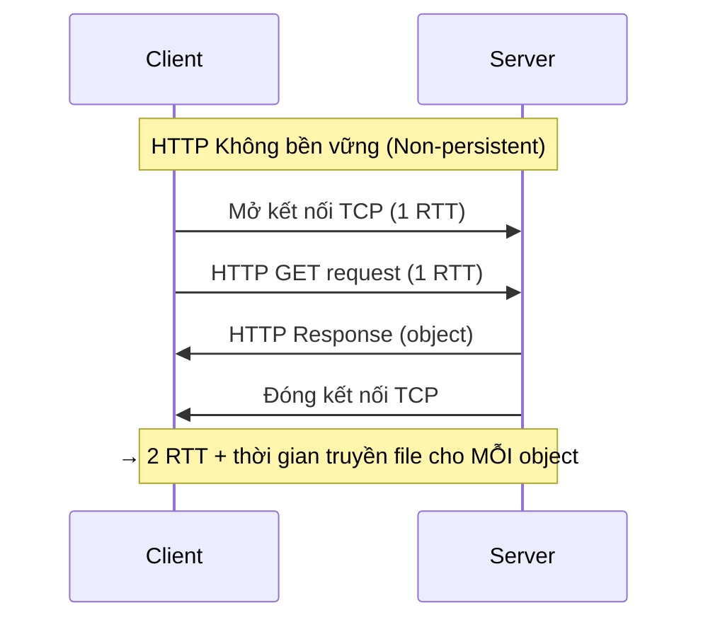
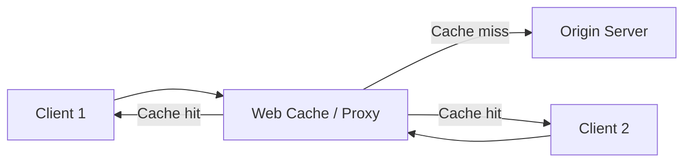
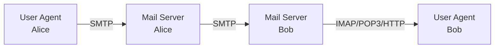
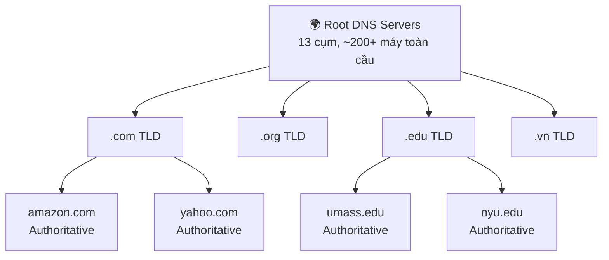

# Chương 2: Tầng Ứng Dụng (Application Layer)

---

## 1. Tổng quan về Tầng Ứng Dụng

Tầng Ứng dụng là tầng cao nhất trong mô hình TCP/IP, nơi người dùng tương tác trực tiếp với mạng. Mục tiêu của chương là hiểu các **khái niệm**, **mô hình triển khai**, và các **giao thức phổ biến** như HTTP, SMTP, DNS, cũng như cách lập trình ứng dụng mạng qua **Socket API**.

Các ứng dụng mạng phổ biến hiện nay bao gồm: mạng xã hội, web, email, game trực tuyến, streaming video (YouTube, Netflix), chia sẻ file P2P (BitTorrent), VoIP (Skype), hội thảo video (Zoom), v.v.

---

## 2. Tạo một ứng dụng mạng

Khi xây dựng ứng dụng mạng, lập trình viên chỉ cần viết phần mềm chạy trên các **hệ thống đầu cuối** (end systems) như máy tính, điện thoại — không cần can thiệp vào phần mềm chạy trong **mạng lõi** (routers, switches). Điều này giúp việc phát triển và triển khai ứng dụng mới diễn ra nhanh chóng, vì sự phức tạp được đẩy ra "biên" của mạng.

---

## 3. Kiến trúc ứng dụng

### 3.1 Mô hình Client – Server

```
Client  ──────────────────►  Server
        (HTTP request)
        ◄──────────────────
        (HTTP response)
```

| Thành phần | Đặc điểm |
|---|---|
| **Server** | Luôn hoạt động, IP cố định, thường đặt trong data center |
| **Client** | Kết nối không liên tục, IP có thể thay đổi, không giao tiếp trực tiếp với client khác |

**Ví dụ:** HTTP, IMAP, FTP

### 3.2 Mô hình Peer-to-Peer (P2P)

Trong P2P, **không có máy chủ luôn hoạt động**. Các "peer" (thiết bị đầu cuối) giao tiếp trực tiếp với nhau — mỗi peer vừa là client vừa là server.

**Đặc điểm nổi bật:**

- **Tự mở rộng (self-scalability):** Peer mới tham gia vừa mang thêm nhu cầu, vừa mang thêm năng lực phục vụ
- Peer có thể kết nối không liên tục, IP thay đổi → Quản lý phức tạp hơn

**Ví dụ:** BitTorrent

---

## 4. Giao tiếp giữa các tiến trình: Socket

Mỗi ứng dụng chạy như một **tiến trình (process)** trên hệ thống đầu cuối. Hai tiến trình giao tiếp với nhau qua **socket** — một giao diện lập trình được ví như "cánh cửa" giữa tầng ứng dụng và tầng vận chuyển.

```
 Tiến trình A                          Tiến trình B
     │                                      │
  [Socket]  ── Tầng Vận Chuyển (TCP/UDP) ──[Socket]
     │                                      │
  [OS quản lý phần dưới socket]
```

### 4.1 Định danh tiến trình

Để nhận thông điệp, một tiến trình cần có **định danh (identifier)** gồm hai phần:

- **Địa chỉ IP** (32-bit): Xác định thiết bị
- **Số hiệu cổng (Port)**: Xác định tiến trình cụ thể trên thiết bị đó

> **Câu hỏi:** Tại sao địa chỉ IP thôi chưa đủ để xác định tiến trình?
>
> **Trả lời:** Vì trên cùng một thiết bị có thể có nhiều tiến trình đang chạy đồng thời (web server dùng cổng 80, mail server dùng cổng 25,...). Địa chỉ IP chỉ xác định máy, số cổng mới xác định được đúng tiến trình cần giao tiếp.

**Ví dụ các cổng phổ biến:**

| Dịch vụ | Cổng |
|---|---|
| HTTP (Web server) | 80 |
| HTTPS | 443 |
| SMTP (Email server) | 25 |
| DNS | 53 |

---

## 5. Giao thức tầng Ứng dụng

Một giao thức tầng ứng dụng định nghĩa:

- **Loại thông điệp:** request, response
- **Cú pháp thông điệp:** các trường và cách định nghĩa
- **Ngữ nghĩa:** ý nghĩa của thông tin trong từng trường
- **Quy tắc:** khi nào và cách thức gửi/nhận thông điệp

**Phân loại giao thức:**

| Loại | Đặc điểm | Ví dụ |
|---|---|---|
| Giao thức mở | Định nghĩa trong RFC, ai cũng truy cập được | HTTP, SMTP |
| Giao thức độc quyền | Do công ty sở hữu, không công khai | Skype, Zoom |

---

## 6. Yêu cầu dịch vụ vận chuyển

Các ứng dụng khác nhau có nhu cầu khác nhau:

| Tiêu chí | Giải thích | Ví dụ |
|---|---|---|
| **Toàn vẹn dữ liệu** | Không chấp nhận mất dữ liệu | Truyền file, web, email |
| **Định thì (Timing)** | Cần độ trễ thấp | Game tương tác, VoIP |
| **Thông lượng (Throughput)** | Cần băng thông tối thiểu | Streaming video/audio |
| **An ninh (Security)** | Cần mã hóa, toàn vẹn | Giao dịch ngân hàng |

**Bảng yêu cầu của các ứng dụng phổ biến:**

| Ứng dụng | Mất dữ liệu | Thông lượng | Nhạy cảm thời gian |
|---|---|---|---|
| Truyền file | Không | Mềm dẻo | Không |
| Email | Không | Mềm dẻo | Không |
| Web | Không | Mềm dẻo | Không |
| Audio/Video real-time | Chịu lỗi | 5Kbps–5Mbps | Có (10ms) |
| Streaming A/V | Chịu lỗi | Như trên | Có (vài giây) |
| Game tương tác | Chịu lỗi | Kbps+ | Có (10ms) |

---

## 7. Dịch vụ vận chuyển Internet: TCP và UDP

### TCP (Transmission Control Protocol)

- ✅ Truyền tải **đáng tin cậy** giữa hai tiến trình
- ✅ **Điều khiển luồng (Flow control):** Bên gửi không áp đảo bên nhận
- ✅ **Điều khiển tắc nghẽn (Congestion control):** Điều tiết khi mạng quá tải
- ✅ **Hướng kết nối (Connection-oriented):** Bắt tay trước khi gửi dữ liệu
- ❌ Không đảm bảo: định thì, thông lượng tối thiểu, an ninh

### UDP (User Datagram Protocol)

- ✅ Nhẹ, nhanh, không cần thiết lập kết nối
- ❌ Không tin cậy, không điều khiển luồng/tắc nghẽn, không đảm bảo thứ tự

> **Câu hỏi:** Tại sao cần UDP khi nó không tin cậy?
>
> **Trả lời:** UDP phù hợp với các ứng dụng ưu tiên tốc độ hơn độ chính xác như streaming audio/video, game online — những ứng dụng có thể chấp nhận mất vài gói tin, nhưng không thể chịu được độ trễ cao do cơ chế truyền lại của TCP gây ra. Ngoài ra, UDP cũng được dùng khi ứng dụng tự xây dựng cơ chế tin cậy riêng.

**Bảng ứng dụng và giao thức vận chuyển:**

| Ứng dụng | Giao thức ứng dụng | Giao thức vận chuyển |
|---|---|---|
| Truyền file | FTP | TCP |
| Email | SMTP | TCP |
| Web | HTTP | TCP |
| VoIP | SIP, RTP | TCP hoặc UDP |
| Streaming | HTTP, DASH | TCP |
| Game | Proprietary | UDP hoặc TCP |

### 7.1 Bảo mật TCP: TLS

TCP và UDP **không mã hóa** dữ liệu theo mặc định. **Transport Layer Security (TLS)** bổ sung:

- Mã hóa kết nối TCP
- Toàn vẹn dữ liệu
- Xác thực đầu cuối

TLS được triển khai ở **tầng ứng dụng** (không phải tầng vận chuyển), thông qua các thư viện TLS mà ứng dụng sử dụng.

---

## 8. Web và HTTP

### 8.1 Cơ bản về Web

- Trang web gồm nhiều **đối tượng (objects):** HTML, JPEG, audio, video,...
- Mỗi đối tượng được định địa chỉ bằng **URL**: `www.someschool.edu/someDept/pic.gif`

### 8.2 HTTP (HyperText Transfer Protocol)

HTTP là giao thức tầng ứng dụng cho Web, hoạt động theo mô hình Client–Server:

- **Client (browser):** Gửi request, nhận và hiển thị response
- **Server:** Gửi objects theo yêu cầu

**Đặc điểm:**

- Dùng **TCP**, kết nối đến cổng **80**
- HTTP là giao thức **không lưu trạng thái (stateless):** Server không nhớ các request trước của client

> **Tại sao stateless lại có lợi?**
> Thiết kế đơn giản hơn — server không cần duy trì thông tin về trạng thái từng client, dễ mở rộng quy mô. Nếu giữ trạng thái, khi server/client sự cố, trạng thái có thể mâu thuẫn và phải có cơ chế đồng bộ phức tạp.

### 8.3 HTTP Không bền vững vs Bền vững



**HTTP bền vững (HTTP 1.1):** Server giữ kết nối TCP mở sau khi phản hồi. Nhiều object được gửi qua một kết nối duy nhất → Chỉ cần **1 RTT cho tất cả các object** (sau RTT đầu thiết lập kết nối).

| | HTTP Không bền vững | HTTP Bền vững |
|---|---|---|
| Kết nối | 1 kết nối/object | 1 kết nối/nhiều objects |
| Chi phí | 2 RTT/object | ~1 RTT/object (sau kết nối đầu) |
| Nhược điểm | Nhiều kết nối, tốn OS overhead | Cần quản lý timeout |

### 8.4 Thông điệp HTTP Request

```
GET /index.html HTTP/1.1\r\n          ← Dòng yêu cầu (Method SP URL SP Version)
Host: www-net.cs.umass.edu\r\n        ← Header
User-Agent: Firefox/80.0\r\n
Accept: text/html\r\n
Connection: keep-alive\r\n
\r\n                                   ← Dòng trống (kết thúc header)
                                       ← Body (thường trống với GET)
```

**Các phương thức HTTP phổ biến:**

| Phương thức | Mục đích |
|---|---|
| **GET** | Lấy tài nguyên; dữ liệu đính trong URL sau `?` |
| **POST** | Gửi dữ liệu form lên server (trong body) |
| **HEAD** | Chỉ lấy header, không lấy body |
| **PUT** | Tải file mới lên server, thay thế file cũ |

### 8.5 Thông điệp HTTP Response

```
HTTP/1.1 200 OK\r\n                    ← Dòng trạng thái
Date: Tue, 08 Sep 2020 00:53:20 GMT\r\n
Server: Apache/2.4.6\r\n
Content-Length: 2651\r\n
Content-Type: text/html; charset=UTF-8\r\n
\r\n
data data data ...                     ← Body (nội dung tài nguyên)
```

**Các mã trạng thái phổ biến:**

| Mã | Ý nghĩa |
|---|---|
| **200 OK** | Thành công |
| **301 Moved Permanently** | Tài nguyên đã chuyển chỗ |
| **304 Not Modified** | Bản cache vẫn còn hợp lệ |
| **400 Bad Request** | Request lỗi cú pháp |
| **404 Not Found** | Không tìm thấy tài nguyên |
| **505 HTTP Version Not Supported** | Phiên bản HTTP không hỗ trợ |

### 8.6 Cookie: Duy trì trạng thái

Vì HTTP stateless, cookie được dùng để lưu trạng thái giữa các phiên. **4 thành phần của hệ thống cookie:**

1. Header `Set-Cookie` trong HTTP response của server
2. Header `Cookie` trong các HTTP request tiếp theo của client
3. File cookie lưu trên máy client (do browser quản lý)
4. Database phía server lưu thông tin liên kết với cookie ID

**Ứng dụng của cookie:** xác thực, giỏ hàng, gợi ý, quản lý phiên.

!!! warning "Cookie và quyền riêng tư"
    **Cookie bên thứ ba (Third-party cookies)** cho phép các mạng quảng cáo (như AdX) theo dõi hành vi duyệt web của bạn trên nhiều website khác nhau mà bạn không hề chọn truy cập. Đây là cơ chế đằng sau các quảng cáo "biết" bạn vừa xem sản phẩm gì.

    - Firefox, Safari: Đã chặn third-party cookie theo mặc định
    - GDPR (EU, 2018): Yêu cầu người dùng phải được thông báo và đồng ý rõ ràng

### 8.7 Web Cache (Proxy Cache)

Web cache là server trung gian đặt gần client, lưu bản sao của các object đã được yêu cầu.



**Lợi ích:**
- Giảm thời gian phản hồi (cache gần client hơn)
- Giảm tải băng thông đường truyền ra Internet

**Ví dụ tính toán:**

??? info "Phân tích hiệu suất Web Cache"
    **Bối cảnh:**
    - Tốc độ access link: 1.54 Mbps
    - RTT đến origin server: 2 giây
    - Kích thước object: 100 Kbit
    - Tốc độ request: 15 object/giây → Data rate = 1.50 Mbps

    **Không có cache:**
    - Utilization access link = 1.50/1.54 = **97%** → Nghẽn cổ chai nghiêm trọng!
    - Độ trễ = 2 giây + hàng phút (queue delay)

    **Có cache (hit rate = 0.4):**
    - Data rate qua access link = 0.6 × 1.50 = 0.90 Mbps
    - Utilization = 0.90/1.54 = **58%** → Độ trễ hàng đợi rất thấp
    - Tổng độ trễ trung bình = 0.6 × 2.01s + 0.4 × (vài ms) ≈ **1.2 giây**
    - Rẻ hơn nhiều so với nâng cấp access link lên 154 Mbps!

### 8.8 Conditional GET

Cơ chế tránh tải lại object nếu bản cache vẫn còn hợp lệ:

```
Client → Server:  GET /image.jpg HTTP/1.1
                  If-Modified-Since: Tue, 01 Mar 2016 18:57:50 GMT

Server → Client:  HTTP/1.0 304 Not Modified   (nếu chưa thay đổi)
                  [Không có body → Tiết kiệm băng thông]

                  HTTP/1.0 200 OK              (nếu đã thay đổi)
                  <data mới>
```

### 8.9 HTTP/2

**Vấn đề của HTTP 1.1:** HOL Blocking (Head-of-Line Blocking) — object lớn chặn các object nhỏ phía sau trong hàng đợi FCFS.

**HTTP/2 giải quyết bằng cách:**

- Chia object thành các **frame** nhỏ
- **Xen kẽ (interleave)** các frame từ nhiều object khác nhau
- Client có thể **ưu tiên** (priority) các object quan trọng
- Kết quả: Object nhỏ được giao nhanh, object lớn chỉ bị trễ nhẹ

```
HTTP 1.1:  [===O1 lớn===][O2][O3][O4]   ← O2,O3,O4 phải chờ
HTTP/2:    [O1][O2][O3][O4][O1][O2]...  ← Xen kẽ frame, công bằng hơn
```

---

## 9. Email: SMTP và IMAP

### 9.1 Kiến trúc hệ thống Email



**Ba thành phần chính:**

1. **User Agent:** Ứng dụng soạn/đọc email (Outlook, Gmail app,...)
2. **Mail Server:** Lưu hộp thư, hàng đợi gửi, truyền email giữa các server
3. **SMTP:** Giao thức gửi email giữa các mail server

### 9.2 Quy trình gửi email

1. Alice soạn email bằng User Agent, gửi đến mail server của mình qua SMTP
2. Mail server Alice đặt email vào hàng đợi gửi
3. SMTP client trên mail server Alice mở kết nối TCP đến mail server Bob (cổng 25)
4. Email được truyền qua kết nối TCP
5. Mail server Bob đặt email vào hộp thư của Bob
6. Bob dùng User Agent đọc email qua IMAP/POP3/HTTP

### 9.3 SMTP: Giao thức

```
S: 220 hamburger.edu
C: HELO crepes.fr
S: 250 Hello crepes.fr, pleased to meet you
C: MAIL FROM: <alice@crepes.fr>
S: 250 alice@crepes.fr... Sender ok
C: RCPT TO: <bob@hamburger.edu>
S: 250 bob@hamburger.edu... Recipient ok
C: DATA
S: 354 Enter mail, end with "." on a line by itself
C: Do you like ketchup?
C: How about pickles?
C: .
S: 250 Message accepted for delivery
C: QUIT
S: 221 hamburger.edu closing connection
```

**So sánh SMTP với HTTP:**

| Tiêu chí | HTTP | SMTP |
|---|---|---|
| Mô hình | **Pull** (client kéo dữ liệu) | **Push** (gửi đẩy đến server) |
| Mã hóa lệnh | ASCII | ASCII |
| Kết nối | Bền vững (HTTP 1.1) | Bền vững |
| Object per message | Mỗi object trong response riêng | Nhiều object trong 1 message |
| Định dạng nội dung | Mọi loại | Yêu cầu ASCII 7-bit |
| Kết thúc message | — | Dùng `CRLF.CRLF` |

### 9.4 Giao thức truy xuất Email

| Giao thức | Đặc điểm |
|---|---|
| **POP3** | Tải email về máy, xóa khỏi server |
| **IMAP** | Email lưu trên server, đồng bộ nhiều thiết bị, hỗ trợ thư mục |
| **HTTP** | Giao diện web (Gmail, Yahoo Mail,...) |

---

## 10. DNS: Domain Name System

### 10.1 Tại sao cần DNS?

Con người dùng tên dễ nhớ (`www.google.com`), máy tính dùng địa chỉ IP (`142.250.185.14`). DNS là hệ thống **ánh xạ tên → địa chỉ IP**.

> **Câu hỏi:** Tại sao không tập trung hóa DNS vào một server duy nhất?
>
> **Trả lời:** Vì sẽ có các vấn đề nghiêm trọng:
> - **Single point of failure:** DNS chết → toàn bộ Internet chết
> - **Lưu lượng khổng lồ:** Hàng nghìn tỷ query/ngày không thể xử lý tập trung
> - **Độ trễ địa lý:** Một server không thể gần tất cả người dùng toàn cầu
> - **Khó bảo trì:** Cập nhật hàng tỷ bản ghi từ hàng triệu tổ chức

### 10.2 Kiến trúc phân cấp DNS



**Ba tầng máy chủ DNS:**

1. **Root DNS Servers:** Điểm liên hệ cuối cùng, biết địa chỉ TLD servers. Có 13 cụm (ký hiệu A–M), mỗi cụm gồm nhiều máy (~200+ tại US). Được ICANN quản lý.

2. **TLD (Top-Level Domain) Servers:** Quản lý các tên miền .com, .org, .net, .edu, .vn, .uk,...

3. **Authoritative DNS Servers:** DNS riêng của mỗi tổ chức, lưu ánh xạ chính thức cho các tên miền của họ.

4. **Local DNS Server:** Mỗi ISP có một server DNS cục bộ. Client gửi query đến đây đầu tiên. Nếu cache miss, local DNS server thay mặt client tra cứu trong hệ thống phân cấp.

### 10.3 Phân giải tên: Iterative vs Recursive

=== "Iterative (Tuần tự)"

    Local DNS server tự đi hỏi từng cấp, mỗi server chỉ trả lời "hãy hỏi server này tiếp":

    ```
    Client → Local DNS: "gaia.cs.umass.edu?"
    Local DNS → Root: "gaia.cs.umass.edu?"  → "Hỏi .edu TLD"
    Local DNS → .edu TLD: "gaia.cs.umass.edu?" → "Hỏi umass.edu"
    Local DNS → umass.edu: "gaia.cs.umass.edu?" → "128.119.245.12"
    Local DNS → Client: "128.119.245.12"
    ```

=== "Recursive (Đệ quy)"

    Mỗi server được hỏi sẽ tự đi hỏi tiếp thay cho client:

    ```
    Client → Local DNS → Root → .edu TLD → umass.edu
                                              ↓ trả lời ngược lại
    Client ← Local DNS ← Root ← .edu TLD ← umass.edu
    ```

    Recursive đặt gánh nặng lên các server cấp trên → ít dùng hơn ở root.

### 10.4 DNS Caching

Khi DNS server học được một ánh xạ, nó lưu vào **cache** để trả lời nhanh cho các query sau.

- Cải thiện thời gian phản hồi đáng kể
- Bản ghi cache hết hạn sau **TTL (Time To Live)**
- Có thể lỗi thời: nếu IP của server thay đổi, phải đợi TTL hết hạn mới cập nhật

### 10.5 Bản ghi DNS (Resource Records - RR)

Định dạng: `(name, value, type, TTL)`

| Type | name | value |
|---|---|---|
| **A** | Hostname | Địa chỉ IPv4 |
| **AAAA** | Hostname | Địa chỉ IPv6 |
| **NS** | Tên miền | Tên authoritative server của miền đó |
| **CNAME** | Tên bí danh (alias) | Tên thật (canonical name) |
| **MX** | Tên miền | Tên mail server của miền đó |

### 10.6 Tấn công DNS

| Loại tấn công | Mô tả |
|---|---|
| **DDoS vào Root/TLD** | Bắn phá lưu lượng, làm sập server. Root có bộ lọc và cache TLD nên khó thành công. |
| **DNS Cache Poisoning** | Giả mạo phản hồi DNS, chèn bản ghi sai vào cache → Client bị redirect đến server độc hại |

**Giải pháp:** DNSSEC (RFC 4033) — xác thực và đảm bảo toàn vẹn thông điệp DNS.

---

## 11. Ứng dụng P2P: BitTorrent

### 11.1 Phân phối file: Client-Server vs P2P

**Thời gian phân phối file kích thước F đến N client:**

$$D_{C-S} \geq \max\left\{\frac{NF}{u_s}, \frac{F}{d_{min}}\right\}$$

$$D_{P2P} \geq \max\left\{\frac{F}{u_s}, \frac{F}{d_{min}}, \frac{NF}{u_s + \sum u_i}\right\}$$

- **Client-Server:** Thời gian tăng **tuyến tính** với N (server phải gửi N bản sao)
- **P2P:** Khi N tăng, mỗi peer mới vừa là người tiêu thụ vừa là nguồn upload → Tổng capacity tăng → Thời gian phân phối tăng chậm hơn nhiều

### 11.2 BitTorrent: Cơ chế hoạt động

```
                    ┌─────────────┐
                    │   Tracker   │ ← Theo dõi danh sách peers trong torrent
                    └─────────────┘
                          │
         ┌────────────────┼────────────────┐
    [Peer A]          [Peer B]          [Peer C]  ← Trao đổi chunks trực tiếp
```

- File được chia thành các **chunk 256KB**
- Peer mới tham gia: Đăng ký với tracker, lấy danh sách peer, bắt đầu trao đổi chunk

**Cơ chế yêu cầu chunk — Rarest First:**
Peer ưu tiên yêu cầu các chunk **hiếm nhất** (ít peer có nhất) → Đảm bảo sự đa dạng và tránh chunk bị "tuyệt chủng"

**Cơ chế gửi chunk — Tit-for-Tat:**
- Mỗi 10 giây: Alice gửi chunk cho **4 peer** đang upload cho mình nhanh nhất ("unchoke" top 4)
- Mỗi 30 giây: Alice chọn **ngẫu nhiên 1 peer** mới để gửi thử ("optimistic unchoke")
  - Mục đích: Khám phá peer mới tốt hơn, cho phép peer mới gia nhập hệ thống

> **Tại sao tit-for-tat hiệu quả?**
> Nó tạo ra động lực: muốn download nhanh thì phải upload nhanh. Peer "lười" (chỉ download, không upload) sẽ bị các peer khác bỏ qua. Cơ chế này khuyến khích đóng góp vào cộng đồng.

---

## 12. Lập trình Socket

### 12.1 Socket UDP

UDP không thiết lập kết nối trước. Mỗi datagram mang địa chỉ IP và port đích.

```python title="UDP Client"
from socket import *
serverName = 'hostname'
serverPort = 12000

# Tạo UDP socket (AF_INET = IPv4, SOCK_DGRAM = UDP)
clientSocket = socket(AF_INET, SOCK_DGRAM)

message = input('Input lowercase sentence:')

# Gửi datagram kèm địa chỉ đích
clientSocket.sendto(message.encode(), (serverName, serverPort))

# Nhận phản hồi
modifiedMessage, serverAddress = clientSocket.recvfrom(2048)
print(modifiedMessage.decode())
clientSocket.close()
```

```python title="UDP Server"
from socket import *
serverPort = 12000

serverSocket = socket(AF_INET, SOCK_DGRAM)
serverSocket.bind(('', serverPort))  # Gắn socket với cổng
print('The server is ready to receive')

while True:
    # Nhận datagram và địa chỉ client
    message, clientAddress = serverSocket.recvfrom(2048)
    modifiedMessage = message.decode().upper()
    # Gửi phản hồi về đúng địa chỉ client
    serverSocket.sendto(modifiedMessage.encode(), clientAddress)
```

### 12.2 Socket TCP

TCP thiết lập kết nối trước (3-way handshake), sau đó truyền luồng byte tin cậy.

```python title="TCP Client"
from socket import *
serverName = 'servername'
serverPort = 12000

# Tạo TCP socket (SOCK_STREAM = TCP)
clientSocket = socket(AF_INET, SOCK_STREAM)

# Bắt tay TCP, thiết lập kết nối
clientSocket.connect((serverName, serverPort))

sentence = input('Input lowercase sentence:')
clientSocket.send(sentence.encode())  # Không cần kèm địa chỉ

modifiedSentence = clientSocket.recv(1024)
print('From Server:', modifiedSentence.decode())
clientSocket.close()
```

```python title="TCP Server"
from socket import *
serverPort = 12000

# Socket chào đón (welcoming socket)
serverSocket = socket(AF_INET, SOCK_STREAM)
serverSocket.bind(('', serverPort))
serverSocket.listen(1)  # Sẵn sàng lắng nghe, tối đa 1 kết nối chờ
print('The server is ready to receive')

while True:
    # Tạo socket kết nối mới cho từng client
    connectionSocket, addr = serverSocket.accept()
    
    sentence = connectionSocket.recv(1024).decode()
    capitalizedSentence = sentence.upper()
    connectionSocket.send(capitalizedSentence.encode())
    
    connectionSocket.close()  # Chỉ đóng socket kết nối, không đóng welcoming socket
```

**So sánh UDP và TCP Socket:**

| | UDP | TCP |
|---|---|---|
| Thiết lập kết nối | Không | Có (3-way handshake) |
| Địa chỉ đích | Kèm mỗi datagram | Chỉ khi `connect()` |
| Tin cậy | Không | Có |
| Số socket phía server | 1 | 1 welcoming + 1/client |
| API đọc dữ liệu | `recvfrom()` | `recv()` |

---

## 📝 50 Câu Trắc Nghiệm

---

**Câu 1.** Trong mô hình Client-Server, đặc điểm nào sau đây MÔ TẢ ĐÚNG về Server?

- A. Có thể kết nối không liên tục
- B. Địa chỉ IP có thể thay đổi
- C. Luôn hoạt động và có địa chỉ IP cố định
- D. Giao tiếp trực tiếp với các client khác

??? info "Đáp án & Giải thích"
    **Đáp án: C**
    Server trong mô hình Client-Server luôn luôn hoạt động (always-on), có địa chỉ IP cố định để client có thể liên lạc. Client mới là bên có thể kết nối không liên tục và IP thay đổi.

---

**Câu 2.** Tính năng "tự mở rộng" (self-scalability) trong kiến trúc P2P có nghĩa là gì?

- A. Server tự động thêm CPU khi tải tăng
- B. Mỗi peer mới tham gia vừa mang thêm nhu cầu vừa mang thêm năng lực phục vụ
- C. Hệ thống tự sao chép dữ liệu sang nhiều server
- D. Băng thông tự động tăng theo số lượng người dùng

??? info "Đáp án & Giải thích"
    **Đáp án: B**
    Đây là ưu điểm độc đáo của P2P: khi có thêm peer, tuy nhu cầu tăng nhưng năng lực phục vụ (upload capacity) cũng tăng tương ứng vì mỗi peer cũng là nguồn cung cấp dữ liệu.

---

**Câu 3.** Định danh (identifier) của một tiến trình trong mạng bao gồm những thành phần nào?

- A. Chỉ địa chỉ IP
- B. Chỉ số hiệu cổng (port)
- C. Địa chỉ IP và số hiệu cổng
- D. Địa chỉ IP, số hiệu cổng và tên miền

??? info "Đáp án & Giải thích"
    **Đáp án: C**
    Địa chỉ IP xác định thiết bị (host), số hiệu cổng xác định tiến trình cụ thể đang chạy trên thiết bị đó. Cả hai kết hợp mới đủ để định danh một tiến trình trên mạng.

---

**Câu 4.** Cổng mặc định của HTTP server là bao nhiêu?

- A. 25
- B. 53
- C. 80
- D. 443

??? info "Đáp án & Giải thích"
    **Đáp án: C**
    HTTP server lắng nghe ở cổng 80. Cổng 25 là SMTP, 53 là DNS, 443 là HTTPS.

---

**Câu 5.** Giao thức nào sau đây là giao thức "mở" (open protocol)?

- A. Skype
- B. Zoom
- C. HTTP
- D. FaceTime

??? info "Đáp án & Giải thích"
    **Đáp án: C**
    HTTP được định nghĩa trong các RFC (Request For Comments) và mọi người đều có thể truy cập. Skype, Zoom, FaceTime là các giao thức độc quyền (proprietary).

---

**Câu 6.** Ứng dụng nào sau đây KHÔNG yêu cầu toàn vẹn dữ liệu 100%?

- A. Truyền file (FTP)
- B. Thư điện tử (Email)
- C. Tải trang web
- D. Audio streaming thời gian thực

??? info "Đáp án & Giải thích"
    **Đáp án: D**
    Audio streaming thời gian thực có thể chịu được mất mát dữ liệu một phần (loss tolerant) vì đây là nội dung thời gian thực, thà mất vài gói còn hơn bị delay do truyền lại. FTP, email và tải web yêu cầu 100% độ tin cậy.

---

**Câu 7.** TCP cung cấp dịch vụ nào sau đây?

- A. Đảm bảo thông lượng tối thiểu
- B. Đảm bảo độ trễ thấp
- C. Điều khiển tắc nghẽn
- D. Mã hóa dữ liệu

??? info "Đáp án & Giải thích"
    **Đáp án: C**
    TCP cung cấp: truyền tải tin cậy, điều khiển luồng, điều khiển tắc nghẽn, hướng kết nối. TCP KHÔNG cung cấp: định thì, thông lượng tối thiểu, an ninh/mã hóa.

---

**Câu 8.** TLS (Transport Layer Security) được triển khai ở tầng nào?

- A. Tầng Vật lý
- B. Tầng Liên kết dữ liệu
- C. Tầng Vận chuyển
- D. Tầng Ứng dụng

??? info "Đáp án & Giải thích"
    **Đáp án: D**
    Mặc dù tên có "Transport", TLS thực chất được triển khai ở Tầng Ứng dụng thông qua các thư viện TLS mà ứng dụng sử dụng. TLS hoạt động "trên" TCP.

---

**Câu 9.** HTTP là giao thức "không lưu trạng thái" (stateless). Điều này có nghĩa là gì?

- A. Server không ghi log các request
- B. Server không duy trì thông tin về các request trước đó của client
- C. Client không lưu lịch sử duyệt web
- D. Mỗi kết nối TCP chỉ được dùng một lần

??? info "Đáp án & Giải thích"
    **Đáp án: B**
    Stateless nghĩa là mỗi HTTP request hoàn toàn độc lập, server không biết request hiện tại liên quan đến request nào trước đó của cùng client. Đây là thiết kế cố ý để đơn giản hóa server và dễ mở rộng.

---

**Câu 10.** Thời gian đáp ứng của HTTP không bền vững để tải một đối tượng là bao nhiêu?

- A. 1 RTT + thời gian truyền file
- B. 2 RTT + thời gian truyền file
- C. 3 RTT + thời gian truyền file
- D. RTT + thời gian truyền file

??? info "Đáp án & Giải thích"
    **Đáp án: B**
    - RTT 1: Khởi tạo kết nối TCP (SYN → SYN-ACK)
    - RTT 2: Gửi HTTP GET và nhận vài byte đầu của response
    - Thêm thời gian truyền toàn bộ object
    Tổng = **2 RTT + thời gian truyền file**

---

**Câu 11.** Phương thức HTTP nào được dùng để gửi dữ liệu form trong BODY của request?

- A. GET
- B. POST
- C. HEAD
- D. PUT

??? info "Đáp án & Giải thích"
    **Đáp án: B**
    POST gửi dữ liệu trong entity body của request. GET cũng có thể gửi dữ liệu nhưng đính kèm trong URL (sau dấu `?`), không phải trong body.

---

**Câu 12.** Mã trạng thái HTTP nào cho biết tài nguyên đã chuyển vĩnh viễn sang địa chỉ mới?

- A. 200 OK
- B. 304 Not Modified
- C. 301 Moved Permanently
- D. 404 Not Found

??? info "Đáp án & Giải thích"
    **Đáp án: C**
    301 Moved Permanently kèm theo trường `Location:` trong header để cho client biết địa chỉ mới. Browser thường tự động redirect đến địa chỉ mới.

---

**Câu 13.** Cookie gồm bao nhiêu thành phần chính?

- A. 2
- B. 3
- C. 4
- D. 5

??? info "Đáp án & Giải thích"
    **Đáp án: C**
    4 thành phần: (1) Header `Set-Cookie` trong HTTP response, (2) Header `Cookie` trong HTTP request, (3) File cookie lưu trên máy client do browser quản lý, (4) Database phía server.

---

**Câu 14.** "Third-party cookie" khác "first-party cookie" ở điểm nào?

- A. Third-party cookie được mã hóa còn first-party thì không
- B. Third-party cookie đến từ website bạn không chọn truy cập trực tiếp
- C. Third-party cookie lưu trên server, first-party lưu trên client
- D. Third-party cookie có thời gian sống ngắn hơn

??? info "Đáp án & Giải thích"
    **Đáp án: B**
    Third-party cookie đến từ domain khác (thường là mạng quảng cáo như AdX) được nhúng vào trang bạn đang xem. Chúng cho phép theo dõi hành vi của bạn trên nhiều website khác nhau mà không cần bạn trực tiếp truy cập trang của bên thứ ba.

---

**Câu 15.** Mục đích chính của Web Cache là gì?

- A. Tăng bảo mật cho kết nối web
- B. Đáp ứng request của client mà không cần liên lạc với origin server
- C. Nén dữ liệu để tiết kiệm băng thông
- D. Mã hóa traffic giữa client và server

??? info "Đáp án & Giải thích"
    **Đáp án: B**
    Web cache lưu bản sao của các object được yêu cầu gần đây. Khi có request mới cho cùng object, cache trả lời trực tiếp mà không cần ra ngoài internet → Giảm độ trễ và giảm tải băng thông.

---

**Câu 16.** Trong Conditional GET, header nào được client gửi lên server để kiểm tra xem object có thay đổi không?

- A. `Cache-Control`
- B. `If-Modified-Since`
- C. `ETag`
- D. `Last-Modified`

??? info "Đáp án & Giải thích"
    **Đáp án: B**
    Client gửi `If-Modified-Since: <date>` trong request. Server so sánh với thời gian sửa đổi cuối cùng của object: nếu chưa thay đổi → trả `304 Not Modified` (không có body, tiết kiệm băng thông); nếu đã thay đổi → trả `200 OK` kèm object mới.

---

**Câu 17.** HOL Blocking (Head-of-Line Blocking) trong HTTP 1.1 xảy ra như thế nào?

- A. Server từ chối phục vụ client sau một thời gian nhất định
- B. Object nhỏ phải chờ object lớn phía trước được truyền xong trong hàng đợi FCFS
- C. Client không thể gửi request mới khi chưa nhận được response trước
- D. Kết nối TCP bị reset khi có quá nhiều request

??? info "Đáp án & Giải thích"
    **Đáp án: B**
    HTTP 1.1 dùng lịch trình FCFS (First Come First Served) trong một kết nối. Nếu có request cho object lớn (video) đến trước, các request cho object nhỏ (CSS, JS nhỏ) phía sau phải chờ cho đến khi object lớn truyền xong.

---

**Câu 18.** HTTP/2 giải quyết HOL Blocking bằng cách nào?

- A. Tăng số kết nối TCP song song
- B. Ưu tiên các object nhỏ hơn object lớn
- C. Chia object thành frame và xen kẽ frame của nhiều object
- D. Giới hạn kích thước object tối đa

??? info "Đáp án & Giải thích"
    **Đáp án: C**
    HTTP/2 chia mỗi object thành các **frame** nhỏ và xen kẽ (interleave) các frame từ nhiều object khác nhau trong một kết nối TCP. Client cũng có thể chỉ định độ ưu tiên cho từng object.

---

**Câu 19.** SMTP sử dụng cổng nào và giao thức vận chuyển nào?

- A. Cổng 80, TCP
- B. Cổng 25, TCP
- C. Cổng 25, UDP
- D. Cổng 110, TCP

??? info "Đáp án & Giải thích"
    **Đáp án: B**
    SMTP (Simple Mail Transfer Protocol) sử dụng TCP cổng 25 để truyền email tin cậy giữa các mail server. Cổng 80 là HTTP, 110 là POP3.

---

**Câu 20.** Điểm khác biệt cơ bản giữa HTTP và SMTP về mô hình truyền dữ liệu là gì?

- A. HTTP dùng TCP, SMTP dùng UDP
- B. HTTP là giao thức Pull, SMTP là giao thức Push
- C. HTTP mã hóa dữ liệu, SMTP không mã hóa
- D. HTTP là stateful, SMTP là stateless

??? info "Đáp án & Giải thích"
    **Đáp án: B**
    HTTP là **Pull**: client chủ động kéo (yêu cầu) dữ liệu từ server. SMTP là **Push**: máy gửi chủ động đẩy email đến mail server của người nhận mà không cần người nhận yêu cầu trước.

---

**Câu 21.** SMTP yêu cầu nội dung thông điệp phải ở định dạng nào?

- A. Binary
- B. Unicode UTF-8
- C. ASCII 7-bit
- D. Base64

??? info "Đáp án & Giải thích"
    **Đáp án: C**
    SMTP yêu cầu header và body phải ở dạng ASCII 7-bit. Để gửi file đính kèm hoặc nội dung không phải ASCII (như tiếng Việt), cần mã hóa bổ sung (MIME, Base64,...).

---

**Câu 22.** Giao thức nào phù hợp nhất cho việc đồng bộ email giữa nhiều thiết bị (máy tính, điện thoại)?

- A. SMTP
- B. POP3
- C. IMAP
- D. FTP

??? info "Đáp án & Giải thích"
    **Đáp án: C**
    IMAP lưu email trên server và hỗ trợ đồng bộ nhiều thiết bị — đọc, xóa, tạo thư mục đều được phản ánh trên server. POP3 thường tải email về máy và xóa khỏi server, không phù hợp cho đa thiết bị.

---

**Câu 23.** DNS là viết tắt của gì và chức năng chính là gì?

- A. Dynamic Network System — Phân bổ địa chỉ IP động
- B. Domain Name System — Ánh xạ tên miền thành địa chỉ IP
- C. Distributed Network Service — Phân phối nội dung web
- D. Data Name Storage — Lưu trữ dữ liệu tên miền

??? info "Đáp án & Giải thích"
    **Đáp án: B**
    DNS (Domain Name System) là hệ thống cơ sở dữ liệu phân tán, chuyển đổi tên miền con người dễ nhớ (www.google.com) thành địa chỉ IP mà máy tính sử dụng.

---

**Câu 24.** Có bao nhiêu cụm Root DNS Server tồn tại trên thế giới?

- A. 1
- B. 5
- C. 13
- D. 100

??? info "Đáp án & Giải thích"
    **Đáp án: C**
    Có **13 cụm** Root DNS server (ký hiệu A đến M), do ICANN quản lý. Mỗi cụm thực ra gồm nhiều máy chủ vật lý phân tán toàn cầu (~200+ máy tại US), sử dụng anycast routing.

---

**Câu 25.** Bản ghi DNS loại **A** lưu trữ thông tin gì?

- A. Tên bí danh (alias) của một hostname
- B. Địa chỉ IPv4 của một hostname
- C. Tên mail server của một tên miền
- D. Tên authoritative server của một tên miền

??? info "Đáp án & Giải thích"
    **Đáp án: B**
    Bản ghi **A (Address)**: `(hostname, địa_chỉ_IPv4, A, TTL)`. Bản ghi CNAME lưu alias, MX lưu mail server, NS lưu tên authoritative server.

---

**Câu 26.** Trong truy vấn DNS tuần tự (iterative), ai là người thực hiện các bước tra cứu tiếp theo?

- A. Client
- B. Local DNS server
- C. Root DNS server
- D. TLD DNS server

??? info "Đáp án & Giải thích"
    **Đáp án: B**
    Trong iterative query, **local DNS server** tự đi hỏi từng cấp (Root → TLD → Authoritative). Mỗi server được hỏi chỉ trả lời "hãy hỏi server này" chứ không đi hỏi thêm thay.

---

**Câu 27.** TTL trong DNS có ý nghĩa gì?

- A. Thời gian tối đa một gói tin được phép tồn tại trong mạng
- B. Thời gian bản ghi DNS được lưu trong cache trước khi hết hạn
- C. Thời gian server phải trả lời query
- D. Số lần tối đa một query có thể được chuyển tiếp

??? info "Đáp án & Giải thích"
    **Đáp án: B**
    TTL (Time To Live) trong DNS xác định thời gian một bản ghi được lưu cache. Sau khi TTL hết hạn, DNS resolver phải truy vấn lại để lấy thông tin mới nhất.

---

**Câu 28.** Tấn công "DNS Cache Poisoning" tấn công vào điểm yếu nào?

- A. Mã hóa của kết nối DNS
- B. Quá trình xác thực người dùng DNS
- C. Bộ nhớ cache của DNS server bằng cách chèn bản ghi giả
- D. Băng thông của Root DNS server

??? info "Đáp án & Giải thích"
    **Đáp án: C**
    DNS Cache Poisoning: kẻ tấn công giả mạo response DNS hợp lệ và chèn bản ghi sai vào cache của DNS resolver. Sau đó, mọi client dùng resolver này sẽ được redirect đến IP của kẻ tấn công. DNSSEC là giải pháp bảo vệ.

---

**Câu 29.** Trong BitTorrent, "tracker" có vai trò gì?

- A. Lưu trữ các chunk của file
- B. Theo dõi danh sách các peer đang tham gia trong torrent
- C. Mã hóa dữ liệu truyền giữa các peer
- D. Cân bằng tải giữa các peer

??? info "Đáp án & Giải thích"
    **Đáp án: B**
    Tracker là server trung tâm theo dõi danh sách các peer đang tham gia vào một torrent cụ thể. Khi peer mới tham gia, nó đăng ký với tracker và nhận danh sách peer để bắt đầu trao đổi chunk.

---

**Câu 30.** Chiến lược "Rarest First" trong BitTorrent có nghĩa là gì?

- A. Peer mới nhất tham gia được ưu tiên phục vụ trước
- B. Peer ưu tiên yêu cầu các chunk hiếm nhất (ít peer có nhất)
- C. File nhỏ nhất được tải xuống trước
- D. Peer có băng thông thấp nhất được phục vụ trước

??? info "Đáp án & Giải thích"
    **Đáp án: B**
    Rarest First: Alice ưu tiên yêu cầu các chunk mà ít peer khác sở hữu. Điều này đảm bảo mỗi chunk đều được phổ biến rộng rãi trong swarm, tránh tình trạng một chunk biến mất (không còn ai có để chia sẻ).

---

**Câu 31.** Cơ chế "Tit-for-Tat" trong BitTorrent hoạt động như thế nào?

- A. Peer gửi cho những peer đang gửi lại cho mình với tốc độ cao nhất
- B. Peer nhỏ nhất được phục vụ trước
- C. Peer cũ được ưu tiên hơn peer mới
- D. Mỗi peer nhận bằng đúng lượng dữ liệu mà nó đã gửi

??? info "Đáp án & Giải thích"
    **Đáp án: A**
    Tit-for-tat: Alice gửi chunk cho 4 peer đang upload cho mình nhanh nhất ("unchoke" top 4). Cứ 30 giây, Alice "optimistic unchoke" thêm 1 peer ngẫu nhiên để khám phá peer tốt hơn và cho phép peer mới tham gia hệ thống.

---

**Câu 32.** Công thức thời gian phân phối file trong mô hình Client-Server đến N client là?

- A. `D = F/us + F/dmin`
- B. `D ≥ max(NF/us, F/dmin)`
- C. `D = NF/(us + Σui)`
- D. `D ≥ max(F/us, NF/(us + Σui))`

??? info "Đáp án & Giải thích"
    **Đáp án: B**
    - `NF/us`: Server phải upload N bản sao, mỗi bản F bit, tốc độ upload us
    - `F/dmin`: Client chậm nhất (download speed dmin) phải tải xong F bit
    Thời gian thực tế ít nhất bằng max của hai giá trị này.

---

**Câu 33.** Sự khác biệt chính giữa socket UDP và TCP trong Python là gì?

- A. `SOCK_DGRAM` cho UDP, `SOCK_STREAM` cho TCP
- B. `SOCK_UDP` cho UDP, `SOCK_TCP` cho TCP
- C. `AF_INET` cho UDP, `AF_INET6` cho TCP
- D. UDP dùng `bind()`, TCP không dùng

??? info "Đáp án & Giải thích"
    **Đáp án: A**
    - UDP: `socket(AF_INET, SOCK_DGRAM)` — DGRAM = datagram
    - TCP: `socket(AF_INET, SOCK_STREAM)` — STREAM = luồng byte liên tục

---

**Câu 34.** Trong lập trình socket TCP phía server, tại sao cần hai loại socket khác nhau?

- A. Một socket để nhận, một socket để gửi
- B. Một welcoming socket lắng nghe kết nối mới, một connection socket giao tiếp với từng client
- C. Một socket cho IPv4, một cho IPv6
- D. Một socket cho dữ liệu, một socket cho điều khiển

??? info "Đáp án & Giải thích"
    **Đáp án: B**
    TCP server cần: (1) **Welcoming socket** (`serverSocket`) — luôn mở, lắng nghe kết nối đến; (2) **Connection socket** (`connectionSocket`) — tạo mới cho mỗi client sau `accept()`. Điều này cho phép server phục vụ nhiều client đồng thời.

---

**Câu 35.** Phương thức `recvfrom()` trong UDP trả về gì khác so với `recv()` trong TCP?

- A. `recvfrom()` trả về dữ liệu nhanh hơn
- B. `recvfrom()` trả về cả dữ liệu và địa chỉ của người gửi
- C. `recvfrom()` có buffer lớn hơn
- D. `recvfrom()` tự động giải mã dữ liệu

??? info "Đáp án & Giải thích"
    **Đáp án: B**
    UDP không có kết nối, nên server cần biết địa chỉ (IP + port) của client để gửi phản hồi về đúng chỗ. `recvfrom()` trả về `(data, clientAddress)`. TCP đã biết địa chỉ từ lúc kết nối nên `recv()` chỉ trả về data.

---

**Câu 36.** GDPR (Quy định chung về bảo vệ dữ liệu EU) quy định gì về cookie?

- A. Cookie bị cấm hoàn toàn trên các website EU
- B. Cookie phải được xóa sau 24 giờ
- C. Người dùng phải được thông báo và có quyền kiểm soát việc cookie có được phép không
- D. Chỉ cookie bên thứ ba mới bị quy định

??? info "Đáp án & Giải thích"
    **Đáp án: C**
    GDPR (2018) coi cookie có thể xác định cá nhân là dữ liệu cá nhân. Website phải xin phép rõ ràng và cho phép người dùng từ chối. Đó là lý do các website hay hiện popup "Chấp nhận cookie / Tùy chỉnh".

---

**Câu 37.** Web cache hoạt động như vai trò kép là gì?

- A. Client và DNS server
- B. Server (với client gốc) và Client (với origin server)
- C. Firewall và Load balancer
- D. Proxy và VPN

??? info "Đáp án & Giải thích"
    **Đáp án: B**
    Web cache vừa đóng vai **server** khi trả lời cho client đang yêu cầu, vừa đóng vai **client** khi nó phải ra ngoài hỏi origin server để lấy nội dung mà nó chưa cache.

---

**Câu 38.** Trong ví dụ tính toán web cache (hit rate = 0.4), tốc độ dữ liệu qua access link giảm xuống còn bao nhiêu?

- A. 0.4 × 1.50 = 0.60 Mbps
- B. 0.6 × 1.50 = 0.90 Mbps
- C. 1.50 Mbps (không đổi)
- D. 0.5 × 1.50 = 0.75 Mbps

??? info "Đáp án & Giải thích"
    **Đáp án: B**
    40% request được phục vụ bởi cache (không qua access link). Chỉ 60% còn lại phải ra ngoài internet qua access link. Data rate = 0.6 × 1.50 Mbps = **0.90 Mbps**, giảm từ 0.97 xuống còn 0.58 utilization.

---

**Câu 39.** Bản ghi DNS loại MX dùng để làm gì?

- A. Ánh xạ hostname ra địa chỉ IP
- B. Xác định tên thật của một bí danh
- C. Xác định mail server chịu trách nhiệm nhận email cho một tên miền
- D. Xác định authoritative name server cho một tên miền

??? info "Đáp án & Giải thích"
    **Đáp án: C**
    Bản ghi MX (Mail eXchange): `(tên_miền, tên_mail_server, MX, TTL)`. Khi gửi email đến `user@example.com`, DNS tra cứu bản ghi MX của `example.com` để biết phải gửi đến mail server nào.

---

**Câu 40.** Điều gì xảy ra nếu một máy chủ thay đổi địa chỉ IP nhưng TTL của bản ghi DNS chưa hết hạn?

- A. DNS tự động cập nhật ngay lập tức
- B. Tất cả client bị lỗi kết nối cho đến khi DNS cập nhật
- C. Bản ghi cache cũ có thể được dùng cho đến khi TTL hết hạn
- D. ISP phải thông báo thủ công cho tất cả DNS server

??? info "Đáp án & Giải thích"
    **Đáp án: C**
    Đây là hạn chế của DNS caching: các DNS resolver trên internet vẫn cache địa chỉ IP cũ cho đến khi TTL hết hạn. Đây là lý do khi migration server, người ta thường giảm TTL trước vài ngày để khi thay đổi thật sự xảy ra, việc cập nhật toàn cầu diễn ra nhanh hơn.

---

**Câu 41.** Trong HTTP/1.1, vấn đề khi sử dụng nhiều kết nối TCP song song để tải objects là gì?

- A. Tăng độ trễ RTT
- B. Tốn tài nguyên OS cho mỗi kết nối TCP
- C. Không thể dùng persistent connection
- D. Server bị quá tải

??? info "Đáp án & Giải thích"
    **Đáp án: B**
    Mỗi kết nối TCP tiêu thụ tài nguyên hệ điều hành (buffer, socket descriptor,...). Mở nhiều kết nối song song tốn nhiều tài nguyên OS. HTTP/2 giải quyết bằng cách dùng **một kết nối TCP** duy nhất với multiplexing.

---

**Câu 42.** Trong SMTP, ký tự nào được dùng để kết thúc nội dung email?

- A. `EOF`
- B. `\r\n\r\n`
- C. `CRLF.CRLF` (dấu chấm trên dòng riêng)
- D. `END`

??? info "Đáp án & Giải thích"
    **Đáp án: C**
    SMTP dùng chuỗi `\r\n.\r\n` (một dấu chấm `.` trên một dòng riêng) để đánh dấu kết thúc nội dung email. Trong ví dụ tương tác SMTP, client gửi `C: .` sau nội dung email.

---

**Câu 43.** Tại sao không thể tập trung hóa toàn bộ DNS vào một server duy nhất? (Chọn lý do KHÔNG đúng)

- A. Một điểm chịu lỗi
- B. Lưu lượng quá lớn (nghìn tỷ query/ngày)
- C. Không thể dùng caching nếu tập trung
- D. Cơ sở dữ liệu tập trung cách xa nơi yêu cầu

??? info "Đáp án & Giải thích"
    **Đáp án: C**
    Câu C sai — caching hoàn toàn có thể dùng dù tập trung hay phân tán. Ba lý do đúng để không tập trung: (A) single point of failure, (B) lưu lượng khổng lồ không thể xử lý tập trung, (D) độ trễ địa lý. Ngoài ra còn có lý do về khả năng bảo trì.

---

**Câu 44.** Giao thức FTP dùng giao thức vận chuyển nào?

- A. UDP
- B. TCP
- C. TCP hoặc UDP tùy loại file
- D. ICMP

??? info "Đáp án & Giải thích"
    **Đáp án: B**
    FTP (File Transfer Protocol) dùng TCP để đảm bảo truyền file tin cậy. FTP thực ra dùng hai kết nối TCP riêng biệt: một cho điều khiển (cổng 21) và một cho dữ liệu (cổng 20).

---

**Câu 45.** Trong kiến trúc P2P, điều gì khiến việc quản lý trở nên phức tạp?

- A. Cần nhiều server trung tâm
- B. Peer có thể kết nối không liên tục và thay đổi địa chỉ IP
- C. Tốc độ kết nối không đồng đều
- D. Không có giao thức chuẩn

??? info "Đáp án & Giải thích"
    **Đáp án: B**
    Sự không ổn định của peer (intermittent connectivity) và IP động khiến việc theo dõi, duy trì danh sách peer, tìm kiếm nội dung trong mạng P2P trở nên phức tạp hơn nhiều so với mô hình client-server với server IP cố định.

---

**Câu 46.** Mã HTTP nào được trả về khi Conditional GET xác nhận bản cache của client vẫn còn hợp lệ?

- A. 200 OK
- B. 204 No Content
- C. 304 Not Modified
- D. 307 Temporary Redirect

??? info "Đáp án & Giải thích"
    **Đáp án: C**
    `304 Not Modified` — Server không gửi kèm body, chỉ thông báo bản cache của client đang có vẫn còn tốt. Client dùng lại bản đã cache, tiết kiệm băng thông đáng kể.

---

**Câu 47.** Dòng đầu tiên của HTTP Request chứa những thông tin gì?

- A. Phiên bản HTTP, mã trạng thái, cụm từ trạng thái
- B. Phương thức (Method), URL, phiên bản HTTP
- C. Host, User-Agent, Accept
- D. Cookie, Content-Type, Content-Length

??? info "Đáp án & Giải thích"
    **Đáp án: B**
    Dòng yêu cầu (Request Line) có dạng: `METHOD SP URL SP VERSION\r\n`, ví dụ: `GET /index.html HTTP/1.1`. Dòng đầu của Response mới chứa phiên bản + mã trạng thái.

---

**Câu 48.** Khi client thực hiện truy vấn DNS lần đầu tiên cho tên miền `www.amazon.com`, thứ tự liên hệ các server là gì?

- A. Authoritative → TLD → Root → Local DNS
- B. Local DNS → Root → TLD (.com) → amazon.com Authoritative
- C. Root → TLD → Authoritative → Local DNS
- D. Local DNS → TLD → Root → Authoritative

??? info "Đáp án & Giải thích"
    **Đáp án: B**
    Thứ tự đúng (iterative query):
    1. Client → **Local DNS** (cache miss)
    2. Local DNS → **Root** DNS ("hỏi .com TLD")
    3. Local DNS → **.com TLD** ("hỏi amazon.com authoritative")
    4. Local DNS → **amazon.com Authoritative** → nhận IP
    5. Local DNS → Client (trả kết quả)

---

**Câu 49.** Trong lập trình UDP socket Python, client cần làm gì khác so với TCP để gửi dữ liệu?

- A. Gọi `connect()` trước khi gửi
- B. Đính kèm địa chỉ IP và port đích vào mỗi lần gửi với `sendto()`
- C. Gọi `listen()` và `accept()`
- D. Phải `bind()` trước khi gửi

??? info "Đáp án & Giải thích"
    **Đáp án: B**
    UDP client dùng `sendto(data, (serverName, serverPort))` — địa chỉ đích phải được chỉ định mỗi lần gửi vì không có kết nối. TCP client chỉ cần `connect()` một lần, sau đó `send()` không cần địa chỉ.

---

**Câu 50.** Phát biểu nào sau đây về HTTP là ĐÚNG?

- A. HTTP dùng UDP vì cần tốc độ cao
- B. HTTP duy trì trạng thái giữa các request bằng cơ chế tích hợp
- C. HTTP 1.1 giới thiệu persistent connection để giảm overhead RTT
- D. HTTP/2 dùng nhiều kết nối TCP để tăng tốc

??? info "Đáp án & Giải thích"
    **Đáp án: C**
    HTTP 1.1 giới thiệu **persistent connection** — server giữ kết nối TCP mở sau khi gửi response, cho phép nhiều object qua một kết nối, giảm từ 2 RTT/object xuống còn ~1 RTT/object. (A) sai — HTTP dùng TCP; (B) sai — HTTP stateless, cookie mới là cơ chế bổ sung bên ngoài; (D) sai — HTTP/2 dùng **một** kết nối TCP với multiplexing.

---

**Câu 51.** Bản ghi DNS loại CNAME dùng để làm gì?

- A. Ánh xạ hostname sang địa chỉ IPv6
- B. Tạo tên bí danh (alias) trỏ đến tên thật (canonical name)
- C. Xác định mail server cho tên miền
- D. Lưu thông tin về authoritative server

??? info "Đáp án & Giải thích"
    **Đáp án: B**
    CNAME (Canonical Name): cho phép một hostname có nhiều tên bí danh. Ví dụ: `www.ibm.com` là alias của `servereast.backup2.ibm.com`. Khi tra cứu alias, DNS trả về tên thật rồi tiếp tục tra cứu tên thật đó.

---

**Câu 52.** Trong mô hình P2P, thời gian phân phối file `DP2P` bị giới hạn bởi yếu tố nào sau đây? (Chọn đáp án đầy đủ nhất)

- A. Chỉ tốc độ upload của server
- B. Chỉ tốc độ download của client chậm nhất
- C. `max(F/us, F/dmin, NF/(us + Σui))`
- D. `NF/us + F/dmin`

??? info "Đáp án & Giải thích"
    **Đáp án: C**
    P2P bị giới hạn bởi ba yếu tố:
    - `F/us`: Server phải upload ít nhất một bản sao
    - `F/dmin`: Client chậm nhất phải download xong
    - `NF/(us + Σui)`: Tổng N*F bit phải được upload, tốc độ tối đa là tổng capacity của tất cả peer (server + client)

---

**Câu 53.** Vì sao SMTP được gọi là giao thức "Push" còn HTTP được gọi là "Pull"?

- A. SMTP dùng UDP (đẩy gói), HTTP dùng TCP (kéo stream)
- B. SMTP: bên gửi chủ động đẩy email đến server người nhận; HTTP: client chủ động kéo nội dung từ server
- C. SMTP server đẩy quảng cáo, HTTP server kéo dữ liệu từ database
- D. SMTP dùng port thấp (push), HTTP dùng port cao (pull)

??? info "Đáp án & Giải thích"
    **Đáp án: B**
    Trong HTTP, **client** là bên chủ động gửi request để "kéo" (pull) nội dung về. Trong SMTP, **mail server của người gửi** chủ động "đẩy" (push) email đến mail server của người nhận mà không cần người nhận yêu cầu trước.

---

**Câu 54.** Khi truy vấn DNS tuần tự (iterative) diễn ra, tải công việc chính được đặt lên vai ai?

- A. Root DNS server
- B. TLD DNS server
- C. Local DNS server
- D. Authoritative DNS server

??? info "Đáp án & Giải thích"
    **Đáp án: C**
    Trong iterative query, **local DNS server** là người phải đi hỏi từng cấp (Root, TLD, Authoritative) một cách tuần tự. Các server ở cấp trên chỉ cần trả lời đơn giản "hãy hỏi server X tiếp theo". Trong recursive query mới là các server cấp trên chịu tải nặng.

---

**Câu 55.** Header HTTP nào server dùng để thông báo client lưu cookie?

- A. `Cookie:`
- B. `Set-Cookie:`
- C. `Cache-Cookie:`
- D. `Cookie-Control:`

??? info "Đáp án & Giải thích"
    **Đáp án: B**
    Server gửi `Set-Cookie: value` trong HTTP **response** để yêu cầu browser lưu cookie. Khi browser gửi request tiếp theo đến cùng server, nó tự động đính kèm `Cookie: value` trong HTTP **request**.
