# Chương 3: Tầng Vận Chuyển (Transport Layer)

---

## 1. Tổng quan & Dịch vụ Tầng Vận Chuyển

### 1.1 Vai trò

Tầng vận chuyển cung cấp **truyền thông luận lý (logical communication)** giữa các **tiến trình ứng dụng** chạy trên các host khác nhau. Khác với tầng mạng (chỉ giao tiếp giữa các host), tầng vận chuyển đi sâu hơn: nó quan tâm đến **tiến trình nào** trên host đó đang gửi/nhận dữ liệu.

```
Tầng ứng dụng  ←→  Tầng vận chuyển  ←→  Tầng mạng (IP)
(process)              (TCP/UDP)             (host-to-host)
```

### 1.2 Hoạt động

**Bên gửi:**

1. Nhận `message` từ tầng ứng dụng
2. Xác định giá trị header (port nguồn, port đích, checksum,...)
3. Tạo `segment` (đóng gói message vào segment)
4. Chuyển segment xuống tầng mạng

**Bên nhận:**

1. Nhận segment từ tầng mạng
2. Kiểm tra giá trị header
3. Bỏ header, trích xuất message
4. Chuyển message lên tầng ứng dụng qua **socket** đúng

### 1.3 Hai giao thức chính

| Đặc điểm | TCP | UDP |
|---|---|---|
| Độ tin cậy | Tin cậy, đúng thứ tự | Không tin cậy, có thể sai thứ tự |
| Kết nối | Hướng kết nối (connection-oriented) | Không kết nối (connectionless) |
| Điều khiển tắc nghẽn | Có | Không |
| Điều khiển luồng | Có | Không |
| Tốc độ | Chậm hơn | Nhanh hơn |

!!! warning "Cả TCP lẫn UDP đều KHÔNG đảm bảo:"
    - Độ trễ tối thiểu
    - Băng thông tối thiểu

---

## 2. Multiplexing và Demultiplexing

### 2.1 Khái niệm

!!! info "Định nghĩa"
    - **Multiplexing (bên gửi):** Nhận dữ liệu từ nhiều socket, thêm header tầng vận chuyển, tạo thành các segment để gửi đi.
    - **Demultiplexing (bên nhận):** Dùng thông tin trong header (IP, port) để chuyển segment nhận được đến **đúng socket** của đúng tiến trình.

**Câu hỏi từ slide:** *Làm thế nào tầng vận chuyển biết gửi đúng message tới trình duyệt Firefox thay vì Netflix hoặc Skype?*

> **Trả lời:** Mỗi ứng dụng khi lắng nghe sẽ bind vào một **port number** cụ thể. Khi segment đến, tầng vận chuyển đọc trường `dest port` (và với TCP còn cả `source IP/port`) trong header để xác định socket nào sẽ nhận dữ liệu, từ đó phân phát đúng tiến trình.

### 2.2 Cấu trúc header chung

```
|  source port #  |  dest port #  |
|         32 bits total           |
|  other header fields...         |
|  application data (payload)     |
```

### 2.3 Demultiplexing với UDP (Connectionless)

UDP demux chỉ dùng **destination port number**.

- Hai datagram từ hai nguồn khác nhau nhưng cùng `dest port` → vào **cùng một socket**.

```python
# Ví dụ Python
mySocket = socket(AF_INET, SOCK_DGRAM)
mySocket.bind(myaddr, 6428)  # lắng nghe trên port 6428
```

### 2.4 Demultiplexing với TCP (Connection-oriented)

TCP demux dùng **4-tuple**:

```
(source IP, source port, dest IP, dest port)
```

- Hai kết nối từ hai client khác nhau dù cùng `dest port` trên server → **hai socket khác nhau**.
- Server có thể phục vụ hàng nghìn client đồng thời, mỗi client một socket riêng.

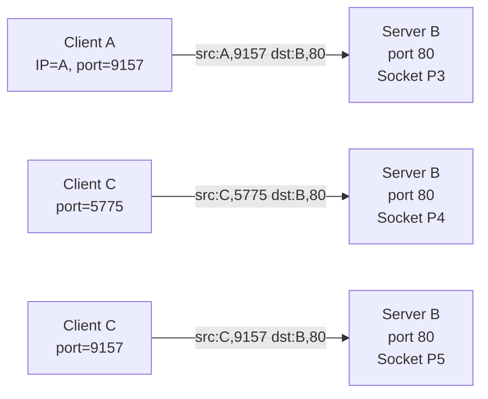

!!! note "Kết luận"
    - **UDP:** demux chỉ dùng `dest port`
    - **TCP:** demux dùng cả 4 thông tin: src IP, src port, dst IP, dst port
    - Multiplexing/demultiplexing hoạt động ở **tất cả các tầng**, không chỉ tầng vận chuyển.

---

## 3. UDP – User Datagram Protocol

### 3.1 Đặc điểm

UDP là giao thức **đơn giản nhất** của tầng vận chuyển, cung cấp dịch vụ **"best-effort"**:

- Segment có thể **bị mất**
- Segment có thể đến **không đúng thứ tự**
- **Không** thiết lập kết nối trước (giảm độ trễ)
- **Không** lưu trạng thái kết nối → đơn giản, nhẹ
- **Không** điều khiển tắc nghẽn → gửi nhanh nhất có thể
- Header rất **nhỏ gọn** (chỉ 8 bytes)

### 3.2 Tại sao vẫn dùng UDP?

!!! success "Ưu điểm của UDP"
    1. **Không có overhead thiết lập kết nối** → độ trễ thấp hơn TCP
    2. **Không lưu trạng thái** → server UDP có thể phục vụ nhiều client hơn
    3. **Header nhỏ** → overhead thấp
    4. **Không bị throttle bởi congestion control** → tốc độ gửi tối đa

**Ứng dụng sử dụng UDP:**
- Streaming multimedia (chịu được mất gói, nhạy cảm với tốc độ)
- DNS
- SNMP
- HTTP/3 (QUIC)

!!! tip "Nếu cần tin cậy qua UDP?"
    Các ứng dụng như HTTP/3 tự xử lý ở **tầng ứng dụng**:
    - Thêm cơ chế kiểm tra lỗi/truyền lại ở tầng ứng dụng
    - Thêm điều khiển tắc nghẽn ở tầng ứng dụng

### 3.3 Cấu trúc UDP Header

```
|  source port #  |   dest port #  |
|    length       |   checksum     |
|   application data (payload)...  |
```

- **length:** chiều dài tính theo byte của toàn bộ segment (header + data)
- **checksum:** kiểm tra lỗi

### 3.4 UDP Checksum

**Mục tiêu:** Phát hiện lỗi bit trong quá trình truyền (bit bị lật từ 0→1 hoặc 1→0).

**Bên gửi:**
1. Chia nội dung segment thành các chuỗi 16-bit
2. Tính **tổng bù một (one's complement sum)**
3. Đặt kết quả vào trường `checksum` trong header

**Bên nhận:**
1. Tính lại checksum của segment nhận được
2. So sánh với trường checksum trong header
    - Không bằng nhau → **có lỗi**
    - Bằng nhau → **không phát hiện lỗi** (nhưng không chắc không có lỗi!)

**Ví dụ tính checksum:**

```
  1 1 1 0 0 1 1 0 0 1 1 0 0 1 1 0
+ 1 1 0 1 0 1 0 1 0 1 0 1 0 1 0 1
= 1 1 0 1 1 1 0 1 1 1 0 1 1 1 0 1 1  ← 17 bit!
```

Khi kết quả là 17 bit, lấy bit dư (bit thứ 17) cộng vào 16 bit còn lại (wrap-around):

```
  1 0 1 1 1 0 1 1 1 0 1 1 1 1 0 0
+ 0 0 0 0 0 0 0 0 0 0 0 0 0 0 0 1
= 1 0 1 1 1 0 1 1 1 0 1 1 1 1 0 1  ← sum

Checksum = NOT(sum) = 0 1 0 0 0 1 0 0 0 1 0 0 0 0 1 1
```

!!! danger "Điểm yếu của Internet Checksum"
    Nếu **hai bit bị lỗi theo cặp đối xứng** (bit này lật 0→1, bit kia lật 1→0 ở cùng vị trí trong hai từ 16-bit khác nhau), tổng không thay đổi → checksum **không phát hiện được lỗi**!

---

## 4. Nguyên lý Truyền Dữ liệu Tin Cậy (RDT)

### 4.1 Bài toán

Tầng ứng dụng muốn giao tiếp qua một **kênh truyền tin cậy**, nhưng thực tế kênh bên dưới (tầng mạng) là **không tin cậy** (có thể mất gói, lỗi bit, trễ).

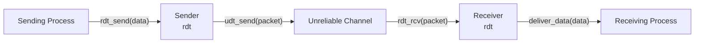

!!! info "Các hàm giao diện"
    - `rdt_send()`: Tầng ứng dụng gọi, truyền dữ liệu xuống
    - `udt_send()`: rdt gọi, gửi gói qua kênh không tin cậy
    - `rdt_rcv()`: Được gọi khi gói đến bên nhận
    - `deliver_data()`: rdt gọi, chuyển dữ liệu lên tầng ứng dụng

Giao thức sử dụng **Finite State Machine (FSM)** để mô tả hành vi.

---

### 4.2 RDT 1.0 – Kênh hoàn toàn tin cậy

**Giả định:** Kênh truyền hoàn toàn không có lỗi, không mất gói.

**Bên gửi:**
```
Chờ gọi từ tầng trên
  → rdt_send(data)
  → packet = make_pkt(data)
  → udt_send(packet)
```

**Bên nhận:**
```
Chờ gọi từ tầng dưới
  → rdt_rcv(packet)
  → extract(packet, data)
  → deliver_data(data)
```

> Đơn giản, không cần cơ chế phản hồi hay kiểm tra lỗi.

---

### 4.3 RDT 2.0 – Kênh có lỗi bit

**Vấn đề mới:** Kênh có thể làm lỗi bit trong packet (nhưng chưa mất gói).

**Cơ chế mới:**
- **Checksum:** Phát hiện lỗi bit
- **ACK (Acknowledgement):** Bên nhận báo gói đến thành công
- **NAK (Negative Acknowledgement):** Bên nhận báo gói bị lỗi
- **Retransmit:** Bên gửi gửi lại khi nhận NAK

**Giao thức stop-and-wait:** Bên gửi gửi một gói, chờ ACK/NAK mới gửi tiếp.

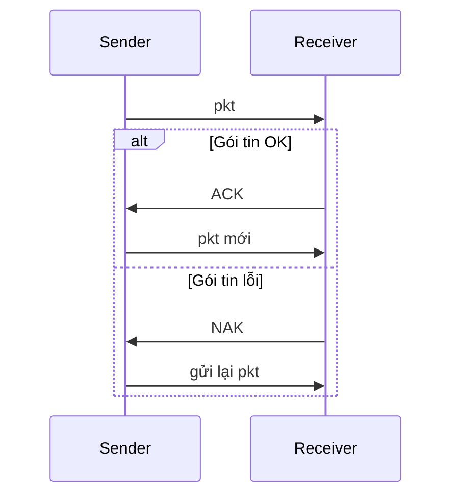

!!! danger "Lỗ hổng nghiêm trọng của RDT 2.0"
    **Điều gì xảy ra nếu ACK/NAK bị lỗi?**

    Bên gửi không biết bên nhận đã nhận thành công chưa. Nếu gửi lại → bên nhận nhận gói **trùng lặp** mà không biết đó là gói mới hay gói cũ!

---

### 4.4 RDT 2.1 – Xử lý ACK/NAK bị lỗi

**Giải pháp:** Thêm **số thứ tự (sequence number)** vào gói tin, chỉ cần 1 bit {0, 1}.

- Bên gửi thêm seq# vào mỗi gói
- Nếu ACK/NAK bị lỗi → gửi lại gói hiện tại
- Bên nhận kiểm tra seq# để phân biệt **gói mới** hay **gói trùng**:
    - Nếu trùng → bỏ qua, gửi lại ACK
    - Nếu mới → nhận, gửi ACK

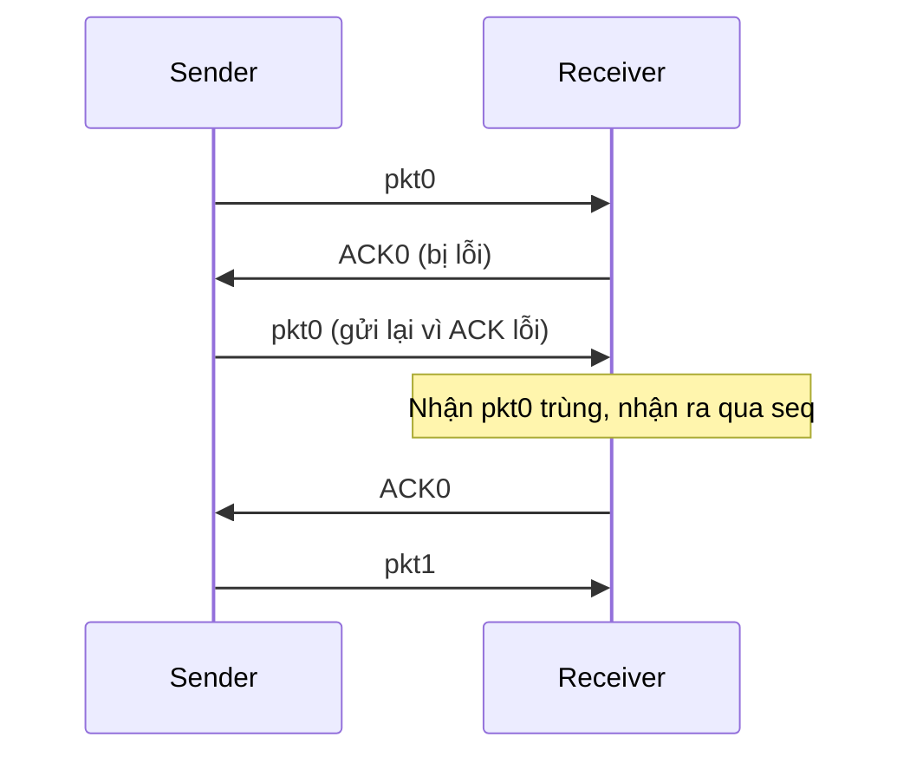

---

### 4.5 RDT 2.2 – Loại bỏ NAK

**Cải tiến:** Thay vì dùng cả ACK lẫn NAK, chỉ dùng **ACK**.

- Bên nhận gửi ACK **kèm số thứ tự** của gói cuối nhận thành công
- Nếu bên gửi nhận ACK trùng (ACK cho gói cũ) → hiểu như NAK → gửi lại

**Ví dụ:**
```
Sender gửi pkt1 → bị lỗi
Receiver không gửi NAK, thay vào đó gửi ACK0 (ACK của gói trước đó thành công)
Sender nhận ACK0 lại → nhận ra pkt1 chưa được nhận → gửi lại pkt1
```

---

### 4.6 RDT 3.0 – Kênh có lỗi và mất gói

**Vấn đề mới:** Kênh có thể **mất gói** (cả data lẫn ACK).

**Giải pháp:** Thêm **bộ định thì (timer)** ở bên gửi.

- Sau khi gửi gói, bắt đầu đếm thời gian
- Nếu không nhận được ACK trong khoảng thời gian hợp lý → **timeout** → gửi lại
- Nếu ACK chỉ bị **trễ** (không mất): gửi lại → trùng gói → seq# xử lý được

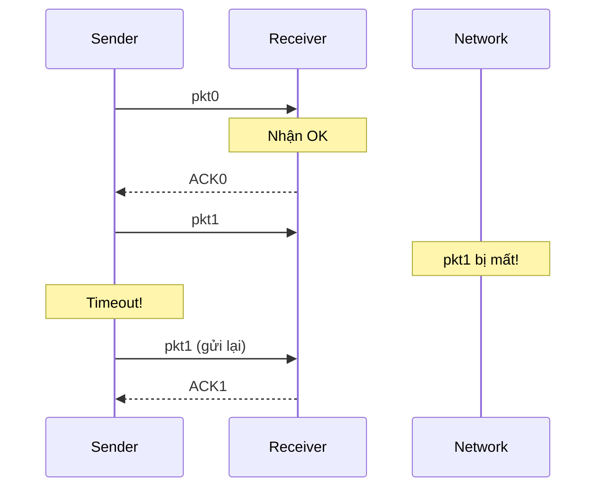

**4 tình huống của RDT 3.0:**

| Tình huống | Xử lý |
|---|---|
| Không mất mát | Bình thường |
| Mất gói data | Timeout → gửi lại |
| Mất ACK | Timeout → gửi lại data, receiver nhận trùng nhưng seq# giúp bỏ qua |
| ACK bị trễ (timeout quá ngắn) | Gửi lại → receiver nhận trùng → bỏ qua, gửi lại ACK |

---

### 4.7 Hiệu suất RDT 3.0 (Stop-and-Wait)

**Ví dụ:** Link 1 Gbps, gói 8000 bit, RTT = 30ms

```
Dtrans = L/R = 8000 bits / 10^9 bps = 8 microsec

U_sender = (L/R) / (RTT + L/R) = 0.008ms / 30.008ms ≈ 0.00027
```

!!! warning "Kết quả"
    Hiệu suất chỉ **0.027%**! Cực kỳ lãng phí băng thông. Hầu hết thời gian bên gửi chỉ ngồi chờ ACK.

---

### 4.8 Pipelining – Tăng hiệu suất

**Ý tưởng:** Thay vì gửi 1 gói rồi chờ, **gửi nhiều gói cùng lúc** mà không cần chờ ACK.

**Yêu cầu:**
- Tăng dải số thứ tự
- Buffer tại bên gửi và/hoặc bên nhận

**Tăng hiệu suất:** Gửi N gói cùng lúc → hiệu suất tăng N lần.

```
U_sender (3 gói) = 3 * (L/R) / (RTT + L/R) ≈ 0.00081  (tăng 3 lần)
```

Có hai cơ chế pipelining chính:

---

### 4.9 Go-Back-N (GBN)

**Bên gửi:**
- Duy trì một **sliding window** kích thước N: gửi tối đa N gói chưa được ACK
- **Cumulative ACK:** ACK(n) = xác nhận tất cả các gói đến và bao gồm gói n
- Timer cho gói cũ nhất chưa được ACK
- **Timeout(n):** Gửi lại TẤT CẢ gói từ n trở đi trong window

**Bên nhận:**
- Chỉ nhận gói **đúng thứ tự**
- Gói không đúng thứ tự → bỏ (hoặc buffer tùy triển khai) → gửi lại ACK của gói đúng thứ tự cuối cùng

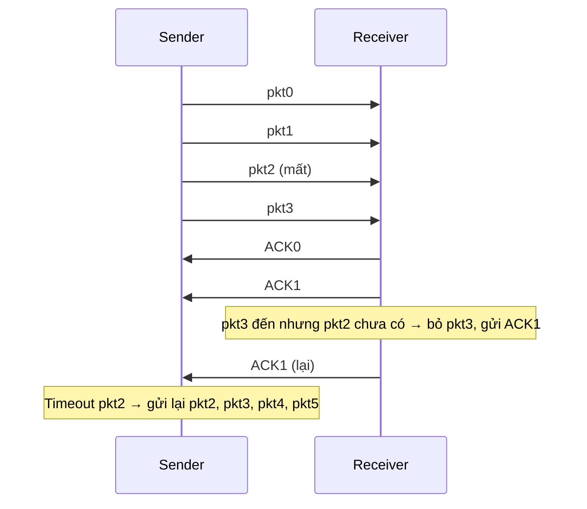

---

### 4.10 Selective Repeat (SR)

**Khác biệt với GBN:**
- Bên nhận **ACK từng gói riêng lẻ**, không cần đúng thứ tự
- Bên nhận **buffer** các gói đến đúng nhưng chưa đủ thứ tự
- Bên gửi chỉ gửi lại **gói bị lỗi/mất**, không gửi lại toàn bộ window

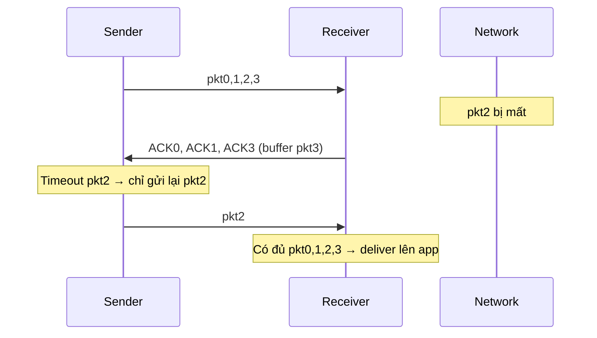

| | Go-Back-N | Selective Repeat |
|---|---|---|
| ACK | Tích lũy (cumulative) | Từng gói riêng lẻ |
| Timeout | Gửi lại toàn bộ window | Chỉ gửi lại gói bị lỗi |
| Buffer tại receiver | Không | Có |
| Hiệu quả | Thấp hơn khi mất nhiều | Cao hơn |

---

## 5. TCP – Transmission Control Protocol

### 5.1 Đặc điểm tổng quan

!!! success "TCP cung cấp"
    - **Point-to-point:** 1 bên gửi ↔ 1 bên nhận
    - **Tin cậy, đúng thứ tự theo byte**
    - **Full duplex:** Dữ liệu chạy 2 chiều trong cùng kết nối
    - **Cumulative ACK:** ACK tích lũy
    - **Pipelining:** Điều khiển tắc nghẽn + flow control với window size
    - **Hướng kết nối:** Handshake trước khi truyền
    - **Flow controlled:** Bên gửi không làm tràn bên nhận
    - **MSS (Maximum Segment Size):** Kích thước tối đa của 1 segment

### 5.2 Cấu trúc TCP Segment

```
|  source port #  |   dest port #    |
|         sequence number            |
|        acknowledgement number      |
| head len | not used | C E U A P R S F |  ← flags
|     receive window (rwnd)          |
|     checksum      |  urg data ptr  |
|        options (variable)          |
|        application data            |
```

**Các trường quan trọng:**
- **Sequence number:** Số thứ tự của byte đầu tiên trong segment
- **ACK number:** Seq# của byte **tiếp theo** bên nhận đang chờ (cumulative)
- **Receive window (rwnd):** Số byte bên nhận sẵn sàng nhận (flow control)
- **Flags:** SYN, FIN, ACK, RST, PSH, URG, C(ongestion), E(CE)

### 5.3 TCP Sequence Numbers và ACK

**Ví dụ:** Gửi 9000 bytes, mỗi segment tối đa 2000 bytes → 5 segments

```
Sender gửi:          Receiver phản hồi:
Seq=0,    len=2000  → ACK=2000  (tôi nhận đến byte 1999, muốn byte 2000)
Seq=2000, len=2000  → ACK=4000
Seq=4000, len=2000  → ACK=6000
Seq=6000, len=2000  → ACK=8000
Seq=8000, len=1000  → ACK=9000
```

**Ví dụ 2 chiều (full duplex):**
```
A gửi: Seq=42, ACK=79, data=30B   (gửi 30 byte, đang chờ byte 79 từ B)
B gửi: Seq=79, ACK=72, data=50B   (gửi 50 byte, đang chờ byte 72 từ A)
A gửi: Seq=72, ACK=129            (ACK cho 50 byte vừa nhận từ B)
```

### 5.4 TCP Timeout và Retransmission

**TCP Sender xử lý 3 sự kiện:**

1. **Nhận data từ app:** Tạo segment với seq#, bắt timer cho segment cũ nhất chưa ACK
2. **Timeout:** Gửi lại segment bị timeout, restart timer
3. **Nhận ACK:** Nếu ACK mới (chưa được ACK trước đó) → cập nhật trạng thái, restart timer cho segment chưa ACK

**TCP Receiver – Quy tắc gửi ACK:**

| Sự kiện | Hành động |
|---|---|
| Nhận segment đúng thứ tự, tất cả trước đó đã ACK | Chờ tối đa 500ms, nếu không có segment tiếp thì ACK |
| Nhận segment đúng thứ tự, còn 1 segment chưa ACK | Gửi ACK tích lũy ngay |
| Nhận segment không đúng thứ tự (có khoảng trống) | Gửi ACK trùng ngay, báo cho bên gửi biết đang chờ seq# nào |
| Nhận segment lấp đầy khoảng trống | ACK ngay |

### 5.5 Fast Retransmit (Truyền lại nhanh)

!!! tip "Cơ chế"
    Timeout có thể khá lâu. TCP có cơ chế phát hiện mất sớm hơn: nếu bên gửi nhận **3 ACK trùng lặp** (duplicate ACK) cho cùng một seq# → segment đó có khả năng đã bị mất → **gửi lại ngay** không cần chờ timeout.

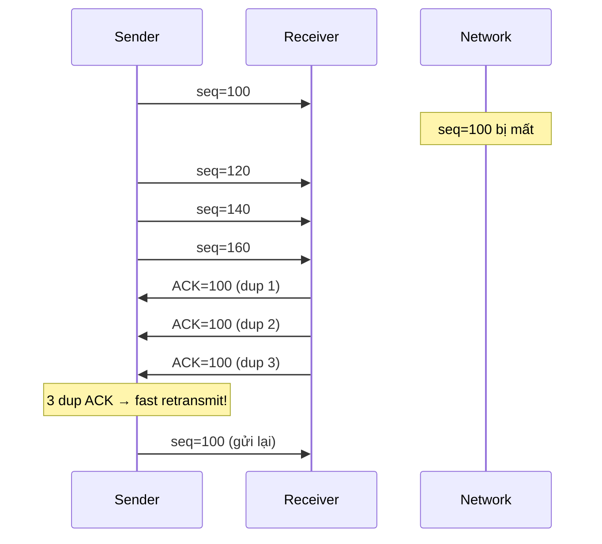

### 5.6 Flow Control – Điều khiển Luồng

**Vấn đề:** Nếu bên gửi gửi quá nhanh, buffer tại bên nhận sẽ bị tràn.

**Giải pháp:** Bên nhận thông báo cho bên gửi biết còn bao nhiêu chỗ trống trong buffer qua trường **`rwnd` (receive window)** trong TCP header.

```
RcvBuffer = Tổng buffer tại receiver
rwnd = RcvBuffer - [dữ liệu đã nhận nhưng chưa đọc]

Bên gửi đảm bảo: (dữ liệu đã gửi nhưng chưa ACK) ≤ rwnd
```

**Quy trình:**
```
Receiver → TCP header → rwnd = 2000 bytes
Sender → chỉ gửi tối đa 2000 bytes chưa ACK
```

### 5.7 TCP Connection Management – Quản lý Kết nối

#### 3-Way Handshake (Bắt tay 3 bước)

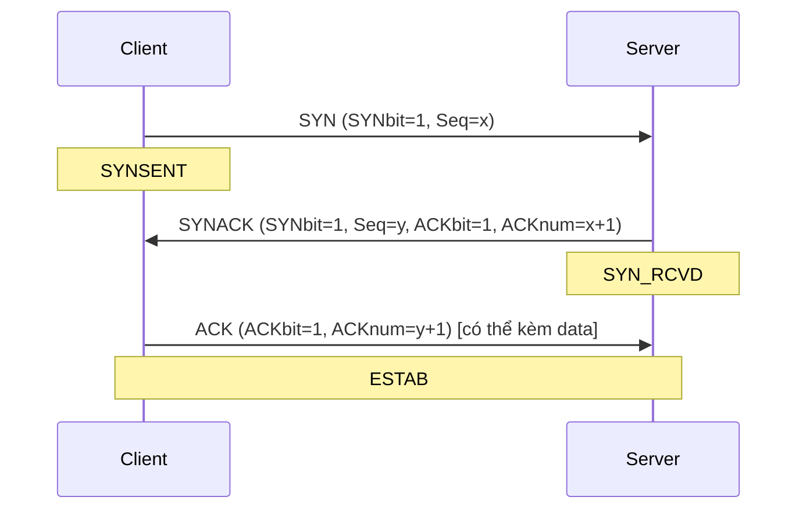

**Bước 1 – SYN:** Client chọn seq# khởi đầu x, gửi SYN  
**Bước 2 – SYNACK:** Server chọn seq# khởi đầu y, xác nhận SYN của client (ACK=x+1)  
**Bước 3 – ACK:** Client xác nhận SYN của server (ACK=y+1), có thể kèm data

!!! question "Tại sao cần 3 bước chứ không phải 2?"
    2 bước chỉ đảm bảo server biết client muốn kết nối, nhưng client chưa biết server có sẵn sàng hay không. Bước 3 xác nhận rằng cả hai bên đều sẵn sàng và biết seq# của nhau.

#### Đóng kết nối (4-way)

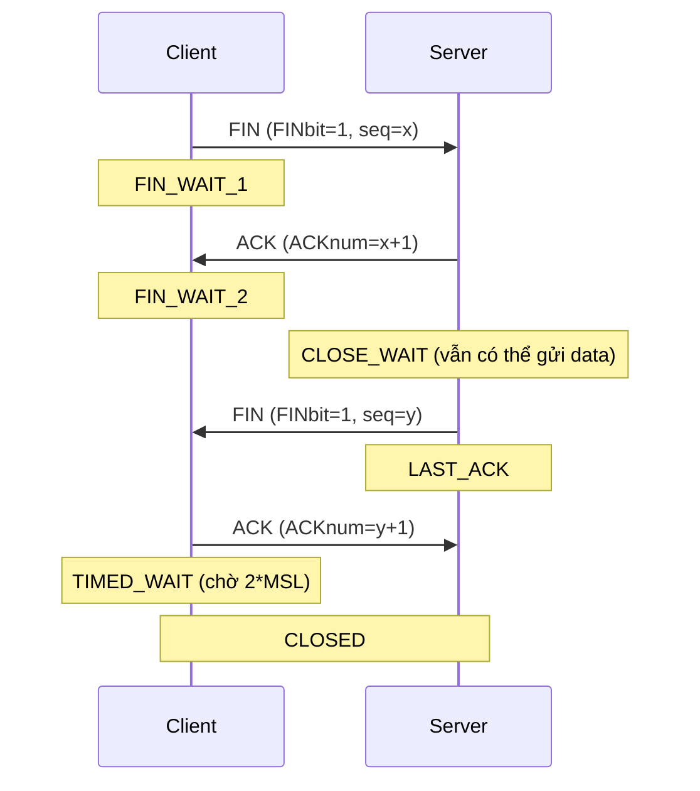

---

## 6. TCP – Điều khiển Tắc Nghẽn (Congestion Control)

### 6.1 AIMD – Additive Increase, Multiplicative Decrease

**Nguyên tắc cơ bản:** Liên tục thăm dò băng thông có thể dùng.

- **Additive Increase:** Tăng cwnd thêm 1 MSS mỗi RTT khi không mất gói → tìm điểm tắc nghẽn
- **Multiplicative Decrease:** Giảm cwnd xuống một nửa khi phát hiện mất gói → phản ứng với tắc nghẽn

```
TCP Sending Rate
    /\/\/\/\/\  ← dạng răng cưa đặc trưng của TCP AIMD
time
```

### 6.2 Các biến và trạng thái

**Biến quan trọng:**
- **cwnd (congestion window):** Số byte được gửi mà không cần chờ ACK
- **ssthresh (slow start threshold):** Ngưỡng chuyển từ Slow Start sang Congestion Avoidance

### 6.3 Ba giai đoạn

#### Giai đoạn 1: Slow Start

!!! info "Slow Start"
    - Ban đầu: `cwnd = 1 MSS`
    - Mỗi khi nhận ACK: `cwnd = cwnd + 1 MSS` → tăng theo **cấp số nhân** (exponential)
    - Cứ mỗi RTT: cwnd nhân đôi
    - Kết thúc khi: `cwnd >= ssthresh` → chuyển sang Congestion Avoidance
    
    Tên "slow start" vì bắt đầu chậm (cwnd=1), nhưng thực ra **tăng rất nhanh**!

#### Giai đoạn 2: Congestion Avoidance

!!! info "Congestion Avoidance"
    - Mỗi RTT: `cwnd = cwnd + 1 MSS` → tăng **tuyến tính** (linear)
    - Cẩn thận tiếp cận ngưỡng tắc nghẽn

#### Giai đoạn 3: Fast Recovery

!!! info "Fast Recovery"
    - Kích hoạt khi nhận **3 duplicate ACK**
    - `ssthresh = cwnd / 2`
    - `cwnd = ssthresh + 3`
    - Gửi lại segment bị mất
    - Mỗi duplicate ACK thêm: `cwnd = cwnd + 1`
    - Khi nhận ACK mới: `cwnd = ssthresh`, chuyển về Congestion Avoidance

### 6.4 Chuyển giai đoạn

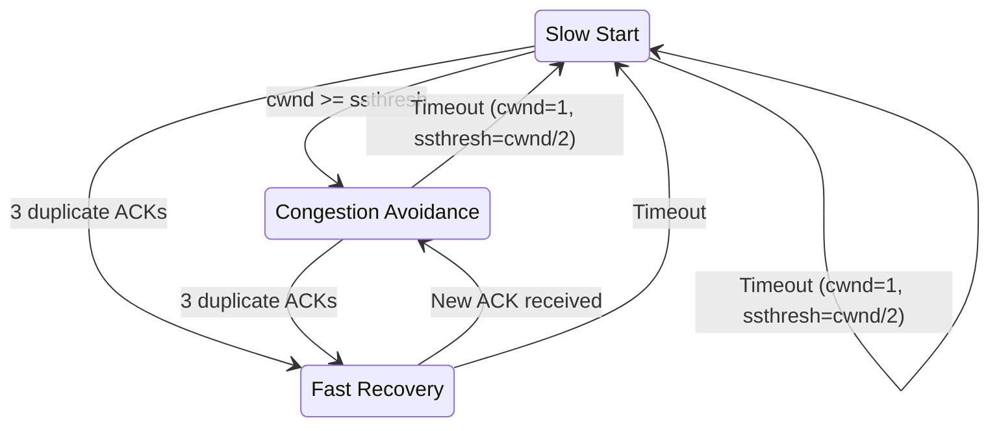

### 6.5 Sự khác biệt TCP Tahoe vs TCP Reno

| Sự kiện | TCP Tahoe | TCP Reno |
|---|---|---|
| Timeout | cwnd=1, về Slow Start | cwnd=1, về Slow Start |
| 3 dup ACK | cwnd=1, về Slow Start | cwnd=ssthresh+3, vào Fast Recovery |

TCP Reno nhẹ nhàng hơn với 3 dup ACK vì đây chưa phải tắc nghẽn nghiêm trọng.

---

## 7. Sự phát triển của Tầng Vận Chuyển – QUIC

### 7.1 Vấn đề với TCP truyền thống

| Kịch bản | Thách thức |
|---|---|
| Long fat pipes (truyền dữ liệu lớn) | Nhiều gói "in flight"; mất 1 gói shutdown toàn pipeline |
| Mạng không dây | Mất gói do nhiễu sóng, TCP hiểu nhầm là tắc nghẽn |
| Đường truyền độ trễ cao | RTT cực lớn |
| Mạng datacenter | Nhạy cảm với độ trễ |

### 7.2 QUIC – Quick UDP Internet Connections

**QUIC** là giao thức tầng ứng dụng chạy **trên UDP**, thiết kế để tăng hiệu suất HTTP.

```
HTTP/2 over TCP:          HTTP/3 (over QUIC over UDP):
┌─────────────┐           ┌──────────────────┐
│   HTTP/2    │           │  HTTP/2 (slimmed) │
├─────────────┤           ├──────────────────┤
│    TLS      │           │      QUIC        │
├─────────────┤           ├──────────────────┤
│    TCP      │           │      UDP         │
├─────────────┤           ├──────────────────┤
│     IP      │           │       IP         │
└─────────────┘           └──────────────────┘
```

**Ưu điểm của QUIC:**

1. **Connection establishment nhanh hơn:**
    - TCP + TLS cần 2 handshake nối tiếp (2 RTT)
    - QUIC chỉ cần **1 RTT** (kết hợp reliability + congestion control + authentication + crypto)

2. **Multiplexing streams, không có HOL blocking:**
    - HTTP/2 over TCP: nếu 1 stream bị lỗi → tất cả stream sau đó bị chặn (Head-of-Line blocking)
    - QUIC: mỗi stream có RDT riêng → lỗi 1 stream không ảnh hưởng stream khác

3. **Tương thích với thuật toán TCP:**
    > "Readers familiar with TCP's loss detection and congestion control will find algorithms here that parallel well-known TCP ones." – QUIC specification

---

## 8. Tổng kết Chương 3

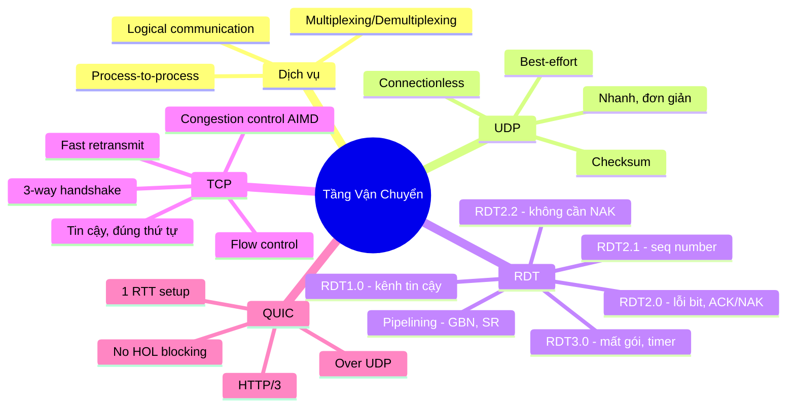

---

## 📝 50+ Câu trắc nghiệm

---

**Câu 1.** Tầng vận chuyển cung cấp truyền thông luận lý giữa:

- A. Hai router liền kề
- B. Hai host khác nhau
- C. Hai tiến trình ứng dụng trên các host khác nhau
- D. Hai tầng mạng khác nhau

??? info "Đáp án & Giải thích"
    **Đáp án: C**
    Tầng mạng cung cấp giao tiếp host-to-host, còn tầng vận chuyển đi sâu hơn: giao tiếp **process-to-process** (tiến trình với tiến trình), dùng port number để phân biệt tiến trình.

---

**Câu 2.** Khi bên gửi ở tầng vận chuyển "đóng gói" dữ liệu, đơn vị dữ liệu tạo ra được gọi là:

- A. Frame
- B. Datagram
- C. Segment
- D. Packet

??? info "Đáp án & Giải thích"
    **Đáp án: C**
    Tầng vận chuyển tạo ra **segment**. Tầng mạng tạo datagram/packet, tầng liên kết tạo frame.

---

**Câu 3.** Multiplexing tại bên gửi là quá trình:

- A. Chuyển segment đến đúng socket
- B. Nhận dữ liệu từ nhiều socket và thêm header tầng vận chuyển
- C. Kiểm tra lỗi trong segment
- D. Thiết lập kết nối với bên nhận

??? info "Đáp án & Giải thích"
    **Đáp án: B**
    **Multiplexing** = thu gom dữ liệu từ nhiều socket, đóng gói header và gửi đi. **Demultiplexing** là chiều ngược lại – phân phối đến đúng socket.

---

**Câu 4.** UDP sử dụng thông tin gì để demultiplexing?

- A. Chỉ source port
- B. Chỉ destination port
- C. Source IP + destination IP + source port + destination port
- D. Source IP + destination port

??? info "Đáp án & Giải thích"
    **Đáp án: B**
    UDP demultiplexing chỉ dùng **destination port number**. Hai datagram từ nguồn khác nhau nhưng cùng dest port sẽ đến cùng một socket.

---

**Câu 5.** TCP sử dụng bao nhiêu thông tin để demultiplexing?

- A. 1 (chỉ destination port)
- B. 2 (source port + destination port)
- C. 3 (source IP + source port + destination port)
- D. 4 (source IP, source port, destination IP, destination port)

??? info "Đáp án & Giải thích"
    **Đáp án: D**
    TCP dùng **4-tuple** để demux: source IP, source port, destination IP, destination port. Điều này cho phép server phục vụ nhiều client cùng port nhưng mỗi client có socket riêng.

---

**Câu 6.** Hai client A và C cùng kết nối đến server B port 80. Theo TCP, server B sẽ:

- A. Từ chối kết nối thứ hai vì port 80 đang bận
- B. Tạo hai socket riêng biệt, mỗi socket cho một client
- C. Dùng một socket duy nhất cho cả hai client
- D. Yêu cầu một trong hai client đổi port

??? info "Đáp án & Giải thích"
    **Đáp án: B**
    TCP dùng 4-tuple để phân biệt kết nối. Dù cùng dest port 80, hai kết nối từ A và C có src IP/port khác nhau → **hai socket riêng biệt**.

---

**Câu 7.** Đặc điểm nào sau đây KHÔNG phải của UDP?

- A. Connectionless
- B. Best-effort delivery
- C. Có cơ chế điều khiển tắc nghẽn
- D. Header nhỏ gọn

??? info "Đáp án & Giải thích"
    **Đáp án: C**
    UDP **không có** congestion control. Đây là một trong những lý do UDP nhanh hơn TCP nhưng cũng có thể làm tắc nghẽn mạng nếu gửi quá nhiều.

---

**Câu 8.** Kích thước của UDP header là:

- A. 20 bytes
- B. 12 bytes
- C. 8 bytes
- D. 4 bytes

??? info "Đáp án & Giải thích"
    **Đáp án: C**
    UDP header chỉ có **8 bytes**: 2 bytes source port + 2 bytes dest port + 2 bytes length + 2 bytes checksum. TCP header tối thiểu 20 bytes.

---

**Câu 9.** Trường `length` trong UDP header có ý nghĩa gì?

- A. Độ dài chỉ phần header
- B. Độ dài chỉ phần data
- C. Độ dài toàn bộ segment (header + data) tính theo byte
- D. Số lượng segment trong chuỗi

??? info "Đáp án & Giải thích"
    **Đáp án: C**
    Trường `length` = tổng số byte của UDP segment bao gồm cả header (8 bytes) và data.

---

**Câu 10.** Mục đích của Internet Checksum là:

- A. Mã hóa dữ liệu
- B. Phát hiện lỗi bit trong quá trình truyền
- C. Sửa lỗi bit
- D. Xác thực người dùng

??? info "Đáp án & Giải thích"
    **Đáp án: B**
    Checksum chỉ **phát hiện** lỗi, không sửa lỗi. Khi phát hiện lỗi, UDP đơn giản là bỏ gói (không có cơ chế yêu cầu gửi lại).

---

**Câu 11.** Điểm yếu của Internet Checksum là:

- A. Tính toán quá chậm
- B. Không thể phát hiện khi hai bit bị lỗi theo cặp đối xứng
- C. Header quá lớn
- D. Chỉ hoạt động với IPv4

??? info "Đáp án & Giải thích"
    **Đáp án: B**
    Nếu hai bit bị lỗi ở hai từ 16-bit khác nhau, theo cách đối xứng nhau, tổng one's complement không thay đổi → checksum không phát hiện được.

---

**Câu 12.** Trong RDT 1.0, tại sao không cần cơ chế ACK/NAK?

- A. Vì kênh truyền quá nhanh
- B. Vì kênh truyền được giả định là hoàn toàn tin cậy, không có lỗi
- C. Vì bên nhận tự sửa lỗi
- D. Vì chỉ truyền một gói

??? info "Đáp án & Giải thích"
    **Đáp án: B**
    RDT 1.0 giả định kênh truyền hoàn toàn tin cậy → không cần kiểm tra lỗi hay phản hồi.

---

**Câu 13.** ACK là viết tắt của gì và có ý nghĩa gì?

- A. Automatic Check Key – kiểm tra tự động
- B. Acknowledgement – bên nhận xác nhận đã nhận gói thành công
- C. Address Control Key – kiểm soát địa chỉ
- D. Active Connection Keep – duy trì kết nối

??? info "Đáp án & Giải thích"
    **Đáp án: B**
    **ACK = Acknowledgement**: bên nhận gửi về bên gửi để thông báo gói đã được nhận **thành công**. NAK (Negative Acknowledgement) báo ngược lại.

---

**Câu 14.** Lỗ hổng nghiêm trọng của RDT 2.0 là gì?

- A. Không có checksum
- B. Không xử lý được khi ACK/NAK bị lỗi trong quá trình truyền
- C. Quá chậm
- D. Không hoạt động trên mạng không dây

??? info "Đáp án & Giải thích"
    **Đáp án: B**
    Nếu ACK/NAK bị lỗi, bên gửi không biết phải làm gì. Gửi lại có thể gây ra gói trùng, mà bên nhận không có cách phân biệt gói mới hay gói cũ gửi lại.

---

**Câu 15.** RDT 2.1 giải quyết vấn đề ACK/NAK bị lỗi bằng cách nào?

- A. Mã hóa ACK/NAK
- B. Thêm số thứ tự (sequence number) vào gói tin
- C. Gửi ACK/NAK nhiều lần
- D. Tăng kích thước checksum

??? info "Đáp án & Giải thích"
    **Đáp án: B**
    Thêm **seq# {0, 1}** vào gói tin: bên nhận có thể phân biệt gói mới (seq# khác) với gói cũ gửi lại (seq# giống), từ đó xử lý đúng.

---

**Câu 16.** Trong RDT 2.2, NAK được thay thế bằng cách nào?

- A. Bên nhận gửi ACK kèm bit lỗi
- B. Bên nhận gửi lại ACK của gói cuối cùng nhận thành công (ACK trùng)
- C. Bên nhận im lặng khi nhận gói lỗi
- D. Bên nhận gửi SYN

??? info "Đáp án & Giải thích"
    **Đáp án: B**
    RDT 2.2 không dùng NAK. Thay vào đó, bên nhận gửi **ACK của gói cuối cùng nhận OK** (kèm seq# rõ ràng). Bên gửi nhận ACK trùng → hiểu như NAK → gửi lại.

---

**Câu 17.** RDT 3.0 thêm cơ chế gì so với RDT 2.2?

- A. Checksum
- B. Sequence number
- C. Bộ định thì (timer) để xử lý mất gói
- D. Flow control

??? info "Đáp án & Giải thích"
    **Đáp án: C**
    RDT 3.0 xử lý **mất gói** bằng cách thêm **timer**: sau khi gửi, bắt đầu đếm thời gian. Nếu hết thời gian mà không nhận ACK → timeout → gửi lại.

---

**Câu 18.** Trong RDT 3.0, nếu ACK bị trễ (không mất, chỉ chậm) và bên gửi đã timeout gửi lại, điều gì xảy ra?

- A. Mạng bị tắc nghẽn
- B. Bên nhận nhận gói trùng, nhưng seq# giúp phát hiện và bỏ qua, gửi lại ACK
- C. Kết nối bị đóng
- D. Cả hai bên đều dừng lại

??? info "Đáp án & Giải thích"
    **Đáp án: B**
    Bên nhận nhận gói có seq# đã nhận trước đó → biết là **gói trùng** → bỏ qua (không deliver lên app) nhưng vẫn gửi lại ACK để bên gửi biết.

---

**Câu 19.** Hiệu suất của RDT 3.0 (stop-and-wait) với link 1 Gbps, gói 8000 bit, RTT = 30ms là:

- A. Khoảng 50%
- B. Khoảng 10%
- C. Khoảng 0.027%
- D. Khoảng 1%

??? info "Đáp án & Giải thích"
    **Đáp án: C**
    `U = (L/R)/(RTT + L/R) = 0.008ms/30.008ms ≈ 0.00027 = 0.027%`. Stop-and-wait cực kỳ kém hiệu quả trên đường truyền nhanh và có độ trễ cao.

---

**Câu 20.** Pipelining giải quyết vấn đề gì của stop-and-wait?

- A. Mất gói
- B. Hiệu suất thấp do bên gửi phải chờ ACK sau mỗi gói
- C. Lỗi bit
- D. Tắc nghẽn mạng

??? info "Đáp án & Giải thích"
    **Đáp án: B**
    Pipelining cho phép gửi **nhiều gói cùng lúc** mà không cần chờ ACK → tận dụng băng thông, tăng hiệu suất đáng kể. Gửi N gói cùng lúc → hiệu suất tăng N lần.

---

**Câu 21.** Trong Go-Back-N, khi segment số 3 bị mất, bên gửi sẽ:

- A. Chỉ gửi lại segment 3
- B. Gửi lại tất cả segments từ 3 trở đi trong window
- C. Đóng kết nối
- D. Chờ bên nhận yêu cầu gửi lại

??? info "Đáp án & Giải thích"
    **Đáp án: B**
    GBN: khi timeout cho segment n → gửi lại **tất cả** segments từ n đến send_base+N-1. "Go Back N" vì quay lại gửi từ gói bị lỗi.

---

**Câu 22.** Trong Go-Back-N, bên nhận nhận được segment không đúng thứ tự thì:

- A. Buffer lại và chờ segment còn thiếu
- B. Gửi ACK tích lũy cho segment đúng thứ tự cao nhất, bỏ segment không đúng thứ tự
- C. Gửi NAK
- D. Yêu cầu gửi lại toàn bộ window

??? info "Đáp án & Giải thích"
    **Đáp án: B**
    GBN receiver đơn giản: chỉ nhận đúng thứ tự. Nhận segment out-of-order → **bỏ** → gửi lại ACK của segment đúng thứ tự cao nhất đã nhận.

---

**Câu 23.** Selective Repeat khác Go-Back-N ở điểm nào?

- A. SR dùng window size lớn hơn
- B. SR chỉ gửi lại segment bị lỗi, còn GBN gửi lại toàn bộ window từ segment lỗi
- C. SR không dùng ACK
- D. SR không dùng sequence number

??? info "Đáp án & Giải thích"
    **Đáp án: B**
    **Selective Repeat** = chọn lọc: chỉ gửi lại những gói cụ thể bị lỗi/mất. SR receiver có **buffer** để giữ các gói đến đúng nhưng chưa đủ thứ tự.

---

**Câu 24.** TCP là giao thức:

- A. Connectionless, không tin cậy
- B. Connection-oriented, tin cậy, đúng thứ tự
- C. Connection-oriented, không tin cậy
- D. Connectionless, tin cậy

??? info "Đáp án & Giải thích"
    **Đáp án: B**
    TCP: **hướng kết nối** (phải handshake trước), **tin cậy** (đảm bảo mọi byte đến nơi), **đúng thứ tự** (byte stream theo thứ tự).

---

**Câu 25.** MSS trong TCP là gì?

- A. Maximum Segment Size – kích thước tối đa của một TCP segment
- B. Minimum Segment Size
- C. Maximum Server Speed
- D. Minimum Sequence Size

??? info "Đáp án & Giải thích"
    **Đáp án: A**
    **MSS = Maximum Segment Size**: kích thước tối đa của phần dữ liệu trong một TCP segment. Thường được xác định dựa trên MTU của đường truyền.

---

**Câu 26.** Trường `sequence number` trong TCP header cho biết:

- A. Số lượng segment đã gửi
- B. Số thứ tự của segment hiện tại
- C. Số thứ tự của **byte đầu tiên** trong segment
- D. Tổng số byte đã gửi

??? info "Đáp án & Giải thích"
    **Đáp án: C**
    TCP đánh số **byte** (không phải segment). Seq# = byte offset của byte đầu tiên trong segment so với đầu data stream.

---

**Câu 27.** Trường `acknowledgement number` trong TCP có nghĩa là:

- A. Số gói đã nhận
- B. Seq# của **byte tiếp theo** bên nhận đang mong chờ (ACK tích lũy)
- C. Số lỗi đã phát hiện
- D. Số thứ tự của ACK

??? info "Đáp án & Giải thích"
    **Đáp án: B**
    ACK# = "Tôi đã nhận đủ đến byte X-1, hãy gửi tiếp từ byte X". ACK mang tính **tích lũy**: xác nhận tất cả bytes trước đó.

---

**Câu 28.** A gửi segment với Seq=42, ACK=79, data=30B. Điều này có nghĩa là:

- A. A gửi 42 bytes, đang chờ byte 79 từ B
- B. A gửi 30 bytes bắt đầu từ byte 42, đồng thời xác nhận đã nhận đến byte 78 từ B
- C. A gửi 79 bytes, nhận được 42 bytes
- D. A đang ở kết nối thứ 42

??? info "Đáp án & Giải thích"
    **Đáp án: B**
    Seq=42: byte đầu tiên của data là byte số 42. ACK=79: A xác nhận đã nhận tất cả bytes từ B đến byte 78, muốn nhận từ byte 79. data=30B: gửi 30 bytes.

---

**Câu 29.** TCP timeout và fast retransmit khác nhau như thế nào?

- A. Timeout nhanh hơn fast retransmit
- B. Fast retransmit kích hoạt khi nhận 3 duplicate ACK, không cần chờ timer hết hạn
- C. Chỉ có timeout trong TCP thực tế
- D. Fast retransmit dùng cho UDP

??? info "Đáp án & Giải thích"
    **Đáp án: B**
    **Fast Retransmit**: nhận 3 dup ACK → gửi lại ngay (không chờ timeout). Nhanh hơn vì timeout có thể mất vài giây, trong khi 3 dup ACK đến rất nhanh.

---

**Câu 30.** TCP Receiver sẽ làm gì khi nhận segment đúng thứ tự nhưng còn 1 segment trước đó chưa được ACK?

- A. Chờ 500ms rồi mới ACK
- B. Gửi ngay ACK tích lũy cho cả 2 segment
- C. Bỏ segment
- D. Gửi NAK

??? info "Đáp án & Giải thích"
    **Đáp án: B**
    Theo RFC 5681: nếu nhận segment đúng thứ tự và còn 1 unacked segment → **gửi ngay ACK tích lũy** (piggybacking), ACK cho cả 2 cùng lúc.

---

**Câu 31.** Flow control trong TCP giải quyết vấn đề gì?

- A. Tắc nghẽn tại router
- B. Bên gửi gửi quá nhanh làm tràn buffer của bên nhận
- C. Lỗi bit trong kênh truyền
- D. Mất gói trong mạng

??? info "Đáp án & Giải thích"
    **Đáp án: B**
    **Flow control**: kiểm soát tốc độ gửi để phù hợp với **khả năng xử lý của bên nhận**. Khác với congestion control (kiểm soát tắc nghẽn của mạng).

---

**Câu 32.** Trường `rwnd` trong TCP header được dùng để:

- A. Điều khiển tắc nghẽn
- B. Thông báo cho bên gửi biết còn bao nhiêu không gian trống trong buffer của bên nhận
- C. Đánh số thứ tự
- D. Kiểm tra lỗi

??? info "Đáp án & Giải thích"
    **Đáp án: B**
    **rwnd (receive window)**: bên nhận đặt giá trị này trong TCP header để báo cho bên gửi biết buffer còn trống bao nhiêu byte. Bên gửi không gửi vượt quá rwnd.

---

**Câu 33.** TCP 3-way handshake gồm các bước theo thứ tự nào?

- A. ACK → SYN → SYNACK
- B. SYN → SYNACK → ACK
- C. SYNACK → SYN → ACK
- D. SYN → ACK → SYNACK

??? info "Đáp án & Giải thích"
    **Đáp án: B**
    1. Client → Server: **SYN** (tôi muốn kết nối, seq=x)
    2. Server → Client: **SYNACK** (OK, seq=y, ack=x+1)
    3. Client → Server: **ACK** (OK, ack=y+1)

---

**Câu 34.** Trong quá trình đóng kết nối TCP, trạng thái `TIMED_WAIT` kéo dài bao lâu và tại sao?

- A. 1 giây, để giải phóng tài nguyên
- B. 2*MSL (Maximum Segment Lifetime), để đảm bảo ACK cuối cùng không bị mất
- C. Bằng RTT, để nhận dữ liệu còn lại
- D. Vô thời hạn cho đến khi server đóng

??? info "Đáp án & Giải thích"
    **Đáp án: B**
    **TIMED_WAIT** = 2*MSL: đủ thời gian để ACK cuối đến server và để các segment cũ hết hạn trong mạng. Tránh trường hợp ACK bị mất khiến server timeout và gửi lại FIN.

---

**Câu 35.** AIMD trong TCP congestion control viết tắt của:

- A. Adaptive Increase, Maximum Decrease
- B. Additive Increase, Multiplicative Decrease
- C. Automatic Internet Multiplexing Delay
- D. Asynchronous In-order Message Delivery

??? info "Đáp án & Giải thích"
    **Đáp án: B**
    **AIMD = Additive Increase, Multiplicative Decrease**: tăng tuyến tính khi không tắc nghẽn, giảm theo hệ số khi có tắc nghẽn. Tạo ra dạng sóng răng cưa đặc trưng.

---

**Câu 36.** Trong TCP Slow Start, cwnd tăng như thế nào?

- A. Tăng 1 MSS mỗi RTT (tuyến tính)
- B. Tăng gấp đôi mỗi RTT (theo cấp số nhân)
- C. Không thay đổi
- D. Giảm dần

??? info "Đáp án & Giải thích"
    **Đáp án: B**
    Slow Start: mỗi ACK nhận được → cwnd += 1 MSS → mỗi RTT **nhân đôi** cwnd. "Slow" vì bắt đầu từ 1 MSS, nhưng thực ra tăng **rất nhanh** theo cấp số nhân.

---

**Câu 37.** `ssthresh` (slow start threshold) có vai trò gì?

- A. Giới hạn tối đa của cwnd
- B. Ngưỡng chuyển từ Slow Start sang Congestion Avoidance
- C. Kích thước buffer tại router
- D. Thời gian chờ tối thiểu

??? info "Đáp án & Giải thích"
    **Đáp án: B**
    Khi cwnd < ssthresh → Slow Start (tăng nhanh). Khi cwnd ≥ ssthresh → Congestion Avoidance (tăng chậm). ssthresh được cập nhật khi có sự kiện mất gói.

---

**Câu 38.** Trong Congestion Avoidance, cwnd tăng như thế nào?

- A. Nhân đôi mỗi RTT
- B. Tăng 1 MSS mỗi RTT (tuyến tính)
- C. Tăng theo bình phương
- D. Không thay đổi

??? info "Đáp án & Giải thích"
    **Đáp án: B**
    Congestion Avoidance: `cwnd += MSS*(MSS/cwnd)` mỗi ACK → tổng cộng tăng 1 MSS mỗi RTT. Tăng **tuyến tính**, cẩn thận tiếp cận điểm tắc nghẽn.

---

**Câu 39.** Khi TCP phát hiện mất gói qua **timeout**, điều gì xảy ra với cwnd và ssthresh?

- A. cwnd = cwnd/2, ssthresh = cwnd
- B. cwnd = 1 MSS, ssthresh = cwnd_trước/2, quay về Slow Start
- C. cwnd không đổi, ssthresh = 0
- D. Kết nối đóng lại

??? info "Đáp án & Giải thích"
    **Đáp án: B**
    Timeout = dấu hiệu tắc nghẽn nghiêm trọng: `ssthresh = cwnd/2`, `cwnd = 1 MSS`, quay về **Slow Start**. Cả TCP Tahoe và TCP Reno đều xử lý timeout như vậy.

---

**Câu 40.** Khi TCP phát hiện mất gói qua **3 duplicate ACK**, TCP Reno xử lý thế nào?

- A. Giống timeout: cwnd = 1 MSS, về Slow Start
- B. cwnd = ssthresh + 3, vào Fast Recovery
- C. Không làm gì, chờ timeout
- D. Gửi lại toàn bộ window

??? info "Đáp án & Giải thích"
    **Đáp án: B**
    TCP Reno: 3 dup ACK → `ssthresh = cwnd/2`, `cwnd = ssthresh + 3`, vào **Fast Recovery**. Nhẹ nhàng hơn timeout vì 3 dup ACK chứng tỏ mạng vẫn còn hoạt động (các segment sau vẫn đến).

---

**Câu 41.** Điểm khác biệt chính giữa TCP Tahoe và TCP Reno khi nhận 3 duplicate ACK là:

- A. TCP Tahoe nhanh hơn
- B. TCP Tahoe về cwnd=1 và Slow Start, TCP Reno dùng Fast Recovery
- C. TCP Reno không có ssthresh
- D. TCP Tahoe dùng UDP

??? info "Đáp án & Giải thích"
    **Đáp án: B**
    - **TCP Tahoe:** 3 dup ACK → cwnd=1, ssthresh=cwnd/2, về Slow Start (xử lý như timeout)
    - **TCP Reno:** 3 dup ACK → Fast Recovery (nhẹ nhàng hơn, không về 1 MSS)

---

**Câu 42.** QUIC là giao thức ở tầng nào và chạy trên giao thức nào?

- A. Tầng mạng, chạy trên IP
- B. Tầng vận chuyển, chạy trên TCP
- C. Tầng ứng dụng, chạy trên UDP
- D. Tầng liên kết, chạy trên Ethernet

??? info "Đáp án & Giải thích"
    **Đáp án: C**
    QUIC là giao thức **tầng ứng dụng**, chạy **trên UDP**. Đây là xu hướng "moving transport-layer functions to application layer, on top of UDP".

---

**Câu 43.** QUIC cần bao nhiêu RTT để thiết lập kết nối so với TCP+TLS?

- A. QUIC cần 3 RTT, TCP+TLS cần 1 RTT
- B. QUIC cần 1 RTT, TCP+TLS cần 2 RTT (TCP handshake + TLS handshake riêng biệt)
- C. Cả hai đều cần 2 RTT
- D. QUIC không cần handshake

??? info "Đáp án & Giải thích"
    **Đáp án: B**
    TCP: 3-way handshake + TLS handshake riêng = tối thiểu 2 RTT nối tiếp. QUIC kết hợp cả reliability, congestion control, authentication, crypto trong **1 handshake = 1 RTT**.

---

**Câu 44.** HOL blocking (Head-of-Line blocking) trong HTTP/2 over TCP là gì?

- A. Header quá lớn làm chậm kết nối
- B. Một stream bị lỗi làm chặn tất cả các stream khác trong cùng TCP connection
- C. Quá nhiều kết nối TCP cùng lúc
- D. Bộ đệm tại đầu dòng dữ liệu bị đầy

??? info "Đáp án & Giải thích"
    **Đáp án: B**
    HTTP/2 multiplexes nhiều stream trên 1 TCP connection. Nếu 1 gói TCP bị mất → TCP phải gửi lại → **tất cả streams** phải chờ → HOL blocking. QUIC giải quyết bằng cách mỗi stream có RDT riêng.

---

**Câu 45.** Ứng dụng nào sau đây phù hợp nhất với UDP?

- A. File transfer (FTP)
- B. Web browsing (HTTP)
- C. Email (SMTP)
- D. Video streaming trực tiếp (live streaming)

??? info "Đáp án & Giải thích"
    **Đáp án: D**
    Video streaming trực tiếp: chịu được mất vài gói (một khung hình lỗi nhỏ), nhưng rất nhạy cảm với độ trễ (dữ liệu cũ không cần gửi lại). UDP phù hợp hơn TCP cho trường hợp này.

---

**Câu 46.** DNS thường sử dụng giao thức nào ở tầng vận chuyển và tại sao?

- A. TCP, vì cần tin cậy tuyệt đối
- B. UDP, vì query/response nhỏ, cần nhanh, ứng dụng tự retry nếu cần
- C. Cả TCP lẫn UDP đều không dùng
- D. QUIC

??? info "Đáp án & Giải thích"
    **Đáp án: B**
    DNS dùng **UDP** vì: query/response rất nhỏ (fit trong 1 packet), cần low latency, ứng dụng DNS tự xử lý retry. (TCP được dùng cho DNS zone transfer hoặc khi response > 512 bytes.)

---

**Câu 47.** Trong TCP, "full duplex" có nghĩa là:

- A. Chỉ bên gửi mới có thể truyền dữ liệu
- B. Dữ liệu chạy hai chiều trong cùng một kết nối TCP
- C. Kết nối TCP cần hai kênh riêng biệt
- D. TCP truyền dữ liệu hai lần để đảm bảo tin cậy

??? info "Đáp án & Giải thích"
    **Đáp án: B**
    **Full duplex**: cả A→B và B→A đều có thể xảy ra đồng thời trong cùng một kết nối TCP. ACK và data thường được gửi cùng nhau (piggybacking).

---

**Câu 48.** Khi tính checksum của UDP, nếu tổng các từ 16-bit cho kết quả 17-bit, cách xử lý là:

- A. Bỏ bit dư
- B. Lấy bit thứ 17 (bit carry) cộng vào 16 bit còn lại (wrap-around)
- C. Lấy bit thứ 17 nhân với checksum
- D. Gửi lại gói tin

??? info "Đáp án & Giải thích"
    **Đáp án: B**
    **Wrap-around**: khi tổng bị carry (17 bit), lấy bit carry cộng ngược vào 16 bit thấp. Đây là đặc điểm của phép tính **one's complement sum**.

---

**Câu 49.** Trong FSM của rdt2.0, khi bên gửi đang ở trạng thái "Chờ ACK hoặc NAK" và nhận được ACK hợp lệ, bên gửi sẽ:

- A. Gửi lại gói hiện tại
- B. Chuyển về trạng thái "Chờ gọi từ tầng trên" để nhận data mới
- C. Đóng kết nối
- D. Gửi NAK

??? info "Đáp án & Giải thích"
    **Đáp án: B**
    Nhận ACK hợp lệ → gói đã được nhận thành công → chuyển về **"Chờ gọi từ tầng trên"** để gửi gói tiếp theo.

---

**Câu 50.** Giao thức nào sau đây KHÔNG phải là giao thức tầng vận chuyển?

- A. TCP
- B. UDP
- C. QUIC (theo nghĩa giao thức tầng vận chuyển chuẩn)
- D. HTTP

??? info "Đáp án & Giải thích"
    **Đáp án: D**
    **HTTP** là giao thức **tầng ứng dụng**. TCP và UDP là giao thức tầng vận chuyển chuẩn. QUIC về mặt kỹ thuật chạy ở tầng ứng dụng trên UDP, nhưng cung cấp chức năng tương tự tầng vận chuyển.

---

**Câu 51.** Trong Go-Back-N với window size N=4, nếu gói 2 bị mất và bên gửi đã gửi gói 0,1,2,3, bên nhận sẽ gửi những ACK nào?

- A. ACK0, ACK1, ACK2, ACK3
- B. ACK0, ACK1, ACK1, ACK1 (gói 3 đến nhưng bỏ vì out-of-order)
- C. ACK0, ACK1, ACK3
- D. Không gửi gì cho đến khi nhận gói 2

??? info "Đáp án & Giải thích"
    **Đáp án: B**
    GBN: nhận gói 0 → ACK0, nhận gói 1 → ACK1, gói 2 mất, nhận gói 3 → **bỏ gói 3** (out-of-order), gửi lại ACK1. Bên gửi timeout gói 2, gửi lại từ gói 2.

---

**Câu 52.** Trong Selective Repeat với window size N=4, nếu gói 2 bị mất và bên gửi đã gửi gói 0,1,2,3, bên nhận sẽ làm gì với gói 3?

- A. Bỏ gói 3 và gửi ACK1
- B. Buffer gói 3, gửi ACK3 (individual ACK)
- C. Gửi NAK2
- D. Gửi ACK2

??? info "Đáp án & Giải thích"
    **Đáp án: B**
    SR: gói 3 đến đúng, dù chưa có gói 2 → **buffer lại**, gửi **ACK3** (individual, không tích lũy). Khi gói 2 gửi lại đến → deliver cả 2,3 (và 4,5 nếu có) lên tầng ứng dụng.

---

**Câu 53.** Trường hợp nào sau đây thể hiện cơ chế "cumulative ACK" của TCP?

- A. ACK cho từng segment riêng lẻ
- B. Client gửi Seq=92 (8 bytes) và Seq=100 (20 bytes); server gửi ACK=120 (xác nhận cả hai)
- C. Gửi ACK chỉ khi nhận được segment có lỗi
- D. Gửi ACK sau mỗi 3 segment

??? info "Đáp án & Giải thích"
    **Đáp án: B**
    **Cumulative ACK**: ACK=120 có nghĩa "tôi đã nhận tất cả đến byte 119, muốn byte 120". Một ACK duy nhất xác nhận nhiều segment trước đó.

---

**Câu 54.** Tại sao HTTP/3 sử dụng QUIC thay vì TCP?

- A. QUIC rẻ hơn để triển khai
- B. QUIC giải quyết HOL blocking, thiết lập kết nối nhanh hơn (1 RTT), và tích hợp bảo mật
- C. TCP không hỗ trợ HTTP
- D. QUIC tương thích với IPv6 còn TCP thì không

??? info "Đáp án & Giải thích"
    **Đáp án: B**
    QUIC ưu việt hơn TCP cho HTTP vì: **(1)** Không có HOL blocking giữa các streams; **(2)** Thiết lập kết nối chỉ 1 RTT; **(3)** Tích hợp TLS, không cần handshake riêng; **(4)** Chạy trên UDP nên dễ deploy ở tầng ứng dụng.

---

**Câu 55.** Nếu bên gửi TCP nhận 3 duplicate ACK cho ACK=100, điều đó cho biết điều gì?

- A. Bên nhận chưa nhận được bất kỳ gói nào
- B. Segment bắt đầu từ byte 100 có khả năng bị mất, các segment sau đó (101+) đã đến
- C. Mạng đang bị tắc nghẽn nghiêm trọng
- D. Kết nối bị đứt

??? info "Đáp án & Giải thích"
    **Đáp án: B**
    3 dup ACK=100 nghĩa là bên nhận đã nhận được ít nhất 3 segment **sau** segment 100, nhưng segment 100 (chứa byte 100) vẫn chưa đến. → Segment đó có khả năng cao đã bị mất → Fast Retransmit.
