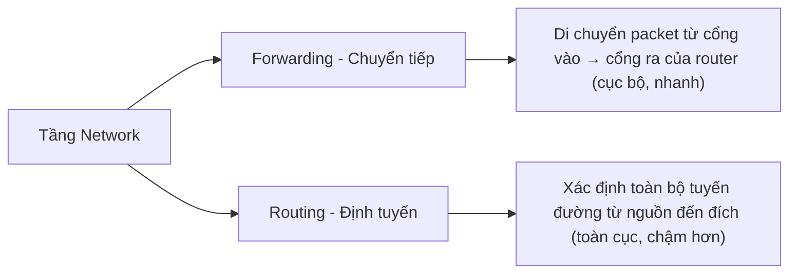
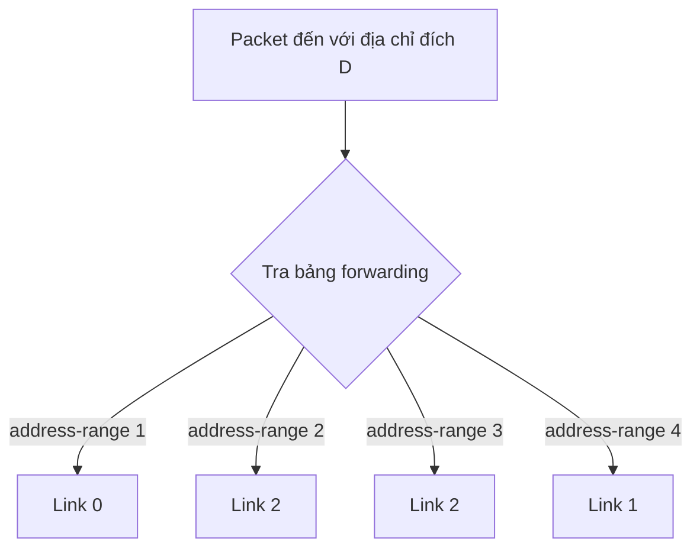
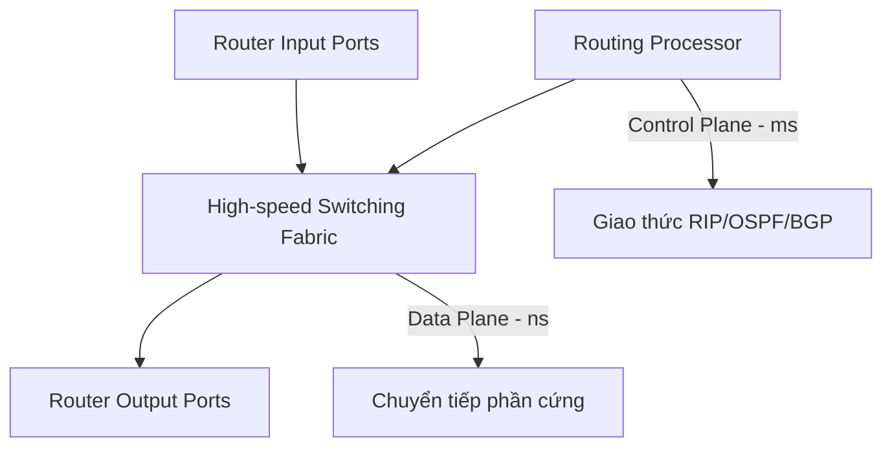
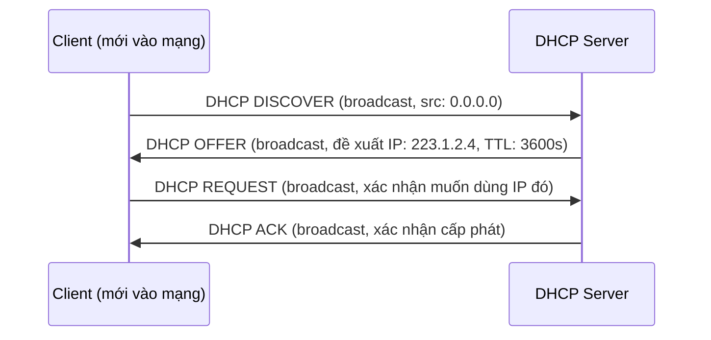
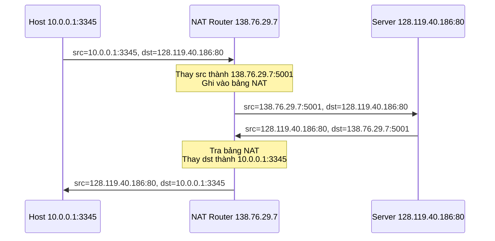
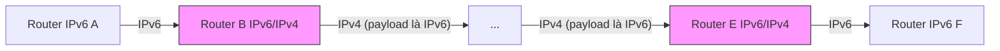
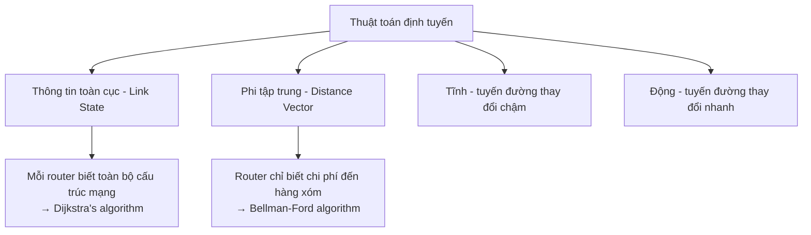
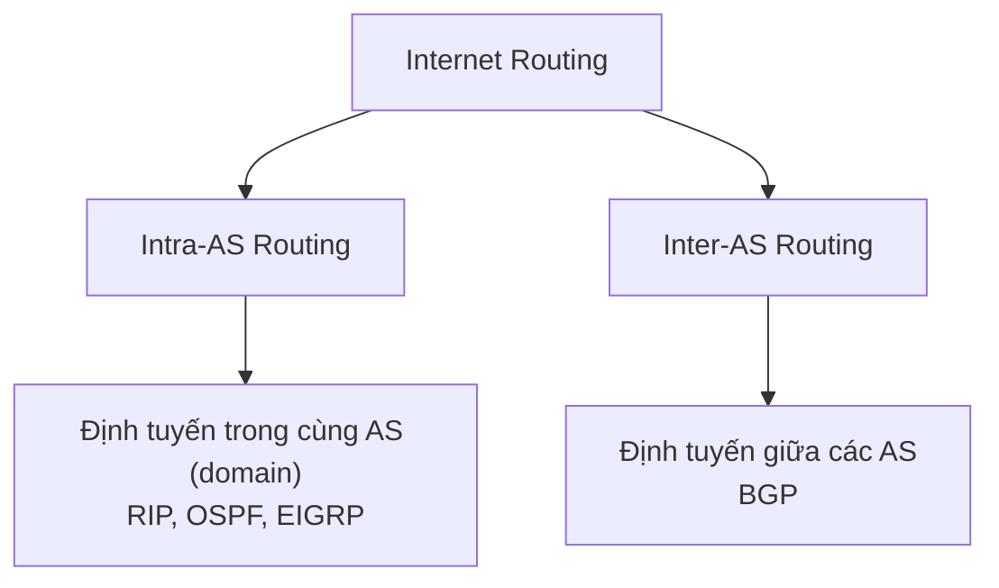
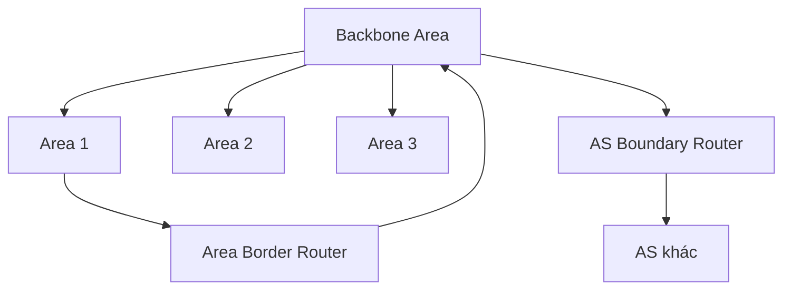
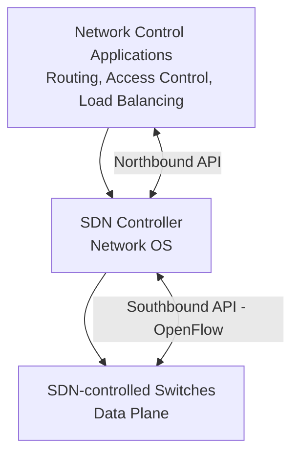

# Chương 4: Tầng Network (Network Layer)

## 4.1 Tổng quan về Tầng Network

### Chức năng cơ bản

Tầng Network (tầng Mạng) chịu trách nhiệm **truyền các segment từ máy gửi đến máy nhận** qua một hoặc nhiều mạng trung gian.

- **Máy gửi**: Đóng gói các segment từ tầng Transport thành các **datagram**, sau đó chuyển xuống tầng Link.
- **Máy nhận**: Nhận các datagram, giải gói và chuyển các segment lên tầng Transport tương ứng.
- **Router**: Kiểm tra trường header của **mọi** datagram đi qua, rồi chuyển tiếp datagram từ cổng đầu vào sang cổng đầu ra phù hợp.

---

### Hai chức năng chính



!!! tip "Tương tự thực tế"
    - **Forwarding** giống như hành động lái xe qua một ngã tư cụ thể — bạn nhìn biển chỉ đường và rẽ.
    - **Routing** giống như lập kế hoạch toàn bộ hành trình từ nhà đến đích trước khi xuất phát.

---

### Data Plane và Control Plane

| Đặc điểm | Data Plane (Mức dữ liệu) | Control Plane (Mức điều khiển) |
|---|---|---|
| Phạm vi | Cục bộ, trên từng router | Toàn mạng |
| Chức năng | Quyết định datagram đến cổng vào sẽ được chuyển ra cổng nào | Quyết định tuyến đường end-to-end từ nguồn đến đích |
| Tốc độ | Nanosecond (phần cứng) | Millisecond (phần mềm) |
| Ví dụ | Bảng forwarding | Giao thức OSPF, BGP |

**Hai cách tiếp cận Control Plane:**

=== "Truyền thống (Per-router)"
    Mỗi router chạy thuật toán định tuyến độc lập, trao đổi thông tin với các router lân cận để xây dựng bảng forwarding của riêng mình.

=== "SDN (Software-Defined Networking)"
    Một bộ điều khiển trung tâm (remote controller) tính toán và cài đặt bảng forwarding cho toàn bộ các router trong mạng. Các router chỉ thực hiện forwarding theo bảng được cài sẵn.

---

### Mô hình dịch vụ mạng

??? question "Câu hỏi: Mô hình dịch vụ nào cho kênh truyền datagram từ máy gửi đến máy nhận?"
    Internet sử dụng mô hình **"Best-effort" (Nỗ lực tốt nhất)**: mạng không đảm bảo bất cứ điều gì — không đảm bảo datagram đến nơi, không đảm bảo thứ tự, không đảm bảo thời gian trễ, không đảm bảo băng thông. Điều này giúp thiết kế mạng đơn giản và linh hoạt, sự phức tạp được đẩy ra các hệ thống đầu cuối (TCP xử lý độ tin cậy).

| Kiến trúc | Mô hình dịch vụ | Băng thông | Mất mát | Thứ tự | Thời gian |
|---|---|---|---|---|---|
| Internet | Best-effort | Không đảm bảo | Có thể xảy ra | Không đảm bảo | Không đảm bảo |
| ATM CBR | Tốc độ không đổi | Cố định | Không | Có | Có |
| ATM ABR | Tốc độ bit khả dụng | Tối thiểu | Không | Có | Không |

---

## 4.2 Virtual Circuit Network và Datagram Network

### Dịch vụ Connection và Connectionless

- **Datagram Network**: Cung cấp dịch vụ **connectionless** ở tầng Network — không cần thiết lập kết nối trước, mỗi packet được định tuyến độc lập dựa trên địa chỉ đích.
- **Virtual Circuit Network**: Cung cấp dịch vụ **connection-oriented** ở tầng Network — phải thiết lập đường kết nối ảo trước khi truyền dữ liệu.

---

### Mạng mạch ảo (Virtual Circuits - VC)

Hoạt động tương tự mạng điện thoại:

1. **Thiết lập cuộc gọi** (call setup) trước khi truyền dữ liệu.
2. Mỗi packet mang **VC identifier** (số hiệu kết nối ảo) thay vì địa chỉ đích.
3. Mỗi router dọc đường duy trì **trạng thái** cho từng kết nối ảo đi qua nó.
4. Tài nguyên (băng thông, bộ đệm) có thể được **cấp phát riêng** cho từng VC → dịch vụ có thể dự đoán trước.

**Bảng forwarding của VC:**

| Cổng vào | VC number vào | Cổng ra | VC number ra |
|---|---|---|---|
| 1 | 12 | 3 | 22 |
| 2 | 63 | 1 | 18 |
| 3 | 7 | 2 | 17 |

!!! note "Lưu ý"
    Số hiệu VC có thể thay đổi tại mỗi router (được gán lại). Điều này cho phép tái sử dụng số hiệu VC trên các đoạn link khác nhau.

---

### Mạng Datagram

- **Không thiết lập kết nối** ở tầng Network.
- Router **không lưu trạng thái** về các kết nối — không có khái niệm "kết nối" ở mức mạng.
- Các packet được chuyển tiếp dựa trên **địa chỉ IP đích** trong header.
- Bảng forwarding ánh xạ **dải địa chỉ đích → cổng ra**.



---

### So sánh Datagram vs Virtual Circuit

| Tiêu chí | Internet (Datagram) | ATM (Virtual Circuit) |
|---|---|---|
| Thiết lập kết nối | Không | Có |
| Trạng thái router | Không | Có (per-connection) |
| Đảm bảo QoS | Không | Có |
| Đầu cuối thông minh | Có (máy tính) | Không (điện thoại) |
| Ứng dụng | Trao đổi dữ liệu linh hoạt | Thoại, video real-time |

---

## 4.3 Cấu trúc bên trong Router

### Tổng quan kiến trúc Router



---

### Chức năng cổng đầu vào

Xử lý theo 3 bước từ phải sang trái (nhìn từ góc độ luồng dữ liệu):

1. **Tầng vật lý**: Tiếp nhận tín hiệu bit.
2. **Tầng Link**: Xử lý frame (ví dụ: Ethernet).
3. **Lookup & Forwarding**: Tra bảng forwarding để xác định cổng ra → đẩy vào Switching Fabric.

!!! info "Chuyển mạch phi tập trung"
    Mục tiêu là xử lý hoàn toàn ở "tốc độ đường truyền" (line rate). Bảng forwarding được sao chép vào bộ nhớ của từng cổng vào để tra cứu song song, không cần đợi CPU trung tâm.

**Hai loại chuyển tiếp:**

- **Destination-based forwarding**: Chuyển tiếp chỉ dựa trên địa chỉ IP đích (truyền thống).
- **Generalized forwarding**: Chuyển tiếp dựa trên bất kỳ tập hợp trường nào trong header (SDN/OpenFlow).

---

### Longest Prefix Matching (Kết hợp tiền tố dài nhất)

Khi tra bảng forwarding, router chọn mục nhập có **tiền tố địa chỉ dài nhất** khớp với địa chỉ đích.

**Ví dụ bảng forwarding:**

| Tiền tố địa chỉ đích | Cổng ra |
|---|---|
| `11001000 00010111 00010***` | 0 |
| `11001000 00010111 00011000` | 1 |
| `11001000 00010111 00011***` | 2 |
| Còn lại | 3 |

??? question "Câu hỏi: Địa chỉ `11001000 00010111 00011000 10101010` đi ra cổng nào?"
    **Cổng 1** — vì tiền tố `11001000 00010111 00011000` (24 bit) khớp dài hơn so với tiền tố `11001000 00010111 00011***` (21 bit). Luôn chọn tiền tố **dài nhất** khớp.

??? question "Câu hỏi: Địa chỉ `11001000 00010111 00010110 10100001` đi ra cổng nào?"
    **Cổng 0** — chỉ khớp với tiền tố `11001000 00010111 00010***`.

---

### Switching Fabrics

Có 3 loại switching fabric chính:

=== "Memory (Bộ nhớ)"
    - Các router thế hệ đầu tiên.
    - Packet được **sao chép vào bộ nhớ hệ thống**, CPU quyết định cổng ra, rồi sao chép ra.
    - **Hạn chế**: Tốc độ bị giới hạn bởi băng thông bộ nhớ. Mỗi datagram cần 2 lần qua bus hệ thống.

=== "Bus (Thanh truyền dữ liệu)"
    - Datagram được truyền từ bộ nhớ cổng vào → bộ nhớ cổng ra qua **một bus chia sẻ duy nhất**.
    - **Hạn chế**: Tranh chấp bus → tốc độ bị giới hạn bởi băng thông bus.
    - Ví dụ: Cisco 5600 có bus 32 Gbps.

=== "Crossbar / Interconnection Network"
    - Sử dụng mạng crossbar hoặc mạng kết nối nhiều tầng.
    - **Ưu điểm**: Nhiều kết nối song song đồng thời, không bị bottleneck tại một điểm duy nhất.
    - Cisco CRS: 8 switching planes, mỗi plane là mạng 3 tầng → khả năng switching lên đến **100 Tbps**.

---

### Hàng đợi và HOL Blocking

**Hàng đợi tại cổng đầu vào** xảy ra khi switching fabric chậm hơn tốc độ đến tổng hợp của các cổng vào.

!!! warning "HOL Blocking (Head-of-Line Blocking)"
    Packet đứng đầu hàng đợi đang chờ cổng ra bị bận → các packet phía sau (dù cổng ra của chúng đang rảnh) cũng bị chặn và phải chờ. Đây là hiện tượng **chặn đầu hàng** — làm giảm hiệu suất đáng kể.

**Hàng đợi tại cổng đầu ra** xảy ra khi tốc độ đến từ switching fabric vượt quá tốc độ truyền của link ra.

- Datagram có thể bị **mất** do tràn bộ đệm.
- Cần **chính sách loại bỏ** (drop policy) và **lập lịch** (scheduling).

**Bao nhiêu bộ đệm là đủ?**

- **Quy tắc RFC 3439**: Buffer = RTT × C (với RTT ≈ 250ms, C là dung lượng link).  
  Ví dụ: Link 10 Gbps → cần buffer 2.5 Gbit.
- **Cập nhật mới hơn**: Với N luồng TCP, buffer = RTT × C / √N.
- **Cảnh báo**: Buffer quá lớn gây tăng trễ (bufferbloat), ảnh hưởng ứng dụng real-time và phản hồi TCP chậm.

---

### Quản lý bộ đệm và Lập lịch

**Quản lý bộ đệm (Buffer Management):**

- **Drop tail**: Khi buffer đầy, drop packet mới đến.
- **Priority drop**: Drop/remove packet theo độ ưu tiên.
- **Marking (ECN, RED)**: Đánh dấu packet để báo hiệu tắc nghẽn thay vì drop.

**Lập lịch truyền packet (Packet Scheduling):**

=== "FCFS / FIFO"
    Packet đến trước được phục vụ trước. Đơn giản nhưng không phân biệt ưu tiên.

=== "Priority Scheduling"
    Traffic được phân loại vào nhiều hàng đợi có mức ưu tiên khác nhau. Luôn phục vụ packet từ **hàng đợi ưu tiên cao nhất** có packet. Trong cùng một hàng đợi thì theo FCFS.

    !!! warning
        Hàng đợi ưu tiên thấp có thể bị **đói** (starvation) nếu hàng đợi ưu tiên cao liên tục có packet.

=== "Round Robin (RR)"
    Phục vụ luân phiên mỗi lớp traffic, mỗi lần một packet hoàn chỉnh từ mỗi lớp. Công bằng hơn Priority nhưng không đảm bảo băng thông tối thiểu.

=== "Weighted Fair Queuing (WFQ)"
    Generalized Round Robin. Mỗi lớp i có trọng số wᵢ, được phục vụ theo tỷ lệ `wᵢ / Σwⱼ` của tổng băng thông. **Đảm bảo băng thông tối thiểu** cho mỗi lớp traffic.

---

## 4.4 IP: Internet Protocol

### Định dạng IP Datagram

```
 0                   1                   2                   3
 0 1 2 3 4 5 6 7 8 9 0 1 2 3 4 5 6 7 8 9 0 1 2 3 4 5 6 7 8 9 0 1
+-+-+-+-+-+-+-+-+-+-+-+-+-+-+-+-+-+-+-+-+-+-+-+-+-+-+-+-+-+-+-+-+
|Version|  IHL  |Type of Service|          Total Length         |
+-+-+-+-+-+-+-+-+-+-+-+-+-+-+-+-+-+-+-+-+-+-+-+-+-+-+-+-+-+-+-+-+
|         Identification        |Flags|      Fragment Offset    |
+-+-+-+-+-+-+-+-+-+-+-+-+-+-+-+-+-+-+-+-+-+-+-+-+-+-+-+-+-+-+-+-+
|  Time to Live |    Protocol   |         Header Checksum       |
+-+-+-+-+-+-+-+-+-+-+-+-+-+-+-+-+-+-+-+-+-+-+-+-+-+-+-+-+-+-+-+-+
|                       Source Address                          |
+-+-+-+-+-+-+-+-+-+-+-+-+-+-+-+-+-+-+-+-+-+-+-+-+-+-+-+-+-+-+-+-+
|                    Destination Address                        |
+-+-+-+-+-+-+-+-+-+-+-+-+-+-+-+-+-+-+-+-+-+-+-+-+-+-+-+-+-+-+-+-+
|                    Options                    |    Padding    |
+-+-+-+-+-+-+-+-+-+-+-+-+-+-+-+-+-+-+-+-+-+-+-+-+-+-+-+-+-+-+-+-+
|                             Data                              |
+-+-+-+-+-+-+-+-+-+-+-+-+-+-+-+-+-+-+-+-+-+-+-+-+-+-+-+-+-+-+-+-+
```

| Trường | Kích thước | Ý nghĩa |
|---|---|---|
| Version | 4 bit | Phiên bản IP (4 hoặc 6) |
| IHL (Header Length) | 4 bit | Độ dài header tính theo đơn vị 4 byte |
| Type of Service | 8 bit | Diffserv (6 bit) + ECN (2 bit) |
| Total Length | 16 bit | Tổng độ dài datagram (max 65535 byte, thường ≤ 1500 byte) |
| Identification | 16 bit | Dùng để ghép lại các fragment |
| Flags + Fragment Offset | | Điều khiển phân mảnh |
| TTL (Time to Live) | 8 bit | Số hop tối đa còn lại, giảm 1 tại mỗi router, hủy khi = 0 |
| Protocol | 8 bit | Giao thức tầng trên (6=TCP, 17=UDP) |
| Header Checksum | 16 bit | Kiểm tra tính toàn vẹn của header |
| Source IP | 32 bit | Địa chỉ IP nguồn |
| Destination IP | 32 bit | Địa chỉ IP đích |

!!! info "Overhead TCP/IP"
    Một segment TCP nhỏ nhất có: 20 byte header TCP + 20 byte header IP = **40 byte overhead** trước khi có data ứng dụng.

---

### Phân mảnh và Tổng hợp IP (Fragmentation & Reassembly)

**Tại sao cần phân mảnh?**

Mỗi loại link có **MTU (Maximum Transfer Unit)** khác nhau — kích thước frame tối đa mà link đó có thể truyền. Khi datagram lớn hơn MTU của link tiếp theo, router phải **phân mảnh** datagram thành các datagram nhỏ hơn.

**Ví dụ:**

- Datagram gốc: 4000 byte (20 byte header + 3980 byte data)
- MTU link tiếp theo: 1500 byte → mỗi fragment chứa tối đa **1480 byte data** (1500 - 20 header)

| Fragment | ID | Offset | Fragflag | Length |
|---|---|---|---|---|
| Fragment 1 | x | 0 | 1 | 1500 |
| Fragment 2 | x | 185 | 1 | 1500 |
| Fragment 3 | x | 370 | 0 | 1040 |

!!! note "Cách tính offset"
    Offset = byte bắt đầu của data trong fragment / 8.  
    Fragment 2 bắt đầu từ byte 1480 → offset = 1480/8 = **185**.  
    `Fragflag = 1` nghĩa là còn fragment tiếp theo; `Fragflag = 0` là fragment cuối.

**Tổng hợp lại (Reassembly)** chỉ xảy ra tại **máy đích cuối cùng**, không tại router trung gian.

---

### Địa chỉ IP và Mạng con (Subnet)

**Địa chỉ IP** là mã định danh 32 bit gắn với mỗi **interface** (cổng mạng) của host hoặc router.

Ký hiệu thập phân có dấu chấm: `223.1.1.1 = 11011111.00000001.00000001.00000001`

**Mạng con (Subnet)**: Tập hợp các interface có thể giao tiếp trực tiếp với nhau mà **không qua router**. Các địa chỉ trong cùng subnet chia sẻ các bit cao giống nhau (phần network), khác nhau ở các bit thấp (phần host).

**CIDR (Classless Inter-Domain Routing)**: Cho phép phần network có độ dài tùy ý.

```
200.23.16.0/23
|           |
Địa chỉ mạng  23 bit đầu là phần network
```

??? question "Câu hỏi: Mạng 223.1.1.0/24 chứa bao nhiêu host?"
    24 bit network → 8 bit host → 2⁸ = 256 địa chỉ, trừ đi 1 địa chỉ mạng (tất cả bit host = 0) và 1 địa chỉ broadcast (tất cả bit host = 1) → **254 host khả dụng**.

---

### DHCP (Dynamic Host Configuration Protocol)

DHCP cho phép host **tự động lấy địa chỉ IP** khi kết nối vào mạng, thay vì phải cấu hình thủ công.

**Quá trình 4 bước (DORA):**



!!! info "DHCP cung cấp thêm"
    Ngoài địa chỉ IP, DHCP còn cung cấp:
    - Địa chỉ **default gateway** (router đầu tiên)
    - Địa chỉ **DNS server**
    - **Subnet mask**

**Tại sao dùng broadcast?** Vì client chưa có địa chỉ IP nên không thể gửi unicast; server cũng chưa biết địa chỉ client.

---

### Địa chỉ IP: Phân cấp và Tổng hợp tuyến đường

**ISP nhận block địa chỉ từ ICANN** (qua các RIR - Regional Internet Registry), rồi chia nhỏ cho các tổ chức.

**Ví dụ tổng hợp tuyến đường (Route Aggregation):**

ISP có block `200.23.16.0/20` → quảng bá một tuyến duy nhất thay vì 8 tuyến riêng lẻ cho 8 tổ chức con → **giảm kích thước bảng routing** trên Internet.

!!! info "Địa chỉ IPv4 cạn kiệt"
    ICANN đã phân bổ đoạn địa chỉ IPv4 cuối cùng vào **năm 2011**. Giải pháp: NAT (ngắn hạn) và IPv6 (dài hạn).

---

### NAT (Network Address Translation)

NAT cho phép **nhiều thiết bị trong mạng nội bộ** chia sẻ **một địa chỉ IP công khai duy nhất** khi giao tiếp với Internet.

**Không gian địa chỉ private (chỉ dùng nội bộ):**
- `10.0.0.0/8`
- `172.16.0.0/12`
- `192.168.0.0/16`

**Hoạt động của NAT:**



**Ưu điểm của NAT:**
- Chỉ cần 1 địa chỉ IP công khai cho cả mạng nội bộ.
- Có thể thay đổi địa chỉ nội bộ mà không cần thông báo bên ngoài.
- Bảo mật: các thiết bị nội bộ không trực tiếp tiếp xúc Internet.

**Tranh cãi về NAT:**
- Router lý thuyết chỉ nên xử lý đến tầng 3 (IP), nhưng NAT phải đọc số port (tầng 4).
- Vi phạm nguyên tắc **end-to-end** — thiết bị bên ngoài không thể chủ động kết nối vào thiết bị sau NAT.
- Địa chỉ IPv6 là giải pháp đúng đắn lâu dài.

---

### ICMP (Internet Control Message Protocol)

ICMP được dùng bởi host và router để **truyền thông thông tin điều khiển** tầng network. Các thông điệp ICMP được đóng gói trong IP datagram.

| Type | Code | Mô tả |
|---|---|---|
| 0 | 0 | Echo Reply (phản hồi ping) |
| 3 | 0 | Destination network unreachable |
| 3 | 1 | Destination host unreachable |
| 3 | 3 | Destination port unreachable |
| 8 | 0 | Echo Request (gửi ping) |
| 11 | 0 | TTL expired (dùng bởi Traceroute) |
| 12 | 0 | Bad IP header |

**Traceroute hoạt động như thế nào?**

1. Gửi các UDP segment đến đích với TTL = 1, 2, 3, ...
2. Router thứ n nhận packet với TTL=n, giảm TTL về 0, hủy packet và gửi ICMP "TTL expired" (type 11, code 0) về nguồn.
3. Nguồn ghi lại địa chỉ IP của router và RTT.
4. Khi packet đến đích, server trả về ICMP "Port unreachable" (type 3, code 3) → Traceroute dừng.

---

### IPv6

**Động lực:**
- Không gian địa chỉ IPv4 32 bit sắp cạn kiệt.
- Header cố định 40 byte → xử lý nhanh hơn tại router.
- Hỗ trợ xử lý các "luồng" (flow) ở tầng mạng.

**Cấu trúc header IPv6 (40 byte cố định):**

| Trường | Kích thước | Ý nghĩa |
|---|---|---|
| Version | 4 bit | = 6 |
| Priority | 4 bit | Mức độ ưu tiên |
| Flow Label | 20 bit | Định danh luồng |
| Payload Length | 16 bit | Độ dài phần data |
| Next Header | 8 bit | Giao thức tầng trên |
| Hop Limit | 8 bit | Tương đương TTL |
| Source Address | 128 bit | |
| Destination Address | 128 bit | |

**Những gì IPv6 loại bỏ so với IPv4:**
- ❌ **Không có checksum** (tăng tốc xử lý tại router — tầng link đã có checksum)
- ❌ **Không phân mảnh/tổng hợp** tại router (chỉ nguồn có thể phân mảnh)
- ❌ **Không có Options** trong header cố định (options dưới dạng "extension headers")

**Chuyển đổi IPv4 → IPv6: Tunneling**

Khi một datagram IPv6 phải đi qua vùng mạng chỉ có IPv4, nó được **đóng gói (encapsulate) toàn bộ vào payload của datagram IPv4** — gọi là "IPv6 in IPv4 tunnel".



---

## 4.5 Các thuật toán Routing

### Phân loại thuật toán định tuyến



---

### Trừu tượng hóa đồ thị mạng

Mạng được mô hình hóa như một **đồ thị có trọng số**: G = (N, E)
- N: tập hợp các router
- E: tập hợp các liên kết
- c(a,b): chi phí liên kết từ a đến b (có thể là băng thông nghịch đảo, độ trễ, mức tắc nghẽn...)

---

### Thuật toán Dijkstra (Link-State)

**Đặc điểm:**
- Tập trung: tất cả router biết **toàn bộ cấu trúc mạng** (thông qua gói tin "link state broadcast").
- Tính đường đi có **chi phí thấp nhất** từ một nguồn đến tất cả đích.
- Độ phức tạp: **O(n²)** với n nút, có thể tối ưu thành **O(n log n)**.

**Pseudocode:**

```
Khởi tạo:
  N' = {u}   // tập nút đã biết đường ngắn nhất
  D(v) = c(u,v) nếu v là hàng xóm trực tiếp của u
  D(v) = ∞   nếu không

Lặp:
  Tìm w không trong N' sao cho D(w) nhỏ nhất
  Thêm w vào N'
  Cập nhật D(v) cho mọi v kề w và không trong N':
    D(v) = min(D(v), D(w) + c(w,v))
Cho đến khi tất cả nút trong N'
```

**Ví dụ (đồ thị u,v,w,x,y,z):**

| Bước | N' | D(v) | D(w) | D(x) | D(y) | D(z) |
|---|---|---|---|---|---|---|
| 0 | {u} | 2,u | 5,u | 1,u | ∞ | ∞ |
| 1 | {u,x} | 2,u | 4,x | — | 2,x | ∞ |
| 2 | {u,x,v} | — | 3,y | — | 2,x | ∞ |
| 3 | {u,x,v,y} | — | 3,y | — | — | 4,y |
| 4 | {u,x,v,y,w} | — | — | — | — | 4,y |
| 5 | {u,x,v,y,w,z} | — | — | — | — | — |

!!! warning "Khả năng dao động (Oscillation)"
    Khi chi phí liên kết phụ thuộc vào lưu lượng, thuật toán LS có thể gây **dao động tuyến đường** — các router liên tục thay đổi tuyến, dẫn đến bất ổn định. Giải pháp: sử dụng thời điểm quảng bá ngẫu nhiên.

---

### Thuật toán Bellman-Ford (Distance Vector)

**Công thức Bellman-Ford:**

```
Dₓ(y) = min_v { c(x,v) + Dᵥ(y) }
```

Nghĩa là: chi phí từ x đến y = min qua tất cả hàng xóm v của {chi phí link x→v + chi phí từ v đến y}.

**Đặc điểm:**
- **Phi tập trung**: mỗi router chỉ biết chi phí đến hàng xóm trực tiếp ban đầu.
- **Lặp và bất đồng bộ**: mỗi nút gửi vector khoảng cách của mình cho hàng xóm theo định kỳ hoặc khi có thay đổi.
- **Tự dừng**: khi không có thay đổi nào, không cần trao đổi thêm.

**Ví dụ tính Dᵤ(z):**

```
Du(z) = min{
    c(u,v) + Dv(z),   = 2 + 5 = 7
    c(u,x) + Dx(z),   = 1 + 3 = 4  ← nhỏ nhất
    c(u,w) + Dw(z)    = 5 + 3 = 8
}
= 4, qua x
```

**Vấn đề "Count to Infinity" (Đếm đến vô cực):**

Khi chi phí liên kết **tăng** (tin xấu), thông tin lan truyền rất chậm:

```
x --- y --- z (ban đầu: c(x,y) = 4)
      c(x,y) đột ngột tăng lên 60

y nghĩ: "tôi đến x qua z với chi phí 6 (1+5)"
z nghĩ: "tôi đến x qua y với chi phí 7 (1+6)"
y nghĩ: "tôi đến x qua z với chi phí 8 (1+7)"
... cứ thế đếm mãi cho đến khi đạt giá trị đúng (50+...)
```

Giải pháp: **Poison Reverse** — nếu y định tuyến đến x qua z, thì y báo với z rằng khoảng cách từ y đến x là ∞ (ngăn z dùng y để đến x).

---

### So sánh LS và DV

| Tiêu chí | Link State (Dijkstra) | Distance Vector (Bellman-Ford) |
|---|---|---|
| Thông tin cần | Cấu trúc mạng đầy đủ | Chỉ vector khoảng cách từ hàng xóm |
| Độ phức tạp thông điệp | O(n²) thông điệp | Trao đổi giữa hàng xóm, thời gian hội tụ thay đổi |
| Tốc độ hội tụ | O(n²) thuật toán | Có thể chậm, count-to-infinity |
| Khi router lỗi | Chỉ bảng của router đó bị ảnh hưởng | Lỗi lan truyền qua mạng (black-holing) |

---

## 4.6 Routing trong Internet

### Tại sao cần Hierarchical Routing?

Internet có **hàng tỷ đích** — không thể lưu tất cả trong một bảng routing. Giải pháp: **tổng hợp router thành các AS (Autonomous System)**.



- **AS (Autonomous System)**: Nhóm router dưới cùng quản trị, chạy cùng giao thức định tuyến nội miền.
- **Gateway router**: Router ở biên AS, có kết nối đến AS khác, chạy cả intra-AS và inter-AS routing.

---

### RIP (Routing Information Protocol)

- Dựa trên **Distance Vector**.
- Metric: **số hop** (max = 15; 16 = vô cực → không thể đến).
- Trao đổi DV mỗi **30 giây** qua UDP.
- Nếu không nhận được advertisement sau **180 giây** → neighbor được coi là đã chết.
- Sử dụng **Poison Reverse** để tránh vòng lặp.
- Ít được dùng ngày nay do giới hạn 15 hop.

---

### OSPF (Open Shortest Path First)

- Dựa trên **Link State** (Dijkstra).
- Mỗi router **gửi quảng bá trạng thái liên kết** đến toàn bộ AS (broadcast trực tiếp qua IP, không qua TCP/UDP).
- Hỗ trợ nhiều chỉ số chi phí: băng thông, độ trễ.
- Có **xác thực** để ngăn xâm nhập độc hại.
- Hỗ trợ **phân cấp 2 cấp**: local area + backbone.

**OSPF phân cấp:**



- **Router cục bộ**: chỉ biết cấu trúc trong area của mình.
- **Area Border Router**: tóm tắt khoảng cách đến các đích trong area, quảng bá vào backbone.
- **Backbone router**: chạy OSPF giới hạn trong backbone.
- **AS Boundary Router**: kết nối với AS khác (chạy BGP).

---

### BGP (Border Gateway Protocol)

- Giao thức định tuyến **liên miền** thực tế của Internet — "chất keo kết nối Internet".
- Cho phép mạng con **quảng bá sự tồn tại** của mình đến toàn Internet.

**Hai loại BGP:**
- **eBGP (external BGP)**: Trao đổi thông tin về khả năng tiếp cận giữa các AS khác nhau.
- **iBGP (internal BGP)**: Phân phối thông tin về khả năng tiếp cận nhận được từ eBGP đến tất cả router trong cùng AS.

**Tại sao Intra-AS và Inter-AS khác nhau?**

| Tiêu chí | Intra-AS | Inter-AS |
|---|---|---|
| Chính sách | Ít quan trọng (cùng quản trị) | Rất quan trọng (kiểm soát lưu lượng qua mạng) |
| Hiệu suất | Ưu tiên tối ưu hiệu suất | Chính sách chi phối hiệu suất |
| Quy mô | Trong phạm vi một tổ chức | Toàn cầu |

---

### SDN (Software-Defined Networking)

**Vấn đề với định tuyến truyền thống:**

- Muốn định tuyến lưu lượng u→z theo đường uvwz thay vì uxyz? → Phải điều chỉnh trọng số liên kết phức tạp.
- Muốn cân bằng tải qua 2 đường? → Không làm được với routing truyền thống.
- Muốn router phân biệt 2 luồng traffic khác nhau? → Không thể với destination-based forwarding.

**SDN giải quyết bằng cách:**

1. **Tách biệt hoàn toàn** Control Plane và Data Plane.
2. **Bộ điều khiển tập trung** (logically centralized) tính toán và cài bảng forwarding cho toàn bộ switch.
3. **Generalized forwarding** (OpenFlow): quyết định dựa trên bất kỳ trường header nào, không chỉ địa chỉ đích.
4. **Lập trình được**: các ứng dụng điều khiển có thể thay đổi hành vi mạng mà không cần can thiệp phần cứng.

**Kiến trúc SDN:**



**Bộ điều khiển SDN bao gồm:**
- **Lớp giao tiếp**: giao tiếp với switch qua OpenFlow/SNMP.
- **Lớp quản lý trạng thái mạng**: cơ sở dữ liệu phân tán về trạng thái mạng.
- **Lớp giao diện cho ứng dụng**: Northbound API (RESTful).

**OpenFlow** là giao thức tiêu chuẩn giữa bộ điều khiển SDN và switch, hoạt động trên TCP.

---

### Quản lý mạng

**Các thành phần quản lý mạng:**
- **Managing Server**: Ứng dụng quản lý (có người vận hành)
- **Managed Device**: Thiết bị được quản lý (router, switch, host)
- **Agent**: Phần mềm trên thiết bị, giao tiếp với managing server
- **Data**: Thông tin cấu hình và vận hành của thiết bị
- **Network Management Protocol**: Giao thức trao đổi (SNMP, NETCONF)

**Ba phương pháp quản lý:**

=== "CLI"
    Quản trị viên gõ lệnh trực tiếp vào từng thiết bị qua SSH/Telnet. Đơn giản nhưng không thể mở rộng.

=== "SNMP/MIB"
    - **SNMP (Simple Network Management Protocol)**: Giao thức truy vấn/cài đặt dữ liệu thiết bị.
    - **MIB (Management Information Base)**: Cơ sở dữ liệu chứa thông tin hoạt động của thiết bị (400+ module MIB trong RFC).
    - Hai chế độ: **request/response** và **trap** (thiết bị chủ động gửi thông báo sự kiện).

=== "NETCONF/YANG"
    - **NETCONF**: Giao thức quản lý cấu hình thiết bị mạng, mã hóa XML, truyền qua TLS.
    - **YANG**: Ngôn ngữ mô hình hóa dữ liệu để định nghĩa cấu trúc/cú pháp của dữ liệu NETCONF.
    - Cho phép quản lý đồng thời nhiều thiết bị, kiểm tra tính hợp lệ của cấu hình trước khi áp dụng.

---

## 4.7 Broadcast và Multicast Routing

### Broadcast Routing

Truyền packet từ nguồn đến **tất cả** các node trong mạng.

**Các phương pháp:**

- **Source duplication (Nguồn nhân bản)**: Nguồn gửi N bản sao riêng biệt cho N đích → kém hiệu quả, nguồn phải biết hết địa chỉ.
- **Flooding không kiểm soát**: Mỗi node nhận packet → gửi bản sao đến tất cả hàng xóm → **bão broadcast** (broadcast storm).
- **Controlled Flooding**: Node chỉ broadcast packet nếu **chưa gửi packet đó trước đây**.
- **RPF (Reverse Path Forwarding)**: Chỉ chuyển tiếp packet nếu packet đến qua **liên kết trên đường ngắn nhất từ node đến nguồn**.
- **Spanning Tree**: Xây dựng cây bao phủ không có vòng lặp → mỗi node chỉ nhận đúng **1 bản sao**.

---

### Multicast Routing

Truyền packet từ một nguồn đến **một nhóm** các node đã đăng ký quan tâm.

**Hai loại cây multicast:**

| Loại | Mô tả | Ưu điểm | Nhược điểm |
|---|---|---|---|
| Source-based tree | Một cây riêng cho mỗi nguồn | Tối ưu đường đi | Nhiều cây, tốn bộ nhớ router |
| Shared tree | Một cây dùng chung cho cả nhóm | Đơn giản, ít cây | Đường đi có thể không tối ưu |

**Các hướng tiếp cận xây dựng cây:**

- **Shortest Path Tree** (source-based): Cây đường đi ngắn nhất từ nguồn đến mọi thành viên.
- **Reverse Path Tree** (source-based): Dựa trên RPF.
- **Steiner Tree** (shared): Cây chia sẻ có tổng chi phí nhỏ nhất — bài toán NP-hard.
- **Center-based Tree** (shared): Chọn một "lõi" (center), tất cả thành viên xây đường về lõi.

---

## Câu hỏi trắc nghiệm

**Câu 1.** Chức năng nào của tầng Network chịu trách nhiệm di chuyển packet từ cổng vào đến cổng ra của một router?

- A. Routing
- B. Forwarding
- C. Switching
- D. Scheduling

??? info "Đáp án & Giải thích"
    **Đáp án: B**
    **Forwarding** là hành động cục bộ tại một router, di chuyển packet từ input port đến output port dựa trên bảng forwarding. **Routing** là quá trình toàn cục, xác định toàn bộ tuyến đường từ nguồn đến đích.

---

**Câu 2.** Mô hình dịch vụ "Best-effort" của Internet đảm bảo điều gì?

- A. Đảm bảo băng thông tối thiểu
- B. Đảm bảo truyền đúng thứ tự
- C. Không đảm bảo bất cứ điều gì
- D. Đảm bảo độ trễ dưới 40ms

??? info "Đáp án & Giải thích"
    **Đáp án: C**
    Internet Best-effort không đảm bảo: (i) datagram đến đích, (ii) thứ tự truyền, (iii) thời gian truyền, (iv) băng thông. Sự đơn giản này là ưu điểm — cho phép mạng linh hoạt và các đầu cuối thông minh (TCP) tự xử lý độ tin cậy.

---

**Câu 3.** Trong mạng Virtual Circuit, mỗi packet mang thông tin gì để định tuyến?

- A. Địa chỉ IP đích
- B. Địa chỉ MAC đích
- C. Số hiệu kết nối ảo (VC identifier)
- D. Địa chỉ IP nguồn và đích

??? info "Đáp án & Giải thích"
    **Đáp án: C**
    Trong mạng Virtual Circuit, packet mang **VC number** (số hiệu kết nối ảo). Router tra bảng forwarding VC để biết cổng ra và VC number mới. Điều này khác hoàn toàn với datagram network nơi packet mang địa chỉ IP đích.

---

**Câu 4.** Trong mạng Datagram, router không lưu trạng thái gì?

- A. Bảng forwarding
- B. Thông tin về từng kết nối riêng lẻ
- C. Địa chỉ IP các host
- D. Chi phí các liên kết

??? info "Đáp án & Giải thích"
    **Đáp án: B**
    Mạng Datagram không có trạng thái per-connection. Mỗi packet được xử lý độc lập dựa trên địa chỉ đích. Điều này khác với Virtual Circuit network nơi mỗi router phải lưu trạng thái cho mỗi kết nối ảo đi qua.

---

**Câu 5.** Longest Prefix Matching được dùng để làm gì?

- A. Tìm địa chỉ MAC tương ứng với IP
- B. Xác định cổng ra khi có nhiều mục bảng forwarding cùng khớp với địa chỉ đích
- C. Tính toán tuyến đường ngắn nhất
- D. Phân mảnh datagram

??? info "Đáp án & Giải thích"
    **Đáp án: B**
    Khi địa chỉ đích khớp với nhiều mục trong bảng forwarding, router chọn mục có **tiền tố dài nhất** (most specific) khớp với địa chỉ đó. Ví dụ: `/24` được ưu tiên hơn `/20` nếu cả hai đều khớp.

---

**Câu 6.** Switching fabric loại nào bị giới hạn bởi băng thông bộ nhớ và cần 2 lần copy qua bus hệ thống?

- A. Bus switching
- B. Crossbar switching
- C. Memory switching
- D. Interconnection network switching

??? info "Đáp án & Giải thích"
    **Đáp án: C**
    **Memory switching** (thế hệ router đầu tiên): packet được copy vào RAM hệ thống, CPU xử lý, rồi copy ra cổng đầu ra → 2 lần qua bus hệ thống → tốc độ bị bottleneck bởi băng thông RAM.

---

**Câu 7.** HOL Blocking (Head-of-Line Blocking) xảy ra khi nào?

- A. Bộ đệm đầu ra bị đầy
- B. Packet đầu hàng đợi chờ cổng ra bận, chặn các packet phía sau dù cổng ra của chúng rảnh
- C. CPU router quá tải
- D. Liên kết mạng bị đứt

??? info "Đáp án & Giải thích"
    **Đáp án: B**
    HOL Blocking xảy ra tại **cổng đầu vào** khi dùng hàng đợi FIFO. Packet đầu hàng chờ cổng ra bận → tất cả packet sau nó (dù cổng ra của chúng đang rảnh) đều bị chặn và phải chờ, làm giảm thông lượng thực tế.

---

**Câu 8.** Chính sách lập lịch WFQ (Weighted Fair Queuing) đảm bảo điều gì mà Round Robin không đảm bảo?

- A. Không có packet nào bị mất
- B. Băng thông tối thiểu được đảm bảo cho mỗi lớp traffic
- C. Packet được truyền theo thứ tự đến
- D. Không có độ trễ

??? info "Đáp án & Giải thích"
    **Đáp án: B**
    WFQ phân chia băng thông theo trọng số: lớp i với trọng số wᵢ nhận được phần băng thông = wᵢ / Σwⱼ. Điều này đảm bảo **băng thông tối thiểu** cho từng lớp, trong khi Round Robin chỉ phục vụ luân phiên mà không đảm bảo tỷ lệ.

---

**Câu 9.** Trường TTL trong IP header giảm ở đâu và mục đích là gì?

- A. Giảm tại máy đích, để giới hạn kích thước datagram
- B. Giảm tại mỗi router, để ngăn packet lưu thông mãi mãi trong mạng
- C. Giảm tại máy nguồn, để kiểm soát tốc độ gửi
- D. Giảm tại mỗi switch, để quản lý băng thông

??? info "Đáp án & Giải thích"
    **Đáp án: B**
    TTL (Time to Live) giảm 1 tại **mỗi router**. Khi TTL = 0, router hủy packet và gửi ICMP "TTL expired" về nguồn. Cơ chế này ngăn packet bị lặp vòng vô hạn trong mạng do lỗi routing.

---

**Câu 10.** Khi router phân mảnh datagram 4000 byte với MTU = 1500 byte, fragment thứ 2 có offset là bao nhiêu?

- A. 1480
- B. 185
- C. 1500
- D. 370

??? info "Đáp án & Giải thích"
    **Đáp án: B**
    Mỗi fragment chứa tối đa 1480 byte data (1500 - 20 header). Fragment 2 bắt đầu từ byte thứ 1480.
    Offset = 1480 / 8 = **185**. (Đơn vị offset là 8 byte để tiết kiệm bit trong trường 13-bit.)

---

**Câu 11.** Địa chỉ IP nào sau đây thuộc không gian địa chỉ private?

- A. 200.168.1.1
- B. 172.16.5.3
- C. 128.119.40.186
- D. 8.8.8.8

??? info "Đáp án & Giải thích"
    **Đáp án: B**
    Dải địa chỉ private: `10.0.0.0/8`, `172.16.0.0/12`, `192.168.0.0/16`.
    `172.16.5.3` thuộc `172.16.0.0/12` → là địa chỉ private, chỉ dùng trong mạng nội bộ.

---

**Câu 12.** DHCP sử dụng phương thức truyền nào và tại sao?

- A. Unicast, vì chỉ một server cần nhận
- B. Anycast, vì cần server gần nhất
- C. Broadcast, vì client chưa có địa chỉ IP và không biết địa chỉ DHCP server
- D. Multicast, vì hiệu quả hơn broadcast

??? info "Đáp án & Giải thích"
    **Đáp án: C**
    Client mới chưa có địa chỉ IP (src = 0.0.0.0) và không biết địa chỉ DHCP server → phải dùng **broadcast** (dst = 255.255.255.255) để tất cả thiết bị trên mạng đều nhận, trong đó có DHCP server.

---

**Câu 13.** Bước nào KHÔNG phải là bước bắt buộc trong quá trình DHCP?

- A. DHCP REQUEST
- B. DHCP ACK
- C. DHCP DISCOVER
- D. DHCP OFFER

??? info "Đáp án & Giải thích"
    **Đáp án: C và D** (cả hai đều có thể bỏ qua)
    Theo RFC 2131: nếu client **nhớ và muốn dùng lại địa chỉ đã cấp phát trước đó**, có thể bỏ qua bước DISCOVER và OFFER, gửi thẳng REQUEST đến server. Tuy nhiên trong câu hỏi chỉ chọn một đáp án thì **C (DISCOVER)** là bước có thể bỏ qua theo quy định rõ ràng nhất của RFC.

---

**Câu 14.** NAT hoạt động chủ yếu bằng cách thay thế trường nào của packet?

- A. Chỉ địa chỉ IP nguồn
- B. Địa chỉ IP nguồn và số port nguồn
- C. Địa chỉ IP đích và số port đích
- D. Chỉ số port nguồn

??? info "Đáp án & Giải thích"
    **Đáp án: B**
    Router NAT thay thế **(địa chỉ IP nguồn, port nguồn)** của packet gửi đi thành **(địa chỉ IP NAT công khai, port mới)**. Ánh xạ này được lưu trong bảng NAT để router biết cách dịch ngược khi packet phản hồi về.

---

**Câu 15.** ICMP message type 11 code 0 có ý nghĩa gì và ứng dụng trong công cụ nào?

- A. Echo request, dùng trong ping
- B. TTL expired, dùng trong traceroute
- C. Destination unreachable, dùng trong firewall
- D. Echo reply, dùng trong ping

??? info "Đáp án & Giải thích"
    **Đáp án: B**
    ICMP type 11, code 0 = **TTL expired in transit** — router gửi thông báo này khi TTL của packet giảm về 0. Traceroute khai thác cơ chế này: gửi packet với TTL tăng dần (1, 2, 3...) để thu thập thông tin về từng router trên đường.

---

**Câu 16.** IPv6 loại bỏ trường nào có trong IPv4 để tăng tốc xử lý tại router?

- A. TTL
- B. Source Address
- C. Header Checksum
- D. Protocol

??? info "Đáp án & Giải thích"
    **Đáp án: C**
    IPv6 **loại bỏ Header Checksum** vì việc tính toán lại checksum tại mỗi router (do TTL thay đổi) tốn thời gian. Tầng link (Ethernet, v.v.) đã có CRC để kiểm tra lỗi. Ngoài ra IPv6 cũng bỏ phân mảnh tại router và bỏ Options trong header cố định.

---

**Câu 17.** Kỹ thuật "tunneling" trong chuyển đổi IPv4 sang IPv6 có nghĩa là gì?

- A. Mã hóa datagram IPv6
- B. Đóng gói toàn bộ datagram IPv6 vào payload của datagram IPv4
- C. Chuyển đổi địa chỉ IPv6 thành IPv4
- D. Nén datagram IPv6 cho vừa với MTU IPv4

??? info "Đáp án & Giải thích"
    **Đáp án: B**
    Tunneling: datagram IPv6 được đóng gói nguyên vẹn vào phần **payload** của datagram IPv4 khi phải đi qua vùng mạng chỉ hỗ trợ IPv4. Router IPv6/IPv4 ở hai đầu tunnel xử lý việc đóng gói và tháo gói.

---

**Câu 18.** Thuật toán Dijkstra có độ phức tạp thời gian bao nhiêu?

- A. O(n)
- B. O(n log n) đến O(n²)
- C. O(n³)
- D. O(2ⁿ)

??? info "Đáp án & Giải thích"
    **Đáp án: B**
    Dijkstra cơ bản: **O(n²)**. Với priority queue (heap): **O(n log n)**. Bài giảng đề cập O(n²) cho triển khai đơn giản và O(n log n) cho triển khai tối ưu.

---

**Câu 19.** Trong thuật toán Distance Vector, "tin xấu lan truyền chậm" đề cập đến vấn đề gì?

- A. Gói tin mất mát trên đường truyền
- B. Router không cập nhật bảng kịp thời
- C. Count-to-infinity: khi chi phí tăng, các router đếm tăng dần rất lâu mới đạt giá trị đúng
- D. Thời gian hội tụ quá nhanh

??? info "Đáp án & Giải thích"
    **Đáp án: C**
    Khi chi phí liên kết tăng đột ngột, các router lân cận liên tục thông báo cho nhau các chi phí tăng dần từng bước (7, 8, 9...) thay vì nhảy thẳng đến giá trị đúng. Vấn đề này được giải quyết một phần bằng **Poison Reverse**.

---

**Câu 20.** Công thức Bellman-Ford là gì?

- A. Dₓ(y) = max_v { c(x,v) + Dᵥ(y) }
- B. Dₓ(y) = min_v { c(x,v) + Dᵥ(y) }
- C. Dₓ(y) = Σ_v { c(x,v) × Dᵥ(y) }
- D. Dₓ(y) = min_v { c(x,v) × Dᵥ(y) }

??? info "Đáp án & Giải thích"
    **Đáp án: B**
    Công thức Bellman-Ford: chi phí đường đi ngắn nhất từ x đến y = **min** qua tất cả hàng xóm v của {chi phí link x→v + chi phí từ v đến y theo ước tính hiện tại của v}. Đây là nền tảng của thuật toán Distance Vector.

---

**Câu 21.** AS (Autonomous System) trong Internet là gì?

- A. Một router có khả năng định tuyến tự động
- B. Nhóm router dưới cùng một quản trị, chạy cùng giao thức định tuyến nội miền
- C. Một mạng con đơn lẻ
- D. Giao thức định tuyến tự trị

??? info "Đáp án & Giải thích"
    **Đáp án: B**
    AS là **Autonomous System**: tập hợp các router và mạng dưới cùng một quản trị (một ISP, một công ty...). Tất cả router trong cùng AS chạy cùng giao thức intra-AS (RIP, OSPF...). Giữa các AS dùng giao thức inter-AS (BGP).

---

**Câu 22.** RIP giới hạn số hop tối đa là bao nhiêu, và 16 hop có nghĩa là gì?

- A. 10 hop; 11 = không thể đến
- B. 15 hop; 16 = vô cực (không thể đến)
- C. 100 hop; 101 = vòng lặp
- D. 255 hop; 0 = vô cực

??? info "Đáp án & Giải thích"
    **Đáp án: B**
    RIP giới hạn **15 hop**. Giá trị **16 được coi là vô cực** (infinity) — nghĩa là đích không thể đến được. Giới hạn này ngăn count-to-infinity nhưng cũng hạn chế RIP chỉ dùng được trong mạng nhỏ.

---

**Câu 23.** OSPF khác RIP ở điểm nào quan trọng nhất về thuật toán định tuyến?

- A. OSPF dùng Distance Vector, RIP dùng Link State
- B. OSPF dùng Link State (Dijkstra), RIP dùng Distance Vector (Bellman-Ford)
- C. OSPF chỉ hỗ trợ trong mạng nhỏ
- D. RIP có bảo mật tốt hơn OSPF

??? info "Đáp án & Giải thích"
    **Đáp án: B**
    **OSPF** (Open Shortest Path First) dựa trên **Link State** — mỗi router biết toàn bộ cấu trúc mạng, dùng Dijkstra để tính đường đi tối ưu. **RIP** dựa trên **Distance Vector** — chỉ biết khoảng cách đến hàng xóm, dùng Bellman-Ford.

---

**Câu 24.** BGP là giao thức định tuyến được sử dụng ở đâu?

- A. Trong cùng một AS
- B. Giữa các AS (inter-domain routing)
- C. Trong mạng LAN
- D. Cho multicast routing

??? info "Đáp án & Giải thích"
    **Đáp án: B**
    **BGP (Border Gateway Protocol)** là giao thức định tuyến **liên miền** (inter-AS), dùng để trao đổi thông tin về khả năng tiếp cận giữa các AS khác nhau. Được gọi là "chất keo kết nối Internet".

---

**Câu 25.** Sự khác nhau giữa eBGP và iBGP là gì?

- A. eBGP nhanh hơn, iBGP chậm hơn
- B. eBGP trao đổi thông tin giữa các AS khác nhau; iBGP phân phối thông tin đó trong cùng AS
- C. eBGP dùng TCP, iBGP dùng UDP
- D. eBGP cho IPv4, iBGP cho IPv6

??? info "Đáp án & Giải thích"
    **Đáp án: B**
    - **eBGP (external BGP)**: Chạy giữa gateway router của các AS khác nhau, trao đổi thông tin về khả năng tiếp cận.
    - **iBGP (internal BGP)**: Chạy giữa các router trong cùng AS, phân phối thông tin nhận được từ eBGP đến toàn bộ router trong AS.

---

**Câu 26.** Tại sao SDN (Software-Defined Networking) ra đời?

- A. Để giảm chi phí phần cứng router
- B. Để giải quyết hạn chế của định tuyến truyền thống như không thể kiểm soát linh hoạt lưu lượng, khó cân bằng tải, khó lập trình mạng
- C. Để thay thế hoàn toàn giao thức TCP/IP
- D. Để tăng tốc độ truyền dữ liệu

??? info "Đáp án & Giải thích"
    **Đáp án: B**
    Định tuyến truyền thống không thể: (1) kiểm soát linh hoạt tuyến đường của từng luồng, (2) cân bằng tải qua nhiều đường, (3) phân biệt xử lý các luồng traffic khác nhau. SDN giải quyết bằng cách tách Control Plane, tập trung logic điều khiển và cho phép lập trình mạng.

---

**Câu 27.** Trong SDN, OpenFlow là gì?

- A. Thuật toán định tuyến mới
- B. Giao thức chuẩn giữa bộ điều khiển SDN và switch
- C. Ngôn ngữ lập trình cho mạng
- D. Giao thức thay thế TCP/IP

??? info "Đáp án & Giải thích"
    **Đáp án: B**
    **OpenFlow** là giao thức **Southbound API** tiêu chuẩn cho phép bộ điều khiển SDN giao tiếp với các switch mức data plane. Bộ điều khiển dùng OpenFlow để cài đặt/xóa/sửa flow entries trong bảng forwarding của switch.

---

**Câu 28.** Trong kiến trúc SDN, "Northbound API" dùng để giao tiếp với ai?

- A. Các switch mức data plane
- B. Các ứng dụng điều khiển mạng (network control applications)
- C. Các router bên ngoài AS
- D. Người dùng cuối

??? info "Đáp án & Giải thích"
    **Đáp án: B**
    - **Southbound API** (ví dụ OpenFlow): bộ điều khiển SDN ↔ switch.
    - **Northbound API** (ví dụ RESTful API): bộ điều khiển SDN ↔ **ứng dụng điều khiển** (routing app, access control, load balancer...).

---

**Câu 29.** SNMP hoạt động theo chế độ nào?

- A. Chỉ request/response
- B. Chỉ trap
- C. Cả request/response và trap
- D. Chỉ broadcast

??? info "Đáp án & Giải thích"
    **Đáp án: C**
    SNMP có hai chế độ:
    - **Request/Response**: Managing server hỏi agent (GetRequest, GetNextRequest...), agent trả lời.
    - **Trap**: Agent chủ động gửi thông báo sự kiện đặc biệt đến managing server mà không cần được hỏi.

---

**Câu 30.** NETCONF/YANG khác SNMP ở điểm gì nổi bật?

- A. NETCONF chỉ dùng được trên Windows
- B. NETCONF tập trung vào **quản lý cấu hình** nhiều thiết bị, hỗ trợ transaction (commit trên nhiều thiết bị cùng lúc), dùng XML và YANG
- C. SNMP hỗ trợ mã hóa tốt hơn
- D. NETCONF chỉ dùng được với router Cisco

??? info "Đáp án & Giải thích"
    **Đáp án: B**
    NETCONF/YANG được thiết kế cho **quản lý cấu hình** mạnh mẽ hơn: hỗ trợ commit trên nhiều thiết bị, validation cấu hình trước khi áp dụng (nhờ YANG), mã hóa qua TLS. SNMP thiên về giám sát trạng thái hoạt động hơn.

---

**Câu 31.** Broadcast Flooding không kiểm soát có vấn đề gì?

- A. Quá chậm
- B. Bão broadcast — mỗi node nhận và gửi lại vô số lần, làm tắc nghẽn mạng
- C. Không đến được tất cả node
- D. Tốn quá nhiều bộ nhớ router

??? info "Đáp án & Giải thích"
    **Đáp án: B**
    Với flooding không kiểm soát, mỗi node nhận packet → gửi bản sao đến TẤT CẢ hàng xóm → hàng xóm lại gửi tiếp → tạo ra **vòng lặp vô hạn** và **bão broadcast** (broadcast storm) làm sập mạng.

---

**Câu 32.** Phương pháp RPF (Reverse Path Forwarding) trong broadcast routing hoạt động như thế nào?

- A. Gửi packet theo đường ngắn nhất từ nguồn
- B. Chỉ chuyển tiếp packet nếu nó đến qua liên kết trên đường ngắn nhất từ node đến nguồn
- C. Gửi packet ngược chiều
- D. Chỉ nhận packet từ router có địa chỉ nhỏ nhất

??? info "Đáp án & Giải thích"
    **Đáp án: B**
    RPF: khi node nhận được broadcast packet từ nguồn S, nó **kiểm tra**: packet có đến qua interface mà node sẽ dùng để gửi packet đến S không? Nếu có → chuyển tiếp; nếu không → drop (vì đây là bản sao dư thừa). Cơ chế này loại bỏ hầu hết packet trùng lặp.

---

**Câu 33.** Sự khác biệt giữa "Shared Tree" và "Source-based Tree" trong Multicast Routing là gì?

- A. Shared tree chỉ có một nguồn; Source-based tree có nhiều nguồn
- B. Shared tree dùng chung một cây cho cả nhóm; Source-based tree có một cây riêng cho mỗi nguồn
- C. Không có sự khác biệt
- D. Source-based tree tốn ít bộ nhớ hơn

??? info "Đáp án & Giải thích"
    **Đáp án: B**
    - **Source-based tree**: mỗi nguồn có một cây riêng → đường đi tối ưu từ nguồn đến mọi thành viên, nhưng router phải lưu nhiều cây.
    - **Shared tree**: cả nhóm dùng một cây duy nhất → đơn giản, ít tốn bộ nhớ, nhưng đường đi có thể không tối ưu.

---

**Câu 34.** Địa chỉ `200.23.16.0/20` có bao nhiêu địa chỉ IP?

- A. 256
- B. 512
- C. 4096
- D. 1024

??? info "Đáp án & Giải thích"
    **Đáp án: C**
    `/20` có nghĩa là 20 bit network, còn lại 32-20 = **12 bit host** → 2¹² = **4096 địa chỉ**.

---

**Câu 35.** Giao thức nào sau đây dùng để host lấy địa chỉ IP tự động?

- A. DNS
- B. DHCP
- C. ICMP
- D. ARP

??? info "Đáp án & Giải thích"
    **Đáp án: B**
    **DHCP (Dynamic Host Configuration Protocol)** cho phép host tự động lấy địa chỉ IP, subnet mask, default gateway và địa chỉ DNS server khi kết nối vào mạng ("cắm là chạy").

---

**Câu 36.** Khi bảng forwarding của router có 4 tỷ mục (một cho mỗi địa chỉ IPv4), giải pháp thực tế là gì?

- A. Dùng RAM dung lượng lớn
- B. Dùng các mục tổng hợp theo dải địa chỉ (address range aggregation)
- C. Chỉ lưu các địa chỉ thường dùng
- D. Dùng thuật toán nén

??? info "Đáp án & Giải thích"
    **Đáp án: B**
    Thay vì liệt kê từng địa chỉ, bảng forwarding lưu **dải địa chỉ** (address ranges) và ánh xạ đến cổng ra. Kết hợp với **longest prefix matching**, router có thể xử lý hàng tỷ địa chỉ chỉ với hàng nghìn mục trong bảng.

---

**Câu 37.** Trường "Protocol" trong IP header có giá trị 6 tương ứng với giao thức tầng transport nào?

- A. UDP
- B. ICMP
- C. TCP
- D. HTTP

??? info "Đáp án & Giải thích"
    **Đáp án: C**
    - Protocol = 6 → **TCP**
    - Protocol = 17 → **UDP**
    - Protocol = 1 → **ICMP**
    Trường này giúp máy đích biết cần chuyển datagram lên giao thức tầng transport nào.

---

**Câu 38.** Tại sao Internet chọn mô hình Datagram thay vì Virtual Circuit?

- A. Virtual Circuit không thể hoạt động ở tốc độ cao
- B. Internet dành cho giao tiếp máy tính linh hoạt, không cần đảm bảo nghiêm ngặt; máy tính thông minh có thể tự xử lý lỗi
- C. Virtual Circuit đắt hơn để triển khai
- D. Datagram nhanh hơn trong mọi trường hợp

??? info "Đáp án & Giải thích"
    **Đáp án: B**
    Internet được thiết kế cho **giao tiếp máy tính linh hoạt** — máy tính đủ thông minh để tự xử lý lỗi (TCP retransmission), sắp xếp lại thứ tự, kiểm soát tắc nghẽn. Mạng bên trong đơn giản hóa, phức tạp được đẩy ra đầu cuối. Virtual Circuit phù hợp cho thoại (yêu cầu đảm bảo nghiêm ngặt) hơn.

---

**Câu 39.** Khi router nhận datagram với TTL = 1, nó làm gì?

- A. Giảm TTL xuống 0 và chuyển tiếp bình thường
- B. Giảm TTL xuống 0, hủy datagram, gửi ICMP TTL expired về nguồn
- C. Gửi datagram trực tiếp đến đích không qua router nào nữa
- D. Tăng TTL lên 2 và chuyển tiếp

??? info "Đáp án & Giải thích"
    **Đáp án: B**
    Khi TTL giảm từ 1 xuống 0, router **hủy datagram** và gửi **ICMP message type 11, code 0** ("TTL expired in transit") về địa chỉ nguồn. Đây là cơ chế traceroute khai thác.

---

**Câu 40.** Điều gì xảy ra nếu fragment cuối cùng của datagram bị mất?

- A. Router trung gian yêu cầu gửi lại fragment đó
- B. Máy đích sẽ timeout và yêu cầu gửi lại toàn bộ datagram (thông qua tầng transport như TCP)
- C. Router đích ghép lại từ các fragment còn lại
- D. Không ảnh hưởng, máy đích bỏ qua fragment thiếu

??? info "Đáp án & Giải thích"
    **Đáp án: B**
    Tổng hợp fragment chỉ xảy ra tại **máy đích**. Nếu fragment bị mất, máy đích sẽ timeout và thông báo cho tầng transport (TCP sẽ yêu cầu gửi lại toàn bộ segment, vì IP không có cơ chế request fragment riêng lẻ).

---

**Câu 41.** Trong SDN, "Southbound API" như OpenFlow dùng để làm gì?

- A. Giao tiếp với ứng dụng điều khiển
- B. Giao tiếp giữa bộ điều khiển SDN và switch mức data plane
- C. Giao tiếp với người dùng
- D. Giao tiếp với DNS server

??? info "Đáp án & Giải thích"
    **Đáp án: B**
    **Southbound API** (hướng xuống) là giao diện giữa bộ điều khiển SDN và các thiết bị mạng mức data plane (switch, router). OpenFlow là ví dụ phổ biến nhất. Bộ điều khiển dùng API này để cài đặt flow rules vào switch.

---

**Câu 42.** OSPF phân cấp chia mạng thành những loại vùng nào?

- A. Core và Edge
- B. Local Area và Backbone
- C. Intra-AS và Inter-AS
- D. Primary và Secondary

??? info "Đáp án & Giải thích"
    **Đáp án: B**
    OSPF phân cấp gồm:
    - **Local Area**: các vùng địa phương, router cục bộ chỉ biết cấu trúc trong area của mình.
    - **Backbone (Area 0)**: xương sống kết nối tất cả các area.
    Area Border Router (ABR) tóm tắt và quảng bá thông tin giữa local area và backbone.

---

**Câu 43.** Kỹ thuật "Poison Reverse" trong RIP/DV dùng để giải quyết vấn đề gì?

- A. Bảo mật giao thức routing
- B. Giảm kích thước bảng routing
- C. Ngăn vòng lặp routing (routing loop) trong Distance Vector
- D. Tăng tốc độ hội tụ

??? info "Đáp án & Giải thích"
    **Đáp án: C**
    **Poison Reverse**: nếu node y định tuyến đến đích x **qua** node z, thì y quảng bá với z rằng khoảng cách từ y đến x là **∞** (vô cực/16 trong RIP). Điều này ngăn z dùng y để đến x, tránh vòng lặp ping-pong. Tuy nhiên, Poison Reverse không giải quyết được count-to-infinity với các vòng lặp lớn hơn 2 node.

---

**Câu 44.** Trong bảng forwarding VC, khi router nhận packet với (cổng vào = 1, VC number vào = 12), nó tra bảng và biết phải gửi ra (cổng ra = 3, VC number ra = 22). Tại sao VC number lại thay đổi?

- A. Để mã hóa packet
- B. Để tái sử dụng số VC trên các đoạn link khác nhau, tránh xung đột
- C. Vì router không thể giữ nguyên VC number
- D. Để tăng bảo mật

??? info "Đáp án & Giải thích"
    **Đáp án: B**
    VC number chỉ có ý nghĩa **cục bộ trên từng link**. Việc thay đổi VC number tại mỗi router cho phép **tái sử dụng** các số VC nhỏ trên nhiều link khác nhau mà không bị xung đột, tương tự cách port number hoạt động trong NAT.

---

**Câu 45.** Điều nào là KHÔNG ĐÚNG về IPv6 so với IPv4?

- A. IPv6 có địa chỉ 128 bit thay vì 32 bit
- B. IPv6 loại bỏ header checksum
- C. IPv6 router có thể phân mảnh datagram
- D. IPv6 hỗ trợ nhãn luồng (flow label)

??? info "Đáp án & Giải thích"
    **Đáp án: C**
    Trong IPv6, **router không được phép phân mảnh datagram**. Chỉ có **nguồn** mới có thể thực hiện phân mảnh (sử dụng Path MTU Discovery để biết MTU nhỏ nhất trên đường đi). Điều này đơn giản hóa xử lý tại router và tăng hiệu năng.

---

**Câu 46.** Khi có 2 mục trong bảng forwarding có tiền tố `/20` và `/24` cùng khớp với địa chỉ đích, router chọn mục nào?

- A. Mục `/20` vì có vùng địa chỉ rộng hơn
- B. Mục đầu tiên trong bảng
- C. Mục `/24` vì có tiền tố dài hơn (specific hơn)
- D. Cả hai, gửi packet đến cả hai cổng

??? info "Đáp án & Giải thích"
    **Đáp án: C**
    Nguyên tắc **Longest Prefix Matching**: luôn chọn mục có tiền tố **dài nhất** khớp với địa chỉ đích. `/24` cụ thể hơn `/20`, nên được ưu tiên. Điều này cho phép định tuyến đặc biệt cho các mạng con nhỏ trong một block địa chỉ lớn hơn.

---

**Câu 47.** Một router nhận datagram với TTL = 0. Nó làm gì?

- A. Tăng TTL lên 1 và chuyển tiếp
- B. Hủy datagram và gửi ICMP TTL expired về nguồn
- C. Chuyển tiếp đến router tiếp theo
- D. Gửi datagram đến địa chỉ broadcast

??? info "Đáp án & Giải thích"
    **Đáp án: B**
    Theo RFC, router **giảm TTL trước khi forward**. Nếu sau khi giảm, TTL = 0 → router **hủy datagram** và gửi ICMP type 11, code 0 về nguồn. (Lưu ý: datagram với TTL = 0 ban đầu khi đến router cũng bị hủy tương tự.)

---

**Câu 48.** Tại sao OSPF gửi quảng bá trạng thái liên kết trực tiếp qua IP thay vì qua TCP/UDP?

- A. TCP/UDP chưa được phát minh khi OSPF ra đời
- B. Để giảm overhead và đạt độ tin cậy qua cơ chế của chính OSPF (ACK, retransmission)
- C. IP nhanh hơn TCP/UDP
- D. TCP/UDP không hỗ trợ multicast

??? info "Đáp án & Giải thích"
    **Đáp án: B**
    OSPF tự triển khai **cơ chế độ tin cậy riêng** (acknowledgement, retransmission của các LSA - Link State Advertisements) thay vì dựa vào TCP. Điều này cho phép kiểm soát tốt hơn và tránh overhead không cần thiết của TCP header.

---

**Câu 49.** Trong mạng Datagram, nếu hai packet liên tiếp từ cùng một nguồn đến cùng đích, chúng có thể đi theo các tuyến đường khác nhau không?

- A. Không, tuyến đường được cố định
- B. Có, vì mỗi packet được định tuyến độc lập dựa trên bảng forwarding tại thời điểm đó
- C. Không, router nhớ tuyến đường của packet trước
- D. Có, nhưng chỉ khi có tắc nghẽn

??? info "Đáp án & Giải thích"
    **Đáp án: B**
    Trong mạng Datagram, mỗi packet được xử lý **hoàn toàn độc lập**. Router không có memory về các packet trước. Nếu bảng forwarding thay đổi giữa hai packet (do routing protocol cập nhật), các packet có thể đi theo tuyến đường khác nhau — đây cũng là lý do chúng có thể đến đích không theo thứ tự.

---

**Câu 50.** Hàng đợi ưu tiên (Priority Scheduling) có vấn đề gì tiềm ẩn?

- A. Không thể phân loại traffic
- B. Starvation — hàng đợi ưu tiên thấp có thể không bao giờ được phục vụ nếu hàng đợi ưu tiên cao luôn có packet
- C. Tốc độ chậm hơn FIFO
- D. Không hỗ trợ nhiều hơn 2 mức ưu tiên

??? info "Đáp án & Giải thích"
    **Đáp án: B**
    **Starvation (đói)**: khi hàng đợi ưu tiên cao liên tục có packet, router luôn phục vụ nó trước, và hàng đợi ưu tiên thấp **không bao giờ được phục vụ**. WFQ giải quyết vấn đề này bằng cách đảm bảo mỗi hàng đợi luôn nhận được một tỷ lệ băng thông tối thiểu theo trọng số.

---

**Câu 51.** Control Plane "tập trung hợp lý" trong SDN có nghĩa là gì?

- A. Có đúng một máy chủ điều khiển toàn bộ Internet
- B. Một (hoặc cụm) bộ điều khiển trung tâm tính toán và phân phối bảng forwarding cho tất cả switch, được triển khai như hệ thống phân tán để tăng độ tin cậy
- C. Mỗi router tự tính toán hoàn toàn độc lập
- D. Control Plane được tích hợp vào phần cứng switch

??? info "Đáp án & Giải thích"
    **Đáp án: B**
    "Logically centralized" = từ góc nhìn của ứng dụng và quản lý, có **một điểm kiểm soát trung tâm**. Nhưng thực tế, bộ điều khiển SDN được triển khai như **hệ thống phân tán** (distributed system) để đảm bảo hiệu năng, khả năng mở rộng và chịu lỗi (fault tolerance).

---

**Câu 52.** Để host lấy địa chỉ IP từ DHCP server, điều gì KHÔNG cần thiết?

- A. Có cùng mạng con với DHCP server (hoặc có DHCP relay agent)
- B. Biết địa chỉ IP của DHCP server trước
- C. Có kết nối vật lý đến mạng
- D. DHCP server đang chạy

??? info "Đáp án & Giải thích"
    **Đáp án: B**
    Client **không cần biết địa chỉ DHCP server** trước. Client gửi DHCP DISCOVER dưới dạng broadcast (dst = 255.255.255.255), tất cả thiết bị trong mạng đều nhận, trong đó có DHCP server. Đây là điểm mạnh của DHCP — client "zero configuration".

---

**Câu 53.** Khi traceroute gửi UDP segment đến một port ngẫu nhiên cao tại đích, và đích trả về ICMP type 3, code 3, điều đó có nghĩa là gì?

- A. Router trung gian hủy packet
- B. Port đích không thể đến được → traceroute biết đã đến đích, dừng lại
- C. Network không thể đến được
- D. TTL đã hết

??? info "Đáp án & Giải thích"
    **Đáp án: B**
    Khi packet cuối cùng đến **máy đích** (không bị hủy bởi router trung gian do TTL cạn), máy đích thấy không có ứng dụng nào lắng nghe trên UDP port đó → gửi ICMP type 3, code 3 (**Destination Port Unreachable**) về nguồn. Traceroute nhận được thông báo này → biết đã đến đích → **dừng lại**.

---

**Câu 54.** Tại sao Inter-AS routing (BGP) cần tính đến "chính sách" (policy) hơn Intra-AS routing?

- A. BGP phức tạp hơn về mặt kỹ thuật
- B. Mỗi AS có thể không muốn truyền traffic của AS khác qua mạng của mình vì lý do kinh doanh, pháp lý, hoặc cạnh tranh
- C. BGP không hỗ trợ các thuật toán định tuyến tối ưu
- D. Intra-AS routing không cần bảo mật

??? info "Đáp án & Giải thích"
    **Đáp án: B**
    Trong Inter-AS routing, mỗi AS (ISP, công ty...) là một thực thể độc lập với lợi ích riêng. Họ có thể **không muốn** lưu lượng của đối thủ cạnh tranh đi qua mạng mình (tốn tài nguyên mà không được trả tiền), hoặc có thỏa thuận kinh doanh riêng. BGP cho phép thiết lập **chính sách định tuyến** linh hoạt dựa trên các yếu tố này.

---

**Câu 55.** Kết quả sau khi chạy thuật toán Dijkstra là gì?

- A. Bảng định tuyến chứa chi phí đến mọi đích
- B. Cây đường đi ngắn nhất từ một nguồn đến tất cả đích, từ đó xây dựng bảng forwarding
- C. Danh sách tất cả router trong mạng
- D. Thuật toán tìm đường đi dài nhất

??? info "Đáp án & Giải thích"
    **Đáp án: B**
    Đầu ra của Dijkstra là **cây đường đi ngắn nhất** (shortest path tree) từ node nguồn đến tất cả các node khác. Từ cây này, router xây dựng **bảng forwarding** — với mỗi đích, xác định cổng ra (next hop) cần dùng.
