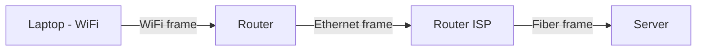
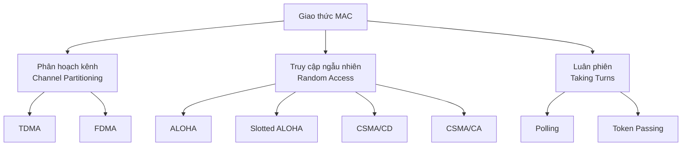
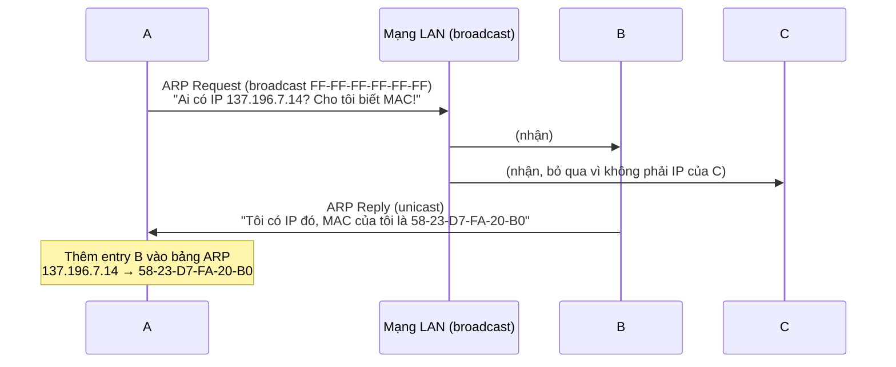
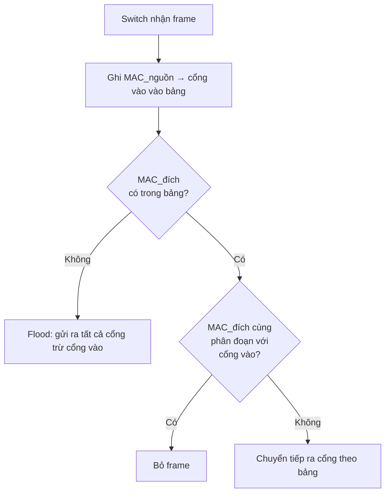
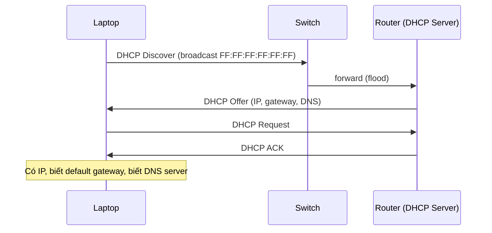
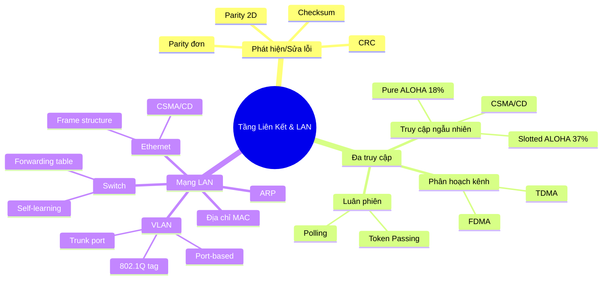

# Chương 5: Tầng Liên Kết và Mạng Cục Bộ (Link Layer & LAN)

---

## 1. Giới Thiệu Tầng Liên Kết

### 1.1 Các thuật ngữ cơ bản

- **Node**: bất kỳ host hoặc router nào trong mạng.
- **Link (liên kết)**: kênh truyền thông kết nối hai node lân cận nhau. Có thể là kết nối có dây, không dây, hoặc LAN.
- **Frame**: đơn vị dữ liệu ở tầng liên kết (Layer 2). Datagram từ tầng mạng được đóng gói (*encapsulate*) vào trong frame trước khi truyền đi.

!!! info "Nhiệm vụ cốt lõi"
    Tầng liên kết có nhiệm vụ **chuyển datagram từ một node đến node liền kề vật lý** qua một đường liên kết. Lưu ý: chỉ "liền kề vật lý" — khác với IP routing là end-to-end.

### 1.2 Ngữ cảnh hoạt động

Datagram từ nguồn đến đích có thể đi qua nhiều loại liên kết khác nhau: đoạn đầu qua WiFi, đoạn giữa qua Ethernet, đoạn cuối qua cáp quang. Mỗi loại liên kết sử dụng một giao thức tầng liên kết khác nhau.



> **Tương tự giao thông vận tải**: Datagram = khách du lịch, liên kết = phương tiện vận chuyển, giao thức tầng liên kết = cách thức di chuyển (xe limo, máy bay, tàu hỏa).

### 1.3 Các dịch vụ của tầng liên kết

| Dịch vụ | Mô tả |
|---|---|
| **Framing & Truy cập kênh** | Đóng gói datagram vào frame, thêm header/trailer. Dùng địa chỉ MAC để xác định nguồn/đích. |
| **Truyền tin cậy** | Đảm bảo frame đến nơi không bị lỗi (thường dùng cho kết nối không dây — tỷ lệ lỗi cao). |
| **Kiểm soát lưu lượng** | Đồng bộ tốc độ giữa node gửi và node nhận liền kề, tránh tràn bộ đệm. |
| **Phát hiện lỗi** | Phát hiện lỗi bit do nhiễu, suy giảm tín hiệu. Bên nhận phát hiện và yêu cầu truyền lại hoặc loại bỏ frame. |
| **Sửa lỗi** | Bên nhận tự xác định và sửa bit lỗi mà **không cần** yêu cầu truyền lại. |
| **Truyền bán song công / song công** | Half-duplex: hai chiều nhưng không đồng thời. Full-duplex: hai chiều đồng thời. |

!!! question "Câu hỏi kinh điển"
    **Tại sao cần độ tin cậy ở cả tầng liên kết lẫn tầng end-to-end (TCP)?**

    ??? answer "Trả lời"
        - Tầng liên kết cung cấp độ tin cậy **cục bộ** cho từng hop (đặc biệt quan trọng với WiFi/mạng không dây vì tỷ lệ lỗi bit cao).
        - Tầng TCP cung cấp độ tin cậy **end-to-end** toàn đường đi.
        - Nếu chỉ dùng TCP mà không có link-layer reliability, mỗi khi WiFi lỗi 1 bit, TCP phải retransmit toàn bộ segment qua cả đường dài — rất lãng phí. Link-layer sửa lỗi cục bộ nhanh hơn nhiều.

### 1.4 Tầng liên kết được triển khai ở đâu?

Tầng liên kết **không** chỉ là phần mềm thuần túy. Nó được triển khai trong **NIC (Network Interface Card)** — card mạng Ethernet hoặc chip WiFi — gắn vào bus hệ thống (PCI) của máy tính. NIC kết hợp cả hardware, firmware và software.

```
[CPU] -- [Memory] -- [Host Bus (PCI)] -- [NIC / Network Adapter]
                                              ↕
                                        Link layer + Physical layer
```

---

## 2. Phát Hiện và Sửa Lỗi

### 2.1 Nguyên lý chung

Bên gửi thêm các bit **EDC (Error Detection and Correction)** vào dữ liệu D trước khi gửi. Bên nhận dùng EDC để kiểm tra tính toàn vẹn.

```
Bên gửi: [ D | EDC ] ──────────────────► Bên nhận
                        (kênh có thể lỗi)    Kiểm tra D' và EDC'
                                             → Nếu sai: phát hiện lỗi
                                             → Nếu đúng: OK (nhưng vẫn có thể có lỗi nhỏ sót)
```

!!! warning "Lưu ý quan trọng"
    Không có kỹ thuật phát hiện lỗi nào đảm bảo **100%**. EDC càng lớn thì khả năng phát hiện lỗi càng cao, nhưng overhead cũng tăng.

### 2.2 Kiểm tra chẵn lẻ (Parity Checking)

#### Parity bit đơn (Single-bit parity)

Thêm 1 bit sao cho tổng số bit `1` trong dữ liệu + parity bit là **chẵn** (even parity).

```
Dữ liệu:  0111000110101011
Số bit 1:  9 (lẻ)
Parity bit: 1 → tổng trở thành 10 (chẵn)

Truyền đi: 0111000110101011 | 1
```

- **Ưu điểm**: đơn giản.
- **Nhược điểm**: chỉ phát hiện được lỗi **số lẻ** bit. Nếu lỗi 2 bit cùng lúc → không phát hiện được.

#### Parity 2 chiều (2D parity)

Sắp xếp dữ liệu thành ma trận i×j. Tính parity cho từng **hàng** và từng **cột**.

```
Dữ liệu gốc:     Thêm parity hàng/cột:
0 1 1 0 1  →  0 1 1 0 1 | 1
1 0 1 1 1  →  1 0 1 1 1 | 0
1 1 1 0 0  →  1 1 1 0 0 | 1
─────────     ─────────────
1 0 1 1 1  ← parity cột
```

- **Phát hiện** và **sửa** được lỗi **1 bit**: giao điểm của hàng lỗi và cột lỗi chỉ đúng vị trí bit sai.
- Phát hiện được nhiều lỗi hơn parity đơn.

### 2.3 Internet Checksum

Dùng ở **tầng transport** (UDP, TCP). Coi nội dung segment là chuỗi số nguyên 16-bit, cộng tất cả lại (bù 1 - ones' complement sum), lấy phần bù làm checksum.

**Bên gửi**: tính checksum, điền vào trường checksum của header.

**Bên nhận**: tính lại checksum của segment nhận được, so với trường checksum:
- Khác nhau → phát hiện lỗi.
- Giống nhau → OK (có thể vẫn có lỗi không phát hiện được).

!!! note "Tại sao checksum lại yếu hơn CRC?"
    Internet checksum chỉ cộng các từ 16-bit — nhiều dạng lỗi bit kết hợp có thể triệt tiêu nhau trong phép cộng, dẫn đến checksum vẫn đúng dù dữ liệu sai. CRC dùng phép chia đa thức mạnh hơn nhiều.

### 2.4 CRC (Cyclic Redundancy Check)

CRC là phương pháp mạnh nhất trong ba phương pháp, được dùng rộng rãi trong **Ethernet, WiFi 802.11**.

#### Nguyên lý

- **D**: dữ liệu gốc (d bit).
- **G**: chuỗi bit generator (bộ tạo), có độ dài r+1 bit (được thỏa thuận trước giữa hai phía).
- **R**: r bit CRC được thêm vào sau D.

Mục tiêu: chọn R sao cho `<D, R>` (tức D nối R) **chia hết cho G** theo phép chia modulo 2 (XOR).

```
Công thức: D * 2^r XOR R ≡ 0 (mod G)
→ R = remainder[ D * 2^r / G ]  (phép chia mod 2)
```

- `D * 2^r` = dịch chuyển D sang trái r bit (thêm r bit 0 vào cuối).
- Phép chia mod 2: thay phép trừ bằng XOR.

#### Ví dụ tính CRC

```
D = 101110 (d = 6 bit)
G = 1001   (r = 3, nên thêm 3 bit CRC)
D * 2^3 = 101110000

Thực hiện phép chia nhị phân D*2^3 / G:
101110000 ÷ 1001

101110000
1001
─────────
 00101000
    1001
    ─────
     01100
      1001
      ────
       1010
       1001
       ────
        011  ← R = 011

Kết quả truyền đi: <D, R> = 101110 011
```

**Bên nhận**: chia `<D', R'>` cho G. Nếu dư khác 0 → có lỗi.

!!! tip "Khả năng phát hiện lỗi của CRC"
    CRC với generator bậc r có thể phát hiện:
    - Tất cả lỗi burst có độ dài ≤ r bit.
    - Tất cả lỗi số lẻ bit (nếu G có nhân tử (x+1)).
    - Tỷ lệ phát hiện rất cao với lỗi ngẫu nhiên.

---

## 3. Các Giao Thức Đa Truy Cập (Multiple Access Protocols)

### 3.1 Vấn đề đặt ra

Khi nhiều node cùng chia sẻ **một kênh broadcast**, nếu hai node truyền đồng thời sẽ xảy ra **xung đột (collision)** — tín hiệu chồng lấp, dữ liệu bị hỏng.

**Giao thức MAC (Multiple Access Control)** định nghĩa **khi nào** một node được phép truyền, và **cách xử lý** khi xảy ra xung đột.

!!! info "Giao thức đa truy cập lý tưởng"
    Với kênh tốc độ R bps và M node đều muốn gửi:
    
    1. Một node muốn gửi → gửi được ở tốc độ R.
    2. M node đều muốn gửi → mỗi node gửi trung bình R/M.
    3. Phi tập trung hoàn toàn: không có node master điều phối.
    4. Đơn giản.

### 3.2 Ba lớp giao thức MAC



---

### 3.3 Phân hoạch kênh

#### TDMA (Time Division Multiple Access)

Chia thời gian thành các **slot** (khe thời gian) cố định, mỗi node được gán một slot riêng.

```
Vòng 1:  | Node1 | Node2 | Node3 | Node4 | Node5 | Node6 |
Vòng 2:  | Node1 |  idle | Node3 |  idle |  idle | Node6 |
```

- **Ưu điểm**: không có xung đột, công bằng.
- **Nhược điểm**: lãng phí khi tải thấp (node không có dữ liệu vẫn "chiếm" slot của mình, các node khác không được dùng).

#### FDMA (Frequency Division Multiple Access)

Chia băng thông kênh thành các **dải tần** riêng, mỗi node được gán một dải tần cố định.

```
Băng tần kênh:
|──Node1──|──Node2──|──Node3──|──Node4──|──idle──|──idle──|
 f1        f2        f3        f4         f5       f6
```

- Tương tự TDMA: không xung đột, nhưng lãng phí khi tải thấp.

---

### 3.4 Truy cập ngẫu nhiên

Node **không phối hợp** trước khi gửi. Nếu xung đột → phát hiện và **truyền lại sau một thời gian ngẫu nhiên**.

#### Pure ALOHA (Unslotted ALOHA)

Node gửi ngay khi có dữ liệu, không cần đợi đầu slot. Xung đột xảy ra khi hai frame chồng lấp về thời gian.

- Frame gửi tại t₀ có thể xung đột với frame gửi trong khoảng [t₀-1, t₀+1].
- **Hiệu suất tối đa: 1/(2e) ≈ 18%** — rất thấp.

#### Slotted ALOHA

Thời gian chia thành **slot** đồng đều. Node chỉ bắt đầu gửi vào **đầu slot**. Tất cả node đồng bộ.

**Hoạt động:**
- Nhận frame mới → gửi vào slot tiếp theo.
- Nếu **không xung đột** → thành công, chuyển frame mới.
- Nếu **xung đột** → truyền lại ở slot tiếp theo với xác suất p (ngẫu nhiên hóa để tránh xung đột lặp).

!!! question "Tại sao phải ngẫu nhiên hóa xác suất truyền lại?"
    ??? answer "Trả lời"
        Nếu tất cả node bị xung đột đều truyền lại ngay slot tiếp theo → xung đột lại xảy ra 100%. Bằng cách mỗi node truyền lại với xác suất p ngẫu nhiên, các node sẽ "trải đều" lần truyền lại ra các slot khác nhau, giảm xác suất xung đột.

**Tính hiệu suất Slotted ALOHA:**

- Xác suất 1 node thành công trong 1 slot = p(1-p)^(N-1)
- Xác suất **bất kỳ** node nào thành công = Np(1-p)^(N-1)
- Tối ưu hóa theo p, khi N → ∞:

$$\text{Hiệu suất tối đa} = \frac{1}{e} \approx 37\%$$

| Phương pháp | Hiệu suất tối đa |
|---|---|
| Pure ALOHA | ~18% |
| Slotted ALOHA | ~37% |
| CSMA/CD | Tốt hơn, phụ thuộc t_prop và t_trans |

#### CSMA (Carrier Sense Multiple Access)

> "Lắng nghe trước khi nói" — nghe xem kênh có đang bận không trước khi gửi.

- Kênh **rảnh** → gửi toàn bộ frame.
- Kênh **bận** → chờ đến khi rảnh rồi gửi.

**Vẫn có thể xung đột!** Vì có **độ trễ lan truyền** (propagation delay): node A bắt đầu gửi, nhưng tín hiệu chưa đến node B, B nghe thấy kênh rảnh và cũng bắt đầu gửi → xung đột.

#### CSMA/CD (Collision Detection)

Cải tiến từ CSMA: **phát hiện xung đột trong khi đang truyền** và **dừng ngay** khi phát hiện, thay vì truyền hết frame rồi mới biết bị lỗi.

**Thuật toán CSMA/CD (Ethernet):**

```
1. NIC nhận datagram từ tầng mạng, tạo frame
2. NIC nghe kênh:
   - Rảnh → bắt đầu truyền
   - Bận → đợi đến khi rảnh rồi truyền
3. Nếu truyền xong không có xung đột → hoàn thành ✓
4. Nếu phát hiện xung đột TRONG KHI truyền:
   - Hủy truyền ngay
   - Gửi tín hiệu "jam" (tắc nghẽn) để báo cho các node khác
5. Thực hiện Binary Exponential Backoff:
   - Sau lần xung đột thứ m: chọn K ngẫu nhiên từ {0, 1, ..., 2^m - 1}
   - Đợi K × 512 × (thời gian truyền 1 bit)
   - Quay lại bước 2
```

!!! note "Binary Exponential Backoff"
    Càng nhiều xung đột → khoảng thời gian chờ càng dài (phân phối ngẫu nhiên trong khoảng rộng hơn). Điều này giúp giảm tải khi mạng đông, tự động thích nghi với mức độ tắc nghẽn.

**Hiệu suất CSMA/CD:**

$$\text{Efficiency} = \frac{1}{1 + 5 \cdot t_{prop}/t_{trans}}$$

- t_prop → 0 hoặc t_trans → ∞ thì hiệu suất → 1 (100%)
- Trong thực tế: tốt hơn ALOHA đáng kể, đơn giản, rẻ, phi tập trung.

---

### 3.5 Giao thức Luân phiên (Taking Turns)

Kết hợp ưu điểm của cả hai loại trên: hiệu quả ở cả tải cao lẫn tải thấp.

#### Polling (Kiểm soát vòng)

Có một **node điều khiển (controller/master)** trung tâm. Master lần lượt "mời" (poll) từng slave gửi dữ liệu.

```
Master → Slave1: "Mày có gì gửi không?"
Slave1 → Master: [dữ liệu]
Master → Slave2: "Mày có gì gửi không?"
Slave2 → Master: [không có gì]
...
```

- **Ưu điểm**: không xung đột, có thứ tự.
- **Nhược điểm**: overhead polling, độ trễ do chờ lượt, **điểm lỗi duy nhất** (nếu master chết → toàn mạng chết).

#### Token Passing (Chuyển token)

Không có master. Một **token** (bản tin đặc biệt) được truyền vòng quanh theo thứ tự cố định. Node nào giữ token mới được gửi dữ liệu.

```
Token: [T] → Node A (có data) → gửi data, rồi chuyển [T] → Node B (không có data) → chuyển [T] → Node C...
```

- Dùng trong: **Bluetooth, FDDI, Token Ring**.
- **Nhược điểm**: nếu token bị mất hoặc node đang giữ token chết → cần cơ chế phục hồi phức tạp.

---

## 4. Mạng LAN

### 4.1 Địa chỉ MAC

#### So sánh địa chỉ MAC và IP

| | Địa chỉ MAC | Địa chỉ IP |
|---|---|---|
| **Độ dài** | 48 bit (6 byte) | 32 bit (IPv4) |
| **Tầng** | Tầng liên kết (L2) | Tầng mạng (L3) |
| **Phạm vi** | Cục bộ trong LAN | Toàn cầu |
| **Tính chất** | Cố định trong ROM NIC (hoặc cài đặt bằng phần mềm) | Thay đổi theo vị trí mạng |
| **Ký hiệu** | Hex: `1A-2F-BB-76-09-AD` | Thập phân: `128.119.40.136` |
| **Tương tự** | Số CMND | Địa chỉ nhà |

!!! tip "Tại sao cần cả MAC lẫn IP?"
    - IP là địa chỉ **logic**, phụ thuộc vào vị trí trong mạng (subnet). Di chuyển sang mạng khác → IP thay đổi.
    - MAC là địa chỉ **vật lý**, gắn với thiết bị phần cứng. Di chuyển đến đâu vẫn giữ MAC. Trong cùng một LAN, frame được gửi dựa trên MAC, không cần biết IP.

**Phân bổ địa chỉ MAC**: do **IEEE** quản lý. Nhà sản xuất mua một block OUI (Organizationally Unique Identifier) 24 bit đầu, tự gán 24 bit sau → đảm bảo duy nhất toàn cầu.

### 4.2 ARP (Address Resolution Protocol)

#### Vấn đề

Tầng mạng biết địa chỉ IP của đích, nhưng để tạo frame L2, cần biết **địa chỉ MAC** của node đó. ARP giải quyết vấn đề này.

#### Bảng ARP

Mỗi node duy trì một **bảng ARP** trong RAM:

```
< Địa chỉ IP | Địa chỉ MAC | TTL (Time To Live) >
137.196.7.14  58-23-D7-FA-20-B0  500s
137.196.7.23  71-65-F7-2B-08-53  300s
```

TTL thường là **20 phút** — sau đó entry bị xóa (để phòng khi MAC thay đổi).

#### Quy trình ARP (A muốn gửi cho B, chưa biết MAC của B)



**Bước 1**: A gửi **ARP Request** broadcast (`FF-FF-FF-FF-FF-FF`), chứa IP của B cần tìm. Tất cả node trong LAN đều nhận.

**Bước 2**: Node có IP trùng (là B) gửi **ARP Reply** unicast về cho A, chứa MAC của mình.

**Bước 3**: A cập nhật bảng ARP, lưu ánh xạ `IP_B → MAC_B`.

#### Định tuyến qua mạng con khác (A → R → B)

Khi A và B ở **khác subnet**, A không thể gửi trực tiếp cho B. Phải đi qua router R.

```
A (111.111.111.111) ──── Router R ──── B (222.222.222.222)
         Subnet 1                           Subnet 2
```

| Giai đoạn | IP src | IP dst | MAC src | MAC dst |
|---|---|---|---|---|
| A → R | 111.111.111.111 | 222.222.222.222 | MAC_A | MAC_R_port1 |
| R → B | 111.111.111.111 | 222.222.222.222 | MAC_R_port2 | MAC_B |

!!! note "Lưu ý quan trọng"
    Địa chỉ IP nguồn/đích **không thay đổi** suốt hành trình (vẫn là A và B). Chỉ có địa chỉ MAC nguồn/đích thay đổi ở mỗi hop.

---

### 4.3 Ethernet

#### Lịch sử và đặc điểm

- Công nghệ LAN **đầu tiên** được sử dụng rộng rãi (do Robert Metcalfe phát minh).
- Đơn giản, rẻ, dễ triển khai.
- Tốc độ phát triển liên tục: 10 Mbps → 100 Mbps → 1 Gbps → 10 Gbps → **400 Gbps**.

#### Cấu trúc vật lý

- **Bus** (trước ~1990s): tất cả node cùng kết nối vào một cáp đồng trục chung → cùng miền xung đột.
- **Switch** (hiện đại): mỗi node kết nối riêng đến switch → không xung đột, full-duplex.

#### Cấu trúc Ethernet Frame

```
| Preamble (7B) | SFD (1B) | MAC đích (6B) | MAC nguồn (6B) | Type (2B) | Data (46-1500B) | CRC (4B) |
```

| Trường | Kích thước | Mô tả |
|---|---|---|
| **Preamble** | 7 byte | 7 × `10101010` — đồng bộ clock giữa sender/receiver |
| **SFD (Start Frame Delimiter)** | 1 byte | `10101011` — báo hiệu frame sắp bắt đầu |
| **MAC đích** | 6 byte | Địa chỉ MAC đích. `FF:FF:FF:FF:FF:FF` = broadcast |
| **MAC nguồn** | 6 byte | Địa chỉ MAC của node gửi |
| **Type** | 2 byte | Giao thức tầng trên (`0x0800` = IPv4, `0x0806` = ARP...) |
| **Data** | 46–1500 byte | Payload (datagram IP hoặc giao thức khác) |
| **CRC** | 4 byte | Kiểm tra lỗi CRC-32. Lỗi → loại bỏ frame |

#### Ethernet: Không kết nối, Không tin cậy

- **Connectionless**: không có quá trình bắt tay trước khi gửi.
- **Unreliable**: NIC nhận không gửi ACK/NAK. Frame bị mất → không tự động truyền lại ở tầng liên kết.
- Dữ liệu mất chỉ được khôi phục nếu tầng trên (TCP) hỗ trợ.
- Giao thức đa truy cập: **Unslotted CSMA/CD** với binary exponential backoff.

---

### 4.4 Switch (Bộ chuyển mạch Ethernet)

#### Đặc điểm cơ bản

Switch là thiết bị **tầng liên kết (Layer 2)**:

- **Store-and-forward**: nhận toàn bộ frame trước khi chuyển tiếp.
- **Selective forwarding**: dựa trên MAC đích, chỉ gửi ra đúng cổng cần thiết, không flood ra tất cả cổng.
- **Transparent**: các host không biết có switch — cắm vào là chạy.
- **Plug-and-play, self-learning**: không cần cấu hình tay.
- Mỗi cổng switch là một **collision domain riêng** → không xung đột giữa các host.

#### Bảng chuyển tiếp (Switch Forwarding Table)

Mỗi switch duy trì bảng:

```
| MAC địa chỉ      | Cổng | TTL |
|------------------|------|-----|
| AA-BB-CC-DD-EE-01 |  1   |  60 |
| AA-BB-CC-DD-EE-02 |  3   |  60 |
```

#### Switch tự học (Self-learning)



!!! example "Ví dụ tự học"
    - Ban đầu bảng trống. A gửi frame cho A'.
    - Switch ghi: `MAC_A → cổng 1`.
    - MAC_A' chưa có trong bảng → **flood** ra tất cả cổng (trừ cổng 1).
    - A' nhận và trả lời A. Switch ghi: `MAC_A' → cổng 4`.
    - Lần sau A gửi cho A': switch biết A' ở cổng 4 → chỉ gửi ra cổng 4.

#### Kết nối nhiều Switch

Nhiều switch có thể kết nối nhau tạo thành mạng lớn. Switch học địa chỉ MAC theo nguyên tắc tương tự như với một switch đơn — qua quá trình flood và tự học.

#### Switch vs Router

| | Switch | Router |
|---|---|---|
| **Tầng** | Layer 2 (Link) | Layer 3 (Network) |
| **Header kiểm tra** | MAC address | IP address |
| **Bảng chuyển tiếp** | Tự học bằng flooding | Tính toán bằng thuật toán định tuyến (OSPF, BGP...) |
| **Phạm vi** | Trong cùng LAN | Giữa các mạng khác nhau |

---

### 4.5 VLAN (Virtual LAN)

#### Vấn đề khi LAN mở rộng

Khi một LAN vật lý lớn, tất cả **broadcast traffic** (ARP, DHCP, MAC chưa biết) phải gửi tới **tất cả** node → lãng phí băng thông, giảm hiệu năng, rủi ro bảo mật.

**Thêm vào đó**: nhân viên di chuyển giữa các phòng ban nhưng vẫn muốn giữ kết nối logic với VLAN cũ của mình.

#### VLAN là gì?

VLAN cho phép một **switch vật lý** hoạt động như **nhiều switch ảo** độc lập. Các nhóm cổng khác nhau tạo thành các broadcast domain tách biệt.

```
Switch vật lý (16 cổng):
┌────────────────────────────────┐
│ EE VLAN: cổng 1-8              │
│ CS VLAN: cổng 9-15             │
└────────────────────────────────┘
→ Frame từ cổng 1 chỉ có thể đến cổng 1-8, không qua được cổng 9-15
```

#### Port-based VLAN

Cấu hình bằng phần mềm quản lý switch: gán từng cổng vào VLAN nào.

- **Cách ly lưu lượng**: frame chỉ đi trong cùng VLAN.
- **Thành viên động**: có thể gán lại cổng cho VLAN khác bằng lệnh (không cần cắm lại dây).
- **Routing giữa VLAN**: cần qua router (hoặc switch L3) — traffic không tự đi qua được giữa các VLAN.

#### VLAN Trunk Port

Khi VLAN cần **trải rộng qua nhiều switch vật lý**, cần **trunk port** — cổng đặc biệt cho phép frame của **nhiều VLAN khác nhau** đi qua.

Frame trên trunk port phải mang thêm thông tin **VLAN ID** để switch đích biết frame thuộc VLAN nào.

#### Chuẩn 802.1Q

Thêm **4 byte tag** vào giữa Ethernet frame:

```
Ethernet frame gốc:
| Preamble | MAC đích | MAC nguồn | Type | Data | CRC |

802.1Q frame (thêm VLAN tag):
| Preamble | MAC đích | MAC nguồn | 802.1Q Tag (4B) | Type | Data | CRC |
                                    ↕
                          | Protocol ID (2B: 0x8100) | Priority (3b) | VLAN ID (12b) |
```

- **VLAN ID**: 12 bit → tối đa **4094 VLAN** trên một mạng.
- **Priority**: 3 bit → ưu tiên QoS (tương tự IP TOS).
- Switch trunk thêm tag khi gửi ra trunk port, xóa tag khi chuyển vào access port.

---

## 5. Tổng Hợp: Hành Trình Của Một Yêu Cầu Web

Kịch bản: sinh viên cắm laptop vào mạng UIT, mở trình duyệt vào `www.google.com`.

### Bước 1: DHCP — Lấy địa chỉ IP



Gói DHCP được đóng gói: `DHCP → UDP → IP → Ethernet frame`.

### Bước 2: ARP — Tìm MAC của Default Gateway

Trước khi gửi DNS query, laptop cần MAC của router (default gateway).

```
ARP Request broadcast → tất cả node trong LAN
Router trả lời ARP Reply → laptop có MAC của router
```

### Bước 3: DNS — Phân giải tên miền

Laptop gửi DNS query hỏi IP của `www.google.com`:

```
DNS query → UDP → IP → Ethernet frame (MAC đích = MAC router)
→ Router chuyển tiếp qua ISP → DNS server → trả lời IP của Google
```

### Bước 4: TCP — Thiết lập kết nối

```
Laptop → Google: TCP SYN
Google → Laptop: TCP SYN-ACK
Laptop → Google: TCP ACK
→ Kết nối TCP đã thiết lập
```

### Bước 5: HTTP — Yêu cầu và nhận trang web

```
Laptop → Google: HTTP GET /
Google → Laptop: HTTP 200 OK (nội dung trang web)
→ Trình duyệt hiển thị trang Google
```

!!! summary "Các giao thức tham gia trong một yêu cầu web đơn giản"
    DHCP → ARP → DNS → TCP (3-way handshake) → HTTP — mỗi bước đóng vai trò thiết yếu ở tầng khác nhau (Application, Transport, Network, Link).

---

## 6. Tóm Tắt Chương 5



---

# 50+ Câu Trắc Nghiệm Ôn Tập

---

**Câu 1.** Nhiệm vụ chính của tầng liên kết là gì?

- A. Định tuyến gói tin từ nguồn đến đích qua nhiều mạng
- B. Chuyển datagram từ một node đến node liền kề vật lý qua một đường liên kết
- C. Mã hóa dữ liệu để bảo mật truyền thông
- D. Phân giải tên miền thành địa chỉ IP

??? info "Đáp án & Giải thích"
    **Đáp án: B**

    Tầng liên kết chỉ chịu trách nhiệm truyền dữ liệu trong phạm vi **một hop** — từ node này sang node **liền kề vật lý** qua một liên kết. Định tuyến end-to-end là việc của tầng mạng (IP).

---

**Câu 2.** Đơn vị dữ liệu ở tầng liên kết được gọi là gì?

- A. Segment
- B. Datagram
- C. Frame
- D. Packet

??? info "Đáp án & Giải thích"
    **Đáp án: C**

    - Segment: tầng Transport (TCP/UDP)
    - Datagram / Packet: tầng Network (IP)
    - Frame: tầng Link
    - Bit: tầng Physical

---

**Câu 3.** Tầng liên kết được triển khai chủ yếu ở đâu trong máy tính?

- A. Trong nhân hệ điều hành (kernel)
- B. Trong card mạng (NIC) hoặc chip mạng
- C. Trong CPU
- D. Trong RAM của máy tính

??? info "Đáp án & Giải thích"
    **Đáp án: B**

    NIC (Network Interface Card) triển khai cả tầng liên kết và tầng vật lý. NIC là sự kết hợp của hardware, firmware, và software, gắn vào bus hệ thống (PCI) của máy.

---

**Câu 4.** Sự khác biệt giữa **phát hiện lỗi** và **sửa lỗi** là gì?

- A. Phát hiện lỗi xảy ra ở bên gửi, sửa lỗi xảy ra ở bên nhận
- B. Phát hiện lỗi chỉ thông báo có lỗi, sửa lỗi tự xác định và sửa bit sai không cần truyền lại
- C. Phát hiện lỗi dùng CRC, sửa lỗi dùng checksum
- D. Không có sự khác biệt, đây là hai tên gọi của cùng một kỹ thuật

??? info "Đáp án & Giải thích"
    **Đáp án: B**

    - **Phát hiện lỗi**: chỉ biết có lỗi, thường yêu cầu truyền lại hoặc loại bỏ frame.
    - **Sửa lỗi (Forward Error Correction - FEC)**: bên nhận dùng thông tin dư thừa trong EDC để xác định **vị trí** bit sai và sửa ngay, không cần hỏi lại bên gửi.

---

**Câu 5.** Single-bit parity có khả năng phát hiện bao nhiêu bit lỗi?

- A. Không phát hiện được lỗi nào
- B. Phát hiện tất cả lỗi bit
- C. Phát hiện lỗi khi số bit lỗi là **lẻ**
- D. Phát hiện lỗi khi số bit lỗi là **chẵn**

??? info "Đáp án & Giải thích"
    **Đáp án: C**

    Single-bit parity chỉ phát hiện được khi số bit bị lỗi là **lẻ** (1, 3, 5...). Nếu 2 bit cùng lỗi, chúng triệt tiêu nhau trong parity → không phát hiện được.

---

**Câu 6.** 2D Parity có thể làm gì mà single-bit parity không làm được?

- A. Phát hiện lỗi nhiều bit hơn và **sửa** lỗi 1 bit
- B. Nén dữ liệu trước khi truyền
- C. Mã hóa dữ liệu
- D. Tăng tốc độ truyền

??? info "Đáp án & Giải thích"
    **Đáp án: A**

    2D parity sắp xếp dữ liệu thành ma trận, tính parity cho cả hàng và cột. Khi 1 bit lỗi: cả hàng lẫn cột tương ứng sẽ sai → xác định được **chính xác vị trí** bit lỗi → **sửa** được. Single-bit parity chỉ biết có lỗi, không biết lỗi ở đâu.

---

**Câu 7.** CRC được sử dụng trong công nghệ nào sau đây?

- A. Chỉ trong mạng không dây WiFi
- B. Chỉ trong mạng Ethernet
- C. Cả Ethernet và WiFi 802.11
- D. Chỉ trong mạng điện thoại di động

??? info "Đáp án & Giải thích"
    **Đáp án: C**

    CRC được sử dụng rộng rãi trong thực tế, bao gồm **Ethernet** và **WiFi 802.11**, cũng như nhiều giao thức khác vì khả năng phát hiện lỗi vượt trội so với checksum hay parity.

---

**Câu 8.** Trong CRC, nếu phần dư khi chia `<D', R'>` cho G tại bên nhận bằng 0, điều đó có nghĩa là gì?

- A. Chắc chắn có lỗi xảy ra
- B. Chắc chắn không có lỗi
- C. Không phát hiện thấy lỗi (nhưng vẫn có thể có lỗi không phát hiện được)
- D. CRC không hoạt động đúng

??? info "Đáp án & Giải thích"
    **Đáp án: C**

    Dư bằng 0 nghĩa là không phát hiện lỗi. Tuy nhiên, không có phương pháp nào đảm bảo 100% — một số tổ hợp lỗi đặc biệt có thể khiến dư vẫn bằng 0 dù dữ liệu bị sai (xác suất rất thấp).

---

**Câu 9.** Trong CRC với generator G có r+1 bit, có thể phát hiện tất cả lỗi burst có độ dài tối đa bao nhiêu bit?

- A. r-1 bit
- B. r bit
- C. r+1 bit
- D. 2r bit

??? info "Đáp án & Giải thích"
    **Đáp án: B**

    CRC với bộ tạo bậc r (r+1 bit) có thể phát hiện tất cả lỗi burst có độ dài **≤ r bit**.

---

**Câu 10.** Giao thức đa truy cập lý tưởng với kênh R bps và M node đều muốn gửi, mỗi node nên gửi được ở tốc độ?

- A. R bps
- B. R/2 bps
- C. R/M bps
- D. M×R bps

??? info "Đáp án & Giải thích"
    **Đáp án: C**

    Giao thức đa truy cập lý tưởng: khi M node đều muốn gửi, mỗi node có thể gửi trung bình **R/M** bps — chia đều băng thông công bằng.

---

**Câu 11.** TDMA là viết tắt của gì và hoạt động theo nguyên lý nào?

- A. Time Division Multiple Access — chia kênh thành các khe thời gian, mỗi node được gán 1 khe
- B. Transmission Data Multiple Access — truyền dữ liệu theo nhiều đường
- C. Total Division Media Access — chia tổng thể kênh truyền
- D. Time Domain Media Architecture — kiến trúc kênh theo miền thời gian

??? info "Đáp án & Giải thích"
    **Đáp án: A**

    TDMA = Time Division Multiple Access. Thời gian được chia thành các slot có kích thước cố định (bằng thời gian truyền 1 frame). Mỗi node được gán 1 slot trong mỗi vòng. Slot không dùng bị lãng phí.

---

**Câu 12.** Nhược điểm chính của TDMA và FDMA là gì?

- A. Dễ gây xung đột
- B. Lãng phí khi tải thấp — node không truyền vẫn giữ slot/tần số của mình
- C. Phức tạp, khó triển khai
- D. Không thể sử dụng cho nhiều hơn 2 node

??? info "Đáp án & Giải thích"
    **Đáp án: B**

    Cả TDMA và FDMA đều lãng phí tài nguyên khi tải thấp: một node không có dữ liệu vẫn "chiếm" slot/dải tần của mình, các node khác không được dùng dù kênh rảnh.

---

**Câu 13.** Trong Slotted ALOHA, khi xảy ra xung đột, node xử lý thế nào?

- A. Hủy bỏ frame và không gửi lại
- B. Truyền lại ngay lập tức ở slot tiếp theo
- C. Truyền lại ở mỗi slot tiếp theo với xác suất p ngẫu nhiên
- D. Chờ đúng 2 slot rồi truyền lại

??? info "Đáp án & Giải thích"
    **Đáp án: C**

    Sau xung đột, node truyền lại ở mỗi slot tiếp theo với **xác suất p** (không phải luôn luôn gửi lại ngay). Tính ngẫu nhiên giúp tránh xung đột lặp liên tục.

---

**Câu 14.** Hiệu suất tối đa của Slotted ALOHA là bao nhiêu?

- A. 100%
- B. 50%
- C. 37% (1/e)
- D. 18% (1/2e)

??? info "Đáp án & Giải thích"
    **Đáp án: C**

    Hiệu suất tối đa của Slotted ALOHA = **1/e ≈ 0.37 (37%)**. Nghĩa là kênh chỉ được dùng hữu ích 37% thời gian trong điều kiện tối ưu.

---

**Câu 15.** Hiệu suất tối đa của Pure (Unslotted) ALOHA là bao nhiêu?

- A. 37%
- B. 25%
- C. 18% (1/2e)
- D. 50%

??? info "Đáp án & Giải thích"
    **Đáp án: C**

    Pure ALOHA = **1/(2e) ≈ 18%** — thấp hơn Slotted ALOHA vì frame có thể xung đột trong khoảng thời gian rộng hơn (không đồng bộ slot).

---

**Câu 16.** Tại sao Pure ALOHA có hiệu suất thấp hơn Slotted ALOHA?

- A. Pure ALOHA dùng nhiều băng thông hơn
- B. Không đồng bộ slot → frame có thể xung đột trong khoảng thời gian rộng gấp đôi (t₀-1 đến t₀+1)
- C. Pure ALOHA không phát hiện được xung đột
- D. Pure ALOHA yêu cầu nhiều node hơn

??? info "Đáp án & Giải thích"
    **Đáp án: B**

    Trong Slotted ALOHA, frame chỉ có thể xung đột với frame **cùng slot**. Trong Pure ALOHA, frame gửi tại t₀ có thể xung đột với frame gửi bất cứ lúc nào trong khoảng **[t₀-1, t₀+1]** — khoảng "nguy hiểm" gấp đôi.

---

**Câu 17.** CSMA là viết tắt của gì và nguyên lý hoạt động?

- A. Collision Sense Multiple Access — phát hiện xung đột trước khi gửi
- B. Carrier Sense Multiple Access — cảm biến sóng mang (nghe kênh) trước khi truyền
- C. Channel Sharing Multiple Access — chia sẻ kênh truyền
- D. Coded Signal Multiple Access — dùng mã để truy cập kênh

??? info "Đáp án & Giải thích"
    **Đáp án: B**

    CSMA = **Carrier Sense Multiple Access** — "cảm biến sóng mang": nghe xem kênh có đang được dùng không trước khi truyền. Nếu rảnh → gửi; nếu bận → chờ.

---

**Câu 18.** Tại sao CSMA vẫn có thể xảy ra xung đột dù đã "nghe kênh" trước khi gửi?

- A. Vì CSMA không thể phát hiện tín hiệu
- B. Vì có độ trễ lan truyền: tín hiệu của node A chưa đến B khi B bắt đầu gửi
- C. Vì CSMA chỉ hoạt động với mạng không dây
- D. Vì các node không đồng bộ thời gian

??? info "Đáp án & Giải thích"
    **Đáp án: B**

    **Propagation delay** là nguyên nhân: node A bắt đầu gửi, nhưng tín hiệu chưa lan truyền đến node B. B nghe thấy kênh rảnh → bắt đầu gửi → xung đột. Khoảng cách càng xa, propagation delay càng lớn, xác suất xung đột càng cao.

---

**Câu 19.** CSMA/CD khác CSMA như thế nào?

- A. CSMA/CD không cần nghe kênh trước khi gửi
- B. CSMA/CD phát hiện xung đột **trong khi đang truyền** và dừng ngay, giảm lãng phí
- C. CSMA/CD chỉ dùng cho mạng không dây
- D. CSMA/CD cho phép gửi mà không cần chờ kênh rảnh

??? info "Đáp án & Giải thích"
    **Đáp án: B**

    CSMA/CD thêm khả năng **Collision Detection**: trong khi truyền, node liên tục giám sát kênh. Nếu phát hiện xung đột → **dừng ngay** (không gửi hết frame vô ích) → gửi jam signal → thực hiện backoff. Tiết kiệm thời gian kênh đáng kể.

---

**Câu 20.** Tín hiệu "jam" trong CSMA/CD có tác dụng gì?

- A. Tăng tốc độ truyền sau xung đột
- B. Thông báo cho tất cả các node biết đã xảy ra xung đột
- C. Yêu cầu node đích gửi ACK
- D. Reset bộ đếm thời gian backoff

??? info "Đáp án & Giải thích"
    **Đáp án: B**

    Sau khi phát hiện xung đột, node gửi tín hiệu **jam** để đảm bảo tất cả các node liên quan đều biết xung đột đã xảy ra, tránh trường hợp chỉ một phía biết.

---

**Câu 21.** Binary Exponential Backoff trong CSMA/CD hoạt động như thế nào?

- A. Luôn đợi đúng 512 bit-times trước khi truyền lại
- B. Sau lần xung đột thứ m, chọn K ngẫu nhiên từ {0,...,2^m-1} rồi đợi K×512 bit-times
- C. Tăng tốc độ truyền gấp đôi sau mỗi xung đột
- D. Đợi thời gian cố định sau mỗi xung đột

??? info "Đáp án & Giải thích"
    **Đáp án: B**

    Sau lần xung đột thứ m: chọn K ngẫu nhiên trong {0, 1, 2, ..., **2^m - 1**}. Đợi K × 512 × (thời gian truyền 1 bit). Khoảng chờ tăng theo hàm mũ → tự thích nghi với tải mạng cao.

---

**Câu 22.** Hiệu suất CSMA/CD tốt nhất khi nào?

- A. Khi t_prop lớn và t_trans nhỏ
- B. Khi t_prop → 0 hoặc t_trans → ∞
- C. Khi số node trong mạng lớn
- D. Khi tốc độ truyền thấp

??? info "Đáp án & Giải thích"
    **Đáp án: B**

    Công thức hiệu suất: `Efficiency = 1 / (1 + 5×t_prop/t_trans)`. Khi t_prop → 0 (không có độ trễ lan truyền) hoặc t_trans → ∞ (frame rất dài), hiệu suất → 1 (100%).

---

**Câu 23.** Giao thức MAC nào được sử dụng trong Ethernet?

- A. Slotted ALOHA
- B. TDMA
- C. Unslotted CSMA/CD với binary exponential backoff
- D. Token Passing

??? info "Đáp án & Giải thích"
    **Đáp án: C**

    Ethernet dùng **Unslotted CSMA/CD** (không chia slot thời gian) kết hợp với **binary exponential backoff** để xử lý xung đột.

---

**Câu 24.** Giao thức MAC nào được sử dụng trong WiFi 802.11?

- A. CSMA/CD
- B. CSMA/CA
- C. Token Passing
- D. Pure ALOHA

??? info "Đáp án & Giải thích"
    **Đáp án: B**

    WiFi dùng **CSMA/CA (Collision Avoidance)** thay vì CD vì trong môi trường không dây, phát hiện xung đột trong khi đang truyền rất khó (node đang phát không thể "nghe" đồng thời trên cùng tần số). CSMA/CA cố gắng **tránh** xung đột thay vì phát hiện.

---

**Câu 25.** Polling (kiểm soát vòng) có nhược điểm gì?

- A. Gây quá nhiều xung đột
- B. Không thể dùng với nhiều hơn 2 node
- C. Overhead polling, độ trễ, và **điểm lỗi duy nhất** (node điều khiển chết → cả mạng chết)
- D. Không hiệu quả với tải cao

??? info "Đáp án & Giải thích"
    **Đáp án: C**

    Điểm yếu chính của Polling: nếu **master controller** bị lỗi, toàn bộ mạng ngừng hoạt động. Đây là **single point of failure**.

---

**Câu 26.** Token Passing được sử dụng trong công nghệ mạng nào?

- A. Ethernet và WiFi
- B. Bluetooth, FDDI, Token Ring
- C. 4G/5G và vệ tinh
- D. DOCSIS và cáp đồng trục

??? info "Đáp án & Giải thích"
    **Đáp án: B**

    Token Passing được dùng trong: **Bluetooth, FDDI (Fiber Distributed Data Interface), Token Ring** — các công nghệ mạng có cấu trúc vòng hoặc sao.

---

**Câu 27.** Địa chỉ MAC có độ dài bao nhiêu bit?

- A. 32 bit
- B. 48 bit
- C. 64 bit
- D. 128 bit

??? info "Đáp án & Giải thích"
    **Đáp án: B**

    Địa chỉ MAC tiêu chuẩn có độ dài **48 bit (6 byte)**, thường ký hiệu ở dạng hex: `AA-BB-CC-DD-EE-FF`.

---

**Câu 28.** Ai quản lý việc phân bổ địa chỉ MAC?

- A. IANA (Internet Assigned Numbers Authority)
- B. IETF
- C. IEEE
- D. Mỗi nhà sản xuất tự quyết định

??? info "Đáp án & Giải thích"
    **Đáp án: C**

    **IEEE** quản lý phân bổ địa chỉ MAC. Mỗi nhà sản xuất mua một block OUI (24 bit đầu) từ IEEE, sau đó tự gán 24 bit còn lại cho từng thiết bị → đảm bảo địa chỉ MAC **duy nhất toàn cầu**.

---

**Câu 29.** Sự khác biệt quan trọng nhất giữa địa chỉ MAC và địa chỉ IP là gì?

- A. MAC dài hơn IP
- B. MAC cố định với phần cứng (portable), IP phụ thuộc vào vị trí mạng
- C. MAC dùng số thập phân, IP dùng số hex
- D. MAC là địa chỉ tầng mạng, IP là địa chỉ tầng liên kết

??? info "Đáp án & Giải thích"
    **Đáp án: B**

    MAC giống **số CMND** — cố định, di chuyển đến đâu vẫn giữ. IP giống **địa chỉ nhà** — thay đổi khi chuyển mạng. Tính "portable" của MAC cho phép cắm thiết bị vào bất kỳ LAN nào mà không cần cấu hình lại.

---

**Câu 30.** ARP Request được gửi như thế nào?

- A. Unicast đến node đích
- B. Broadcast đến tất cả node trong LAN (MAC đích = FF-FF-FF-FF-FF-FF)
- C. Multicast đến một nhóm node
- D. Chỉ gửi đến default gateway

??? info "Đáp án & Giải thích"
    **Đáp án: B**

    ARP Request là gói **broadcast** — địa chỉ MAC đích là `FF:FF:FF:FF:FF:FF`. Tất cả node trong LAN đều nhận, node nào có IP phù hợp sẽ trả lời bằng **ARP Reply unicast**.

---

**Câu 31.** TTL trong bảng ARP thường là bao lâu và mục đích là gì?

- A. 1 phút — để tiết kiệm bộ nhớ
- B. 20 phút — để entry cũ bị xóa khi MAC thay đổi (ví dụ thay NIC)
- C. 1 giờ — để giảm số lần gửi ARP Request
- D. Vĩnh viễn — MAC không bao giờ thay đổi

??? info "Đáp án & Giải thích"
    **Đáp án: B**

    TTL ≈ **20 phút**. Sau TTL, entry bị xóa và ARP Request sẽ được gửi lại nếu cần. Điều này giúp cập nhật khi MAC thay đổi (thay NIC, cấu hình phần mềm...).

---

**Câu 32.** Khi A gửi datagram cho B ở subnet khác qua router R, địa chỉ MAC đích trong frame đầu tiên (từ A đến R) là gì?

- A. MAC của B
- B. MAC của A
- C. MAC của cổng router R kết nối với subnet của A
- D. Địa chỉ broadcast

??? info "Đáp án & Giải thích"
    **Đáp án: C**

    Frame từ A → R có MAC đích là **MAC của cổng router R** (cổng ở phía subnet của A). IP đích vẫn là IP của B. Router sẽ nhận frame này, đọc IP đích (B), tra bảng định tuyến, và tạo frame mới với MAC đích là MAC của B.

---

**Câu 33.** Khi frame A→R đến router, điều gì xảy ra với datagram IP bên trong?

- A. Router sửa địa chỉ IP nguồn và đích
- B. Router tách frame, giữ nguyên datagram IP (IP nguồn/đích không đổi), tạo frame mới với MAC đích = MAC của B
- C. Router đóng gói thêm một lớp IP nữa
- D. Router loại bỏ datagram và tạo datagram mới hoàn toàn

??? info "Đáp án & Giải thích"
    **Đáp án: B**

    Router hoạt động ở **Layer 3**: tách frame → lấy datagram IP ra → tra bảng định tuyến → tạo frame **mới** với MAC nguồn là MAC cổng R ở phía subnet B, MAC đích là MAC của B. **IP nguồn và đích không thay đổi** — đây là điểm quan trọng.

---

**Câu 34.** Trường Preamble trong Ethernet frame có tác dụng gì?

- A. Xác định giao thức tầng trên
- B. Đồng bộ hóa clock giữa bên gửi và bên nhận
- C. Kiểm tra lỗi của frame
- D. Ghi địa chỉ MAC nguồn

??? info "Đáp án & Giải thích"
    **Đáp án: B**

    Preamble (7 byte `10101010` + 1 byte `10101011`) dùng để **đồng bộ clock**: bên nhận dùng chuỗi bit luân phiên 0-1 để điều chỉnh tốc độ đồng hồ của mình khớp với bên gửi trước khi nhận dữ liệu thực sự.

---

**Câu 35.** Trường "Type" trong Ethernet frame dùng để làm gì?

- A. Xác định kích thước của frame
- B. Xác định giao thức tầng trên (IPv4, ARP, IPv6...) để demultiplex tại bên nhận
- C. Ghi số thứ tự frame
- D. Chỉ định tốc độ truyền

??? info "Đáp án & Giải thích"
    **Đáp án: B**

    Trường Type (2 byte) cho bên nhận biết payload của frame là giao thức nào: `0x0800` = IPv4, `0x0806` = ARP, `0x86DD` = IPv6... Dùng để **demultiplex** lên đúng giao thức tầng mạng.

---

**Câu 36.** Ethernet có đặc điểm nào sau đây?

- A. Kết nối (connection-oriented) và đáng tin cậy (reliable)
- B. Không kết nối và đáng tin cậy
- C. Kết nối nhưng không đáng tin cậy
- D. Không kết nối và không đáng tin cậy

??? info "Đáp án & Giải thích"
    **Đáp án: D**

    Ethernet là **connectionless** (không bắt tay trước) và **unreliable** (không ACK/NAK). Độ tin cậy end-to-end do tầng trên (TCP) đảm nhiệm.

---

**Câu 37.** Switch khác hub như thế nào?

- A. Switch hoạt động ở Layer 3, hub ở Layer 2
- B. Switch chuyển tiếp có chọn lọc dựa trên MAC, hub chỉ lặp lại tín hiệu ra tất cả cổng
- C. Switch dùng CSMA/CD, hub không dùng
- D. Switch chỉ dùng cho mạng không dây

??? info "Đáp án & Giải thích"
    **Đáp án: B**

    **Hub** chỉ là bộ lặp tín hiệu vật lý (Layer 1) — nhận tín hiệu ở 1 cổng, khuếch đại và phát ra **tất cả** cổng còn lại → tất cả node cùng 1 collision domain. **Switch** (Layer 2) đọc MAC đích, chỉ gửi ra **đúng cổng** cần thiết → mỗi cổng là 1 collision domain riêng.

---

**Câu 38.** Switch "tự học" (self-learning) hoạt động theo nguyên lý nào?

- A. Nhận cấu hình từ admin qua SNMP
- B. Khi nhận frame, ghi lại ánh xạ MAC_nguồn → số cổng vào bảng chuyển tiếp
- C. Trao đổi bảng MAC với các switch khác qua giao thức định tuyến
- D. Dùng ARP để khám phá địa chỉ MAC của các node

??? info "Đáp án & Giải thích"
    **Đáp án: B**

    Mỗi khi switch nhận frame, nó đọc **MAC nguồn** và ghi vào bảng: `MAC → cổng vào`. Dần dần switch biết tất cả MAC trong mạng ở cổng nào → chuyển tiếp chính xác mà không cần cấu hình tay.

---

**Câu 39.** Khi switch nhận frame có MAC đích chưa có trong bảng chuyển tiếp, nó làm gì?

- A. Loại bỏ frame
- B. Gửi ARP Request để tìm MAC
- C. **Flood**: gửi ra tất cả cổng trừ cổng nhận vào
- D. Gửi về cổng nhận vào

??? info "Đáp án & Giải thích"
    **Đáp án: C**

    Khi MAC đích chưa biết → **flooding**: gửi frame ra **tất cả cổng** (trừ cổng đã nhận frame vào). Node đích sẽ nhận, trả lời → switch học được vị trí của node đích.

---

**Câu 40.** Khi switch nhận frame có MAC đích trùng với cùng phân đoạn (segment) mà frame đến, switch làm gì?

- A. Chuyển tiếp frame ra cổng đó
- B. **Loại bỏ (drop) frame** — vì nguồn và đích cùng segment, không cần chuyển qua switch
- C. Flood ra tất cả cổng
- D. Gửi NACK về nguồn

??? info "Đáp án & Giải thích"
    **Đáp án: B**

    Nếu MAC đích nằm cùng phân đoạn với cổng nhận vào (nghĩa là nguồn và đích có thể nói chuyện trực tiếp mà không cần qua switch), switch **loại bỏ frame** để tránh gây nhiễu không cần thiết.

---

**Câu 41.** So sánh Switch và Router: điểm giống nhau là gì?

- A. Cả hai đều dùng địa chỉ IP để chuyển tiếp
- B. Cả hai đều là thiết bị store-and-forward và đều có bảng chuyển tiếp
- C. Cả hai đều hoạt động ở Layer 2
- D. Cả hai đều dùng thuật toán định tuyến như OSPF

??? info "Đáp án & Giải thích"
    **Đáp án: B**

    Cả switch và router đều là thiết bị **store-and-forward** (nhận → lưu → kiểm tra → chuyển tiếp) và đều có **bảng chuyển tiếp**. Sự khác biệt là tầng hoạt động và cách xây dựng bảng.

---

**Câu 42.** Vấn đề gì phát sinh khi một LAN vật lý mở rộng quá lớn mà không dùng VLAN?

- A. Địa chỉ IP không đủ
- B. Tất cả broadcast traffic (ARP, DHCP...) phải gửi đến toàn bộ mạng → giảm hiệu năng và bảo mật
- C. Switch không thể học địa chỉ MAC
- D. CRC không còn hoạt động chính xác

??? info "Đáp án & Giải thích"
    **Đáp án: B**

    Khi LAN lớn, mọi **broadcast** (ARP, DHCP, MAC chưa biết) đều được gửi đến **tất cả** node trong mạng — lãng phí băng thông, tăng tải CPU của tất cả thiết bị, và tạo rủi ro bảo mật (ai cũng nhận được broadcast).

---

**Câu 43.** Port-based VLAN là gì?

- A. VLAN dựa trên địa chỉ IP của node
- B. Các cổng của switch được gán vào nhóm VLAN bằng phần mềm, tạo ra nhiều switch ảo từ 1 switch vật lý
- C. VLAN được tạo bằng cách thêm phần cứng vào switch
- D. VLAN chỉ hoạt động với mạng không dây

??? info "Đáp án & Giải thích"
    **Đáp án: B**

    Port-based VLAN: admin dùng phần mềm quản lý switch để gán từng cổng vật lý vào VLAN nào. Các cổng trong cùng VLAN tạo thành 1 broadcast domain riêng, dù cùng nằm trên 1 switch vật lý.

---

**Câu 44.** Trunk port trong VLAN có chức năng gì?

- A. Cổng kết nối với internet
- B. Cho phép frame của **nhiều VLAN khác nhau** đi qua giữa các switch vật lý
- C. Cổng dành riêng cho traffic quản lý
- D. Cổng có băng thông cao nhất trong switch

??? info "Đáp án & Giải thích"
    **Đáp án: B**

    Trunk port là cổng đặc biệt kết nối giữa hai switch, cho phép **nhiều VLAN** đi qua cùng lúc. Frame trên trunk port mang thêm **VLAN tag** (802.1Q) để phân biệt thuộc VLAN nào.

---

**Câu 45.** Chuẩn 802.1Q thêm bao nhiêu byte vào Ethernet frame và ở vị trí nào?

- A. 2 byte vào cuối frame
- B. 4 byte vào giữa frame (giữa MAC nguồn và trường Type)
- C. 8 byte vào đầu frame (sau Preamble)
- D. 6 byte thay thế trường CRC

??? info "Đáp án & Giải thích"
    **Đáp án: B**

    802.1Q thêm **4 byte tag** vào giữa frame, sau trường MAC nguồn và trước trường Type gốc. Tag gồm: Protocol ID (2B, giá trị `0x8100`), Priority (3 bit), và **VLAN ID (12 bit)** — cho phép tối đa 4094 VLAN.

---

**Câu 46.** Trong kịch bản yêu cầu trang web, giao thức nào được dùng đầu tiên khi laptop kết nối vào mạng mới?

- A. DNS
- B. ARP
- C. DHCP
- D. HTTP

??? info "Đáp án & Giải thích"
    **Đáp án: C**

    Laptop mới kết nối vào mạng cần có địa chỉ IP trước. **DHCP** (Dynamic Host Configuration Protocol) cấp phát IP, địa chỉ default gateway, và địa chỉ DNS server.

---

**Câu 47.** Trong kịch bản yêu cầu trang web, tại sao ARP cần chạy trước DNS?

- A. ARP nhanh hơn DNS
- B. Để gửi DNS query qua mạng, cần biết MAC của default gateway — ARP phân giải MAC từ IP của gateway
- C. ARP cung cấp địa chỉ IP cho DNS server
- D. DNS phụ thuộc vào bảng ARP để hoạt động

??? info "Đáp án & Giải thích"
    **Đáp án: B**

    DNS query được gói trong UDP → IP → Ethernet frame. Để tạo frame đó, cần **MAC của default gateway** (router). ARP được dùng để phân giải IP_gateway → MAC_gateway. Chỉ sau khi có MAC đó mới tạo được frame để gửi DNS query.

---

**Câu 48.** Sau khi nhận được IP của `www.google.com` từ DNS, bước tiếp theo là gì?

- A. Gửi HTTP GET ngay lập tức
- B. Thiết lập kết nối TCP bằng 3-way handshake (SYN → SYN-ACK → ACK)
- C. Gửi thêm ARP Request đến Google
- D. Cập nhật bảng định tuyến

??? info "Đáp án & Giải thích"
    **Đáp án: B**

    HTTP chạy trên TCP. Trước khi gửi HTTP GET, phải **thiết lập kết nối TCP** bằng 3-way handshake: SYN → SYN-ACK → ACK. Chỉ sau khi kết nối TCP được thiết lập mới gửi dữ liệu HTTP.

---

**Câu 49.** DHCP Request được đóng gói theo thứ tự nào?

- A. DHCP → TCP → IP → Ethernet
- B. DHCP → UDP → IP → Ethernet
- C. DHCP → IP → UDP → Ethernet
- D. DHCP → Ethernet → IP → UDP

??? info "Đáp án & Giải thích"
    **Đáp án: B**

    DHCP dùng **UDP** (không phải TCP, vì DHCP là giao thức đơn giản không cần kết nối). Thứ tự đóng gói: **DHCP → UDP → IP → Ethernet frame** → gửi broadcast.

---

**Câu 50.** Trong suốt hành trình từ laptop đến server Google, yếu tố nào **không thay đổi**?

- A. Địa chỉ MAC nguồn và đích
- B. Địa chỉ IP nguồn và đích
- C. Cả MAC lẫn IP đều thay đổi ở mỗi hop
- D. Số cổng TCP

??? info "Đáp án & Giải thích"
    **Đáp án: B**

    **Địa chỉ IP nguồn (laptop) và đích (Google) không thay đổi** suốt hành trình. Chỉ có **địa chỉ MAC nguồn và đích thay đổi** ở mỗi hop (mỗi router tạo frame mới với MAC của hop tiếp theo).

---

**Câu 51.** Trong mạng cáp (DOCSIS), phương thức truy cập upstream sử dụng kết hợp những gì?

- A. Chỉ TDMA
- B. Chỉ FDMA
- C. Kết hợp TDM (slot được chỉ định) và truy cập ngẫu nhiên (tranh chấp với binary backoff)
- D. Token Passing

??? info "Đáp án & Giải thích"
    **Đáp án: C**

    DOCSIS (chuẩn cho mạng cáp) dùng: downstream = FDM broadcast; upstream = **TDM kết hợp truy cập ngẫu nhiên**. Một số time slot được chỉ định cụ thể cho modem, một số còn lại được các modem **tranh chấp** bằng truy cập ngẫu nhiên (binary backoff).

---

**Câu 52.** Điều gì xảy ra khi adapter nhận được frame có địa chỉ MAC đích **không** khớp với MAC của nó (và không phải broadcast)?

- A. Xử lý frame như bình thường
- B. Gửi NACK về nguồn
- C. **Loại bỏ frame** — không chuyển lên tầng mạng
- D. Lưu vào bộ đệm để xử lý sau

??? info "Đáp án & Giải thích"
    **Đáp án: C**

    NIC kiểm tra MAC đích của frame. Nếu không khớp với MAC của mình **và** không phải địa chỉ broadcast, NIC sẽ **loại bỏ frame ngay** mà không chuyển lên tầng IP, tránh xử lý không cần thiết.

---

**Câu 53.** Giao thức MAC "luân phiên" (Taking Turns) kết hợp ưu điểm của hai loại giao thức nào?

- A. CSMA/CD và CSMA/CA
- B. Phân hoạch kênh (hiệu quả tải cao) và Truy cập ngẫu nhiên (hiệu quả tải thấp)
- C. TDMA và FDMA
- D. Slotted ALOHA và Pure ALOHA

??? info "Đáp án & Giải thích"
    **Đáp án: B**

    - Phân hoạch kênh: hiệu quả khi **tải cao** nhưng lãng phí khi tải thấp.
    - Truy cập ngẫu nhiên: hiệu quả khi **tải thấp** nhưng nhiều xung đột khi tải cao.
    - Luân phiên: kết hợp tốt nhất của cả hai.

---

**Câu 54.** Tại sao không thể dùng CSMA/CD trong mạng không dây (WiFi)?

- A. Sóng WiFi không đủ mạnh
- B. Trong môi trường không dây, node đang phát không thể "nghe" đồng thời để phát hiện xung đột
- C. WiFi quá nhanh để phát hiện xung đột
- D. Chuẩn 802.11 không hỗ trợ xử lý xung đột

??? info "Đáp án & Giải thích"
    **Đáp án: B**

    **Hidden terminal problem** và thực tế là node đang phát mạnh không thể nhận tín hiệu yếu (tín hiệu phát của mình "ngập" tín hiệu xung đột). Do đó WiFi dùng CSMA/**CA** — cố gắng **tránh** xung đột bằng cách đặt thời gian chờ ngẫu nhiên trước khi phát.

---

**Câu 55.** VLAN ID trong chuẩn 802.1Q có bao nhiêu bit và hỗ trợ tối đa bao nhiêu VLAN?

- A. 8 bit — tối đa 256 VLAN
- B. 12 bit — tối đa 4094 VLAN (0 và 4095 dự trữ)
- C. 16 bit — tối đa 65535 VLAN
- D. 4 bit — tối đa 16 VLAN

??? info "Đáp án & Giải thích"
    **Đáp án: B**

    VLAN ID trong 802.1Q có **12 bit** → giá trị từ 0 đến 4095. Trừ 0 (untagged) và 4095 (reserved) → tối đa **4094 VLAN** có thể định nghĩa.
