# Chương 1: Tổng Quan

---

## 1. Dữ liệu (Data)

**Dữ liệu** là mô tả hình thức về những sự kiện, khái niệm trong thế giới thực. Dữ liệu có thể là con số, văn bản, hình ảnh, âm thanh, v.v. — bất kỳ thứ gì có thể được lưu trữ và xử lý bởi máy tính.

> **Phân biệt Data → Information → Knowledge → Wisdom:**
>
> - **Data** (Dữ liệu): Các sự kiện rời rạc, khách quan. VD: `"SV001"`, `"Nguyễn Minh"`, `"1/2/1987"`
> - **Information** (Thông tin): Dữ liệu đã được phân tích, kết nối có ý nghĩa. VD: "Sinh viên Nguyễn Minh sinh ngày 1/2/1987"
> - **Knowledge** (Tri thức): Thông tin được đặt trong bối cảnh, giúp ra quyết định.
> - **Wisdom** (Trí tuệ): Tri thức được áp dụng với giá trị và kinh nghiệm thực tiễn.

**Ví dụ dữ liệu thực tế:**
- Thông tin cá nhân của sinh viên
- Bảng điểm của sinh viên
- Hóa đơn bán hàng
- Báo cáo doanh thu bán hàng

---

## 2. Hệ thống tập tin (File System)

Hệ thống tập tin là tập hợp các tập tin riêng lẻ, mỗi tập tin phục vụ riêng cho một chương trình ứng dụng cụ thể.

```
Chương trình ứng dụng 1 ──┐
Chương trình ứng dụng 2 ──┤──▶ Hệ thống quản lý tập tin ──▶ Tập tin 1, 2, 3
Chương trình ứng dụng 3 ──┘
```

### Ưu điểm
- Triển khai ứng dụng nhanh chóng
- Đáp ứng nhanh vì chỉ phục vụ mục đích hạn hẹp, cụ thể

### Nhược điểm

!!! warning "Hạn chế của File System"
    - **Trùng lắp dữ liệu**: Cùng một thông tin được lưu ở nhiều tập tin → lãng phí bộ nhớ, dữ liệu không nhất quán (inconsistency).
    - **Khó truy xuất thông tin**: Mỗi tập tin có cấu trúc riêng, không có cơ chế truy vấn tổng hợp.
    - **Chi phí cao**: Bảo trì nhiều tập tin, nhiều chương trình riêng biệt.
    - **Chia sẻ dữ liệu hạn chế**: Một ứng dụng khó truy cập dữ liệu của ứng dụng khác.

---

## 3. Cơ sở dữ liệu (Database)

**Định nghĩa:** Cơ sở dữ liệu (CSDL) là một hệ thống các thông tin có cấu trúc, được lưu trữ trên các thiết bị lưu trữ nhằm thỏa mãn yêu cầu khai thác thông tin đồng thời của nhiều người sử dụng hay nhiều chương trình ứng dụng với những mục đích khác nhau.

### Ưu điểm

!!! success "Lợi ích của CSDL"
    - **Giảm trùng lắp**: Dữ liệu được lưu tập trung, giảm thiểu dư thừa, đảm bảo tính nhất quán và toàn vẹn.
    - **Truy xuất đa dạng**: Hỗ trợ nhiều cách truy vấn khác nhau trên cùng một tập dữ liệu.
    - **Chia sẻ dữ liệu**: Nhiều người dùng, nhiều ứng dụng có thể cùng khai thác CSDL.

### Các vấn đề cần giải quyết

!!! question "Thách thức khi xây dựng CSDL"
    - **Cập nhật thường xuyên**: Dữ liệu phải luôn phản ánh đúng thực tế.
    - **Bảo mật & phân quyền**: Ai được xem, ai được sửa, ai được xóa?
    - **Tranh chấp dữ liệu (Concurrency)**: Nhiều người cùng truy cập/sửa một dữ liệu → cần xử lý đồng thời an toàn.
    - **Sao lưu & phục hồi (Backup & Recovery)**: Đảm bảo dữ liệu không bị mất khi có sự cố.

---

## 4. Các đối tượng sử dụng CSDL

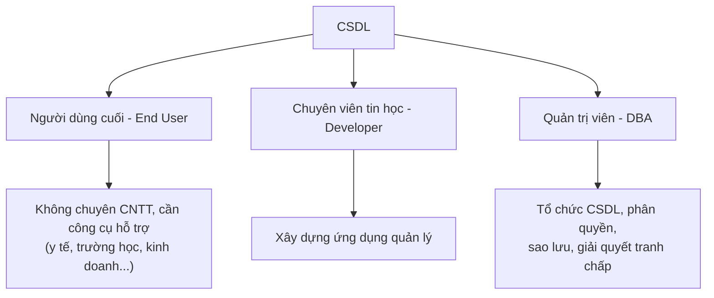

### Chi tiết từng đối tượng

??? note "Người dùng cuối (End User)"
    - Không có chuyên môn sâu về tin học hay CSDL.
    - Sử dụng CSDL thông qua các công cụ/giao diện được lập sẵn.
    - VD: bác sĩ tra cứu hồ sơ bệnh nhân, giáo viên nhập điểm sinh viên, nhân viên kế toán lập hóa đơn.

??? note "Chuyên viên tin học (Developer)"
    - Hiểu cả lĩnh vực nghiệp vụ lẫn kỹ thuật.
    - Xây dựng ứng dụng, viết truy vấn, thiết kế giao diện để phục vụ người dùng cuối.

??? note "Quản trị viên CSDL (Database Administrator - DBA)"
    - **Tổ chức CSDL**: Thiết kế cấu trúc, phân hoạch dữ liệu.
    - **Bảo mật & phân quyền**: Cấp/thu hồi quyền truy cập cho từng người dùng.
    - **Sao lưu & phục hồi**: Lên lịch backup, xử lý khi có sự cố.
    - **Giải quyết tranh chấp**: Xử lý xung đột khi nhiều người cùng thao tác trên dữ liệu.

---

## 5. Hệ quản trị CSDL (DBMS)

**DBMS – Database Management System** là tập hợp các chương trình cho phép người sử dụng tạo ra và duy trì CSDL. DBMS đóng vai trò trung gian giữa người dùng/ứng dụng và dữ liệu thực sự được lưu trên đĩa.

### Ba chức năng cốt lõi

| Chức năng | Mô tả | Ví dụ |
|-----------|-------|-------|
| **Định nghĩa (Define)** | Khai báo cấu trúc, kiểu dữ liệu, ràng buộc | Tạo bảng, định nghĩa khóa chính |
| **Xây dựng (Build)** | Lưu trữ dữ liệu vào CSDL | Chèn bản ghi vào bảng |
| **Xử lý (Manipulate)** | Truy vấn, cập nhật, xuất báo cáo | SELECT, INSERT, UPDATE, DELETE |

### Yêu cầu của một DBMS

!!! info "Một DBMS phải có"
    - **Ngôn ngữ giao tiếp** giữa người dùng và CSDL (DDL, DML, SQL, DCL)
    - **Từ điển dữ liệu (Data Dictionary)**: metadata mô tả cấu trúc CSDL
    - **Cơ chế bảo mật**: xác thực và phân quyền
    - **Cơ chế xử lý tranh chấp (Concurrency Control)**
    - **Cơ chế sao lưu & phục hồi (Backup & Restore)**
    - **Tính độc lập giữa dữ liệu và chương trình**: thay đổi cấu trúc lưu trữ không ảnh hưởng ứng dụng

### Các ngôn ngữ giao tiếp trong DBMS

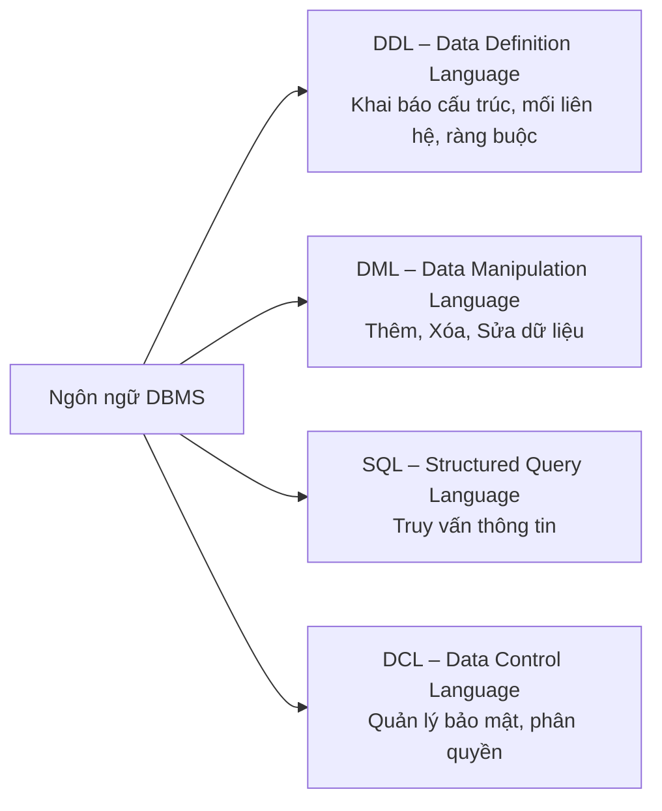

**Ví dụ minh họa:**

```sql
-- DDL: Tạo bảng
CREATE TABLE SINHVIEN (
    MaSV VARCHAR(10) PRIMARY KEY,
    HoTen NVARCHAR(100),
    GioiTinh NVARCHAR(3),
    NgSinh DATE,
    NoiSinh NVARCHAR(100)
);

-- DML: Thêm dữ liệu
INSERT INTO SINHVIEN VALUES ('SV001', N'Nguyễn Minh', N'Nam', '1987-02-01', N'Tp. Hồ Chí Minh');

-- SQL: Truy vấn
SELECT HoTen, NgSinh FROM SINHVIEN WHERE GioiTinh = N'Nam';

-- DCL: Phân quyền
GRANT SELECT ON SINHVIEN TO user_readonly;
```

### Các DBMS phổ biến

!!! example "Relational DBMS (dựa trên mô hình quan hệ)"
    - Microsoft SQL Server, MySQL, Oracle, Microsoft Access, DB2, Visual FoxPro

!!! example "NoSQL (phi quan hệ)"
    - **Key-Value**: Redis, Membase
    - **Document**: MongoDB, CouchDB
    - **Column-family**: Cassandra
    - **Graph**: Neo4j

!!! example "NewSQL (kết hợp SQL + khả năng mở rộng của NoSQL)"
    - Apache Trafodion, CockroachDB, VoltDB, NuoDB

---

## 6. Các mức biểu diễn một CSDL

Một CSDL được nhìn nhận ở **3 mức** khác nhau, tương ứng với 3 nhóm đối tượng khác nhau:

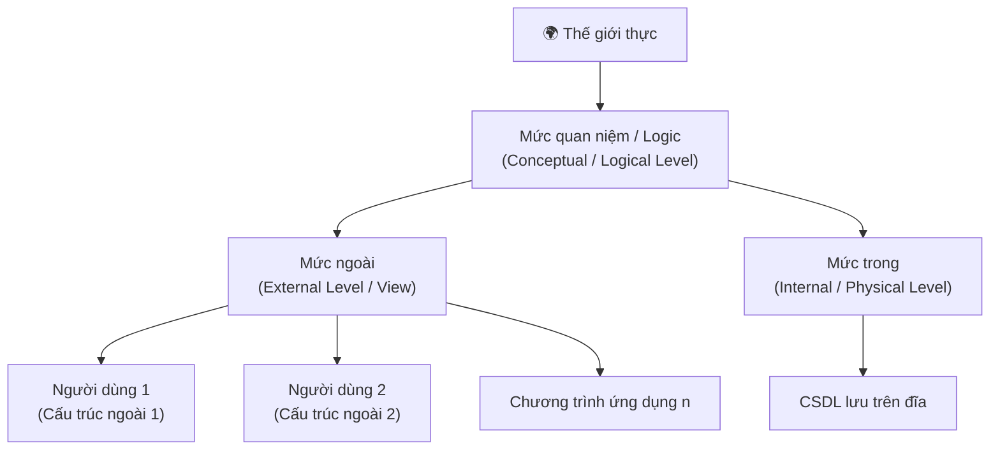

### Chi tiết 3 mức

??? info "Mức trong – Physical Level (Mức vật lý)"
    - Đây là mức thấp nhất, mô tả **cách dữ liệu thực sự được lưu trữ** trên thiết bị vật lý.
    - Giải quyết các câu hỏi:
        - Dữ liệu gì cần lưu?
        - Lưu ở đâu, dưới dạng nào?
        - Cần chỉ mục (index) gì để tăng tốc truy vấn?
        - Truy xuất tuần tự hay ngẫu nhiên?
    - Đây là lĩnh vực của **Quản trị viên CSDL (DBA)**.

??? info "Mức quan niệm – Conceptual / Logical Level"
    - Mô tả **toàn bộ CSDL** ở mức trừu tượng, không quan tâm đến cách lưu trữ vật lý.
    - Giải quyết câu hỏi:
        - Cần lưu bao nhiêu loại dữ liệu?
        - Các loại dữ liệu đó là gì?
        - Mối quan hệ giữa chúng như thế nào?
    - Đây là nơi các **mô hình dữ liệu** (ER, quan hệ...) được áp dụng.

??? info "Mức ngoài – External Level (View)"
    - Là mức cao nhất, mỗi người dùng/ứng dụng chỉ nhìn thấy **phần dữ liệu liên quan đến mình**.
    - VD: Kế toán chỉ thấy bảng lương và hóa đơn; sinh viên chỉ thấy bảng điểm của mình.
    - Giúp **bảo mật** (ẩn dữ liệu nhạy cảm) và **đơn giản hóa** giao diện người dùng.

---

## 7. Các mô hình dữ liệu

Mô hình dữ liệu là sự **trừu tượng hóa của môi trường thực**, biểu diễn dữ liệu ở mức quan niệm. Có 5 mô hình chính:

---

### 7.1 Mô hình dữ liệu mạng (Network Data Model)

Được xây dựng bởi **Honeywell (1964–1965)**. Dữ liệu được biểu diễn bằng **đồ thị có hướng**.

**Các thành phần:**

| Thành phần | Mô tả | Ví dụ |
|------------|-------|-------|
| **Mẫu tin (Record)** | Mô tả 1 đối tượng cụ thể | `('NV001','Nguyen Lam','Nam','10/10/1970','Dong Nai')` |
| **Loại mẫu tin** | Tập các mẫu tin cùng tính chất | NHANVIEN, CONGVIEC |
| **Loại liên hệ (Set type)** | Kết nối giữa loại mẫu tin chủ và thành viên | ThamGia |
| **Bản số (Cardinality)** | Số lượng mẫu tin tham gia liên hệ | 1:1, 1:n, n:1 |

**Ví dụ đồ thị mạng:**

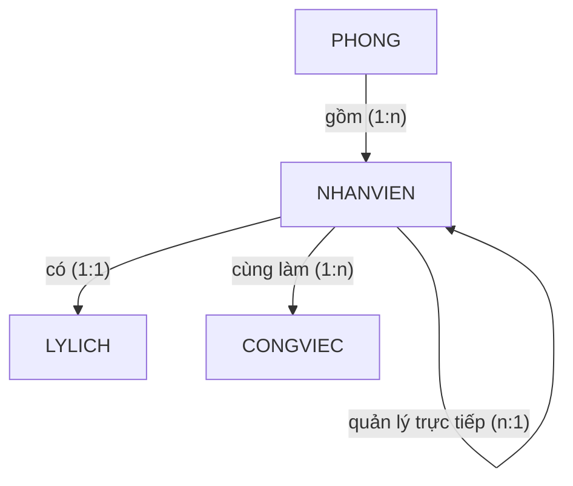

!!! warning "Nhận xét"
    - Tương đối đơn giản, dễ sử dụng cho CSDL nhỏ.
    - Không thích hợp cho CSDL quy mô lớn.
    - Khả năng diễn đạt ngữ nghĩa kém.

---

### 7.2 Mô hình dữ liệu phân cấp (Hierarchical Data Model)

Được xây dựng bởi **IBM và North American Rockwell (~1965)**. Dữ liệu tổ chức theo **dạng cây phân cấp**.

**Đặc điểm:**
- Mỗi nút của cây biểu diễn một loại thực thể.
- Mối quan hệ từ nút cha → nút con luôn là **1:n**.
- Mối quan hệ từ nút con → nút cha luôn là **1:1**.
- Giữa hai loại mẫu tin **chỉ tồn tại một mối quan hệ duy nhất**.

**Ví dụ – Hệ thống quản lý hành chính dân số:**

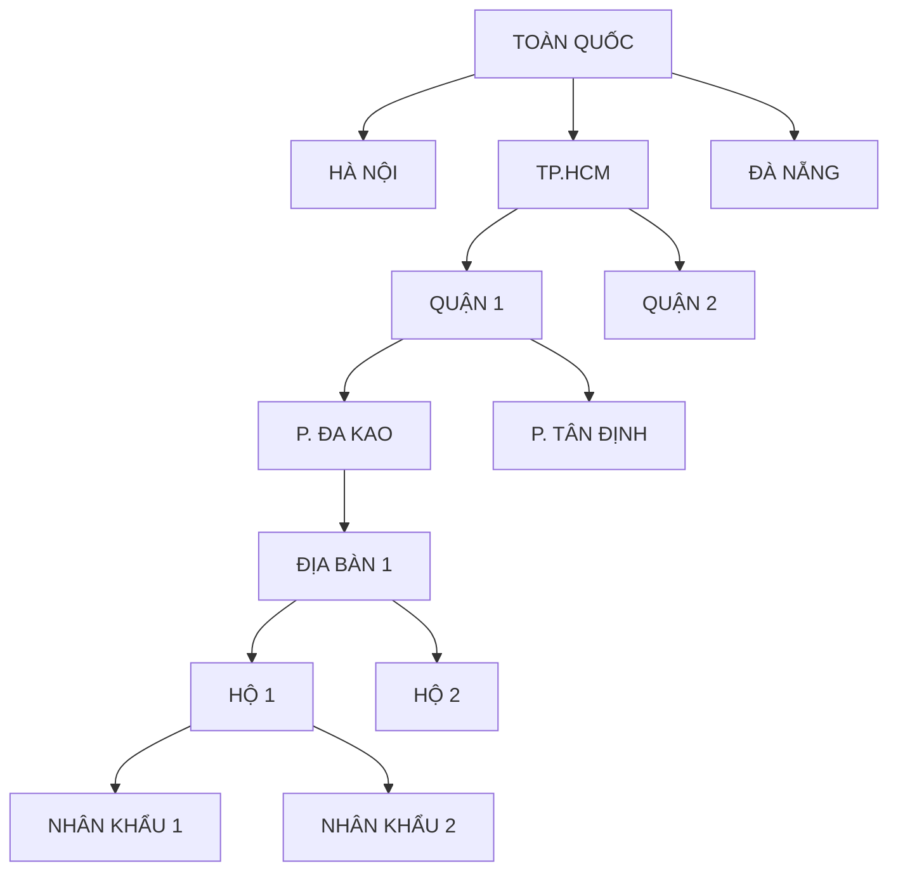

!!! warning "Nhận xét"
    - Đơn giản, tìm kiếm nhanh với dữ liệu có tính phân cấp tự nhiên.
    - Khó biểu diễn mối quan hệ **n:n**.
    - Không thích hợp cho CSDL quy mô lớn.

---

### 7.3 Mô hình thực thể mối kết hợp (ER Model)

Được **Peter Pin Shan Chen** giới thiệu năm **1976**. Đây là mô hình được dùng rộng rãi nhất trong **thiết kế CSDL ở mức quan niệm**.

Nhìn thế giới thực như tập hợp các **thực thể** và **mối quan hệ** giữa chúng.

---

#### 7.3.1 Loại thực thể (Entity Type)

Là những loại đối tượng/sự vật của thế giới thực tồn tại cụ thể, cần được quản lý.

> VD: `SINHVIEN`, `LOP`, `MONHOC`, `NHANVIEN`, `PHONGBAN`

**Ký hiệu:** Hình chữ nhật.

---

#### 7.3.2 Thực thể (Entity)

Là một **thể hiện cụ thể** của một loại thực thể.

> VD: Loại thực thể `SINHVIEN` có các thực thể:
> - `('SV001', 'Nguyễn Minh', 'Nam', '1/2/1987', 'Tp. HCM')`
> - `('SV002', 'Trần Năm', 'Nam', '13/2/1987', 'Đồng Nai')`

---

#### 7.3.3 Thuộc tính (Attribute)

Là những tính chất đặc trưng của loại thực thể. Có 3 loại:

??? note "Thuộc tính đơn trị (Simple Attribute)"
    - Chỉ có một giá trị, không thể chia nhỏ hơn.
    - VD: `MaSV`, `TenMonHoc`, `SoTC`

??? note "Thuộc tính đa hợp (Composite Attribute)"
    - Được tạo thành từ nhiều thành phần con.
    - VD: `DiaChi` = (SoNha, Duong, Phuong, Quan, Tp_Tinh)
    - VD: `HoTen` = (Ho, TenLot, Ten)

??? note "Thuộc tính đa trị (Multi-valued Attribute)"
    - Một thực thể có thể có **nhiều giá trị** cho thuộc tính này.
    - VD: `{BangCap}` — một người có thể có nhiều bằng cấp.
    - Có thể kết hợp đa hợp + đa trị: `{BangCap(NoiCap, NamCap, KetQua, ChuyenNganh)}`
    - **Ký hiệu:** Dùng dấu `{}` bao quanh.

---

#### 7.3.4 Khóa (Key)

Là thuộc tính (hoặc tập thuộc tính) mà giá trị của nó **xác định duy nhất** một thực thể trong loại thực thể.

!!! info "Lưu ý về khóa"
    - Mỗi loại thực thể có **ít nhất 1 khóa**.
    - Một khóa có thể gồm **1 hoặc nhiều thuộc tính** (khóa ghép).
    - Một loại thực thể có thể có **nhiều khóa**, cần chọn 1 làm **khóa chính (Primary Key)**.
    - VD: `SINHVIEN` có thể có 2 khóa: `MaSV` và `CMND` → chọn `MaSV` làm khóa chính.

**Ký hiệu:** Thuộc tính khóa được **gạch chân**.

---

#### 7.3.5 Loại mối kết hợp (Relationship Type)

Là sự liên kết giữa hai hay nhiều loại thực thể.

**Ký hiệu:** Hình thoi (hoặc oval).

**Ví dụ:** `SINHVIEN` —[Thuộc]— `LOP`

> Giữa hai loại thực thể có thể tồn tại **nhiều hơn một** loại mối kết hợp.
> VD: `SINHVIEN` và `LOP` có thể có: *Thuộc* và *Là lớp trưởng*.

---

#### 7.3.6 Số ngôi (Degree)

Là số lượng loại thực thể tham gia vào một loại mối kết hợp.

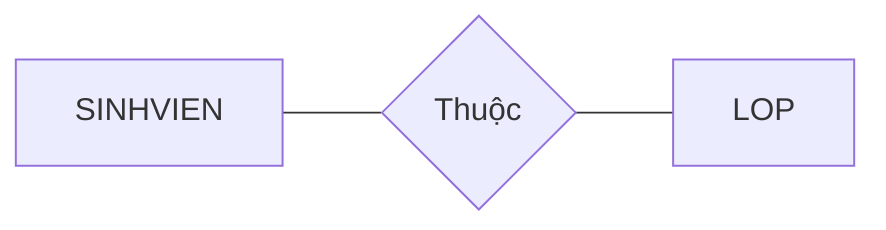
> Mối kết hợp **Thuộc**: 2 ngôi (binary)

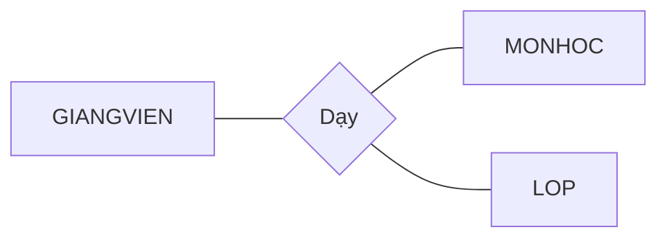
> Mối kết hợp **Dạy**: 3 ngôi (ternary)

---

#### 7.3.7 Bản số (Cardinality)

Thể hiện **số lượng tối thiểu và tối đa** các thực thể tham gia vào mối kết hợp.

**Ký hiệu:** `(min, max)`

| Bản số | Ý nghĩa |
|--------|---------|
| `(1,1)` | Tham gia đúng 1 lần |
| `(0,1)` | Có thể không tham gia hoặc tham gia tối đa 1 lần |
| `(1,n)` | Tham gia ít nhất 1, nhiều không giới hạn |
| `(0,n)` | Có thể không tham gia, hoặc nhiều không giới hạn |

**Ví dụ:**

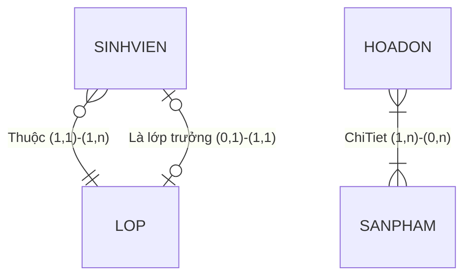

---

### 7.4 Mô hình ER mở rộng (Extended ER)

#### Chuyên biệt hóa / Tổng quát hóa (Specialization / Generalization)

Tương tự **kế thừa trong OOP**: loại thực thể con kế thừa thuộc tính của loại thực thể cha, và có thêm thuộc tính riêng.

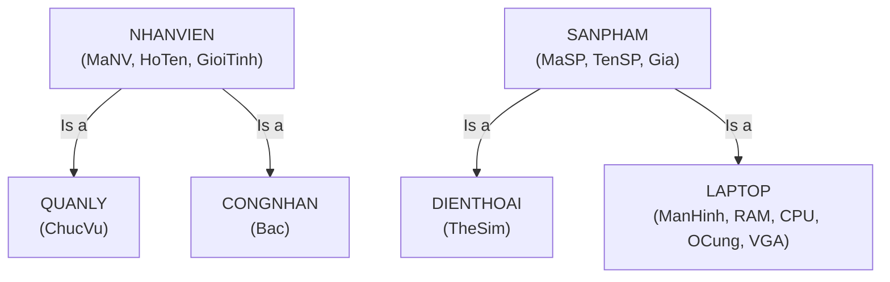

#### Mối kết hợp đệ quy (Recursive Relationship)

Loại thực thể có mối kết hợp **với chính nó**.

> VD: Mỗi nhân viên có một người quản lý trực tiếp, và người quản lý đó cũng là một nhân viên.

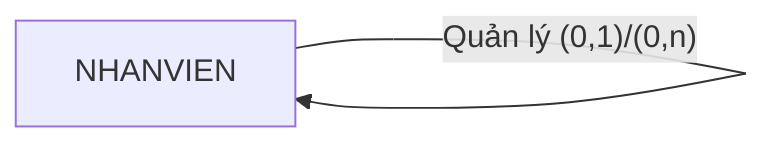

#### Loại thực thể yếu (Weak Entity)

!!! warning "Loại thực thể yếu"
    - Là loại thực thể **không có khóa riêng**.
    - Phải phụ thuộc vào một loại thực thể chủ (strong entity) để xác định.
    - **Ký hiệu:** Hình chữ nhật đôi.

> VD: `THANNHAN` của `NHANVIEN` — thân nhân không có mã định danh riêng, phải gắn với nhân viên cụ thể.

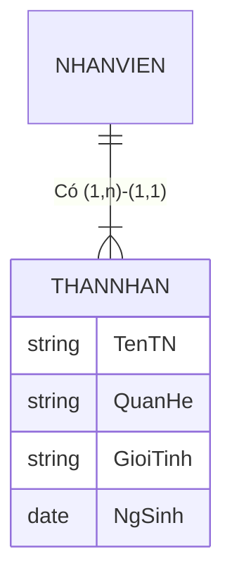

---

### 7.5 Mô hình dữ liệu quan hệ (Relational Data Model)

Là mô hình được sử dụng phổ biến nhất hiện nay. Dữ liệu được tổ chức thành các **bảng (table/relation)**.

**Ví dụ:**

```
NHANVIEN    (MaNV, HoTen, NgaySinh, DiaChi)
KHACHHANG   (MaKH, HoTen, NgaySinh, DiaChi, DoanhSo)
SANPHAM     (MaSP, TenSP, NuocSX, DonGia)
HOADON      (SoHD, NgayHD, MaKH, TriGia, MaNV)
CTHD        (SoHD, MaSP, SL)
```

Các bảng liên kết với nhau qua **khóa ngoại (Foreign Key)**:
- `HOADON.MaKH` → `KHACHHANG.MaKH`
- `HOADON.MaNV` → `NHANVIEN.MaNV`
- `CTHD.SoHD` → `HOADON.SoHD`
- `CTHD.MaSP` → `SANPHAM.MaSP`

---

### 7.6 Mô hình dữ liệu hướng đối tượng (Object-Oriented Data Model)

Ra đời vào **cuối những năm 1980 – đầu 1990**, dựa trên cách tiếp cận hướng đối tượng.

**Các khái niệm cốt lõi:** Lớp (Class), Thuộc tính (Attribute), Phương thức (Method/Operator).

**Bốn đặc trưng:**

| Đặc trưng | Mô tả |
|-----------|-------|
| **Kế thừa (Inheritance)** | Lớp con kế thừa thuộc tính và phương thức của lớp cha |
| **Đóng gói (Encapsulation)** | Ẩn chi tiết cài đặt, chỉ lộ giao diện |
| **Đa hình (Polymorphism)** | Cùng một phương thức có thể hành xử khác nhau tùy lớp |
| **Tái sử dụng (Reusability)** | Dễ dàng tái sử dụng các lớp đã định nghĩa |

---

## Tổng kết

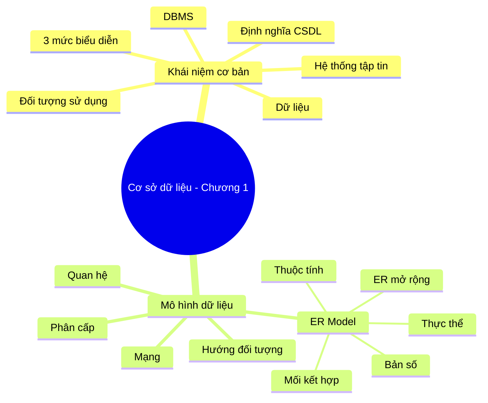
