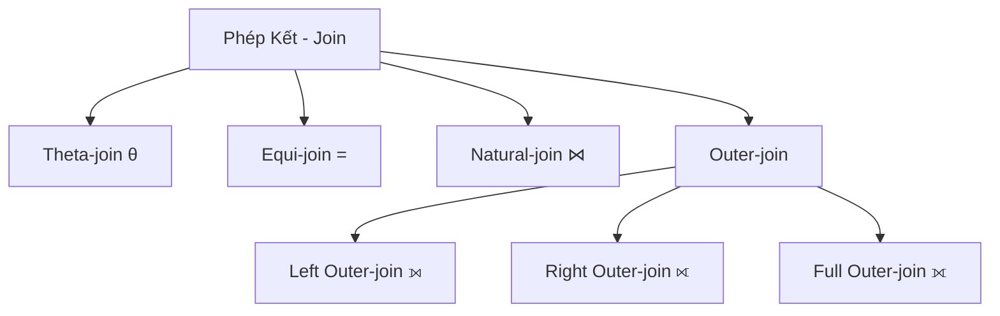
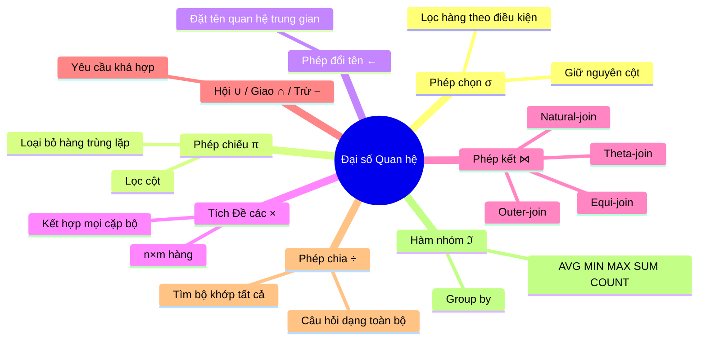

# Chương 3: Đại Số Quan Hệ (Relational Algebra)

---

## 1. Giới thiệu

**Đại số quan hệ (Relational Algebra)** là một mô hình toán học dựa trên lý thuyết tập hợp, được dùng để thao tác và rút trích dữ liệu từ các quan hệ (bảng) trong Cơ sở dữ liệu quan hệ.

!!! info "Đặc điểm chính"
    - Đối tượng xử lý là các **quan hệ** (relation) trong CSDL quan hệ.
    - Cho phép sử dụng các phép toán để **rút trích dữ liệu** từ các quan hệ.
    - Hỗ trợ **tối ưu hóa** quá trình truy vấn dữ liệu.
    - Kết quả của mỗi phép toán cũng là một **quan hệ** (không có tên) → có thể kết hợp nhiều phép toán lồng nhau.

Gồm 2 thành phần:

- **Các phép toán đại số quan hệ**: Phép chọn, chiếu, đổi tên, tích Đề các, kết, hội, giao, trừ, chia, hàm tính toán trên nhóm.
- **Biểu thức đại số quan hệ**: Là sự kết hợp của các phép toán trên để tạo ra quan hệ mới.

---

## 2. Lược đồ CSDL minh họa

Toàn bộ các ví dụ trong tài liệu sử dụng CSDL **Quản lý nhân viên** với lược đồ sau:

```
NHANVIEN    (MaNV, HoTen, NgaySinh, DiaChi, GT, Luong, MaNQL, Phong)
PHONGBAN    (MaPH, TenPH, TruongPhong, NgayNhanChuc)
DIADIEMPHONG(MaPH, DiaDiem)
DEAN        (MaDA, TenDA, DdiemDA, Phong)
PHANCONG    (MaNV, MaDA, ThoiGian)
THANNHAN    (MaTN, HoTen, GT, NgaySinh)
NVIEN_TNHAN (MaNV, MaTN, QuanHe)
```

??? question "Câu hỏi: Xác định Khóa chính và Khóa ngoại của lược đồ trên?"
    **Khóa chính (PK)** được gạch chân, **Khóa ngoại (FK)** được chú thích:

    | Quan hệ | Khóa chính | Khóa ngoại |
    |---|---|---|
    | NHANVIEN | MaNV | MaNQL → NHANVIEN(MaNV), Phong → PHONGBAN(MaPH) |
    | PHONGBAN | MaPH | TruongPhong → NHANVIEN(MaNV) |
    | DIADIEMPHONG | (MaPH, DiaDiem) | MaPH → PHONGBAN(MaPH) |
    | DEAN | MaDA | Phong → PHONGBAN(MaPH) |
    | PHANCONG | (MaNV, MaDA) | MaNV → NHANVIEN(MaNV), MaDA → DEAN(MaDA) |
    | THANNHAN | MaTN | — |
    | NVIEN_TNHAN | (MaNV, MaTN) | MaNV → NHANVIEN(MaNV), MaTN → THANNHAN(MaTN) |

---

## 3. Các phép toán Đại số Quan hệ

### 3.1. Phép Chọn (Selection) — σ

**Mục đích:** Chọn ra các **hàng (bộ/tuple)** thỏa mãn điều kiện cho trước. Kết quả có cùng danh sách thuộc tính với quan hệ gốc, chỉ lọc bớt số hàng.

**Ký hiệu:**

$$\sigma_P(R) = \{t \mid t \in R \land P(t)\}$$

Trong đó:
- `R`: quan hệ đầu vào
- `P`: điều kiện chọn, gồm:
  - Phép so sánh: `>`, `<`, `=`, `≤`, `≥`, `≠`
  - Phép logic: `∧` (AND), `∨` (OR), `¬` (NOT)

!!! tip "Lưu ý"
    Phép chọn **chỉ lọc hàng**, không thay đổi số cột. Kết quả trả về là một quan hệ con của R.

---

**Ví dụ 1:** Chọn những nhân viên có lương hơn 5 triệu

$$\sigma_{Luong > 5000000}(NHANVIEN)$$

| MaNV | HoTen | NgaySinh | DiaChi | GT | Luong | MaNQL | Phong |
|---|---|---|---|---|---|---|---|
| NV01 | Nguyễn Tuyết An | 01/10/1978 | TPHCM | Nữ | 10.000.000 | — | PB01 |
| NV03 | Phạm Tiến Dũng | 12/12/1982 | Long An | Nam | 7.200.000 | NV04 | PB02 |

→ NV02 (lương 4.500.000) bị loại vì không thỏa điều kiện.

---

**Ví dụ 2:** Chọn những nhân viên **nam** có lương hơn 5 triệu

$$\sigma_{GT='Nam' \land Luong > 5000000}(NHANVIEN)$$

| MaNV | HoTen | ... | GT | Luong | ... |
|---|---|---|---|---|---|
| NV03 | Phạm Tiến Dũng | ... | Nam | 7.200.000 | ... |

---

**Ví dụ 3:** Chọn những nhân viên nam sinh từ năm 1990 trở về sau

$$\sigma_{GT='Nam' \land Year(NgaySinh) \geq 1990}(NHANVIEN)$$

→ **Kết quả rỗng** vì không có nhân viên nào thỏa cả hai điều kiện trong dữ liệu mẫu.

---

### 3.2. Phép Chiếu (Projection) — π

**Mục đích:** Chọn ra các **cột (thuộc tính)** cần thiết từ quan hệ. Kết quả có ít cột hơn (hoặc bằng) quan hệ gốc, loại bỏ các hàng trùng lặp.

**Ký hiệu:**

$$\pi_{A_1, A_2, \ldots, A_k}(R)$$

Trong đó `A₁, A₂, ..., Aₖ` là danh sách thuộc tính muốn giữ lại.

!!! warning "Lưu ý quan trọng"
    Phép chiếu **tự động loại bỏ các bộ trùng lặp** vì kết quả là một tập hợp (set). Đây là điểm khác biệt so với SQL (SQL giữ duplicate mặc định, cần `DISTINCT` để loại bỏ).

---

**Ví dụ 4:** Tìm mã nhân viên, họ tên và giới tính của tất cả nhân viên

$$\pi_{MaNV, HoTen, GT}(NHANVIEN)$$

| MaNV | HoTen | GT |
|---|---|---|
| NV01 | Nguyễn Tuyết An | Nữ |
| NV02 | Trần Ngọc Minh | Nữ |
| NV03 | Phạm Tiến Dũng | Nam |

---

**Ví dụ 5:** Cho biết mã, tên và mã phòng phụ trách các đề án thực hiện tại TP.HCM

Bước 1 — Lọc đề án ở TP.HCM:
$$\sigma_{DdiemDA='TP.HCM'}(DEAN)$$

Bước 2 — Chiếu ra các cột cần thiết:
$$\pi_{MaDA, TenDA, Phong}(\sigma_{DdiemDA='TP.HCM'}(DEAN))$$

| MaDA | TenDA | Phong |
|---|---|---|
| DA01 | Hệ thống quản lý sinh viên | PB01 |
| DA03 | Hệ thống quản lý bệnh viện | PB01 |

---

### 3.3. Phép Đổi tên (Rename) — ←

**Mục đích:** Đặt tên cho một quan hệ trung gian (kết quả của biểu thức) để dễ tham chiếu, tránh nhầm lẫn khi biểu thức phức tạp.

**Ký hiệu:**

```
TenMoi ← BieuThuc
```

**Ví dụ:** Viết lại Ví dụ 5 dùng phép đổi tên:

```
DEAN_TPHCM ← σ(DdiemDA='TP.HCM')(DEAN)
π(MaDA, TenDA, Phong)(DEAN_TPHCM)
```

!!! tip "Khi nào nên dùng phép đổi tên?"
    Khi cùng một quan hệ được dùng hai lần trong một biểu thức (ví dụ: tự kết — self join), bắt buộc phải đổi tên để phân biệt hai "bản sao" của quan hệ đó.

---

### 3.4. Phép Tích Đề Các (Cartesian Product) — ×

**Mục đích:** Kết hợp **mọi bộ** của R với **mọi bộ** của S. Nếu R có `n` hàng và S có `m` hàng, kết quả có `n × m` hàng.

**Ký hiệu:**

$$R \times S = \{(t, q) \mid t \in R \land q \in S\}$$

Kết quả là quan hệ có `n + m` thuộc tính (ghép nối thuộc tính của R và S).

!!! warning "Thực tế sử dụng"
    Phép tích Đề các thường tạo ra rất nhiều bộ **vô nghĩa** (không thỏa điều kiện liên kết). Vì vậy, thường kết hợp với phép chọn `σ` để lọc lại — đây chính là nền tảng của **phép kết (join)**.

---

**Ví dụ 7:** `NHANVIEN × PHONGBAN`

Với 3 nhân viên và 2 phòng ban → kết quả có **3 × 2 = 6 hàng**:

| MaNV | HoTen | ... | Phong | MaPH | TenPH | TruongPhong |
|---|---|---|---|---|---|---|
| NV01 | Nguyễn Tuyết An | ... | PB01 | PB01 | Nghiên cứu | NV01 |
| NV01 | Nguyễn Tuyết An | ... | PB01 | PB02 | Điều hành | NV03 |
| NV02 | Trần Ngọc Minh | ... | PB01 | PB01 | Nghiên cứu | NV01 |
| NV02 | Trần Ngọc Minh | ... | PB01 | PB02 | Điều hành | NV03 |
| NV03 | Phạm Tiến Dũng | ... | PB02 | PB01 | Nghiên cứu | NV01 |
| NV03 | Phạm Tiến Dũng | ... | PB02 | PB02 | Điều hành | NV03 |

**Ví dụ 8:** Cho biết mã, họ tên nhân viên và tên phòng ban mà nhân viên đó làm việc — **Dùng tích Đề các + chọn**:

$$\pi_{MaNV, HoTen, TenPH}(\sigma_{Phong=MaPH}(NHANVIEN \times PHONGBAN))$$

→ Chỉ giữ lại các hàng có `Phong = MaPH` (nhân viên đúng phòng ban của mình).

---

### 3.5. Phép Kết (Join)

Phép kết là sự kết hợp của tích Đề các và phép chọn. Có nhiều biến thể:



---

#### 3.5.1. Phép Kết Theta (Theta-join) — ⋈_θ

**Mục đích:** Kết hợp R và S, chỉ giữ các cặp bộ thỏa điều kiện `AθB` với `θ ∈ {>, <, =, ≠, ≤, ≥}`.

**Ký hiệu:**

$$R \underset{A\theta B}{\bowtie} S = \{(t,q) \mid t \in R \land q \in S \land t.A \;\theta\; q.B\}$$

**Cách thực hiện:**
1. Tính tích Đề các `R × S`
2. Chọn các bộ thỏa điều kiện `AθB`

**Ví dụ 9:** Với R(A,B,C) và S(E,F):

$$R \underset{A=E \land C<F}{\bowtie} S$$

| A | B | C | E | F |
|---|---|---|---|---|
| α | α | 1 | α | 4 |
| β | α | 5 | β | 12 |

→ Chỉ giữ những cặp có cùng giá trị A=E và C nhỏ hơn F.

---

#### 3.5.2. Phép Kết Bằng (Equi-join)

Là trường hợp đặc biệt của Theta-join khi `θ` là phép so sánh `=`.

**Ví dụ 10:** R(A,B,C) kết bằng S(E,F) theo điều kiện `A=E AND C=F`:

$$R \underset{A=E \land C=F}{\bowtie} S$$

| A | B | C | E | F |
|---|---|---|---|---|
| α | α | 1 | α | 1 |
| β | β | 12 | β | 12 |

---

**Ví dụ 8 — Dùng Equi-join:** Cho biết mã, họ tên nhân viên và tên phòng ban mà nhân viên đó làm việc

$$\pi_{MaNV, HoTen, TenPH}\left(NHANVIEN \underset{Phong=MaPH}{\bowtie} PHONGBAN\right)$$

Sau khi kết bằng điều kiện `Phong = MaPH`:

| MaNV | HoTen | ... | Phong | MaPH | TenPH | TruongPhong |
|---|---|---|---|---|---|---|
| NV01 | Nguyễn Tuyết An | ... | PB01 | PB01 | Nghiên cứu | NV01 |
| NV02 | Trần Ngọc Minh | ... | PB01 | PB01 | Nghiên cứu | NV01 |
| NV03 | Phạm Tiến Dũng | ... | PB02 | PB02 | Điều hành | NV03 |

!!! warning "Cẩn thận về ngữ nghĩa khi kết"
    Cùng một lược đồ có thể kết theo nhiều điều kiện khác nhau, cho ra kết quả có ý nghĩa khác nhau:

    - `π(MaNV,HoTen,TenPH)(NHANVIEN ⋈(Phong=MaPH) PHONGBAN)` → Mã NV, tên NV, tên phòng **nhân viên đang làm việc**
    - `π(MaNV,HoTen,TenPH)(NHANVIEN ⋈(MaNV=TruongPhong) PHONGBAN)` → Mã NV, tên NV, tên phòng **mà nhân viên đó đang làm trưởng phòng**

    Hai biểu thức khác nhau hoàn toàn về ý nghĩa!

---

#### 3.5.3. Phép Kết Tự Nhiên (Natural-join) — ⋈

Là phép kết bằng trên **tất cả các cặp thuộc tính cùng tên** giữa R và S, và **loại bỏ cột trùng** trong kết quả.

**Ký hiệu:** `R ⋈ S` hoặc `R * S`

!!! tip "Điều kiện áp dụng"
    Hai thuộc tính so sánh phải **cùng tên** và **cùng miền giá trị**. Nếu không cùng tên, cần đổi tên trước rồi mới kết tự nhiên.

**Ví dụ 11:** R(A,B,C) kết tự nhiên với S(A,C) — hai thuộc tính chung là A và C:

| A | B | C |
|---|---|---|
| α | α | 1 |
| β | β | 12 |

→ Chỉ giữ bộ có cùng (A,C) ở cả R và S. Kết quả **không lặp cột A và C**.

---

#### 3.5.4. Phép Kết Ngoài (Outer-join)

**Vấn đề của Inner-join:** Các bộ ở R (hoặc S) không có bộ tương ứng ở S (hoặc R) sẽ bị **mất hoàn toàn** trong kết quả. Phép kết ngoài sinh ra để **giữ lại thông tin bị mất** bằng cách điền `NULL` vào các ô trống.

---

##### Left Outer-join (⟕)

**Giữ lại toàn bộ bộ của quan hệ BÊN TRÁI.** Nếu bộ bên trái không có bộ tương ứng bên phải, điền `NULL` cho các cột bên phải.

**Ký hiệu:** `R ⟕(AθB) S`

**Ví dụ 12:** Cho biết những mã nhân viên **không tham gia đề án nào**

```
NHANVIEN ⟕(MaNV) PHANCONG
```

| MaNV | HoTen | ... | Phong | MaNV(PC) | MaDA | ThoiGian |
|---|---|---|---|---|---|---|
| NV01 | Nguyễn Tuyết An | ... | PB01 | NV01 | DA01 | 20 |
| NV01 | Nguyễn Tuyết An | ... | PB01 | NV01 | DA02 | 30 |
| NV03 | Phạm Tiến Dũng | ... | PB02 | NV03 | DA01 | 20 |
| NV02 | Trần Ngọc Minh | ... | PB01 | **NULL** | **NULL** | **NULL** |

→ NV02 không có trong PHANCONG nhưng vẫn xuất hiện với các cột bên phải là NULL.

Lấy mã nhân viên không tham gia đề án:
$$\pi_{MaNV}(\sigma_{MaDA=NULL}(NHANVIEN \underset{MaNV}{\text{⟕}} PHANCONG))$$

---

##### Right Outer-join (⟖)

**Giữ lại toàn bộ bộ của quan hệ BÊN PHẢI.** Nếu bộ bên phải không có bộ tương ứng bên trái, điền `NULL` cho các cột bên trái.

**Ký hiệu:** `R ⟖(AθB) S`

**Ví dụ 13:** Cho biết mã và tên phòng ban **không có nhân viên**

```
NHANVIEN ⟖(Phong=MaPH) PHONGBAN
```

| MaNV | HoTen | ... | Phong | MaPH | TenPH | TruongPhong |
|---|---|---|---|---|---|---|
| NV01 | Nguyễn Tuyết An | ... | PB01 | PB01 | Nghiên cứu | NV01 |
| NV02 | Trần Ngọc Minh | ... | PB01 | PB01 | Nghiên cứu | NV01 |
| NV03 | Phạm Tiến Dũng | ... | PB02 | PB02 | Điều hành | NV03 |
| **NULL** | **NULL** | ... | **NULL** | PB03 | Tổ chức | NULL |

→ PB03 không có nhân viên nhưng vẫn xuất hiện.

$$\pi_{MaPH, TenPH}(\sigma_{MaNV=NULL}(NHANVIEN \underset{Phong=MaPH}{\text{⟖}} PHONGBAN))$$

---

##### Full Outer-join (⟗)

**Giữ lại toàn bộ bộ của CẢ HAI quan hệ.** Bộ nào không có bộ khớp ở phía đối diện sẽ được điền `NULL` cho các cột thiếu.

**Ký hiệu:** `R ⟗(AθB) S`

**Ví dụ 14:** Full Outer-join giữa NHANVIEN (có NV04 chưa thuộc phòng nào) và PHONGBAN (có PB03 chưa có nhân viên):

| MaNV | HoTen | ... | Phong | MaPH | TenPH | TruongPhong |
|---|---|---|---|---|---|---|
| NV01 | Nguyễn Tuyết An | ... | PB01 | PB01 | Nghiên cứu | NV01 |
| NV02 | Trần Ngọc Minh | ... | PB01 | PB01 | Nghiên cứu | NV01 |
| NV03 | Phạm Tiến Dũng | ... | PB02 | PB02 | Điều hành | NV03 |
| NV04 | Phan Thị Hoa | ... | NULL | **NULL** | **NULL** | **NULL** |
| **NULL** | **NULL** | ... | **NULL** | PB03 | Tổ chức | NULL |

---

### 3.6. Phép Hội, Giao, Trừ (Union, Intersection, Difference)

#### Điều kiện khả hợp (Union-compatible)

!!! danger "Bắt buộc phải thỏa"
    Hai quan hệ R và S chỉ có thể thực hiện hội/giao/trừ khi **khả hợp**, tức là:
    
    1. **Cùng số lượng thuộc tính** (cùng bậc/degree)
    2. **Miền giá trị tương thích**: `MGT(Aᵢ) = MGT(Bᵢ)` với mọi `i = 1..n`
    
    Tên thuộc tính **không nhất thiết phải giống nhau**, nhưng thứ tự và kiểu dữ liệu phải tương ứng.

---

#### Phép Hội (Union) — ∪

$$R \cup S = \{t \mid t \in R \lor t \in S\}$$

→ Lấy tất cả bộ xuất hiện trong R **hoặc** S (loại bỏ trùng lặp).

#### Phép Giao (Intersection) — ∩

$$R \cap S = \{t \mid t \in R \land t \in S\} = R - (R - S)$$

→ Chỉ giữ các bộ xuất hiện trong **cả R và S**.

#### Phép Trừ (Difference) — −

$$R - S = \{t \mid t \in R \land t \notin S\} = R - (R \cap S)$$

→ Các bộ trong R mà **không có** trong S.

---

**Ví dụ 12 — Cách 2:** Cho biết những mã nhân viên **không tham gia đề án nào**

$$\pi_{MaNV}(NHANVIEN) - \pi_{MaNV}(PHANCONG)$$

```
R ← π(MaNV)(NHANVIEN)   -- {NV01, NV02, NV03}
S ← π(MaNV)(PHANCONG)   -- {NV01, NV03}
R - S                    -- {NV02}
```

---

**Ví dụ 15:** Cho biết mã và họ tên nhân viên không tham gia đề án nào

!!! warning "Không thể trừ trực tiếp khi khác số cột"
    `π(MaNV,HoTen)(NHANVIEN)` có 2 cột, còn `π(MaNV)(PHANCONG)` có 1 cột → **không khả hợp**, không trừ được trực tiếp.

Cần dùng phép kết để đồng bộ:
```
R ← π(MaNV, HoTen)(NHANVIEN)
S ← π(MaNV, HoTen)(NHANVIEN ⟕(MaNV) PHANCONG)  -- dùng left join rồi lấy HoTen
R - S
```

Hoặc rõ hơn:
```
R ← π(MaNV, HoTen)(NHANVIEN)
S ← π(MaNV, HoTen)(σ(MaDA=NULL)(NHANVIEN ⟕(MaNV) PHANCONG))
-- R - S thực ra không cần, S đã là đáp án
```

---

**Ví dụ 16:** Cho biết mã và họ tên nhân viên tham gia đề án **'DA01' hoặc 'DA02'**

```
-- Cách 1: Dùng phép hội
R ← π(MaNV,HoTen)(σ(MaDA='DA01')(PHANCONG ⋈(MaNV) NHANVIEN))
S ← π(MaNV,HoTen)(σ(MaDA='DA02')(PHANCONG ⋈(MaNV) NHANVIEN))
R ∪ S

-- Cách 2: Dùng phép chọn với OR
π(MaNV,HoTen)(σ(MaDA='DA01' ∨ MaDA='DA02')(PHANCONG ⋈(MaNV) NHANVIEN))
```

---

**Ví dụ 17:** Cho biết mã và họ tên nhân viên tham gia **cả 2** đề án 'DA01' **và** 'DA02'

!!! danger "Sai lầm phổ biến"
    `σ(MaDA='DA01' ∧ MaDA='DA02')` → **Luôn trả về rỗng** vì một bộ không thể vừa có MaDA='DA01' vừa có MaDA='DA02' cùng lúc!

Cách đúng — dùng phép giao:
```
R ← π(MaNV,HoTen)(σ(MaDA='DA01')(PHANCONG ⋈(MaNV) NHANVIEN))
S ← π(MaNV,HoTen)(σ(MaDA='DA02')(PHANCONG ⋈(MaNV) NHANVIEN))
R ∩ S
```

---

### 3.7. Phép Chia (Division) — ÷

**Mục đích:** Tìm các bộ trong R mà **kết hợp với tất cả** các bộ trong S. Thường dùng cho các câu hỏi dạng **"tất cả"** (all, every).

**Ký hiệu:**

$$R \div S = \{t \mid \forall u \in S, (t, u) \in R\}$$

- Tập thuộc tính của Q: `Qₐ = Rₐ − Sₐ` (thuộc tính của R trừ thuộc tính của S)
- Điều kiện: S phải là **tập con thuộc tính** của R (`m < n`, có `m` thuộc tính chung)

**Công thức tương đương (để tính thủ công):**

```
T1 ← π(R_attrs - S_attrs)(R)
T2 ← π(R_attrs - S_attrs)((S × T1) - R)
Q  ← T1 - T2
```

---

**Ví dụ 18:** Cho biết mã, họ tên nhân viên được phân công tham gia **tất cả** các đề án

```
NV_TGia     ← π(MaNV, HoTen, MaDA)(NHANVIEN ⋈(MaNV) PHANCONG)
TatCa_DeAn  ← π(MaDA)(DEAN)
NV_TGia ÷ TatCa_DeAn
```

**Dữ liệu minh họa:**

NV_TGia:

| MaNV | HoTen | MaDA |
|---|---|---|
| NV01 | Nguyễn Tuyết An | DA01 |
| NV01 | Nguyễn Tuyết An | DA02 |
| NV03 | Phạm Tiến Dũng | DA01 |

TatCa_DeAn:

| MaDA |
|---|
| DA01 |
| DA02 |

Kết quả `NV_TGia ÷ TatCa_DeAn`:

| MaNV | HoTen |
|---|---|
| NV01 | Nguyễn Tuyết An |

→ NV01 tham gia cả DA01 lẫn DA02 → thỏa. NV03 chỉ tham gia DA01 → không thỏa → bị loại.

---

### 3.8. Các Hàm Tính Toán Trên Nhóm (Aggregate Functions)

#### Các hàm hỗ trợ

| Hàm | Ý nghĩa |
|---|---|
| `AVG(A)` | Giá trị trung bình của thuộc tính A |
| `MIN(A)` | Giá trị nhỏ nhất |
| `MAX(A)` | Giá trị lớn nhất |
| `SUM(A)` | Tổng giá trị |
| `COUNT(A)` | Đếm số lượng giá trị (không NULL) |

#### Ký hiệu phép Gom nhóm (Group by)

$$_{G_1, G_2, \ldots, G_k} \mathfrak{F}_{F_1(A_1), F_2(A_2), \ldots, F_n(A_n)}(E)$$

Trong đó:
- `E`: biểu thức đại số quan hệ (quan hệ đầu vào)
- `G₁, G₂, ..., Gₖ`: thuộc tính **gom nhóm** (Group By)
- `F₁(A₁), ..., Fₙ(Aₙ)`: các **hàm tính toán** áp dụng trên từng nhóm

---

**Ví dụ 19:** Tìm lương cao nhất, thấp nhất, trung bình của **toàn bộ** nhân viên

$$\mathfrak{F}_{MAX(Luong), MIN(Luong), AVG(Luong)}(NHANVIEN)$$

→ Không có thuộc tính gom nhóm → xem toàn bộ quan hệ là **một nhóm duy nhất**.

| Max(Luong) | Min(Luong) | Avg(Luong) |
|---|---|---|
| 9.000.000 | 4.500.000 | 5.781.400 |

---

**Ví dụ 20:** Tìm lương cao nhất, thấp nhất, trung bình của **mỗi phòng ban**

$$_{Phong}\mathfrak{F}_{MAX(Luong), MIN(Luong), AVG(Luong)}(NHANVIEN)$$

| Phong | Max(Luong) | Min(Luong) | Avg(Luong) |
|---|---|---|---|
| PH01 | 6.200.000 | 4.500.000 | 5.233.000 |
| PH02 | 4.500.000 | 4.500.000 | 4.500.000 |
| PH03 | 9.000.000 | 5.500.000 | 6.966.000 |

---

**Ví dụ 21:** Thống kê số lượng đề án mỗi nhân viên đã tham gia (hiển thị MaNV, HoTen)

```
-- Trường hợp chỉ đếm nhân viên có tham gia (PHANCONG có NV01, NV03):
MaNV,HoTen ℑ COUNT(MaDA) (NHANVIEN ⋈(MaNV) PHANCONG)
```

| MaNV | HoTen | Count(MaDA) |
|---|---|---|
| NV01 | Nguyễn Tuyết An | 2 |
| NV03 | Phạm Tiến Dũng | 1 |

```
-- Trường hợp hiển thị cả nhân viên chưa tham gia đề án nào (dùng Left Outer-join):
MaNV,HoTen ℑ COUNT(MaDA) (NHANVIEN ⟕(MaNV) PHANCONG)
```

| MaNV | HoTen | Count(MaDA) |
|---|---|---|
| NV01 | Nguyễn Tuyết An | 2 |
| NV02 | Trần Ngọc Minh | 0 |
| NV03 | Phạm Tiến Dũng | 1 |

!!! tip "Điểm mấu chốt"
    Dùng **inner join** → chỉ thống kê nhân viên đã có phân công. Dùng **left outer-join** → hiển thị tất cả nhân viên, kể cả người chưa tham gia đề án nào (COUNT = 0).

---

## 4. Tổng Kết



| Phép toán | Ký hiệu | Tác dụng |
|---|---|---|
| Chọn | σ_P(R) | Lọc hàng thỏa điều kiện P |
| Chiếu | π_A(R) | Giữ lại các cột A |
| Đổi tên | Tên ← Biểu thức | Đặt tên quan hệ trung gian |
| Tích Đề các | R × S | Mọi cặp bộ của R và S |
| Kết Theta | R ⋈_θ S | Tích Đề các + lọc điều kiện θ |
| Kết bằng | R ⋈_(A=B) S | Theta-join với θ là "=" |
| Kết tự nhiên | R ⋈ S | Kết bằng trên cột cùng tên |
| Kết trái | R ⟕ S | Giữ tất cả bộ bên trái |
| Kết phải | R ⟖ S | Giữ tất cả bộ bên phải |
| Kết đầy đủ | R ⟗ S | Giữ tất cả bộ cả hai phía |
| Hội | R ∪ S | Bộ trong R hoặc S |
| Giao | R ∩ S | Bộ trong cả R và S |
| Trừ | R − S | Bộ trong R nhưng không trong S |
| Chia | R ÷ S | Bộ trong R khớp với mọi bộ trong S |
| Gom nhóm | _G ℑ_F(E) | Tính toán theo nhóm |
