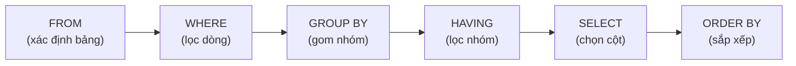
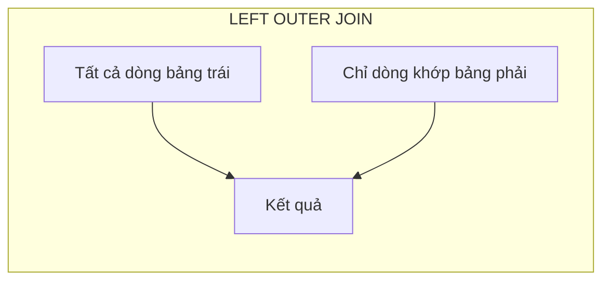
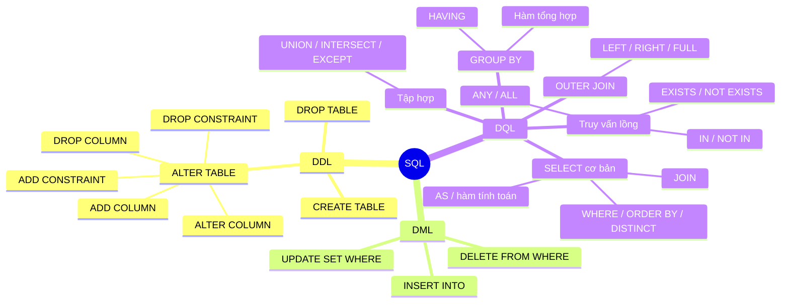

# Chương 4: Ngôn Ngữ SQL

---

## 1. Giới Thiệu

### 1.1. SQL là gì?

**SQL (Structured Query Language)** là ngôn ngữ truy vấn có cấu trúc, được thiết kế để tương tác với hệ quản trị cơ sở dữ liệu quan hệ (RDBMS). Điểm nổi bật của SQL là tính **khai báo (declarative)** — người dùng chỉ cần mô tả *muốn lấy gì*, không cần quan tâm đến *lấy như thế nào* (máy tự tối ưu).

> **Lịch sử:** SQL được IBM phát triển vào thập niên 1970, tiền thân là **SEQUEL** (Structured English Query Language, 1974). Qua nhiều thập kỷ, SQL đã được chuẩn hoá qua các phiên bản: SQL86, SQL89, SQL92 (SQL2), SQL99 (SQL3), SQL2003.

SQL sử dụng các thuật ngữ ánh xạ với lý thuyết quan hệ:

| Thuật ngữ SQL | Tương đương lý thuyết |
|---|---|
| Table (Bảng) | Quan hệ (Relation) |
| Column (Cột) | Thuộc tính (Attribute) |
| Row (Dòng) | Bộ (Tuple) |

---

### 1.2. Phân loại ngôn ngữ SQL

SQL được chia thành 4 nhóm chính:

```
SQL
├── DDL – Data Definition Language      → Định nghĩa cấu trúc
├── DML – Data Manipulation Language    → Thao tác dữ liệu
├── DQL – Data Query Language           → Truy vấn dữ liệu
└── DCL – Data Control Language         → Kiểm soát quyền truy cập
```

!!! info "Chi tiết từng nhóm"
    - **DDL**: Tạo (`CREATE`), sửa (`ALTER`), xoá (`DROP`) cấu trúc bảng, khai báo ràng buộc toàn vẹn.
    - **DML**: Thêm (`INSERT`), sửa (`UPDATE`), xoá (`DELETE`) dữ liệu trong bảng.
    - **DQL**: Truy vấn dữ liệu bằng `SELECT`.
    - **DCL**: Cấp (`GRANT`) và thu hồi (`REVOKE`) quyền khai thác trên CSDL.

---

## 2. Ngôn Ngữ Định Nghĩa Dữ Liệu (DDL)

### 2.1. Một số kiểu dữ liệu trong MS SQL Server

| Nhóm | Kiểu dữ liệu |
|---|---|
| Chuỗi ký tự | `char(n)`, `varchar(n)`, `nchar(n)`, `nvarchar(n)`, `text` |
| Số nguyên | `tinyint`, `smallint`, `int`, `bigint` |
| Số thực | `numeric(m,n)`, `decimal(m,n)`, `float`, `real` |
| Tiền tệ | `money`, `smallmoney` |
| Ngày tháng | `smalldatetime`, `datetime` |
| Logic | `bit` (nhận giá trị 0, 1, hoặc NULL) |

!!! tip "Phân biệt `char` và `varchar`"
    - `char(n)`: Độ dài **cố định** n ký tự. Nếu giá trị ngắn hơn, SQL tự động đệm khoảng trắng. Phù hợp với dữ liệu có độ dài đồng đều (mã sản phẩm, mã nhân viên…).
    - `varchar(n)`: Độ dài **biến đổi**, tối đa n ký tự. Tiết kiệm bộ nhớ hơn khi dữ liệu có độ dài không đều (họ tên, địa chỉ…).
    - Tiền tố `n` (`nchar`, `nvarchar`): Hỗ trợ **Unicode** — cần thiết khi lưu tiếng Việt có dấu.

---

### 2.2. Tạo bảng – `CREATE TABLE`

**Cú pháp tổng quát:**

```sql
CREATE TABLE <Tên_bảng> (
    <Tên_cột_1> <Kiểu_dữ_liệu> [<Ràng buộc trên cột>],
    <Tên_cột_2> <Kiểu_dữ_liệu> [<Ràng buộc trên cột>],
    ...
    [<Ràng buộc trên bảng>]
);
```

**Lược đồ CSDL Quản lý bán hàng (dùng xuyên suốt chương):**

```
KHACHHANG (MaKH, HoTen, DChi, SoDT, NgSinh, DoanhSo, NgDK, CMND)
NHANVIEN  (MaNV, HoTen, NgVL, SoDT)
SANPHAM   (MaSP, TenSP, DVT, NuocSX, Gia)
HOADON    (SoHD, NgHD, MaKH, MaNV, TriGia)
CTHD      (SoHD, MaSP, SoLuong)
```

??? example "VD2 – Tạo bảng KHACHHANG"
    ```sql
    CREATE TABLE KHACHHANG (
        MaKH     char(4)        NOT NULL PRIMARY KEY,
        HoTen    nvarchar(30),
        DChi     nvarchar(50),
        SoDT     varchar(15),
        NgSinh   smalldatetime,
        DoanhSo  int,
        NgDK     smalldatetime,
        CMND     varchar(9)
    );
    ```
    > `MaKH` là khoá chính: bắt buộc NOT NULL, duy nhất trong toàn bảng.

??? example "VD3 – Tạo bảng CTHD (khoá chính ghép + khoá ngoại)"
    ```sql
    CREATE TABLE CTHD (
        SoHD  int    FOREIGN KEY REFERENCES HOADON(SoHD),
        MaSP  char(4) FOREIGN KEY REFERENCES SANPHAM(MaSP),
        SL    int,
        CONSTRAINT PK_CTHD PRIMARY KEY (SoHD, MaSP)
    );
    ```
    > Khoá chính ghép: cặp `(SoHD, MaSP)` phải duy nhất trong bảng.  
    > Khoá ngoại đảm bảo `SoHD` phải tồn tại trong `HOADON`, `MaSP` phải tồn tại trong `SANPHAM`.

**Các loại ràng buộc toàn vẹn (RBTV) khi tạo bảng:**

| Ràng buộc | Ý nghĩa |
|---|---|
| `NOT NULL` | Cột bắt buộc phải có giá trị |
| `UNIQUE` | Các giá trị trong cột phải khác nhau |
| `DEFAULT <giá trị>` | Giá trị mặc định nếu không nhập |
| `CHECK (<điều kiện>)` | Giá trị phải thoả điều kiện logic |
| `PRIMARY KEY` | Khoá chính — duy nhất và NOT NULL |
| `FOREIGN KEY ... REFERENCES ...` | Khoá ngoại — tham chiếu sang bảng khác |

---

### 2.3. Sửa cấu trúc bảng – `ALTER TABLE`

#### 2.3.1. Thêm cột mới

```sql
ALTER TABLE <Tên_bảng> ADD <Tên_cột> <Kiểu_dữ_liệu>;
```

```sql
-- VD4: Thêm cột GHI_CHU vào bảng KHACHHANG
ALTER TABLE KHACHHANG ADD GHI_CHU varchar(20);
```

#### 2.3.2. Sửa kiểu dữ liệu của cột

```sql
ALTER TABLE <Tên_bảng> ALTER COLUMN <Tên_cột> <Kiểu_DL_mới>;
```

```sql
-- VD5: Đổi GHI_CHU sang nvarchar(50) để hỗ trợ Unicode
ALTER TABLE KHACHHANG ALTER COLUMN GHI_CHU nvarchar(50);
```

!!! warning "Lưu ý khi đổi kiểu dữ liệu"
    - Không thể đổi sang kiểu có độ dài nhỏ hơn nếu dữ liệu hiện tại dài hơn.
    - Không thể đổi từ kiểu chuỗi sang kiểu số nếu dữ liệu chứa ký tự không phải số.

#### 2.3.3. Xoá cột

```sql
ALTER TABLE <Tên_bảng> DROP COLUMN <Tên_cột>;
```

```sql
-- VD6: Xoá cột GHI_CHU
ALTER TABLE KHACHHANG DROP COLUMN GHI_CHU;
```

#### 2.3.4. Thêm ràng buộc toàn vẹn

```sql
ALTER TABLE <Tên_bảng>
ADD CONSTRAINT <Tên_RBTV>
    PRIMARY KEY (<cột>) |
    FOREIGN KEY (<cột>) REFERENCES <Bảng_tham_chiếu>(<Cột_khoá_chính>) |
    UNIQUE (<cột>) |
    CHECK (<điều kiện>);
```

```sql
-- VD7: Thêm khoá chính cho NHANVIEN
ALTER TABLE NHANVIEN ADD CONSTRAINT PK_NV PRIMARY KEY (MaNV);

-- VD8: Thêm khoá ngoại từ CTHD đến SANPHAM
ALTER TABLE CTHD ADD CONSTRAINT FK_CTHD_SP
    FOREIGN KEY (MaSP) REFERENCES SANPHAM(MaSP);

-- VD9: Ràng buộc CHECK – giá sản phẩm tối thiểu 500
ALTER TABLE SANPHAM ADD CONSTRAINT Check_Gia CHECK (Gia >= 500);

-- VD10: CMND của khách hàng phải duy nhất
ALTER TABLE KHACHHANG ADD CONSTRAINT Unique_CMND UNIQUE (CMND);
```

#### 2.3.5. Xoá ràng buộc toàn vẹn

```sql
ALTER TABLE <Tên_bảng> DROP CONSTRAINT <Tên_RBTV>;
```

```sql
-- VD11: Xoá ràng buộc Check_Gia
ALTER TABLE SANPHAM DROP CONSTRAINT Check_Gia;
```

!!! danger "Quan trọng khi xoá khoá chính"
    Phải **xoá tất cả khoá ngoại đang tham chiếu đến** trước khi xoá khoá chính. Nếu không, SQL Server sẽ báo lỗi.

---

### 2.4. Xoá bảng – `DROP TABLE`

```sql
DROP TABLE <Tên_bảng>;
```

```sql
-- VD12: Xoá bảng SANPHAM
DROP TABLE SANPHAM;
```

!!! danger "Quan trọng khi xoá bảng"
    Phải xoá hoặc vô hiệu hoá tất cả **khoá ngoại đang tham chiếu đến bảng đó** trước. Ví dụ: để xoá `SANPHAM`, phải xoá khoá ngoại `FK_CTHD_SP` trong bảng `CTHD` trước.

---

## 3. Ngôn Ngữ Thao Tác Dữ Liệu (DML)

### 3.1. Thêm dữ liệu – `INSERT`

#### Thêm một dòng

```sql
INSERT INTO <Tên_bảng> [(<danh sách cột>)]
VALUES (<danh sách giá trị>);
```

```sql
-- VD13: Thêm một sản phẩm (chỉ định tên cột)
INSERT INTO SANPHAM (MaSP, TenSP, DVT, NuocSX, Gia)
VALUES ('BC01', 'But chi', 'cay', 'Singapore', 3000);

-- Hoặc không cần chỉ định tên cột (nếu nhập đủ tất cả cột theo thứ tự)
INSERT INTO SANPHAM
VALUES ('BC01', 'But chi', 'cay', 'Singapore', 3000);
```

!!! tip "Nên chỉ định tên cột"
    Luôn nên chỉ định tên cột khi INSERT để tránh lỗi khi cấu trúc bảng thay đổi sau này.

#### Thêm nhiều dòng cùng lúc (SQL Server 2008+)

```sql
INSERT INTO SANPHAM (MaSP, TenSP, DVT, NuocSX, Gia)
VALUES
    ('BC01', 'But chi', 'cay', 'Singapore', 3000),
    ('BB01', 'But bi',  'cay', 'Thai Lan',  3500),
    ('BC02', 'But chi', 'cay', 'Thai Lan',  2500);
```

#### Thêm dữ liệu từ kết quả truy vấn

```sql
-- VD15: Chép dữ liệu từ SANPHAM sang SANPHAM_Sing (bảng đã tồn tại)
INSERT INTO SANPHAM_Sing
SELECT * FROM SANPHAM WHERE NuocSX = 'Singapore';
```

```sql
-- VD16: Tạo bảng mới và chép dữ liệu vào cùng lúc (bảng chưa tồn tại)
SELECT * INTO SANPHAM_Sing FROM SANPHAM WHERE NuocSX = 'Singapore';
```

!!! note "So sánh VD15 và VD16"
    - **VD15** (`INSERT INTO ... SELECT`): Bảng đích **phải tồn tại trước**.
    - **VD16** (`SELECT INTO`): SQL Server **tự tạo bảng mới** với cấu trúc giống bảng nguồn, rồi chép dữ liệu vào.

**Các lỗi thường gặp khi INSERT:**

- Vi phạm khoá chính (giá trị đã tồn tại).
- Vi phạm khoá ngoại (giá trị tham chiếu không tồn tại trong bảng cha).
- Vi phạm NOT NULL (bỏ trống cột bắt buộc).

---

### 3.2. Sửa dữ liệu – `UPDATE`

```sql
UPDATE <Tên_bảng>
SET <cột_1> = <giá_trị_mới_1>, <cột_2> = <giá_trị_mới_2>, ...
[WHERE <Điều kiện>];
```

```sql
-- VD17: Tăng 5% giá TẤT CẢ sản phẩm
UPDATE SANPHAM SET Gia = Gia * 1.05;

-- VD18: Giảm 10% giá chỉ những sản phẩm của Trung Quốc
UPDATE SANPHAM SET Gia = Gia * 0.9 WHERE NuocSX = 'Trung Quoc';
```

!!! warning "Không quên WHERE!"
    Nếu bỏ mệnh đề `WHERE`, **toàn bộ dòng trong bảng** sẽ bị cập nhật. Đây là lỗi rất nguy hiểm.

---

### 3.3. Xoá dữ liệu – `DELETE`

```sql
DELETE FROM <Tên_bảng> [WHERE <Điều kiện>];
```

```sql
-- VD19: Xoá TẤT CẢ khách hàng
DELETE FROM KHACHHANG;

-- VD20: Xoá sản phẩm Trung Quốc có giá dưới 5000
DELETE FROM SANPHAM WHERE NuocSX = 'Trung Quoc' AND Gia < 5000;
```

!!! danger "Không quên WHERE!"
    Tương tự UPDATE, thiếu `WHERE` sẽ xoá toàn bộ dữ liệu trong bảng.

**Ảnh hưởng của khoá ngoại khi DELETE/UPDATE:**

| Hành vi | Ý nghĩa |
|---|---|
| Mặc định | Từ chối xoá/sửa nếu có dòng con tham chiếu |
| `ON DELETE CASCADE` | Tự động xoá các dòng con khi dòng cha bị xoá |
| `ON DELETE SET NULL` | Đặt khoá ngoại ở bảng con thành NULL khi dòng cha bị xoá |

---

## 4. Ngôn Ngữ Truy Vấn Dữ Liệu (DQL)

### 4.1. Cú pháp tổng quát của SELECT

```sql
SELECT [DISTINCT] <danh sách cột / hàm>
FROM   <danh sách bảng>
[WHERE   <điều kiện lọc dòng>]
[GROUP BY <danh sách cột gom nhóm>]
[HAVING  <điều kiện lọc nhóm>]
[ORDER BY <cột sắp xếp> [ASC | DESC]];
```

**Thứ tự thực thi logic của SQL (quan trọng để hiểu đúng):**



> Thứ tự *viết* và thứ tự *thực thi* khác nhau — hiểu điều này giúp tránh nhiều lỗi logic.

---

### 4.2. Các toán tử và hàm thường dùng

**Toán tử so sánh:**

| Toán tử | Ý nghĩa |
|---|---|
| `=`, `>`, `<`, `>=`, `<=`, `<>` | So sánh cơ bản |
| `BETWEEN a AND b` | Giá trị trong khoảng [a, b] |
| `IS NULL` / `IS NOT NULL` | Kiểm tra giá trị NULL |
| `LIKE '%...'` | Tìm kiếm chuỗi (`%`: nhiều ký tự, `_`: 1 ký tự) |
| `IN (...)` / `NOT IN (...)` | Giá trị nằm / không nằm trong danh sách |
| `EXISTS` / `NOT EXISTS` | Kiểm tra kết quả truy vấn con có tồn tại không |
| `ANY` / `ALL` | So sánh với bất kỳ / tất cả phần tử trong tập hợp |

**Các hàm thông dụng:**

```sql
-- Hàm chuỗi
LEFT(str, n)         -- Lấy n ký tự từ bên trái
RIGHT(str, n)        -- Lấy n ký tự từ bên phải
SUBSTRING(str, pos, len)
UPPER(str) / LOWER(str)
REPLACE(str, old, new)
CONCAT(str1, str2)

-- Hàm số
ABS(x)              -- Giá trị tuyệt đối
ROUND(x, n)         -- Làm tròn n chữ số thập phân
SQRT(x)             -- Căn bậc hai
POWER(x, n)         -- Luỹ thừa

-- Hàm ngày
DAY(date)  MONTH(date)  YEAR(date)

-- Hàm tổng hợp (aggregate)
MIN(col)  MAX(col)  AVG(col)  SUM(col)  COUNT(col)
```

---

### 4.3. Truy vấn cơ bản

#### Lấy tất cả cột với `*`

```sql
-- VD23: Liệt kê toàn bộ thông tin nhân viên
SELECT * FROM NHANVIEN;
```

#### Đặt bí danh với `AS`

```sql
-- VD24: Liệt kê nhân viên nam, đổi tên cột hiển thị
SELECT MaNV AS 'Ma NV', HoTen AS 'Ho va Ten NV'
FROM NHANVIEN
WHERE GT = 'Nam';
```

#### Dùng hàm và biểu thức tính toán

```sql
-- VD25: Lương tăng 20% (tính toán trực tiếp trong SELECT)
SELECT MaNV, HoTen, Luong * 1.2 AS 'Luong tam tinh'
FROM NHANVIEN
WHERE Phong = 'PB01';

-- VD26: Lấy năm sinh từ cột ngày
SELECT MaNV, HoTen, YEAR(NgSinh) AS 'Nam Sinh'
FROM NHANVIEN WHERE GT = 'Nam';
```

#### Loại bỏ trùng lặp với `DISTINCT`

```sql
-- VD27: Các mức lương khác nhau, sắp xếp giảm dần
SELECT DISTINCT Luong AS 'Muc Luong'
FROM NHANVIEN
ORDER BY Luong DESC;
```

> Nếu không có `DISTINCT`, mỗi nhân viên có cùng mức lương sẽ xuất hiện nhiều lần.

#### Toán tử `LIKE`

```sql
-- VD29: Tìm nhân viên họ Nguyen, tên An
SELECT MaNV, HoTen FROM NHANVIEN
WHERE HoTen LIKE 'Nguyen%An';
-- '%' đại diện bất kỳ chuỗi ký tự nào (kể cả rỗng)
-- '_' đại diện đúng 1 ký tự bất kỳ
```

#### Toán tử `IN`

```sql
-- VD30: Nhân viên thuộc phòng PB01 hoặc PB02
SELECT MaNV, HoTen FROM NHANVIEN
WHERE Phong IN ('PB01', 'PB02');
-- Tương đương: WHERE Phong = 'PB01' OR Phong = 'PB02'
```

#### `BETWEEN`

```sql
-- VD33: Nhân viên có lương từ 5 đến 8 triệu
SELECT MaNV, HoTen, Luong FROM NHANVIEN
WHERE Luong BETWEEN 5000000 AND 8000000;
```

#### `IS NULL` / `IS NOT NULL`

```sql
-- VD34: Nhân viên có người quản lý trực tiếp (MaNQL khác NULL)
SELECT MaNV, HoTen FROM NHANVIEN
WHERE MaNQL IS NOT NULL;
```

#### Kết bảng – `JOIN`

```sql
-- VD31 – Cách 1: dùng INNER JOIN ... ON
SELECT MaNV, HoTen, TenPH
FROM NHANVIEN INNER JOIN PHONGBAN
    ON NHANVIEN.Phong = PHONGBAN.MaPH;

-- VD31 – Cách 2: điều kiện kết ở WHERE (cú pháp cũ, vẫn hợp lệ)
SELECT MaNV, HoTen, TenPH
FROM NHANVIEN NV, PHONGBAN PB
WHERE NV.Phong = PB.MaPH;
```

!!! tip "Khi nào cần đặt bí danh cho bảng?"
    Khi cùng một tên cột xuất hiện ở nhiều bảng, cần dùng `TênBảng.TênCột` (hoặc bí danh) để tránh mơ hồ. Ví dụ: `NV.MaNV` thay vì chỉ `MaNV`.

```sql
-- VD32: Nhân viên phòng Kế toán (kết bảng + lọc thêm)
SELECT MaNV, HoTen, TenPH
FROM NHANVIEN NV, PHONGBAN PB
WHERE NV.Phong = PB.MaPH AND TenPH = N'Kế toán';
-- Lưu ý: tiền tố N'' cho chuỗi Unicode tiếng Việt
```

---

### 4.4. Truy vấn sử dụng phép toán tập hợp

Dùng để **kết hợp kết quả** của hai câu SELECT:

```sql
(Câu truy vấn 1)
UNION | INTERSECT | EXCEPT
(Câu truy vấn 2)
```

!!! note "Điều kiện áp dụng"
    Hai câu SELECT phải có **cùng số cột** và **kiểu dữ liệu tương thích**.

| Phép toán | Ý nghĩa |
|---|---|
| `UNION` | Hợp — lấy tất cả dòng từ cả hai kết quả (loại trùng) |
| `UNION ALL` | Hợp — giữ nguyên kể cả trùng |
| `INTERSECT` | Giao — chỉ lấy dòng xuất hiện ở cả hai |
| `EXCEPT` | Trừ — lấy dòng ở kết quả 1 nhưng không có ở kết quả 2 |

```sql
-- VD38: Nhân viên thực hiện DA01 HOẶC DA02
(SELECT MaNV FROM PHANCONG WHERE MaDA = 'DA01')
UNION
(SELECT MaNV FROM PHANCONG WHERE MaDA = 'DA02');

-- VD39: Nhân viên thực hiện CẢ DA01 VÀ DA02
(SELECT MaNV FROM PHANCONG WHERE MaDA = 'DA01')
INTERSECT
(SELECT MaNV FROM PHANCONG WHERE MaDA = 'DA02');

-- VD40: Nhân viên thực hiện DA01 NHƯNG KHÔNG thực hiện DA02
(SELECT MaNV FROM PHANCONG WHERE MaDA = 'DA01')
EXCEPT
(SELECT MaNV FROM PHANCONG WHERE MaDA = 'DA02');

-- VD41: Nhân viên KHÔNG tham gia đề án nào
(SELECT MaNV, HoTen FROM NHANVIEN)
EXCEPT
(SELECT NV.MaNV, HoTen FROM NHANVIEN NV, PHANCONG PC
 WHERE NV.MaNV = PC.MaNV);
```

---

### 4.5. Truy vấn lồng (Subquery)

Truy vấn lồng là khi **một câu SELECT xuất hiện bên trong câu SELECT khác** (thường ở mệnh đề `WHERE` hoặc `HAVING`).

#### Dùng `IN` / `NOT IN`

```sql
-- VD39 – Cách 2: Nhân viên thực hiện cả DA01 và DA02
SELECT MaNV FROM PHANCONG
WHERE MaDA = 'DA01'
  AND MaNV IN (
      SELECT MaNV FROM PHANCONG WHERE MaDA = 'DA02'
  );

-- VD41 – Cách 2: Nhân viên không tham gia đề án nào
SELECT MaNV, HoTen FROM NHANVIEN
WHERE MaNV NOT IN (SELECT MaNV FROM PHANCONG);
```

#### Dùng `EXISTS` / `NOT EXISTS`

`EXISTS` trả về `TRUE` nếu truy vấn con có **ít nhất một dòng kết quả**.

```sql
-- VD39 – Cách 3: dùng EXISTS (truy vấn con có tương quan - correlated)
SELECT MaNV FROM PHANCONG PC_DA1
WHERE MaDA = 'DA01'
  AND EXISTS (
      SELECT * FROM PHANCONG PC_DA2
      WHERE MaDA = 'DA02' AND PC_DA2.MaNV = PC_DA1.MaNV
  );
```

> **Truy vấn con có tương quan (Correlated Subquery):** Truy vấn con tham chiếu đến bảng ở truy vấn ngoài (ở đây `PC_DA1.MaNV`). Truy vấn con được chạy lại cho **mỗi dòng** của truy vấn ngoài.

```sql
-- VD41 – Cách 3: dùng NOT EXISTS
SELECT MaNV, HoTen FROM NHANVIEN NV
WHERE NOT EXISTS (
    SELECT * FROM PHANCONG PC WHERE NV.MaNV = PC.MaNV
);
```

#### Dùng `ALL`

```sql
-- VD42: Nhân viên có lương cao hơn TẤT CẢ nhân viên phòng Kế toán
SELECT MaNV, HoTen FROM NHANVIEN
WHERE Luong > ALL (
    SELECT Luong
    FROM NHANVIEN NV, PHONGBAN PB
    WHERE NV.Phong = PB.MaPH AND TenPH = 'Ke Toan'
);
-- Tương đương: Luong > MAX(lương phòng Kế toán)
```

#### Bài toán "tham gia TẤT CẢ" – VD43

> **Câu hỏi:** Tìm nhân viên tham gia tất cả các đề án của công ty.

Đây là bài toán **phép chia** trong đại số quan hệ. Không có phép chia trực tiếp trong SQL, nhưng có thể biểu diễn qua `NOT EXISTS` lồng nhau hoặc `COUNT`.

**Cách 1: NOT EXISTS lồng nhau**

Ý tưởng: *"Không tồn tại đề án nào mà nhân viên đó chưa tham gia"*

```sql
SELECT MaNV, HoTen FROM NHANVIEN NV
WHERE NOT EXISTS (          -- Không có đề án nào...
    SELECT * FROM DEAN DA
    WHERE NOT EXISTS (      -- ...mà NV chưa tham gia
        SELECT * FROM PHANCONG PC
        WHERE PC.MaDA = DA.MaDA AND PC.MaNV = NV.MaNV
    )
);
```

**Cách 2: Dùng COUNT – so sánh số đề án đã tham gia với tổng số đề án**

```sql
SELECT NV.MaNV, HoTen, COUNT(MaDA) AS SLDATG
FROM NHANVIEN NV, PHANCONG PC
WHERE NV.MaNV = PC.MaNV
GROUP BY NV.MaNV, HoTen
HAVING COUNT(MaDA) = (SELECT COUNT(MaDA) FROM DEAN);
```

---

### 4.6. Truy vấn với hàm tổng hợp và GROUP BY

**Các hàm tổng hợp (Aggregate Functions):**

| Hàm | Ý nghĩa |
|---|---|
| `COUNT(col)` | Đếm số dòng khác NULL |
| `COUNT(*)` | Đếm tất cả dòng |
| `SUM(col)` | Tổng |
| `AVG(col)` | Trung bình |
| `MIN(col)` | Nhỏ nhất |
| `MAX(col)` | Lớn nhất |

```sql
-- VD44: Thống kê lương toàn công ty
SELECT MAX(Luong), MIN(Luong), AVG(Luong) FROM NHANVIEN;

-- VD45: Thống kê lương riêng phòng PB01
SELECT MAX(Luong), MIN(Luong), AVG(Luong)
FROM NHANVIEN WHERE Phong = 'PB01';
```

#### GROUP BY – gom nhóm

```sql
-- VD46: Thống kê lương theo từng phòng
SELECT Phong, MAX(Luong), MIN(Luong), AVG(Luong)
FROM NHANVIEN
GROUP BY Phong;
```

!!! warning "Quy tắc GROUP BY"
    Trong mệnh đề `SELECT`, mỗi cột **không phải hàm tổng hợp** thì **bắt buộc phải xuất hiện trong GROUP BY**.

```sql
-- VD47: Số nhân viên từng phòng (kết 2 bảng trước khi gom nhóm)
SELECT PB.MaPH, TenPH, COUNT(MaNV) AS SLNV
FROM NHANVIEN NV, PHONGBAN PB
WHERE NV.Phong = PB.MaPH
GROUP BY PB.MaPH, TenPH;
```

#### HAVING – lọc nhóm

`WHERE` lọc **dòng** (trước khi gom nhóm). `HAVING` lọc **nhóm** (sau khi gom nhóm).

```sql
-- VD48: Phòng có hơn 10 nhân viên, sắp xếp giảm dần
SELECT PB.MaPH, TenPH, COUNT(MaNV) AS SLNV
FROM NHANVIEN NV, PHONGBAN PB
WHERE NV.Phong = PB.MaPH
GROUP BY PB.MaPH, TenPH
HAVING COUNT(MaNV) > 10
ORDER BY COUNT(MaNV) DESC;
```

#### TOP N

```sql
-- VD49: 3 phòng có nhiều nhân viên nhất
SELECT TOP 3 PB.MaPH, TenPH, COUNT(MaNV) AS SLNV
FROM NHANVIEN NV, PHONGBAN PB
WHERE NV.Phong = PB.MaPH
GROUP BY PB.MaPH, TenPH
ORDER BY COUNT(MaNV) DESC;
```

#### TOP 1 WITH TIES – lấy nhiều nhất (có thể có nhiều kết quả bằng nhau)

```sql
-- VD50: Phòng ban có đông nhân viên nhất (có thể hoà)
-- Cách 2: TOP 1 WITH TIES
SELECT TOP 1 WITH TIES PB.MaPH, TenPH, COUNT(MaNV) AS SLNV
FROM NHANVIEN NV, PHONGBAN PB
WHERE NV.Phong = PB.MaPH
GROUP BY PB.MaPH, TenPH
ORDER BY COUNT(MaNV) DESC;

-- Cách 1: dùng HAVING + ALL
SELECT PB.MaPH, TenPH, COUNT(MaNV) AS SLNV
FROM NHANVIEN NV, PHONGBAN PB
WHERE NV.Phong = PB.MaPH
GROUP BY PB.MaPH, TenPH
HAVING COUNT(MaNV) >= ALL (
    SELECT COUNT(MaNV) FROM NHANVIEN GROUP BY Phong
);
```

---

### 4.7. Truy vấn sử dụng kết ngoài (OUTER JOIN)

**INNER JOIN** chỉ lấy các dòng **có dữ liệu khớp ở cả hai bảng**. Nếu một bên không có dữ liệu khớp, dòng đó bị loại bỏ.

**OUTER JOIN** giữ lại các dòng **không có dữ liệu khớp**, điền `NULL` vào các cột bên kia.



| Loại | Cú pháp | Ý nghĩa |
|---|---|---|
| Left Outer Join | `A LEFT OUTER JOIN B ON ...` | Giữ tất cả dòng bảng A |
| Right Outer Join | `A RIGHT OUTER JOIN B ON ...` | Giữ tất cả dòng bảng B |
| Full Outer Join | `A FULL OUTER JOIN B ON ...` | Giữ tất cả dòng cả hai bảng |

```sql
-- VD41 – Cách 4: dùng LEFT OUTER JOIN để tìm nhân viên không có đề án
SELECT NV.MaNV, HoTen
FROM NHANVIEN NV LEFT OUTER JOIN PHANCONG PC
    ON NV.MaNV = PC.MaNV
WHERE MaDA IS NULL;
```

> **Giải thích:** LEFT JOIN giữ tất cả nhân viên. Nhân viên không tham gia đề án nào sẽ có `MaDA = NULL` ở phần PHANCONG → lọc `WHERE MaDA IS NULL` là ra kết quả.

---

## 5. Tổng kết


