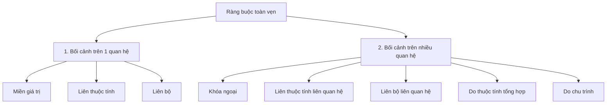
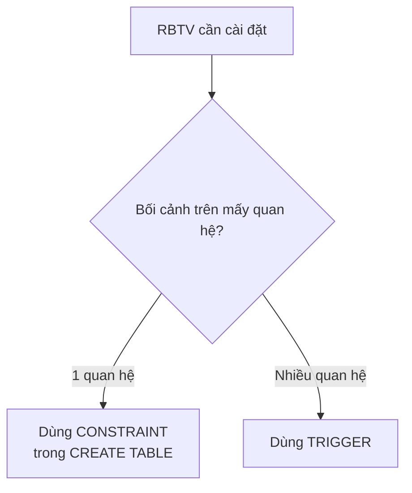
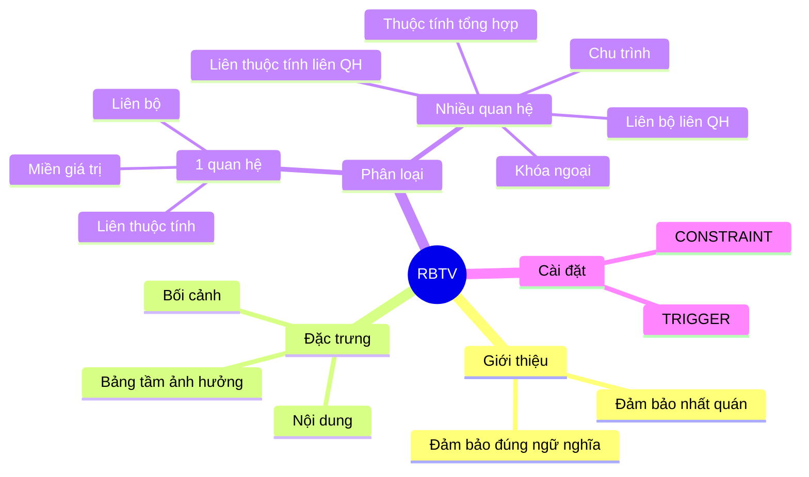

# Chương 5: Ràng Buộc Toàn Vẹn (RBTV)

---

## 1. Giới thiệu

**Ràng buộc toàn vẹn (RBTV)** là những yêu cầu (điều kiện) mà **tất cả thể hiện của quan hệ** (tức là toàn bộ dữ liệu trong bảng tại mọi thời điểm) phải thỏa mãn.

### Mục đích

- **Đảm bảo tính đúng đắn về mặt ngữ nghĩa**: Dữ liệu lưu trữ phải phản ánh đúng thực tế nghiệp vụ. Ví dụ: điểm không thể âm, ngày kết thúc không thể trước ngày bắt đầu.
- **Đảm bảo tính nhất quán**: Dữ liệu giữa các bảng không được mâu thuẫn nhau.

### Nguồn gốc của RBTV

- **Từ yêu cầu quản lý thực tế**: Ví dụ điểm thi từ 0–10, ngày giao hàng phải sau ngày đặt hàng, lương tối thiểu theo thâm niên…
- **Từ mô hình dữ liệu quan hệ**: Khóa chính (Primary Key), khóa ngoại (Foreign Key).

---

## 2. Các đặc trưng của RBTV

Mỗi RBTV được mô tả bởi **3 đặc trưng**:

### 2.1 Nội dung

Phát biểu RBTV bằng ngôn ngữ hình thức: phép tính quan hệ, đại số quan hệ, hoặc mã giả. Nội dung cho biết **điều kiện cụ thể** cần phải thỏa mãn.

### 2.2 Bối cảnh

Là tập hợp các quan hệ (bảng) **có khả năng làm vi phạm** RBTV khi có thao tác thêm/xóa/sửa xảy ra trên chúng.

### 2.3 Bảng tầm ảnh hưởng (BTAH)

Là bảng 2 chiều, liệt kê các quan hệ trong bối cảnh và xác định với mỗi thao tác (Thêm/Xóa/Sửa) thì thao tác đó **có thể vi phạm** hay **không thể vi phạm** RBTV.

| Quan hệ | Thêm | Xóa | Sửa |
|---|---|---|---|
| Quan hệ 1 | `+` | `+` | `- (*)` |
| Quan hệ n | `-` | `-` | `+ (A)` |

**Ký hiệu:**

| Ký hiệu | Ý nghĩa |
|---|---|
| `+` | Thao tác **có thể** gây vi phạm RBTV → cần kiểm tra |
| `-` | Thao tác **không thể** gây vi phạm RBTV → không cần kiểm tra |
| `+ (A)` | Có thể vi phạm **khi sửa thuộc tính A** cụ thể |
| `- (*)` | Không thể vi phạm vì **thao tác không thực hiện được** (thường là sửa khóa chính — bị cấm) |

!!! note "Lưu ý quan trọng về BTAH"
    - **Thuộc tính khóa (khóa chính)** không được phép sửa giá trị → cột Sửa của quan hệ đó ghi `- (*)`.
    - Thao tác **Thêm** và **Xóa** xét trên **một bộ** (một hàng) của quan hệ.
    - Thao tác **Sửa** xét trên **từng thuộc tính** riêng lẻ.
    - Trước khi kiểm tra vi phạm, CSDL **phải đang thỏa** RBTV (tức là trạng thái ban đầu hợp lệ).

---

## 3. Phân loại RBTV



---

## 4. RBTV có bối cảnh trên 1 quan hệ

### 4.1 RBTV Miền giá trị

**Định nghĩa**: Quy định miền giá trị hợp lệ của một thuộc tính — tức là thuộc tính đó chỉ được nhận các giá trị trong một tập hoặc khoảng xác định.

---

??? example "Ví dụ 1: Giới tính nhân viên"
    **Quan hệ**: `NHANVIEN(MaNV, HoTen, GT, SoDT, DChi)`

    **Phát biểu**: Giới tính của nhân viên chỉ có thể là `Nam` hoặc `Nữ`.

    **Bối cảnh**: `NHANVIEN`

    **Nội dung**:
    ```
    ∀nv ∈ NHANVIEN: nv.GT = 'Nam' ∨ nv.GT = 'Nu'
    ```

    **Giải thích**: Với mọi bộ `nv` trong bảng NHANVIEN, giá trị thuộc tính GT phải là 'Nam' hoặc 'Nu', không được nhận giá trị nào khác.

    **Bảng tầm ảnh hưởng**:

    | | Thêm | Xóa | Sửa |
    |---|---|---|---|
    | NHANVIEN | `+` | `-` | `+ (GT)` |

    - **Thêm `+`**: Khi thêm một nhân viên mới, nếu GT không phải Nam/Nữ → vi phạm → cần kiểm tra.
    - **Xóa `-`**: Xóa một nhân viên không làm thay đổi giá trị GT của ai → không vi phạm.
    - **Sửa `+(GT)`**: Chỉ khi sửa thuộc tính GT mới có thể vi phạm; sửa HoTen hay SoDT thì không ảnh hưởng.

---

??? example "Ví dụ 2: Điểm học sinh"
    **Quan hệ**: `KETQUA(MaHS, MaMon, HK, NamHoc, Diem)`

    **Phát biểu**: Điểm của học sinh là thang điểm 10 (từ 0 đến 10).

    **Bối cảnh**: `KETQUA`

    **Nội dung**:
    ```
    ∀kq ∈ KETQUA: kq.Diem ≥ 0 ∧ kq.Diem ≤ 10
    ```

    **Bảng tầm ảnh hưởng**:

    | | Thêm | Xóa | Sửa |
    |---|---|---|---|
    | KETQUA | `+` | `-` | `+ (Diem)` |

---

### 4.2 RBTV Liên thuộc tính

**Định nghĩa**: Ràng buộc giữa **các thuộc tính khác nhau** trong cùng một quan hệ — giá trị của thuộc tính này phụ thuộc hoặc phải thỏa điều kiện so với giá trị của thuộc tính kia.

---

??? example "Ví dụ 3: Ngày bắt đầu và kết thúc dự án"
    **Quan hệ**: `DUAN(MaDA, TenDA, DDiem_DA, MaPH, NgBD_DK, NgKT_DK)`

    **Phát biểu**: Ngày bắt đầu dự án phải nhỏ hơn ngày kết thúc dự án đó.

    **Bối cảnh**: `DUAN`

    **Nội dung**:
    ```
    ∀da ∈ DUAN: da.NgBD_DK < da.NgKT_DK
    ```

    **Bảng tầm ảnh hưởng**:

    | | Thêm | Xóa | Sửa |
    |---|---|---|---|
    | DUAN | `+` | `-` | `+ (NgBD_DK, NgKT_DK)` |

    - **Sửa**: Chỉ khi sửa một trong hai thuộc tính ngày mới có nguy cơ vi phạm → ghi cả hai thuộc tính.

---

??? example "Ví dụ 4: Lương tối thiểu theo thâm niên"
    **Quan hệ**: `NHANVIEN(MaNV, HoTen, NgVaoLam, Luong)`

    **Phát biểu**: Nhân viên có ngày vào làm trước năm 2005 thì lương tối thiểu là 15.000.000.

    **Bối cảnh**: `NHANVIEN`

    **Nội dung**:
    ```
    ∀nv ∈ NHANVIEN: YEAR(nv.NgVaoLam) < 2005 ⟹ nv.Luong ≥ 15000000
    ```

    **Giải thích logic**: Nếu nhân viên vào làm trước 2005 thì lương phải ≥ 15 triệu. Nếu vào làm từ 2005 trở đi thì không bị ràng buộc bởi điều kiện này (mệnh đề kéo theo — vế trái sai thì toàn bộ đúng).

    **Bảng tầm ảnh hưởng**:

    | | Thêm | Xóa | Sửa |
    |---|---|---|---|
    | NHANVIEN | `+` | `-` | `+ (NgVaoLam, Luong)` |

---

### 4.3 RBTV Liên bộ

**Định nghĩa**: Ràng buộc giữa **các bộ (hàng) khác nhau** trong cùng một quan hệ — tức là giá trị của các bộ phải thỏa mãn điều kiện nào đó khi đặt cạnh nhau.

Các loại phổ biến:

- **Khóa chính**: Mỗi bộ phân biệt nhau bởi giá trị khóa.
- **Unique (duy nhất)**: Một thuộc tính không phải khóa cũng phải có giá trị duy nhất.
- **Ràng buộc về số bộ**: Giới hạn số lượng bộ thỏa điều kiện nào đó.

---

??? example "Ví dụ 5: Khóa chính — Mã dự án"
    **Quan hệ**: `DUAN(MaDA, TenDA, DDiem_DA, MaPH, NgBD_DK, NgKT_DK)`

    **Phát biểu**: Mỗi dự án có một mã số để phân biệt với các dự án khác.

    **Nội dung**:
    ```
    ∀da1, da2 ∈ DUAN: da1 ≠ da2 ⟹ da1.MaDA ≠ da2.MaDA
    ```

    **Bảng tầm ảnh hưởng**:

    | | Thêm | Xóa | Sửa |
    |---|---|---|---|
    | DUAN | `+` | `-` | `- (*)` |

    - **Sửa `-(*)` **: MaDA là khóa chính → không được phép sửa → thao tác không thực hiện được.

---

??? example "Ví dụ 6: Unique — Tên phòng ban"
    **Quan hệ**: `PHONGBAN(MaPhong, TenPhong, TrPhong, NgayNhanChuc)`

    **Phát biểu**: Tên mỗi phòng ban phải khác nhau.

    **Nội dung**:
    ```
    ∀pb1, pb2 ∈ PHONGBAN: pb1 ≠ pb2 ⟹ pb1.TenPhong ≠ pb2.TenPhong
    ```

    **Bảng tầm ảnh hưởng**:

    | | Thêm | Xóa | Sửa |
    |---|---|---|---|
    | PHONGBAN | `+` | `-` | `+ (TenPhong)` |

---

??? example "Ví dụ 7: Giới hạn số bộ — Số nhân viên dự án"
    **Quan hệ**: `PHANCONG(MaNV, MaDA, ThoiGian)`

    **Phát biểu**: Mỗi dự án có tối đa 15 nhân viên tham gia.

    **Nội dung**:
    ```
    ∀pc1 ∈ PHANCONG:
      COUNT(pc2 ∈ PHANCONG : pc2.MaDA = pc1.MaDA) ≤ 15
    ```

    **Giải thích**: Với mọi bộ phân công pc1, đếm số bộ trong PHANCONG có cùng MaDA với pc1 → tổng số nhân viên của dự án đó phải ≤ 15.

    **Bảng tầm ảnh hưởng**:

    | | Thêm | Xóa | Sửa |
    |---|---|---|---|
    | PHANCONG | `+` | `-` | `- (*)` |

    - **Sửa `-(*)` **: (MaNV, MaDA) là khóa chính của PHANCONG → không được sửa.

---

??? example "Ví dụ 8: Liên bộ — Hệ số lương và mức lương"
    **Quan hệ**: `NHANVIEN(MaNV, HoTen, HeSo, MucLuong)`

    **Phát biểu**: Các nhân viên có cùng hệ số lương thì phải có cùng mức lương.

    **Nội dung**:
    ```
    ∀nv1, nv2 ∈ NHANVIEN: nv1.HeSo = nv2.HeSo ⟹ nv1.MucLuong = nv2.MucLuong
    ```

    **Bảng tầm ảnh hưởng**:

    | | Thêm | Xóa | Sửa |
    |---|---|---|---|
    | NHANVIEN | `+` | `-` | `+ (HeSo, MucLuong)` |

---

## 5. RBTV có bối cảnh trên nhiều quan hệ

### 5.1 RBTV Khóa ngoại (Foreign Key)

**Định nghĩa**: Còn gọi là **ràng buộc tham chiếu** hay **ràng buộc tồn tại**. Giá trị của thuộc tính ở quan hệ này phải tồn tại ở quan hệ kia (được tham chiếu đến).

---

??? example "Ví dụ 9: Trưởng phòng phải là nhân viên"
    **Quan hệ**:
    - `NHANVIEN(MaNV, HoTen, NgSinh, NoiSinh, GT, MaNQL, Phong)`
    - `PHONGBAN(MaPhong, TenPhong, TrPhong, NgayNhanChuc)`

    **Phát biểu**: Mỗi trưởng phòng cũng là một nhân viên (TrPhong tham chiếu đến MaNV).

    **Bối cảnh**: `NHANVIEN`, `PHONGBAN`

    **Nội dung**:
    ```
    ∀pb ∈ PHONGBAN, ∃nv ∈ NHANVIEN: pb.TrPhong = nv.MaNV
    ```

    **Bảng tầm ảnh hưởng**:

    | | Thêm | Xóa | Sửa |
    |---|---|---|---|
    | NHANVIEN | `-` | `+` | `- (*)` |
    | PHONGBAN | `+` | `-` | `+ (TrPhong)` |

    - **NHANVIEN - Xóa `+`**: Xóa một nhân viên có thể làm TrPhong không còn tồn tại → vi phạm.
    - **NHANVIEN - Thêm `-`**: Thêm nhân viên mới không thể vi phạm (chỉ tăng tập hợp để tham chiếu).
    - **PHONGBAN - Thêm `+`**: Thêm phòng ban mới với TrPhong chưa tồn tại trong NHANVIEN → vi phạm.
    - **PHONGBAN - Sửa `+(TrPhong)`**: Sửa TrPhong sang giá trị không có trong NHANVIEN → vi phạm.

---

### 5.2 RBTV Liên thuộc tính liên quan hệ

**Định nghĩa**: Ràng buộc so sánh giá trị giữa các thuộc tính thuộc **các quan hệ khác nhau**.

---

??? example "Ví dụ 10: Ngày giao hàng ≥ Ngày đặt hàng"
    **Quan hệ**:
    - `DATHANG(MaDH, MaKH, NgayDH)`
    - `GIAOHANG(MaGH, MaDH, NgayGH)`

    **Phát biểu**: Ngày giao hàng phải lớn hơn hoặc bằng ngày đặt hàng tương ứng.

    **Nội dung**:
    ```
    ∀dh ∈ DATHANG, ∃! gh ∈ GIAOHANG:
      dh.MaDH = gh.MaDH ∧ gh.NgayGH ≥ dh.NgayDH
    ```

    **Bảng tầm ảnh hưởng**:

    | | Thêm | Xóa | Sửa |
    |---|---|---|---|
    | DATHANG | `-` | `-` | `+ (NgayDH)` |
    | GIAOHANG | `+` | `-` | `+ (MaDH, NgayGH)` |

---

??? example "Ví dụ 11: Ngày thanh toán ≥ Ngày mua hàng"
    **Quan hệ**:
    - `HOADON(MaHD, MaKH, NgayHD, TriGia)`
    - `THANHTOAN(MaHD, NgayTT, LanTT, SoTien)`

    **Phát biểu**: Ngày thanh toán cho một hóa đơn phải bằng hoặc sau ngày mua hàng (cho phép thanh toán nhiều lần).

    **Nội dung** (hai cách diễn đạt tương đương):

    ```
    -- Cách 1: Duyệt từ phía HOADON
    ∀hd ∈ HOADON, ∀tt ∈ THANHTOAN:
      hd.MaHD = tt.MaHD ⟹ tt.NgayTT ≥ hd.NgayHD

    -- Cách 2: Duyệt từ phía THANHTOAN
    ∀tt ∈ THANHTOAN, ∃hd ∈ HOADON:
      hd.MaHD = tt.MaHD ∧ tt.NgayTT ≥ hd.NgayHD
    ```

    !!! tip "Nên chọn cách nào?"
        Cách 2 thường được ưa dùng hơn vì nó đi từ bảng con (THANHTOAN) kiểm tra sự tồn tại trong bảng cha, phù hợp với hướng kiểm tra khóa ngoại. Cách 1 dùng phép kéo theo (⟹) mạnh hơn nhưng cần xét tất cả cặp.

    **Bảng tầm ảnh hưởng**:

    | | Thêm | Xóa | Sửa |
    |---|---|---|---|
    | HOADON | `-` | `-` | `+ (NgayHD)` |
    | THANHTOAN | `+` | `-` | `- (*)` |

    - **THANHTOAN - Sửa `-(*)` **: (MaHD, LanTT) là khóa chính → không sửa được.

---

### 5.3 RBTV Liên bộ liên quan hệ

**Định nghĩa**: Ràng buộc về **số lượng bộ** hoặc **sự tồn tại của bộ** giữa các quan hệ khác nhau.

---

??? example "Ví dụ 12: Mỗi phòng ban có ít nhất 1 địa điểm"
    **Quan hệ**:
    - `PHONGBAN(MaPhong, TenPhong, TrPhong, NgayNhanChuc)`
    - `DIADIEMPHONG(MaPhong, DiaDiem)`

    **Nội dung**:
    ```
    ∀pb ∈ PHONGBAN, ∃ddp ∈ DIADIEMPHONG: pb.MaPhong = ddp.MaPhong
    ```

    **Bảng tầm ảnh hưởng**:

    | | Thêm | Xóa | Sửa |
    |---|---|---|---|
    | PHONGBAN | `+` | `-` | `- (*)` |
    | DIADIEMPHONG | `-` | `+` | `- (*)` |

    - **PHONGBAN - Thêm `+`**: Thêm phòng ban mới nhưng chưa có địa điểm → vi phạm.
    - **DIADIEMPHONG - Xóa `+`**: Xóa địa điểm cuối cùng của một phòng → phòng đó không còn địa điểm → vi phạm.

---

??? example "Ví dụ 13: Dự án ở TPHCM có tối đa 20 nhân viên"
    **Quan hệ**:
    - `DUAN(MaDA, TenDA, DDiemDA, NgBD, NgKT)`
    - `PHANCONG(MaNV, MaDA, ThoiGian)`

    **Nội dung**:
    ```
    ∀da ∈ DUAN: da.DDiemDA = 'TPHCM'
      ⟹ COUNT(pc ∈ PHANCONG : pc.MaDA = da.MaDA) ≤ 20
    ```

    **Bảng tầm ảnh hưởng**:

    | | Thêm | Xóa | Sửa |
    |---|---|---|---|
    | DUAN | `-` | `-` | `+ (DDiemDA)` |
    | PHANCONG | `+` | `-` | `- (*)` |

    - **DUAN - Sửa `+(DDiemDA)`**: Khi sửa địa điểm thành 'TPHCM', dự án đó có thể đang có >20 nhân viên → vi phạm.

---

### 5.4 RBTV do thuộc tính tổng hợp

**Định nghĩa**: Ràng buộc liên quan đến **thuộc tính tính toán (derived attribute)** — giá trị của thuộc tính này phải bằng kết quả tính toán từ các thuộc tính khác ở quan hệ khác.

---

??? example "Ví dụ 14: Tổng trị giá phiếu xuất"
    **Quan hệ**:
    - `PHIEUXUAT(SoPhieu, Ngay, TongTriGia)`
    - `CTPX(SoPhieu, MaHang, SL, DG)`

    **Phát biểu**: Trị giá của phiếu xuất phải bằng tổng (Số lượng × Đơn giá) của tất cả chi tiết thuộc phiếu xuất đó.

    **Nội dung**:
    ```
    -- Cách 1: Dùng sigma (tổng tường minh)
    ∀px ∈ PHIEUXUAT:
      px.TongTriGia = Σ(ct.SL * ct.DG | ct ∈ CTPX ∧ px.SoPhieu = ct.SoPhieu)

    -- Cách 2: Dùng hàm SUM
    ∀px ∈ PHIEUXUAT:
      px.TongTriGia = SUM(ct.SL * ct.DG | ct ∈ CTPX ∧ px.SoPhieu = ct.SoPhieu)
    ```

    **Bảng tầm ảnh hưởng**:

    | | Thêm | Xóa | Sửa |
    |---|---|---|---|
    | PHIEUXUAT | `+ (1)` | `-` | `+ (TongTriGia)` |
    | CTPX | `+` | `+` | `+ (SL, DG)` |

    !!! warning "Lưu ý đặc biệt cho PHIEUXUAT - Thêm"
        Khi thêm phiếu xuất mới (chưa có chi tiết), cần kiểm tra `TongTriGia = 0`. Nếu thiết kế cho phép phiếu xuất không có chi tiết ban đầu thì TongTriGia phải là 0 lúc đó.

    - **CTPX - Xóa `+`**: Xóa một dòng chi tiết làm thay đổi tổng → TongTriGia trong PHIEUXUAT có thể sai → cần cập nhật/kiểm tra.
    - **CTPX - Sửa `+(SL, DG)`**: Sửa số lượng hoặc đơn giá ảnh hưởng trực tiếp đến tổng.

---

### 5.5 RBTV do sự hiện diện của chu trình

**Định nghĩa**: Xảy ra khi có **chu trình tham chiếu** giữa các quan hệ — quan hệ A tham chiếu B và B tham chiếu lại A (hoặc qua trung gian). Chu trình này tạo ra ràng buộc **kết hợp** phức tạp hơn ràng buộc tham chiếu thông thường.

---

??? example "Ví dụ 15: Trưởng phòng phải là nhân viên của chính phòng đó"
    **Quan hệ**:
    - `NHANVIEN(MaNV, HoTen, NgSinh, NoiSinh, GT, MaNQL, Phong)`
    - `PHONGBAN(MaPhong, TenPhong, TrPhong, NgayNhanChuc)`

    **Chu trình**: `NHANVIEN.Phong → PHONGBAN.MaPhong` và `PHONGBAN.TrPhong → NHANVIEN.MaNV`

    ```mermaid
    graph LR
        NV[NHANVIEN] -->|Phong = MaPhong| PB[PHONGBAN]
        PB -->|TrPhong = MaNV| NV
    ```

    **Phát biểu**: Trưởng phòng không chỉ phải là nhân viên (VD9) mà còn phải là nhân viên **của chính phòng đó**.

    **Nội dung**:
    ```
    ∀pb ∈ PHONGBAN, ∃nv ∈ NHANVIEN:
      pb.TrPhong = nv.MaNV ∧ pb.MaPhong = nv.Phong
    ```

    **Bảng tầm ảnh hưởng**:

    | | Thêm | Xóa | Sửa |
    |---|---|---|---|
    | NHANVIEN | `-` | `-` | `+ (Phong)` |
    | PHONGBAN | `+` | `-` | `+ (TrPhong)` |

    - **NHANVIEN - Sửa `+(Phong)`**: Khi nhân viên đang là trưởng phòng mà sửa sang phòng khác → vi phạm.

---

??? example "Ví dụ 16: Nhân viên chỉ được phân công vào dự án do phòng mình phụ trách"
    **Quan hệ**:
    - `NHANVIEN(MaNV, HoTen, ..., Phong)`
    - `DUAN(MaDA, TenDA, ..., MaPhong)` *(MaPhong là phòng phụ trách dự án)*
    - `PHANCONG(MaNV, MaDA, ThoiGian)`

    ```mermaid
    graph TD
        NV[NHANVIEN] -->|Phong = MaPhong| DA[DUAN]
        NV -->|MaNV = MaNV| PC[PHANCONG]
        DA -->|MaDA = MaDA| PC
    ```

    **Phân tích chu trình** — Gọi:
    - `A = π(MaNV, MaDA)(PHANCONG)` — các cặp (nhân viên, dự án) thực tế được phân công.
    - `B = π(MaNV, MaDA)(NHANVIEN ⋈ DUAN)` — các cặp (nhân viên, dự án) mà phòng của nhân viên phụ trách.

    | Trường hợp | Ý nghĩa |
    |---|---|
    | `A ≡ B` | Nhân viên phải được phân công **tất cả** dự án do phòng phụ trách |
    | `A ⊆ B` | Nhân viên **chỉ được** phân công vào dự án do phòng phụ trách (trường hợp này) |
    | A và B độc lập | Không có ràng buộc — nhân viên có thể được phân công bất kỳ dự án nào |

    **Nội dung** (trường hợp `A ⊆ B`):
    ```
    -- Cách 1 (dùng phép nối)
    ∀pc ∈ PHANCONG, ∃nvda ∈ (NHANVIEN ⋈ DUAN):
      nvda.MaNV = pc.MaNV ∧ nvda.MaDA = pc.MaDA

    -- Cách 2 (tường minh)
    ∀pc ∈ PHANCONG, ∃nv ∈ NHANVIEN, ∃da ∈ DUAN:
      nv.Phong = da.MaPhong ∧ nv.MaNV = pc.MaNV ∧ da.MaDA = pc.MaDA
    ```

    **Bảng tầm ảnh hưởng**:

    | | Thêm | Xóa | Sửa |
    |---|---|---|---|
    | NHANVIEN | `-` | `-` | `+ (Phong)` |
    | DUAN | `-` | `-` | `+ (MaPhong)` |
    | PHANCONG | `+` | `-` | `- (*)` |

---

## 6. Bảng tầm ảnh hưởng tổng hợp

Khi có **m ràng buộc** trên **n quan hệ**, ta lập bảng tổng hợp:

| | **QH₁** | | | **QH₂** | | | ... | **QHₙ** | | |
|---|---|---|---|---|---|---|---|---|---|---|
| **RBTV** | T | X | S | T | X | S | ... | T | X | S |
| R₁ | | | | | | | | | | |
| R₂ | | | | | | | | | | |
| ... | | | | | | | | | | |
| Rₘ | | | | | | | | | | |

!!! tip "Mục đích"
    Bảng tổng hợp giúp xác định nhanh: với mỗi thao tác trên mỗi quan hệ, cần kiểm tra những RBTV nào.

---

## 7. Cài đặt RBTV trong CSDL



| Loại RBTV | Cơ chế cài đặt | Ví dụ SQL |
|---|---|---|
| Miền giá trị | `CHECK` constraint | `CHECK (GT IN ('Nam', 'Nu'))` |
| Khóa chính | `PRIMARY KEY` | `PRIMARY KEY (MaNV)` |
| Unique | `UNIQUE` | `UNIQUE (TenPhong)` |
| Khóa ngoại | `FOREIGN KEY` | `FOREIGN KEY (TrPhong) REFERENCES NHANVIEN(MaNV)` |
| Liên quan hệ phức tạp | `TRIGGER` | Viết trigger kiểm tra sau INSERT/UPDATE/DELETE |

---

## 8. Tổng kết



!!! summary "Điểm cốt lõi cần nhớ"
    1. **RBTV** = điều kiện mà mọi dữ liệu trong CSDL phải thỏa mãn tại mọi thời điểm.
    2. **3 đặc trưng**: Nội dung (công thức) · Bối cảnh (quan hệ liên quan) · Bảng tầm ảnh hưởng (thao tác nào cần kiểm tra).
    3. **Bảng tầm ảnh hưởng**: `+` → kiểm tra, `-` → bỏ qua, `+(A)` → chỉ kiểm tra khi sửa A, `-(*)` → không thực hiện được (sửa khóa chính).
    4. **RBTV 1 quan hệ** → dùng `CONSTRAINT`; **RBTV nhiều quan hệ** → dùng `TRIGGER`.
