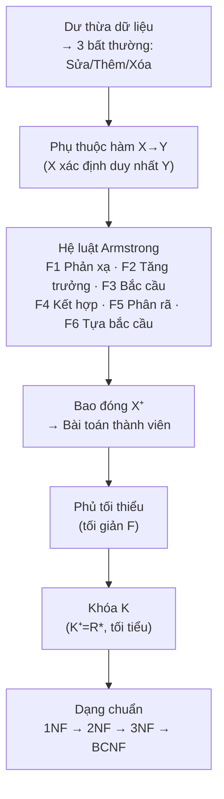

# Chương 6: Phụ Thuộc Hàm và Dạng Chuẩn

---

## 1. Các Vấn Đề Gặp Phải Khi Tổ Chức CSDL

Khi thiết kế CSDL không tốt, ta gặp phải vấn đề **dư thừa dữ liệu**, dẫn đến ba loại bất thường:

### Ví dụ minh họa

Xét quan hệ `SINHVIEN_DIEMTHI(MaSV, MaMH, HoTen, TenMH, Diem)`:

| MaSV | MaMH | HoTen | TenMH | Diem |
|------|------|-------|-------|------|
| SV01 | CSDL | Nguyễn Tuyết An | Cơ sở dữ liệu | 10 |
| SV01 | NMLT | Nguyễn Tuyết An | Nhập môn lập trình | 9.5 |
| SV01 | HDT | Nguyễn Tuyết An | Hướng đối tượng | 8.5 |
| SV02 | CSDL | Trần Ngọc Minh | Cơ sở dữ liệu | 8 |
| SV02 | CTRR | Trần Ngọc Minh | Cấu trúc rời rạc | 5 |
| SV03 | NMLT | Phạm Tiến Dũng | Nhập môn lập trình | 7 |
| SV03 | CTRR | Phạm Tiến Dũng | Cấu trúc rời rạc | 7.5 |

> **Vấn đề:** `HoTen` của SV01 lặp lại 3 lần, `TenMH` của CSDL lặp lại 2 lần → **dư thừa dữ liệu**.

---

### Ba loại bất thường

=== "Bất thường khi SỬA"
    Nếu đổi tên SV01 từ "Nguyễn Tuyết An" → "Nguyễn Tuyết Anh" nhưng chỉ sửa 1 dòng (dòng NMLT), các dòng còn lại vẫn là "Nguyễn Tuyết An" → **mâu thuẫn dữ liệu**.

=== "Bất thường khi THÊM"
    Muốn thêm sinh viên SV04 (Phan Minh Đức) nhưng chưa đăng ký môn nào → phải để `MaMH = NULL` → **vi phạm ràng buộc khóa chính**, không thể thêm.

=== "Bất thường khi XÓA"
    Nếu SV03 chỉ học 2 môn (NMLT, CTRR), xóa cả 2 dòng → **mất luôn thông tin** về SV03 (họ tên, ngày sinh,...).

---

### Giải pháp: Tách quan hệ

Tách thành 3 quan hệ riêng biệt:

```
SINHVIEN(MaSV, HoTen)
MONHOC(MaMH, TenMH)
DIEMTHI(MaSV, MaMH, Diem)
```

→ Loại bỏ dư thừa, tránh cả 3 loại bất thường trên.

---

## 2. Phụ Thuộc Hàm (Functional Dependency)

### 2.1. Khái niệm cơ bản

!!! info "Định nghĩa"
    Cho quan hệ $R(A_1, A_2, ..., A_n)$, $X, Y \subseteq R^*$. Ta nói **X xác định hàm Y** (ký hiệu $X \rightarrow Y$) nếu:

    $$\forall t_1, t_2 \in R: t_1.X = t_2.X \Rightarrow t_1.Y = t_2.Y$$

    Nghĩa là: **với một giá trị của X, chỉ tồn tại duy nhất một giá trị của Y**.

- **X** gọi là **vế trái** của phụ thuộc hàm (PTH).
- **Y** gọi là **vế phải** của PTH.
- **X xác định Y**, hoặc **Y phụ thuộc (hàm) vào X**.
- Tập tất cả PTH trên quan hệ R ký hiệu là **F**.

**Ví dụ thực tế:**
```
MaNV → TenNV          -- Mã NV xác định tên NV
MaNV, MaDA → ThoiGian -- Cặp (MaNV, MaDA) xác định thời gian làm việc
```

---

### 2.2. Xác định PTH từ dữ liệu — Ví dụ

Xét `CTHD(SoHD, MaSP, SL, DonGia, ThanhTien)`:

| SoHD | MaSP | SL | DonGia | ThanhTien |
|------|------|----|--------|-----------|
| HD01 | SP01 | 5 | 2.000 | 10.000 |
| HD01 | SP03 | 2 | 10.000 | 20.000 |
| HD02 | SP01 | 5 | 2.000 | 10.000 |
| HD02 | SP04 | 2 | 3.000 | 6.000 |
| HD03 | SP02 | 4 | 10.000 | 40.000 |
| HD03 | SP03 | 4 | 12.500 | 50.000 |
| HD03 | SP04 | 8 | 2.500 | 20.000 |

??? question "Phân tích từng PTH được đề xuất"
    | PTH | Đúng? | Giải thích |
    |-----|-------|------------|
    | `SoHD → MaSP` | ❌ | HD01 có SP01 và SP03 → không duy nhất |
    | `SoHD → SL` | ❌ | HD01 có SL=5 và SL=2 → không duy nhất |
    | `MaSP → DonGia` | ❌ | SP03 xuất hiện ở 2 dòng: DonGia=10.000 và 12.500 → không duy nhất |
    | `SoHD, MaSP → SL` | ✅ | Cặp (HD, SP) xác định duy nhất số lượng |
    | `SoHD, MaSP → DonGia` | ✅ | Cặp (HD, SP) xác định duy nhất đơn giá |
    | `SL → ThanhTien` | ❌ | HD01/SP03: SL=2, TT=20.000; HD03/SP04: SL=8, TT=20.000 — cùng TT khác SL; ngược lại HD03/SP02: SL=4, TT=40.000; HD03/SP03: SL=4, TT=50.000 → không duy nhất |
    | `DonGia → ThanhTien` | ❌ | DonGia=10.000 có TT=20.000 và 40.000 → không duy nhất |
    | `SL, DonGia → ThanhTien` | ✅ | ThanhTien = SL × DonGia → xác định duy nhất |
    | `SoHD, MaSP → SL, DonGia, ThanhTien` | ✅ | Tổng hợp từ các PTH đúng trên |

---

### 2.3. Hệ Luật Dẫn Armstrong

!!! note "Mục đích"
    Cho phép **suy ra các PTH mới** từ tập PTH đã biết F, mà không cần kiểm tra trên dữ liệu.

Ký hiệu: $F \models X \rightarrow Y$ — "X→Y được suy ra từ F".

#### Ba luật cơ bản (Armstrong Axioms)

| # | Tên | Phát biểu | Ví dụ |
|---|-----|-----------|-------|
| F1 | **Phản xạ** (Reflexivity) | Nếu $Y \subseteq X$ thì $X \rightarrow Y$ | `{MaSV, TenSV} → TenSV` |
| F2 | **Tăng trưởng** (Augmentation) | Nếu $X \rightarrow Y$ thì $XZ \rightarrow YZ$ | Từ `MaSV→TenSV` suy ra `MaSV,NgaySinh → TenSV,NgaySinh` |
| F3 | **Bắc cầu** (Transitivity) | Nếu $X \rightarrow Y$ và $Y \rightarrow Z$ thì $X \rightarrow Z$ | Từ `MaSV→MaLop`, `MaLop→TenLop` suy ra `MaSV→TenLop` |

#### Ba luật bổ sung (dẫn xuất từ Armstrong)

| # | Tên | Phát biểu | Ví dụ |
|---|-----|-----------|-------|
| F4 | **Kết hợp** (Union) | Nếu $X \rightarrow Y$ và $X \rightarrow Z$ thì $X \rightarrow YZ$ | `MaSV→TenSV` + `MaSV→GioiTinh` ⟹ `MaSV→TenSV,GioiTinh` |
| F5 | **Phân rã** (Decomposition) | Nếu $X \rightarrow YZ$ thì $X \rightarrow Y$ và $X \rightarrow Z$ | `MaSV→TenSV,GioiTinh` ⟹ `MaSV→TenSV` và `MaSV→GioiTinh` |
| F6 | **Tựa bắc cầu** (Pseudotransitivity) | Nếu $X \rightarrow Y$ và $YZ \rightarrow W$ thì $XZ \rightarrow W$ | `MaSV→MaLop`, `MaLop,MaMon→MaGV` ⟹ `MaSV,MaMon→MaGV` |

---

#### Bài tập chứng minh

??? example "VD10: R(A,B,C,D), F={A→B, A→C, BC→D}. Chứng minh A→D"
    | Bước | PTH | Lý do |
    |------|-----|-------|
    | 1 | A→B | Giả thiết |
    | 2 | A→C | Giả thiết |
    | 3 | A→BC | F4 (kết hợp 1 và 2) |
    | 4 | BC→D | Giả thiết |
    | 5 | **A→D** | F3 (bắc cầu 3 và 4) ✅ |

??? example "VD11: R(A,B,C,D,E), F={AB→D, C→A, B→E}. Chứng minh BC→DE"
    | Bước | PTH | Lý do |
    |------|-----|-------|
    | 1 | C→A | Giả thiết |
    | 2 | AB→D | Giả thiết |
    | 3 | BC→D | F6 (tựa bắc cầu 1 và 2: C→A, AB→D ⟹ BC→D) |
    | 4 | B→E | Giả thiết |
    | 5 | BC→EC | F2 (tăng trưởng 4 với C) |
    | 6 | BC→E | F5 (phân rã 5) |
    | 7 | **BC→DE** | F4 (kết hợp 3 và 6) ✅ |

??? example "VD12: R(A,B,C,D,E,G,H), F={AB→C, B→D, CD→E, CE→GH, G→A}. Chứng minh AB→E"
    | Bước | PTH | Lý do |
    |------|-----|-------|
    | 1 | AB→C | Giả thiết |
    | 2 | AB→B | F1 (phản xạ, B⊆AB) |
    | 3 | B→D | Giả thiết |
    | 4 | AB→D | F3 (bắc cầu 2 và 3) |
    | 5 | AB→CD | F4 (kết hợp 1 và 4) |
    | 6 | CD→E | Giả thiết |
    | 7 | **AB→E** | F3 (bắc cầu 5 và 6) ✅ |

---

### 2.4. Bao Đóng (Closure)

#### Bao đóng của tập PTH F

!!! info "Định nghĩa"
    **Bao đóng $F^+$** là tập tất cả các PTH có thể suy ra từ F bằng hệ luật Armstrong.

#### Bao đóng của tập thuộc tính X

!!! info "Định nghĩa"
    **Bao đóng $X^+_F$** của tập thuộc tính X đối với F là tập tất cả các thuộc tính A mà $X \rightarrow A$ có thể suy ra từ F:

    $$X^+_F = \{A \in R^* \mid X \rightarrow A \in F^+\}$"

#### Thuật toán tính $X^+_F$

```
Input:  (R, F), X ⊆ R*
Output: X⁺_F

Bước 1: Khởi tạo X₀ = X
Bước 2: Lặp:
    X_{i+1} = X_i ∪ Z, với mọi Y→Z ∈ F mà Y ⊆ X_i
    (Loại Y→Z khỏi F sau khi dùng)
    Dừng khi X_{i+1} = X_i  hoặc  X_i = R*
Bước 3: Kết luận X⁺_F = X_i cuối cùng
```

??? example "VD13: R(A,B,C,D,E,G,H), F={B→A, DA→CE, D→H, GH→C, AC→D}. Tìm AC⁺"
    **Vòng lặp 1:** $X_0 = AC$
    - f1: B→A, B⊄AC → không thỏa
    - f2: DA→CE, DA⊄AC → không thỏa
    - f3: D→H, D⊄AC → không thỏa
    - f4: GH→C, GH⊄AC → không thỏa
    - f5: AC→D, AC⊆AC ✅ → $X_1 = AC \cup D = ACD$

    **Vòng lặp 2:** $X_1 = ACD$
    - f1: B→A, B⊄ACD → không thỏa
    - f2: DA→CE, DA⊆ACD ✅ → $X_2 = ACD \cup CE = ACDE$
    - f3: D→H, D⊆ACDE ✅ → $X_2 = ACDE \cup H = ACDEH$
    - f4: GH→C, GH⊄ACDEH → không thỏa
    - f5: đã dùng rồi

    **Vòng lặp 3:** $X_2 = ACDEH$
    - f2,f3,f5 đã dùng; f1,f4 không thỏa
    - $X_3 = X_2$ → **Dừng**

    $$\boxed{AC^+_F = ACDEH}$$

#### Bài toán thành viên

!!! tip "Kiểm tra $X \rightarrow Y \in F^+$"
    $$X \rightarrow Y \in F^+ \iff Y \subseteq X^+_F$$

??? example "VD14: Cho biết AC→E ∈ F⁺ không?"
    Từ VD13: $AC^+_F = ACDEH$

    Vì $E \in ACDEH$ nên $AC \rightarrow E \in F^+$ ✅

---

### 2.5. Phủ Tối Thiểu (Minimal Cover)

!!! info "Định nghĩa Phủ Tối Thiểu"
    Tập PTH F được gọi là **phủ tối thiểu** nếu thỏa đồng thời:
    
    1. **(i)** Mọi PTH trong F có **vế trái không dư thừa** (phụ thuộc đầy đủ)
    2. **(ii)** Mọi PTH trong F có **vế phải đúng một thuộc tính**
    3. **(iii)** F **không có PTH dư thừa** (không thể bỏ PTH nào mà F vẫn tương đương)

#### Các khái niệm liên quan

**Hai tập PTH tương đương:** F ≡ G nếu $F^+ = G^+$ (suy ra được lẫn nhau).

**PTH có vế trái dư thừa:** $X \rightarrow Y$ có thuộc tính $A \in X$ dư thừa nếu bỏ A đi mà PTH vẫn đúng trong F, tức là $(X - A) \rightarrow Y \in (F - \{X\rightarrow Y\})^+$.

**PTH dư thừa:** $X \rightarrow Y \in F$ là dư thừa nếu $X \rightarrow Y \in (F - \{X\rightarrow Y\})^+$.

#### Thuật toán tìm Phủ Tối Thiểu

```
Bước 1: Phân rã vế phải
    Thay mỗi X→Y₁Y₂...Yₙ thành X→Y₁, X→Y₂, ..., X→Yₙ

Bước 2: Loại bỏ thuộc tính vế trái dư thừa
    Với mỗi X→Y có |X| ≥ 2:
        Với mỗi A ∈ X:
            Tính (X-A)⁺ trong F - {X→Y}
            Nếu Y ∈ (X-A)⁺ → A dư thừa, thay X→Y bằng (X-A)→Y

Bước 3: Loại bỏ PTH dư thừa
    Với mỗi X→Y ∈ F:
        Tính X⁺ trong F - {X→Y}
        Nếu Y ∈ X⁺ → X→Y dư thừa, loại khỏi F
```

??? example "VD17: R(A,B,C,D), F={AB→CD, B→C, C→D}. Tìm phủ tối thiểu"
    **Bước 1:** Phân rã vế phải
    ```
    F = {f1: AB→C, f2: AB→D, f3: B→C, f4: C→D}
    ```

    **Bước 2:** Loại thuộc tính vế trái dư thừa

    *Xét f1: AB→C (bỏ f1 khỏi F khi xét):*
    - Bỏ A: $B^+_{\{f2,f3,f4\}} = B \cup C \cup D = BCD$ → C ∈ BCD ✅ → **bỏ A**
    - Bỏ B: $A^+_{\{f2,f3,f4\}} = A$ → C ∉ A → **giữ B**
    - → f1 viết lại thành **B→C** (trùng f3, giữ 1 cái)

    *Xét f2: AB→D (bỏ f2 khỏi F khi xét):*
    - Bỏ A: $B^+_{\{f1,f3,f4\}} = BCD$ → D ∈ BCD ✅ → **bỏ A**
    - Bỏ B: $A^+_{\{f1,f3,f4\}} = A$ → D ∉ A → **giữ B**
    - → f2 viết lại thành **B→D**

    ```
    F = {B→C, B→D, C→D}  (f1 và f3 hợp nhất thành B→C)
    ```
    *(Thực ra slide gộp f1 mới = f3, nên F = {B→C, C→D} sau bước 2 — xem bước 3)*

    **Bước 3:** Loại PTH dư thừa
    - Xét B→C: $B^+_{F-\{B\rightarrow C\}} = B^+_{\{C\rightarrow D\}} = B$ → C ∉ B → **không dư thừa**
    - Xét C→D: $C^+_{F-\{C\rightarrow D\}} = C^+_{\{B\rightarrow C\}} = C$ → D ∉ C → **không dư thừa**

    $$\boxed{\text{Phủ tối thiểu: } F = \{B \rightarrow C,\ C \rightarrow D\}}$$

---

### 2.6. Khóa (Key)

!!! info "Định nghĩa"
    Cho $R(A_1,...,A_n)$ và F là tập PTH trên R. Tập $K \subseteq R^*$ gọi là **khóa** của R nếu:
    
    1. $K^+_F = R^*$ &nbsp; (K xác định tất cả thuộc tính — tính đầy đủ)
    2. Không tồn tại $K' \subset K$ mà $K'^+_F = R^*$ &nbsp; (tính tối tiểu)

- **Thuộc tính khóa:** thuộc tính xuất hiện trong ít nhất một khóa.
- **Thuộc tính không khóa:** không xuất hiện trong bất kỳ khóa nào.
- **Siêu khóa:** tập K'' mà $K \subseteq K''$ với K là khóa (siêu khóa không cần tối tiểu).

#### Thuật toán tìm tất cả Khóa

```
Bước 1: Xác định tập NGUỒN (N)
    N = {thuộc tính chỉ xuất hiện ở VẾ TRÁI của các PTH}
    Tính N⁺:
    - Nếu N⁺ = R* → Khóa duy nhất là N. DỪNG.
    - Ngược lại → Bước 2.

Bước 2: Xác định tập TRUNG GIAN (TG)
    TG = {thuộc tính xuất hiện ở CẢ vế trái lẫn vế phải}
    Liệt kê tất cả tập con khác rỗng Xᵢ ⊆ TG.

Bước 3: Kiểm tra từng tập
    ∀Xᵢ ⊆ TG:
        Nếu (N ∪ Xᵢ)⁺ = R* 
        → Sᵢ = N ∪ Xᵢ là khóa ứng viên
        → Loại bỏ mọi Xⱼ ⊋ Xᵢ (không cần kiểm tra nữa)

Bước 4: Tập khóa K = {Sᵢ}
```

!!! tip "Lưu ý"
    Thuộc tính chỉ xuất hiện ở **vế phải** không thể là thành phần của bất kỳ khóa nào. Thuộc tính **không xuất hiện** trong F thì luôn phải có mặt trong khóa (vì không ai xác định nó).

??? example "VD19: R(A,B,C,D,E,G,H), F={B→A, DA→CE, D→H, GH→C, AC→D}. Tìm tất cả khóa"
    **Bước 1:** 
    - Vế trái: B, DA, D, GH, AC → N = {B, G} (chỉ xuất hiện vế trái, không bao giờ ở vế phải)
    - $BG^+ = BGA \neq R^*$ → tiếp tục

    **Bước 2:**
    - TG = {A, C, D, H} (xuất hiện cả 2 vế)
    - Các tập con: {A},{C},{D},{H},{AC},{AD},{AH},{CD},{CH},{DH},{ACD},{ACH},{ADH},{CDH},{ACDH}

    **Bước 3:**

    | N∪Xᵢ | $(N \cup X_i)^+$ | = R*? | Kết luận |
    |------|-----------------|-------|----------|
    | BGA | BGA | ❌ | |
    | **BGC** | BGCADEH | ✅ | **BGC là khóa** → loại AC,CD,CH,ACD,ACH,CDH,ACDH |
    | **BGD** | BGDACEH | ✅ | **BGD là khóa** → loại AD,DH,ADH |
    | **BGH** | BGHACDE | ✅ | **BGH là khóa** → loại AH |

    $$\boxed{\text{Các khóa: } \{BGC,\ BGD,\ BGH\}}$$

---

## 3. Dạng Chuẩn (Normal Forms)

!!! abstract "Mục đích"
    Chuẩn hóa nhằm:

    - Giảm tối đa **trùng lắp thông tin**
    - Dễ kiểm tra **ràng buộc toàn vẹn**
    - **Đánh giá chất lượng** thiết kế CSDL


> Mỗi dạng chuẩn cao hơn **bao hàm** dạng chuẩn thấp hơn: BCNF ⊂ 3NF ⊂ 2NF ⊂ 1NF.

---

### 3.1. Dạng Chuẩn 1 (1NF)

!!! info "Định nghĩa"
    Lược đồ R đạt **dạng chuẩn 1 (1NF)** nếu tất cả thuộc tính đều mang **giá trị nguyên tố** (atomic) — tức là không thể phân nhỏ thêm.

**Các loại thuộc tính vi phạm 1NF:**

- **Thuộc tính đa trị (multi-valued):** một ô chứa nhiều giá trị (VD: danh sách môn học)
- **Thuộc tính tổ hợp (composite):** một ô gồm nhiều thành phần (VD: địa chỉ = số nhà + đường + phường + quận)

**Ví dụ vi phạm 1NF:**

```
DiaChi: "Số 175 Đường 3/2 Phường 10 Quận 5"
→ Không nguyên tố vì có thể tách thành: SoNha, TenDuong, Phuong, Quan
```

Quan hệ `THAMGIA(MaNV, HoTen, NgSinh, MaDA, TenDA, ThoiGian)` với một ô `MaDA` chứa nhiều mã dự án → **vi phạm 1NF**.

Sau khi chuẩn hóa 1NF (mỗi dòng = 1 dự án), dữ liệu hết đa trị nhưng **vẫn trùng lặp** HoTen, NgSinh → cần lên 2NF.

---

### 3.2. Dạng Chuẩn 2 (2NF)

!!! info "Định nghĩa"
    Lược đồ R đạt **2NF** nếu:
    
    1. R đạt **1NF**, và
    2. Mọi thuộc tính **không khóa** đều **phụ thuộc đầy đủ** vào khóa
    
    (Không tồn tại thuộc tính không khóa phụ thuộc vào **một phần** của khóa)

!!! tip "Nhận xét quan trọng"
    - Nếu mọi khóa của R đều chỉ có **1 thuộc tính** → R tự động đạt 2NF (vì không thể có phụ thuộc vào "một phần" khóa 1 thuộc tính).
    - 2NF vẫn có thể còn trùng lặp dữ liệu (do phụ thuộc bắc cầu).

#### Thuật toán kiểm tra 2NF

```
1. Tìm tất cả khóa của R
2. Với mỗi khóa K:
   - Liệt kê tất cả tập con thực sự S ⊂ K (S ≠ K)
   - Tính S⁺
   - Nếu S⁺ chứa thuộc tính KHÔNG KHÓA → R KHÔNG đạt 2NF
3. Nếu không tìm thấy vi phạm → R đạt 2NF
```

??? example "VD25: R2(A,B,C,D), F={AB→D, C→D}. Kiểm tra 2NF"
    - N={A,B,C}, $ABC^+ = ABCD = R^*$ → Khóa là **ABC**
    - Tập con thực sự: {A},{B},{C},{AB},{AC},{BC}
    - Xét C⊂ABC: $C^+ = CD$ → D ∈ CD và D là thuộc tính không khóa
    - → **R2 không đạt 2NF** (D phụ thuộc vào phần C của khóa ABC)

??? example "VD26: SINHVIEN(MSSV, MaMH, TenSV, DiaChi, Diem), F={MSSV,MaMH→Diem; MSSV→TenSV,DiaChi}"
    - Khóa: **{MSSV, MaMH}**
    - Tập con: {MSSV}, {MaMH}
    - Xét {MSSV}: $MSSV^+ = \{MSSV, TenSV, DiaChi\}$
    - TenSV, DiaChi là thuộc tính không khóa → **SINHVIEN không đạt 2NF**

    **Tách thành 2 lược đồ đạt 2NF:**
    ```
    DANGKY(MSSV, MaMH, Diem)    -- F1: {MSSV,MaMH → Diem}
    SINHVIEN(MSSV, TenSV, DiaChi) -- F2: {MSSV → TenSV, DiaChi}
    ```

---

### 3.3. Dạng Chuẩn 3 (3NF)

!!! info "Định nghĩa 1 (theo phụ thuộc bắc cầu)"
    Lược đồ R đạt **3NF** nếu:
    
    1. R đạt **2NF**, và
    2. Không có thuộc tính không khóa nào **phụ thuộc bắc cầu** vào khóa

**Phụ thuộc bắc cầu:** Thuộc tính $A$ phụ thuộc bắc cầu vào X nếu tồn tại Y sao cho:

1. $X \rightarrow Y \in F^+$ và $Y \rightarrow A \in F^+$
2. $Y \not\rightarrow X \in F^+$ &nbsp; (Y không xác định ngược lại X)
3. $A \notin (X \cup Y)$

!!! info "Định nghĩa 2 (dùng để kiểm tra — thực dụng hơn)"
    R đạt **3NF** nếu với mọi PTH $X \rightarrow Y \in F$ (với $Y \not\subseteq X$), ít nhất một trong hai điều kiện sau phải thỏa:
    
    - **X là siêu khóa** (X chứa một khóa), **HOẶC**
    - **Y là thuộc tính khóa** (Y thuộc ít nhất một khóa)

!!! warning "So sánh 3NF và BCNF"
    3NF **nới lỏng hơn BCNF** ở chỗ: vế phải Y được phép là thuộc tính khóa dù X không phải siêu khóa.

#### Thuật toán kiểm tra 3NF

```
1. Tìm tất cả khóa → xác định thuộc tính khóa / không khóa
2. Phân rã vế phải: X→Y₁Y₂ thành X→Y₁, X→Y₂,...
3. Với mỗi X→Y (Y∉X):
   - Nếu X là siêu khóa → OK ✅
   - Nếu Y là thuộc tính khóa → OK ✅
   - Nếu cả hai đều không → R KHÔNG đạt 3NF ❌
```

??? example "VD29: NHANVIEN(MaNV, TenNV, NgSinh, SDT, MaPB, TenPB, TrgPB), F={MaNV→TenNV,NgSinh,SDT,MaPB; MaPB→TenPB,TrgPB}"
    - Khóa: **MaNV** (duy nhất 1 thuộc tính khóa)
    - Phân rã: F = {MaNV→TenNV; MaNV→NgSinh; MaNV→SDT; MaNV→MaPB; MaPB→TenPB; MaPB→TrgPB}
    - Xét **MaPB→TenPB**:
        - MaPB không phải siêu khóa (MaPB⁺ = {MaPB, TenPB, TrgPB} ≠ R*)
        - TenPB không phải thuộc tính khóa
    - → **NHANVIEN không đạt 3NF**
    - Nguyên nhân: TenPB phụ thuộc bắc cầu vào MaNV qua MaPB: `MaNV → MaPB → TenPB`

!!! note "Nhận xét"
    - Đạt 3NF → cũng đạt 2NF và 1NF.
    - **Yêu cầu tối thiểu khi thiết kế CSDL thực tế là đạt 3NF**.
    - Phụ thuộc bắc cầu là nguồn gốc của trùng lặp dữ liệu trong lược đồ đạt 2NF.

---

### 3.4. Dạng Chuẩn Boyce-Codd (BCNF)

!!! info "Định nghĩa"
    Lược đồ R đạt **BCNF** nếu với mọi PTH $X \rightarrow Y \in F$ (với $Y \not\subseteq X$):
    
    $$X \text{ là siêu khóa}$$

    (Không có ngoại lệ cho thuộc tính khóa như ở 3NF)

#### Thuật toán kiểm tra BCNF

```
1. Tìm tất cả khóa của R
2. Phân rã vế phải thành PTH 1 thuộc tính
3. Với mỗi X→Y (Y∉X):
   - Nếu X là siêu khóa → OK ✅
   - Nếu X không phải siêu khóa → R KHÔNG đạt BCNF ❌
```

??? example "VD30: R(A,B,C,D,E,I), F={ACD→EBI, CE→AD}. Kiểm tra BCNF"
    - Khóa: **{ACD}** và **{CE}**
    - Phân rã: F = {ACD→E, ACD→B, ACD→I, CE→A, CE→D}
    - Xét từng PTH:
        - ACD→E: ACD chứa khóa ACD → siêu khóa ✅
        - ACD→B: tương tự ✅
        - ACD→I: tương tự ✅
        - CE→A: CE chứa khóa CE → siêu khóa ✅
        - CE→D: tương tự ✅
    - → **R đạt BCNF** ✅

??? example "VD31: R(A,B,C,D), F={A→BCD, BC→AD, D→B}. Kiểm tra BCNF"
    - Khóa: **{A}**, **{BC}**, **{CD}**
    - Phân rã: F = {A→B, A→C, A→D, BC→A, BC→D, D→B}
    - Xét **D→B**:
        - $D^+ = DB$ ≠ R* → D không phải siêu khóa ❌
    - → **R không đạt BCNF**

!!! note "Nhận xét"
    - BCNF chặt hơn 3NF: loại bỏ **mọi** phụ thuộc mà vế trái không phải siêu khóa.
    - BCNF có thể vẫn còn trùng lặp thông tin (do phụ thuộc đa trị — học ở mức cao hơn).
    - Đôi khi **không thể** đạt BCNF mà vẫn bảo toàn tất cả PTH → phải chấp nhận 3NF.

---

### 3.5. Dạng Chuẩn của Lược Đồ Quan Hệ và Lược Đồ CSDL

!!! info "Quy ước"
    - **Dạng chuẩn của một lược đồ quan hệ R**: là dạng chuẩn **cao nhất** mà R thỏa.
    - **Dạng chuẩn của một lược đồ CSDL**: là dạng chuẩn **thấp nhất** trong số các dạng chuẩn của các lược đồ quan hệ thành phần.

#### Thuật toán xác định dạng chuẩn của R

```
1. Tìm mọi khóa của R
2. Kiểm tra BCNF:
   - Đúng → R đạt BCNF. DỪNG.
   - Sai → Bước 3
3. Kiểm tra 3NF:
   - Đúng → R đạt 3NF. DỪNG.
   - Sai → Bước 4
4. Kiểm tra 2NF:
   - Đúng → R đạt 2NF. DỪNG.
   - Sai → R chỉ đạt 1NF (hoặc thấp hơn).
```

---

## Tổng Kết



| Dạng chuẩn | Yêu cầu thêm so với cấp trước |
|-----------|-------------------------------|
| **1NF** | Mọi thuộc tính có giá trị nguyên tố |
| **2NF** | Không có phụ thuộc **bộ phận** vào khóa |
| **3NF** | Không có phụ thuộc **bắc cầu** vào khóa |
| **BCNF** | Mọi vế trái của PTH phải là **siêu khóa** |
