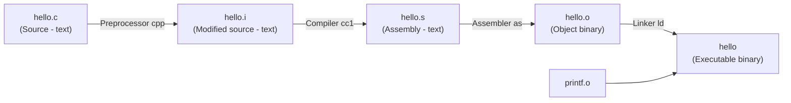
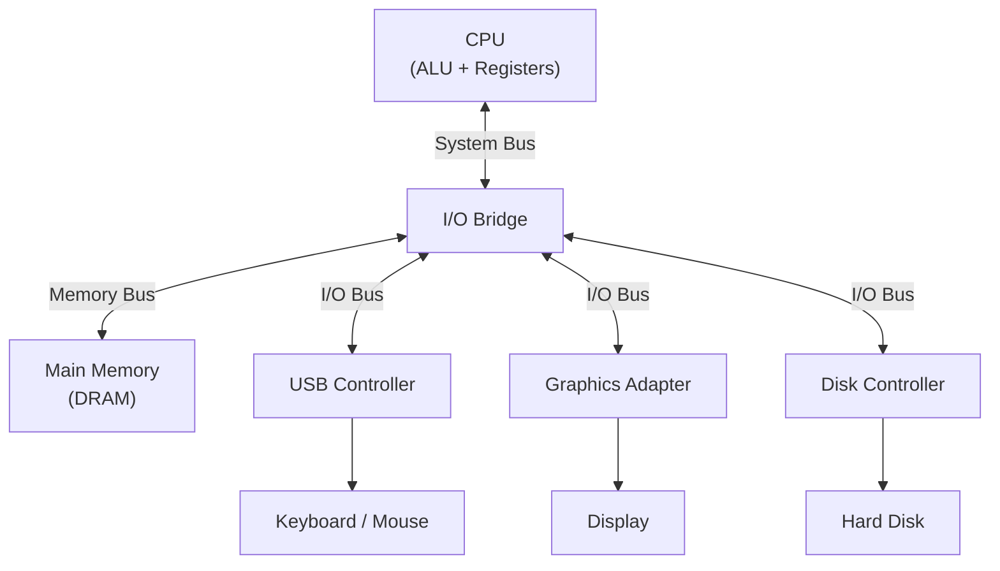
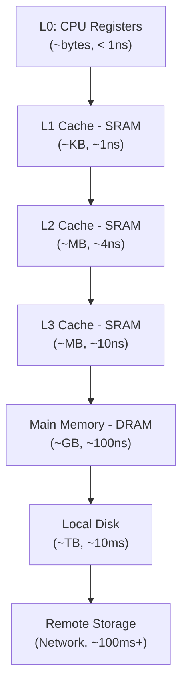

# Bài 1: Nội Dung Môn Học

---

## 1. Giới Thiệu Môn Học

Môn **Lập Trình Hệ Thống** cung cấp nền tảng để hiểu cách máy tính thực sự hoạt động — từ cấp độ ngôn ngữ lập trình bậc cao cho đến mã máy, bộ nhớ, và kiến trúc hệ thống.

> **Giáo trình chính:** *Computer Systems: A Programmer's Perspective* (CS:APP2e) – Bryant & O'Hallaron, Pearson, 2010. Đây là giáo trình chuẩn của ĐH Carnegie Mellon (CMU), Mỹ.

---

## 2. Mục Tiêu Môn Học

Sau khi hoàn thành môn học, sinh viên có khả năng:

- Hiểu và viết được **hợp ngữ (assembly)**, biết cách chuyển đổi qua lại giữa ngôn ngữ cấp cao và mã hợp ngữ.
- Nắm vững các khái niệm về **bộ nhớ, stack, pointer, cache** và kiến trúc máy tính.
- **Tối ưu hóa chương trình** ở nhiều mức độ khác nhau.
- Xây dựng phần mềm **an toàn hơn, hiệu quả hơn** và có tư duy hệ thống.
- Phục vụ các kỹ thuật **dịch ngược (reverse engineering)**, debug và kiểm lỗi phần mềm.

---

## 3. Nội Dung Chính

```
1. Biểu diễn kiểu dữ liệu cơ bản và các phép tính bit
2. Ngôn ngữ assembly (x86)
3. Điều khiển luồng trong C ở mức assembly
4. Thủ tục / hàm (procedure) trong C ở mức assembly
5. Biểu diễn mảng, cấu trúc dữ liệu trong C
6. Reverse engineering & Buffer Overflow (ATTT)
7. Linking trong biên dịch file thực thi
8. Phân cấp bộ nhớ, Cache
```

---

## 4. Quá Trình Biên Dịch Một Chương Trình C

Lấy ví dụ chương trình đơn giản nhất:

```c
#include <stdio.h>

int main() {
    printf("hello, world\n");
}
```

Chương trình này đi qua **4 giai đoạn** trước khi trở thành file thực thi:



| Giai đoạn | Công cụ | Đầu vào | Đầu ra | Mô tả |
|---|---|---|---|---|
| Tiền xử lý | `cpp` | `hello.c` | `hello.i` | Xử lý `#include`, `#define`,... |
| Biên dịch | `cc1` | `hello.i` | `hello.s` | Chuyển sang hợp ngữ |
| Hợp dịch | `as` | `hello.s` | `hello.o` | Chuyển sang mã nhị phân (object file) |
| Liên kết | `ld` | `hello.o` + `printf.o` | `hello` | Ghép các object file thành file thực thi |

> **Tại sao cần hiểu điều này?**
> Khi debug hoặc tối ưu hóa chương trình, bạn cần biết trình biên dịch đã "dịch" code của bạn thành gì ở mức máy. Nhiều lỗi bí ẩn chỉ có thể giải thích khi nhìn vào mã assembly được sinh ra.

---

## 5. Năm Vấn Đề Trọng Tâm

### Vấn đề #1 – Kiểu `int` và `float` có thực sự là số nguyên/thực không?

Trong toán học, các phép tính có tính chất quen thuộc. Nhưng **trong máy tính**, do giới hạn biểu diễn nhị phân, các tính chất này **không phải lúc nào cũng đúng**.

#### Câu hỏi 1: Với mọi `x`, có chắc `x * x ≥ 0` không?

??? question "Trả lời"
    - **Với `float`:** ✅ Đúng — do IEEE 754 đảm bảo.
    - **Với `int`:** ❌ **Sai!** Do hiện tượng **tràn số (integer overflow)**:
        - `40000 * 40000 = 1,600,000,000` → vẫn trong giới hạn `int` 32-bit (max ≈ 2.1 tỷ) ✅
        - `50000 * 50000 = 2,500,000,000` → **vượt quá giới hạn**, kết quả bị wrap-around thành số **âm** ❌

    ```c
    #include <stdio.h>
    int main() {
        int x = 50000;
        printf("%d\n", x * x); // In ra số âm!
        return 0;
    }
    ```

#### Câu hỏi 2: Có chắc `(x + y) + z = x + (y + z)` không?

??? question "Trả lời"
    - **Với `int` (có dấu và không dấu):** ✅ Đúng — phép cộng nguyên có tính kết hợp.
    - **Với `float`:** ❌ **Sai!** Do sai số làm tròn trong IEEE 754:
        - `(1e20 + -1e20) + 3.14` → `0.0 + 3.14` = **`3.14`** ✅
        - `1e20 + (-1e20 + 3.14)` → `1e20 + 3.14` ≈ **`1e20`** (3.14 bị nuốt mất do quá nhỏ so với 1e20) ❌

!!! warning "Kết luận"
    Lập trình viên **không được giả định** rằng các phép tính trong máy tính hoạt động giống toán học thông thường. Đây là vấn đề đặc biệt quan trọng khi viết **compiler**, **hệ thống nhúng**, hay **ứng dụng tài chính/khoa học**.

---

### Vấn đề #2 – Tại sao cần biết Assembly (Hợp ngữ)?

Assembly là ngôn ngữ "gần nhất" với máy tính mà con người có thể đọc được. Hiểu assembly giúp bạn:

- 🐛 **Debug lỗi sâu:** Hiểu hành vi thực sự của chương trình khi có bug khó tái hiện.
- ⚡ **Tối ưu hiệu suất:** Biết trình biên dịch tối ưu hóa gì, và khi nào nó không làm được.
- 🔐 **Bảo mật phần mềm:** Phân tích, tạo và phòng chống malware; khai thác lỗ hổng buffer overflow.
- 🔍 **Reverse engineering:** Đọc hiểu chương trình khi không có source code.
- 🛠️ **Lập trình hệ thống:** Viết OS, driver, firmware đòi hỏi kiểm soát chính xác phần cứng.

```nasm
; Ví dụ assembly x86 - in "Hello, World"
section .data
    msg db "Hello, World", 0x0a
    len equ $ - msg

section .text
    global _start
_start:
    mov eax, 4       ; syscall: write
    mov ebx, 1       ; file descriptor: stdout
    mov ecx, msg     ; con trỏ đến chuỗi
    mov edx, len     ; độ dài chuỗi
    int 0x80         ; gọi kernel
```

!!! info "Assembly x86 là lựa chọn chính trong môn học này"
    x86/x86-64 là kiến trúc phổ biến nhất trên máy tính cá nhân và server hiện nay. Hiểu x86 assembly là nền tảng để làm việc với hầu hết các hệ thống thực tế.

---

### Vấn đề #3 – Lỗi khi truy cập bộ nhớ (Memory Bug)

#### Ví dụ minh họa

```c
typedef struct {
    int a[2];    // mảng 2 phần tử int (index hợp lệ: 0 và 1)
    double d;    // biến double ngay sau mảng trong bộ nhớ
} struct_t;

double fun(int i) {
    volatile struct_t s;
    s.d = 3.14;
    s.a[i] = 1073741824; /* Có thể truy cập ngoài giới hạn! */
    return s.d;
}
```

#### Câu hỏi: Kết quả của `fun(0)` đến `fun(6)` là gì?

??? question "Trả lời và giải thích"
    | Lời gọi | Kết quả | Giải thích |
    |---|---|---|
    | `fun(0)` | `3.14` | `a[0]` hợp lệ, `d` không bị ảnh hưởng |
    | `fun(1)` | `3.14` | `a[1]` hợp lệ, `d` không bị ảnh hưởng |
    | `fun(2)` | `3.1399998664856` | Ghi đè vào 4 byte đầu của `d` → thay đổi nhẹ |
    | `fun(3)` | `2.00000061035156` | Ghi đè vào 4 byte sau của `d` → thay đổi lớn |
    | `fun(4)` | `3.14` | Ghi ra ngoài struct, vùng nhớ khác → `d` nguyên vẹn |
    | `fun(6)` | **Segmentation fault** | Truy cập vùng nhớ không được phép |

    **Nguyên nhân:** Trong C, mảng `a[2]` chỉ có 2 phần tử hợp lệ (index 0 và 1). Khi truy cập `a[2]`, `a[3]`,... bạn đang **ghi vào vùng nhớ của biến `d`** (vì chúng nằm liền kề nhau trong bộ nhớ), làm thay đổi bit biểu diễn của `d` theo cách không ngờ tới.

!!! danger "C và C++ không có memory protection tự động"
    Khác với Java, Python hay Ruby — C/C++ **không kiểm tra giới hạn mảng**. Lập trình viên hoàn toàn chịu trách nhiệm. Các lỗi này có thể:
    - Không xuất hiện ngay mà **ẩn trong thời gian dài**
    - Cho kết quả **khác nhau trên từng máy/compiler**
    - Bị kẻ xấu **khai thác để tấn công** (buffer overflow exploit)

    **Cách phòng tránh:**
    - Lập trình bằng ngôn ngữ có memory safety (Java, Rust, Python)
    - Hiểu rõ layout bộ nhớ để tránh lỗi
    - Dùng công cụ phát hiện lỗi như **Valgrind**

---

### Vấn đề #4 – Hiệu Suất Không Chỉ Phụ Thuộc Vào Độ Phức Tạp Thuật Toán

Nhiều lập trình viên nghĩ rằng chỉ cần chọn thuật toán tốt (Big-O nhỏ) là đủ. Thực tế, **cách truy cập bộ nhớ** có thể tạo ra sự khác biệt hàng chục lần về tốc độ.

#### Ví dụ: Copy ma trận 2048×2048

```c
// Cách 1: Duyệt theo cột (column-major) - CHẬM
void copyji(int src[2048][2048], int dst[2048][2048]) {
    int i, j;
    for (j = 0; j < 2048; j++)       // vòng ngoài theo cột
        for (i = 0; i < 2048; i++)   // vòng trong theo hàng
            dst[i][j] = src[i][j];
}

// Cách 2: Duyệt theo hàng (row-major) - NHANH
void copyij(int src[2048][2048], int dst[2048][2048]) {
    int i, j;
    for (i = 0; i < 2048; i++)       // vòng ngoài theo hàng
        for (j = 0; j < 2048; j++)   // vòng trong theo cột
            dst[i][j] = src[i][j];
}
```

| Phương pháp | Thời gian (Intel Core i7, 2.0 GHz) |
|---|---|
| `copyji` (duyệt cột trước) | **81.8 ms** ❌ |
| `copyij` (duyệt hàng trước) | **4.3 ms** ✅ |

> Chênh lệch gần **19 lần** dù cùng số phép tính!

#### Câu hỏi: Tại sao `copyij` nhanh hơn `copyji` đến vậy?

??? question "Trả lời"
    Trong C, **mảng 2 chiều được lưu theo thứ tự hàng (row-major order)** trong bộ nhớ. Nghĩa là `a[0][0], a[0][1], a[0][2], ..., a[1][0], a[1][1], ...` nằm liên tiếp nhau.

    - **`copyij`** truy cập các phần tử liên tiếp nhau trong bộ nhớ → **cache hit** cao → nhanh.
    - **`copyji`** nhảy cóc qua 2048 phần tử mỗi bước → **cache miss** liên tục → CPU phải đọc từ RAM → chậm.

    Đây là lý do phải hiểu **cache và kiến trúc bộ nhớ** để viết code hiệu quả.

---

### Vấn đề #5 – Máy Tính Làm Nhiều Hơn Chỉ Chạy Chương Trình

Hệ thống máy tính bao gồm nhiều thành phần tương tác với nhau:



Khi chạy `hello`, chuỗi `"hello, world\n"` được:
1. Đọc từ **disk** vào **main memory**
2. CPU xử lý, xuất ra **display** qua GPU

Vấn đề hệ thống phát sinh khi có **I/O**, **mạng**, và **phân cấp lưu trữ**.

---

## 6. Kiến Trúc Phân Cấp Bộ Nhớ



| Cấp | Loại | Tốc độ | Dung lượng | Chi phí |
|---|---|---|---|---|
| L0 | CPU Registers | Cực nhanh (<1ns) | Vài bytes | Cao nhất |
| L1 | SRAM Cache | ~1ns | ~32KB | Rất cao |
| L2 | SRAM Cache | ~4ns | ~256KB | Cao |
| L3 | SRAM Cache | ~10ns | ~8MB | Trung bình |
| L4 | DRAM (RAM) | ~100ns | ~GB | Thấp |
| L5 | HDD/SSD | ~ms | ~TB | Rất thấp |
| L6 | Remote/Network | ~100ms+ | Không giới hạn | Thấp nhất |

!!! tip "Nguyên tắc cốt lõi của Cache"
    Cache hoạt động hiệu quả dựa trên **tính cục bộ (locality)**:
    - **Temporal locality:** Dữ liệu vừa dùng → có khả năng dùng lại sớm.
    - **Spatial locality:** Dữ liệu gần nhau trong bộ nhớ → thường được truy cập cùng nhau.

    Code tận dụng tốt locality sẽ chạy nhanh hơn đáng kể (như ví dụ `copyij` ở trên).

---

## 7. Công Cụ Sử Dụng Trong Môn Học

| Công cụ | Mục đích |
|---|---|
| **Linux** (máy ảo/thật) | Môi trường phát triển chính |
| **GCC** | Trình biên dịch C trên Linux |
| **GDB** | Debug ở mức assembly (command line) |
| **IDA Pro** | Dịch ngược (reverse engineering) với giao diện đồ họa |
| **Valgrind** | Phát hiện lỗi bộ nhớ |

```bash
# Biên dịch và xem assembly bằng GCC
gcc -O0 -S hello.c -o hello.s    # xuất file assembly
gcc -o hello hello.c              # biên dịch thành file thực thi
objdump -d hello                  # disassemble file thực thi

# Debug với GDB
gdb ./hello
(gdb) disassemble main            # xem assembly của hàm main
(gdb) break main                  # đặt breakpoint
(gdb) run                         # chạy chương trình
```

---


!!! warning "Lưu ý quan trọng"
    - **Sao chép bài → điểm 0** (áp dụng cho cả bài nhóm lẫn cá nhân).
    - Khi làm nhóm, không ghi rõ phân công = coi như sao chép.
    - Nộp bài đúng hạn, đến lớp đúng giờ.

---

## Tóm Tắt – Tại Sao Môn Này Quan Trọng?

!!! abstract "Nhìn lại 5 vấn đề trọng tâm"
    1. **Biểu diễn số** → Hiểu giới hạn của `int`/`float` để tránh bug tràn số, sai số.
    2. **Assembly** → Đọc hiểu mã máy, debug sâu, reverse engineering, bảo mật.
    3. **Bộ nhớ** → Tránh lỗi segfault, buffer overflow; hiểu cách C quản lý bộ nhớ.
    4. **Hiệu suất** → Không chỉ là thuật toán — cache, memory layout đều quyết định tốc độ.
    5. **Hệ thống** → Máy tính là tổng thể: CPU, bộ nhớ, I/O, mạng đều tương tác với nhau.
