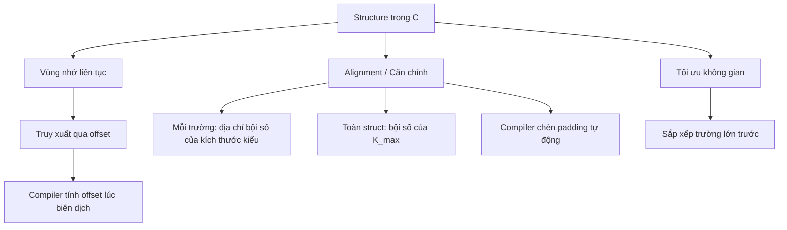

# Bài 10: Mảng và Cấu trúc (Array & Structure) trong C — Biểu diễn ở mức Assembly

---

## 1. Mảng (Array)

### 1.1 Mảng 1 chiều

Mảng trong C là một vùng nhớ liên tục. Phần tử thứ `i` của mảng `int a[]` nằm tại địa chỉ `base + 4*i` (với `int` = 4 bytes trên IA32).

```c
int a[3];  // Chiếm 12 bytes liên tiếp: a[0], a[1], a[2]
```

### 1.2 Mảng 2 chiều (nested) và nhiều chiều

Mảng 2 chiều trong C được lưu theo **row-major order** — tức là các hàng được lưu liên tiếp nhau trong bộ nhớ.

---

## 2. Cấu trúc (Structure)

### 2.1 Cấp phát Structure

```c
struct rec {
    int a[3];      // offset 0
    int i;         // offset 12
    struct rec *n; // offset 16
};
```

**Ý tưởng cơ bản:**

- Structure là một **vùng nhớ liên tục** được cấp phát.
- Các thành phần được tham chiếu bằng **tên** trong C, nhưng ở mức máy chỉ là **offset** (khoảng cách từ địa chỉ đầu).
- Các thành phần **có thể khác kiểu dữ liệu**.
- Các trường được sắp xếp **theo đúng thứ tự định nghĩa** trong source code — dù có cách sắp xếp khác tiết kiệm bộ nhớ hơn.
- **Compiler** quyết định kích thước tổng và vị trí từng trường.
- Chương trình ở mức máy **không biết** về khái niệm "structure" — chỉ thấy địa chỉ và offset.

**Memory layout (IA32):**

```
| a[0] | a[1] | a[2] |  i   |    n     |
  0      4      8     12     16        20
```

---

### 2.2 Truy xuất Structure

Truy xuất thành phần dựa trên:
- **Con trỏ** xác định địa chỉ bắt đầu của structure.
- **Offset** từ địa chỉ đó đến thành phần cần truy cập.

```c
void set_i(struct rec *r, int val) {
    r->i = val;
}
```

```asm
# %edx = val, %eax = r
movl %edx, 12(%eax)    # Mem[r+12] = val  (i nằm ở offset 12)
```

> **Giải thích:** `r->i` tương đương với `*(r + 12)` ở mức bộ nhớ. Compiler đã tính sẵn offset = 12 lúc biên dịch.

---

### 2.3 Con trỏ đến thành phần Structure

#### Trường hợp 1: `a` đứng trước `i`

```c
struct rec { int a[3]; int i; struct rec *n; };

int *get_ap(struct rec *r, int idx) {
    return &r->a[idx];
}
```

`a` bắt đầu tại offset **0** → địa chỉ `a[idx]` = `r + 4*idx`

```asm
movl  12(%ebp), %eax   # lấy idx
sall  $2, %eax         # idx * 4
addl  8(%ebp), %eax    # r + idx*4
```

#### Trường hợp 2: `i` đứng trước `a`

```c
struct rec { int i; int a[3]; struct rec *n; };
```

`a` bắt đầu tại offset **4** → địa chỉ `a[idx]` = `r + 4 + 4*idx`

```asm
movl  8(%ebp), %ebx    # lấy r
leal  4(%ebx), %esi    # r + 4
movl  12(%ebp), %edi   # lấy idx
sall  $2, %edi         # 4 * idx
leal  (%edi,%esi), %eax  # r + 4 + 4*idx
```

---

### 2.4 Ví dụ: Truy xuất Structure với nhiều kiểu dữ liệu

```c
struct example {
    int b;       // offset 0
    double p;    // offset 4
    short a[4];  // offset 12
    char* c;     // offset 20
};
```

| Trường | Offset | Ghi chú |
|--------|--------|---------|
| `b` | 0 | `int` 4 bytes |
| `p` | 4 | `double` 8 bytes |
| `a[i]` | 12 + 2\*i | `short` 2 bytes mỗi phần tử |
| `c` | 20 | con trỏ 4 bytes (IA32) |

---

### 2.5 Ví dụ: Duyệt Danh sách liên kết

```c
struct rec { int a[3]; int i; struct rec *n; };
// Layout: a(0), i(12), n(16)

void set_val(struct rec *r, int val) {
    while (r) {
        int i = r->i;
        r->a[i] = val;
        r = r->n;
    }
}
```

```asm
# r = %edx, val = %ecx
.L17:
    movl  12(%edx), %eax        # eax = r->i        (i ở offset 12)
    movl  %ecx, (%edx,%eax,4)   # r->a[i] = val     (a ở offset 0, phần tử i)
    movl  16(%edx), %edx        # r = r->n           (n ở offset 16)
    testl %edx, %edx            # kiểm tra r != NULL
    jne   .L17                  # nếu khác 0 thì lặp
```

Nếu đổi thứ tự `i` lên trước `a`:

```c
struct rec { int i; int a[3]; struct rec *n; };
// Layout: i(0), a(4), n(16)
```

```asm
.L17:
    movl  (%edx), %eax           # eax = r->i        (i ở offset 0)
    movl  %ecx, 4(%edx,%eax,4)   # r->a[i] = val     (a ở offset 4)
    movl  16(%edx), %edx         # r = r->n
    testl %edx, %edx
    jne   .L17
```

---

## 3. Structure Alignment (Căn chỉnh bộ nhớ)

### 3.1 Tại sao cần Alignment?

Bộ nhớ được truy xuất theo từng **khối 4 hoặc 8 byte** tuỳ hệ thống. Nếu dữ liệu không được căn chỉnh, CPU có thể cần **2 lần đọc** để lấy 1 giá trị → **chậm hơn** và phức tạp hơn.

```
Dữ liệu KHÔNG căn chỉnh:
| c | i[0]... | ...i[0] | i[1]... |
  p   p+1       p+5       p+9      (vấn đề: i[0] trải qua 2 block)

Dữ liệu ĐÃ căn chỉnh:
| c |  3 bytes trống  | i[0] | i[1] |     v      |
  p        p+1~3        p+4    p+8     p+16
```

### 3.2 Quy tắc căn chỉnh

**IA32:**

| Kiểu dữ liệu | Kích thước | Yêu cầu địa chỉ |
|---|---|---|
| `char` | 1 byte | Không ràng buộc |
| `short` | 2 bytes | Địa chỉ chẵn (bit 0 = 0) |
| `int`, `float`, `char*` | 4 bytes | Chia hết cho 4 (2 bit thấp = 00) |
| `double` (Windows/x86_64) | 8 bytes | Chia hết cho 8 (3 bit thấp = 000) |
| `double` (Linux IA32) | 8 bytes | Chia hết cho 4 (xử lý như 4-byte) |

**x86-64:**

| Kiểu dữ liệu | Kích thước | Yêu cầu địa chỉ |
|---|---|---|
| `char` | 1 byte | Không ràng buộc |
| `short` | 2 bytes | Chia hết cho 2 |
| `int`, `float` | 4 bytes | Chia hết cho 4 |
| `double`, `long`, `char*` | 8 bytes | Chia hết cho 8 |
| `long double` (GCC Linux) | 16 bytes | Chia hết cho 16 |

---

### 3.3 Căn chỉnh bên trong Structure

**Quy tắc:**
1. Mỗi trường phải nằm tại địa chỉ thoả mãn yêu cầu căn chỉnh của **kiểu dữ liệu của nó**.
2. Toàn bộ structure phải có địa chỉ bắt đầu và **kích thước** là bội số của **K** — với K là yêu cầu căn chỉnh lớn nhất trong structure.
3. Compiler tự động **chèn padding bytes** (byte trống) để đảm bảo điều này.

```c
struct S1 {
    char c;      // 1 byte, offset 0
    int i[2];    // 4 bytes x2, cần offset chia hết cho 4 → offset 4 (chèn 3 byte trống)
    double v;    // 8 bytes, cần offset chia hết cho 8 → offset 16 (chèn 4 byte từ sau i[1])
};
```

```
| c | _ _ _ | i[0] | i[1] | _ _ _ _ | v (8 bytes) |
  0    1~3     4      8      12~15     16            24
         K = 8 (do double), tổng kích thước = 24 (bội số của 8) ✓
```

---

### 3.4 Ví dụ tính kích thước Structure

```c
struct example {
    int b;       // 4 bytes
    float d;     // 4 bytes
    double p;    // 8 bytes
    short a[4];  // 2*4 = 8 bytes
    char c;      // 1 byte
};
```

**Phân tích layout (64-bit, K = 8 vì có `double`):**

```
| b(4) | d(4) | p(8 bytes) | a[0]~a[3] (8 bytes) | c(1) | padding(7) |
  0      4      8             16                    24     25          32
```

| Trường | Offset | Kích thước |
|--------|--------|------------|
| `b` | 0 | 4 |
| `d` | 4 | 4 |
| `p` | 8 | 8 |
| `a[i]` | 16 + 2\*i | 2 mỗi phần tử |
| `c` | 24 | 1 |
| *(padding)* | 25~31 | 7 |

**Tổng kích thước = 32** (bội số của K=8 ✓)

> **Câu hỏi: Tại sao cần 7 byte padding cuối?**
> Vì sau `c` (offset 24), tổng mới chỉ là 25 byte. Để kích thước structure là bội số của K=8, phải làm tròn lên 32. Điều này đảm bảo khi tạo mảng `struct example arr[N]`, mỗi phần tử tiếp theo vẫn được căn chỉnh đúng.

---

### 3.5 Ví dụ: Sự khác biệt giữa Windows/x86-64 và IA32 Linux

```c
struct S1 { char c; int i[2]; double v; } *p;
```

**x86-64 / Windows IA32 (K=8):**
```
c | ___ | i[0] | i[1] | ____ | v
0   1~3   4      8      12~15  16    → tổng 24
```

**IA32 Linux (K=4, double xử lý như 4-byte):**
```
c | ___ | i[0] | i[1] | v (8 bytes)
0   1~3   4      8      12           → tổng 20
```

---

### 3.6 Đảm bảo căn chỉnh khi kích thước không đủ bội số K

```c
struct S2 {
    double v;   // offset 0, 8 bytes
    int i[2];   // offset 8, 8 bytes
    char c;     // offset 16, 1 byte
};
```

Sau `c` (offset 16), tổng = 17 bytes. Phải làm tròn lên **24** (bội số của K=8) → thêm **7 byte padding** cuối.

```
| v (8) | i[0] | i[1] | c | _______ |
  0       8      12    16   17~23
                                    = 24 bytes tổng
```

---

## 4. Alignment trong Mảng Structure

Khi tạo mảng các structure, kích thước của mỗi structure (bao gồm cả padding) đảm bảo phần tử tiếp theo cũng được căn chỉnh đúng.

```c
struct S2 { double v; int i[2]; char c; } a[10];
```

```
a[0]        a[1]        a[2]
[v|i0|i1|c|pad] [v|i0|i1|c|pad] ...
a+0         a+24        a+48
```

Mỗi phần tử chiếm **24 bytes** (kể cả padding) → `a[idx]` ở địa chỉ `a + 24*idx`.

---

## 5. Truy xuất phần tử mảng Structure

```c
struct S3 { short i; float v; short j; } a[10];

short get_j(int idx) {
    return a[idx].j;
}
```

**Layout của S3:**
```
| i(2) | _(2) | v(4) | j(2) | _(2) |  → sizeof(S3) = 12
  0      2      4      8      10
```

- Offset của `j` trong S3 = **8**
- Địa chỉ `a[idx].j` = `a + 12*idx + 8`

```asm
# %eax = idx
leal  (%eax,%eax,2), %eax   # eax = 3*idx
movswl a+8(,%eax,4), %eax   # load a[idx].j = a + 8 + 4*(3*idx) = a + 8 + 12*idx
```

> `leal (%eax,%eax,2)` tính `eax + eax*2 = 3*idx`, sau đó `4*(3*idx) = 12*idx`.

---

## 6. Tiết kiệm không gian — Sắp xếp trường hợp lý

**Nguyên tắc: Khai báo các trường có kiểu dữ liệu lớn trước.**

```c
// Cách kém: 12 bytes
struct S4 { char c; int i; char d; };
// c(0) | pad(3) | i(4) | d(8) | pad(3) = 12 bytes

// Cách tốt: 8 bytes
struct S5 { int i; char c; char d; };
// i(0) | c(4) | d(5) | pad(2) = 8 bytes
```

---

## 7. Bài tập có lời giải

### Bài tập 1

```c
struct {
    char  *a;   // Windows 32-bit: con trỏ = 4 bytes
    short  b;   // 2 bytes
    double c;   // 8 bytes
    char   d;   // 1 byte
    float  e;   // 4 bytes
    void  *f;   // 4 bytes
} foo;
```

**Yêu cầu: Windows 32-bit, có alignment.**

**Phân tích từng trường:**

| Trường | Kiểu | Kích thước | Alignment | Offset | Padding trước |
|--------|------|-----------|-----------|--------|---------------|
| `a` | `char*` | 4 | 4 | 0 | 0 |
| `b` | `short` | 2 | 2 | 4 | 0 |
| `c` | `double` | 8 | 8 | 8 (cần bội 8, sau b=6 → pad 2) | 2 |
| `d` | `char` | 1 | 1 | 16 | 0 |
| `e` | `float` | 4 | 4 | 20 (sau d=17 → pad 3) | 3 |
| `f` | `void*` | 4 | 4 | 24 | 0 |

Tổng sau `f` = 28. K = 8 (do `double`). Phải làm tròn lên **32**. Thêm 4 byte padding cuối.

**Tổng kích thước = 32 bytes.**

```
| a(4) | b(2) | __(2) | c(8) | d(1) | ___(3) | e(4) | f(4) | ____(4) |
  0      4      6       8      16     17        20     24     28        32
```

**Câu c: Sắp xếp lại để tiết kiệm:**

```c
struct {
    double c;   // 8 bytes, offset 0
    char  *a;   // 4 bytes, offset 8
    float  e;   // 4 bytes, offset 12
    void  *f;   // 4 bytes, offset 16
    short  b;   // 2 bytes, offset 20
    char   d;   // 1 byte,  offset 22
                // padding 1 byte → offset 23, tổng = 24
} new_foo;
```

**Tổng kích thước = 24 bytes** (tiết kiệm 8 bytes so với bản gốc).

---

## Tổng kết



> **Lưu ý quan trọng:** Khi làm việc với structure trong lập trình hệ thống, embedded, hoặc network protocol, việc hiểu alignment giúp bạn tránh lỗi truy xuất bộ nhớ, tối ưu kích thước dữ liệu, và dự đoán đúng layout khi đọc/ghi binary data.
