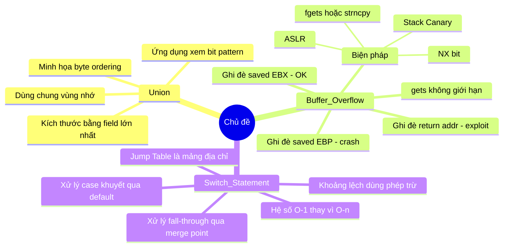

# Bài 11: Union, Buffer Overflow & Switch

---

## 1. Union

### 1.1 Cấp phát bộ nhớ của Union

`union` trong C khác với `struct` ở chỗ **tất cả các thành viên dùng chung một vùng nhớ**. Kích thước của union được xác định bởi **thành viên lớn nhất**.

```c
union U1 {
    char c;       // 1 byte
    int i[2];     // 8 bytes
    double v;     // 8 bytes
} *up;
```

> **Kích thước của `U1` = 8 bytes** (bằng kích thước của `double` hoặc `int[2]`)

So sánh offset giữa `union` và `struct` trên x86-64:

| Trường | Offset trong `U1` | Offset trong `S1` |
|--------|-------------------|-------------------|
| `c`    | 0                 | 0                 |
| `i`    | 0                 | 4                 |
| `v`    | 0                 | 16                |

- Trong `struct`: mỗi trường có **offset riêng**, không chồng lên nhau.
- Trong `union`: **tất cả offset đều là 0** — mọi trường đều bắt đầu tại cùng một địa chỉ.

!!! warning "Lưu ý quan trọng"
    Tại một thời điểm, chỉ có thể sử dụng **một field** của union. Ghi vào field này sẽ ghi đè dữ liệu của field kia vì chúng dùng chung bộ nhớ.

---

### 1.2 Ứng dụng: Truy xuất Bit Pattern của kiểu dữ liệu

Một ứng dụng thực tế của `union` là **xem lại bit pattern** của một giá trị dưới dạng kiểu dữ liệu khác mà không cần ép kiểu (cast).

```c
typedef union {
    float f;
    unsigned u;
} bit_float_t;

// Xem bit pattern của unsigned như thể nó là float
float bit2float(unsigned u) {
    bit_float_t arg;
    arg.u = u;
    return arg.f;  // Đọc lại cùng 4 bytes dưới dạng float
}

// Xem bit pattern của float như thể nó là unsigned
unsigned float2bit(float f) {
    bit_float_t arg;
    arg.f = f;
    return arg.u;  // Đọc lại cùng 4 bytes dưới dạng unsigned
}
```

??? question "Câu hỏi: Có giống `(float) u` không?"
    **Không.** Phép ép kiểu `(float) u` sẽ **chuyển đổi giá trị** (ví dụ: `u = 5` → `f = 5.0f`), còn `bit2float` **giữ nguyên bit pattern** — 4 bytes đó được đọc lại dưới dạng `float` mà không thay đổi bất kỳ bit nào. Đây là kỹ thuật thường dùng trong lập trình nhúng, đồ họa (IEEE 754).

---

### 1.3 Byte Ordering (Thứ tự byte)

Khi lưu một giá trị nhiều byte (short, int, long...) vào bộ nhớ, có hai quy ước:

- **Big Endian**: Byte có **trọng số cao nhất** được lưu tại địa chỉ **thấp nhất**. (VD: SPARC)
- **Little Endian**: Byte có **trọng số thấp nhất** được lưu tại địa chỉ **thấp nhất**. (VD: Intel x86, x86-64, ARM Android/iOS)

Union cho phép quan sát rõ hiện tượng này:

```c
union {
    unsigned char  c[8];
    unsigned short s[4];
    unsigned int   i[2];
    unsigned long  l[1];
} dw;

// Gán giá trị
int j;
for (j = 0; j < 8; j++)
    dw.c[j] = 0xf0 + j;
// c[0]=0xf0, c[1]=0xf1, ..., c[7]=0xf7
```

**Output trên Little Endian (IA32 / x86-64):**

```
Characters 0-7 == [0xf0, 0xf1, 0xf2, 0xf3, 0xf4, 0xf5, 0xf6, 0xf7]
Shorts     0-3 == [0xf1f0, 0xf3f2, 0xf5f4, 0xf7f6]
Ints       0-1 == [0xf3f2f1f0, 0xf7f6f5f4]
Long       0   == [0xf7f6f5f4f3f2f1f0]   // trên x86-64 (long = 8 bytes)
```

**Output trên Big Endian (Sun/SPARC):**

```
Characters 0-7 == [0xf0, 0xf1, 0xf2, 0xf3, 0xf4, 0xf5, 0xf6, 0xf7]
Shorts     0-3 == [0xf0f1, 0xf2f3, 0xf4f5, 0xf6f7]
Ints       0-1 == [0xf0f1f2f3, 0xf4f5f6f7]
Long       0   == [0xf0f1f2f3]
```

!!! info "Giải thích"
    Với Little Endian, `s[0]` đọc 2 bytes tại địa chỉ thấp nhất là `c[0]=0xf0` và `c[1]=0xf1`. Vì byte thấp (`0xf0`) nằm ở địa chỉ thấp hơn, giá trị short là `0xf1f0` (f1 là byte cao, f0 là byte thấp). Với Big Endian thì ngược lại: `s[0] = 0xf0f1`.

---

## 2. Buffer Overflow

### 2.1 Ví dụ minh họa lỗi truy xuất bộ nhớ ngoài phạm vi

```c
typedef struct {
    int a[2];
    double d;
} struct_t;

double fun(int i) {
    volatile struct_t s;
    s.d = 3.14;
    s.a[i] = 1073741824; /* 0x40000000 */
    return s.d;
}
```

Kết quả thực tế khi gọi với các giá trị `i` khác nhau:

| Lệnh gọi | Kết quả |
|---|---|
| `fun(0)` | `3.14` (ghi vào `a[0]` — hợp lệ) |
| `fun(1)` | `3.14` (ghi vào `a[1]` — hợp lệ) |
| `fun(2)` | `3.1399998664856` (ghi vào byte thấp của `d`) |
| `fun(3)` | `2.00000061035156` (ghi vào byte cao của `d`) |
| `fun(4)` | `3.14` (ghi vào vùng nằm ngoài struct, tình cờ không ảnh hưởng) |
| `fun(6)` | Segmentation Fault |

**Giải thích layout bộ nhớ trên stack** (địa chỉ tăng dần):

```
Index  | Nội dung
-------|--------------------
  0    | a[0]
  1    | a[1]
  2    | d (4 bytes thấp)
  3    | d (4 bytes cao)
  4    | ?
  5    | ?
  6    | Critical State (saved return address / frame pointer)
```

Khi `i = 2` hoặc `i = 3`, ta ghi đè vào các byte của `double d` → giá trị `d` bị thay đổi. Khi `i = 6`, ta ghi đè lên vùng nhớ quan trọng của stack → chương trình crash.

---

### 2.2 Buffer Overflow là gì?

!!! danger "Định nghĩa"
    **Buffer Overflow** xảy ra khi chương trình ghi dữ liệu **vượt quá kích thước bộ nhớ đã cấp phát** cho một mảng/buffer.

Đây là **nguyên nhân kỹ thuật số 1** gây ra lỗ hổng bảo mật trong phần mềm. Dạng phổ biến nhất là **không kiểm tra kích thước chuỗi input** từ người dùng, đặc biệt khi buffer nằm trên stack — gọi là **stack smashing**.

---

### 2.3 Hàm `gets()` — Nguồn gốc của vấn đề

```c
char *gets(char *dest) {
    int c = getchar();
    char *p = dest;
    while (c != EOF && c != '\n') {
        *p++ = c;      // Ghi không giới hạn!
        c = getchar();
    }
    *p = '\0';
    return dest;
}
```

!!! danger "Nguy hiểm"
    `gets()` **không có cơ chế giới hạn** số ký tự đọc vào. Nếu người dùng nhập nhiều ký tự hơn kích thước buffer, dữ liệu sẽ tràn sang vùng nhớ kề bên.

Các hàm có vấn đề tương tự: `strcpy`, `strcat`, `scanf` với `%s`.

---

### 2.4 Ví dụ code có lỗ hổng

```c
void echo() {
    char buf[4];  // Buffer chỉ 4 bytes — quá nhỏ!
    gets(buf);    // Không kiểm tra độ dài input
    puts(buf);
}

void call_echo() {
    echo();
}
```

Chạy thực tế:

```
unix> ./bufdemo
Type a string: 1234567
1234567                  ← OK (7 ký tự + null = 8 bytes, tràn qua saved %ebx)

unix> ./bufdemo
Type a string: 12345678
Segmentation Fault       ← Ghi đè saved %ebp

unix> ./bufdemo
Type a string: 123456789ABC
Segmentation Fault       ← Ghi đè return address
```

---

### 2.5 Phân tích Stack Frame khi xảy ra Buffer Overflow

Layout stack của hàm `echo()` trên IA32 (địa chỉ tăng dần lên trên):

```
+------------------+  ← %ebp + 4  : Return Address (địa chỉ quay về call_echo)
+------------------+  ← %ebp      : Saved %ebp
+------------------+  ← %ebp - 4  : Saved %ebx
+------------------+
|   buf[3..0]      |  ← %ebp - 8  : 4 bytes buffer
+------------------+
```

Assembly của `echo()`:

```asm
echo:
    pushl %ebp              ; Lưu frame pointer cũ
    movl  %esp, %ebp        ; Thiết lập frame pointer mới
    pushl %ebx              ; Lưu %ebx
    subl  $20, %esp         ; Cấp phát 20 bytes trên stack
    leal  -8(%ebp), %ebx    ; ebx = địa chỉ của buf (ebp - 8)
    movl  %ebx, (%esp)      ; Truyền buf làm tham số cho gets
    call  gets
    ...
```

**Ví dụ #1 — Input: `1234567` (7 ký tự)**

```
Trước gets:          Sau gets:
[08 04 85 f0]  ← Return Addr    [08 04 85 f0]  ← không đổi
[ff ff d6 88]  ← Saved %ebp     [ff ff d6 88]  ← không đổi
[xx xx xx xx]  ← Saved %ebx     [00 37 36 35]  ← bị ghi đè (nhưng OK)
[xx xx xx xx]  ← buf            [34 33 32 31]  ← "1234"
```

Saved `%ebx` bị ghi đè nhưng chương trình không crash vì `%ebx` được phục hồi từ stack rồi dùng sau — giá trị đã hỏng nhưng không gây lỗi nghiêm trọng ở đây.

**Ví dụ #2 — Input: `12345678` (8 ký tự)**

Byte `0x38` ('8') ghi vào byte cuối của Saved `%ebp`, phá hỏng frame pointer. Khi hàm `echo` trả về và `call_echo` thực thi lệnh `leave` (dùng `%ebp` để khôi phục `%esp`), con trỏ stack trỏ đến vùng địa chỉ sai → **Segmentation Fault**.

**Ví dụ #3 — Input: `123456789ABC` (12 ký tự)**

Các ký tự `9ABC` ghi đè lên **Return Address**. Khi `ret` được thực thi, CPU nhảy đến địa chỉ `0x43424139` (tức `"9ABC"` ở little endian) — một địa chỉ không hợp lệ → **Segmentation Fault**.

---

### 2.6 Khai thác Buffer Overflow để tấn công

Kẻ tấn công không chỉ crash chương trình — họ có thể **thực thi code tùy ý**:

```
+------------------------+  ← foo stack frame
|  return address A      |  ← bị ghi đè thành địa chỉ B
+------------------------+  ← bar stack frame
|  saved registers...    |
+------------------------+
|  buf[64]               |  ← B: chứa exploit code
|  [exploit code]        |     (là machine code thực sự)
|  [padding]             |
|  [địa chỉ B]           |  ← ghi đè return address
+------------------------+
```

```c
int bar() {
    char buf[64];
    gets(buf);  // Nhập exploit code + padding + địa chỉ B
    return ...;
}
```

Khi `bar()` thực hiện lệnh `ret`:
1. CPU lấy return address từ stack → nhận được **địa chỉ B** (địa chỉ của `buf`)
2. CPU nhảy đến `buf` và **thực thi exploit code** nằm trong đó

Exploit code thường là **shellcode** — mở một root shell hoặc kết nối ngược về máy attacker.

---

### 2.7 Các cuộc tấn công thực tế

**Internet Worm (Morris Worm, 1988):** Khai thác hàm `gets()` trong `fingerd` server. Attacker gửi:
```
finger "exploit-code + padding + new-return-address"@victim
```
Exploit code mở một root shell với kết nối TCP về máy attacker.

**IM War (AOL vs Microsoft):** AOL khai thác buffer overflow trong chính AIM client của mình để kiểm tra signature 4 bytes, ngăn Microsoft Instant Messenger kết nối vào mạng AIM.

---

### 2.8 Các biện pháp phòng chống

#### Cấp độ lập trình: Dùng hàm có giới hạn độ dài

```c
// THAY THẾ gets() → fgets()
void echo() {
    char buf[4];
    fgets(buf, 4, stdin);  // Chỉ đọc tối đa 3 ký tự + null
    puts(buf);
}

// THAY THẾ strcpy → strncpy
strncpy(dest, src, n);

// THAY THẾ scanf("%s") → scanf("%3s") hoặc fgets
```

#### Cấp độ hệ thống: ASLR (Address Space Layout Randomization)

Mỗi lần chạy chương trình, stack được đặt tại một **địa chỉ ngẫu nhiên**:

```
(gdb) run → $ebp = 0xffffc638
(gdb) run → $ebp = 0xffffbb08
(gdb) run → $ebp = 0xffffc6a8
```

Điều này khiến attacker không thể đoán chính xác địa chỉ của `buf` để ghi vào return address.

#### Cấp độ hệ thống: Non-Executable Stack (NX bit)

- Trên x86-64, OS đánh dấu vùng stack là **không có quyền thực thi** (`no-execute`).
- Dù attacker ghi exploit code vào stack, CPU sẽ từ chối thực thi → exception.

#### Cấp độ compiler: Stack Canary

**Ý tưởng:** Đặt một giá trị bí mật (canary) giữa buffer và return address. Trước khi hàm trả về, kiểm tra canary có bị thay đổi không.

```asm
; Thiết lập canary khi vào hàm:
movl %gs:20, %eax      ; Lấy giá trị canary từ thread-local storage
movl %eax, -8(%ebp)    ; Đặt lên stack (giữa buf và saved %ebp)
xorl %eax, %eax        ; Xóa canary khỏi register (bảo mật)

; Kiểm tra canary trước khi return:
movl -8(%ebp), %eax    ; Đọc canary từ stack
xorl %gs:20, %eax      ; So sánh với giá trị gốc
je   .L24              ; Nếu khớp → an toàn, tiếp tục
call __stack_chk_fail  ; Nếu khác → báo lỗi, thoát ngay
```

Kích hoạt trong GCC:

```bash
gcc -fstack-protector     # Bảo vệ các hàm có buffer trên stack
gcc -fstack-protector-all # Bảo vệ tất cả các hàm
```

```
unix> ./bufdemo-protected
Type a string: 1234    → 1234  (OK)

unix> ./bufdemo-protected
Type a string: 12345   → *** stack smashing detected ***
```

??? question "Câu hỏi: Stack Canary có luôn an toàn không?"
    **Không hoàn toàn.** Nếu attacker có thể **đọc** giá trị canary trước (ví dụ qua lỗ hổng format string hoặc out-of-bounds read), họ có thể ghi đè buffer với canary đúng rồi tiếp tục ghi đè return address mà không bị phát hiện.
    
    Ví dụ từ bài giảng: Input `1234` (4 ký tự) tình cờ có byte `00` ở cuối do null terminator, và canary là `0x03e37d00` — byte thấp nhất là `0x00`. Vì `gets` ghi null terminator đúng vào byte đầu của canary, giá trị canary vẫn khớp! Đây là trường hợp may mắn, nhưng cho thấy canary không phải bảo vệ tuyệt đối.
    
    Biện pháp bổ sung: kết hợp ASLR + NX bit + Canary để tạo nhiều lớp bảo vệ.

---

## 3. Switch Statement trong Assembly

### 3.1 Vấn đề với If-Else thuần túy

Xét đoạn switch sau:

```c
int switch_eg(int x, int y, int z) {
    int w = 1;
    switch(x) {
        case 1: w = y*z;  break;
        case 2: w = y/z;  /* Fall Through */
        case 3: w += z;   break;
        case 5:
        case 6: w -= z;   break;
        default: w = 2;
    }
    return w;
}
```

Nếu dùng if-else, với **n case** ta cần **n lần so sánh** — độ phức tạp O(n). Với switch có nhiều case, đây là lãng phí.

**Tương tự thực tế:** Như kiểm soát vé rạp chiếu phim:
- **Giải pháp 1 (if-else):** Người xem đến từng rạp hỏi → tệ nhất hỏi hết n rạp.
- **Giải pháp 2 (jump table):** Có bảng ánh xạ phim→rạp tại cổng → tra bảng **1 lần**, vào thẳng đúng rạp.

---

### 3.2 Jump Table — Cơ chế hoạt động

Compiler tạo ra một **mảng địa chỉ** (jump table), mỗi phần tử là địa chỉ của block code tương ứng với một case value.

```
Jump Table (mảng địa chỉ):
JTab[0] → .L2 (default)
JTab[1] → .L3 (case 1)
JTab[2] → .L4 (case 2)
JTab[3] → .L5 (case 3)
JTab[4] → .L2 (default — case 4 bị khuyết)
JTab[5] → .L6 (case 5)
JTab[6] → .L6 (case 6 — dùng chung với case 5)
```

Logic thực thi (Extended C):

```c
// Thay vì:
if (x == 1) goto .L3;
else if (x == 2) goto .L4;
...

// Compiler sinh ra:
if (x > 6) goto .L2;       // Kiểm tra ngoài phạm vi → default
goto *JTab[x];              // Nhảy trực tiếp — O(1)!
```

---

### 3.3 Assembly của Switch (IA32)

```asm
switch_eg:
    movl  8(%ebp), %eax     ; %eax = x
    cmpl  $6, %eax          ; So sánh x với 6
    ja    .L2               ; Nếu x > 6 (unsigned) → default
    jmp   *.L7(,%eax,4)     ; Nhảy đến JTab[x] (mỗi entry 4 bytes)
```

```asm
; Jump table (trong section .rodata)
.section .rodata
.align 4
.L7:
    .long .L2   ; x = 0 → default
    .long .L3   ; x = 1
    .long .L4   ; x = 2
    .long .L5   ; x = 3
    .long .L2   ; x = 4 → default (case bị khuyết)
    .long .L6   ; x = 5
    .long .L6   ; x = 6 (case 5 và 6 cùng code)
```

!!! info "Giải thích lệnh `jmp *.L7(,%eax,4)`"
    - `.L7` = địa chỉ nền của jump table
    - `%eax` = giá trị x (dùng làm index)
    - `4` = hệ số nhân (mỗi địa chỉ IA32 = 4 bytes)
    - Tính địa chỉ: `JTab + x * 4` → đọc nội dung ô đó (một địa chỉ) → nhảy đến đó (`*` = indirect)

Trên x86-64, địa chỉ là 8 bytes nên dùng `.quad` và hệ số nhân là 8:

```asm
.section .rodata
.align 8
.L7:
    .quad .L2   ; x = 0
    .quad .L3   ; x = 1
    ...
```

---

### 3.4 Các Code Blocks

```asm
.L2:          ; Default (x = 0 hoặc x = 4 hoặc x > 6)
    movl $2, %eax        ; w = 2
    jmp  .L8             ; goto done

.L3:          ; case 1
    movl 16(%ebp), %eax  ; z
    imull 12(%ebp), %eax ; w = y * z
    jmp  .L8             ; goto done

.L5:          ; case 3
    movl $1, %eax        ; w = 1 (giá trị khởi tạo)
    jmp  .L9             ; goto merge (dùng chung với case 2)

.L4:          ; case 2
    movl 12(%ebp), %edx  ; y
    movl %edx, %eax
    sarl $31, %edx       ; sign extend
    idivl 16(%ebp)       ; w = y / z
.L9:          ; merge (fall-through từ case 2 sang case 3)
    addl 16(%ebp), %eax  ; w += z
    jmp  .L8             ; goto done

.L6:          ; case 5 và case 6
    movl $1, %eax        ; w = 1
    subl 16(%ebp), %eax  ; w = 1 - z  (tức w -= z khi w ban đầu = 1)

.L8:          ; done
    popl %ebp
    ret
```

---

### 3.5 Xử lý Fall-Through

```c
case 2:
    w = y/z;
    /* Fall Through */
case 3:
    w += z;
    break;
```

Compiler dịch fall-through bằng cách cho **case 3 nhảy đến điểm merge** (bỏ qua phép chia), còn **case 2 thực hiện phép chia rồi tiếp tục tại điểm merge**:

```asm
; case 3 (không fall-through từ đâu vào):
.L5:
    movl $1, %eax    ; w = 1 (giá trị ban đầu)
    jmp  .L9         ; nhảy đến merge

; case 2:
.L4:
    ... idivl ...    ; w = y/z
; tiếp tục luôn vào .L9 (không jmp):
.L9:
    addl ..., %eax   ; w += z
```

---

### 3.6 Switch với khoảng giá trị lệch

??? question "Câu hỏi: Nếu x trong khoảng 10–14, jump table có bao nhiêu entry?"
    **Không cần 15 entry (0 đến 14).** Compiler sẽ **trừ đi giá trị nhỏ nhất** để đưa về khoảng [0, 4], chỉ cần **5 entry**.
    
    ```asm
    subl $10, %eax    ; x = x - 10 → khoảng [0, 4]
    cmpl $4, %eax     ; so sánh với 4
    ja   .L2          ; nếu > 4 → default
    jmp  *.L4(,%eax,4)
    ```

??? question "Câu hỏi: Tìm các case trong switch từ assembly sau"
    ```asm
    movl 8(%ebp), %eax   ; x
    addl $2, %eax        ; index = x + 2
    cmpl $6, %eax        ; so sánh index với 6
    ja   .L2             ; nếu index > 6 → default
    jmp  *.L8(,%eax,4)   ; nhảy đến JTab[index]
    ```
    Jump table có 7 entry (index 0..6), nhưng index=1 trỏ đến `.L2` (default) → **index 1 là case bị khuyết**.
    
    - Các index hợp lệ: 0, 2, 3, 4, 5, 6
    - Vì `index = x + 2` → `x = index - 2`
    - Các case của x: **-2, 0, 1, 2, 3, 4**
    
    ```c
    switch(x) {
        case -2: ...
        case  0: ...
        case  1: ...
        case  2: ...
        case  3: ...
        case  4: ...
        default: ...
    }
    ```

---

### 3.7 Bài tập: Dịch ngược Assembly về C

```asm
; x at %ebp+12, y at %ebp+16, n at %ebp+8
movl  8(%ebp), %eax      ; n (kiểu int)
movb  %al, -20(%ebp)     ; lưu byte thấp của n → biến char
movl  $0, -4(%ebp)       ; z = 0
movsbl -20(%ebp), %eax   ; đọc lại n dưới dạng char, sign-extend
subl  $42, %eax          ; index = n - 42
cmpl  $7, %eax
ja    .L2                ; nếu index > 7 → default
jmp   *.L4(,%eax,4)      ; nhảy đến JTab[index]
```

Jump table:
```asm
.L4:
    .long .L3   ; index 0 (n = 42)
    .long .L5   ; index 1 (n = 43)
    .long .L2   ; index 2 (n = 44) — default (khuyết)
    .long .L6   ; index 3 (n = 45)
    .long .L2   ; index 4 (n = 46) — default (khuyết)
    .long .L7   ; index 5 (n = 47)
    .long .L8   ; index 6 (n = 48)
    .long .L9   ; index 7 (n = 49)
```

Các block code tương ứng:
- `.L5`: `z = x + y`
- `.L6`: `z = x - y`
- `.L3`: `z = x * y`
- `.L7`: `z = x / y`
- `.L8`: `z = x`
- `.L9`: `z = y`
- `.L2`: `z = 1` (default)

??? success "Đáp án C"
    ```c
    int function(char n, int x, int y) {
        int z = 0;
        switch(n) {
            case 42: z = x * y; break;    // '*'
            case 43: z = x + y; break;    // '+'
            case 45: z = x - y; break;    // '-'
            case 47: z = x / y; break;    // '/'
            case 48: z = x;     break;    // '0'
            case 49: z = y;     break;    // '1'
            default: z = 1;
        }
        return z;
    }
    ```
    Thú vị: các giá trị 42–49 là ASCII codes của `'*'`, `'+'`, `','`, `'-'`, `'.'`, `'/'`, `'0'`, `'1'` — đây là một **máy tính đơn giản** nhận ký tự toán tử!

---

## Tóm tắt


