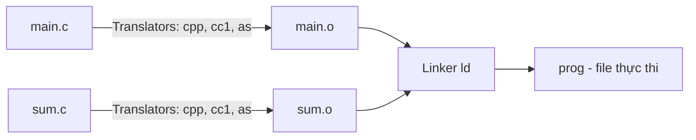
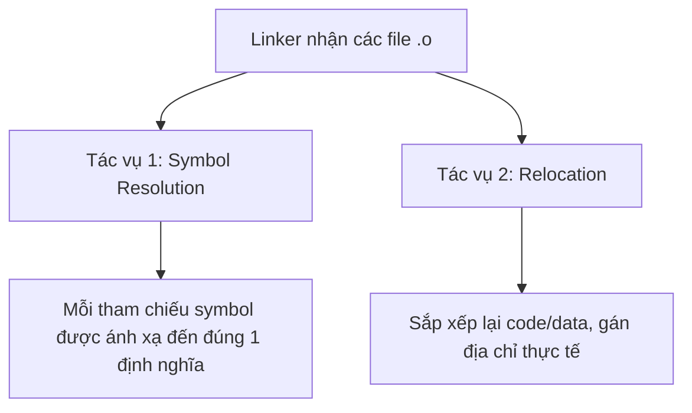
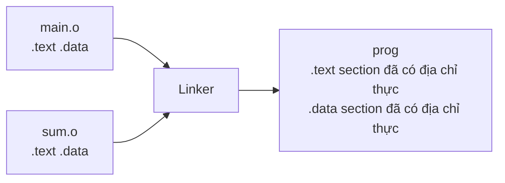
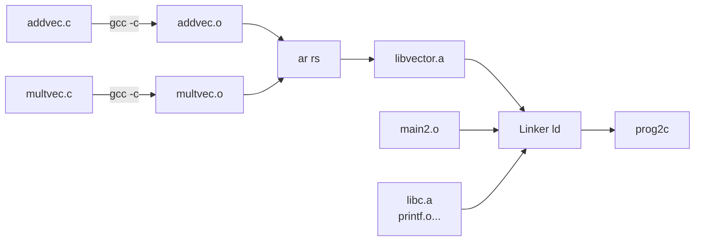
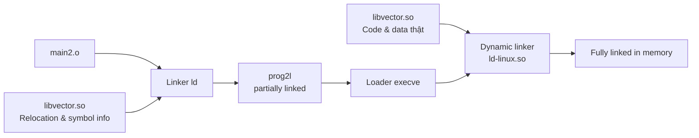

# Bài 12: Linking (Liên Kết)

---

## 1. Tổng quan về Linking

Khi một chương trình C được chia thành nhiều file source (`.c`), **linker** có nhiệm vụ ghép tất cả các file object (`.o`) lại thành một file thực thi duy nhất.

**Ví dụ minh họa:**

```c
// main.c
int sum(int *a, int n);       // khai báo hàm từ file khác
int array[2] = {1, 2};

int main() {
    int val = sum(array, 2);
    return val;
}
```

```c
// sum.c
int sum(int *a, int n) {
    int i, s = 0;
    for (i = 0; i < n; i++) {
        s += a[i];
    }
    return s;
}
```

Lệnh biên dịch và liên kết:

```bash
gcc -o prog main.c sum.c
./prog
```

Quy trình diễn ra như sau:



---

## 2. Ba kiểu Object Files

| Kiểu | Phần mở rộng | Mô tả |
|---|---|---|
| Relocatable object file | `.o` | Chứa code và data có thể kết hợp với các `.o` khác. Mỗi `.o` được tạo từ đúng 1 file `.c` |
| Executable object file | `a.out` | Chứa code và data có thể nạp thẳng vào bộ nhớ và thực thi |
| Shared object file | `.so` | Dạng đặc biệt, có thể tải động vào bộ nhớ tại load-time hoặc run-time. Tương đương DLL trên Windows |

---

## 3. Định dạng ELF (Executable and Linkable Format)

ELF là định dạng nhị phân chuẩn cho tất cả các loại object file trên Linux/Unix. Nó dùng chung cho `.o`, `a.out` và `.so`.

### Cấu trúc một ELF file:

```
┌─────────────────────────┐
│       ELF Header        │  ← word size, byte order, loại file, kiến trúc máy
├─────────────────────────┤
│  Segment header table   │  ← page size, địa chỉ ảo các segment (chỉ cần với executables)
├─────────────────────────┤
│       .text             │  ← Machine code (phần code thực thi)
├─────────────────────────┤
│       .rodata           │  ← Dữ liệu chỉ đọc (jump tables, string literals...)
├─────────────────────────┤
│       .data             │  ← Biến toàn cục đã khởi tạo giá trị
├─────────────────────────┤
│       .bss              │  ← Biến toàn cục chưa khởi tạo (không chiếm không gian file)
├─────────────────────────┤
│       .symtab           │  ← Symbol table (hàm, biến toàn cục, static)
├─────────────────────────┤
│      .rel.text          │  ← Relocation info cho .text
├─────────────────────────┤
│      .rel.data          │  ← Relocation info cho .data
├─────────────────────────┤
│       .debug            │  ← Debug info (khi biên dịch với gcc -g)
├─────────────────────────┤
│  Section header table   │  ← Offset và kích thước từng section
└─────────────────────────┘
```

> **Lưu ý `.bss`:** Section này có header nhưng **không chiếm không gian** trong file. Các biến chưa khởi tạo được hệ điều hành cấp phát và zero-fill khi load vào bộ nhớ. Tên BSS là viết tắt của *"Block Started by Symbol"* hoặc dân gian gọi là *"Better Save Space"*.

---

## 4. Vì sao cần Linker?

### Lý do 1: Tính mô-đun (Modularity)

- Chương trình lớn có thể chia thành nhiều file nhỏ, dễ quản lý.
- Có thể xây dựng thư viện tái sử dụng (math library, C standard library...).
- Mỗi lập trình viên/team có thể làm việc độc lập trên từng module.

### Lý do 2: Tính hiệu quả (Efficiency)

- **Về thời gian:** Khi chỉnh sửa 1 file `.c`, chỉ cần biên dịch lại file đó rồi link lại, không cần biên dịch lại toàn bộ project.
- **Về không gian:** Với thư viện tĩnh, linker chỉ đưa vào file thực thi những hàm **thực sự được dùng**, không phải toàn bộ thư viện.

---

## 5. Linker làm gì? Hai tác vụ chính



---

## 6. Khái niệm Symbol

**Symbol** là các **hàm** hoặc **biến toàn cục** trong chương trình. Mỗi symbol có thể được *định nghĩa* hoặc *tham chiếu*.

```c
void swap() { … }     // định nghĩa symbol swap
swap();               // tham chiếu symbol swap
int *xp = &x;         // định nghĩa symbol xp, tham chiếu symbol x
```

Symbol được lưu trong **symbol table** (section `.symtab`) dưới dạng mảng struct, mỗi entry chứa: tên, kích thước, vị trí của symbol.

> **Quan trọng:** Linker **không biết** đến các biến cục bộ như `i`, `s`, `val` — đó là việc của compiler và stack, không phải linker.

### Ba loại symbol:

| Loại | Mô tả | Ví dụ |
|---|---|---|
| **Global symbol** | Định nghĩa trong module m, các module khác có thể tham chiếu | Hàm không `static`, biến toàn cục không `static` |
| **External symbol** | Được tham chiếu trong module m nhưng định nghĩa ở module khác | Gọi hàm từ file `.c` khác |
| **Local symbol** | Chỉ định nghĩa và dùng trong module m | Hàm và biến toàn cục có từ khóa `static` |

!!! warning "Local linker symbol ≠ biến cục bộ"
    Local linker symbol (được tạo bởi `static`) **khác** với biến cục bộ thông thường trong hàm. Biến cục bộ thông thường được lưu trên stack và linker không quan tâm đến chúng.

---

## 7. Tác vụ 1: Symbol Resolution (Phân giải Symbol)

### Nguyên tắc Strong / Weak

Để xử lý trường hợp nhiều module cùng định nghĩa một symbol trùng tên, linker phân loại:

- **Strong symbol:** Các hàm và biến toàn cục **đã được khởi tạo giá trị**.
- **Weak symbol:** Các biến toàn cục **chưa được khởi tạo**.

```c
// p1.c
int foo = 5;   // STRONG (đã khởi tạo)
void p1() {}   // STRONG (hàm)

// p2.c
int foo;       // WEAK (chưa khởi tạo)
void p2() {}   // STRONG (hàm)
```

### Ba luật phân giải:

!!! danger "Luật 1"
    **Không cho phép nhiều strong symbol trùng tên.** Nếu vi phạm → Linker Error.

!!! info "Luật 2"
    **Nếu có 1 strong và nhiều weak symbol cùng tên** → Chọn strong symbol. Mọi tham chiếu đến weak symbol sẽ trỏ về strong symbol.

!!! warning "Luật 3"
    **Nếu có nhiều weak symbol cùng tên** → Chọn tùy ý một cái. Có thể thay đổi hành vi này bằng `gcc -fno-common`.

### Ví dụ các trường hợp:

```c
// Trường hợp 1 – Lỗi (Rule 1: 2 strong symbol p1)
// p1.c: int x; void p1(){}
// p2.c: int x; void p1(){}   ← LỖI! p1 định nghĩa 2 lần
```

```c
// Trường hợp 2 – Nguy hiểm ngầm (Rule 3)
// p1.c: int x; int y; void p1(){}
// p2.c: double x;    void p2(){}
// → x trong p1.c là int (4 bytes), x trong p2.c là double (8 bytes)
// → Ghi vào x ở p2 có thể tràn sang vùng nhớ của y! RẤT NGUY HIỂM!
```

```c
// Trường hợp 3 – An toàn (Rule 2)
// p1.c: int x=7; int y=5; void p1(){}
// p2.c: double x;         void p2(){}
// → x trong p1 là strong → luôn tham chiếu đến x=7
```

---

### Bài tập 1: Symbol table của swap.o

**Đề bài:**

```c
// main.c
int buf[2] = {1, 2};
int main() {
    swap();
    return 0;
}

// swap.c
extern int buf[];
int *bufp0 = &buf[0];
int *bufp1;
void swap() {
    int temp;
    bufp1 = &buf[1];
    temp = *bufp0;
    *bufp0 = *bufp1;
    *bufp1 = temp;
}
```

**Câu hỏi:** Với từng symbol dưới đây, có trong symbol table của `swap.o` không? Nếu có, thuộc loại gì, định nghĩa ở đâu, nằm trong section nào?

??? success "Đáp án"

    | Symbol | Có trong symtab swap.o? | Loại | Module định nghĩa | Section |
    |---|---|---|---|---|
    | `buf` | Có (tham chiếu) | External | main.o | `.data` |
    | `bufp0` | Có | Global | swap.o | `.data` (đã khởi tạo) |
    | `bufp1` | Có | Global | swap.o | `.bss` (chưa khởi tạo) |
    | `swap` | Có | Global | swap.o | `.text` |
    | `temp` | **Không** | — | — | — (biến cục bộ trên stack) |

---

### Bài tập 2a: Symbol resolution

**Đề bài:**

```c
// Module 1
int main() { ... }

// Module 2
int main;
int p2() { ... }
```

**Câu hỏi:** `REF(main.1) → DEF(?)` và `REF(main.2) → DEF(?)`

??? success "Đáp án"
    - `main` trong Module 1 là **hàm** → **Strong symbol**
    - `main` trong Module 2 là **biến toàn cục chưa khởi tạo** → **Weak symbol**
    - Theo **Luật 2**: 1 strong + 1 weak → chọn strong

    | Tham chiếu | Kết quả |
    |---|---|
    | `REF(main.1)` | `DEF(main.1)` – định nghĩa tại Module 1 |
    | `REF(main.2)` | `DEF(main.1)` – trỏ về Module 1 (strong thắng) |

---

### Bài tập 2b: Symbol resolution

**Đề bài:**

```c
// Module 1
void main() { ... }

// Module 2
int main = 1;
int p2() { ... }
```

??? success "Đáp án"
    - `main` trong Module 1: **hàm** → **Strong**
    - `main` trong Module 2: **biến toàn cục đã khởi tạo** (`= 1`) → **Strong**
    - Theo **Luật 1**: 2 strong symbol trùng tên → **ERROR! Linker error**

    | Tham chiếu | Kết quả |
    |---|---|
    | `REF(main.1)` | **ERROR** |
    | `REF(main.2)` | **ERROR** |

---

## 8. Local Symbol với `static`

```c
int f() {
    static int x = 0;  // local symbol x.1 trong .data
    return x;
}

int g() {
    static int x = 1;  // local symbol x.2 trong .data
    return x;
}
```

Cả hai hàm đều có biến cục bộ `static` tên là `x`. Compiler tự động tạo ra các tên **duy nhất** trong symbol table (ví dụ `x.1832` và `x.1835`) để tránh xung đột, đồng thời cấp phát không gian trong `.data` cho mỗi biến.

> Khác với biến cục bộ thông thường (lưu trên stack), biến `static` tồn tại **suốt vòng đời chương trình** và được lưu trong `.data` hoặc `.bss`.

---

## 9. Tác vụ 2: Relocation (Tái định vị)

Sau khi phân giải symbol, linker cần **gán địa chỉ thực tế** cho tất cả các symbol và instruction. Đây là tác vụ Relocation.



### Ví dụ trước khi relocation (trong `main.o`):

```asm
0000000000000000 <main>:
   0:  48 83 ec 08    sub  $0x8,%rsp
   4:  be 02 00 00 00 mov  $0x2,%esi
   9:  bf 00 00 00 00 mov  $0x0,%edi       # &array = 0x0 (chưa biết!)
                    a: R_X86_64_32 array   # Relocation entry: cần điền địa chỉ array
   e:  e8 00 00 00 00 callq 13 <main+0x13> # sum() = 0x0 (chưa biết!)
                    f: R_X86_64_PC32 sum-0x4 # Relocation entry: cần điền địa chỉ sum
```

### Sau khi relocation (trong `prog`):

```asm
00000000004004d0 <main>:
  4004d0:  48 83 ec 08    sub  $0x8,%rsp
  4004d4:  be 02 00 00 00 mov  $0x2,%esi
  4004d9:  bf 18 10 60 00 mov  $0x601018,%edi  # &array = 0x601018 ✓
  4004de:  e8 05 00 00 00 callq 4004e8 <sum>   # sum() tại 0x4004e8 ✓
  4004e3:  48 83 c4 08    add  $0x8,%rsp
  4004e7:  c3             retq
```

> **PC-relative addressing:** Địa chỉ của `sum()` được tính là: `0x4004e8 = 0x4004e3 + 0x5` — địa chỉ instruction tiếp theo cộng với offset.

---

## 10. Layout của Executable trên bộ nhớ

Khi file thực thi được load vào RAM, hệ điều hành tổ chức bộ nhớ như sau:

```
Địa chỉ cao
┌────────────────────────┐
│    Kernel virtual mem  │  ← Không thể truy cập từ user code
├────────────────────────┤
│    User stack          │  ← Tạo lúc runtime, %rsp trỏ vào đây
│    (tăng xuống dưới)   │
├────────────────────────┤
│    ...                 │
├────────────────────────┤
│  Memory-mapped region  │  ← Shared libraries (.so)
├────────────────────────┤
│    Run-time heap       │  ← malloc/free, tăng lên trên (brk)
├────────────────────────┤
│  Read/write segment    │  ← .data, .bss
├────────────────────────┤
│  Read-only segment     │  ← .init, .text, .rodata  (load từ file)
└────────────────────────┘  ← 0x400000
Địa chỉ thấp
```

---

## 11. Static Libraries (Thư viện tĩnh)

### Vấn đề khi đóng gói hàm thông dụng

- **Lựa chọn 1:** Đặt tất cả hàm vào 1 file `.o` lớn → Lãng phí: mọi chương trình phải link toàn bộ dù chỉ dùng 1 hàm.
- **Lựa chọn 2:** Mỗi hàm 1 file `.o` riêng → Lập trình viên phải tự link từng file, rất cồng kềnh.
- **Giải pháp:** **Static Library** (file `.a` – archive).

### Cách tạo Static Library:

```bash
# Biên dịch từng file thành .o
gcc -c addvec.c multvec.c

# Đóng gói thành archive
ar rs libvector.a addvec.o multvec.o

# Link chương trình với static library
gcc -o prog2c main2.c -L. -lvector
```



### Giải thuật link với static library:

Linker quét các file `.o` và `.a` **theo thứ tự từ trái sang phải** trong command:

1. Duy trì danh sách các tham chiếu chưa phân giải.
2. Với mỗi file `.o` hoặc `.a` mới, cố gắng phân giải các tham chiếu còn tồn đọng.
3. Sau khi quét hết, nếu vẫn còn tham chiếu chưa giải được → **Lỗi!**

!!! danger "Thứ tự quan trọng!"
    ```bash
    # ĐÚNG: thư viện ở cuối
    gcc -L. libtest.o -lmine

    # SAI: thư viện ở đầu, linker quét xong libmine trước khi biết libtest cần gì
    gcc -L. -lmine libtest.o
    # → Error: undefined reference to 'libfun'
    ```

---

## 12. Shared Libraries (Thư viện động)

### Hạn chế của Static Library:

- **Trùng lặp:** Mọi chương trình đều link `printf` từ `libc` → mỗi file thực thi chứa một bản copy của `printf`.
- **Khó cập nhật:** Sửa bug trong library → phải link lại **tất cả** chương trình dùng library đó.

### Giải pháp: Shared Libraries (`.so` trên Linux, `.dll` trên Windows)

Shared library chỉ được load **một lần** vào bộ nhớ và **chia sẻ** giữa nhiều tiến trình.

### Load-time Dynamic Linking:

```bash
# Tạo shared library
gcc -shared -fPIC -o libvector.so addvec.c multvec.c

# Link chương trình (chỉ ghi thông tin, không nhúng code thật)
gcc -o prog2l main2.c -L. -lvector
```



### Run-time Dynamic Linking với `dlopen`:

```c
#include <dlfcn.h>

// Mở shared library lúc runtime
void *handle = dlopen("./libvector.so", RTLD_LAZY);

// Lấy con trỏ hàm
void (*addvec)(int*, int*, int*, int) = dlsym(handle, "addvec");

// Gọi hàm như bình thường
addvec(x, y, z, 2);

// Đóng library khi xong
dlclose(handle);
```

> `RTLD_LAZY`: Chỉ phân giải symbol khi hàm đó thực sự được gọi lần đầu (lazy resolution), giúp tăng tốc độ load.

---

## 13. Bài tập tổng hợp: Symbol table của main.o và fib.o

**Code:**

```c
// main.c
void fib(int n);          // khai báo ngoài
int main(int argc, char** argv) {
    int n = 0;
    fib(n);
}
```

```c
// fib.c
#define N 16
static unsigned int ring[3][N];         // biến static toàn cục
static void print_bignat(unsigned int* a) { ... }  // hàm static
void fib(int n) { ... }                 // hàm public
int carry;                              // biến toàn cục chưa khởi tạo
```

??? success "Đáp án"

    **Symbol table của `main.o`:**

    | Tên symbol | Loại | Strong/Weak |
    |---|---|---|
    | `main` | Global | Strong (hàm) |
    | `fib` | External | N/A (chỉ là tham chiếu) |

    **Symbol table của `fib.o`:**

    | Tên symbol | Loại | Strong/Weak |
    |---|---|---|
    | `ring` | Local | N/A (static) |
    | `print_bignat` | Local | N/A (static) |
    | `fib` | Global | Strong (hàm) |
    | `carry` | Global | Weak (chưa khởi tạo) |

    **Đếm:**
    - `main.o`: 0 local, 1 global (`main`), 1 external (`fib`)
    - `fib.o`: 2 local (`ring`, `print_bignat`), 2 global (`fib` strong, `carry` weak), 0 external

---

## 14. Lời khuyên khi dùng biến toàn cục

!!! tip "Best practices"
    - **Tránh** dùng biến toàn cục nếu có thể thay thế bằng tham số hàm.
    - Nếu bắt buộc dùng, hãy dùng `static` để giới hạn phạm vi trong module.
    - **Luôn khởi tạo** biến toàn cục khi định nghĩa để biến thành strong symbol, tránh các lỗi ngầm từ Rule 3.
    - Khi tham chiếu biến toàn cục từ file khác, dùng `extern` để khai báo rõ ràng.

    ```c
    // file_a.c
    int counter = 0;   // định nghĩa, strong

    // file_b.c
    extern int counter; // khai báo tham chiếu, không định nghĩa mới
    counter++;
    ```
