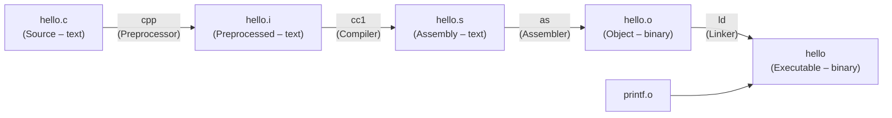

# Bài 13: Ôn Tập Cuối Kỳ

---

## 1. Các Thành Phần Của Hệ Thống

### 1.1 Tổng quan kiến trúc máy tính

```
CPU
├── ALU (Arithmetic Logic Unit) – Bộ tính toán
├── Registers – Thanh ghi (lưu trữ tạm thời tốc độ cao)
└── Cache
    ├── L1 Cache (nhanh nhất, nhỏ nhất)
    ├── L2 Cache
    └── L3 Cache (chậm hơn, lớn hơn)

Memory (RAM) – Bộ nhớ chính

Storage
├── SSD (Solid State Drive)
└── HDD (Hard Disk Drive)
```

> **Tốc độ truy cập (nhanh → chậm):** Register > L1 Cache > L2 > L3 > RAM > SSD > HDD

Khi CPU thực thi chương trình, nó liên tục trao đổi dữ liệu giữa các tầng này. Thanh ghi là nơi CPU làm việc trực tiếp – mọi phép tính đều phải đưa dữ liệu vào thanh ghi trước.

---

### 1.2 Các thanh ghi IA32 (32-bit)

IA32 có **8 thanh ghi đa năng 32-bit**:

| Thanh ghi 32-bit | 16-bit | 8-bit cao | 8-bit thấp | Ý nghĩa gốc |
|---|---|---|---|---|
| `%eax` | `%ax` | `%ah` | `%al` | Accumulator – Kết quả trả về |
| `%ecx` | `%cx` | `%ch` | `%cl` | Counter – Đếm vòng lặp |
| `%edx` | `%dx` | `%dh` | `%dl` | Data |
| `%ebx` | `%bx` | `%bh` | `%bl` | Base |
| `%esi` | `%si` | — | — | Source Index |
| `%edi` | `%di` | — | — | Destination Index |
| `%esp` | `%sp` | — | — | Stack Pointer |
| `%ebp` | `%bp` | — | — | Base Pointer (Frame Pointer) |

!!! note "Tính tương thích ngược"
    Các thanh ghi 16-bit (`%ax`, `%cx`,...) là phần **thấp** của thanh ghi 32-bit. Điều này đảm bảo chương trình 16-bit cũ vẫn chạy được trên CPU 32-bit.

---

### 1.3 Các thanh ghi x86-64 (64-bit)

x86-64 mở rộng lên **16 thanh ghi 64-bit**:

- 8 thanh ghi cũ được mở rộng: `%rax`, `%rbx`, `%rcx`, `%rdx`, `%rsi`, `%rdi`, `%rsp`, `%rbp`
- 8 thanh ghi mới hoàn toàn: `%r8` → `%r15`

Mỗi thanh ghi 64-bit có thể truy cập phần thấp của nó:

| 64-bit | 32-bit thấp |
|---|---|
| `%rax` | `%eax` |
| `%r8` | `%r8d` |
| `%r15` | `%r15d` |

---

### 1.4 Thanh ghi đặc biệt

| Thanh ghi | Tên | Chức năng |
|---|---|---|
| `%rip` / `%eip` | Program Counter / Instruction Pointer | Trỏ đến **địa chỉ lệnh tiếp theo** sẽ được thực thi |
| `%rflag` / `%eflag` | Condition Codes | Lưu kết quả phụ của phép tính (cờ trạng thái) |

**Các bit cờ quan trọng trong `%eflag`:**

| Cờ | Tên | Ý nghĩa |
|---|---|---|
| `CF` | Carry Flag | Có tràn số không dấu |
| `ZF` | Zero Flag | Kết quả bằng 0 |
| `SF` | Sign Flag | Kết quả âm |
| `OF` | Overflow Flag | Tràn số có dấu |

---

## 2. Assembly Instruction (AT&T)

### 2.1 Sự khác biệt AT&T vs Intel

| Đặc điểm | Intel | AT&T |
|---|---|---|
| Thứ tự toán hạng | `mov dest, src` | `mov src, dest` |
| Thanh ghi | `eax` | `%eax` |
| Hằng số | `5` | `$5` |
| Lệnh mov | `mov` | `movl`, `movq`, `movb`... |
| Địa chỉ bộ nhớ | `[ebp + 8]` | `8(%ebp)` |

!!! tip "Gặp ở đâu?"
    - **Intel syntax:** IDA Pro, hoặc dùng `gcc -masm=intel`, `objdump -M intel`
    - **AT&T syntax (mặc định):** `gcc`, `objdump` (không cần tùy chọn thêm)

---

### 2.2 Lệnh `mov` và các dạng hợp lệ

**Suffix quyết định kích thước dữ liệu:**

| Suffix | Kích thước |
|---|---|
| `movb` | 1 byte |
| `movw` | 2 bytes |
| `movl` | 4 bytes |
| `movq` | 8 bytes (x86-64) |

**Các tổ hợp nguồn–đích hợp lệ:**

| Hợp lệ? | Lệnh |
|---|---|
| ✅ | `movl Imm, Reg` |
| ✅ | `movl Imm, Mem` |
| ✅ | `movl Reg, Reg` |
| ✅ | `movl Reg, Mem` |
| ✅ | `movl Mem, Reg` |
| ❌ | `movl Mem, Mem` (không được chuyển thẳng mem→mem) |
| ❌ | `movl Imm, Imm` |
| ❌ | `movl Reg, Imm` |
| ❌ | `movl Mem, Imm` |

!!! warning "Quy tắc quan trọng"
    **Không thể chuyển dữ liệu trực tiếp từ ô nhớ sang ô nhớ** trong một lệnh assembly. Phải dùng thanh ghi trung gian.

**Ví dụ minh họa:**

```asm
movl $0x4, %rax       # temp = 0x4  (Imm → Reg)
movl $-147, (%rax)    # *p = -147   (Imm → Mem)
movl %rax, %rdx       # rdx = rax   (Reg → Reg)
movl %rax, (%rdx)     # *p = temp   (Reg → Mem)
movl (%rax), %rdx     # temp = *p   (Mem → Reg)
```

---

### 2.3 Câu hỏi: Lệnh `mov` nào hợp lệ?

> **Có bao nhiêu lệnh mov hợp lệ trong các lệnh sau?**
> ```asm
> movl %eax, %ebx      # (1)
> movb $123, %bl       # (2)
> movl %eax, %bl       # (3)
> movb $3, (%ecx)      # (4)
> mov  (%eax), %bl     # (5)
> ```

??? success "Đáp án"
    - `movl %eax, %ebx` → ✅ **Hợp lệ** – `movl` dùng 2 thanh ghi 32-bit
    - `movb $123, %bl` → ✅ **Hợp lệ** – `movb` (1 byte) dùng với `%bl` (thanh ghi 8-bit)
    - `movl %eax, %bl` → ❌ **Không hợp lệ** – `movl` là 4 bytes nhưng `%bl` chỉ 1 byte, không khớp kích thước
    - `movb $3, (%ecx)` → ✅ **Hợp lệ** – Ghi 1 byte vào địa chỉ bộ nhớ do `%ecx` trỏ
    - `mov (%eax), %bl` → ✅ **Hợp lệ** – `mov` không có suffix tự suy kích thước từ thanh ghi đích (`%bl` = 1 byte)

    **Kết quả: 4 lệnh hợp lệ.**

---

### 2.4 Chế độ đánh địa chỉ bộ nhớ

**Dạng tổng quát:** `D(Rb, Ri, S)` → truy xuất `Mem[Reg[Rb] + S × Reg[Ri] + D]`

| Ký hiệu | Ý nghĩa | Ràng buộc |
|---|---|---|
| `D` | Displacement – hằng số dịch chuyển | 1, 2, hoặc 4 bytes |
| `Rb` | Base register | Bất kỳ thanh ghi nào |
| `Ri` | Index register | Bất kỳ, **trừ** `%rsp`/`%esp` |
| `S` | Scale | 1, 2, 4, hoặc 8 |

**Các dạng rút gọn:**

| Cú pháp | Địa chỉ tính toán |
|---|---|
| `(Rb, Ri)` | `Reg[Rb] + Reg[Ri]` |
| `D(Rb, Ri)` | `Reg[Rb] + Reg[Ri] + D` |
| `(Rb, Ri, S)` | `Reg[Rb] + S × Reg[Ri]` |
| `(, Ri, S)` | `S × Reg[Ri]` |
| `D(%ebp)` | `Reg[%ebp] + D` (thường dùng để đọc tham số trên stack) |

**Ví dụ thực tế:**

```asm
# Truy cập phần tử thứ i của mảng int A[]
# A[i] có địa chỉ = base_A + 4*i
movl (%eax, %ecx, 4), %edx    # edx = A[i], với eax=&A[0], ecx=i
```

---

### 2.5 `leal` vs `movl`

| | `movl Src, Dst` | `leal Src, Dst` |
|---|---|---|
| Tính địa chỉ từ biểu thức | ✅ | ✅ |
| Truy xuất ô nhớ | ✅ | ❌ |
| Kết quả gán vào Dst | Dữ liệu tại ô nhớ | **Địa chỉ** của ô nhớ |

!!! info "Ứng dụng đặc biệt của `leal`"
    Compiler thường dùng `leal` để tính **biểu thức toán học** nhanh hơn, thay vì thực sự truy xuất bộ nhớ:
    ```asm
    # Tính x*5 một cách nhanh
    leal (%eax, %eax, 4), %eax   # eax = eax + 4*eax = 5*eax
    ```

---

### 2.6 Các lệnh toán học thường gặp

| Lệnh | Ý nghĩa | Ví dụ |
|---|---|---|
| `leal S, D` | D = địa chỉ(S) – không truy xuất mem | `leal (%eax,%eax,4), %eax` |
| `incl D` | D = D + 1 | `incl %eax` |
| `decl D` | D = D − 1 | `decl %ecx` |
| `negl D` | D = −D | `negl %ebx` |
| `notl D` | D = ~D (bitwise NOT) | `notl %eax` |
| `addl S, D` | D = D + S | `addl %ecx, %eax` |
| `subl S, D` | D = D − S | `subl $4, %esp` |
| `imull S, D` | D = D × S | `imull %ecx, %eax` |
| `xorl S, D` | D = D XOR S | `xorl %eax, %eax` (đặt về 0) |
| `andl S, D` | D = D AND S | `andl $0xFF, %eax` |
| `orl S, D` | D = D OR S | `orl $1, %eax` |
| `sall k, D` | D = D << k (left shift) | `sall $2, %eax` (×4) |
| `sarl k, D` | D = D >> k (arithmetic, giữ dấu) | `sarl $1, %eax` (/2 có dấu) |
| `shrl k, D` | D = D >> k (logical, điền 0) | `shrl $1, %eax` (/2 không dấu) |

---

## 3. Lập Trình Mức Máy Tính

### 3.1 Chuỗi biên dịch từ C sang file thực thi



- **Preprocessor (cpp):** Xử lý `#include`, `#define`, macro → ra file `.i`
- **Compiler (cc1):** Dịch C sang assembly → ra file `.s`
- **Assembler (as):** Dịch assembly sang mã máy nhị phân → ra file `.o` (relocatable object)
- **Linker (ld):** Ghép các `.o` lại, giải quyết tham chiếu ngoài → ra file thực thi

---

### 3.2 Kiểu dữ liệu và kích thước

| Kiểu C | 32-bit | 64-bit |
|---|---|---|
| `char` | 1 byte | 1 byte |
| `short` | 2 bytes | 2 bytes |
| `int` | 4 bytes | 4 bytes |
| `long` | **4 bytes** | **8 bytes** |
| `float` | 4 bytes | 4 bytes |
| `double` | 8 bytes | 8 bytes |
| `long double` | 10/16 bytes | 10/16 bytes |
| `pointer` (con trỏ) | **4 bytes** | **8 bytes** |

!!! warning "Chú ý kiểu `long` và pointer"
    `long` và **con trỏ** thay đổi kích thước theo kiến trúc. Trên 64-bit, con trỏ chiếm 8 bytes. Đây là lý do code C không portable nếu giả định `sizeof(int) == sizeof(pointer)`.

---

### 3.3 Điều khiển luồng – Condition Codes & Lệnh Jump

**Luồng hoạt động:**

```
Lệnh toán học / so sánh
     ↓
Cập nhật %eflag (CF, ZF, SF, OF)
     ↓
Lệnh jX kiểm tra cờ
     ↓
Nhảy hay không nhảy
```

**Lệnh sinh ra condition codes:**

```asm
cmpl  a, b    # Tính b - a, không lưu kết quả, chỉ cập nhật cờ
testl a, b    # Tính b & a (AND), không lưu kết quả, chỉ cập nhật cờ
```

**Bảng lệnh nhảy:**

| Lệnh | Điều kiện nhảy | Ý nghĩa |
|---|---|---|
| `jmp` | Luôn luôn | Nhảy không điều kiện |
| `je` | ZF = 1 | Equal / Zero |
| `jne` | ZF = 0 | Not Equal |
| `js` | SF = 1 | Negative (âm) |
| `jns` | SF = 0 | Nonnegative |
| `jg` | `~(SF^OF) & ~ZF` | Greater (có dấu) |
| `jge` | `~(SF^OF)` | Greater or Equal (có dấu) |
| `jl` | `SF^OF` | Less (có dấu) |
| `jle` | `(SF^OF) \| ZF` | Less or Equal (có dấu) |
| `ja` | `~CF & ~ZF` | Above (không dấu) |
| `jb` | CF = 1 | Below (không dấu) |

**Kết hợp `cmpl` + `jX`:**

```asm
cmpl %ebx, %eax     # So sánh eax với ebx (tính eax - ebx)
jg   .label_true    # Nhảy nếu eax > ebx
```

| Assembly | Điều kiện C tương đương |
|---|---|
| `cmpl src2, src1` + `je` | `src1 == src2` |
| `cmpl src2, src1` + `jne` | `src1 != src2` |
| `cmpl src2, src1` + `jg` | `src1 > src2` |
| `cmpl src2, src1` + `jl` | `src1 < src2` |
| `cmpl src2, src1` + `jge` | `src1 >= src2` |
| `cmpl src2, src1` + `jle` | `src1 <= src2` |

---

### 3.4 Từ C sang Assembly và ngược lại

**Ví dụ: Rẽ nhánh `if/else`**

```c
// C code
int result;
if (a > b) {
    result = a - b;
} else {
    result = b - a;
}
```

```asm
# Assembly tương đương (AT&T)
    cmpl  %ebx, %eax      # so sánh a (eax) với b (ebx)
    jle   .else_branch    # nếu a <= b thì nhảy sang else
    subl  %ebx, %eax      # eax = a - b
    jmp   .end
.else_branch:
    subl  %eax, %ebx      # ebx = b - a
    movl  %ebx, %eax      # eax = kết quả
.end:
```

**Ví dụ: Vòng lặp `while`**

```c
// C code
int i = 0, sum = 0;
while (i < 10) {
    sum += i;
    i++;
}
```

```asm
# Assembly tương đương
    movl $0, %ecx         # i = 0
    movl $0, %eax         # sum = 0
.loop_check:
    cmpl $10, %ecx        # so sánh i với 10
    jge  .loop_end        # nếu i >= 10 thì thoát
    addl %ecx, %eax       # sum += i
    incl %ecx             # i++
    jmp  .loop_check
.loop_end:
```

!!! tip "Cách đọc assembly ngược về C"
    1. Tìm **điều kiện `cmp` + `j`** → đó là điều kiện `if` hay điều kiện dừng vòng lặp
    2. Tìm **`jmp` vô điều kiện quay lại** → đó là vòng lặp
    3. Tìm **`call`** → đó là lời gọi hàm
    4. Tìm **`push`/`pop` + `call`/`ret`** → đó là frame của hàm

---

### 3.5 Thủ tục/Hàm và Stack

**Cấu trúc stack frame (IA32):**

```
Địa chỉ cao
┌──────────────────┐
│   ... (caller)   │  ← Caller's frame
├──────────────────┤
│   Argument n     │  ← Tham số thứ n (đẩy vào stack từ phải sang trái)
│   ...            │
│   Argument 1     │
├──────────────────┤
│  Return Address  │  ← Địa chỉ lệnh tiếp theo của caller (push khi call)
├──────────────────┤  ← %ebp trỏ vào đây
│   Saved %ebp     │  ← Lưu frame pointer cũ
├──────────────────┤
│ Saved Registers  │
│ Local Variables  │
├──────────────────┤  ← %esp trỏ vào đây (đỉnh stack)
Địa chỉ thấp
```

| Thanh ghi | Vai trò |
|---|---|
| `%ebp` | **Frame pointer** – trỏ đến đáy frame hiện tại (cố định trong suốt hàm) |
| `%esp` | **Stack pointer** – trỏ đến đỉnh stack (thay đổi khi push/pop) |

**Truy cập tham số và biến cục bộ (IA32):**

```asm
8(%ebp)     # Tham số thứ 1
12(%ebp)    # Tham số thứ 2
-4(%ebp)    # Biến cục bộ thứ 1
-8(%ebp)    # Biến cục bộ thứ 2
```

**Cơ chế `call` và `ret`:**

```asm
# Lệnh call:
# 1. Push địa chỉ lệnh kế tiếp (Return Address) vào stack
# 2. Nhảy đến địa chỉ hàm được gọi
call  func_name

# Lệnh ret:
# 1. Pop Return Address từ stack
# 2. Nhảy về địa chỉ đó
ret
```

**Sự khác biệt IA32 vs x86-64:**

| | IA32 | x86-64 |
|---|---|---|
| Truyền tham số | Qua **stack** | 6 tham số đầu qua **thanh ghi**: `%rdi`, `%rsi`, `%rdx`, `%rcx`, `%r8`, `%r9`; còn lại mới dùng stack |
| Giá trị trả về | `%eax` | `%rax` |
| Con trỏ stack/frame | `%esp`, `%ebp` | `%rsp`, `%rbp` |

---

### 3.6 Mảng, Structure, Union

**Mảng 1 chiều:**

```c
int val[5];
// val[0] tại địa chỉ x
// val[1] tại địa chỉ x + 4
// val[i] tại địa chỉ x + 4*i
```

```asm
# Truy cập val[i], biết &val[0] trong %eax, i trong %ecx
movl (%eax, %ecx, 4), %edx    # edx = val[i]
```

**Structure và Alignment:**

```c
struct example {
    char  a;    // 1 byte tại offset 0
    // 3 bytes padding
    int   b;    // 4 bytes tại offset 4
    char  c;    // 1 byte tại offset 8
    // 3 bytes padding
};
// sizeof(struct example) = 12, không phải 6!
```

!!! info "Quy tắc Alignment"
    Mỗi trường trong struct phải bắt đầu tại địa chỉ **chia hết cho kích thước của nó**. Compiler tự chèn **padding bytes** để đảm bảo điều này. Tổng kích thước struct cũng được làm tròn lên bội số của trường lớn nhất.

**Union:**

```c
union data {
    int   i;    // 4 bytes
    float f;    // 4 bytes
    char  c;    // 1 byte
};
// sizeof(union data) = 4 (kích thước của thành phần lớn nhất)
```

Union chia sẻ **cùng một vùng nhớ** cho tất cả thành phần – chỉ một thành phần hợp lệ tại một thời điểm.

---

### 3.7 Linking

**Symbol là gì?**

Symbol là tên (hàm, biến toàn cục) mà linker cần giải quyết khi ghép các file `.o` lại.

| Loại Symbol | Mô tả |
|---|---|
| **Global symbol** | Định nghĩa trong file này, có thể dùng ở file khác (`extern` sẽ dùng nó) |
| **External symbol** | Được dùng trong file này nhưng định nghĩa ở file khác |
| **Local symbol** | Chỉ dùng trong file này (biến `static` trong C) |

**Strong vs Weak symbol:**

| | Strong | Weak |
|---|---|---|
| Ví dụ | Hàm được định nghĩa, biến toàn cục có khởi tạo | Biến toàn cục **không** khởi tạo |
| Quy tắc | Chỉ được có **1 strong symbol** cùng tên | Nhiều weak, linker chọn 1; weak bị ghi đè bởi strong |

**Các section quan trọng trong file ELF:**

| Section | Nội dung |
|---|---|
| `.text` | Mã máy (code) |
| `.data` | Biến toàn cục/static **đã khởi tạo** |
| `.bss` | Biến toàn cục/static **chưa khởi tạo** (không chiếm dung lượng trong file) |
| `.symtab` | Bảng symbol – danh sách tất cả các symbol |

**Relocation** là quá trình linker điền địa chỉ thực tế vào các chỗ tham chiếu symbol, sau khi đã xác định được vị trí của từng section trong file thực thi cuối cùng.

---

## 4. Các Topic An Toàn Thông Tin

### 4.1 Reverse Engineering (Dịch ngược)

Là quá trình phân tích file nhị phân để hiểu logic chương trình **mà không có source code**. Kỹ năng cần thiết:

- Đọc và hiểu assembly (AT&T hoặc Intel)
- Dùng công cụ: `objdump`, IDA Pro, Ghidra
- Nhận biết các pattern: hàm, vòng lặp, rẽ nhánh trong assembly

### 4.2 Buffer Overflow (Tràn bộ đệm)

```c
void vulnerable(char *input) {
    char buf[8];
    strcpy(buf, input);  // Không kiểm tra độ dài!
}
```

Nếu `input` dài hơn 8 bytes, dữ liệu tràn sang vùng nhớ kế tiếp trên stack, có thể **ghi đè Return Address**, khiến chương trình nhảy đến mã tùy ý của kẻ tấn công.

```
Stack khi bị overflow:
┌──────────────┐
│ Return Addr  │ ← bị ghi đè bởi attacker!
├──────────────┤
│  Saved %ebp  │ ← bị ghi đè
├──────────────┤
│ buf[7..0]    │ ← 8 bytes buffer
└──────────────┘
```

### 4.3 Truy xuất ngoài mảng (Out-of-bounds Access)

```c
int arr[5];
arr[10] = 42;  // Truy xuất ngoài phạm vi!
```

Trong C, không có kiểm tra biên. Việc đọc/ghi ngoài mảng có thể:
- Làm hỏng dữ liệu khác trên stack/heap
- Bị khai thác để thực thi mã độc (liên quan đến buffer overflow)
- Gây crash chương trình (segmentation fault)

---

## 5. Tổng kết nhanh – Checklist ôn thi

??? abstract "Mở rộng checklist"
    - [ ] Phân biệt AT&T vs Intel syntax
    - [ ] Các suffix `b/w/l/q` và thanh ghi tương ứng
    - [ ] Các tổ hợp hợp lệ của `mov` (Imm/Reg/Mem)
    - [ ] Tính địa chỉ với `D(Rb, Ri, S)`
    - [ ] Phân biệt `leal` vs `movl`
    - [ ] Đọc/viết assembly cho `if`, `while`, `for`
    - [ ] Condition codes: CF, ZF, SF, OF – khi nào set
    - [ ] Bảng lệnh `jX` và điều kiện nhảy
    - [ ] Stack frame: `%ebp`, `%esp`, vị trí tham số/biến cục bộ
    - [ ] Khác biệt truyền tham số IA32 vs x86-64
    - [ ] Alignment trong struct
    - [ ] Strong/Weak symbol và quy tắc linker
    - [ ] Section `.text`, `.data`, `.bss`, `.symtab`
    - [ ] Buffer overflow hoạt động như thế nào
