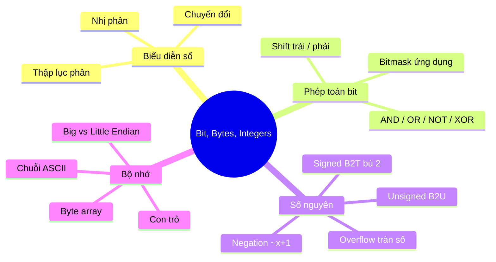

# Bài 2: Bit, Bytes và Integers

---

## 1. Biểu diễn thông tin dưới dạng bit

Trong máy tính, **mọi thứ đều được biểu diễn dưới dạng bit** (0 hoặc 1). Từ các lệnh (instructions) cho đến dữ liệu (số, chuỗi, mảng,...), tất cả đều là chuỗi các bit nhị phân.

### Các hệ biểu diễn số

| Hệ | Cơ số | Ký tự sử dụng | Ví dụ |
|---|---|---|---|
| Thập phân (Decimal) | 10 | 0–9 | 15213 |
| Nhị phân (Binary) | 2 | 0, 1 | 11 1011 0110 1101 |
| Thập lục phân (Hex) | 16 | 0–9, A–F | 0x3B6D |

**Ví dụ chuyển đổi: 15213₁₀**

- **Sang nhị phân:** Chia liên tiếp cho 2, lấy số dư từ dưới lên → `111011011011012`
- **Sang hex:** Gom từng nhóm 4 bit từ phải sang trái → `11 1011 0110 1101` → `3B6D` → `0x3B6D`

> **Mẹo:** Từ nhị phân sang hex rất nhanh — cứ 4 bit tương ứng 1 chữ số hex. Không cần chia.

### Biểu diễn trong code C

```c
int a = 15213;       // Hệ thập phân
int b = 0x3B6D;      // Hệ thập lục phân (tiền tố 0x)
int c = 0b111011011011101; // Hệ nhị phân (tiền tố 0b hoặc 0B)
```

---

## 2. Phép tính toán bit (Bitwise Operations)

### 2.1 Bốn phép toán cơ bản

Các phép toán bit áp dụng trên **từng cặp bit tương ứng** của hai toán hạng:

| Phép toán | Ký hiệu C | Quy tắc |
|---|---|---|
| AND | `&` | Kết quả là 1 khi **cả hai** bit đều là 1 |
| OR | `\|` | Kết quả là 1 khi **ít nhất một** bit là 1 |
| NOT | `~` | Đảo bit: 0→1, 1→0 |
| XOR | `^` | Kết quả là 1 khi hai bit **khác nhau** |

**Ví dụ với chuỗi 8 bit:**

```
  01101001       01101001       01101001       ~ 01010101
& 01010101     | 01010101     ^ 01010101
----------     ----------     ----------         --------
  01000001       01111101       00111100         10101010
```

### 2.2 Ứng dụng thực tế: Bitmask

Giả sử ta dùng **4 bit** để đại diện cho các đặc điểm của một chiếc bánh kem:

```
Bit 3: Có kem?
Bit 2: Có ghi chữ?
Bit 1: Có trái cây?
Bit 0: Có nến?
```

> Ví dụ: `0b0100` = có ghi chữ, không có kem/trái cây/nến

**Bài toán 1 – Bật một bit (thêm trái cây):**

Muốn **bật bit thứ 1** (thêm trái cây) mà không thay đổi các bit khác → dùng **OR với mask có bit đó = 1**:

```
  0011   (yêu cầu hiện tại)
| 0010   (mask: chỉ bật bit trái cây)
------
  0011   → đã có trái cây
```

```c
require_bits = require_bits | 0b0010;
// hoặc dùng toán tử |=
require_bits |= (1 << 1);
```

**Bài toán 2 – Tắt một bit (bỏ ghi chữ):**

Muốn **tắt bit thứ 2** (không ghi chữ) → dùng **AND với mask có bit đó = 0**:

```
  0111   (yêu cầu hiện tại)
& 1011   (mask: bit 2 = 0, còn lại = 1)
------
  0011   → đã bỏ ghi chữ
```

```c
require_bits &= ~(1 << 2);
// ~(1 << 2) = ~0100 = 1011
```

**Bài toán 3 – Đọc giá trị một bit (kiểm tra có ghi chữ không):**

Muốn **lấy giá trị bit thứ 2** → AND với mask có bit đó = 1, rồi dịch phải về vị trí 0:

```c
int co_ghi_chu = (require_bits & 0b0100) >> 2;
// Nếu kết quả == 1: có ghi chữ; == 0: không có
```

### 2.3 Phép dịch bit (Shift)

**Dịch trái `<<`:**
- Dịch toàn bộ chuỗi bit sang trái `n` vị trí
- `n` bit bên trái bị bỏ đi, bên phải điền `n` bit 0
- Tương đương nhân với 2ⁿ

**Dịch phải `>>`:**
- Dịch toàn bộ chuỗi bit sang phải `n` vị trí
- `n` bit bên phải bị bỏ đi
- **Dịch phải luận lý (logical shift):** Điền bit 0 vào bên trái — dùng cho số **không dấu**
- **Dịch phải toán học (arithmetic shift):** Điền **bit dấu** vào bên trái — dùng cho số **có dấu**

```
Argument:  10100010  (số âm, bit dấu = 1)
<< 3:      00010000  (3 bit trái bỏ đi, phải thêm 3 bit 0)
Log >> 2:  00101000  (điền 0 vào trái)
Arith >> 2:11101000  (điền bit dấu 1 vào trái)
```

> **Lưu ý quan trọng:** Trong C, khi dịch phải số có dấu (`signed`), hành vi phụ thuộc vào compiler nhưng hầu hết dùng arithmetic shift. Với `unsigned`, luôn là logical shift.

### 2.4 Phân biệt phép toán bit vs phép toán logic

Đây là một điểm **rất dễ nhầm lẫn** trong C:

| Phép toán logic | Phép toán bit | Ý nghĩa |
|---|---|---|
| `&&` | `&` | AND |
| `\|\|` | `\|` | OR |
| `!` | `~` | NOT |
| (không có) | `^` | XOR |

**Điểm khác biệt then chốt:**
- Phép toán **logic** (`&&`, `||`, `!`): Xem mọi giá trị ≠ 0 là `true`, chỉ trả về 0 hoặc 1
- Phép toán **bit** (`&`, `|`, `~`): Thao tác trực tiếp trên từng bit, kết quả là giá trị số bất kỳ

```c
0x41 && 0x10  // = 1 && 1 = 1   (logic: cả hai đều khác 0)
0x41 &  0x10  // = 0x00         (bit: 0100 0001 & 0001 0000 = 0000 0000)

!0x41   // = 0                  (logic: 0x41 khác 0 → true → NOT = false = 0)
~0x41   // = 0xBE               (bit: đảo tất cả bit của 0100 0001 → 1011 1110)
```

??? question "Câu hỏi: If nào true?"
    ```c
    if (1 & 6)   printf("true");  // 001 & 110 = 000 → FALSE
    if (1 && 6)  printf("true");  // 1 khác 0, 6 khác 0 → TRUE
    if (1 ^ 6)   printf("true");  // 001 ^ 110 = 111 = 7 khác 0 → TRUE
    if (1 == 6)  printf("true");  // 1 không bằng 6 → FALSE
    ```
    **Đáp án:** Chỉ câu 2 và 3 in ra `"true"`.

---

## 3. Số nguyên (Integers)

### 3.1 Biểu diễn số nguyên w-bit

Quy ước: các bit được đánh số từ 0 (phải) đến w-1 (trái).

**Số không dấu (Unsigned):**

Tất cả các bit đều biểu diễn giá trị:

$$B2U(X) = \sum_{i=0}^{w-1} x_i \cdot 2^i$$

- Giá trị nhỏ nhất: `0000...0` = **0**
- Giá trị lớn nhất: `1111...1` = **2ʷ − 1**

**Số có dấu (Signed – bù 2):**

Bit cao nhất (bit w-1) là **bit dấu**, mang trọng số âm:

$$B2T(X) = -x_{w-1} \cdot 2^{w-1} + \sum_{i=0}^{w-2} x_i \cdot 2^i$$

- Giá trị lớn nhất: `0111...1` = **2^(w-1) − 1**
- Giá trị nhỏ nhất: `1000...0` = **−2^(w-1)**

> **Lưu ý:** Số âm nhỏ nhất không có số đối dương tương ứng trong cùng hệ biểu diễn! Ví dụ với 8-bit: min = −128, nhưng +128 không biểu diễn được (max chỉ là +127).

**Ví dụ 8-bit:**

```
0000 0110 → B2T = 4 + 2 = 6
0001 0101 → B2T = 16 + 4 + 1 = 21
1100 0001 → B2T = -128 + 64 + 1 = -63
1000 1010 → B2T = -128 + 8 + 2 = -118
```

### 3.2 Biểu diễn số đối (Negation) – Bù 2

Để tính `-x` từ biểu diễn nhị phân của `x`, ta dùng công thức:

```
-x = ~x + 1
```

**Ví dụ: x = 15213 (16-bit)**

```
x      = 0011 1011 0110 1101
~x     = 1100 0100 1001 0010
~x + 1 = 1100 0100 1001 0011  ← đây chính là -15213
```

> **Tại sao lại như vậy?** Vì `x + (~x) = 1111...1 = -1` (trong bù 2). Do đó `~x = -1 - x`, suy ra `-x = ~x + 1`.

### 3.3 Ánh xạ giữa số có dấu và không dấu

Cùng một chuỗi bit, nhưng khi diễn giải theo `signed` hay `unsigned` sẽ cho giá trị khác nhau:

- Nếu bit dấu = 0: giá trị **giống nhau** trong cả hai cách diễn giải
- Nếu bit dấu = 1: `unsigned = signed + 2ⁿ` (hoặc `signed = unsigned − 2ⁿ`)

```
Bits: 1100 (4-bit)
Signed:   -4
Unsigned: 12
→ 12 = -4 + 2⁴ = -4 + 16 ✓
```

??? warning "Bẫy trong C: biểu thức trộn signed và unsigned"
    Trong C, nếu biểu thức chứa **cả** `signed` và `unsigned`, số **có dấu sẽ bị ép sang không dấu**. Điều này gây ra kết quả bất ngờ:

    ```c
    int a = -1;
    unsigned int b = 0;
    if (a > b) printf("a lớn hơn"); // In ra "a lớn hơn"!
    // Vì -1 được chuyển thành unsigned = 4294967295 > 0
    ```

??? question "Câu hỏi: Nhập a = -1 và b = -1 vào chương trình dưới, kết quả là gì?"
    ```c
    int a;
    unsigned int b;
    scanf("%d", &a);   // nhập -1
    scanf("%u", &b);   // nhập -1
    printf("Your a: %d", a);
    printf("Your b: %u", b);
    ```
    **Đáp án: C — In ra -1 và một giá trị khác.**

    - `a = -1` → in `%d` → in ra `-1` bình thường
    - `b` là `unsigned int`, khi nhập `-1` qua `%u`: chuỗi bit của -1 (tức `0xFFFFFFFF`) được diễn giải là unsigned → in ra **4294967295**

---

## 4. Phép tính trên số nguyên

### 4.1 Phép cộng và tràn số (Overflow)

Khi cộng hai số w-bit, kết quả thực có thể cần w+1 bit. Hệ biểu diễn w-bit **bỏ đi bit cao nhất (MSB)**, dẫn đến **tràn số**:

**Ví dụ 4-bit:**

```
Unsigned:
  8 + 8 = 1000 + 1000 = [1]0000 = 0   (tràn)
  9 + 10 = 1001 + 1010 = [1]0011 = 3  (tràn)

Signed:
  7 + 7  = 0111 + 0111 = 1110 = -2    (tràn dương → thành âm)
 -5 + -5 = 1011 + 1011 = [1]0110 = 6  (tràn âm → thành dương)
```

> Tràn số xảy ra khi: tổng hai số **dương** vượt max dương (kết quả thành âm), hoặc tổng hai số **âm** vượt min âm (kết quả thành dương).

### 4.2 Phép nhân và tràn số

Tích thực của hai số w-bit có thể cần đến **2w bit**. Kết quả w-bit chỉ giữ lại w bit thấp, bỏ w bit cao → tràn số.

### 4.3 Thay thế phép nhân/chia bằng shift (tối ưu hiệu năng)

Compiler thường **tự động** chuyển phép nhân/chia với hằng số thành các lệnh shift vì shift nhanh hơn nhiều:

**Nhân với 2ⁿ → dịch trái n lần:**

```c
x * 8   ≡ x << 3
x * 24  ≡ (x << 5) - (x << 3)   // 24 = 32 - 8
x * 12  ≡ (x + x*2) << 2        // 12 = 3 * 4
```

```c
// Ví dụ: compiler biên dịch x*9 thành
movq %rax, %rdx   // t = x
salq $3, %rax     // x = x << 3 = 8x
addq %rdx, %rax   // x = 8x + t = 9x
```

**Chia không dấu cho 2ⁿ → dịch phải luận lý n lần:**

```c
unsigned long x = 15213;
x >> 4  // ≡ x / 16 = 950 (làm tròn xuống)
```

**Chia có dấu cho 2ⁿ → dịch phải toán học n lần (nhưng cần điều chỉnh cho số âm!):**

Dịch phải toán học làm tròn **về phía âm vô cùng**, trong khi phép chia số học cần làm tròn **về 0**. Để sửa, thêm bias trước khi shift:

```
Công thức đúng: (x + 2^k - 1) >> k
Trong C:        (x + (1 << k) - 1) >> k
```

```c
// Compiler biên dịch x/8 (signed) thành:
testq %rax, %rax   // kiểm tra x < 0 không?
js    L4           // nếu âm, nhảy đến L4
sarq  $3, %rax     // dịch phải toán học 3 bit
ret
L4:
addq  $7, %rax     // cộng bias = 2^3 - 1 = 7
jmp   L3           // rồi mới shift
```

---

## 5. Biểu diễn trong bộ nhớ

### 5.1 Bộ nhớ như một mảng byte

Bộ nhớ được tổ chức như một mảng khổng lồ gồm các byte, mỗi byte có một **địa chỉ** duy nhất (như chỉ số trong mảng). **Con trỏ** (pointer) trong C chính là biến lưu địa chỉ này.

### 5.2 Kích thước kiểu dữ liệu

| Kiểu C | 32-bit | 64-bit |
|---|---|---|
| `char` | 1 | 1 |
| `short` | 2 | 2 |
| `int` | 4 | 4 |
| `long` | 4 | **8** |
| `float` | 4 | 4 |
| `double` | 8 | 8 |
| `pointer` | 4 | **8** |

> `long` và con trỏ thay đổi kích thước theo hệ thống — điều này hay gây bug khi port code từ 32-bit sang 64-bit.

### 5.3 Thứ tự byte (Byte Ordering)

Khi một kiểu dữ liệu nhiều byte (như `int` = 4 bytes) được lưu vào bộ nhớ, **thứ tự sắp xếp các byte** phụ thuộc vào kiến trúc máy:

- **Big Endian** (Sun, PPC Mac, mạng Internet): Byte có trọng số **cao nhất** lưu ở địa chỉ **thấp nhất**
- **Little Endian** (x86, ARM Android/iOS/Windows): Byte có trọng số **thấp nhất** lưu ở địa chỉ **thấp nhất**

**Ví dụ: `int x = 0x01234567`, lưu tại địa chỉ `0x100`**

```
Địa chỉ:   0x100  0x101  0x102  0x103
Big Endian:   01     23     45     67   ← byte cao nhất (01) ở địa chỉ thấp nhất
Little Endian: 67     45     23     01   ← byte thấp nhất (67) ở địa chỉ thấp nhất
```

??? question "Câu hỏi: Hệ Little Endian lưu như hình dưới, biến `short x` ở địa chỉ `0x102` có giá trị bao nhiêu?"
    ```
    Địa chỉ: 0x100  0x101  0x102  0x103
    Nội dung:  67     45     23     01
    ```
    **Đáp án:**

    `short` = 2 bytes, đọc từ `0x102` và `0x103`.

    Little Endian: byte tại địa chỉ thấp hơn là byte **ít quan trọng hơn**:
    - `0x102` = `0x23` → byte thấp
    - `0x103` = `0x01` → byte cao

    Giá trị = `0x0123` = **291**

**Code C hiển thị từng byte trong bộ nhớ:**

```c
typedef unsigned char *pointer;

void show_bytes(pointer start, size_t len) {
    size_t i;
    for (i = 0; i < len; i++)
        printf("%p\t0x%.2x\n", start + i, start[i]);
    printf("\n");
}

int main() {
    int a = 15213;
    show_bytes((pointer) &a, sizeof(int));
}
```

Kết quả trên Linux x86-64 (Little Endian):
```
0x7fffb7f71dbc   6d    ← byte thấp nhất của 0x00003B6D
0x7fffb7f71dbd   3b
0x7fffb7f71dbe   00
0x7fffb7f71dbf   00    ← byte cao nhất
```

> **Tại sao dùng `unsigned char*`?** Vì nếu dùng `int*`, bước nhảy khi truy xuất `start[i]` sẽ là 4 bytes (sizeof int). Ép sang `unsigned char*` thì mỗi `start[i]` đọc đúng **1 byte**.

### 5.4 Biểu diễn chuỗi (String)

Chuỗi trong C là **mảng các ký tự ASCII**, kết thúc bằng **null byte** (`'\0'` = 0x00).

```c
char S[6] = "18213";
// Biểu diễn: 0x31 0x38 0x32 0x31 0x33 0x00
//            '1'  '8'  '2'  '1'  '3'  null
```

> **Thứ tự byte không ảnh hưởng đến chuỗi** — ký tự đầu tiên **luôn** ở địa chỉ thấp nhất, bất kể Big hay Little Endian. Đây là lý do dữ liệu văn bản trên mạng không bị ảnh hưởng bởi byte ordering.

---

## 6. Tổng kết nhanh



| Kỹ thuật | Mục đích | Ví dụ |
|---|---|---|
| `x \| mask` | Bật bit | `x \| 0b0010` bật bit 1 |
| `x & ~mask` | Tắt bit | `x & ~(1<<2)` tắt bit 2 |
| `(x >> k) & 1` | Đọc 1 bit | Lấy bit thứ k |
| `x << k` | Nhân 2ᵏ | Nhanh hơn phép nhân |
| `x >> k` | Chia 2ᵏ | Cần bias nếu số âm |
| `~x + 1` | Số đối | Tính -x từ x |
