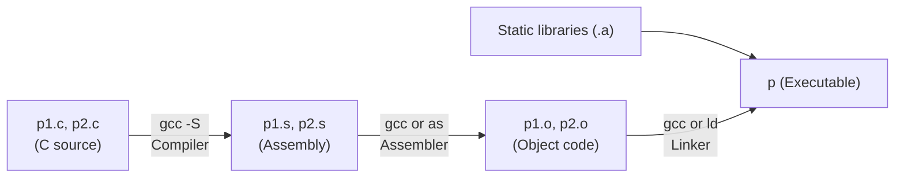

# Bài 3: Machine-Level Programming: Cơ Bản

## 1. Lịch sử và kiến trúc Intel x86

### 1.1 Tổng quan về Intel x86

Intel x86 là dòng vi xử lý thống trị thị trường laptop, desktop và server trong nhiều thập kỷ. Điểm đặc trưng nổi bật nhất là **tương thích ngược** tuyệt đối — một chương trình viết cho CPU 8086 năm 1978 vẫn có thể chạy trên CPU Intel hiện đại ngày nay.

Intel x86 thuộc kiến trúc **CISC (Complex Instruction Set Computer)** — nghĩa là có rất nhiều loại lệnh với nhiều định dạng khác nhau, mỗi lệnh có thể thực hiện nhiều thao tác. Điều này tương phản với **RISC (Reduced Instruction Set Computer)** vốn có ít lệnh hơn nhưng đơn giản và dễ tối ưu hóa phần cứng hơn. Thách thức của Intel là làm sao đạt được hiệu suất của RISC trong khi vẫn phải duy trì độ tương thích của CISC — và họ đã làm được.

### 1.2 Các mốc phát triển quan trọng

| Tên | Năm | Transistors | MHz | Ý nghĩa |
|---|---|---|---|---|
| 8086 | 1978 | 29K | 5–10 | CPU Intel 16-bit đầu tiên, dùng cho IBM PC & DOS, không gian địa chỉ 1MB |
| 386 | 1985 | 275K | 16–33 | CPU Intel 32-bit đầu tiên (IA32), hỗ trợ "flat addressing", chạy được Unix |
| Pentium 4E | 2004 | 125M | 2800–3800 | CPU Intel 64-bit đầu tiên (x86-64) |
| Core 2 | 2006 | 291M | 1060–3500 | CPU nhiều nhân (multi-core) đầu tiên |
| Core i7 | 2008 | 731M | 1700–3900 | 4 nhân |

!!! note "Phạm vi môn học"
    Môn học này tập trung vào hai kiến trúc: **IA32** (32-bit) và **x86-64** (64-bit). Đây là hai nền tảng phổ biến nhất hiện nay.

---

## 2. C, Assembly và Mã Máy

### 2.1 Tại sao phải học Assembly?

Ngôn ngữ bậc cao (C, Python, Java...) giúp lập trình viên không cần quan tâm đến chi tiết phần cứng. Tuy nhiên, assembly mang lại nhiều lợi ích quan trọng mà ngôn ngữ bậc cao không thể thay thế:

- **Hiểu hoạt động thực sự của hệ thống**: Stack, bộ nhớ, register hoạt động ra sao khi chương trình chạy.
- **Phát hiện lỗ hổng bảo mật**: Nhiều lỗ hổng mức hệ thống (buffer overflow, return-oriented programming) chỉ có thể hiểu được khi đọc assembly.
- **Tối ưu hóa hiệu năng**: Compiler không phải lúc nào cũng tạo ra mã tối ưu nhất; người lập trình có thể can thiệp ở mức assembly.
- **Kỹ năng thiết yếu cho An toàn Thông tin (ATTT)**: Reverse engineering, phân tích malware đều yêu cầu đọc được assembly.

### 2.2 Các định nghĩa cốt lõi

**ISA (Instruction Set Architecture)** — Kiến trúc tập lệnh: là "hợp đồng" giữa phần cứng và phần mềm, định nghĩa các lệnh nào CPU hiểu, register nào tồn tại, và cách bộ nhớ được tổ chức. Ví dụ: Intel x86, x86-64; ARM (dùng trên hầu hết thiết bị di động).

**Microarchitecture**: Là hiện thực vật lý của ISA — cách CPU cụ thể thực hiện các lệnh đó. Ví dụ: kích thước cache L1/L2/L3, tần số xung nhịp, số pipeline stages.

**Mã máy (Machine Code)**: Chuỗi các byte nhị phân mà CPU trực tiếp thực thi. Đây là ngôn ngữ duy nhất CPU "hiểu".

**Mã hợp ngữ (Assembly Code)**: Biểu diễn dạng text (con người đọc được) của mã máy. Mỗi dòng assembly tương ứng trực tiếp với một hoặc một nhóm nhỏ instruction máy.

### 2.3 Quá trình từ mã C đến chương trình thực thi



Câu lệnh biên dịch đầy đủ:

```bash
gcc p1.c p2.c -o p
```

**Bước 1 — Compiler** (`gcc -S`): Chuyển mã C thành mã assembly (file `.s`). Đây là bước dịch ngôn ngữ bậc cao sang ngôn ngữ bậc thấp, với các tối ưu hóa của compiler.

**Bước 2 — Assembler** (`gcc` or `as`): Chuyển từng file `.s` thành file object `.o` — là các byte nhị phân đại diện cho các instruction. Tuy nhiên, các file này chưa hoàn chỉnh vì chúng chứa các *tham chiếu* đến hàm/biến ở file khác chưa được giải quyết.

**Bước 3 — Linker** (`gcc` or `ld`): Kết hợp tất cả các file `.o` lại, giải quyết tất cả các tham chiếu chéo giữa các file, và liên kết với các thư viện tĩnh (như `malloc`, `printf` từ thư viện chuẩn C) để tạo ra file thực thi cuối cùng.

??? example "Ví dụ cụ thể: Từ C đến Object Code"
    **Mã C:**
    ```c
    *dest = t;
    ```
    
    **Mã Assembly (AT&T format):**
    ```asm
    movq %rax, (%rbx)
    ```
    Ý nghĩa: Lấy giá trị 8-byte trong register `%rax` (đây là `t`), ghi vào địa chỉ bộ nhớ mà `%rbx` đang trỏ đến (đây là `*dest`).
    
    **Object Code (hex):**
    ```
    0x40059e:  48 89 03
    ```
    Instruction này có kích thước 3 bytes, lưu tại địa chỉ `0x40059e` trong bộ nhớ.

### 2.4 Disassembling — Đọc ngược mã máy

**Disassembler** là công cụ phân tích chuỗi byte nhị phân và dựng lại mã assembly tương ứng. Đây là kỹ năng cốt lõi trong reverse engineering và phân tích bảo mật.

**Công cụ `objdump`:**
```bash
objdump -d <tên_file>
```
Có thể dùng cho cả file `.o` (object) và file thực thi hoàn chỉnh.

**Ví dụ output:**
```
080483c4 <sum>:
80483c4:  55        push   %ebp
80483c5:  89 e5     mov    %esp,%ebp
80483c7:  8b 45 0c  mov    0xc(%ebp),%eax
80483ca:  03 45 08  add    0x8(%ebp),%eax
80483cd:  5d        pop    %ebp
80483ce:  c3        ret
```

**Công cụ `gdb` (GNU Debugger):**
```bash
gdb <tên_file>
disassemble sum        # Disassemble một hàm cụ thể
x/11xb sum             # Xem 11 bytes bắt đầu từ địa chỉ của hàm sum, dạng hex
```

!!! warning "Lưu ý về reverse engineering"
    Về mặt kỹ thuật, bạn có thể disassemble bất kỳ file thực thi nào, kể cả phần mềm thương mại như Microsoft Word. Tuy nhiên, điều này thường vi phạm điều khoản sử dụng (EULA) của phần mềm. Trong ngữ cảnh học tập và nghiên cứu bảo mật hợp pháp, kỹ năng này rất có giá trị.

---

## 3. Góc nhìn của mã Assembly/Mã Máy

Khi lập trình ở mức assembly, lập trình viên làm việc với các thành phần sau của CPU:

### 3.1 Programmer-Visible State

**Program Counter (PC)**

- Lưu địa chỉ của instruction **tiếp theo** sẽ được thực thi.
- Trong IA32 gọi là `EIP` (Extended Instruction Pointer).
- Trong x86-64 gọi là `RIP` (Register Instruction Pointer).
- PC tự động tăng lên sau mỗi instruction, hoặc thay đổi khi có lệnh nhảy (jump/call).

**Registers (Thanh ghi)**

- Bộ nhớ cực nhanh nằm trực tiếp trong CPU.
- Được dùng để lưu trữ tạm thời các giá trị trong quá trình tính toán.
- Số lượng hạn chế — đây là một trong những thách thức chính khi viết assembly tốt.

**Condition Codes**

- Các bit trạng thái được tự động cập nhật sau mỗi phép tính toán học/logic.
- Ví dụ: CF (Carry Flag), ZF (Zero Flag), SF (Sign Flag), OF (Overflow Flag).
- Được dùng để thực hiện các câu lệnh rẽ nhánh có điều kiện (`if/else`, vòng lặp).

**Bộ nhớ (Memory)**

- Là một mảng tuyến tính các bytes, mỗi byte có một địa chỉ duy nhất.
- Chứa cả **code** (các instruction cần thực thi) và **data** (các biến, hằng số).
- **Stack** là vùng bộ nhớ đặc biệt hỗ trợ việc gọi hàm (procedure call), lưu trữ tham số, biến cục bộ, và địa chỉ trả về.

### 3.2 Kiểu dữ liệu trong Assembly

Assembly không có hệ thống kiểu dữ liệu phong phú như C hay Java. Các "kiểu" chỉ được phân biệt bởi kích thước:

| Kích thước | Mô tả |
|---|---|
| 1 byte | Số nguyên (ký tự) |
| 2 bytes | Số nguyên (short) |
| 4 bytes | Số nguyên (int trong IA32) |
| 8 bytes | Số nguyên (long trong x86-64), con trỏ |
| 4, 8, 10 bytes | Dấu phẩy động (floating point) |

!!! info "Không có kiểu dữ liệu phức tạp"
    Assembly **không có** khái niệm mảng, struct, hay class tích hợp. Tất cả đều chỉ là các bytes nằm liên tiếp trong bộ nhớ. Trách nhiệm diễn giải ý nghĩa thuộc về lập trình viên/compiler.

### 3.3 Nhóm các phép tính trong Assembly

- **Nhóm 1 — Chuyển dữ liệu**: Di chuyển dữ liệu giữa bộ nhớ ↔ register (lệnh `mov`).
- **Nhóm 2 — Tính toán**: Thực hiện phép toán số học và logic trên register hoặc bộ nhớ (`add`, `sub`, `and`, `or`...).
- **Nhóm 3 — Điều khiển luồng**: Thay đổi luồng thực thi — nhảy không điều kiện, rẽ nhánh có điều kiện, gọi hàm và trả về.

---

## 4. Định dạng AT&T vs Intel

Môn học này sử dụng **định dạng AT&T** (mặc định của GCC, GDB, objdump). Cần phân biệt với định dạng Intel (dùng trong tài liệu Intel và IDA Pro).

| Đặc điểm | AT&T | Intel |
|---|---|---|
| Thứ tự toán hạng | `movl source, dest` | `mov dest, source` |
| Tên thanh ghi | `%eax` (có tiền tố %) | `eax` (không có tiền tố) |
| Hằng số | `$0x400` (có tiền tố $) | `0x400` |
| Suffix lệnh | `movl`, `movb`, `movq` | `mov` (không suffix) |
| Địa chỉ ô nhớ | `8(%ebp)` | `[ebp + 8]` |
| Sinh ra bởi | GCC (mặc định), objdump | IDA Pro, MSVC |

!!! tip "Bật định dạng Intel trong GCC/objdump"
    ```bash
    gcc -masm=intel ...
    objdump -M intel ...
    ```

---

## 5. Registers (Thanh Ghi)

### 5.1 Thanh ghi IA32 — 8 thanh ghi 32-bit

```
Thanh ghi 32-bit    16-bit    8-bit high    8-bit low    Mục đích
%eax                %ax       %ah           %al          Kết quả hàm (return value)
%ecx                %cx       %ch           %cl          Counter (bộ đếm)
%edx                %dx       %dh           %dl          Data
%ebx                %bx       %bh           %bl          Base
%esi                %si                                  Source index
%edi                %di                                  Destination index
%esp                %sp                                  Stack pointer (con trỏ đỉnh stack)
%ebp                %bp                                  Base pointer (con trỏ khung stack)
```

Các thanh ghi có thể truy cập từng phần: `%eax` là 32-bit, `%ax` là 16-bit thấp của nó, `%ah` là byte cao của `%ax`, `%al` là byte thấp của `%ax`.

!!! warning "Thanh ghi đặc biệt"
    `%esp` (stack pointer) và `%ebp` (base pointer) được dành riêng cho quản lý stack. Không nên dùng chúng cho mục đích lưu trữ dữ liệu thông thường.

### 5.2 Thanh ghi x86-64 — 16 thanh ghi 64-bit

x86-64 mở rộng 8 thanh ghi 32-bit cũ thành 64-bit (bằng cách thêm tiền tố `r`), đồng thời thêm 8 thanh ghi hoàn toàn mới:

```
64-bit     32-bit (low)    Ghi chú
%rax       %eax            
%rbx       %ebx            
%rcx       %ecx            
%rdx       %edx            
%rsi       %esi            
%rdi       %edi            
%rsp       %esp            Stack pointer
%rbp       %ebp            Trở thành thanh ghi mục đích chung trong x86-64
%r8        %r8d            Thanh ghi mới
%r9        %r9d
%r10       %r10d
%r11       %r11d
%r12       %r12d
%r13       %r13d
%r14       %r14d
%r15       %r15d
```

---

## 6. Lệnh Chuyển Dữ Liệu — `mov`

### 6.1 Cú pháp và Suffix

```asm
movb  source, dest   # Di chuyển 1 byte
movw  source, dest   # Di chuyển 2 bytes (word)
movl  source, dest   # Di chuyển 4 bytes (long word)
movq  source, dest   # Di chuyển 8 bytes (quad word) — dùng với x86-64
mov   source, dest   # Compiler tự suy ra kích thước từ toán hạng
```

!!! warning "Suffix phải khớp với thanh ghi"
    - `movl` dùng với thanh ghi 32-bit (`%eax`, `%ebx`...)
    - `movq` dùng với thanh ghi 64-bit (`%rax`, `%rbx`...)
    - `movb` dùng với thanh ghi 8-bit (`%al`, `%bl`...)

### 6.2 Các loại Toán hạng (Operand)

**Immediate (Hằng số)**
- Ký hiệu: tiền tố `$`
- Ví dụ: `$0x400`, `$-533`, `$42`
- Chỉ có thể dùng ở vị trí **source**, không bao giờ là destination.
- Được mã hoá trực tiếp trong instruction.

**Register (Thanh ghi)**
- Ký hiệu: tiền tố `%`
- Ví dụ: `%eax`, `%rsi`, `%bl`
- Nhanh nhất vì không cần truy cập bộ nhớ.

**Memory (Ô nhớ)**
- Truy cập vào một địa chỉ bộ nhớ.
- Có nhiều dạng (xem mục 6.3).
- Chậm hơn vì cần chu kỳ truy cập bộ nhớ (memory access).

### 6.3 Các tổ hợp toán hạng hợp lệ cho `movl`

```asm
movl $0x4, %eax          # Imm → Reg:  temp = 0x4
movl $-147, (%eax)       # Imm → Mem:  *p = -147
movl %eax, %edx          # Reg → Reg:  temp2 = temp1
movl %eax, (%edx)        # Reg → Mem:  *p = temp
movl (%eax), %edx        # Mem → Reg:  temp = *p
```

!!! danger "Không hỗ trợ Mem → Mem trong một instruction!"
    ```asm
    movl (%eax), (%edx)   # ❌ SAI — không hợp lệ
    ```
    Để sao chép từ ô nhớ này sang ô nhớ khác, phải dùng **hai lệnh** thông qua một register trung gian:
    ```asm
    movl (%eax), %ecx     # Bước 1: Mem → Reg
    movl %ecx, (%edx)     # Bước 2: Reg → Mem
    ```

---

## 7. Các Chế Độ Đánh Địa Chỉ Bộ Nhớ

### 7.1 Dạng tổng quát

```
D(Rb, Ri, S)  →  Mem[Reg[Rb] + S * Reg[Ri] + D]
```

Trong đó:
- **D**: Hằng số dịch chuyển (displacement), 1, 2, hoặc 4 bytes. Có thể bỏ qua (mặc định = 0).
- **Rb**: Base register — bất kỳ thanh ghi nào.
- **Ri**: Index register — bất kỳ thanh ghi nào, ngoại trừ `%esp`/`%rsp`.
- **S**: Scale (tỷ lệ) — phải là **1, 2, 4, hoặc 8**. Các giá trị này tương ứng với kích thước của char, short, int, long — rất tiện khi lập chỉ số mảng.

### 7.2 Các dạng rút gọn

```asm
(%eax)              # Dạng thông thường: Mem[Reg[%eax]]
8(%ebp)             # Dịch chuyển: Mem[Reg[%ebp] + 8]
(%edx, %ecx)        # Base+Index: Mem[Reg[%edx] + Reg[%ecx]]
(%edx, %ecx, 4)     # Base+Index*Scale: Mem[Reg[%edx] + 4*Reg[%ecx]]
0x80(, %edx, 2)     # D+Index*Scale: Mem[2*Reg[%edx] + 0x80]
4(%ecx, %eax, 2)    # D+Base+Index*Scale: Mem[Reg[%ecx] + 2*Reg[%eax] + 4]
```

### 7.3 Ví dụ tính toán địa chỉ

Giả sử `%edx = 0xf000`, `%ecx = 0x0100`:

| Biểu thức | Tính toán | Kết quả |
|---|---|---|
| `0x8(%edx)` | `0xf000 + 0x8` | `0xf008` |
| `(%edx, %ecx)` | `0xf000 + 0x100` | `0xf100` |
| `(%edx, %ecx, 4)` | `0xf000 + 4×0x100` | `0xf400` |
| `0x80(, %edx, 2)` | `2×0xf000 + 0x80` | `0x1e080` |

### 7.4 Câu hỏi luyện tập: Mov

> **Câu hỏi từ slide:** Giả sử `%eax = 0x100` và bộ nhớ tại `0x100` chứa giá trị `25`. Hai lệnh sau cho kết quả giống hay khác nhau?
> ```asm
> movl %eax, %ebx
> movl (%eax), %ebx
> ```

??? success "Đáp án"
    **Khác nhau hoàn toàn!**
    
    - `movl %eax, %ebx`: Sao chép **giá trị của thanh ghi** `%eax` vào `%ebx`. Kết quả: `%ebx = 0x100`.
    - `movl (%eax), %ebx`: Dereference — đọc giá trị từ **ô nhớ có địa chỉ bằng giá trị của** `%eax`. Kết quả: `%ebx = Mem[0x100] = 25`.
    
    Đây là sự khác biệt giữa "giá trị của biến" và "giá trị mà biến trỏ đến" — tương tự như `p` vs `*p` trong C.

---

## 8. Các Lệnh Mov Không Hợp Lệ — Luyện tập

> **Câu hỏi từ slide:** Xác định lệnh nào hợp lệ, lệnh nào không, và giải thích lý do.

```asm
1. movl %eax, %ebx
2. movb $123, %bl
3. movl %eax, %bl
4. movb $3, (%ecx)
5. movl 0x100, (%eax)
6. mov %ecx, $100
7. mov (%eax), %bl
8. movb $3, 0x200
```

??? success "Đáp án chi tiết"
    1. ✅ **Hợp lệ** — Sao chép 4 bytes từ `%eax` sang `%ebx`. Cùng kích thước.
    
    2. ✅ **Hợp lệ** — Gán hằng 1 byte `123` vào `%bl` (byte thấp của `%ebx`). Suffix `b` khớp với `%bl`.
    
    3. ❌ **Không hợp lệ** — Suffix `l` (4 bytes) nhưng `%bl` chỉ là 1 byte. Kích thước không khớp.
    
    4. ✅ **Hợp lệ** — Ghi 1 byte giá trị `3` vào địa chỉ bộ nhớ mà `%ecx` trỏ đến.
    
    5. ✅ **Hợp lệ** — `0x100` là địa chỉ tuyệt đối (không phải hằng số immediate — không có `$`). Đọc 4 bytes từ ô nhớ `0x100`, ghi vào ô nhớ mà `%eax` trỏ đến. (Lưu ý: đây không vi phạm quy tắc Mem→Mem vì `0x100` ở đây là địa chỉ literal, không phải toán hạng memory mode với register.)
    
    6. ❌ **Không hợp lệ** — Destination không bao giờ là hằng số (immediate). `$100` là hằng số, không thể là đích ghi.
    
    7. ✅ **Hợp lệ** — Đọc 1 byte từ ô nhớ mà `%eax` trỏ đến, lưu vào `%bl`. Không suffix thì compiler tự suy từ `%bl` (1 byte).
    
    8. ✅ **Hợp lệ** — Ghi 1 byte giá trị `3` vào địa chỉ tuyệt đối `0x200`.

---

## 9. Lệnh `leal` — Load Effective Address

### 9.1 Cú pháp và mục đích

```asm
leal Source, Dest     # IA32
leaq Source, Dest     # x86-64 (64-bit)
```

**Điểm mấu chốt**: `leal` **tính toán địa chỉ** nhưng **không truy xuất bộ nhớ**. Nó gán trực tiếp giá trị địa chỉ đó vào register đích.

So sánh:
```asm
leal (%edx, %ecx, 4), %eax   # %eax = địa chỉ = Reg[%edx] + 4*Reg[%ecx]
movl (%edx, %ecx, 4), %ebx   # %ebx = Mem[Reg[%edx] + 4*Reg[%ecx]] — đọc bộ nhớ!
```

### 9.2 Ứng dụng của `leal`

**Tính địa chỉ con trỏ:**
```c
int *p = &x[i];   // Tính địa chỉ của x[i]
```
```asm
leal (%eax, %ecx, 4), %edx   # edx = eax + 4*ecx = địa chỉ của x[i]
```

**Tính toán biểu thức toán học** — compiler thường dùng `leal` để tính nhanh các biểu thức dạng `x + k*y + d`:

```asm
leal (%eax, %eax, 2), %eax   # %eax = %eax + 2*%eax = 3*%eax
sall $2, %eax                 # %eax <<= 2, tức là %eax *= 4
# Kết quả: %eax = 12 * (giá trị ban đầu của %eax)
```

### 9.3 Ví dụ `lea` vs `mov`

Giả sử `%rdx = 0x100`, `%rcx = 0x4`:

```asm
leaq (%rdx, %rcx, 4), %rax   # %rax = 0x100 + 4*0x4 = 0x110
movq (%rdx, %rcx, 4), %rbx   # %rbx = Mem[0x110] = ... (đọc từ bộ nhớ!)

leaq (%rdx), %rdi             # %rdi = 0x100 (chép địa chỉ, không truy xuất)
movq (%rdx), %rsi             # %rsi = Mem[0x100] = ... (đọc từ bộ nhớ!)
```

### 9.4 Dùng `leal` để tính biểu thức

Giả sử `%eax = x`, `%ecx = y`:

| Lệnh | Kết quả |
|---|---|
| `leal 6(%eax), %edx` | `x + 6` |
| `leal (%eax, %ecx), %edx` | `x + y` |
| `leal 0xA(, %ecx, 4), %edx` | `4y + 10` |
| `leal (%ecx, %eax, 2), %edx` | `2x + y` |

> **Câu hỏi từ slide:** Viết lệnh `leal` để tính `5x + 9`?

??? success "Đáp án"
    ```asm
    leal 9(%eax, %eax, 4), %edx
    ```
    Giải thích: `Reg[%eax] + 4*Reg[%eax] + 9 = 5x + 9` ✓

---

## 10. Ví dụ: Hàm Swap

Ví dụ này minh họa đầy đủ cách sử dụng các chế độ đánh địa chỉ trong thực tế.

```c
void swap(int *xp, int *yp) {
    int t0 = *xp;
    int t1 = *yp;
    *xp = t1;
    *yp = t0;
}
```

### 10.1 Phiên bản IA32

```asm
swap:
    pushl %ebp
    movl  %esp, %ebp       # Thiết lập stack frame
    pushl %ebx

    movl 8(%ebp), %edx     # edx = xp  (tham số thứ 1, ở ebp+8)
    movl 12(%ebp), %ecx    # ecx = yp  (tham số thứ 2, ở ebp+12)
    movl (%edx), %ebx      # ebx = *xp = t0
    movl (%ecx), %eax      # eax = *yp = t1
    movl %eax, (%edx)      # *xp = t1
    movl %ebx, (%ecx)      # *yp = t0

    popl %ebx
    popl %ebp
    ret
```

**Tại sao tham số ở `ebp+8` và `ebp+12`?**

Trong IA32, tham số hàm được truyền qua stack. Layout stack khi vào hàm:

```
Địa chỉ    Nội dung
ebp+12  →  yp (tham số 2)
ebp+8   →  xp (tham số 1)
ebp+4   →  Return address
ebp+0   →  Old %ebp (được push bởi lệnh pushl %ebp)
ebp-4   →  Old %ebx (được push bởi pushl %ebx)
```

### 10.2 Phiên bản x86-64

```asm
swap:
    movl (%rdi), %eax     # t0 = *xp  (xp truyền qua %rdi)
    movl (%rsi), %edx     # t1 = *yp  (yp truyền qua %rsi)
    movl %edx, (%rdi)     # *xp = t1
    movl %eax, (%rsi)     # *yp = t0
    ret
```

!!! tip "Tại sao x86-64 ngắn hơn nhiều?"
    Trong x86-64, **6 tham số đầu tiên** được truyền qua register thay vì stack:
    - Tham số 1 → `%rdi`
    - Tham số 2 → `%rsi`
    - Tham số 3 → `%rdx`
    - Tham số 4 → `%rcx`
    - Tham số 5 → `%r8`
    - Tham số 6 → `%r9`
    
    Điều này loại bỏ hoàn toàn việc phải thiết lập stack frame và tính offset, giúp code ngắn gọn và nhanh hơn đáng kể.

---

## 11. Các Phép Tính Toán Học và Logic

### 11.1 Lệnh hai toán hạng

```asm
# Cú pháp: opcode Src, Dest   →   Dest = Dest OP Src

addl  Src, Dest    # Dest = Dest + Src         (cộng)
subl  Src, Dest    # Dest = Dest - Src         (trừ)
imull Src, Dest    # Dest = Dest * Src         (nhân có dấu)
sall  Src, Dest    # Dest = Dest << Src        (shift trái / nhân 2^Src)
sarl  Src, Dest    # Dest = Dest >> Src        (shift phải số học — sign-extend)
shrl  Src, Dest    # Dest = Dest >> Src        (shift phải logic — zero-fill)
xorl  Src, Dest    # Dest = Dest ^ Src         (XOR bitwise)
andl  Src, Dest    # Dest = Dest & Src         (AND bitwise)
orl   Src, Dest    # Dest = Dest | Src         (OR bitwise)
```

!!! warning "Thứ tự toán hạng trong AT&T format"
    Lưu ý: trong AT&T format, **Source viết trước, Dest viết sau** — ngược với Intel format. `subl %eax, %edx` có nghĩa là `%edx = %edx - %eax`, không phải `%eax - %edx`.

!!! info "Signed vs Unsigned"
    Đối với phép cộng, trừ, AND, OR, XOR — không có sự khác biệt giữa số có dấu (signed) và không dấu (unsigned) ở mức bit. CPU thực hiện giống nhau; lập trình viên tự diễn giải kết quả.

### 11.2 Lệnh một toán hạng

```asm
incl Dest    # Dest = Dest + 1  (increment)
decl Dest    # Dest = Dest - 1  (decrement)
negl Dest    # Dest = -Dest     (phủ định số học — two's complement)
notl Dest    # Dest = ~Dest     (NOT bitwise — đảo tất cả các bit)
```

### 11.3 Tổng quát về lệnh Assembly AT&T

Các quy tắc bất biến:

- **Destination không bao giờ là hằng số.**
- **Không có lệnh nào hỗ trợ cả hai toán hạng đều là ô nhớ.**
- Sau mỗi lệnh `mov` hay toán học, giá trị ở `dest` bị thay đổi.
- Tất cả các lệnh (trừ `leal/leaq`) đều thực sự **đọc/ghi bộ nhớ** khi toán hạng là dạng `(%reg)`.
- Suffix (`l`, `w`, `b`, `q`) ảnh hưởng đến **tất cả** các lệnh: `addl`, `addw`, `addb`, `addq`.

---

## 12. Ví dụ Đầy Đủ: Biểu thức toán học

```c
long arith(long x, long y, long z) {
    long t1 = x + y;        // (1)
    long t2 = z + t1;       // (2)
    long t3 = x + 4;        // (3)
    long t4 = y * 48;       // (4)
    long t5 = t3 + t4;      // (5)
    long rval = t2 * t5;    // (6)
    return rval;
}
```

**Mã assembly x86-64** (tham số: `x → %rdi`, `y → %rsi`, `z → %rdx`):

```asm
arith:
    leaq  (%rdi, %rsi), %rax    # (1) %rax = x + y = t1
    addq  %rdx, %rax            # (2) %rax = t1 + z = t2
    leaq  (%rsi, %rsi, 2), %rdx # (4) %rdx = y + 2y = 3y
    salq  $4, %rdx              # (4) %rdx = 3y * 16 = 48y = t4
    leaq  4(%rdi, %rdx), %rcx   # (3,5) %rcx = x + t4 + 4 = t3 + t4 = t5
    imulq %rcx, %rax            # (6) %rax = t2 * t5 = rval
    ret                         # trả về %rax
```

**Phân tích cách compiler tối ưu:**

Compiler tính `y * 48` bằng cách nhận thấy `48 = 3 * 16`:
- `leaq (%rsi, %rsi, 2), %rdx` → `3y` (không cần lệnh nhân!)
- `salq $4, %rdx` → `3y * 16 = 48y` (shift trái 4 bit = nhân 2^4 = 16)

Đây là ví dụ điển hình của **strength reduction** — compiler thay thế phép nhân đắt tiền bằng shift và add rẻ tiền hơn.

---

## 13. Tổng kết Quy Tắc Vàng

!!! summary "Checklist khi đọc/viết Assembly"

    1. **Định dạng AT&T**: `opcode source, dest` — source trước, dest sau.
    2. **Suffix**: `b`=1B, `w`=2B, `l`=4B, `q`=8B — phải khớp với kích thước register.
    3. **Immediate** chỉ ở source, không bao giờ ở dest.
    4. **Không có Mem→Mem** trong một lệnh — phải qua register trung gian.
    5. **`leal`** tính địa chỉ nhưng **không đọc bộ nhớ** — đây là điểm khác biệt với `movl`.
    6. **x86-64** truyền tham số qua register (`%rdi`, `%rsi`, `%rdx`...) thay vì stack như IA32.
    7. **Condition codes** tự động cập nhật sau mỗi phép tính toán học — không cần lệnh riêng.
