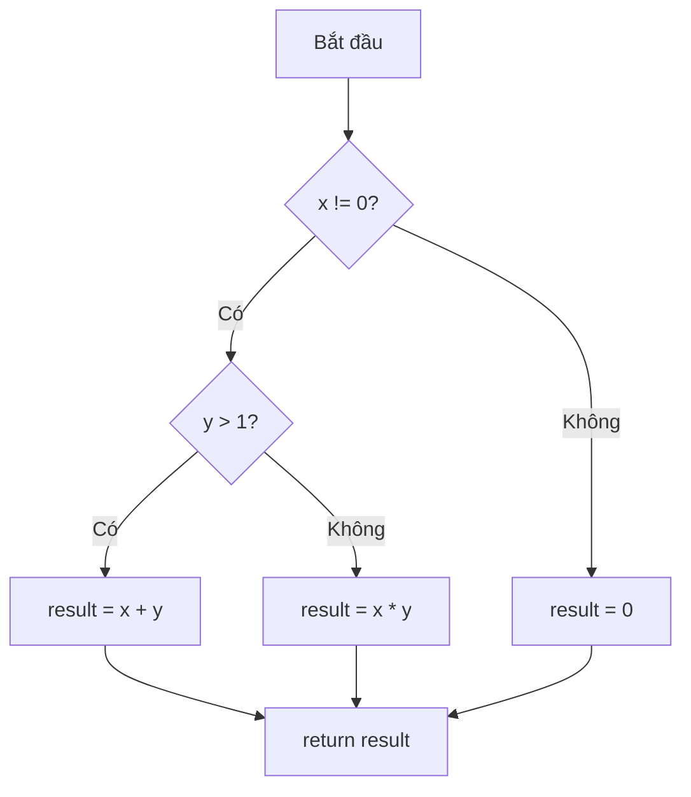
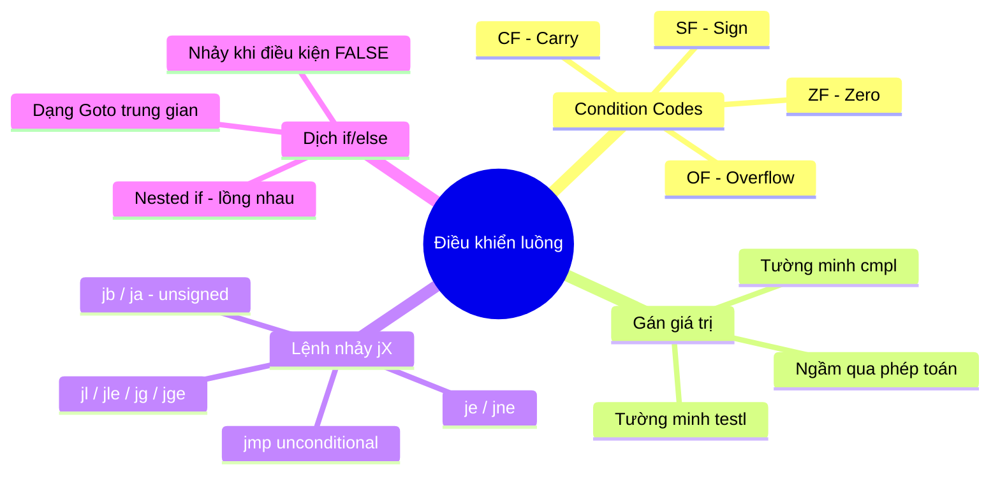

# Bài 5: Điều Khiển Luồng (Machine-Level Programming)

---

## 1. Trạng thái bộ xử lý và Condition Codes

### 1.1 Trạng thái bộ xử lý

Bộ xử lý IA32/x86-64 lưu trữ các thông tin sau trong quá trình thực thi chương trình:

| Thành phần | IA32 | x86-64 | Mô tả |
|---|---|---|---|
| Thanh ghi dữ liệu | `%eax`, `%ebx`, ... | `%rax`, `%rbx`, ... | Dữ liệu tạm thời |
| Con trỏ lệnh | `%eip` | `%rip` | Địa chỉ lệnh đang thực thi |
| Stack pointer | `%esp`, `%ebp` | `%rsp` | Vị trí stack |
| Condition codes | `CF, ZF, SF, OF` | `CF, ZF, SF, OF` | Kết quả phép test gần nhất |

---

### 1.2 Condition Codes — Các bit trạng thái

Condition codes là các **thanh ghi 1-bit** nằm trong `%eflags` / `%rflags`, phản ánh kết quả của phép toán gần nhất.

| Flag | Tên đầy đủ | Ý nghĩa |
|---|---|---|
| `CF` | Carry Flag | Bật khi xảy ra **tràn số không dấu** (unsigned overflow) |
| `ZF` | Zero Flag | Bật khi kết quả **bằng 0** |
| `SF` | Sign Flag | Bật khi kết quả **âm** (bit cao nhất = 1) |
| `OF` | Overflow Flag | Bật khi xảy ra **tràn số có dấu** (signed overflow, bù 2) |

---

### 1.3 Cách gán giá trị Condition Codes

#### Gán ngầm — qua phép toán số học

Hầu hết các lệnh số học (`addl`, `subl`, `imull`, ...) **tự động cập nhật** condition codes như một "tác dụng phụ".

**Ví dụ với `addl Src, Dest` — tính `t = a + b`:**

```
CF  ← bật nếu có nhớ ra ngoài bit cao nhất   (unsigned overflow)
ZF  ← bật nếu t == 0
SF  ← bật nếu t < 0  (bit dấu = 1)
OF  ← bật nếu tràn số bù 2:
      (a>0 && b>0 && t<0) || (a<0 && b<0 && t>=0)
```

> **Lưu ý quan trọng:** Lệnh `leal` **không** cập nhật condition codes dù nó thực hiện phép cộng địa chỉ. Lý do: `leal` được thiết kế để tính địa chỉ, không phải phép toán số học thông thường.

---

#### Gán tường minh — lệnh `cmpl` (so sánh)

```asm
cmpl Src2, Src1   ; tương đương tính Src1 - Src2 nhưng KHÔNG lưu kết quả
```

Chỉ cập nhật condition codes dựa trên hiệu `Src1 - Src2`:

```
CF  ← bật nếu tràn không dấu (dùng khi so sánh unsigned)
ZF  ← bật nếu Src1 == Src2
SF  ← bật nếu (Src1 - Src2) < 0
OF  ← bật nếu tràn số có dấu:
      (a>0 && b<0 && (a-b)<0) || (a<0 && b>0 && (a-b)>0)
```

---

#### Gán tường minh — lệnh `testl`

```asm
testl Src2, Src1   ; tương đương tính Src1 & Src2 nhưng KHÔNG lưu kết quả
```

Chỉ cập nhật `ZF` và `SF`:

```
ZF  ← bật nếu (Src1 & Src2) == 0
SF  ← bật nếu (Src1 & Src2) < 0  (bit cao nhất = 1)
```

**Dùng phổ biến nhất:** `testl %eax, %eax` để kiểm tra xem thanh ghi `%eax` có bằng 0 không (thay cho `cmpl $0, %eax`).

---

## 2. Rẽ nhánh có điều kiện

### 2.1 Các lệnh nhảy `jX`

Lệnh `jX label` sẽ nhảy đến vị trí `label` nếu điều kiện tương ứng thỏa mãn:

| Lệnh | Điều kiện | Ý nghĩa |
|---|---|---|
| `jmp` | 1 (luôn đúng) | Nhảy không điều kiện |
| `je` | `ZF` | Equal / Zero |
| `jne` | `~ZF` | Not Equal / Not Zero |
| `js` | `SF` | Negative (âm) |
| `jns` | `~SF` | Nonnegative (không âm) |
| `jg` | `~(SF^OF) & ~ZF` | Greater (signed) |
| `jge` | `~(SF^OF)` | Greater or Equal (signed) |
| `jl` | `SF^OF` | Less (signed) |
| `jle` | `(SF^OF) \| ZF` | Less or Equal (signed) |
| `ja` | `~CF & ~ZF` | Above (unsigned) |
| `jb` | `CF` | Below (unsigned) |

> `jg`/`jl`/`jge`/`jle` dùng cho số **có dấu** (signed). `ja`/`jb` dùng cho số **không dấu** (unsigned).

---

### 2.2 Kết hợp `cmpl` + `jX`

Mẫu phổ biến nhất trong assembly:

```asm
cmpl  src2, src1    ; so sánh src1 và src2 (tính src1 - src2)
jX    label         ; nhảy nếu điều kiện thỏa
```

Bảng ánh xạ từ điều kiện sang lệnh nhảy:

| Điều kiện C | Lệnh nhảy |
|---|---|
| `src1 == src2` | `je` |
| `src1 != src2` | `jne` |
| `src1 > src2` | `jg` |
| `src1 >= src2` | `jge` |
| `src1 < src2` | `jl` |
| `src1 <= src2` | `jle` |

---

### 2.3 Câu hỏi thực hành: Chọn lệnh `jX` phù hợp

> **Đề bài:** Cho `%eax = x`, `%ebx = y`, `%ecx = z`. Điền lệnh `cmpl`/`testl` và `jX` để nhảy đến `.L1` theo điều kiện cho trước.

**Đáp án:**

```asm
; Điều kiện: x == y
cmpl %eax, %ebx
je .L1
; Hoặc: cmpl %ebx, %eax / je .L1  (cả hai đều đúng vì == đối xứng)

; Điều kiện: y != z
cmpl %ebx, %ecx
jne .L1

; Điều kiện: z > x
cmpl %eax, %ecx     ; tính ecx - eax, tức là z - x
jg .L1

; Điều kiện: x < 0
cmpl $0, %eax
jl .L1
; Hoặc: testl %eax, %eax / js .L1

; Điều kiện: y == 0
testl %ebx, %ebx
je .L1              ; hoặc jz .L1 (tương đương)

; Điều kiện: z != 0
testl %ecx, %ecx
jne .L1

; Điều kiện: true (luôn nhảy)
jmp .L1
```

---

### 2.4 Mẫu dịch `if/else` sang Assembly

#### Phương pháp chung (dạng Goto)

Khi gặp cấu trúc:

```c
if (test-expr)
    then-statement;
else
    else-statement;
```

Trình biên dịch dịch theo hướng **nhảy khi điều kiện FALSE**:

```
Bước 1: Tính điều kiện phủ định: nt = !test-expr
Bước 2: Nếu nt đúng thì nhảy qua phần then → đến False
Bước 3: Thực hiện then-statement
Bước 4: Nhảy qua else → Done
False:
Bước 5: Thực hiện else-statement
Done:
```

```asm
; Assembly tương ứng:
    <kiểm tra điều kiện>
    jX    False        ; nhảy nếu điều kiện if là FALSE
    <then-statement>
    jmp   Done
False:
    <else-statement>
Done:
```

---

#### Ví dụ cụ thể: `absdiff`

**Code C:**

```c
int absdiff(int x, int y) {
    int result;
    if (x < y)
        result = y - x;
    else
        result = x - y;
    return result;
}
```

**Dạng Goto (trung gian):**

```c
int absdiff_goto(int x, int y) {
    int result;
    int ntest = (x >= y);   // phủ định điều kiện if: x < y → nhảy khi x >= y
    if (ntest) goto Else;
    result = y - x;
    goto Done;
Else:
    result = x - y;
Done:
    return result;
}
```

**Assembly (IA32), `x` tại `%ebp+8`, `y` tại `%ebp+12`:**

```asm
    movl  8(%ebp),  %edx    ; edx = x
    movl  12(%ebp), %eax    ; eax = y
    cmpl  %eax, %edx        ; so sánh x và y (tính x - y)
    jl    .L2               ; nếu x < y thì nhảy đến L2
    subl  %edx, %eax        ; eax = y - x  (nhánh else: x >= y)
    jmp   .L3
.L2:
    subl  %eax, %edx        ; edx = x - y  (nhánh if: x < y)
    movl  %edx, %eax
.L3:                        ; eax chứa kết quả return
```

> **Lưu ý:** Trình biên dịch có thể dùng "nhảy khi true" hoặc "nhảy khi false" tùy phiên bản. Hai cách cho cùng kết quả, chỉ khác thứ tự thực thi.

---

### 2.5 Câu hỏi thực hành: Dịch C → Assembly

#### Bài 1

**Code C:**

```c
int func(int x, int y) {
    int result = 0;
    if (x > 2)
        result = x + y;
    else
        result = x - y;
    return result;
}
```

**Dạng Goto:**

```c
int result = 0;
not_true = (x <= 2);
if (not_true) goto False;
result = x + y;
goto Done;
False:
    result = x - y;
Done:
    return result;
```

**Assembly:**

```asm
; x tại %ebp+8, y tại %ebp+12
    movl  $0,       -4(%ebp)   ; result = 0
    cmpl  $2,       8(%ebp)    ; so sánh x với 2
    jle   .L2                  ; nhảy nếu x <= 2 (điều kiện if false)
    movl  8(%ebp),  %eax       ; eax = x
    addl  12(%ebp), %eax       ; eax = x + y
    movl  %eax,     -4(%ebp)   ; result = x + y
    jmp   .L3
.L2:
    movl  8(%ebp),  %eax       ; eax = x
    subl  12(%ebp), %eax       ; eax = x - y
    movl  %eax,     -4(%ebp)   ; result = x - y
.L3:
```

---

#### Bài 2

**Code C:**

```c
int func(int x, int y) {
    int sum = 0;
    if (x == 0)
        ;          // không làm gì
    else
        y--;
    sum = x + y;
    return sum;
}
```

**Assembly:**

```asm
; x tại %ebp+8, y tại %ebp+12
    movl  $0,       -4(%ebp)   ; sum = 0
    cmpl  $0,       8(%ebp)    ; kiểm tra x == 0
    je    .False               ; nếu x == 0, nhảy qua (không làm gì)
    subl  $1,       12(%ebp)   ; y-- (nhánh else)
    jmp   .Done
.False:
.Done:
    movl  8(%ebp),  %eax       ; eax = x
    addl  12(%ebp), %eax       ; eax = x + y
    movl  %eax,     -4(%ebp)   ; sum = x + y
    movl  -4(%ebp), %eax       ; return sum
```

---

#### Bài 3 — Nested if

**Code C:**

```c
int func(int x, int y) {
    int result = 0;
    if (x != 0)
        if (y > 1)
            result = x + y;
        else
            result = x * y;
    return result;
}
```

**Assembly:**

```asm
; x tại %ebp+8, y tại %ebp+12
    movl  $0,       -4(%ebp)   ; result = 0
    cmpl  $0,       8(%ebp)
    je    .L2                  ; if #1: x == 0 → bỏ qua toàn bộ
    cmpl  $1,       12(%ebp)
    jle   .L3                  ; if #2: y <= 1 → nhánh else trong
    movl  8(%ebp),  %eax
    addl  12(%ebp), %eax
    movl  %eax,     -4(%ebp)   ; result = x + y
    jmp   .L4
.L3:
    movl  8(%ebp),  %eax
    imull 12(%ebp), %eax
    movl  %eax,     -4(%ebp)   ; result = x * y
.L4:
.L2:
```



---

#### Bài 4 — Câu hỏi tự luận

**Đề bài:** Từ assembly sau, đoán lại code C. Biết giá trị trả về lưu trong `%eax`.

```asm
; x tại %ebp+8, y tại %ebp+12
1.  movl  $0,       -4(%ebp)
2.  cmpl  $0,       12(%ebp)
3.  je    .L2
4.  movl  12(%ebp), %edx
5.  cmpl  8(%ebp),  %edx
6.  je    .L2
7.  addl  8(%ebp),  %edx
8.  movl  %edx,     -4(%ebp)
9. .L2:
10. movl  -4(%ebp), %eax
```

**Phân tích từng dòng:**

- Dòng 1: `result = 0`
- Dòng 2–3: Nếu `y == 0` → nhảy đến `.L2` (kết thúc, trả về 0)
- Dòng 4–6: Nếu `y == x` → nhảy đến `.L2` (kết thúc, trả về 0)
- Dòng 7–8: `edx = y + x`, gán vào `result`

**Code C phục dựng:**

```c
int func(int x, int y) {
    int result = 0;
    if (y != 0 && x != y)
        result = x + y;
    return result;
}
```

---

#### Bài 5 — if/else với điều kiện ghép `||`

**Code C:**

```c
int arith(int a, int b, int c) {
    int sum = 0;
    if (c < 0)
        sum = (a & b) ^ c;
    else if (a == b)
        sum = (a & b) ^ c;
    return sum;
}
```

Hai nhánh có cùng thân → có thể rút gọn thành:

```c
if (c < 0 || a == b)
    sum = (a & b) ^ c;
```

**Assembly cho dạng rút gọn:**

```asm
; a tại %ebp+8, b tại %ebp+12, c tại %ebp+16
    movl  $0,       -4(%ebp)   ; sum = 0
    cmpl  $0,       16(%ebp)   ; so sánh c với 0
    jge   .L2                  ; nếu c >= 0 → kiểm tra tiếp a == b
.L1:
    movl  8(%ebp),  %edx
    andl  12(%ebp), %edx       ; edx = a & b
    xorl  16(%ebp), %edx       ; edx = (a & b) ^ c
    movl  %edx,     -4(%ebp)   ; sum = kết quả
    jmp   .L3
.L2:
    movl  8(%ebp),  %edx
    cmpl  12(%ebp), %edx       ; so sánh a và b
    jne   .L3                  ; nếu a != b → bỏ qua
    jmp   .L1                  ; a == b → thực hiện tính sum
.L3:
    movl  -4(%ebp), %eax       ; return sum
```

---

### 2.6 Dịch ngược Assembly → C

#### Bài 1

```asm
; x tại ebp+8, y tại ebp+12, sum tại eax
1.  movl  8(%ebp),  %ecx      ; ecx = x
2.  movl  12(%ebp), %ebx      ; ebx = y
3.  cmpl  $0,       %ecx
4.  jle   .L2                 ; nhảy nếu x <= 0
5.  leal  (%ecx,%ebx), %eax   ; eax = x + y
6.  jmp   .L3
7. .L2:
8.  movl  %ebx,     %eax      ; eax = y
9.  subl  %ecx,     %eax      ; eax = y - x
10. .L3:
```

**Phân tích:**

- Điều kiện nhảy là `x <= 0` → điều kiện của `if` là `x > 0`
- Nhánh true (dòng 5): `sum = x + y`
- Nhánh false (dòng 8–9): `sum = y - x`

**Code C:**

```c
int sum(int x, int y) {
    if (x > 0)
        sum = x + y;
    else
        sum = y - x;
    return sum;
}
```

---

#### Bài 2

```asm
; x tại ebp+8, y tại ebp+12, sum tại ebp-4
1.  movl  8(%ebp),  %eax
2.  cmpl  12(%ebp), %eax      ; so sánh x và y
3.  jg    .L1                 ; nhảy nếu x > y
4.  addl  12(%ebp), %eax      ; eax = x + y
5.  movl  %eax,     -4(%ebp)  ; sum = x + y
6. .L1:
7.  incl  -4(%ebp)            ; sum++  (thực hiện LUÔN)
```

**Phân tích:**

- Nhảy qua dòng 4–5 nếu `x > y` → dòng 4–5 chỉ thực hiện khi `x <= y`
- Dòng 7 (`sum++`) nằm **sau** label `.L1` nên luôn được thực hiện, không phụ thuộc nhánh if

**Code C:**

```c
int sum(int x, int y) {
    if (x <= y)
        sum = x + y;
    sum++;   // luôn thực hiện
    return sum;
}
```

---

## 3. Tổng kết



> **Quy tắc vàng khi đọc assembly:**
> 1. Xác định các label (`.L1`, `.L2`, ...)
> 2. Tìm lệnh `cmpl`/`testl` trước mỗi `jX`
> 3. Nhớ rằng trình biên dịch thường **nhảy khi điều kiện if là FALSE**
> 4. Phần sau label cuối thường là đoạn code chung (sau if/else)
