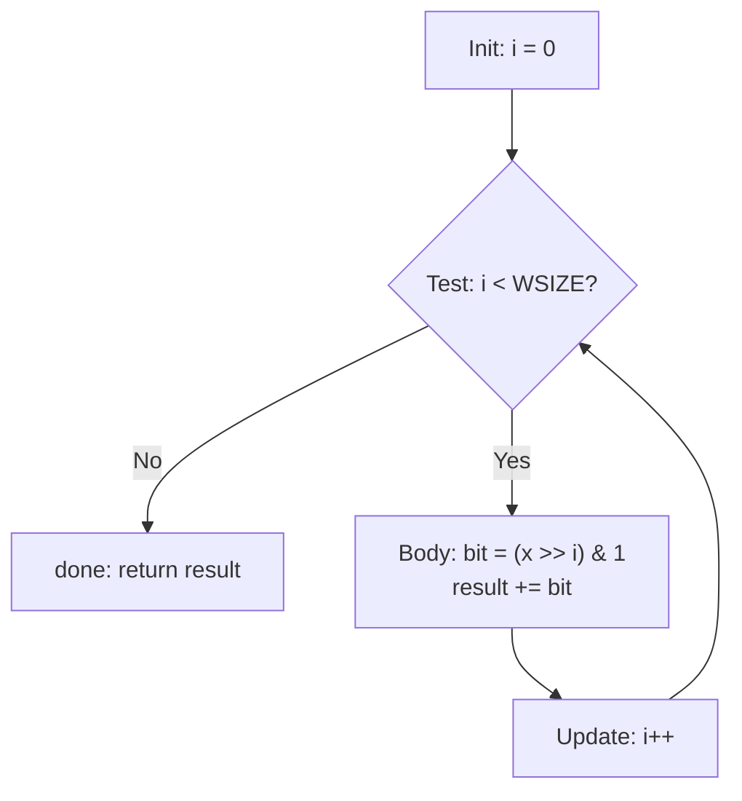

# Bài 6: Điều khiển luồng: Vòng lặp trong C và Assembly

---

## 1. Tổng quan về vòng lặp ở mức máy

Trong C, có ba dạng vòng lặp: `do-while`, `while`, và `for`. Tuy nhiên, ở mức mã máy (machine code), **không có instruction nào hỗ trợ trực tiếp** cho vòng lặp. Thay vào đó, trình biên dịch chuyển đổi tất cả các dạng vòng lặp thành tổ hợp các phép **kiểm tra điều kiện (test)** và **nhảy có điều kiện (conditional jump)**.

> **Quy trình chuyển đổi tổng quát:**
> `for` / `while` → `do-while` → `goto` + conditional jump → mã máy

---

## 2. Vòng lặp Do-While

### 2.1 Cấu trúc tổng quát

```c
// C Code
do {
    Body
} while (Test);
```

Tương đương với dạng `goto`:

```c
loop:
    Body
    if (Test) goto loop;
```

!!! note "Đặc điểm"
    Vòng lặp `do-while` **luôn thực hiện Body ít nhất một lần** trước khi kiểm tra điều kiện. Đây là lý do trình biên dịch ưa dùng nó làm dạng trung gian.

### 2.2 Ví dụ: Đếm số bit 1 (popcount)

```c
// C Code
int pcount_do(unsigned int x) {
    int result = 0;
    do {
        result += x & 0x1;   // lấy bit thấp nhất
        x >>= 1;              // dịch phải 1 bit
    } while (x);
    return result;
}
```

Chuyển sang dạng `goto`:

```c
int pcount_goto(unsigned int x) {
    int result = 0;
loop:
    result += x & 0x1;
    x >>= 1;
    if (x) goto loop;
    return result;
}
```

Assembly tương ứng (`%edx` = x, `%ecx` = result):

```nasm
    movl  $0, %ecx      ; result = 0
.L2:                    ; loop:
    movl  %edx, %eax
    andl  $1, %eax      ; t = x & 1
    addl  %eax, %ecx    ; result += t
    shrl  %edx          ; x >>= 1
    jne   .L2           ; if (x != 0) goto loop
```

!!! tip "Giải thích `shrl` + `jne`"
    - `shrl %edx` dịch phải `x` 1 bit, đồng thời cập nhật Zero Flag (ZF).
    - `jne .L2` nhảy về loop nếu ZF = 0, tức là `x != 0` sau khi dịch.

---

## 3. Vòng lặp While

### 3.1 Khác biệt với Do-While

| Đặc điểm | `do-while` | `while` |
|---|---|---|
| Kiểm tra điều kiện | Sau Body | Trước Body |
| Số lần thực hiện tối thiểu | 1 | 0 |

### 3.2 Dạng 1: "Nhảy vào giữa" (Jump-to-middle) — dùng với `-Og`

```c
// While version
while (Test)
    Body
```

Chuyển sang `goto`:

```c
    goto test;        // nhảy thẳng đến kiểm tra điều kiện
loop:
    Body
test:
    if (Test) goto loop;
done:
```

**Ví dụ popcount:**

```c
int pcount_goto_jtm(unsigned int x) {
    int result = 0;
    goto test;          // bắt đầu tại test
loop:
    result += x & 0x1;
    x >>= 1;
test:
    if (x) goto loop;
    return result;
}
```

### 3.3 Dạng 2: Chuyển sang Do-While — dùng với `-O1`

```c
// Dạng Do-While tương đương
if (!Test) goto done;    // kiểm tra trước, nếu sai thì bỏ qua
loop:
    Body
    if (Test) goto loop;
done:
```

**Ví dụ popcount:**

```c
int pcount_goto_dw(unsigned int x) {
    int result = 0;
    if (!x) goto done;    // thoát ngay nếu x = 0
loop:
    result += x & 0x1;
    x >>= 1;
    if (x) goto loop;
done:
    return result;
}
```

??? info "So sánh Dạng 1 và Dạng 2"
    - **Dạng 1** (jump-to-middle): đơn giản hơn, dùng ở mức tối ưu thấp (`-Og`). Chỉ cần thêm một `goto test` ở đầu.
    - **Dạng 2** (do-while): tối ưu hơn khi biên dịch với `-O1` vì tránh jump thừa, nhưng cần thêm một lần kiểm tra điều kiện ban đầu.

---

## 4. Vòng lặp For

### 4.1 Cấu trúc tổng quát

```c
for (Init; Test; Update)
    Body
```

Tương đương hoàn toàn với `while`:

```c
Init;
while (Test) {
    Body
    Update;
}
```

### 4.2 Ví dụ: popcount dùng for

```c
#define WSIZE 8*sizeof(int)   // = 32

int pcount_for(unsigned int x) {
    size_t i;
    int result = 0;
    for (i = 0; i < WSIZE; i++) {
        unsigned bit = (x >> i) & 0x1;
        result += bit;
    }
    return result;
}
```

Chuyển sang `while`:

```c
int pcount_for_while(unsigned int x) {
    size_t i;
    int result = 0;
    i = 0;
    while (i < WSIZE) {
        unsigned bit = (x >> i) & 0x1;
        result += bit;
        i++;
    }
    return result;
}
```

Chuyển tiếp sang `do-while` (goto version):

```c
int pcount_for_goto_dw(unsigned int x) {
    size_t i;
    int result = 0;
    i = 0;
    if (!(i < WSIZE)) goto done;   // Init xong, kiểm tra Test
loop:
    {
        unsigned bit = (x >> i) & 0x1;
        result += bit;
    }
    i++;                           // Update
    if (i < WSIZE) goto loop;      // Test
done:
    return result;
}
```



---

## 5. Ví dụ chuyển C → Assembly

### 5.1 Vòng lặp for với bước nhảy 2

```c
int func1(int a) {
    int sum = 0;
    for (int i = 0; i < a; i += 2)
        sum += (a - i);
    return sum;
}
```

Assembly (dạng jump-to-middle):

```nasm
; a ở 8(%ebp)
    movl  $0, -4(%ebp)      ; sum = 0
    movl  $0, -8(%ebp)      ; i = 0
    jmp   .test             ; nhảy đến kiểm tra điều kiện trước

.Loop:
    movl  8(%ebp), %eax     ; eax = a
    subl  -8(%ebp), %eax    ; eax = a - i
    addl  %eax, -4(%ebp)    ; sum += (a - i)
    addl  $2, -8(%ebp)      ; i += 2

.test:
    movl  8(%ebp), %eax     ; eax = a
    cmpl  -8(%ebp), %eax    ; so sánh a với i
    jg    .Loop             ; if (a > i) goto Loop
; return sum
```

!!! warning "Chú ý hướng của `cmpl` và `jg`"
    `cmpl src, dst` thực chất tính `dst - src` để set flags. Ở đây `cmpl -8(%ebp), %eax` tính `a - i`. Nếu `a > i` thì `jg` nhảy về Loop → tương đương điều kiện `i < a`.

---

## 6. Ví dụ đọc Assembly → C

### 6.1 Ví dụ 1

```nasm
; x at 8(%ebp)
    movl  $0, -4(%ebp)      ; count = 0
.L1:
    addl  $2, 8(%ebp)       ; x += 2
    incl  -4(%ebp)          ; count++
    cmpl  $9, 8(%ebp)       ; so sánh 9 với x
    jle   .L1               ; if (x <= 9) goto L1
    movl  -4(%ebp), %eax    ; return count
```

**Phân tích:**
- Không có `jmp` trước `.L1` → dạng `do-while` (body thực hiện trước)
- Điều kiện duy trì: `x <= 9`
- Body: `x += 2; count++`

```c
int count = 0;
do {
    x += 2;
    count++;
} while (x <= 9);
```

### 6.2 Ví dụ 2

```nasm
    movl  $0, -8(%ebp)      ; count = 0
    movl  $0, -4(%ebp)      ; i = 0
.L2:
    cmpl  $19, -4(%ebp)     ; so sánh 19 với i
    jg    .L3               ; if (i > 19) thoát
    movl  -4(%ebp), %eax
    addl  %eax, -8(%ebp)    ; count += i
    incl  -4(%ebp)          ; i++
    jmp   .L2               ; luôn nhảy về L2
.L3:
```

**Phân tích:**
- Có kiểm tra điều kiện **trước** body → dạng `while`
- Điều kiện dừng: `i > 19` → điều kiện duy trì: `i <= 19`, tức `i < 20`

```c
int count = 0;
for (int i = 0; i < 20; i++)
    count += i;
// hoặc tương đương:
int i = 0, count = 0;
while (i < 20) {
    count += i;
    i++;
}
```

### 6.3 Ví dụ 3

```nasm
    movl  $0, -8(%ebp)      ; count = 0
    movl  $0, -4(%ebp)      ; i = 0
.L1:
    cmpl  $25, -4(%ebp)
    jge   .L3               ; if (i >= 25) thoát
    movl  -4(%ebp), %eax    ; eax = i
    cmpl  -8(%ebp), %eax    ; so sánh i với count
    jg    .L2               ; if (i > count) bỏ qua addl
    addl  %eax, -8(%ebp)    ; count += i
.L2:
    subl  %eax, -8(%ebp)    ; count -= i  (luôn thực hiện)
    incl  -4(%ebp)          ; i++
    jmp   .L1
.L3:
```

!!! warning "Điểm tinh tế"
    Lệnh `subl %eax, -8(%ebp)` nằm ở `.L2` và **luôn được thực hiện** bất kể nhánh nào. Chỉ có `addl` mới là có điều kiện.

```c
int i = 0, count = 0;
while (i < 25) {
    if (i <= count)
        count += i;
    count -= i;
    i++;
}
```

### 6.4 Ví dụ 4 — Mảng ký tự

```nasm
; &a[0] at 8(%ebp), len at 12(%ebp)
    movl  $0, -8(%ebp)      ; result = 0
    movl  $0, -4(%ebp)      ; i = 0
    jmp   .L2
.L3:
    movl  -4(%ebp), %edx    ; edx = i
    movl  8(%ebp), %eax     ; eax = &a[0]
    addl  %edx, %eax        ; eax = &a[0] + i = &a[i]
    mov   (%eax), %al       ; al = a[i]  (1 byte, char)
    subl  $48, %eax         ; eax = a[i] - 48  (chuyển '0'-'9' → 0-9)
    addl  %eax, -8(%ebp)    ; result += a[i] - 48
    addl  $1, -4(%ebp)      ; i++
.L2:
    movl  -4(%ebp), %eax
    cmpl  12(%ebp), %eax    ; so sánh i với len
    jl    .L3               ; if (i < len) goto L3
    movl  -8(%ebp), %eax    ; return result
```

!!! info "Tại sao trừ 48?"
    Ký tự `'0'` có mã ASCII = 48. Trừ 48 để chuyển ký tự số (`'0'`→`'9'`) thành giá trị số nguyên (0→9). Đây là kỹ thuật phổ biến khi parse chuỗi số.

```c
int result = 0;
for (int i = 0; i < len; i++)
    result += a[i] - 48;
```

---

## 7. Câu hỏi trắc nghiệm (Ví dụ 5)

**Đề bài:** Cho đoạn assembly sau, chọn đoạn C tương ứng:

```nasm
; a at 8(%ebp), b at 12(%ebp), i at -4(%ebp), sum at -8(%ebp)
.L3:
    movl  8(%ebp), %eax     ; eax = a
    addl  12(%ebp), %eax    ; eax = a + b
    addl  %eax, -8(%ebp)    ; sum += (a + b)
    addl  $2, -4(%ebp)      ; i += 2
    cmpl  $10, -4(%ebp)     ; so sánh 10 với i
    jl    .L3               ; if (i < 10) goto L3
```

**Các lựa chọn:**

- **A.** `do { a += b; sum += a; i += 2; } while (i < 10);`
- **B.** `do { sum += a + b; i += 2; } while (i <= 10);`
- **C.** A và B đúng
- **D.** A và B sai

??? success "Đáp án và giải thích"
    **Đáp án: D — A và B đều sai.**

    **Phân tích assembly:**
    - `eax = a + b` rồi `sum += eax` → tức là `sum += (a + b)`. **Không có** `a += b`.
    - Điều kiện nhảy là `jl` (jump if less) tức `i < 10`. Kết hợp với `cmpl $10, -4(%ebp)` (tính `i - 10`), điều kiện duy trì là **`i < 10`** (không phải `i <= 10`).
    - Không có `jmp` trước `.L3` → đây là vòng `do-while`.

    **Mã C đúng:**
    ```c
    do {
        sum += a + b;
        i += 2;
    } while (i < 10);
    ```

    - **A sai** vì viết `a += b; sum += a` (thay đổi `a`) thay vì `sum += a + b`.
    - **B sai** vì điều kiện là `i <= 10` thay vì `i < 10`.

---

## 8. Extra: Các kỹ thuật nâng cao liên quan

### 8.1 Instruction SetX — Gán giá trị dựa trên điều kiện

Thay vì dùng jump để rẽ nhánh, có thể dùng `setX` để gán 0 hoặc 1 vào một byte dựa trên condition codes:

| Instruction | Điều kiện | Ý nghĩa |
|---|---|---|
| `sete` | ZF | Equal / Zero |
| `setne` | ~ZF | Not Equal |
| `setg` | ~(SF^OF)&~ZF | Greater (signed) |
| `setge` | ~(SF^OF) | Greater or Equal (signed) |
| `setl` | SF^OF | Less (signed) |
| `setle` | (SF^OF)\|ZF | Less or Equal (signed) |
| `seta` | ~CF&~ZF | Above (unsigned) |
| `setb` | CF | Below (unsigned) |

**Ví dụ:**

```c
int gt(long x, long y) {
    return x > y;
}
```

```nasm
    cmpq  %rsi, %rdi    ; so sánh x và y
    setg  %al           ; al = 1 nếu x > y, else 0
    movzbl %al, %eax    ; zero-extend al → eax (xóa 3 byte cao)
    ret
```

### 8.2 Conditional Move — Tránh phân nhánh

`cmovX` thực hiện move nếu điều kiện thỏa, giúp tránh pipeline stall do branch prediction.

```c
long absdiff(long x, long y) {
    return (x > y) ? (x - y) : (y - x);
}
```

```nasm
    movq  %rdi, %rax    ; result = x
    subq  %rsi, %rax    ; result = x - y
    movq  %rsi, %rdx
    subq  %rdi, %rdx    ; eval = y - x
    cmpq  %rsi, %rdi    ; so sánh x và y
    cmovle %rdx, %rax   ; nếu x <= y thì result = eval
    ret
```

!!! warning "Khi nào KHÔNG dùng conditional move"
    - **Tính toán phức tạp:** cả hai nhánh đều được tính → lãng phí nếu một nhánh tốn kém.
    - **Con trỏ null:** `val = p ? *p : 0` — nếu dùng `cmov` thì `*p` vẫn bị dereference dù `p = NULL` → crash.
    - **Tác động phụ (side effects):** `val = x > 0 ? x*=7 : x+=3` — cả hai đều thay đổi `x`, không thể thực hiện song song.
