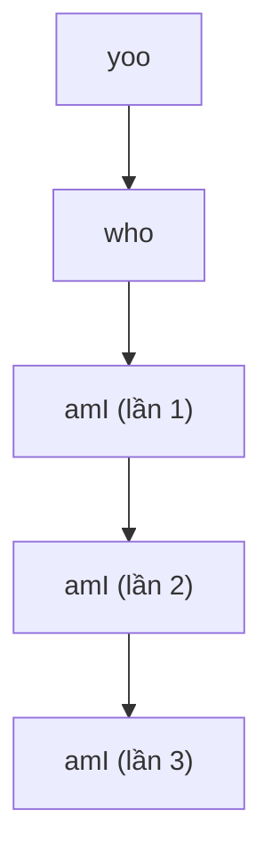

# Bài 7: Hàm/Thủ Tục (Procedures) ở Mức Máy

## 1. Tổng quan cơ chế gọi hàm

Khi một chương trình C gọi hàm, có **3 nhóm công việc** diễn ra ở mức assembly:

```
┌──────────────────────────────────────┐
│  1. Chuyển luồng thực thi            │
│     - Nhảy vào hàm được gọi          │
│     - Trở về đúng vị trí sau khi gọi │
├──────────────────────────────────────┤
│  2. Truyền dữ liệu                   │
│     - Đẩy tham số vào stack          │
│     - Nhận giá trị trả về (%eax)     │
├──────────────────────────────────────┤
│  3. Quản lý bộ nhớ                   │
│     - Cấp phát stack frame           │
│     - Thu hồi khi hàm kết thúc       │
└──────────────────────────────────────┘
```

> **Lưu ý:** IA32 và x86-64 có một số khác biệt trong cơ chế này, sẽ được trình bày riêng.

---

## 2. Cấu trúc Stack

### 2.1 Nguyên tắc hoạt động

Stack là vùng nhớ hoạt động theo nguyên tắc **LIFO (Last In, First Out)** — vào sau, ra trước.

!!! info "Đặc điểm quan trọng"
    - Stack **phát triển về phía địa chỉ thấp hơn** (đi xuống trong bộ nhớ)
    - Thanh ghi `%esp` (IA32) hoặc `%rsp` (x86-64) luôn trỏ đến **đỉnh stack** — tức địa chỉ thấp nhất đang dùng
    - "Bottom" của stack là địa chỉ cao nhất (nơi bắt đầu)

```
Địa chỉ cao  ┌─────────────────┐  ← Stack "Bottom"
             │      ...        │
             │   dữ liệu cũ   │
             ├─────────────────┤
             │   dữ liệu mới  │
             ├─────────────────┤  ← %esp (Stack Pointer)
             │   (trống)       │
Địa chỉ thấp └─────────────────┘  ← Stack "Top" (đỉnh hiện tại)
```

### 2.2 Lệnh PUSH

```asm
pushl Src    ; IA32 — push 4 bytes
```

**Quá trình thực hiện (3 bước):**

1. Lấy giá trị từ `Src`
2. Giảm `%esp` xuống **4 bytes** (`%esp -= 4`)
3. Ghi giá trị vào địa chỉ `(%esp)`

```asm
; Tương đương với:
subl $4, %esp
movl Src, (%esp)
```

### 2.3 Lệnh POP

```asm
popl Dest    ; IA32 — pop 4 bytes
```

**Quá trình thực hiện (3 bước):**

1. Lấy giá trị từ địa chỉ `(%esp)`
2. Ghi giá trị vào `Dest`
3. Tăng `%esp` lên **4 bytes** (`%esp += 4`)

```asm
; Tương đương với:
movl (%esp), Dest
addl $4, %esp
```

---

### 2.4 Ví dụ Push & Pop

??? example "Ví dụ 1: push rồi pop"

    **Trạng thái ban đầu:**
    ```
    %esp = 0x108
    %eax = 0x1234
    %ebx = 0xABCD
    Stack tại 0x108 = 123
    ```

    **Bước 1: `push %eax`**
    ```
    %esp giảm từ 0x108 → 0x104
    Stack[0x104] = 0x1234   (giá trị của %eax)
    %eax vẫn = 0x1234       (không đổi)
    ```

    **Bước 2: `pop %ebx`**
    ```
    %ebx = Stack[0x104] = 0x1234
    %esp tăng từ 0x104 → 0x108
    %eax vẫn = 0x1234       (không đổi)
    ```

??? example "Ví dụ 2: Phân biệt các dạng địa chỉ khi push"

    **Trạng thái ban đầu:**
    ```
    %esp = 0x108
    %eax = 0x104
    %ebx = 0xABCD
    
    Bộ nhớ:
      Địa chỉ 0x108 → 0xF0
      Địa chỉ 0x104 → 0xEF
      Địa chỉ 0x100 → 0xAB
    ```

    | Lệnh | Loại Src | Giá trị push vào stack |
    |---|---|---|
    | `push $0x100` | Hằng số (immediate) | `0x100` |
    | `push %eax` | Thanh ghi | `0x104` (giá trị của %eax) |
    | `push (%eax)` | Gián tiếp qua thanh ghi | `0xEF` (giá trị tại địa chỉ 0x104) |
    | `push 0x100` | Gián tiếp qua hằng | `0xAB` (giá trị tại địa chỉ 0x100) |

    !!! warning "Phân biệt `push $0x100` vs `push 0x100`"
        - `push $0x100` → push **hằng số** 256 vào stack
        - `push 0x100` → push **giá trị tại ô nhớ địa chỉ 0x100** vào stack

### 2.5 x86-64 Stack

Trong x86-64, tất cả hoạt động tương tự nhưng:

- Dùng thanh ghi **`%rsp`** thay vì `%esp`
- Lệnh `push`/`pop` thay đổi `%rsp` **8 bytes** (thay vì 4)

---

## 3. Gọi hàm trong IA32

### 3.1 Chuyển luồng thực thi

Mỗi hàm có một **địa chỉ bắt đầu** (entry point) trong bộ nhớ, thường gắn với một nhãn (label) trong assembly.

**Lệnh `call label`** — gọi hàm:

```asm
call label
; Thực chất tương đương:
push %eip        ; lưu địa chỉ lệnh tiếp theo vào stack
jmp label        ; nhảy đến hàm
```

**Lệnh `ret`** — trở về từ hàm:

```asm
ret
; Thực chất tương đương:
pop %eip         ; lấy địa chỉ trả về ra khỏi stack
jmp *%eip        ; nhảy về đó
```

!!! note "Địa chỉ trả về (Return Address)"
    Là địa chỉ của **lệnh assembly ngay sau lệnh `call`** trong hàm mẹ.

    Ví dụ:
    ```asm
    804854e:  e8 3d 06 00 00   call  8048b90 <main>
    8048553:  50               pushl %eax          ← Đây là địa chỉ trả về
    ```
    Khi hàm `main` kết thúc, chương trình sẽ quay về `0x8048553`.

---

### 3.2 Ví dụ minh hoạ call/ret trên stack

**Trước khi `call 8048b90`:**
```
%eip = 0x804854e
%esp = 0x108
Stack[0x108] = 123
```

**Sau khi thực hiện `call`:**
```
%esp = 0x104          (giảm 4)
Stack[0x104] = 0x8048553   (return address được push)
%eip = 0x8048b90      (nhảy vào main)
```

**Sau khi thực hiện `ret`:**
```
%eip = 0x8048553      (pop từ stack)
%esp = 0x108          (tăng 4)
; Tiếp tục thực thi từ 0x8048553
```

---

## 4. Stack Frame

### 4.1 Khái niệm Stack Frame

Mỗi hàm khi được gọi sẽ chiếm một vùng riêng trên stack gọi là **stack frame** (hay activation record). Frame được xác định bởi hai thanh ghi:

| Thanh ghi | Vai trò |
|---|---|
| `%ebp` (Frame Pointer) | Trỏ đến **đầu** frame — vị trí cố định trong suốt thời gian hàm chạy |
| `%esp` (Stack Pointer) | Trỏ đến **đỉnh** stack — thay đổi khi push/pop |

```
         ┌──────────────────┐
Caller   │   Arguments      │  ← Tham số truyền cho hàm con
Frame    │   Return Address │  ← Tự động push bởi lệnh call
         ├──────────────────┤  ← %ebp của frame hiện tại
Callee   │   Old %ebp       │  ← Frame pointer của hàm mẹ (được lưu)
Frame    │   Saved Regs     │  ← Các thanh ghi cần bảo toàn
         │   Local Vars     │  ← Biến cục bộ của hàm
         │   Arg Build      │  ← Tham số để gọi hàm khác (nếu có)
         └──────────────────┘  ← %esp
```

### 4.2 Quy tắc vòng đời Stack Frame

!!! info "Vòng đời frame"
    - Frame **tạo ra** khi hàm được gọi
    - Frame **thu hồi** khi hàm kết thúc (ret)
    - Frame tạo sau nằm ở **địa chỉ thấp hơn**
    - Hàm kết thúc trước thì frame bị thu hồi trước (**LIFO**)

---

### 4.3 Set-up và Finish Code

Mỗi hàm có phần đầu (**set-up**) và phần cuối (**finish**) để thiết lập/thu hồi stack frame:

**Set-up (đầu hàm):**
```asm
pushl %ebp          ; lưu frame pointer của hàm mẹ
movl  %esp, %ebp    ; thiết lập frame pointer cho hàm hiện tại
subl  $N, %esp      ; cấp phát N bytes cho biến cục bộ
pushl %ebx          ; lưu các thanh ghi callee-saved (nếu dùng)
```

**Finish (cuối hàm):**
```asm
popl  %ebx          ; khôi phục các thanh ghi đã lưu
; addl $N, %esp     ; thu hồi không gian biến cục bộ
; popl %ebp         ; hoặc dùng lệnh 'leave' thay cho 2 dòng trên
leave               ; tương đương: movl %ebp, %esp  +  popl %ebp
ret
```

!!! tip "Lệnh `leave`"
    `leave` là viết tắt của 2 lệnh:
    ```asm
    movl %ebp, %esp   ; khôi phục %esp về đầu frame
    popl %ebp         ; khôi phục %ebp của hàm mẹ
    ```

---

### 4.4 Ví dụ hoàn chỉnh

```c
int main() {
    int result = func(5, 6);
    return result;
}

int func(int x, int y) {
    int sum = 0;
    sum = x + y;
    return sum;
}
```

```asm
main:
    pushl  %ebp          ; set-up: lưu old %ebp
    movl   %esp, %ebp    ; set-up: thiết lập %ebp
    subl   $16, %esp     ; cấp phát 16 bytes cho biến cục bộ
    pushl  $6            ; đẩy tham số 2 (y=6) vào stack
    pushl  $5            ; đẩy tham số 1 (x=5) vào stack
    call   func          ; gọi hàm func (push return addr + jmp)
    addl   $8, %esp      ; dọn dẹp 2 tham số (2 x 4 bytes)
    movl   %eax, -4(%ebp); lưu giá trị trả về vào biến result
    movl   -4(%ebp), %eax; đặt return value của main vào %eax
    leave               ; finish: khôi phục %esp và %ebp
    ret

func:
    pushl  %ebp          ; set-up
    movl   %esp, %ebp
    subl   $16, %esp     ; cấp phát cho biến 'sum'
    movl   $0, -4(%ebp)  ; sum = 0
    movl   8(%ebp), %edx ; lấy x (tham số 1, offset +8 từ %ebp)
    movl   12(%ebp), %eax; lấy y (tham số 2, offset +12 từ %ebp)
    addl   %edx, %eax    ; eax = x + y
    movl   %eax, -4(%ebp); sum = x + y
    movl   -4(%ebp), %eax; chuẩn bị return value
    leave
    ret
```

---

## 5. Truyền Tham Số

### 5.1 Quy tắc truyền tham số trong IA32

- Hàm mẹ **push tham số lên stack** trước khi `call`, theo thứ tự **ngược** (tham số cuối push trước)
- Hàm con truy xuất tham số qua **offset tương đối từ `%ebp`**:

| Offset | Nội dung |
|---|---|
| `%ebp + 0` | Old %ebp (đã lưu) |
| `%ebp + 4` | Return address |
| `%ebp + 8` | **Tham số 1** |
| `%ebp + 12` | **Tham số 2** |
| `%ebp + 16` | Tham số 3 |
| `%ebp + 4*(n+1)` | Tham số thứ n |

### 5.2 Ví dụ: Hàm `swap`

```c
void swap(int *xp, int *yp) {
    int t0 = *xp;
    int t1 = *yp;
    *xp = t1;
    *yp = t0;
}
```

```asm
swap:
    pushl %ebp           ; set-up
    movl  %esp, %ebp
    pushl %ebx           ; lưu %ebx (callee-saved)

    movl  8(%ebp),  %edx ; edx = xp  (địa chỉ của x)
    movl  12(%ebp), %ecx ; ecx = yp  (địa chỉ của y)
    movl  (%edx),   %ebx ; ebx = *xp = t0
    movl  (%ecx),   %eax ; eax = *yp = t1
    movl  %eax, (%edx)   ; *xp = t1
    movl  %ebx, (%ecx)   ; *yp = t0

    popl  %ebx           ; finish: khôi phục %ebx
    popl  %ebp
    ret
```

---

## 6. Giá Trị Trả Về

Giá trị trả về của hàm (kiểu số nguyên/con trỏ) luôn được đặt vào **thanh ghi `%eax`** trước khi `ret`.

```c
int func(int x, int y) { return x + y; }
```

```asm
func:
    pushl %ebp
    movl  %esp, %ebp
    movl  8(%ebp),  %edx
    movl  12(%ebp), %eax
    addl  %edx, %eax    ; eax = x + y  ← đây là return value
    popl  %ebp
    ret
```

---

## 7. Quản lý Thanh Ghi

### 7.1 Vấn đề chia sẻ thanh ghi

Vì hàm mẹ và hàm con dùng **chung** tập thanh ghi, cần có quy ước ai chịu trách nhiệm lưu giá trị.

### 7.2 Caller-Save vs Callee-Save

```
Caller-Save (hàm mẹ tự lưu trước khi gọi):
  %eax  — cũng là register chứa return value
  %edx
  %ecx

Callee-Save (hàm con lưu nếu muốn dùng):
  %ebx
  %esi
  %edi

Special (bắt buộc khôi phục):
  %esp  — stack pointer
  %ebp  — frame pointer
```

!!! warning "Quy tắc Callee-Save"
    Nếu hàm con muốn dùng `%ebx`, `%esi`, hay `%edi`, phải **push** chúng khi vào hàm và **pop** khi ra. Đây là lý do ta thấy `pushl %ebx` trong phần set-up của nhiều hàm.

---

## 8. Biến Cục Bộ

Biến cục bộ được cấp phát ngay trên stack frame của hàm, ở **địa chỉ thấp hơn `%ebp`**:

```asm
subl $24, %esp      ; cấp phát 24 bytes cho biến cục bộ
```

Truy xuất:
```asm
movl %eax, -4(%ebp)   ; lưu vào biến cục bộ đầu tiên
movl -8(%ebp), %edx   ; đọc biến cục bộ thứ hai
```

---

## 9. Gọi Hàm trong x86-64

Sự khác biệt chính so với IA32:

| Đặc điểm | IA32 | x86-64 |
|---|---|---|
| Stack pointer | `%esp` | `%rsp` |
| Frame pointer | `%ebp` | `%rbp` |
| Đơn vị push/pop | 4 bytes | 8 bytes |
| Truyền tham số | Qua stack | **6 tham số đầu qua thanh ghi** (`%rdi`, `%rsi`, `%rdx`, `%rcx`, `%r8`, `%r9`), còn lại mới dùng stack |
| Return value | `%eax` | `%rax` |

---

## 10. Minh Hoạ Hàm Đệ Quy (Call Chain)

Giả sử chuỗi gọi: `yoo → who → amI → amI → amI`



Stack tương ứng sẽ có dạng (địa chỉ giảm dần xuống dưới):

```
┌─────────────┐  ← địa chỉ cao (bottom)
│  Frame: yoo │
├─────────────┤
│  Frame: who │
├─────────────┤
│ Frame: amI  │  (lần 1)
├─────────────┤
│ Frame: amI  │  (lần 2)
├─────────────┤
│ Frame: amI  │  (lần 3)  ← %esp trỏ vào đây (top)
└─────────────┘  ← địa chỉ thấp
```

!!! info "Hàm đệ quy và stack"
    Mỗi lần hàm `amI` tự gọi lại, một stack frame **mới** được tạo. Khi mỗi lần đệ quy kết thúc, frame tương ứng bị thu hồi theo thứ tự ngược lại. Đây là lý do **stack overflow** xảy ra khi đệ quy quá sâu — stack bị cạn kiệt.

---

## 11. Bài Tập Tổng Hợp

### Câu hỏi

Cho đoạn assembly sau:

```asm
main:
    pushl  %ebp
    movl   %esp, %ebp
    subl   $16, %esp
    movl   $1,  -4(%ebp)    ; biến a = 1
    movl   $2,  -8(%ebp)    ; biến b = 2
    movl   $0,  -12(%ebp)   ; biến c = 0
    pushl  -4(%ebp)          ; push a (= 1)  → tham số 2 của function
    pushl  -8(%ebp)          ; push b (= 2)  → tham số 1 của function
    call   function
    addl   $8, %esp
    movl   %eax, -12(%ebp)  ; c = return value
    movl   $0, %eax
    leave
    ret

function:
    pushl  %ebp
    movl   %esp, %ebp
    subl   $16, %esp
    movl   $10, -4(%ebp)           ; a = 10
    movl   -4(%ebp), %edx          ; edx = 10
    movl   8(%ebp),  %eax          ; eax = x (tham số 1 = 2)
    addl   %eax, %edx              ; edx = 10 + 2 = 12
    movl   12(%ebp), %eax          ; eax = y (tham số 2 = 1)
    imull  %edx, %eax              ; eax = 12 * 1 = 12
    movl   %eax, -8(%ebp)          ; result = 12
    movl   -8(%ebp), %eax          ; return value = 12
    leave
    ret
```

### Đáp án

??? question "1. Hàm nào là caller/callee?"
    - **`main`** là caller (hàm mẹ)
    - **`function`** là callee (hàm con)

??? question "2. Mỗi hàm có bao nhiêu biến cục bộ?"
    - `main`: 3 biến — giá trị lần lượt là **1, 2, 0** (biến thứ 3 sẽ được ghi kết quả sau)
    - `function`: 2 biến — biến đầu `a = 10`, biến thứ 2 lưu kết quả tính toán

??? question "3. Hàm function nhận bao nhiêu tham số?"
    **2 tham số**, truy cập tại:
    - `%ebp + 8` → tham số 1 (x)
    - `%ebp + 12` → tham số 2 (y)

??? question "4. Main truyền giá trị bao nhiêu cho function?"
    Lưu ý thứ tự push là **ngược**: push tham số 2 trước, tham số 1 sau.
    ```asm
    pushl -4(%ebp)   ; push a = 1   → đây là y (tham số 2, ở ebp+12)
    pushl -8(%ebp)   ; push b = 2   → đây là x (tham số 1, ở ebp+8)
    ```
    - Tham số 1 (x) = **2**
    - Tham số 2 (y) = **1**

??? question "5. function làm gì? Kết quả trả về là bao nhiêu?"
    `function(x, y)` tính `(x + 10) * y`:
    ```
    edx = 10 + x = 10 + 2 = 12
    eax = edx * y = 12 * 1 = 12
    ```
    **Giá trị trả về = 12**, được lưu vào `%eax` và sau đó `main` gán vào biến `c`.

---

> **Tổng kết:** Stack đóng vai trò trung tâm trong cơ chế gọi hàm ở mức máy — lưu địa chỉ trả về, tham số, biến cục bộ và frame pointer. Hiểu rõ cơ chế này là nền tảng để học buffer overflow, debugging, và reverse engineering.
