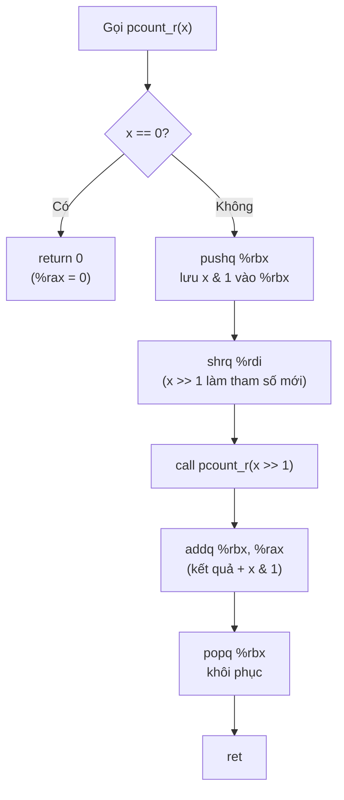
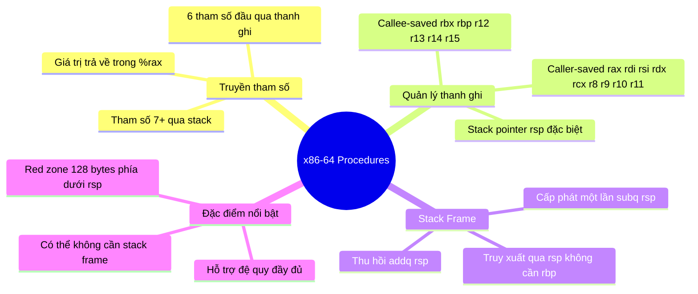

# Bài 8: Machine-Level Programming: Procedures (Hàm/Thủ Tục) x86-64

---

## 1. Tổng quan về Hàm trong IA32 và x86-64

Cả hai kiến trúc đều dùng chung cơ chế gọi hàm dựa trên stack:

- **Stack** hỗ trợ việc gọi/trở về từ hàm.
- Sử dụng lệnh `call` và `ret`.
- Khi `call` được thực thi, **địa chỉ trả về** (return address — địa chỉ câu lệnh assembly ngay *sau* lệnh `call`) được đẩy vào stack.
- Trong x86-64, địa chỉ trả về có kích thước **8 bytes** (64-bit).

---

## 2. Stack trong x86-64

```
Địa chỉ cao (Bottom)
┌─────────────────┐
│                 │
│   Stack Frame   │  ← Stack phát triển đi XUỐNG
│                 │
└─────────────────┘
Địa chỉ thấp (Top)  ← %rsp trỏ vào đây
```

- **`%rsp`** (Stack Pointer): luôn trỏ vào đỉnh stack (địa chỉ thấp nhất đang dùng).
- Lệnh `push`: `%rsp -= 8`, rồi ghi dữ liệu vào `(%rsp)`.
- Lệnh `pop`: đọc dữ liệu từ `(%rsp)`, rồi `%rsp += 8`.

---

## 3. Thanh ghi x86-64

x86-64 có **16 thanh ghi đa năng** (gấp đôi IA32), mỗi thanh ghi có thể truy xuất với các kích thước 8, 16, 32, 64-bit:

| 64-bit | 32-bit | Vai trò |
|--------|--------|---------|
| `%rax` | `%eax` | Giá trị trả về (Return value) |
| `%rbx` | `%ebx` | Callee-saved |
| `%rcx` | `%ecx` | Tham số thứ 4 |
| `%rdx` | `%edx` | Tham số thứ 3 |
| `%rsi` | `%esi` | Tham số thứ 2 |
| `%rdi` | `%edi` | Tham số thứ 1 |
| `%rsp` | `%esp` | Stack pointer (đặc biệt) |
| `%rbp` | `%ebp` | Callee-saved / Frame pointer tuỳ chọn |
| `%r8`  | `%r8d` | Tham số thứ 5 |
| `%r9`  | `%r9d` | Tham số thứ 6 |
| `%r10` | `%r10d`| Caller-saved |
| `%r11` | `%r11d`| Caller-saved |
| `%r12`–`%r15` | `%r12d`–`%r15d` | Callee-saved |

---

## 4. Quy ước truyền tham số và trả về giá trị

### 4.1 Truyền tham số

x86-64 **ưu tiên dùng thanh ghi** thay vì stack để truyền tham số (khác hoàn toàn IA32):

```
Tham số 1  →  %rdi
Tham số 2  →  %rsi
Tham số 3  →  %rdx
Tham số 4  →  %rcx
Tham số 5  →  %r8
Tham số 6  →  %r9
Tham số 7+ →  Stack (theo thứ tự ngược)
```

### 4.2 Giá trị trả về

- Giá trị trả về luôn nằm trong **`%rax`**.

---

## 5. Quy ước Caller-saved vs Callee-saved

!!! info "Caller-saved (Hàm mẹ chịu trách nhiệm)"
    Nếu hàm mẹ cần giữ giá trị của các thanh ghi này **sau khi** gọi hàm con, hàm mẹ phải tự lưu trước khi `call`:
    - `%rax`, `%rdi`, `%rsi`, `%rdx`, `%rcx`, `%r8`, `%r9` (thanh ghi tham số)
    - `%r10`, `%r11`

!!! warning "Callee-saved (Hàm con chịu trách nhiệm)"
    Hàm con **bắt buộc** phải lưu lại và khôi phục về giá trị ban đầu trước khi `ret`:
    - `%rbx`, `%rbp`, `%r12`, `%r13`, `%r14`, `%r15`
    - `%rsp` (trường hợp đặc biệt — luôn phải khôi phục khi thoát hàm)

---

## 6. Cấu trúc Stack Frame x86-64

```
┌──────────────────────┐  ← Caller's %rsp trước khi call
│  Tham số 7, 8, ...   │  (nếu có > 6 tham số)
├──────────────────────┤
│   Return Address     │  ← do lệnh call đẩy vào (8 bytes)
├──────────────────────┤  ← %rbp (tuỳ chọn, nếu dùng frame pointer)
│  Old %rbp (tuỳ chọn) │
├──────────────────────┤
│  Callee-saved regs   │  ← %rbx, %r12, ... được lưu tại đây
├──────────────────────┤
│   Local Variables    │  ← biến cục bộ không vừa thanh ghi
├──────────────────────┤
│   Argument Build     │  ← tham số 7+ chuẩn bị cho hàm cháu
└──────────────────────┘  ← %rsp hiện tại
```

!!! tip "Điểm đặc biệt của x86-64 so với IA32"
    - Toàn bộ frame được cấp phát **một lần duy nhất** bằng cách trừ `%rsp`.
    - Mọi truy xuất trên stack đều **tương đối theo `%rsp`**, không cần frame pointer `%rbp`.
    - Thu hồi frame chỉ đơn giản là **cộng lại `%rsp`**.
    - Nhờ 16 thanh ghi, nhiều hàm đơn giản **không cần stack frame** nào cả.

---

## 7. Ví dụ minh họa từng bước

### 7.1 Hàm `swap_l` — Không cần stack frame

```c
void swap_l(long *xp, long *yp) {
    long t0 = *xp;
    long t1 = *yp;
    *xp = t1;
    *yp = t0;
}
```

```asm
swap:
    movq  (%rdi), %rdx   ; t0 = *xp  (xp ở %rdi, tham số 1)
    movq  (%rsi), %rax   ; t1 = *yp  (yp ở %rsi, tham số 2)
    movq  %rax, (%rdi)   ; *xp = t1
    movq  %rdx, (%rsi)   ; *yp = t0
    ret
```

> Toàn bộ thông tin lưu trong thanh ghi → **không cần stack frame**.

---

### 7.2 Hàm `call_incr` — Biến cục bộ cần địa chỉ

```c
long call_incr() {
    long v1 = 15213;
    long v2 = incr(&v1, 3000);
    return v1 + v2;
}
```

```asm
call_incr:
    subq  $16, %rsp          ; Cấp phát 16 bytes trên stack
    movq  $15213, 8(%rsp)    ; v1 = 15213, lưu tại %rsp+8
    movl  $3000, %esi        ; Tham số 2: val = 3000
    leaq  8(%rsp), %rdi      ; Tham số 1: &v1
    call  incr               ; gọi incr(&v1, 3000)
    addq  8(%rsp), %rax      ; return v1 + v2  (v2 = %rax từ incr)
    addq  $16, %rsp          ; Thu hồi stack frame
    ret
```

??? note "Tại sao phải lưu `v1` lên stack?"
    Hàm `incr` cần **địa chỉ** của `v1` (con trỏ `&v1`). Thanh ghi không có địa chỉ — chỉ vùng nhớ (stack, heap, data segment) mới có. Vì vậy `v1` buộc phải nằm trên stack để lấy địa chỉ truyền đi.

---

### 7.3 Stack Frame phức tạp: `swap_ele_su`

```c
long sum = 0;
void swap_ele_su(long a[], int i) {
    swap(&a[i], &a[i+1]);
    sum += (a[i] * a[i+1]);
}
```

```asm
swap_ele_su:
    movq   %rbx, -16(%rsp)    ; Lưu %rbx xuống stack (trước khi giảm %rsp)
    movq   %rbp, -8(%rsp)     ; Lưu %rbp xuống stack
    subq   $16, %rsp          ; Cấp phát frame (bây giờ vùng lưu ở 0(%rsp) và 8(%rsp))

    movslq %esi, %rax         ; Mở rộng i từ 32-bit → 64-bit
    leaq   8(%rdi,%rax,8), %rbx  ; %rbx = &a[i+1]  (callee-saved!)
    leaq   (%rdi,%rax,8),  %rbp  ; %rbp = &a[i]    (callee-saved!)

    movq   %rbx, %rsi         ; Tham số 2: &a[i+1]
    movq   %rbp, %rdi         ; Tham số 1: &a[i]
    call   swap

    movq   (%rbx), %rax       ; a[i+1]
    imulq  (%rbp), %rax       ; a[i] * a[i+1]
    addq   %rax, sum(%rip)    ; sum += ...  (biến global, RIP-relative)

    movq   (%rsp),   %rbx     ; Khôi phục %rbx
    movq   8(%rsp),  %rbp     ; Khôi phục %rbp
    addq   $16, %rsp          ; Thu hồi frame
    ret
```

!!! warning "Lưu ý thứ tự lưu/khôi phục callee-saved"
    Trick ở đây: hàm **lưu `%rbx`, `%rbp` vào vùng nhớ phía dưới `%rsp` hiện tại** (tức là `−16(%rsp)` và `−8(%rsp)`) **trước khi** `subq $16, %rsp`. Sau khi `subq`, hai ô đó trở thành `0(%rsp)` và `8(%rsp)`. Đây là cách tận dụng vùng "red zone" ngầm định của x86-64 Linux ABI.

---

## 8. Hàm đệ quy — `pcount_r`

### 8.1 Phiên bản IA32

```c
int pcount_r(unsigned x) {
    if (x == 0) return 0;
    else return (x & 1) + pcount_r(x >> 1);
}
```

```asm
pcount_r:
    pushl  %ebp
    movl   %esp, %ebp
    pushl  %ebx            ; Lưu %ebx (callee-saved)
    subl   $4, %esp        ; Cấp phát 4 bytes cho tham số đệ quy

    movl   8(%ebp), %ebx   ; %ebx = x
    movl   $0, %eax        ; %eax = 0 (chuẩn bị return 0)
    testl  %ebx, %ebx
    je     .L3             ; if (x == 0) goto .L3

    movl   %ebx, %eax
    shrl   %eax            ; %eax = x >> 1
    movl   %eax, (%esp)    ; Đẩy (x>>1) lên stack làm tham số
    call   pcount_r        ; Đệ quy

    movl   %ebx, %edx
    andl   $1, %edx        ; %edx = x & 1
    leal   (%edx,%eax), %eax  ; %eax = (x&1) + pcount_r(x>>1)
.L3:
    addl   $4, %esp
    popl   %ebx
    popl   %ebp
    ret
```

---

### 8.2 Phiên bản x86-64 (gọn hơn nhiều!)

```asm
pcount_r:
    movl   $0, %eax        ; Return value = 0 (trường hợp x==0)
    testq  %rdi, %rdi
    je     .L6             ; if (x == 0) return 0

    pushq  %rbx            ; Lưu %rbx (callee-saved)
    movq   %rdi, %rbx      ; %rbx = x  (giữ x qua lời gọi đệ quy)
    andl   $1, %ebx        ; %rbx = x & 1
    shrq   %rdi            ; %rdi = x >> 1  (tham số cho đệ quy)
    call   pcount_r        ; Đệ quy → kết quả ở %rax
    addq   %rbx, %rax      ; %rax = pcount_r(x>>1) + (x&1)
    popq   %rbx            ; Khôi phục %rbx
.L6:
    rep; ret
```

??? note "Tại sao dùng `rep; ret` thay vì `ret` thuần?"
    Đây là workaround cho một lỗi dự đoán nhánh (branch misprediction) trên CPU AMD Opteron cũ khi `ret` nằm ngay sau lệnh nhảy. Về mặt chức năng, `rep` không làm gì trong ngữ cảnh này — chỉ là padding 1 byte.

---

#### Luồng thực thi đệ quy theo từng bước:



---

## 9. Bài tập có giải

### Bài 1.1 — Đọc assembly IA32, viết lại C

```asm
.LC0: .string "%d"
.LC1: .string "%d %d"
example:
    pushl  %ebp
    movl   %esp, %ebp
    subl   $8, %esp
    movl   $5,  -4(%ebp)    ; a = 5
    movl   $10, -8(%ebp)    ; b = 10
    leal   -8(%ebp), %eax
    pushl  %eax
    pushl  $.LC0
    call   scanf             ; scanf("%d", &b)
    addl   $8, %esp
    movl   -8(%ebp), %eax
    pushl  -4(%ebp)
    pushl  %eax
    pushl  $.LC1
    call   printf            ; printf("%d %d", b, a)
    addl   $12, %esp
    movl   $0, %eax
    leave
    ret
```

??? success "Đáp án — Code C tương đương"
    ```c
    int example() {
        int a = 5;
        int b = 10;
        scanf("%d", &b);
        printf("%d %d", b, a);
        return 0;
    }
    ```
    **Phân tích:**
    - `-4(%ebp)` = `a = 5`, `-8(%ebp)` = `b = 10`
    - `scanf`: push `&b` rồi `"%d"` → `scanf("%d", &b)`
    - `printf`: push `a`, `b`, `"%d %d"` (thứ tự ngược trên stack) → `printf("%d %d", b, a)`

---

### Bài 1.2 — Vẽ stack khi gọi `scanf`

**Giả sử:** Trước dòng `pushl %ebp`: `%esp = 0x100`, `%ebp = 0x120`

```
Địa chỉ   | Nội dung
----------+------------------
0x120     | (old %ebp frame trước)
0x11C     | Return addr of example
0x118     | ← %ebp sau dòng 5 (movl %esp,%ebp)
0xFC      | a = 5           (−4(%ebp))
0xF8      | b = 10          (−8(%ebp))
0xF4      | ← %esp sau subl $8
          |
--- Sau push &b và push $.LC0: ---
0xF0      | &b = 0xF8
0xEC      | $.LC0 ("%%d")
0xE8      | Return addr of scanf  ← %esp khi vào scanf
```

---

### Bài 2.1 — Phân tích chuỗi từ hằng số hex

```asm
movl $0x74746E61, -8(%ebp)
```

??? success "Phân tích"
    - `0x74746E61` là 4 bytes.
    - Trong **Little Endian**, byte thấp ở địa chỉ thấp:
      - `0x61` → `'a'`, `0x6E` → `'n'`, `0x74` → `'t'`, `0x74` → `'t'`
    - Đọc theo thứ tự địa chỉ tăng dần: **`"antt"`**

    ```c
    int my_function() {
        int a = 256;
        char b[4] = "antt";
        printf("%s", b);
        return 0;
    }
    ```

---

### Bài 3.1 — Đọc assembly, xác định biến cục bộ và lời gọi hàm

```asm
sub  $0x40, %esp
movl $0x04030201, 0x3c(%esp)   ; a = 0x04030201  tại %ebp-4
movl $0x0,        0x38(%esp)   ; b = 0            tại %ebp-8
; fgets(buf, 50, stdin)
mov  0x0804a02c, %eax          ; stdin
mov  %eax, 0x8(%esp)           ; tham số 3
movl $0x32, 0x4(%esp)          ; tham số 2: 50 (0x32)
lea  0x10(%esp), %eax
mov  %eax, (%esp)              ; tham số 1: &buf
call fgets
; printf("\n[buf]: %s\n", buf)
lea  0x10(%esp), %eax
mov  %eax,         0x4(%esp)   ; tham số 2: buf
movl $0x8048610,   (%esp)      ; tham số 1: chuỗi format
call printf
```

??? success "Đáp án — Code C"
    ```c
    int main() {
        int a = 0x04030201;
        int b = 0;
        char buf[48];              // tại 0x10(%esp), kích thước 0x28 = 40 bytes
        fgets(buf, 50, stdin);
        printf("\n[buf]: %s\n", buf);
    }
    ```

---

## 10. Tóm tắt x86-64 Procedures


