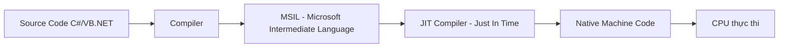
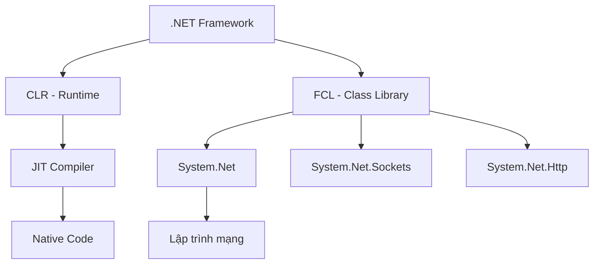

# Chương 1: Internet & Lập trình mạng với .NET

## 1. Giới thiệu

Môn học tập trung vào khả năng phát triển ứng dụng mạng hiện đại, bao gồm ba yếu tố cốt lõi:

- **Bảo mật (Security):** Ứng dụng mạng phải đảm bảo dữ liệu không bị đánh cắp hoặc giả mạo trong quá trình truyền.
- **Hiệu suất (Performance):** Tối ưu băng thông, giảm độ trễ, xử lý đồng thời nhiều kết nối.
- **Linh hoạt (Flexibility):** Thiết kế module hoá để dễ mở rộng, bảo trì.

---

## 2. Tại sao chọn .NET?

.NET được chọn vì:

- Hỗ trợ lập trình mạng mạnh mẽ nhất trong hệ sinh thái Microsoft.
- **Đa nền tảng (Cross-platform):** .NET Core/.NET 5+ chạy trên Windows, Linux, macOS.
- Cung cấp nhiều namespace chuyên biệt: `System.Net`, `System.Net.Sockets`, `System.Net.Http`, v.v.

!!! note "Lưu ý"
    .NET không phải ngôn ngữ lập trình. Nó là một **framework/runtime** hỗ trợ nhiều ngôn ngữ như C#, VB.NET, F#.

---

## 3. Địa chỉ IP

### 3.1 Khái niệm cơ bản

Mỗi máy tính kết nối trực tiếp vào Internet phải có một **địa chỉ IP (Internet Protocol)** duy nhất. Địa chỉ IP phiên bản 4 (IPv4) có dạng 4 octet, ví dụ: `192.168.0.1`.

| Loại | Mô tả | Ví dụ |
|---|---|---|
| Public IP | Nhìn thấy từ Internet | `81.98.59.133` |
| Private IP | Chỉ dùng nội bộ (LAN) | `192.168.0.1` |
| Loopback | Máy tự nói chuyện với chính mình | `127.0.0.1` |

!!! warning "Lưu ý về Loopback"
    Nếu máy nhận địa chỉ `127.0.0.1`, nó **không kết nối vào Internet** — đây là địa chỉ loopback, chỉ dùng để test nội bộ trên chính máy đó.

### 3.2 Dải địa chỉ Private (RFC 1918)

```
Class A: 10.0.0.0     – 10.255.255.255
Class B: 172.16.0.0   – 172.31.255.255
Class C: 192.168.0.0  – 192.168.255.255
```

Các máy dùng private IP **phải** đi qua ít nhất một thiết bị NAT (Network Address Translation) để ra Internet.

### 3.3 Địa chỉ động và MAC Address

- Địa chỉ IP có thể thay đổi nếu được cấp bởi **DHCP server**.
- **MAC Address** (Media Access Control) là địa chỉ vật lý gắn với card mạng — duy nhất và không thay đổi.

---

## 4. Network Stack

### 4.1 Mô hình OSI cổ điển (7 tầng)

```
7 – Application    → FTP, HTTP, SMTP
6 – Presentation   → XNS, SSL/TLS
5 – Session        → RPC
4 – Transport      → TCP, UDP
3 – Network        → IP
2 – Data Link      → Ethernet frames
1 – Physical       → Tín hiệu điện/quang
```

### 4.2 Mô hình hiện đại (4 tầng — thực tế lập trình)

```
4 – Structured Information  → SOAP, REST/JSON
3 – Message                 → HTTP, WebSocket
2 – Stream                  → TCP
1 – Packet                  → IP
```

!!! tip "Quan điểm của lập trình viên"
    Lập trình viên ứng dụng **không cần quan tâm** tầng 1-2 (vật lý, data link). Công việc thực sự bắt đầu từ tầng TCP/IP trở lên.

---

## 5. Ports

Một máy tính có thể chạy **nhiều ứng dụng mạng đồng thời**. Port number là cơ chế phân biệt ứng dụng nào nhận dữ liệu nào. Thông tin port nằm trong header của TCP/UDP packet.

| Port | Giao thức | Mô tả |
|---|---|---|
| 20/21 | FTP | Truyền file (data/control) |
| 25 | SMTP | Gửi email |
| 53 | DNS | Phân giải tên miền |
| 80 | HTTP | Web |
| 110 | POP3 | Nhận email |
| 143 | IMAP | Nhận email (có sync) |
| 443 | HTTPS | Web bảo mật |

---

## 6. Internet Standards & RFC

Hai tổ chức chính định nghĩa các chuẩn Internet:

- **IETF** (Internet Engineering Task Force) → định nghĩa **RFC** (Request for Comments).
- **W3C** (World Wide Web Consortium) → định nghĩa HTML, XML, CSS.

| RFC | Giao thức | Chức năng |
|---|---|---|
| RFC 791 | IP | Giao thức nền tảng Internet |
| RFC 793 | TCP | Truyền tin cậy, có kết nối |
| RFC 792 | ICMP | Ping, kiểm tra kết nối |
| RFC 821 | SMTP | Gửi email |
| RFC 959 | FTP | Upload/download file |
| RFC 1939 | POP3 | Nhận email |
| RFC 2616 | HTTP | Duyệt web |

---

## 7. .NET Framework — Kiến trúc

### 7.1 Tổng quan

.NET Framework bao gồm hai thành phần cốt lõi:

```
┌────────────────────────────────────────┐
│         Ngôn ngữ lập trình             │
│   C#    VB.NET    F#    C++/CLI        │
├────────────────────────────────────────┤
│   Framework Class Library (FCL)        │
├────────────────────────────────────────┤
│   Common Language Runtime (CLR)        │
│   (tương tự JVM của Java)              │
└────────────────────────────────────────┘
```

- **FCL:** Thư viện class dùng chung cho tất cả ngôn ngữ.
- **CLR:** Máy ảo quản lý bộ nhớ, garbage collection, type safety.
- **CTS (Common Type System):** Chuẩn hoá kiểu dữ liệu giữa các ngôn ngữ để có thể tái sử dụng code.

### 7.2 Quá trình biên dịch



!!! info "JIT hoạt động như thế nào?"
    JIT biên dịch từng phần MSIL sang mã máy **lần đầu tiên** khi đoạn code đó được gọi. Những lần tiếp theo, kết quả đã được cache lại — không cần dịch lại.

### 7.3 Đặc điểm quan trọng

- **Không hỗ trợ đa thừa kế** (như Java).
- Mọi class đều kế thừa ngầm từ `System.Object`.
- Hỗ trợ **đa thừa kế interface**.

---

## 8. OOP trong C#

### 8.1 Namespace

Namespace giúp tổ chức code, tránh xung đột tên lớp, dễ quản lý trong dự án lớn.

```csharp
namespace BankingApp
{
    public class Account { }
    
    namespace Reporting  // namespace lồng nhau
    {
        public class ReportGenerator { }
    }
}
```

Để dùng class từ namespace khác: `using BankingApp;` hoặc viết đầy đủ `BankingApp.Account obj = new BankingApp.Account();`

---

### 8.2 Class và Object

```csharp
// Khai báo class
class KhachHang
{
    // Fields (thuộc tính)
    private int mMaKhachHang;
    private string mTenKhachHang;

    // Method
    public void In()
    {
        Console.WriteLine($"KH: {mMaKhachHang} - {mTenKhachHang}");
    }
}

// Tạo object và sử dụng
KhachHang objKH = new KhachHang();
objKH.In();
```

**Phân biệt Static member vs Instance member:**

| | Static | Instance |
|---|---|---|
| Khai báo | `static` keyword | Không có `static` |
| Truy cập | `TênLớp.TênThànhPhần` | `tenObject.TênThànhPhần` |
| Tồn tại | Suốt vòng đời chương trình | Chỉ khi object tồn tại |

---

### 8.3 Constructors

Constructor là method đặc biệt **cùng tên với class**, **không có kiểu trả về**, được gọi **tự động** khi tạo object.

```csharp
class KhachHang
{
    private int mMaKH;
    private string mTenKH;

    // Constructor mặc định (không tham số)
    public KhachHang()
    {
        mMaKH = 0;
        mTenKH = "Unknown";
    }

    // Constructor có tham số
    public KhachHang(int maKH, string tenKH)
    {
        mMaKH = maKH;
        mTenKH = tenKH;
    }

    // Static constructor — chỉ chạy 1 lần trước khi object đầu tiên được tạo
    static KhachHang()
    {
        Console.WriteLine("Class KhachHang được nạp lần đầu");
    }

    // Private constructor — dùng khi class chỉ có static members (Singleton pattern)
    private KhachHang(bool dummy) { }
}
```

??? question "Khi nào dùng Private Constructor?"
    Khi class chỉ chứa static members và bạn không muốn ai tạo instance — ví dụ như class tiện ích `MathUtils`. Đây cũng là nền tảng của **Singleton Pattern**.

---

### 8.4 Destructor

```csharp
class KhachHang
{
    ~KhachHang()  // Destructor
    {
        // Dọn dẹp tài nguyên unmanaged (file handle, network connection, ...)
    }
}
```

!!! warning "Lưu ý về Destructor trong .NET"
    Destructor được gọi bởi **Garbage Collector**, không phải lập trình viên. Thời điểm gọi **không xác định**. Với tài nguyên unmanaged (file, socket), nên dùng `IDisposable` + `using` statement thay vì destructor.

---

### 8.5 Overloading Methods

Nhiều method **cùng tên** nhưng **khác danh sách tham số** (số lượng hoặc kiểu dữ liệu):

```csharp
public void In()                           { Console.WriteLine("Không tham số"); }
public void In(int soLuong)               { Console.WriteLine($"Số: {soLuong}"); }
public void In(string ten, int soLuong)   { Console.WriteLine($"{ten}: {soLuong}"); }
```

---

### 8.6 Cấu trúc điều khiển

```csharp
// if-else
if (diem >= 5)
{
    Console.WriteLine("Đậu");
}
else
{
    Console.WriteLine("Rớt");
}

// switch
switch (loai)
{
    case "A": Console.WriteLine("Xuất sắc"); break;
    case "B": Console.WriteLine("Giỏi"); break;
    default:  Console.WriteLine("Khác"); break;
}
```

**Các vòng lặp:**

```csharp
// while
int i = 0;
while (i < 10) { Console.WriteLine(i); i++; }

// do-while (luôn thực hiện ít nhất 1 lần)
do { Console.WriteLine(i); i++; } while (i < 10);

// for
for (int j = 0; j < 10; j++) { Console.WriteLine(j); }

// foreach — duyệt collection
int[] arr = {1, 2, 3, 4, 5};
foreach (int x in arr) { Console.WriteLine(x); }
```

---

### 8.7 Kiểu dữ liệu

**Mảng (Array):**

```csharp
int[] array1 = new int[6];          // Mảng 6 phần tử, index từ 0 đến 5
array1[0] = 10;
array1[5] = 99;

string[] names = {"Alice", "Bob", "Charlie"};
```

**Struct:** Kiểu giá trị (value type), không hỗ trợ kế thừa, phù hợp dữ liệu nhỏ.

```csharp
struct DiemSo
{
    public int Toan;
    public int Van;

    public float TinhTrungBinh()
    {
        return (Toan + Van) / 2f;
    }
}
```

**Enum:**

```csharp
public enum NgayTrongTuan
{
    Thu2, Thu3, Thu4, Thu5, Thu6, Thu7, ChuNhat
}

NgayTrongTuan hom_nay = NgayTrongTuan.Thu4;
```

---

### 8.8 Kế thừa (Inheritance)

C# chỉ hỗ trợ **đơn thừa kế** (1 class cha), nhưng có thể implement nhiều interface.

```csharp
class Software
{
    protected int m_x;   // protected: truy cập được từ class con
    private   int m_z;   // private: KHÔNG truy cập được từ class con
    public    int m_v;

    public Software() { m_x = 100; }
    public Software(int y) { m_x = y; }
}

class MicrosoftSoftware : Software
{
    public MicrosoftSoftware() : base()   // Gọi constructor cha
    {
        Console.WriteLine(m_x);  // OK vì m_x là protected
    }
}

class IBMSoftware : Software
{
    public IBMSoftware(int y) : base(y)          // Gọi constructor cha có tham số
    {
        Console.WriteLine(m_x);
    }

    public IBMSoftware(string s, int f) : this(f)  // Gọi constructor khác của cùng class
    {
        Console.WriteLine(s);
    }
}
```

**Từ khoá `sealed`** — ngăn không cho class khác kế thừa:

```csharp
public sealed class ToanHocCoSo
{
    public static double TinhPI() => Math.PI;
}

// Lỗi biên dịch: không thể kế thừa class sealed
// public class ToanHocNangCao : ToanHocCoSo { }
```

---

### 8.9 Overriding vs Hiding

**Method Hiding** (dùng `new`) — che method của class cha, không phải override thực sự:

```csharp
class Animal
{
    public void Talk() { Console.WriteLine("Animal talk"); }
}

class Dog : Animal
{
    public new void Talk() { Console.WriteLine("Dog talk"); }  // Hiding
}

// Kết quả:
Animal a = new Animal(); a.Talk();  // → "Animal talk"
Dog d    = new Dog();    d.Talk();  // → "Dog talk"
Animal x = new Dog();   x.Talk();  // → "Animal talk" (vì kiểu tham chiếu là Animal!)
```

---

### 8.10 Đa hình (Polymorphism)

Dùng `virtual` + `override` để đạt đa hình thực sự — method được chọn theo **kiểu thực tế của object** tại runtime:

```csharp
class Animal
{
    public virtual void Talk() { Console.WriteLine("Animal talk"); }
}

class Dog : Animal
{
    public override void Talk() { Console.WriteLine("Dog talk"); }
}

class Cat : Animal
{
    public override void Talk() { Console.WriteLine("Cat meow"); }
}

// Sức mạnh của Polymorphism:
Animal[] animals = { new Dog(), new Cat(), new Dog() };
foreach (Animal a in animals)
{
    a.Talk();  // Tự động gọi đúng method của từng loại
}
// Output: Dog talk / Cat meow / Dog talk
```

!!! tip "Khác biệt then chốt"
    - `new` → method hiding → dựa trên **kiểu tham chiếu** (compile-time).
    - `override` → polymorphism → dựa trên **kiểu thực tế của object** (runtime).

---

### 8.11 Abstract Class

```csharp
abstract class Shape
{
    protected float m_Height = 5;
    protected float m_Width  = 10;

    // Method trừu tượng: PHẢI được override ở class con
    public abstract void CalculateArea();
    public abstract void CalculateCircumference();

    // Method bình thường: có thể dùng trực tiếp hoặc override
    public void PrintHeight()
    {
        Console.WriteLine($"Height = {m_Height}");
    }
}

class Rectangle : Shape
{
    public Rectangle() { m_Height = 20; m_Width = 30; }

    public override void CalculateArea()
    {
        Console.WriteLine($"Area: {m_Height * m_Width}");
    }

    public override void CalculateCircumference()
    {
        Console.WriteLine($"Perimeter: {(m_Height + m_Width) * 2}");
    }
}
```

| | Abstract Class | Interface |
|---|---|---|
| Tạo object | ❌ Không được | ❌ Không được |
| Định nghĩa method | ✅ Có thể | ❌ Chỉ khai báo (trừ default method C# 8+) |
| Kế thừa | Đơn | Nhiều interface |
| Fields/State | ✅ Có thể có | ❌ Không |

---

### 8.12 Interface

```csharp
interface IPrintable
{
    void Print();
}

interface ISaveable
{
    void Save(string path);
}

// Một class có thể implement nhiều interface
class Document : IPrintable, ISaveable
{
    public void Print()
    {
        Console.WriteLine("Đang in tài liệu...");
    }

    public void Save(string path)
    {
        Console.WriteLine($"Lưu vào {path}");
    }
}

// Sử dụng
Document doc = new Document();
doc.Print();

// Dùng qua interface reference (upcasting)
IPrintable printer = (IPrintable)doc;
printer.Print();

// Ép ngược về class gốc (downcasting)
Document original = (Document)printer;
original.Save("C:/data.txt");
```

!!! question "Tại sao cần Interface?"
    Interface cho phép **loose coupling** — code của bạn phụ thuộc vào "hợp đồng" (interface), không phụ thuộc vào cài đặt cụ thể. Dễ test, dễ thay thế implementation mà không sửa code gọi.

---

## Tóm tắt chương



Chương 1 xây dựng nền tảng cho toàn bộ môn học: hiểu rõ IP/Port/Stack mạng để biết **data đi qua đâu**, nắm vững OOP C# để biết **code như thế nào** khi làm việc với các API mạng trong các chương tiếp theo.
