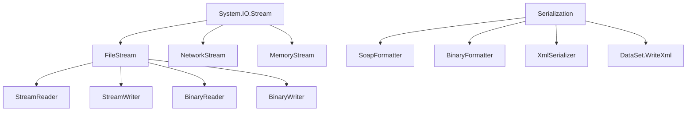

# Chương 2: Vấn đề I/O trong .NET

## 1. Giới thiệu

I/O (Input/Output) là một trong những vấn đề cốt lõi trong lập trình ứng dụng. Mọi chương trình thực tế đều cần đọc dữ liệu từ đâu đó (file, mạng, bàn phím) và ghi kết quả ra đâu đó (màn hình, file, cơ sở dữ liệu). .NET cung cấp kiến trúc thống nhất dựa trên **Stream** để xử lý tất cả các loại I/O này một cách nhất quán.

---

## 2. Streams

### 2.1 Khái niệm Stream

Trong .NET, **Stream** là một lớp trừu tượng (`System.IO.Stream`) đại diện cho một chuỗi byte có thể được đọc hoặc ghi tuần tự. Thay vì phải viết code khác nhau cho từng thiết bị I/O, .NET sử dụng mô hình stream để chuẩn hoá mọi hoạt động I/O.

Các thiết bị I/O mà stream có thể đại diện bao gồm:

- Đĩa cứng (file)
- Mạng (network socket)
- Bộ nhớ (memory buffer)
- Máy in, thiết bị ngoại vi khác

!!! info "Ba khả năng của một Stream"
    Mỗi stream có thể hỗ trợ một hoặc nhiều trong ba khả năng sau, kiểm tra qua các thuộc tính:

    | Thuộc tính | Ý nghĩa |
    |---|---|
    | `CanRead` | Stream có thể đọc dữ liệu |
    | `CanWrite` | Stream có thể ghi dữ liệu |
    | `CanSeek` | Stream hỗ trợ di chuyển con trỏ (seek) |

    Ví dụ: một `NetworkStream` thường chỉ hỗ trợ đọc/ghi, **không** hỗ trợ seek.

### 2.2 Hướng truyền dữ liệu

Dữ liệu được truyền theo hai chiều:

- **Đọc (Read):** Chương trình kéo dữ liệu từ *nguồn* (source) qua stream vào bộ nhớ chương trình.
- **Ghi (Write):** Chương trình đẩy dữ liệu từ bộ nhớ qua stream ra *đích* (destination).

```
[Source] ──stream──▶ [Program]   (Đọc)
[Program] ──stream──▶ [Destination]  (Ghi)
```

### 2.3 Hai Stream quan trọng nhất

- **`FileStream`** — làm việc với file trên đĩa.
- **`NetworkStream`** — làm việc với kết nối mạng TCP/IP.

### 2.4 Đồng bộ vs Bất đồng bộ

.NET cung cấp hai cách sử dụng stream:

| Chế độ | Mô tả | Vấn đề |
|---|---|---|
| **Đồng bộ (Synchronous)** | Thread hiện tại bị **block** (tạm ngưng) cho đến khi tác vụ I/O hoàn thành | Giao diện bị "đóng băng" khi đọc file lớn |
| **Bất đồng bộ (Asynchronous)** | Thread hiện tại **tiếp tục** chạy, một callback được gọi khi I/O xong | Phức tạp hơn nhưng không block UI |

!!! warning "Lưu ý về UI"
    Trong ứng dụng Windows Forms, **không nên** thực hiện I/O đồng bộ trên UI thread. Điều này sẽ làm chương trình "treo" (không phản hồi). Thay vào đó, hãy dùng bất đồng bộ hoặc chạy tác vụ trong một thread riêng.

---

## 3. FileStream — Streams cho tập tin

`FileStream` là lớp cụ thể để đọc/ghi file nhị phân. Namespace cần dùng: `System.IO`.

### 3.1 Ví dụ: Đọc file bất đồng bộ

**Khai báo biến:**

```csharp
FileStream fs;
byte[] fileContents;
AsyncCallback callback;
delegate void InfoMessageDel(String info);
```

**Xử lý sự kiện nhấn nút "Đọc bất đồng bộ":**

```csharp
private void btnReadAsync_Click(object sender, EventArgs e)
{
    openFileDialog.ShowDialog();

    callback = new AsyncCallback(fs_StateChanged);

    // Mở FileStream ở chế độ bất đồng bộ (tham số cuối = true)
    fs = new FileStream(
        openFileDialog.FileName,
        FileMode.Open,
        FileAccess.Read,
        FileShare.Read,
        4096,   // Buffer size: 4096 bytes/lần là hiệu quả nhất
        true    // useAsync = true
    );

    fileContents = new Byte[fs.Length];

    // Bắt đầu đọc bất đồng bộ; callback sẽ được gọi khi xong
    fs.BeginRead(fileContents, 0, (int)fs.Length, callback, null);
}
```

**Hàm callback khi đọc xong:**

```csharp
private void fs_StateChanged(IAsyncResult asyncResult)
{
    if (asyncResult.IsCompleted)
    {
        // Chuyển mảng byte thành string theo encoding UTF-8
        string s = Encoding.UTF8.GetString(fileContents);
        InfoMessage(s);  // Cập nhật UI
        fs.Close();
    }
}
```

### 3.2 Ví dụ: Đọc file đồng bộ (chạy trong thread riêng)

Do I/O đồng bộ block thread, ta chạy nó trong một thread riêng để không ảnh hưởng UI:

```csharp
private void btnReadSync_Click(object sender, EventArgs e)
{
    openFileDialog.ShowDialog();

    // Tạo và khởi động thread mới để đọc file
    Thread thdSyncRead = new Thread(new ThreadStart(syncRead));
    thdSyncRead.Start();
}

public void syncRead()
{
    FileStream fs;
    try
    {
        fs = new FileStream(openFileDialog.FileName, FileMode.OpenOrCreate);
    }
    catch (Exception ex)
    {
        MessageBox.Show(ex.Message);
        return;
    }

    fs.Seek(0, SeekOrigin.Begin);   // Di chuyển con trỏ về đầu file
    byte[] fileContents = new byte[fs.Length];
    fs.Read(fileContents, 0, (int)fs.Length);

    string s = Encoding.UTF8.GetString(fileContents);
    InfoMessage(s);
    fs.Close();
}
```

### 3.3 Thread-safe UI update với `Invoke`

Khi một thread phụ cần cập nhật UI (chỉ UI thread mới được phép làm điều này), ta dùng `InvokeRequired` + `Invoke`:

```csharp
public void InfoMessage(String info)
{
    if (tbResults.InvokeRequired)
    {
        // Đang ở thread khác → marshal về UI thread
        InfoMessageDel method = new InfoMessageDel(InfoMessage);
        tbResults.Invoke(method, new object[] { info });
        return;
    }

    // Đang ở UI thread → cập nhật trực tiếp
    tbResults.Text = info;
}
```

!!! tip "Tại sao cần `InvokeRequired`?"
    Windows Forms kiểm soát chặt chẽ: chỉ UI thread (thread tạo ra control) mới được đọc/ghi thuộc tính của control. Nếu một thread khác cố gắng set `tbResults.Text` trực tiếp, sẽ gây ra `InvalidOperationException` ở runtime.

### 3.4 Bảng phương thức/thuộc tính của FileStream

| Phương thức / Thuộc tính | Mục đích |
|---|---|
| `Constructor` | Khởi tạo FileStream với tên file, FileMode, FileAccess, FileShare, buffer size, async flag |
| `Read(byte[], offset, count)` | Đọc đồng bộ `count` byte vào mảng |
| `Write(byte[], offset, count)` | Ghi đồng bộ `count` byte từ mảng |
| `BeginRead(...)` | Bắt đầu đọc bất đồng bộ |
| `EndRead(IAsyncResult)` | Kết thúc tác vụ đọc bất đồng bộ |
| `Seek(offset, SeekOrigin)` | Di chuyển con trỏ đến vị trí cụ thể |
| `Close()` | Đóng stream và giải phóng tài nguyên |
| `Length` | Kích thước file tính bằng byte |
| `Position` | Vị trí con trỏ hiện tại |
| `CanRead`, `CanWrite`, `CanSeek` | Khả năng của stream |

---

## 4. Encoding Data

Khi đọc file text, mảng byte cần được giải mã thành chuỗi string theo đúng bảng mã.

```csharp
// Các cách dùng Encoding:
string s1 = Encoding.UTF8.GetString(fileContents);
string s2 = Encoding.Unicode.GetString(fileContents);   // UTF-16
string s3 = Encoding.ASCII.GetString(fileContents);
string s4 = Encoding.UTF32.GetString(fileContents);
```

| Encoding | Số byte/ký tự | Ghi chú |
|---|---|---|
| **ASCII** | 1 byte | Chỉ hỗ trợ 128 ký tự Latin cơ bản |
| **UTF-8** | 1–4 byte | Phổ biến nhất trên web; tương thích ASCII |
| **Unicode (UTF-16)** | 2 byte | Dùng trong .NET nội bộ, hỗ trợ đầy đủ Unicode |
| **UTF-32** | 4 byte | Cố định, hỗ trợ mọi ký tự Unicode |

!!! info "Khuyến nghị"
    Với file text tiếng Việt (có dấu), hãy dùng **UTF-8** hoặc **Unicode** để tránh lỗi hiển thị ký tự.

---

## 5. Binary và Text Streams

.NET cung cấp các lớp chuyên biệt bọc trên `FileStream` để đọc/ghi dữ liệu có cấu trúc hơn.

### 5.1 StreamReader — Đọc file text

`StreamReader` giúp đọc file text theo từng dòng, tiện lợi hơn nhiều so với đọc mảng byte thô.

**Ví dụ: Đếm số dòng trong file**

```csharp
private void btnRead_Click(object sender, EventArgs e)
{
    OpenFileDialog ofd = new OpenFileDialog();
    ofd.ShowDialog();

    FileStream fs = new FileStream(ofd.FileName, FileMode.OpenOrCreate);
    StreamReader sr = new StreamReader(fs);

    int lineCount = 0;
    while (sr.ReadLine() != null)
    {
        lineCount++;
    }

    fs.Close();
    MessageBox.Show($"There are {lineCount} lines in {ofd.FileName}");
}
```

**Bảng phương thức StreamReader:**

| Phương thức / Thuộc tính | Mục đích |
|---|---|
| `Constructor(Stream)` | Khởi tạo từ một stream hoặc đường dẫn file |
| `ReadLine()` | Đọc một dòng, trả về `null` khi hết file |
| `ReadToEnd()` | Đọc toàn bộ nội dung còn lại thành một string |
| `Read()` | Đọc một ký tự đơn |
| `Peek()` | Xem ký tự tiếp theo mà không tiêu thụ nó |
| `EndOfStream` | `true` nếu đã đọc hết |
| `Close()` | Đóng StreamReader và stream bên dưới |

### 5.2 BinaryWriter — Ghi dữ liệu nhị phân

`BinaryWriter` cho phép ghi các kiểu dữ liệu nguyên thủy (int, float, bool, string...) vào stream ở dạng nhị phân compact, không phải text.

**Ví dụ: Ghi mảng 1000 số nguyên ra file nhị phân:**

```csharp
private void btnWrite_Click(object sender, EventArgs e)
{
    SaveFileDialog sfd = new SaveFileDialog();
    sfd.ShowDialog();

    FileStream fs = new FileStream(sfd.FileName, FileMode.CreateNew);
    BinaryWriter bw = new BinaryWriter(fs);

    int[] myArray = new int[1000];
    for (int i = 0; i < 1000; i++)
    {
        myArray[i] = i;
        bw.Write(myArray[i]);   // Ghi từng int (4 byte) vào file
    }

    bw.Close();   // Tự động flush và đóng stream bên dưới
}
```

**Bảng phương thức BinaryWriter:**

| Phương thức / Thuộc tính | Mục đích |
|---|---|
| `Constructor` | Khởi tạo từ một Stream |
| `Write(value)` | Ghi các kiểu: bool, byte, char, double, float, int, long, string, v.v. |
| `Seek(offset, SeekOrigin)` | Định vị con trỏ trên stream |
| `Write7BitEncodedInt(int)` | Ghi số nguyên 32-bit dạng nén (tiết kiệm byte với số nhỏ) |
| `Close()` | Đóng BinaryWriter và stream liên quan |

!!! tip "Khi nào dùng BinaryWriter?"
    Dùng khi cần lưu dữ liệu số lượng lớn với kích thước nhỏ nhất có thể. Ví dụ: lưu 1000 số `int` bằng BinaryWriter tốn đúng 4000 byte; nếu ghi dưới dạng text ("0", "1", ..., "999") sẽ tốn hơn nhiều.

---

## 6. Serialization

### 6.1 Khái niệm

**Serialization** là quá trình chuyển đổi một **đối tượng .NET trong bộ nhớ** thành một **luồng byte** để có thể:

- Lưu xuống đĩa (persistence).
- Truyền qua mạng (network transmission).
- Sao chép đối tượng (deep copy).

**Deserialization** là quá trình ngược lại: từ luồng byte, tái tạo lại đối tượng trong bộ nhớ.

```
[Object in RAM] ──serialize──▶ [Byte stream] ──deserialize──▶ [Object in RAM]
```

### 6.2 Ví dụ Domain Model: Hệ thống đặt hàng

```csharp
public enum purchaseOrderStates
{
    ISSUED,
    DELIVERED,
    INVOICED,
    PAID
}

[Serializable]   // Bắt buộc phải có attribute này!
public class lineItem
{
    public string description;
    public int quantity;
    public float unitCost;
}

[Serializable]
public class company
{
    public string name;
    public string phone;
}

[Serializable]
public class purchaseOrder
{
    private DateTime _issuanceDate;
    private DateTime _deliveryDate;
    private purchaseOrderStates _purchaseOrderStatus;

    public company vendor;
    public company buyer;
    public lineItem[] items;

    public purchaseOrder()
    {
        _purchaseOrderStatus = purchaseOrderStates.ISSUED;
        _issuanceDate = DateTime.Now;
    }
}
```

!!! warning "Attribute `[Serializable]`"
    Để một class có thể được serialize bằng `BinaryFormatter` hoặc `SoapFormatter`, **bắt buộc** phải đánh dấu nó với `[Serializable]`. Nếu thiếu, runtime sẽ throw `SerializationException`.

### 6.3 Serialization dùng SoapFormatter (XML/SOAP)

SOAP (Simple Object Access Protocol) serialize object thành định dạng XML, dễ đọc và tương thích nhiều nền tảng.

**Serialize:**

```csharp
// Tạo các đối tượng
company Vendor = new company();
Vendor.name = "Acme Inc.";
Vendor.phone = "555-1234";

company Buyer = new company();
Buyer.name = "Wiley Coyote";

lineItem Goods = new lineItem();
Goods.description = "Anti-RoadRunner cannon";
Goods.quantity = 1;
Goods.unitCost = 599.99f;

purchaseOrder po = new purchaseOrder();
po.items = new lineItem[1];
po.items[0] = Goods;
po.buyer = Buyer;
po.vendor = Vendor;

// Ghi ra file dùng SoapFormatter
SoapFormatter sf = new SoapFormatter();
FileStream fs = new FileStream("order.soap", FileMode.Create);
sf.Serialize(fs, po);
fs.Close();
```

**Deserialize:**

```csharp
SoapFormatter sf = new SoapFormatter();
FileStream fs = new FileStream("order.soap", FileMode.Open);
purchaseOrder po = (purchaseOrder)sf.Deserialize(fs);
fs.Close();

// Sử dụng object vừa khôi phục
Console.WriteLine($"Customer: {po.buyer.name}");
Console.WriteLine($"Vendor: {po.vendor.name}");
```

### 6.4 Serialization dùng BinaryFormatter

Định dạng SOAP dễ đọc nhưng khá "nặng" (verbose XML). `BinaryFormatter` serialize thành dạng nhị phân compact hơn, nhưng không thể đọc bằng mắt thường.

```csharp
// Serialize
BinaryFormatter bf = new BinaryFormatter();
FileStream fs = new FileStream("order.bin", FileMode.Create);
bf.Serialize(fs, po);
fs.Close();

// Deserialize
BinaryFormatter bf = new BinaryFormatter();
FileStream fs = new FileStream("order.bin", FileMode.Open);
purchaseOrder po = (purchaseOrder)bf.Deserialize(fs);
fs.Close();
```

| Tiêu chí | SoapFormatter | BinaryFormatter |
|---|---|---|
| Định dạng output | XML text | Binary |
| Kích thước file | Lớn (verbose) | Nhỏ (compact) |
| Đọc được bằng mắt | ✅ Có | ❌ Không |
| Hiệu năng | Chậm hơn | Nhanh hơn |
| Tương thích nền tảng | Tốt hơn (XML standard) | Chỉ .NET CLR |

### 6.5 Shallow Serialization và XmlSerializer

`BinaryFormatter` và `SoapFormatter` thực hiện **deep serialization** — tất cả các field, kể cả private, đều được serialize. Trong một số trường hợp điều này gây ra vấn đề khi clone object.

**Shallow Serialization** với `XmlSerializer` chỉ serialize các **public property/field**, và sử dụng XML Schema Definition (XSD) để mô tả cấu trúc, đảm bảo tương thích đa nền tảng.

```csharp
// Serialize bằng XmlSerializer
company Vendor = new company();
Vendor.name = "Microsoft Inc.";
Vendor.phone = "425-555-1234";

// ... (tạo object tương tự)

XmlSerializer xs = new XmlSerializer(typeof(purchaseOrder));
FileStream fs = new FileStream("order.xml", FileMode.Create);
xs.Serialize(fs, po);
fs.Close();
```

```csharp
// Deserialize bằng XmlSerializer
purchaseOrder po = new purchaseOrder();
XmlSerializer xs = new XmlSerializer(typeof(purchaseOrder));
FileStream fs = new FileStream("order.xml", FileMode.Open);
po = (purchaseOrder)xs.Deserialize(fs);
fs.Close();
```

**Bảng phương thức XmlSerializer:**

| Phương thức / Thuộc tính | Mục đích |
|---|---|
| `Constructor(Type)` | Khởi tạo cho một kiểu cụ thể |
| `Serialize(Stream, object)` | Serialize object thành XML |
| `Deserialize(Stream)` | Deserialize XML thành object |
| `CanDeserialize(XmlReader)` | Kiểm tra có thể deserialize document đó không |
| `FromTypes(Type[])` | Tạo mảng XmlSerializer cho nhiều kiểu |

!!! info "Ưu điểm của XmlSerializer"
    - Không cần attribute `[Serializable]` trên class.
    - Output là XML chuẩn, đọc được và tương thích với bất kỳ ngôn ngữ/nền tảng nào hỗ trợ XML.
    - Schema XSD có thể được dùng để validate dữ liệu.

---

## 7. Ghi một Database vào Stream

Hầu hết ứng dụng thương mại đều dùng cơ sở dữ liệu. Để truyền dữ liệu qua mạng hoặc lưu snapshot, ta cần serialize kết quả query vào stream.

### 7.1 Kết nối CSDL — Connection Strings

Namespace cần dùng:
- `System.Data.OleDb` — cho Access, Oracle, v.v.
- `System.Data.SqlClient` — cho SQL Server.

**Chuỗi kết nối theo loại CSDL:**

| Loại Database | Connection String mẫu |
|---|---|
| Microsoft Access | `Provider=Microsoft.Jet.OLEDB.4.0;Data Source=C:\path\db.mdb` |
| SQL Server | `Server=.\SQLEXPRESS;Database=myDB;Trusted_Connection=True` |
| Oracle | `Provider=MSDAORA;Data Source=MyOracle;User ID=sa;Password=...` |

**Ví dụ kết nối SQL Server:**

```csharp
private static string strCon;
public static SqlConnection Connect(string serverName, string dbName)
{
    strCon = $"Server={serverName};Database={dbName};Trusted_Connection=True";
    SqlConnection conn = new SqlConnection(strCon);
    try
    {
        conn.Open();
        return conn;
    }
    catch (Exception e)
    {
        MessageBox.Show($"Chi tiết kỹ thuật: {e.Message}");
        return null;
    }
}
```

**Ví dụ kết nối Access (OleDb):**

```csharp
public static OleDbConnection Connect(string dbPath)
{
    strCon = $"Provider=Microsoft.Jet.OLEDB.4.0;Data Source={dbPath}";
    OleDbConnection conn = new OleDbConnection(strCon);
    try
    {
        conn.Open();
        return conn;
    }
    catch (Exception e)
    {
        MessageBox.Show($"Chi tiết kỹ thuật: {e.Message}");
        return null;
    }
}
```

### 7.2 Bốn thao tác CRUD cơ bản

| Thao tác | Câu lệnh SQL tổng quát |
|---|---|
| Đọc dữ liệu | `SELECT * FROM table WHERE column = 'value'` |
| Thêm dòng mới | `INSERT INTO table (col1, col2) VALUES ('val1', 'val2')` |
| Cập nhật dòng | `UPDATE table SET column = 'value' WHERE column = 'cond'` |
| Xóa dòng | `DELETE FROM table WHERE column = 'value'` |

!!! note "Thực thi lệnh non-query"
    Các lệnh `UPDATE`, `DELETE`, `INSERT` không trả về dữ liệu, phải gọi phương thức `ExecuteNonQuery()` trên đối tượng command:
    ```csharp
    OleDbCommand cmd = new OleDbCommand(sqlString, connection);
    cmd.ExecuteNonQuery();
    ```

### 7.3 DataSet Serialization — Xuất CSDL ra Stream

`DataSet` là đại diện in-memory của dữ liệu từ database, và nó hỗ trợ serialize trực tiếp sang XML.

**Thực hiện query và đưa vào DataSet:**

```csharp
public DataSet Query(string sql, OleDbConnection conn)
{
    OleDbCommand cmd = new OleDbCommand(sql, conn);
    OleDbDataAdapter adapter = new OleDbDataAdapter(cmd);
    DataSet ds = new DataSet();
    adapter.Fill(ds);
    return ds;
}
```

**Serialize DataSet ra XML:**

```csharp
string szDSN = "Provider=Microsoft.Jet.OLEDB.4.0;Data Source=mydb.mdb";
OleDbConnection conn = new OleDbConnection(szDSN);
conn.Open();

OleDbCommand cmd = new OleDbCommand(tbSQL.Text, conn);
OleDbDataAdapter adapter = new OleDbDataAdapter(cmd);
DataSet ds = new DataSet();
adapter.Fill(ds);

// Serialize DataSet thành XML stream
StringWriter sw = new StringWriter();
ds.WriteXml(sw);
tbResults.Text = sw.ToString();   // Hiển thị XML lên textbox
```

Kết quả XML trông như sau:

```xml
<NewDataSet>
  <companies diffgr:id="companies1" msdata:rowOrder="0">
    <id>1</id>
    <name>Wiley E. Coyote</name>
  </companies>
  <companies diffgr:id="companies2" msdata:rowOrder="1">
    <id>2</id>
    <name>Acme Inc.</name>
  </companies>
</NewDataSet>
```

!!! tip "Ứng dụng thực tế"
    Kỹ thuật serialize `DataSet` sang XML rất hữu ích khi:

    - Truyền dữ liệu qua Web Service (SOAP/REST).
    - Xuất báo cáo snapshot.
    - Cache dữ liệu ra file để tái sử dụng.

---

## 8. Tổng kết



??? summary "Khi nào dùng gì?"
    - **FileStream trực tiếp** → Đọc/ghi file nhị phân thô (ảnh, audio, dữ liệu tùy biến).
    - **StreamReader/StreamWriter** → Đọc/ghi file text theo dòng.
    - **BinaryReader/BinaryWriter** → Đọc/ghi kiểu dữ liệu nguyên thủy (int, float, ...) dạng nhị phân compact.
    - **SoapFormatter** → Serialize object sang XML/SOAP để tương thích đa nền tảng CLR.
    - **BinaryFormatter** → Serialize object sang binary nhanh và gọn, chỉ dùng trong hệ thống .NET thuần.
    - **XmlSerializer** → Serialize public member sang XML chuẩn, tương thích mọi nền tảng.
    - **DataSet.WriteXml** → Xuất kết quả query database sang XML stream.
