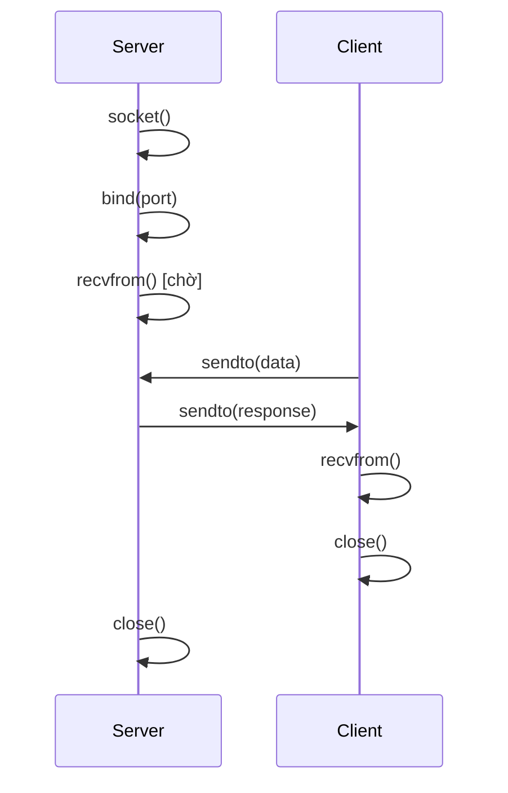
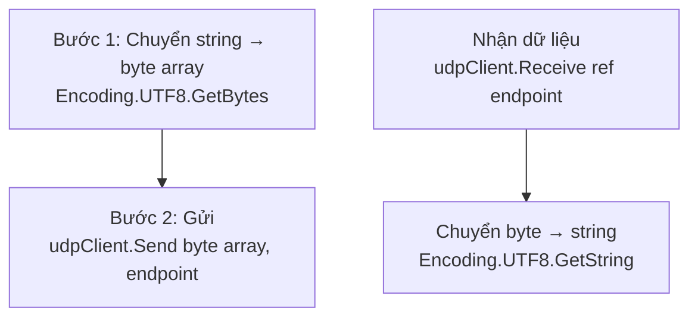
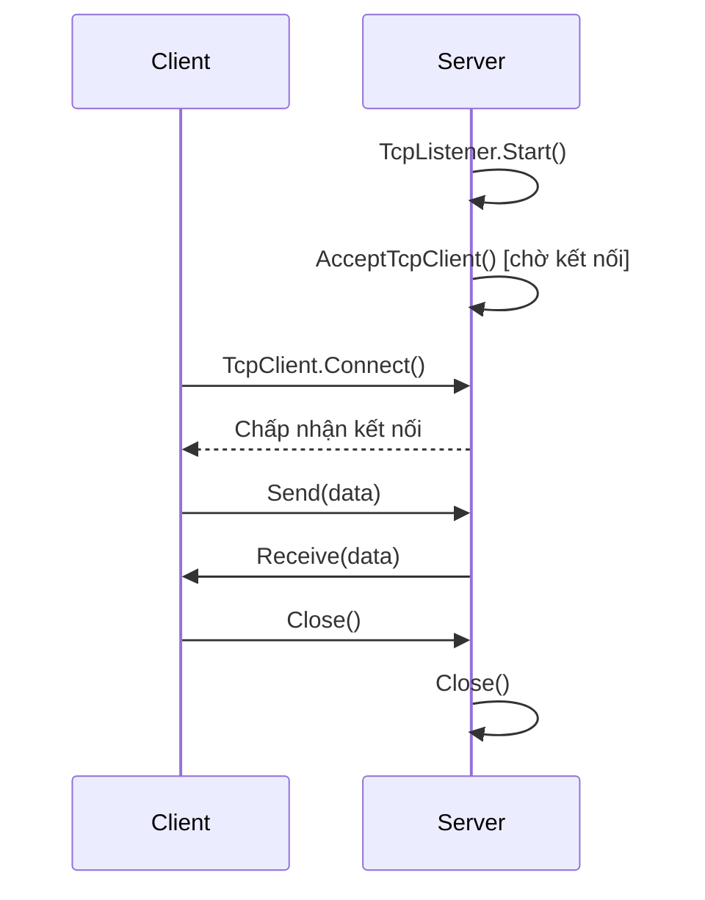
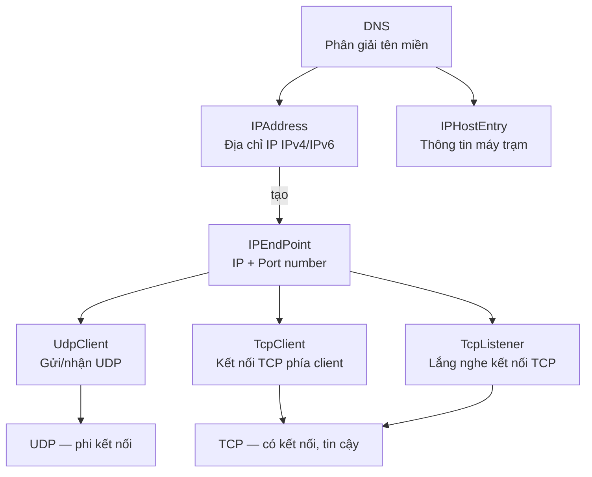

# Chương 3: Lập Trình Sockets

## 1. Socket là gì?

Lập trình socket là **nền tảng** của lập trình mạng. Mọi ứng dụng giao tiếp qua mạng — từ trình duyệt web, email, đến game online — đều hoạt động dựa trên cơ chế socket ở tầng thấp.

!!! info "Định nghĩa"
    **Socket** là một đối tượng đại diện cho một **điểm truy cập mạng** (endpoint), gồm địa chỉ IP và số cổng (port). Nó hoạt động như một "cửa ra vào" để tiến trình gửi/nhận dữ liệu qua mạng.

Socket có thể:

- Ở chế độ **mở** (đang kết nối) hoặc **đóng** (ngắt kết nối)
- **Gửi** và **nhận** dữ liệu
- Dữ liệu được truyền theo từng **khối (packet)**, thường vài KB mỗi lần

### Mô hình hoạt động

```
[Tiến trình A] <---> [Socket A] <====Internet====> [Socket B] <---> [Tiến trình B]
                      (Cửa ra vào)                  (Cửa ra vào)
                      Do hệ điều hành quản lý
```

### Khởi tạo Socket trong C#

```csharp
// Tạo một socket gửi/nhận dữ liệu qua kết nối TCP
Socket s = new Socket(
    AddressFamily.InterNetwork,  // IPv4
    SocketType.Stream,           // Kiểu kết nối liên tục (TCP)
    ProtocolType.Tcp             // Giao thức TCP
);
```

---

## 2. Địa chỉ và Cổng (IP & Port)

### Vấn đề cần giải quyết

Một máy tính có thể chạy **hàng chục ứng dụng** cùng lúc (trình duyệt, email client, game, ...). Tuy nhiên, máy tính chỉ có **một đường truyền vật lý** ra Internet.

!!! question "Câu hỏi"
    Khi máy A gửi dữ liệu đến máy B, làm thế nào máy B biết dữ liệu đó thuộc về ứng dụng nào?

!!! success "Giải pháp: Cổng (Port)"
    Mỗi ứng dụng trên máy B được gán một **số cổng duy nhất** trong khoảng `[0..65535]`.
    
    - Máy A khi gửi dữ liệu phải chỉ rõ **IP đích** và **Port đích**
    - Máy B nhận gói tin, đọc số port và chuyển dữ liệu đến **đúng ứng dụng** tương ứng

```
Máy A (192.168.1.1)                     Máy B (192.168.1.2)
┌──────────────────┐                     ┌────────────────────────┐
│ App Chrome       │ ──────────────────► │ Port 80  → Web Server  │
│ App Email Client │ ──────────────────► │ Port 25  → SMTP Server │
│ App FTP Tool     │ ──────────────────► │ Port 21  → FTP Server  │
└──────────────────┘                     └────────────────────────┘
```

### Các cổng thường gặp

| Port | Giao thức | Mô tả |
|------|-----------|-------|
| 20   | FTP Data  | Truyền dữ liệu FTP |
| 21   | FTP       | Điều khiển FTP |
| 22   | SSH       | Kết nối shell bảo mật |
| 23   | Telnet    | Kết nối terminal từ xa |
| 25   | SMTP      | Gửi email |
| 53   | DNS       | Phân giải tên miền |
| 80   | HTTP      | Web không mã hóa |
| 110  | POP3      | Nhận email |
| 443  | HTTPS     | Web có mã hóa SSL/TLS |

### Phân loại cổng

!!! warning "Quy tắc quan trọng"
    Không bao giờ có **2 ứng dụng cùng dùng 1 port** trên cùng một máy tại cùng một thời điểm.

| Khoảng Port     | Tên gọi               | Mục đích |
|-----------------|-----------------------|----------|
| `0 – 1023`      | Well-known Ports      | Dành cho các ứng dụng hệ thống quan trọng (HTTP, FTP, SSH, ...) |
| `1024 – 49151`  | Registered Ports      | Cho lập trình viên đăng ký sử dụng (khuyến cáo dùng khoảng này) |
| `49152 – 65535` | Dynamic/Private Ports | Dự trữ, dùng tự động bởi hệ điều hành |

---

## 3. Lớp `IPAddress`

### Giới thiệu

Mỗi thiết bị trên Internet có một **địa chỉ IP duy nhất** — gồm 4 số (mỗi số từ 0–255), ví dụ: `192.168.1.1`.

Địa chỉ IP có thể biểu diễn dưới nhiều dạng:

| Dạng         | Ví dụ                          |
|--------------|--------------------------------|
| Tên máy      | `May01`, `Server`              |
| Chuỗi string | `"192.168.1.1"`, `"127.0.0.1"` |
| Mảng 4 byte  | `{192, 168, 1, 1}`             |
| Số nguyên    | `16885952` (dạng long 4 byte)  |

### Chuyển đổi địa chỉ sang số nguyên

!!! example "Ví dụ tính toán"
    Địa chỉ `192.168.1.2` được chuyển sang số như sau:
    
    ```
    Số = 2   × 256⁰
       + 1   × 256¹
       + 168 × 256²
       + 192 × 256³
    ```
    
    **Lưu ý:** Byte `[0]` là octet cuối cùng (phần ngoài cùng bên phải), byte `[3]` là octet đầu tiên.

### Thuộc tính quan trọng

| Thuộc tính    | Mô tả |
|---------------|-------|
| `Any`         | Địa chỉ đặc biệt, lắng nghe trên tất cả các interface mạng |
| `Loopback`    | `127.0.0.1` — địa chỉ vòng lặp nội bộ (localhost) |
| `Broadcast`   | Địa chỉ gửi cho tất cả các máy trong mạng |

### Phương thức quan trọng

| Phương thức / Constructor              | Mô tả |
|----------------------------------------|-------|
| `IPAddress(long)`                      | Tạo địa chỉ IP từ một số kiểu `long` |
| `IPAddress(byte[])`                    | Tạo địa chỉ IP từ mảng 4 byte |
| `IPAddress.Parse(string)`              | Chuyển chuỗi `"192.168.1.1"` thành đối tượng `IPAddress` |
| `IPAddress.TryParse(string, out ip)`   | Kiểm tra và chuyển — trả về `bool`, không ném ngoại lệ |
| `GetAddressBytes()`                    | Trả về địa chỉ dưới dạng mảng byte |
| `IsLoopback(ip)`                       | Kiểm tra có phải địa chỉ loopback không |
| `AddressFamily`                        | Trả về họ địa chỉ (IPv4: `InterNetwork`) |

### Ví dụ: Các cách tạo địa chỉ IP

```csharp
// Cách 1: Dùng mảng byte
byte[] b = new byte[4];
b[0] = 192; b[1] = 168; b[2] = 1; b[3] = 1;
IPAddress ip1 = new IPAddress(b);

// Cách 2: Dùng số nguyên long
IPAddress ip2 = new IPAddress(16885952);

// Cách 3: Parse từ chuỗi (phổ biến nhất)
IPAddress ip3 = IPAddress.Parse("172.16.0.1");

// Cách 4: Tính toán thủ công
long so = 192 * (long)Math.Pow(256, 0)
        + 168 * (long)Math.Pow(256, 1)
        +   1 * (long)Math.Pow(256, 2)
        +   1 * (long)Math.Pow(256, 3);
IPAddress ip4 = new IPAddress(so);
```

### Ví dụ: Kiểm tra tính hợp lệ của địa chỉ

```csharp
private void KiemTra()
{
    IPAddress ip;
    string ip4 = "127.0.0.1";  // Hợp lệ
    string ip5 = "999.0.0.1";  // Không hợp lệ (999 > 255)

    // TryParse trả về true/false thay vì ném exception
    MessageBox.Show(ip4 + ": " + IPAddress.TryParse(ip4, out ip)); // True
    MessageBox.Show(ip5 + ": " + IPAddress.TryParse(ip5, out ip)); // False
}
```

!!! tip "Khi nào dùng `Parse` vs `TryParse`?"
    - Dùng `Parse` khi bạn **chắc chắn** chuỗi hợp lệ — nếu sai sẽ ném `FormatException`
    - Dùng `TryParse` khi địa chỉ đến từ **đầu vào người dùng** — an toàn hơn, không crash chương trình

### Ví dụ: Chuyển địa chỉ ra mảng byte

```csharp
void ConvertToIPArray()
{
    IPAddress ip = new IPAddress(16885952);
    byte[] b = ip.GetAddressBytes();

    // In ra dạng 192.168.1.1
    MessageBox.Show($"Address: {b[0]}.{b[1]}.{b[2]}.{b[3]}");
}
```

---

## 4. Lớp `IPEndPoint`

### Giới thiệu

`IPAddress` chỉ cung cấp **địa chỉ IP**. Để xác định đầy đủ một điểm kết nối mạng, ta cần cả **số cổng**. Đó là vai trò của `IPEndPoint`.

```
IPEndPoint = IPAddress + Port Number
```

### Thuộc tính và phương thức

| Tên | Mô tả |
|-----|-------|
| `Address` | Lấy/thiết lập địa chỉ IP |
| `Port` | Lấy/thiết lập số cổng |
| `IPEndPoint(Int64, Int32)` | Constructor: tạo từ số long và port |
| `IPEndPoint(IPAddress, Int32)` | Constructor: tạo từ đối tượng IPAddress và port |

### Ví dụ

```csharp
private void CreateEndpoint()
{
    // Tạo địa chỉ IP
    IPAddress ipAdd = IPAddress.Parse("127.0.0.1");

    // Tạo endpoint = IP + Port
    IPEndPoint ipEp = new IPEndPoint(ipAdd, 10000);

    Console.WriteLine(ipEp.Address); // 127.0.0.1
    Console.WriteLine(ipEp.Port);    // 10000
}
```

---

## 5. Lớp `IPHostEntry`

### Giới thiệu

`IPHostEntry` là một **container** chứa thông tin địa chỉ của một máy trạm trên Internet. Thường được dùng kết hợp với lớp `DNS`.

### Thuộc tính

| Thuộc tính    | Mô tả |
|---------------|-------|
| `AddressList` | Danh sách các địa chỉ IP của máy |
| `Aliases`     | Danh sách tên bí danh của máy |
| `HostName`    | Tên máy chủ chính |

!!! note "Lưu ý"
    `IPHostEntry` không tự lấy thông tin — bạn cần "nạp" thông tin vào thông qua lớp `DNS`.

---

## 6. Lớp `DNS`

### Giới thiệu

DNS (Domain Name Service) giúp **phân giải tên miền** thành địa chỉ IP và ngược lại.

```
"google.com"  ──DNS──►  "142.250.185.78"
"MY-PC"       ──DNS──►  "192.168.1.5"
```

### Phương thức (đều là `static`)

| Phương thức | Mô tả |
|-------------|-------|
| `Dns.GetHostEntry(string)` | Trả về `IPHostEntry` cho tên máy hoặc địa chỉ IP |
| `Dns.GetHostAddresses(string)` | Trả về mảng `IPAddress[]` của một host |
| `Dns.GetHostName()` | Trả về tên máy hiện tại |

### Ví dụ: Lấy tất cả địa chỉ IP của máy

```csharp
private void ShowIPs()
{
    // Lấy tất cả địa chỉ IP của máy có tên "MY-PC"
    IPAddress[] addresses = Dns.GetHostAddresses("MY-PC");

    foreach (IPAddress ip in addresses)
    {
        MessageBox.Show(ip.ToString());
    }
}
```

!!! tip "Lấy địa chỉ máy hiện tại"
    ```csharp
    string hostName = Dns.GetHostName();
    IPAddress[] myIPs = Dns.GetHostAddresses(hostName);
    ```

---

## 7. Lớp `UdpClient`

### Giao thức UDP là gì?

**UDP (User Datagram Protocol)** là giao thức **phi kết nối (connectionless)** — dữ liệu được gửi đi mà không cần thiết lập kết nối trước.

| Đặc điểm | Giải thích |
|----------|------------|
| **Phi kết nối** | Không cần bắt tay (handshake) trước khi gửi |
| **Không tin cậy** | Gói tin có thể bị mất, trùng lặp, hoặc đến sai thứ tự |
| **Tốc độ nhanh** | Overhead thấp, phù hợp với ứng dụng thời gian thực |
| **Hỗ trợ Broadcast** | Có thể gửi đến nhiều máy cùng lúc |

!!! example "Ứng dụng thực tế của UDP"
    - Game online (cần phản hồi nhanh, chấp nhận mất vài frame)
    - Video streaming / VoIP (trễ quan trọng hơn mất gói)
    - DNS query (gói nhỏ, nhanh)
    - Broadcast nội bộ mạng LAN

### Trình tự kết nối UDP



### Constructor và Phương thức quan trọng

```csharp
// Tạo UDP client không gắn port (dùng để gửi)
UdpClient client = new UdpClient();

// Tạo UDP server gắn vào port cố định (dùng để nhận)
UdpClient server = new UdpClient(8080);

// Tạo từ endpoint
UdpClient ep = new UdpClient(new IPEndPoint(IPAddress.Any, 9000));
```

| Phương thức | Mô tả |
|-------------|-------|
| `Send(byte[], int, IPEndPoint)` | Gửi dữ liệu đến endpoint chỉ định |
| `Receive(ref IPEndPoint)` | Nhận dữ liệu (chặn đến khi có dữ liệu đến) |
| `BeginReceive(...)` | Nhận bất đồng bộ (non-blocking) |
| `Close()` | Đóng kết nối, giải phóng tài nguyên |

### Ví dụ ứng dụng Chat UDP

#### Phía Client (gửi tin nhắn)

```csharp
private void ClientSend_Click(object sender, EventArgs e)
{
    UdpClient udpClient = new UdpClient();

    // Lấy IP và Port từ giao diện
    IPAddress ipadd = IPAddress.Parse(textBox1.Text); // VD: "127.0.0.1"
    int port = Convert.ToInt32(textBox2.Text);         // VD: 8080
    IPEndPoint ipEnd = new IPEndPoint(ipadd, port);

    // Chuyển chuỗi thành mảng byte (UTF-8 để hỗ trợ tiếng Việt)
    byte[] sendBytes = Encoding.UTF8.GetBytes(richTextBox1.Text);

    // Gửi dữ liệu
    udpClient.Send(sendBytes, sendBytes.Length, ipEnd);

    // Xóa ô nhập sau khi gửi
    richTextBox1.Text = "";
}
```

#### Phía Server (nhận tin nhắn)

```csharp
public void ServerThread()
{
    int port = Convert.ToInt32(textBox1.Text); // VD: 8080
    UdpClient udpServer = new UdpClient(port);

    while (true)
    {
        // IPAddress.Any + port 0: chấp nhận từ bất kỳ địa chỉ nào
        IPEndPoint remoteEnd = new IPEndPoint(IPAddress.Any, 0);

        // Chờ và nhận dữ liệu (blocking call)
        byte[] recvBytes = udpServer.Receive(ref remoteEnd);

        // Chuyển byte về chuỗi
        string data = Encoding.UTF8.GetString(recvBytes);

        // Hiển thị thông tin người gửi + nội dung
        string message = $"{remoteEnd.Address}:{remoteEnd.Port} → {data}";
        InfoMessage(message); // Gọi delegate để update UI an toàn
    }
}
```

!!! warning "Chạy Server trên Thread riêng"
    Hàm `Receive()` là **blocking** — nó sẽ khóa luồng hiện tại cho đến khi nhận được dữ liệu. Vì vậy, **phải** chạy server trên một `Thread` riêng để không đóng băng giao diện người dùng:
    
    ```csharp
    Thread serverThread = new Thread(ServerThread);
    serverThread.IsBackground = true;
    serverThread.Start();
    ```

### Tổng kết quy trình UDP



---

## 8. Lớp `TcpClient` và `TcpListener`

### Giao thức TCP là gì?

**TCP (Transmission Control Protocol)** là giao thức **có kết nối (connection-oriented)** — đảm bảo dữ liệu đến đích đầy đủ, đúng thứ tự.

!!! success "Ứng dụng thực tế của TCP"
    Hầu hết giao tiếp Internet dùng TCP: HTTP/HTTPS (web), SMTP (email), FTP, SSH, Telnet, ...

### So sánh TCP và UDP

| Tiêu chí | TCP | UDP |
|----------|-----|-----|
| Kết nối | Có (handshake 3 bước) | Không |
| Độ tin cậy | Cao (đảm bảo gửi đến) | Thấp (có thể mất gói) |
| Thứ tự gói tin | Đảm bảo đúng thứ tự | Không đảm bảo |
| Tốc độ | Chậm hơn | Nhanh hơn |
| Overhead | Cao | Thấp |
| Ứng dụng | Web, email, FTP | Game, stream, DNS |

### Trình tự kết nối TCP



### Lớp `TcpClient`

```csharp
// Tạo đối tượng TcpClient chưa kết nối
TcpClient client = new TcpClient();

// Kết nối đến server
client.Connect("192.168.1.1", 8080);
// Hoặc
client.Connect(new IPEndPoint(IPAddress.Parse("192.168.1.1"), 8080));
```

| Thuộc tính / Phương thức | Mô tả |
|--------------------------|-------|
| `Available` | Số byte đã nhận nhưng chưa đọc |
| `Connected` | Kiểm tra có đang kết nối không |
| `GetStream()` | Lấy `NetworkStream` để đọc/ghi dữ liệu |
| `Connect(host, port)` | Kết nối đến server |
| `Close()` | Đóng kết nối |

### Lớp `TcpListener`

`TcpListener` được dùng phía **server** để lắng nghe và chấp nhận kết nối từ client.

```csharp
// Tạo listener trên port 8080
TcpListener listener = new TcpListener(IPAddress.Any, 8080);

// Bắt đầu lắng nghe
listener.Start();

// Chờ và chấp nhận kết nối (blocking)
TcpClient client = listener.AcceptTcpClient();
```

| Phương thức | Mô tả |
|-------------|-------|
| `TcpListener(Port)` | Tạo listener trên port chỉ định |
| `TcpListener(IPEndPoint)` | Tạo listener trên endpoint cụ thể |
| `Start()` | Bắt đầu lắng nghe kết nối |
| `Stop()` | Dừng lắng nghe |
| `AcceptTcpClient()` | Chờ và trả về `TcpClient` khi có kết nối đến (blocking) |
| `AcceptSocket()` | Tương tự nhưng trả về `Socket` thay vì `TcpClient` |

### Ví dụ: Ứng dụng TCP đơn giản

#### Server

```csharp
public void StartServer()
{
    TcpListener listener = new TcpListener(IPAddress.Any, 8080);
    listener.Start();
    Console.WriteLine("Server đang lắng nghe...");

    while (true)
    {
        TcpClient client = listener.AcceptTcpClient();
        Console.WriteLine("Client kết nối: " + 
            ((IPEndPoint)client.Client.RemoteEndPoint).Address);

        // Xử lý client trên thread riêng
        Thread t = new Thread(() => HandleClient(client));
        t.Start();
    }
}

private void HandleClient(TcpClient client)
{
    NetworkStream stream = client.GetStream();
    byte[] buffer = new byte[1024];
    int bytesRead = stream.Read(buffer, 0, buffer.Length);
    string message = Encoding.UTF8.GetString(buffer, 0, bytesRead);
    Console.WriteLine("Nhận: " + message);

    // Gửi phản hồi
    byte[] response = Encoding.UTF8.GetBytes("Đã nhận: " + message);
    stream.Write(response, 0, response.Length);

    client.Close();
}
```

#### Client

```csharp
public void SendMessage(string message)
{
    TcpClient client = new TcpClient();
    client.Connect("127.0.0.1", 8080);

    NetworkStream stream = client.GetStream();

    // Gửi dữ liệu
    byte[] data = Encoding.UTF8.GetBytes(message);
    stream.Write(data, 0, data.Length);

    // Nhận phản hồi
    byte[] buffer = new byte[1024];
    int bytesRead = stream.Read(buffer, 0, buffer.Length);
    Console.WriteLine(Encoding.UTF8.GetString(buffer, 0, bytesRead));

    client.Close();
}
```

---

## 9. Debugging Network Code

### Nguyên tắc debug ứng dụng mạng

!!! danger "Lỗi thường gặp"
    Lỗi mạng thường khó tái hiện vì phụ thuộc vào trạng thái mạng, thời điểm gọi, và nhiều luồng chạy đồng thời.

### Dùng `try/catch` cho mọi thao tác mạng

```csharp
try
{
    serverSocket.Bind(ipepServer);
    serverSocket.Listen(10);
    // ...
}
catch (SocketException ex)
{
    Console.WriteLine("Lỗi Socket: " + ex.Message);
    Console.WriteLine("Error Code: " + ex.SocketErrorCode);
}
catch (Exception ex)
{
    Console.WriteLine("Lỗi chung: " + ex.Message);
}
finally
{
    // Luôn giải phóng tài nguyên
    serverSocket?.Close();
}
```

### Dùng `Trace` cho ứng dụng đa luồng

```csharp
using System.Diagnostics;

// Ghi log thread-safe
Trace.WriteLine($"[Thread {Thread.CurrentThread.ManagedThreadId}] Nhận kết nối từ {client.Client.RemoteEndPoint}");

// Hoặc đơn giản hơn
Console.WriteLine($"[{DateTime.Now:HH:mm:ss}] Server started on port 8080");
```

!!! tip "Các mẹo debug ứng dụng mạng"
    - Dùng **Wireshark** để bắt gói tin thực tế trên mạng
    - Dùng **netstat -an** để kiểm tra port nào đang mở
    - Dùng **127.0.0.1 (localhost)** để test trước khi deploy
    - Luôn log địa chỉ IP + port của cả hai phía khi kết nối

---

## Sơ đồ tổng quan kiến trúc



## Tóm tắt nhanh

??? summary "Nhóm lớp địa chỉ mạng"
    - **`IPAddress`** — Đại diện địa chỉ IP. Hỗ trợ nhiều dạng khởi tạo (string, byte[], long).
    - **`IPEndPoint`** — Kết hợp IPAddress + Port → xác định đầy đủ một điểm mạng.
    - **`IPHostEntry`** — Container chứa thông tin host (danh sách IP, tên máy).
    - **`DNS`** — Phân giải tên miền ↔ địa chỉ IP. Tất cả phương thức đều là `static`.

??? summary "Nhóm lớp giao tiếp mạng"
    - **`UdpClient`** — Giao tiếp UDP phi kết nối. Nhanh, phù hợp real-time, hỗ trợ broadcast.
    - **`TcpClient`** — Phía client của TCP. Dùng `Connect()` → `GetStream()` → đọc/ghi.
    - **`TcpListener`** — Phía server của TCP. Dùng `Start()` → `AcceptTcpClient()` → xử lý.

??? summary "Mã hóa dữ liệu"
    Khi gửi/nhận qua socket, dữ liệu phải ở dạng `byte[]`. Luôn dùng `Encoding.UTF8` để hỗ trợ tiếng Việt:
    ```csharp
    // String → byte[]
    byte[] data = Encoding.UTF8.GetBytes("Xin chào");
    
    // byte[] → String
    string text = Encoding.UTF8.GetString(data);
    ```
