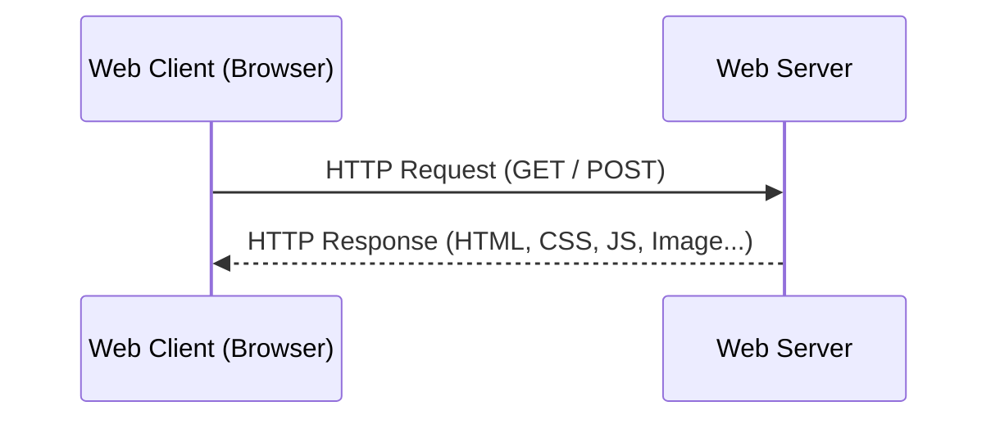
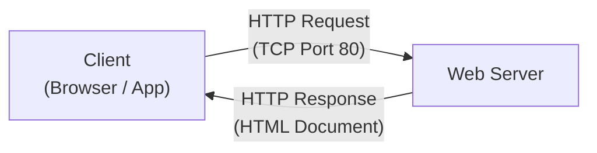
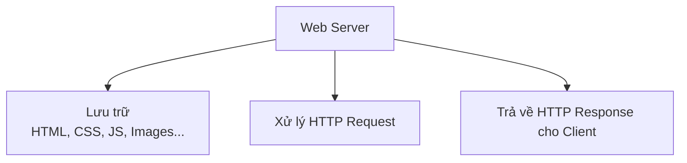
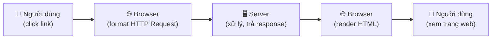
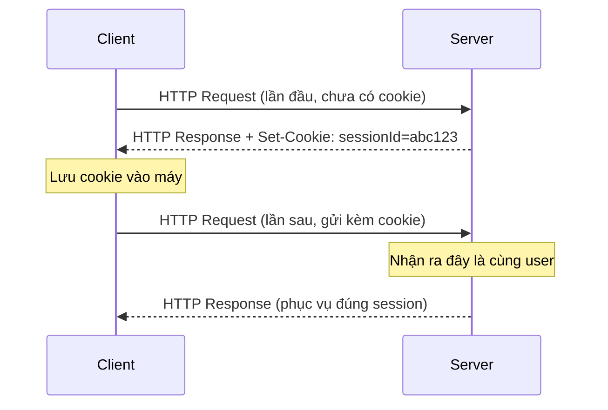
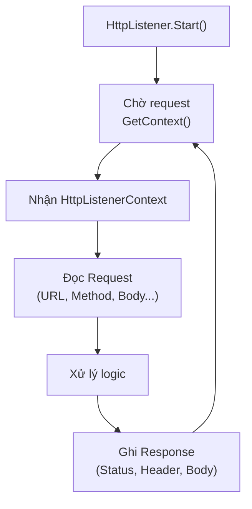
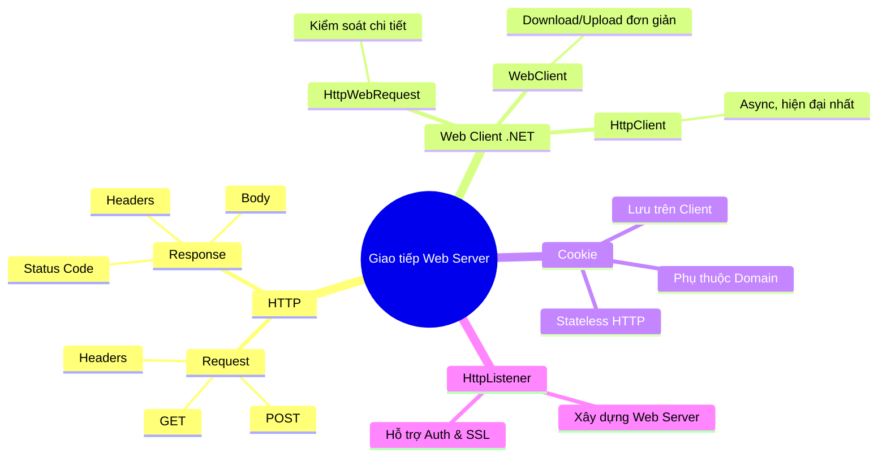

# Chương 4: Giao Tiếp Với Web Server

---

## 1. Giới Thiệu

Trong lập trình mạng, một trong những nhu cầu phổ biến nhất là **giao tiếp với web server** để lấy hoặc gửi dữ liệu. Ứng dụng cần giao tiếp với website vì nhiều lý do:

- Kiểm tra các bản cập nhật, sửa lỗi, nâng cấp phần mềm tự động.
- Lấy thông tin dữ liệu được cập nhật theo thời gian thực (giá cổ phiếu, thời tiết…).
- Tự động truy vấn dữ liệu từ các dịch vụ bên thứ 3 (API).
- Xây dựng search engine hoặc crawler.
- Cache các trang web để truy cập nhanh hơn.

---

## 2. Mô Hình Hoạt Động



!!! info "Phân biệt Web Server và Website"
    - **Website** là tập hợp nội dung (HTML, ảnh, CSS...).
    - **Web Server** là phần mềm/phần cứng *lưu trữ và phục vụ* nội dung đó qua giao thức HTTP.
    - **Web Client** thường là trình duyệt (Browser), nhưng cũng có thể là ứng dụng tự viết bằng C#, Python...

---

## 3. Giao Thức HTTP

### 3.1 Tổng Quan

HTTP (**HyperText Transfer Protocol**) hoạt động trên nền **TCP/IP, cổng 80** (HTTPS dùng cổng 443).



HTTP gồm **2 loại thông điệp chính**:

| Loại | Chiều | Mô tả |
|---|---|---|
| **HTTP Request** | Client → Server | Yêu cầu tài nguyên hoặc gửi dữ liệu |
| **HTTP Response** | Server → Client | Phản hồi kết quả, kèm dữ liệu yêu cầu |

---

### 3.2 HTTP Request

#### Các Phương Thức HTTP Phổ Biến

| Phương thức | Mô tả |
|---|---|
| **GET** | Lấy dữ liệu từ server (phổ biến nhất) |
| **POST** | Gửi dữ liệu lên server (form, đăng nhập...) |
| **HEAD** | Lấy header mà không có body |
| **PUT** | Cập nhật tài nguyên |
| **DELETE** | Xóa tài nguyên |
| **OPTIONS** | Hỏi server hỗ trợ những phương thức nào |
| **TRACE** | Debug - echo lại request |

#### Cấu Trúc HTTP GET Request

```
GET /index.html HTTP/1.1\r\n
Host: www.example.com\r\n
User-Agent: Firefox/3.6.10\r\n
Accept: text/html,application/xhtml+xml\r\n
Accept-Language: en-us,en;q=0.5\r\n
Accept-Encoding: gzip,deflate\r\n
Accept-Charset: ISO-8859-1,utf-8;q=0.7\r\n
Keep-Alive: 115\r\n
Connection: keep-alive\r\n
\r\n
```

!!! note "Lưu ý về `\r\n`"
    - `\r` = Carriage Return (về đầu dòng)
    - `\n` = Line Feed (xuống dòng mới)
    - **Hai dòng trống `\r\n\r\n` ở cuối** báo hiệu kết thúc phần header của request.

#### Cấu Trúc HTTP POST Request

```
POST / HTTP/1.1
Content-Type: application/x-www-form-urlencoded
Content-Length: 17

myField=some+text
```

!!! tip "Khi nào dùng GET, khi nào dùng POST?"
    - **GET**: Lấy dữ liệu, dữ liệu truyền qua URL, giới hạn độ dài, không bảo mật. Ví dụ: tìm kiếm Google.
    - **POST**: Gửi dữ liệu nhạy cảm (mật khẩu, form đăng ký), dữ liệu nằm trong body, không giới hạn kích thước.

#### Bảng Các HTTP Request Header Quan Trọng

| Header | Ý nghĩa |
|---|---|
| `Accept` | Kiểu MIME client chấp nhận. `*/*` = chấp nhận tất cả |
| `Accept-Charset` | Bộ ký tự client hỗ trợ (ví dụ: `utf-8`, `iso-8859-5`) |
| `Accept-Encoding` | Kiểu nén client hiểu được (ví dụ: `gzip`, `deflate`) |
| `Accept-Language` | Ngôn ngữ ưa thích (ví dụ: `vi`, `en-gb`) |
| `Authorization` | Thông tin xác thực client với server |
| `Host` | Tên miền của server đích |
| `If-Modified-Since` | Chỉ trả dữ liệu nếu có thay đổi sau ngày này (hỗ trợ cache) |
| `Proxy-Authorization` | Xác thực qua proxy |
| `Range` | Lấy một phần nội dung (ví dụ: `bytes=500-999`) |
| `Referer` | Trang web người dùng vừa từ đó đến |
| `User-Agent` | Kiểu trình duyệt / ứng dụng client đang dùng |
| `Content-Type` | Kiểu MIME của dữ liệu POST lên (thường là `application/x-www-form-urlencoded`) |
| `Content-Length` | Độ dài phần body trong POST request |

---

### 3.3 HTTP Response

#### Cấu Trúc HTTP Response

```
HTTP/1.1 200 OK\r\n
Date: Sun, 26 Sep 2010 20:09:20 GMT\r\n
Server: Apache/2.0.52 (CentOS)\r\n
Last-Modified: Tue, 30 Oct 2007 17:00:02 GMT\r\n
ETag: "17dc6-a5c-bf716880"\r\n
Accept-Ranges: bytes\r\n
Content-Length: 2652\r\n
Keep-Alive: timeout=10, max=100\r\n
Connection: Keep-Alive\r\n
Content-Type: text/html; charset=ISO-8859-1\r\n
\r\n
<html>... (nội dung trang web) ...</html>
```

Response gồm 3 phần:

1. **Dòng trạng thái**: Giao thức + Mã trạng thái + Mô tả (`HTTP/1.1 200 OK`)
2. **Header**: Các thông tin meta về response
3. **Body**: Nội dung thực sự (HTML, ảnh, JSON...)

#### Bảng Mã Trạng Thái HTTP

| Nhóm mã | Ý nghĩa | Ví dụ |
|---|---|---|
| `1xx` | Thông tin, tiếp tục xử lý | `100 Continue` |
| `2xx` | Thành công | `200 OK`, `201 Created` |
| `3xx` | Chuyển hướng (Redirect) | `301 Moved Permanently`, `302 Found` |
| `4xx` | Lỗi từ phía client | `400 Bad Request`, `401 Unauthorized`, `404 Not Found` |
| `5xx` | Lỗi từ phía server | `500 Internal Server Error`, `503 Service Unavailable` |

#### Bảng Các HTTP Response Header Quan Trọng

| Header | Ý nghĩa |
|---|---|
| `Content-Type` | Kiểu MIME nội dung trả về (ví dụ: `text/html`, `application/json`) |
| `Content-Length` | Độ dài body response |
| `Set-Cookie` | Đặt cookie trên client |
| `Location` | URL chuyển hướng (dùng với 3xx) |
| `ETag` | Định danh phiên bản tài nguyên (dùng với cache) |
| `Server` | Thông tin phần mềm server (ví dụ: `Apache/2.4`, `nginx`) |
| `WWW-Authenticate` | Yêu cầu xác thực từ client |
| `Proxy-Authenticate` | Yêu cầu xác thực qua proxy |

---

## 4. Web Server & Web Client

### 4.1 Web Server



- **Về phần cứng**: Máy tính có IP cố định, kết nối Internet, thường truy cập qua tên miền.
- **Về phần mềm**: Chương trình hiểu URL và HTTP, lắng nghe cổng 80, xử lý request từ client.

### 4.2 Web Client



Chức năng của Web Client:
- Gửi HTTP Request dựa trên thao tác người dùng.
- Nhận HTTP Response từ server.
- **Render** (biên dịch HTML, CSS, JS) thành trang web hiển thị cho người dùng.

---

## 5. Lập Trình Web Client trong .NET

### 5.1 So Sánh 3 Lớp

| Lớp | Phiên bản .NET | Đặc điểm |
|---|---|---|
| `HttpWebRequest` | Tất cả | Kiểm soát chi tiết, cấu hình linh hoạt |
| `WebClient` | Tất cả | Đơn giản, ngắn gọn, bao bọc `HttpWebRequest` |
| `HttpClient` | Từ .NET 4.5 trở lên | Mạnh mẽ nhất, hỗ trợ async/await đầy đủ |

!!! tip "Nên dùng lớp nào?"
    - Cần **kiểm soát chi tiết** (proxy, timeout, header cụ thể): dùng `HttpWebRequest`.
    - Cần **viết nhanh, đơn giản**: dùng `WebClient`.
    - Dự án **hiện đại (.NET 4.5+)**, cần **async**: dùng `HttpClient` — đây là lựa chọn được khuyến nghị hiện nay.

---

### 5.2 HttpWebRequest

#### Các Thuộc Tính & Phương Thức Quan Trọng

| Thuộc tính / Phương thức | Mô tả |
|---|---|
| `Accept` | Thiết lập header `Accept` |
| `AllowAutoRedirect` | Có tự động theo redirect 3xx không |
| `ContentLength` | Độ dài body |
| `ContentType` | Kiểu MIME của body |
| `CookieContainer` | Cookie gửi kèm request |
| `Headers` | Tập hợp các header |
| `Method` | Phương thức: `GET`, `POST`, `PUT`, `DELETE`... |
| `Proxy` | Cấu hình proxy |
| `Referer` | Header Referer |
| `Timeout` | Thời gian chờ tối đa (ms) |
| `UserAgent` | Tên trình duyệt/ứng dụng |
| `GetResponse()` | Gửi request và nhận `HttpWebResponse` |

#### Ví Dụ: Lấy Nội Dung HTML Bằng HttpWebRequest

```csharp
private string GetHTML(string url)
{
    // 1. Tạo HttpWebRequest từ URL
    HttpWebRequest request = (HttpWebRequest)WebRequest.Create(url);

    // 2. Gửi request và nhận response
    HttpWebResponse response = (HttpWebResponse)request.GetResponse();

    // 3. Đọc stream nội dung trả về
    Stream dataStream = response.GetResponseStream();
    StreamReader reader = new StreamReader(dataStream);

    // 4. Đọc toàn bộ nội dung
    string responseFromServer = reader.ReadToEnd();

    response.Close();
    return responseFromServer;
}
```

#### Lớp HttpWebResponse — Các Thuộc Tính Quan Trọng

| Thuộc tính / Phương thức | Mô tả |
|---|---|
| `ContentEncoding` | Phương pháp mã hóa nội dung (ví dụ: `gzip`) |
| `ContentLength` | Độ dài nội dung trả về |
| `ContentType` | Kiểu MIME nội dung |
| `Cookies` | Cookie server gửi về |
| `Headers` | Tập hợp header của response |
| `ResponseUri` | URI thực sự đã được phản hồi |
| `Server` | Tên phần mềm server |
| `StatusCode` | Mã trạng thái HTTP (kiểu `HttpStatusCode`) |
| `GetResponseHeader(name)` | Lấy giá trị một header cụ thể |
| `GetResponseStream()` | Lấy stream để đọc body response |

---

### 5.3 WebClient

#### Download Dữ Liệu

**`DownloadData(url)`** — Tải về dưới dạng mảng byte:

```csharp
WebClient myClient = new WebClient();
byte[] response = myClient.DownloadData("http://example.com");
string html = Encoding.UTF8.GetString(response);
richTextBox1.Text = html;
```

**`DownloadFile(url, localPath)`** — Tải và lưu thẳng vào file:

```csharp
WebClient myClient = new WebClient();
myClient.DownloadFile("http://example.com", @"C:\saved.html");
MessageBox.Show("File downloaded!", "Information",
    MessageBoxButtons.OK, MessageBoxIcon.Information);
```

**`OpenRead(url)`** — Mở stream đọc từng phần (dữ liệu lớn):

```csharp
WebClient myClient = new WebClient();
Stream response = myClient.OpenRead("http://example.com");
StreamReader reader = new StreamReader(response);
string content = reader.ReadToEnd();
response.Close();
```

#### Đọc Response Headers

```csharp
byte[] response = myClient.DownloadData(url);
WebHeaderCollection headers = myClient.ResponseHeaders;

// Ví dụ đọc Content-Type
string contentType = headers["Content-Type"];
```

#### Upload Dữ Liệu

| Phương thức | Mô tả |
|---|---|
| `OpenWrite(url)` | Gửi dữ liệu qua stream |
| `UploadData(url, data)` | Gửi mảng byte lên server |
| `UploadFile(url, filePath)` | Upload file lên server |
| `UploadValues(url, nameValueCollection)` | Gửi các cặp key-value (như form HTML) |

---

## 6. Cookie

### Cookie Là Gì?

HTTP là giao thức **stateless** (không lưu trạng thái). Điều này dẫn đến vấn đề: server không thể tự phân biệt các request đến từ cùng một người dùng hay từ những người dùng khác nhau.

**Cookie** ra đời để giải quyết vấn đề này — là các file nhỏ lưu trên máy client, mang thông tin nhận dạng phiên làm việc.

### Cách Cookie Hoạt Động



### Đặc Điểm Cookie

- Lưu trong thư mục `%windows%\cookies` (Windows).
- Có thể tạo bằng **JavaScript** (`document.cookie`) hoặc **HTTP header** (`Set-Cookie`).
- **Phụ thuộc tên miền**: Cookie của `www.library.com` **không thể** đọc bởi `www.bookshop.com`.
- Có thời hạn (`Expires`), hết hạn sẽ tự xóa.

### Sử Dụng Cookie Trong .NET

```csharp
HttpWebRequest request = (HttpWebRequest)WebRequest.Create(url);

// Gán CookieContainer để quản lý cookie tự động
request.CookieContainer = new CookieContainer();

HttpWebResponse response = (HttpWebResponse)request.GetResponse();

// Đọc cookie từ response
foreach (Cookie cookie in response.Cookies)
{
    Console.WriteLine($"Name: {cookie.Name}, Value: {cookie.Value}");
}
```

---

## 7. HttpListener — Xây Dựng Web Server Đơn Giản

### Tại Sao Dùng HttpListener?

Thay vì tự xây dựng từ socket TCP, `HttpListener` cung cấp sẵn:
- Cơ chế lắng nghe HTTP request.
- Hỗ trợ xác thực (Basic, Digest, NTLM).
- Hỗ trợ mã hóa SSL.

### Bảng Thuộc Tính & Phương Thức

| Phương thức / Thuộc tính | Mô tả |
|---|---|
| `Start()` | Khởi động web server, bắt đầu lắng nghe |
| `Stop()` | Dừng web server |
| `Abort()` / `Close()` | Hủy bỏ hàng đợi request và đóng |
| `GetContext()` | Chờ đợi **đồng bộ** một request, trả về `HttpListenerContext` |
| `BeginGetContext()` | Chờ đợi **bất đồng bộ** một request |
| `EndGetContext()` | Kết thúc chờ bất đồng bộ, trả về `HttpListenerContext` |
| `IsListening` | Kiểm tra server có đang chạy hay không |
| `AuthenticationSchemes` | Phương pháp xác thực (Basic, Digest, NTLM...) |

### Ví Dụ: Web Server Đơn Giản

```csharp
HttpListener listener = new HttpListener();
listener.Prefixes.Add("http://localhost:8080/");
listener.Start();
Console.WriteLine("Server đang lắng nghe tại http://localhost:8080/");

while (true)
{
    // Chờ request từ client (đồng bộ)
    HttpListenerContext context = listener.GetContext();

    HttpListenerRequest request = context.Request;
    HttpListenerResponse response = context.Response;

    // Nội dung trả về
    string responseString = "<html><body><h1>Hello from HttpListener!</h1></body></html>";
    byte[] buffer = Encoding.UTF8.GetBytes(responseString);

    response.ContentLength64 = buffer.Length;
    response.ContentType = "text/html; charset=utf-8";

    // Ghi vào output stream
    Stream output = response.OutputStream;
    output.Write(buffer, 0, buffer.Length);
    output.Close();
}
```



---

## 8. Tổng Kết



> **Lộ trình học gợi ý:**

> 1. Hiểu cấu trúc HTTP Request / Response.
> 2. Thực hành `HttpWebRequest` để hiểu cơ chế thấp.
> 3. Dùng `WebClient` cho các tác vụ đơn giản.
> 4. Chuyển sang `HttpClient` với `async/await` cho dự án thực tế.
> 5. Thử xây dựng mini web server với `HttpListener`.
