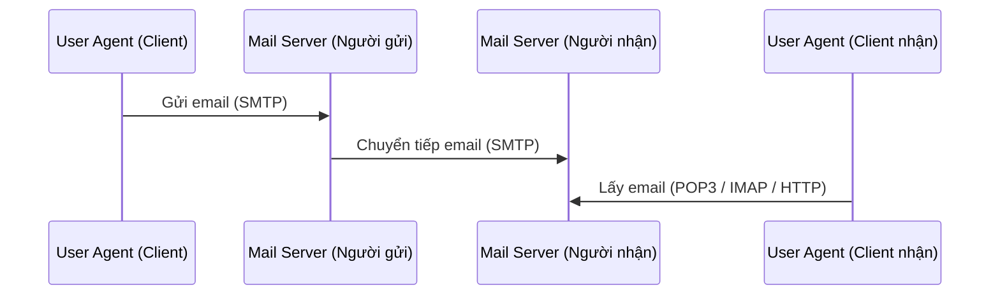
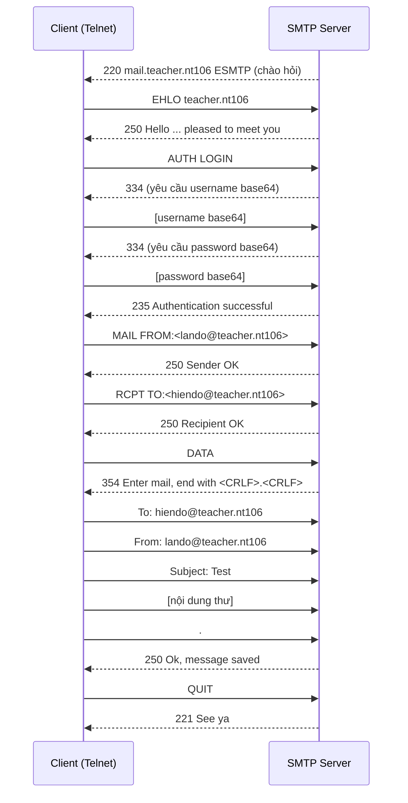
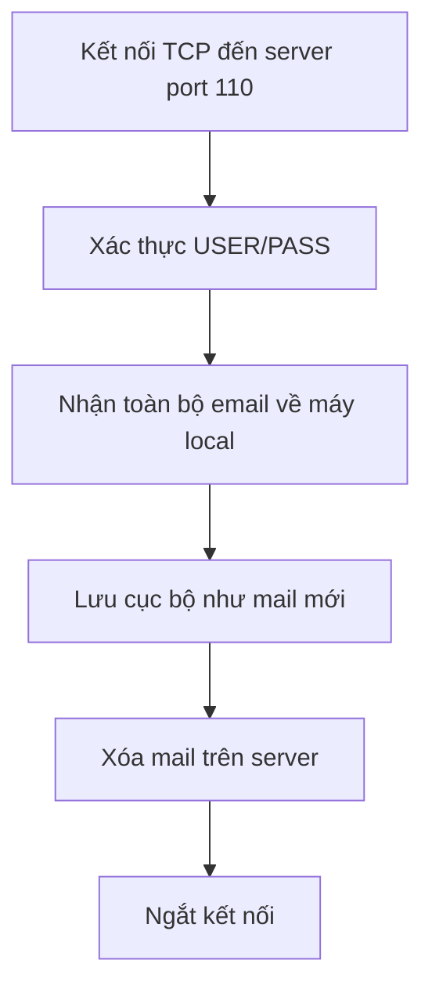
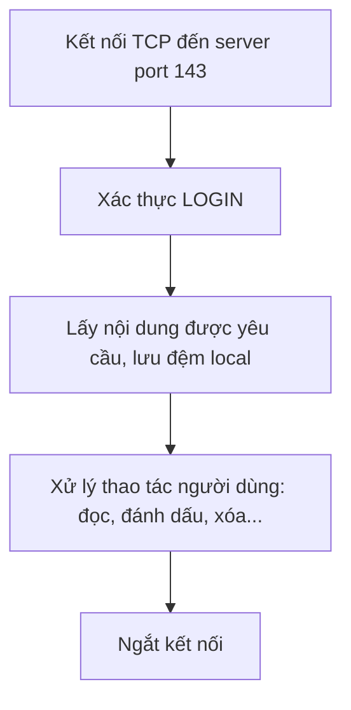

# Chương 5: Giao Tiếp Với Email

---

## 1. Giới Thiệu

Email (thư điện tử) là phương thức giao tiếp phổ biến và quan trọng nhất trong môi trường Internet. Lập trình quản lý email cho phép ứng dụng tự động gửi thông báo, nhận và xử lý thư — đây là kỹ năng thiết yếu trong phát triển phần mềm hiện đại.

---

## 2. Email Là Gì?

Mỗi địa chỉ email có dạng:

```
<Username>@<domain name>
```

Trong đó:
- `<domain name>`: phải **duy nhất toàn cầu** trên hệ thống DNS
- `<Username>`: chỉ cần **duy nhất trong mail server** của người nhận

**Ví dụ:** `hiendo@teacher.nt106`

---

## 3. Nguyên Tắc Hoạt Động Gửi/Nhận Mail



- **Gửi email:** Dùng giao thức **SMTP**
- **Nhận email:** Dùng **POP3** (port 110) hoặc **IMAP** (port 143)
- **Webmail:** Dùng giao thức **HTTP** (Gmail, Outlook Web...)

!!! info "Lưu ý quan trọng"
    Email **không được gửi trực tiếp** từ người gửi đến người nhận. Thư được xếp vào hàng đợi tại Mail Server của người gửi, sau đó Mail Server đó mới chuyển tiếp đến Mail Server của người nhận.

---

## 4. Email Clients và Webmail

| | Webmail | Email Client |
|---|---|---|
| Truy cập qua | Trình duyệt web | Ứng dụng cài đặt (Outlook, Thunderbird...) |
| Ví dụ | Gmail, Yahoo Mail | Microsoft Outlook, MDaemon |
| Giao thức | HTTP/HTTPS | SMTP, POP3, IMAP |

---

## 5. SMTP – Simple Mail Transfer Protocol

### 5.1 Đặc điểm

- Là giao thức **chỉ dùng để gửi** email
- Mọi mail server đều phải tuân theo chuẩn SMTP
- Dùng **TCP port 25**
- Có thể kiểm tra bằng `telnet`

### 5.2 Phiên làm việc SMTP



### 5.3 Cấu trúc một email (RFC 822)

```
To: hiendo@teacher.nt106
From: lando@teacher.nt106
Subject: Test mail
                          ← dòng trống phân cách header và body
Hello, This is a test mail from Telnet.
Goodbye.
```

!!! warning "Phân biệt header email và lệnh SMTP"
    - `MAIL FROM:` và `RCPT TO:` là **lệnh giao thức SMTP** (dùng khi thiết lập phiên)
    - `From:`, `To:`, `Subject:` là **header của nội dung email** (nằm trong phần DATA)
    Hai thứ này **khác nhau** và đều cần thiết.

---

## 6. Lập Trình Gửi Mail

### 6.1 Dùng `TcpClient` (giao tiếp SMTP thủ công)

Đây là cách giao tiếp trực tiếp với SMTP server ở mức socket, giúp hiểu rõ giao thức.

**Khai báo thư viện:**

```csharp
using System.Threading;
using System.Net;
using System.Net.Sockets;
using System.Text;
using System.IO;
```

**Kết nối đến SMTP server:**

```csharp
TcpClient tcpClient = new TcpClient();
tcpClient.Connect("127.0.0.1", 25);
```

**Đọc/ghi dữ liệu qua stream:**

```csharp
StreamReader sr = new StreamReader(tcpClient.GetStream());
StreamWriter sw = new StreamWriter(tcpClient.GetStream());
```

**Hàm mã hóa Base64** (SMTP yêu cầu username/password dạng Base64):

```csharp
static public string EncodeTo64(string toEncode)
{
    byte[] toEncodeAsBytes = System.Text.ASCIIEncoding.ASCII.GetBytes(toEncode);
    string returnValue = System.Convert.ToBase64String(toEncodeAsBytes);
    return returnValue;
}
```

**Toàn bộ luồng gửi mail:**

```csharp
// 1. Chào server
sw.WriteLine("EHLO teacher.nt106"); sw.Flush();

// 2. Chọn xác thực
sw.WriteLine("AUTH LOGIN"); sw.Flush();

// 3. Gửi username và password (base64)
sw.WriteLine(EncodeTo64(mailfrom)); sw.Flush();
sw.WriteLine(EncodeTo64(password)); sw.Flush();

// 4. Gửi địa chỉ người gửi và người nhận
sw.WriteLine("MAIL FROM:<" + mailfrom + ">"); sw.Flush();
sw.WriteLine("RCPT TO:<" + mailto + ">"); sw.Flush();

// 5. Bắt đầu nội dung
sw.WriteLine("DATA"); sw.Flush();
sw.WriteLine("Subject: " + subject); sw.Flush();
sw.WriteLine("From: " + mailfrom); sw.Flush();
sw.WriteLine("To: " + mailto); sw.Flush();
sw.WriteLine(""); // dòng trống
sw.WriteLine(body); sw.Flush();
sw.WriteLine("."); sw.Flush(); // kết thúc nội dung

// 6. Ngắt kết nối
sw.WriteLine("QUIT"); sw.Flush();
```

---

### 6.2 Dùng `SmtpClient` (thư viện .NET tích hợp)

Cách này đơn giản hơn nhiều, .NET lo phần giao thức:

```csharp
private void sendEmail_Click(object sender, EventArgs e)
{
    using (SmtpClient smtpClient = new SmtpClient("127.0.0.1"))
    {
        string mailfrom = txtMailFrom.Text.Trim();
        string mailto   = txtMailTo.Text.Trim();
        string password = txtPass.Text.Trim();

        var basicCredential = new NetworkCredential(mailfrom, password);

        using (MailMessage message = new MailMessage())
        {
            smtpClient.UseDefaultCredentials = false;
            smtpClient.Credentials = basicCredential;

            message.From    = new MailAddress(mailfrom);
            message.Subject = txtSubject.Text.Trim() + " From SMTPClient";
            message.IsBodyHtml = true;  // cho phép gửi HTML
            message.Body   = rtbBody.Text;
            message.To.Add(mailto);

            try
            {
                smtpClient.Send(message);
            }
            catch (Exception ex)
            {
                MessageBox.Show(ex.ToString());
            }
        }
    }
}
```

---

### 6.3 Dùng MailKit (khuyến nghị cho dự án thực tế)

!!! danger "Lưu ý từ Microsoft"
    Microsoft **không khuyến nghị** dùng `SmtpClient` cho các dự án mới vì lớp này không hỗ trợ nhiều giao thức hiện đại. Hãy dùng **MailKit** thay thế.

```
https://github.com/jstedfast/MailKit
```

MailKit hỗ trợ SMTP, POP3, IMAP đầy đủ, hỗ trợ TLS/SSL, OAuth2, và nhiều tính năng hiện đại khác.

---

## 7. POP3 – Post Office Protocol

### 7.1 Lịch sử và đặc điểm

- Ra đời năm **1984** do hạn chế tốc độ và băng thông lúc bấy giờ
- **POP2** ra đời năm 1985
- **POP3** là chuẩn phổ biến nhất hiện nay, định nghĩa trong **RFC 1939**, hoạt động trên **TCP port 110**
- Hỗ trợ tùy chọn "leave mail on server" (giữ lại thư trên server)

### 7.2 Luồng hoạt động POP3



### 7.3 Các lệnh POP3 quan trọng

| Lệnh | Mô tả |
|------|-------|
| `USER <username>` | Gửi tên đăng nhập |
| `PASS <password>` | Gửi mật khẩu |
| `STAT` | Xem trạng thái mailbox → `+OK <số thư> <dung lượng>` |
| `RETR <n>` | Lấy email thứ n |
| `DELE <n>` | Đánh dấu xóa email thứ n (chưa xóa ngay) |
| `RSET` | Hủy tất cả đánh dấu xóa |
| `QUIT` | Kết thúc phiên, xóa thật các mail đã DELE |

!!! info "Cơ chế xóa trong POP3"
    Khi gửi lệnh `DELE`, email **chưa bị xóa ngay** mà chỉ bị đánh dấu. Chỉ khi gửi `QUIT` thì server mới thực sự xóa các thư đó. Nếu muốn hủy, dùng `RSET` trước khi `QUIT`.

---

## 8. IMAP – Internet Message Access Protocol

### 8.1 Đặc điểm

- Ra đời năm **1986**, định nghĩa trong **RFC 1730**, chạy trên **TCP port 143**
- Ý tưởng cốt lõi: cho phép người dùng **xem email từ nhiều thiết bị khác nhau**
- Email **lưu trên server**, không tải hết về máy
- Hỗ trợ **flags** (đánh dấu đã đọc, đã trả lời, đã chuyển tiếp...)

### 8.2 Luồng hoạt động IMAP



### 8.3 Các lệnh IMAP quan trọng

```
a1 LOGIN <username> <password>
   → OK LOGIN completed

a2 LIST "" "*"
   → Liệt kê tất cả folder (INBOX, Sent, Drafts...)

a3 EXAMINE INBOX
   → Xem thông tin hộp thư đến (số thư, flags...)

a4 FETCH <n> BODY[]
   → Lấy nội dung email thứ n

a5 STORE <n> +FLAGS \Deleted
   → Đánh dấu xóa email thứ n

a6 LOGOUT
   → Đăng xuất
```

---

## 9. So Sánh POP3 và IMAP

??? note "Bảng so sánh chi tiết"

    | Tiêu chí | POP3 | IMAP |
    |---|---|---|
    | Lưu trữ email | Tải về máy local, xóa server | Giữ trên server |
    | Đa thiết bị | ❌ Không tốt | ✅ Tốt |
    | Offline | ✅ Đọc được | ❌ Cần Internet |
    | Dung lượng server | ✅ Ít tốn | ❌ Tốn nhiều |
    | Đồng bộ trạng thái | ❌ Không | ✅ Có (flags) |
    | Port | 110 | 143 |
    | RFC | 1939 | 1730 |

**Chọn POP3 khi:**
- Chỉ dùng email trên một thiết bị duy nhất
- Cần đọc email khi không có Internet
- Dung lượng lưu trữ trên server hạn chế

**Chọn IMAP khi:**
- Dùng email trên nhiều thiết bị (PC, điện thoại, laptop...)
- Có kết nối Internet ổn định
- Muốn xem nhanh mail mới mà không tải hết về
- Dung lượng máy local hạn chế
- Cần sao lưu/dự phòng dữ liệu trên server

---

## 10. Câu Hỏi Ôn Tập

??? question "Sự khác nhau giữa lệnh SMTP `MAIL FROM:` và header `From:` trong email là gì?"
    - `MAIL FROM:<addr>` là **lệnh giao thức SMTP** — dùng trong quá trình bắt tay giữa 2 mail server để định tuyến thư. Server dùng thông tin này để biết ai gửi.
    - `From: addr` là **trường header** nằm bên trong nội dung email (phần DATA). Đây là thứ người dùng nhìn thấy trong ứng dụng email.
    - Hai giá trị này có thể **khác nhau** — đó là kỹ thuật thường dùng trong email spoofing.

??? question "Tại sao SMTP yêu cầu username/password phải mã hóa Base64?"
    Base64 không phải mã hóa bảo mật — nó chỉ là cách **biểu diễn dữ liệu nhị phân dưới dạng ASCII**. SMTP là giao thức văn bản thuần túy, chỉ truyền được ký tự ASCII. Base64 đảm bảo mọi ký tự đặc biệt trong mật khẩu đều truyền được. Để bảo mật thực sự, cần dùng **SMTPS (port 465)** hoặc **STARTTLS (port 587)**.

??? question "Tại sao email không gửi trực tiếp từ người gửi đến người nhận?"
    Vì người gửi và người nhận có thể không kết nối mạng cùng lúc. Mail server đóng vai trò **hàng đợi trung gian (store-and-forward)**: lưu thư lại, rồi thử gửi nhiều lần đến khi thành công. Nếu thất bại sau một thời gian, server sẽ gửi thông báo lỗi về cho người gửi.

??? question "Vì sao Microsoft không khuyến nghị dùng `SmtpClient` cho dự án mới?"
    Lớp `SmtpClient` trong .NET không hỗ trợ: OAuth2, các cơ chế xác thực hiện đại, và một số tính năng TLS nâng cao. Nó được thiết kế từ thời .NET Framework cũ và không được cập nhật đầy đủ. **MailKit** là giải pháp thay thế được khuyến nghị, đầy đủ tính năng và được duy trì tích cực.
