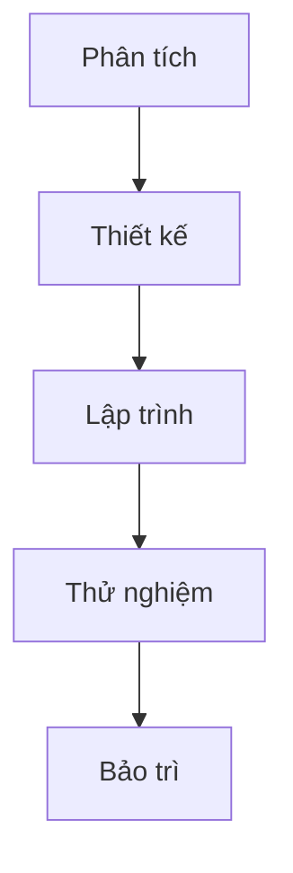
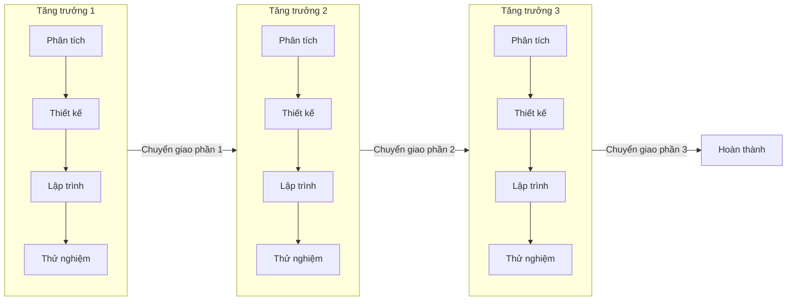
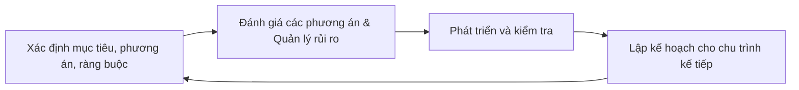
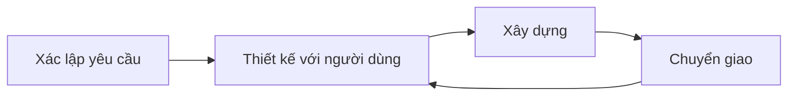
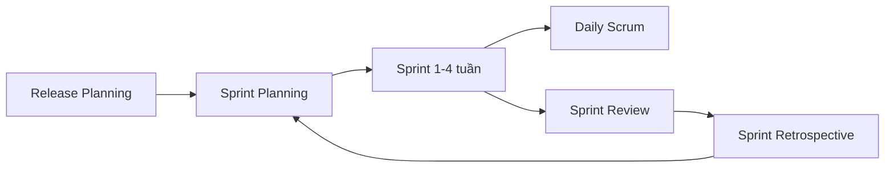
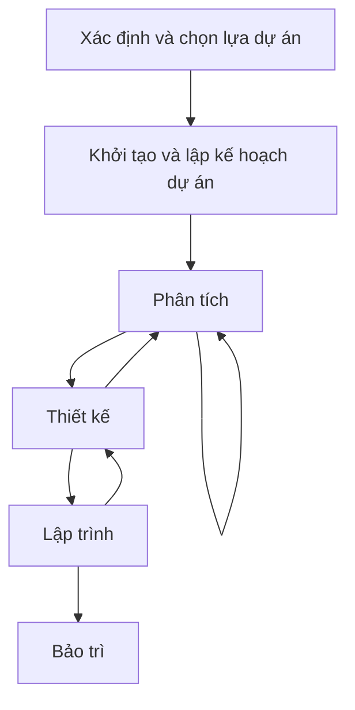

# Chương 1: Quy Trình Phát Triển Phần Mềm

## 1. Tổng Quan

### 1.1 Các Khái Niệm Cơ Bản

**Chu trình phát triển hệ thống** là toàn bộ vòng đời của một hệ thống phần mềm, bao gồm nhiều giai đoạn từ khi bắt đầu dự án cho đến khi kết thúc khai thác hệ thống.

**Quy trình phát triển** là tập hợp có cấu trúc các hoạt động cần thiết để phát triển một hệ thống, bao gồm các giai đoạn và trình tự thực hiện của chúng.

**Mô hình** là phương tiện biểu diễn nội dung của hệ thống qua các giai đoạn của quy trình.

---

### 1.2 Quy Trình Phần Mềm Là Gì?

Quy trình phần mềm là một tập các hoạt động nhằm mục đích phát triển và cải tiến phần mềm. Các hoạt động chung bao gồm:

- **Đặc điểm kỹ thuật (Specification):** Xác định hệ thống làm gì và các ràng buộc trong quá trình phát triển.
- **Phát triển (Development):** Tạo ra sản phẩm phần mềm theo yêu cầu.
- **Xác nhận (Validation):** Kiểm tra sản phẩm có đúng với yêu cầu người dùng hay không.
- **Cải tiến (Evolution):** Thay đổi phần mềm để đáp ứng những yêu cầu mới phát sinh.

### 1.3 Phần Mềm/Hệ Thống Tốt

Một phần mềm tốt cần cung cấp đủ tính năng cho người dùng, có thể bảo trì, đáng tin cậy và được người dùng chấp nhận. Các đặc tính cụ thể:

- **Khả năng bảo trì:** Phần mềm phải dễ dàng thay đổi để đáp ứng các yêu cầu mới.
- **Tính tin cậy:** Hệ thống hoạt động ổn định, ít lỗi.
- **Tính hiệu quả:** Không lãng phí tài nguyên hệ thống (CPU, bộ nhớ, băng thông).
- **Chấp nhận được:** Phần mềm dễ hiểu, dễ sử dụng và tương thích với các hệ thống khác mà người dùng đang dùng.

---

## 2. Các Yếu Tố Lựa Chọn Quy Trình

Không có một quy trình nào phù hợp với tất cả các dự án. Việc lựa chọn quy trình phụ thuộc vào nhiều yếu tố:

**Kiểu/loại của hệ thống:**

- Xây dựng mới hay nâng cấp hệ thống cũ
- Hệ thống phổ biến hay đặc thù (dùng nội bộ)
- Yêu cầu đã rõ ràng hay còn thay đổi liên tục
- Hệ thống trọng yếu (an toàn, bảo mật cao) hay hệ thống nghiệp vụ thông thường

**Quy mô dự án:** Số lượng nhân sự, ngân sách, thời gian hoàn thành.

**Đặc điểm nhóm phát triển:** Kinh nghiệm, kỹ năng, động cơ, thái độ làm việc của từng thành viên.

**Kinh phí:** Ngân sách ảnh hưởng trực tiếp đến mức độ tài liệu hóa, số vòng lặp, và công cụ sử dụng.

---

## 3. Các Hoạt Động Cơ Bản Của Quy Trình

Dù sử dụng quy trình nào, một dự án phần mềm thường đi qua các hoạt động sau:

```
Lên kế hoạch
  -> Khảo sát hiện trạng
    -> Nghiên cứu tính khả thi
      -> Phân tích và đặc tả yêu cầu
        -> Thiết kế
          -> Thực hiện / Cài đặt
            -> Kiểm thử
              -> Triển khai
                -> Bảo trì
```

---

## 4. Hai Hướng Tiếp Cận Phát Triển Phần Mềm

### 4.1 Plan-driven (Dựa trên kế hoạch)

Toàn bộ quy trình được lập kế hoạch trước, mọi hoạt động đều được hướng dẫn bởi tài liệu và kế hoạch cụ thể. Còn gọi là **disciplined methods** (phương pháp kỷ luật) hoặc phương pháp truyền thống.

**Ưu điểm:**

- Đảm bảo cao, thích hợp cho hệ thống quan trọng về tính an toàn
- Phù hợp với các hệ thống lớn, có nhiều team làm việc song song
- Tài liệu đầy đủ giúp đào tạo nhân viên mới dễ dàng
- Mọi người đều làm việc theo quy trình rõ ràng, thống nhất

**Nhược điểm:**

- Tài liệu quá nhiều, dễ trở nên lỗi thời và không còn giá trị thực tế
- Không linh hoạt khi yêu cầu thay đổi giữa chừng
- Cản trở việc cải tiến liên tục
- Kỹ sư thường không thích viết tài liệu quá nhiều

### 4.2 Agile (Linh hoạt)

Tập trung vào sự linh hoạt, phản hồi nhanh với thay đổi, giảm thiểu tài liệu không cần thiết. Sẽ được trình bày chi tiết ở phần sau.

---

## 5. Các Mô Hình Quy Trình Thông Dụng

### 5.1 Quy Trình Thác Nước (Waterfall)

**Nguồn gốc:** Royce, 1970.

Gồm 5 giai đoạn tuần tự. Một giai đoạn chỉ được bắt đầu khi giai đoạn trước đó đã hoàn thành. Không có sự quay lui về giai đoạn trước (trong phiên bản gốc).



**Ưu điểm:**

- Đơn giản, nổi tiếng, dễ hiểu và dễ áp dụng
- Tài liệu được hoàn thành sau mỗi giai đoạn, rõ ràng cho tất cả các bên
- Yêu cầu được cung cấp sớm cho nhóm kiểm thử
- Người quản lý dự án dễ lập kế hoạch và kiểm soát tiến độ

**Nhược điểm:**

- Chỉ phù hợp khi yêu cầu đã rõ ràng, đầy đủ và cố định ngay từ đầu
- Không phù hợp với các dự án kéo dài, yêu cầu thay đổi nhiều
- Rủi ro cao vì lỗi phát hiện muộn (thường ở giai đoạn kiểm thử)
- Lãng phí nguồn lực nếu phải làm lại do yêu cầu thay đổi

> **Biến thể cải tiến:** Waterfall sửa đổi (Revised Waterfall) cho phép quay lui về giai đoạn trước khi phát hiện vấn đề, giúp linh hoạt hơn mà vẫn giữ được tính tuần tự.

**Khi nào nên dùng Waterfall:**

- Yêu cầu xác định rõ ràng, đầy đủ và không thay đổi
- Định nghĩa về sản phẩm ổn định
- Công nghệ sử dụng đã được nhóm nắm vững
- Nhóm có đủ kinh nghiệm và nguồn lực
- Thời gian thực hiện ngắn

---

### 5.2 Quy Trình Tăng Trưởng (Incremental)

**Nguồn gốc:** D. R. Graham, 1989.

Thay vì xây dựng toàn bộ hệ thống cùng một lúc, quy trình này chia hệ thống thành nhiều phần (increment). Mỗi phần được phát triển hoàn chỉnh theo một vòng tuyến tính (phân tích - thiết kế - lập trình - thử nghiệm) rồi chuyển giao cho khách hàng, trước khi chuyển sang phần tiếp theo.



**Ưu điểm:** Khách hàng nhận được sản phẩm sớm từng phần, dễ phản hồi.

**Nhược điểm:** Chỉ phù hợp với những hệ thống có thể phân chia rõ ràng và chuyển giao theo từng phần độc lập. Nếu các thành phần có sự phụ thuộc chặt chẽ nhau, mô hình này rất khó áp dụng.

---

### 5.3 Quy Trình Xoắn Ốc (Spiral)

**Nguồn gốc:** Boehm, 1988.

Thay vì các giai đoạn tuyến tính, quy trình được tổ chức thành các vòng xoắn ốc lặp đi lặp lại. Mỗi vòng xoắn đại diện cho một chu kỳ phát triển và bao gồm 4 hoạt động chính:



Mỗi vòng xoắn ở phía ngoài sẽ phức tạp và chi tiết hơn vòng ở phía trong. Điểm đặc trưng quan trọng nhất là **quản lý rủi ro** được thực hiện xuyên suốt toàn bộ quy trình.

**Ưu điểm:**

- Giảm thiểu rủi ro một cách chủ động
- Phù hợp với các dự án lớn, phức tạp và quan trọng
- Có thể bổ sung chức năng mới ở các vòng sau
- Các phiên bản đầu của hệ thống được tạo ra sớm để phản hồi

**Nhược điểm:**

- Chi phí cao về thời gian, nguồn lực và tiền bạc
- Đòi hỏi kỹ năng và kinh nghiệm cao, đặc biệt là kỹ năng phân tích rủi ro
- Sự thành công phụ thuộc lớn vào chất lượng của giai đoạn phân tích rủi ro
- Không phù hợp cho các dự án nhỏ

**Khi nào nên dùng Spiral:**

- Khi việc đánh giá chi phí và rủi ro là quan trọng
- Dự án có độ rủi ro trung bình đến cao
- Người dùng chưa chắc chắn về nhu cầu của họ
- Yêu cầu phần mềm phức tạp và quy mô lớn
- Cần phát triển một dòng sản phẩm hoàn toàn mới
- Mong muốn có các thay đổi lớn, cần nghiên cứu và khảo sát kỹ trước khi thực hiện

---

### 5.4 Quy Trình Phát Triển Nhanh (RAD)

**Nguồn gốc:** James Martin, 1991.

RAD (Rapid Application Development) sử dụng công cụ và môi trường phát triển phần mềm hiện đại để đẩy nhanh tiến độ. Quá trình lặp và điều chỉnh liên tục dựa trên phản hồi của người dùng.



Điểm đặc trưng là sự tham gia trực tiếp của người dùng trong giai đoạn thiết kế, giúp sản phẩm sát với nhu cầu thực tế hơn.

---

### 5.5 RUP (Rational Unified Process)

**Nguồn gốc:** Rational Software (nay là IBM Rational).

RUP là một quy trình phổ biến, được mô tả từ 3 ngữ cảnh:

- **Ngữ cảnh tự động (dynamic):** Các pha theo thời gian.
- **Ngữ cảnh cố định (static):** Các hoạt động của quy trình.
- **Ngữ cảnh thực tế (practice):** Đề xuất các good practice.

**4 pha hoạt động:**

| Pha | Mô tả | Số vòng lặp |
|---|---|---|
| Inception (Khởi tạo) | Thiết lập phạm vi và trường hợp kinh doanh của hệ thống | 1–2 |
| Elaboration (Chi tiết hóa) | Phát triển hiểu biết về vấn đề và kiến trúc hệ thống | 1–3 |
| Construction (Xây dựng) | Thiết kế, lập trình và kiểm tra hệ thống | 2–3 |
| Transition (Chuyển giao) | Triển khai hệ thống vào môi trường vận hành | 2–3 |

Mỗi pha được chia thành một hoặc nhiều vòng lặp. Mỗi vòng lặp về bản chất là một chu trình Waterfall nhỏ với điều kiện vào và ra rõ ràng.

**Các workflow (luồng công việc) trong RUP:**

- **Business Modeling:** Mô hình hóa quy trình kinh doanh bằng use case kinh doanh.
- **Requirements:** Xác định yêu cầu, xây dựng mô hình use-case.
- **Analysis & Design:** Tạo kiến trúc và thiết kế hệ thống qua nhiều góc nhìn (use-case view, design view, process view, implementation view, deployment view).
- **Implementation:** Hiện thực các thành phần phần mềm.
- **Testing:** Kiểm tra và xác nhận sản phẩm đối với các yêu cầu.
- **Deployment:** Phát hành, triển khai sản phẩm và hỗ trợ người dùng.
- **Configuration & Change Management (SCM):** Quản lý các thay đổi đối với sản phẩm.
- **Project Management:** Quản lý dự án.
- **Environment:** Chuẩn bị và đảm bảo công cụ, quy trình, phần cứng cho đội phát triển.

---

## 6. Phương Pháp Agile

### 6.1 Tuyên Ngôn Agile

Agile được xây dựng trên **4 tiêu chí** cốt lõi:

> Ưu tiên **cá nhân và tương tác** hơn quy trình và công cụ.
>
> Ưu tiên **phần mềm hoạt động tốt** hơn tài liệu đầy đủ.
>
> Ưu tiên **cộng tác với khách hàng** hơn thỏa thuận hợp đồng.
>
> Ưu tiên **đáp ứng thay đổi** hơn việc theo kế hoạch.

*Lưu ý: Vế bên phải vẫn có giá trị, nhưng vế bên trái được ưu tiên hơn.*

**12 nguyên lý Agile:**

1. Ưu tiên cao nhất là làm khách hàng hài lòng bằng cách chuyển giao phần mềm có giá trị sớm và liên tục.
2. Hoan nghênh yêu cầu thay đổi, ngay cả ở giai đoạn gần cuối dự án.
3. Chuyển giao phần mềm hoạt động thường xuyên, từ vài tuần đến vài tháng, ưu tiên chu kỳ ngắn hơn.
4. Doanh nghiệp và developer làm việc cùng nhau hàng ngày trong suốt dự án.
5. Xây dựng dự án với các cá nhân có động lực cao: cung cấp môi trường, hỗ trợ cần thiết và tin tưởng họ.
6. Giao tiếp trực tiếp (face-to-face) là phương thức truyền đạt thông tin hiệu quả nhất.
7. Phần mềm hoạt động tốt là thước đo tiến độ dự án quan trọng nhất.
8. Quy trình Agile thúc đẩy phát triển bền vững — tốc độ đều đặn, không kiệt sức.
9. Liên tục tập trung vào kỹ thuật vượt trội và thiết kế tốt để tăng sự linh hoạt.
10. Đơn giản hóa — tối đa hóa lượng công việc không cần làm — là cần thiết.
11. Kiến trúc, yêu cầu và thiết kế tốt nhất xuất hiện từ các nhóm tự tổ chức (self-organizing teams).
12. Định kỳ team nhìn lại để tìm cách làm hiệu quả hơn, rồi điều chỉnh theo đó.

---

### 6.2 Extreme Programming (XP)

XP theo nguyên tắc: *Những gì đã làm tốt thì hãy làm nó tốt hơn nữa và làm thường xuyên hơn.*

**12 practices của XP:**

??? note "1. The Planning Game"
    Sử dụng **user story** để truyền đạt yêu cầu. Người có hiểu biết tốt nhất sẽ đưa ra quyết định trong lĩnh vực của mình (khách hàng quyết định thương mại, developer quyết định kỹ thuật). Chỉ lập kế hoạch dựa trên những gì đã hiểu rõ: vòng lặp hay lần phát hành kế tiếp.

??? note "2. Small Releases"
    Phát hành phiên bản nhỏ thường xuyên để nhận phản hồi nhanh từ người dùng, đơn giản hóa việc theo dõi tiến độ và tăng cường khả năng quản lý của khách hàng với dự án.

??? note "3. Metaphor"
    Xây dựng một câu chuyện (story) chung về cách toàn bộ hệ thống hoạt động, giúp mọi người có cùng cái nhìn tổng quan và kết nối mã nguồn với quy trình làm việc thực tế.

??? note "4. Simple Design"
    Thiết kế chỉ nên thể hiện sự phức tạp cần thiết ở thời điểm hiện tại. Thiết kế càng đơn giản thì càng dễ thay đổi, dễ bảo trì và giảm chi phí khi cần sửa đổi.

??? note "5. Testing"
    - **Unit test:** Do lập trình viên tự viết và chạy liên tục, giúp phát hiện bug nhanh.
    - **Functional test:** Do khách hàng thực hiện để xác nhận chức năng đã hoàn chỉnh theo yêu cầu.

??? note "6. Refactoring"
    Liên tục chỉnh sửa mã nguồn để cải thiện cấu trúc bên trong mà không thay đổi chức năng bên ngoài. Mục tiêu: code chạy nhanh hơn, dễ hiểu hơn và dễ tích hợp chức năng mới hơn.

??? note "7. Pair Programming"
    Hai lập trình viên làm việc cùng nhau trên một máy: một người là **driver** (viết code), một người là **navigator** (quan sát, định hướng). Hai người đổi vai sau một khoảng thời gian. Cách làm này giúp kiểm tra lỗi liên tục, truyền đạt kiến thức và giảm rủi ro phụ thuộc vào một cá nhân.

??? note "8. Collective Ownership"
    Mã nguồn thuộc sở hữu chung của cả nhóm: bất kỳ ai cũng có thể chỉnh sửa bất kỳ phần nào của code. Không có khái niệm "code của riêng tôi". Điều này giúp tránh tình trạng chỉ một người hiểu một module nhất định.

??? note "9. Continuous Integration"
    Hệ thống luôn ở trạng thái có thể build và phát hành. Vòng lặp: Lập trình → Build → Kiểm tra → Phát hành → Vận hành. Tích hợp nhiều lần trong ngày giúp phát hiện vấn đề sớm và phản hồi nhanh đến developer.

??? note "10. 40-hour Week"
    Làm việc với tốc độ bền vững, không làm thêm giờ liên tục (không làm thêm giờ quá 2 tuần liên tiếp). Mục tiêu là duy trì chất lượng công việc lâu dài, không chạy nước rút kiệt sức.

??? note "11. On-site Customer"
    Khách hàng tham gia trực tiếp tại nơi phát triển để giải đáp các câu hỏi và vấn đề phát sinh ngay lập tức. Developer không cần biết tất cả — kiến thức kinh doanh từ khách hàng là chìa khóa thành công.

??? note "12. Coding Standards"
    Áp dụng chuẩn viết code thống nhất trong cả team giúp mọi người dễ đọc, dễ hiểu và dễ bảo trì code của nhau, đặc biệt quan trọng khi kết hợp với Collective Ownership.

---

### 6.3 SCRUM

#### Khái Niệm

SCRUM là một phương pháp Agile lặp lại và triển khai từng bước, áp dụng một tập các practices và rules đơn giản để phát triển dần dần các sản phẩm.

**Lịch sử:** Bắt đầu năm 1986 bởi Hirotaka Takeuchi và Ikujiro Nonaka, được phát triển thành framework chính thức bởi Ken Schwaber và Jeff Sutherland.

#### Các Giá Trị Của SCRUM

- **Commitment (Cam kết):** Mọi người cam kết đạt mục tiêu của nhóm trong mỗi ngày và mỗi Sprint.
- **Courage (Can đảm):** Khuyến khích làm việc nhóm, dám đối mặt với thách thức.
- **Focus (Tập trung):** Thành viên tập trung vào các task hiện tại, không phân tán.
- **Openness (Minh bạch):** Cả nhóm và khách hàng đều rõ ràng về tiến độ và thách thức.
- **Respect (Tôn trọng):** Các thành viên tôn trọng lẫn nhau về kỹ năng và đóng góp.

#### Các Khái Niệm Quan Trọng

**Sprint:** Một chu kỳ phát triển định trước, thường kéo dài từ 1 đến 4 tuần. Cuối mỗi Sprint thường có chuyển giao một phần sản phẩm. Bản chất mỗi Sprint là một vòng Waterfall thu nhỏ.

**Backlog:** Danh sách công việc cần thực hiện, có 3 loại:

| Loại | Mô tả |
|---|---|
| Product Backlog | Toàn bộ danh sách yêu cầu sản phẩm theo thứ tự ưu tiên |
| Sprint Backlog | Các yêu cầu được chọn để thực hiện trong Sprint hiện tại |
| Impediments Backlog | Danh sách các vấn đề, trở ngại cần giải quyết |

**Daily Scrum:** Cuộc họp ngắn hàng ngày (dưới 30 phút) để cả team theo dõi tình trạng và trao đổi các vấn đề. Thường xoay quanh 3 câu hỏi: *Hôm qua tôi làm gì? Hôm nay tôi sẽ làm gì? Tôi đang gặp trở ngại gì?*

**Burndown Chart:** Biểu đồ thể hiện tiến trình làm việc — số lượng backlog item đã hoàn thành theo thời gian, giúp nhìn thấy team đang đúng tiến độ hay bị chậm.

#### Các Vai Trò Trong SCRUM

| Vai trò | Trách nhiệm |
|---|---|
| Scrum Master | Tạo điều kiện thực hiện Scrum, loại bỏ trở ngại, đảm bảo các nguyên tắc Scrum được tuân thủ |
| Product Owner | Đưa ra tầm nhìn và yêu cầu sản phẩm, ưu tiên Product Backlog, cầu nối giữa team và khách hàng |
| Team | Ước lượng backlog, tạo Sprint Backlog, thực hiện các item |
| Manager | Đảm bảo đủ tài nguyên, quản lý tài nguyên, xây dựng và phát triển team |

#### Các Hoạt Động Trong SCRUM



- **Release Planning:** Ưu tiên và sắp xếp các tính năng để lên kế hoạch phát hành.
- **Sprint Planning:** Xác định mục tiêu Sprint và chọn các item từ Product Backlog vào Sprint Backlog.
- **Daily Scrum:** Theo dõi tình trạng dự án hàng ngày.
- **Sprint Review:** Xem lại các tính năng đã hoàn thành trong Sprint, demo cho khách hàng.
- **Sprint Retrospective:** Nhìn lại cách làm việc của team — cái gì đã làm tốt, điều gì cần cải thiện?

---

### 6.4 Đánh Giá Agile

#### Dự Án Phù Hợp

Agile phù hợp nhất với các dự án có đặc điểm:

- Team nhỏ, khoảng 2 đến 20 người
- Vòng lặp ngắn, từ 1 đến 2 tuần
- Nhóm tập trung tại một vị trí — không khuyến khích với nhóm phân tán địa lý
- Các hệ thống không yêu cầu cao về tính an toàn (safety-critical)

#### Ưu và Nhược Điểm

| Ưu điểm | Nhược điểm |
|---|---|
| Phù hợp với môi trường năng động, thay đổi nhiều | Yêu cầu cá nhân có khả năng cao và động lực tốt |
| Hỗ trợ yêu cầu phát sinh, thay đổi nhanh chóng | Khó triển khai với hệ thống yêu cầu an toàn cao |
| Hạn chế tài liệu dư thừa, không cần thiết | Không phù hợp với dự án lớn, nhiều team |
| Trao quyền và khuyến khích con người | Thiếu tài liệu có thể gây khó khăn khi onboard nhân viên mới |

---

## 7. So Sánh Plan-driven và Agile

| Đặc điểm | Agile | Plan-driven |
|---|---|---|
| Mục tiêu chính | Giá trị nhanh, đáp ứng thay đổi | Sự dự đoán, ổn định, đảm bảo cao |
| Kích thước | Team và dự án nhỏ hơn | Team và dự án lớn hơn |
| Môi trường | Năng động, thay đổi cao | Ổn định, ít thay đổi |
| Liên hệ khách hàng | Khách hàng on-site, liên tục | Tương tác theo lịch, dựa trên hợp đồng |
| Kế hoạch | Kế hoạch nội bộ, quản lý định tính | Kế hoạch tài liệu hóa đầy đủ |
| Giao tiếp | Hiểu biết ngầm giữa các cá nhân | Tài liệu hóa rõ ràng, chính thức |
| Yêu cầu | Informal story, thay đổi không lường trước | Formal, dự đoán được, kiểm soát được |
| Phát triển | Thiết kế đơn giản, increment ngắn, refactor rẻ | Kiến trúc song song, increment dài, refactor tốn kém |
| Kiểm tra | Test case thực thi xác định yêu cầu | Kế hoạch kiểm tra và phương pháp được tài liệu hóa |

---

## 8. Quy Trình Áp Dụng Trong Học Phần

Quy trình được gợi ý trong môn học tương tự RAD, gồm các giai đoạn:



### 8.1 Tính Chất Của Quy Trình

**Tính tuần tự:** Các giai đoạn được thực hiện từ trên xuống. Kết quả của giai đoạn trước là đầu vào bắt buộc cho giai đoạn sau.

**Tính lặp:** Mỗi giai đoạn có thể quay lui về giai đoạn trước nếu phát hiện vấn đề. Lặp cho đến khi kết quả được chấp nhận.

**Tính song song:** Trong một giai đoạn, nhiều hoạt động có thể được thực hiện đồng thời, thậm chí song song với hoạt động của giai đoạn khác.

---

### 8.2 Giai Đoạn 1: Xác Định và Chọn Lựa Dự Án

Đây là bước đầu tiên để quyết định có thực hiện dự án hay không, dựa trên:

- Nhu cầu thực tế nhận được từ khách hàng hoặc thị trường
- Nguồn lực tồn tại và có sẵn của tổ chức
- Các dự án tiềm năng đang trong hàng chờ
- Môi trường tổ chức hiện hành
- Tiêu chuẩn đánh giá và ưu tiên

**Kết quả quyết định có thể là:**

- Chấp nhận dự án → tiến hành
- Từ chối dự án → không thực hiện
- Hoãn dự án → thực hiện sau
- Xem xét lại dự án → cần thêm thông tin

---

### 8.3 Giai Đoạn 2: Khởi Tạo và Lập Kế Hoạch

- Thành lập đội ngũ nhân viên với vai trò rõ ràng
- Khảo sát tổng thể hệ thống để hiểu bức tranh chung
- Lập kế hoạch chi tiết (timeline, milestone, resource)
- Xác định phạm vi, nguồn lực và nguyên tắc làm việc
- Đánh giá khả thi (kỹ thuật, kinh tế, vận hành)
- Xây dựng tài liệu mô tả hệ thống ban đầu

---

### 8.4 Giai Đoạn 3: Phân Tích

- Xác định yêu cầu của hệ thống (chức năng và phi chức năng)
- Cấu trúc hóa các yêu cầu: mô hình hóa, phân tích để làm rõ và loại bỏ mâu thuẫn
- Áp dụng các phương pháp: phân tích cấu trúc, phân tích hướng đối tượng
- Phát sinh các phương án giải quyết và chọn phương án khả thi nhất

---

### 8.5 Giai Đoạn 4: Thiết Kế

**Thiết kế luận lý (Logical Design):** Xác định *cái gì* cần xây dựng, không phụ thuộc vào công nghệ cụ thể:

- Thiết kế dữ liệu (cấu trúc dữ liệu, mối quan hệ)
- Thiết kế kiến trúc (các module, thành phần và mối quan hệ)
- Thiết kế giao diện (luồng màn hình, wireframe)

**Thiết kế vật lý (Physical Design):** Chuyển đổi thiết kế luận lý sang đặc tả kỹ thuật cụ thể — phần cứng, phần mềm, công nghệ được chọn để cài đặt thực tế.

---

### 8.6 Giai Đoạn 5: Cài Đặt

- **Lập trình:** Viết code theo thiết kế đã duyệt
- **Thử nghiệm:** Unit test, integration test, system test, user acceptance test
- **Xây dựng tài liệu:**
    - Tài liệu đặc tả hệ thống
    - Tài liệu hướng dẫn sử dụng
    - Tài liệu cấu hình và cài đặt
- **Huấn luyện sử dụng:** Đào tạo người dùng cuối

---

### 8.7 Giai Đoạn 6: Bảo Trì

- Sửa các lỗi phát sinh trong quá trình vận hành thực tế
- Điều chỉnh hệ thống phù hợp khi có nhu cầu thay đổi từ nghiệp vụ
- Nâng cấp lên hệ thống mới khi công nghệ hoặc yêu cầu thay đổi lớn

---

## 9. Tổng Hợp: Các Giai Đoạn, Đầu Ra và Người Chịu Trách Nhiệm

| Giai đoạn | Đầu ra | Người chịu trách nhiệm |
|---|---|---|
| Requirement / Planning | Tài liệu yêu cầu khách hàng, Proposal, Project Plan | Sales, BA, PM, Customer |
| Analysis | Tài liệu đặc tả yêu cầu phần mềm (SRS) | PM, BA, Senior Developer |
| Design | Hồ sơ thiết kế, Flowchart, Diagram | Designer, BA |
| Coding | Source Code (sản phẩm phần mềm) | Developers |
| Testing | Test case, Test plan, Bug Report | QA, Tester |
| Deployment & Maintenance | Tài liệu đặc tả hệ thống, Tài liệu hướng dẫn sử dụng, Tài liệu cài đặt | DevOps |
